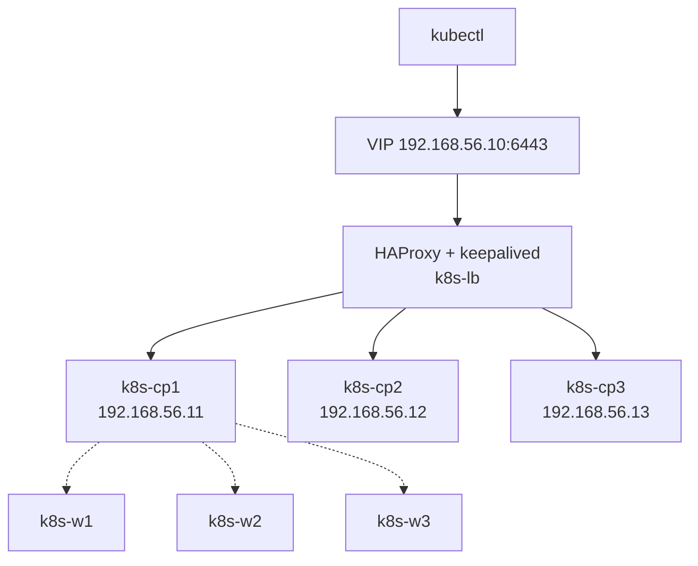

# kubeadmで自前クラスタ構築 (HA)
{: .no_toc }

## 目次
{: .no_toc .text-delta }

1. TOC
{:toc}

---

ここがローカル完結型 K8s 学習の山場です。VMware Workstation 上に **マスター3+ワーカー3** の HA 構成を kubeadm で構築します。

## 構成



| ホスト | IP | 役割 | スペック |
|--------|----|----|----------|
| k8s-lb | 192.168.56.10 | HAProxy + keepalived (VIP も 10) | 1vCPU 1GB |
| k8s-cp1〜3 | 192.168.56.11-13 | Control Plane | 2vCPU 4GB |
| k8s-w1〜3 | 192.168.56.21-23 | Worker | 2vCPU 4GB |
| k8s-nfs | 192.168.56.30 | NFSサーバ | 1vCPU 2GB |

合計 RAM: 1+4×3+4×3+2 = **27GB**(128GB あれば余裕)

## Step1: VM 全台共通の前準備

OS は Ubuntu 22.04 LTS を使用。

```bash
# (root or sudoで)
hostnamectl set-hostname <ホスト名>

# /etc/hosts に全ノード追記
cat <<EOF | tee -a /etc/hosts
192.168.56.10 k8s-lb k8s-api
192.168.56.11 k8s-cp1
192.168.56.12 k8s-cp2
192.168.56.13 k8s-cp3
192.168.56.21 k8s-w1
192.168.56.22 k8s-w2
192.168.56.23 k8s-w3
192.168.56.30 k8s-nfs
EOF

# Swap 無効化
swapoff -a
sed -i '/ swap / s/^\(.*\)$/#\1/g' /etc/fstab

# UFW 無効化(学習用; 本番ではきちんと開ける)
ufw disable

# カーネルモジュール
cat <<EOF > /etc/modules-load.d/k8s.conf
overlay
br_netfilter
EOF
modprobe overlay
modprobe br_netfilter

# sysctl
cat <<EOF > /etc/sysctl.d/k8s.conf
net.bridge.bridge-nf-call-iptables  = 1
net.bridge.bridge-nf-call-ip6tables = 1
net.ipv4.ip_forward                 = 1
EOF
sysctl --system
```

## Step2: コンテナランタイム (containerd)

```bash
apt-get update
apt-get install -y containerd

mkdir -p /etc/containerd
containerd config default | tee /etc/containerd/config.toml
sed -i 's/SystemdCgroup = false/SystemdCgroup = true/' /etc/containerd/config.toml
systemctl restart containerd
systemctl enable containerd
```

## Step3: kubeadm/kubelet/kubectl

```bash
apt-get install -y apt-transport-https ca-certificates curl gpg

mkdir -p /etc/apt/keyrings
curl -fsSL https://pkgs.k8s.io/core:/stable:/v1.30/deb/Release.key | \
  gpg --dearmor -o /etc/apt/keyrings/kubernetes-apt-keyring.gpg
echo 'deb [signed-by=/etc/apt/keyrings/kubernetes-apt-keyring.gpg] https://pkgs.k8s.io/core:/stable:/v1.30/deb/ /' | \
  tee /etc/apt/sources.list.d/kubernetes.list

apt-get update
apt-get install -y kubelet kubeadm kubectl
apt-mark hold kubelet kubeadm kubectl
```

## Step4: k8s-lb で HAProxy + keepalived

`k8s-lb` ノードのみで実行。

```bash
apt-get install -y haproxy keepalived
```

`/etc/haproxy/haproxy.cfg`:

```
frontend k8s-api
    bind *:6443
    mode tcp
    default_backend k8s-api-backend

backend k8s-api-backend
    mode tcp
    balance roundrobin
    option tcp-check
    server cp1 192.168.56.11:6443 check
    server cp2 192.168.56.12:6443 check
    server cp3 192.168.56.13:6443 check
```

`/etc/keepalived/keepalived.conf`:

```
vrrp_instance VI_1 {
    state MASTER
    interface ens33
    virtual_router_id 51
    priority 100
    advert_int 1
    authentication { auth_type PASS  auth_pass k8spass }
    virtual_ipaddress { 192.168.56.10 }
}
```

```bash
systemctl enable --now haproxy keepalived
```

## Step5: 1台目の Control Plane 初期化

`k8s-cp1` で実行。

```bash
kubeadm init \
  --control-plane-endpoint "k8s-api:6443" \
  --upload-certs \
  --pod-network-cidr=10.244.0.0/16 \
  --kubernetes-version=v1.30.0
```

成功すると以下のような出力が出ます:

```
You can now join any number of the control-plane node:
  kubeadm join k8s-api:6443 --token ... --discovery-token-ca-cert-hash sha256:... \
    --control-plane --certificate-key ...

Then you can join any number of worker nodes:
  kubeadm join k8s-api:6443 --token ... --discovery-token-ca-cert-hash sha256:...
```

`kubectl` の設定:

```bash
mkdir -p $HOME/.kube
sudo cp -i /etc/kubernetes/admin.conf $HOME/.kube/config
sudo chown $(id -u):$(id -g) $HOME/.kube/config
```

## Step6: CNI (Calico) のインストール

```bash
kubectl create -f https://raw.githubusercontent.com/projectcalico/calico/v3.27.3/manifests/tigera-operator.yaml

cat <<EOF | kubectl apply -f -
apiVersion: operator.tigera.io/v1
kind: Installation
metadata:
  name: default
spec:
  calicoNetwork:
    ipPools:
    - blockSize: 26
      cidr: 10.244.0.0/16
      encapsulation: VXLANCrossSubnet
      natOutgoing: Enabled
EOF
```

数分後、CoreDNSが Running になり、cp1 が Ready になります。

## Step7: 残りのコントロールプレーン参加

`k8s-cp2` / `k8s-cp3` で:

```bash
kubeadm join k8s-api:6443 --token ... --discovery-token-ca-cert-hash sha256:... \
  --control-plane --certificate-key ...
```

## Step8: ワーカー参加

`k8s-w1` 〜 `k8s-w3` で:

```bash
kubeadm join k8s-api:6443 --token ... --discovery-token-ca-cert-hash sha256:...
```

## Step9: 動作確認

```bash
kubectl get nodes
# NAME       STATUS   ROLES           AGE     VERSION
# k8s-cp1    Ready    control-plane   30m     v1.30.0
# k8s-cp2    Ready    control-plane   25m     v1.30.0
# k8s-cp3    Ready    control-plane   20m     v1.30.0
# k8s-w1     Ready    <none>          15m     v1.30.0
# k8s-w2     Ready    <none>          14m     v1.30.0
# k8s-w3     Ready    <none>          13m     v1.30.0

kubectl get pods -A
```

## Step10: MetalLB (LoadBalancer Service用)

```bash
kubectl apply -f https://raw.githubusercontent.com/metallb/metallb/v0.14.4/config/manifests/metallb-native.yaml
```

```yaml
apiVersion: metallb.io/v1beta1
kind: IPAddressPool
metadata:
  name: default
  namespace: metallb-system
spec:
  addresses:
  - 192.168.56.200-192.168.56.250
---
apiVersion: metallb.io/v1beta1
kind: L2Advertisement
metadata:
  name: default
  namespace: metallb-system
```

`type: LoadBalancer` を作ると `192.168.56.200` から順にIPが割り当てられます。

## Step11: NFS-CSI (PV/PVCを動的プロビジョニング)

`k8s-nfs` で:

```bash
apt-get install -y nfs-kernel-server
mkdir -p /export
echo "/export *(rw,sync,no_subtree_check,no_root_squash)" >> /etc/exports
systemctl restart nfs-kernel-server
```

クラスタ側:

```bash
helm repo add csi-driver-nfs https://raw.githubusercontent.com/kubernetes-csi/csi-driver-nfs/master/charts
helm install csi-driver-nfs csi-driver-nfs/csi-driver-nfs \
  --namespace kube-system --version v4.7.0
```

```yaml
apiVersion: storage.k8s.io/v1
kind: StorageClass
metadata:
  name: nfs
  annotations:
    storageclass.kubernetes.io/is-default-class: "true"
provisioner: nfs.csi.k8s.io
parameters:
  server: 192.168.56.30
  share: /export
reclaimPolicy: Retain
volumeBindingMode: Immediate
allowVolumeExpansion: true
```

## etcd バックアップ

cp1で:

```bash
ETCDCTL_API=3 etcdctl \
  --endpoints=https://127.0.0.1:2379 \
  --cacert=/etc/kubernetes/pki/etcd/ca.crt \
  --cert=/etc/kubernetes/pki/etcd/server.crt \
  --key=/etc/kubernetes/pki/etcd/server.key \
  snapshot save /backup/etcd-$(date +%Y%m%d).db
```

CronJob 化して定期実行する運用が望ましい。

## トラブル時のリセット

```bash
kubeadm reset -f
rm -rf /etc/kubernetes /var/lib/etcd ~/.kube
iptables -F
ipvsadm --clear   # IPVSモード使用時
```

スナップショットを取りながら進めれば、失敗してもVM単位で巻き戻せます。

## チェックポイント

- [ ] HA構成のkubeadmクラスタを自分で組める
- [ ] Calico/MetalLB/NFS-CSIをインストールできる
- [ ] etcd のバックアップを取得できる
- [ ] kubeadm reset で1から組み直せる
