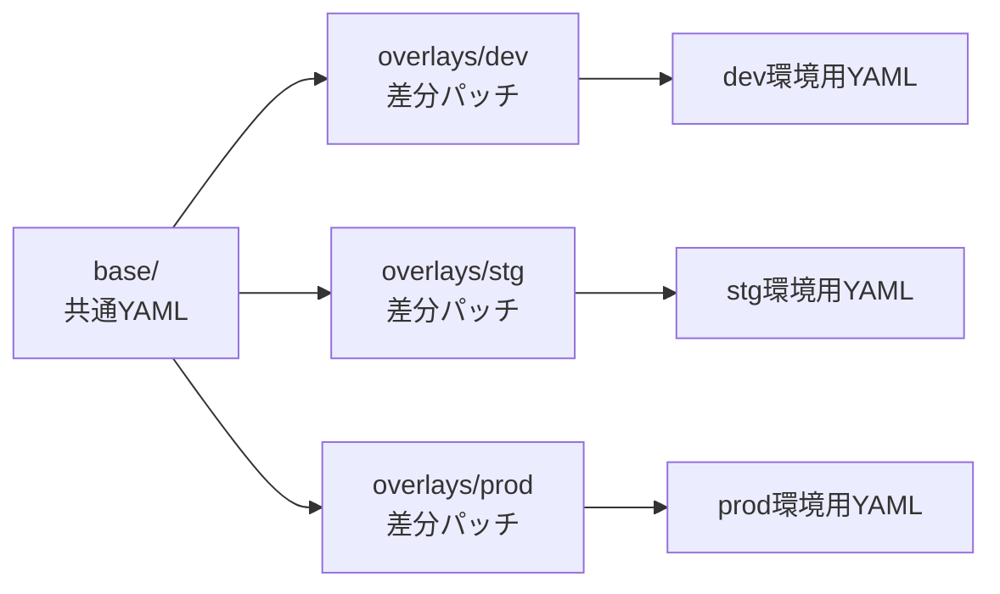
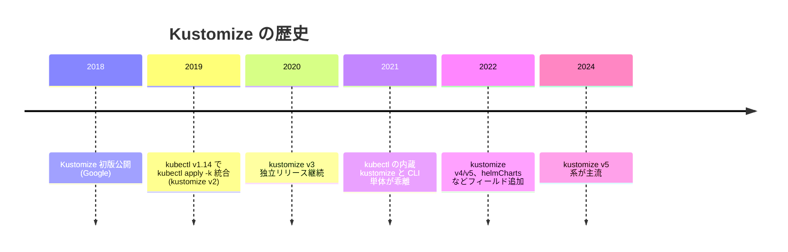
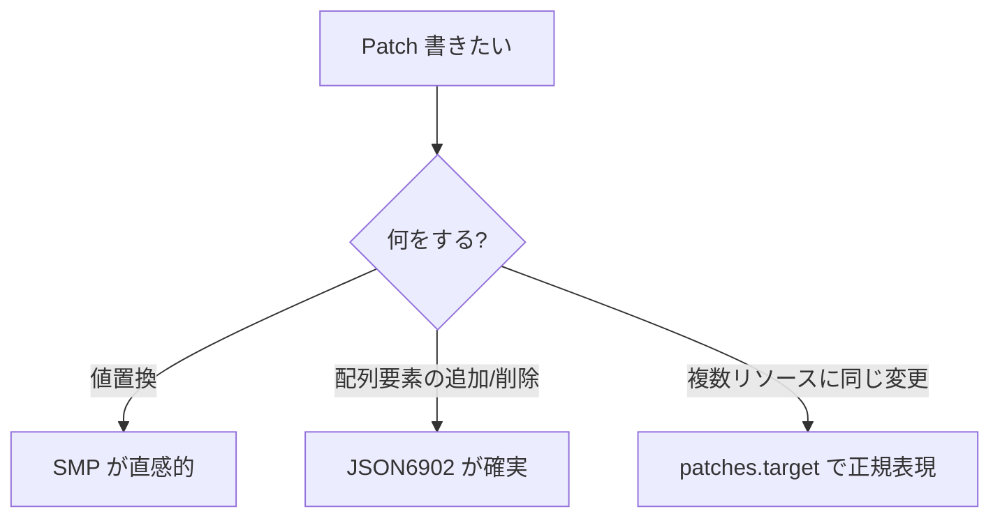
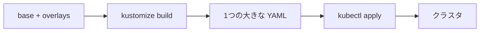
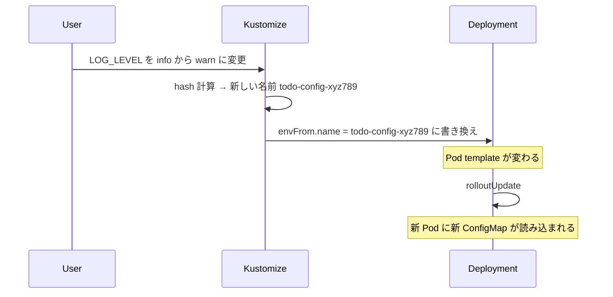
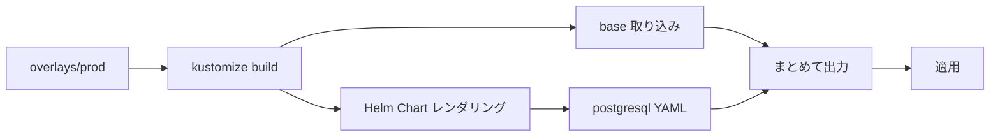
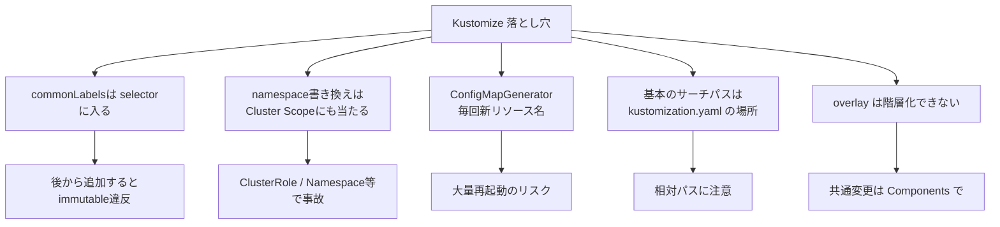
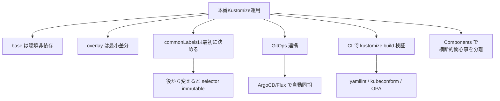
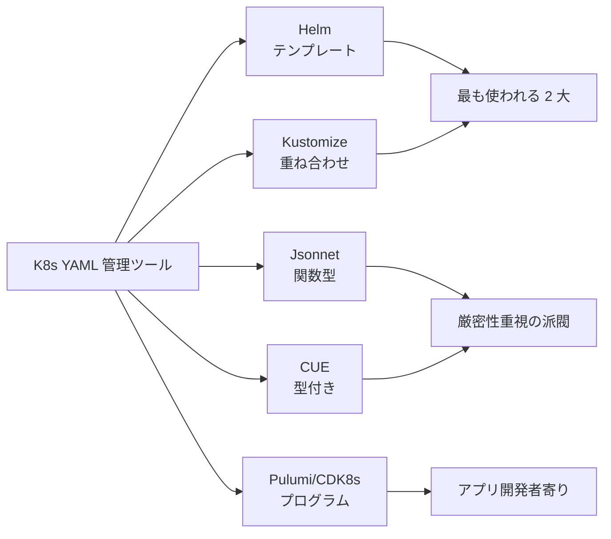

# Kustomize
{: .no_toc }

## 目次
{: .no_toc .text-delta }

1. TOC
{:toc}

---

**Kustomize** は **テンプレート言語を使わずに、プレーンな YAML を base + overlays でカスタマイズ** する K8s 標準のツールです。
`kubectl apply -k` に統合されているので、追加バイナリのインストールなしで使えます。

## このページのゴール

このページを読み終えると、以下を **自分の言葉で説明できる** ようになります。

- Kustomize と Helm の思想の違い(「テンプレート vs 重ね合わせ」)を説明できる
- base / overlays の役割と典型的なディレクトリ構成を書ける
- Strategic Merge Patch と JSON6902 Patch の使い分けを言える
- ConfigMapGenerator / SecretGenerator のハッシュサフィックスの効用を説明できる
- `commonLabels` を後から追加すると selector が変わって失敗する罠を回避できる
- Kustomize で Helm Chart を取り込む `helmCharts` の使い方を知っている

## なぜ Kustomize が必要か

Helm のページで「20 個の YAML を 3 環境にデプロイすると 60 ファイルになる」問題に触れました。
Helm は **テンプレート言語** で解決しますが、Kustomize は **重ね合わせ**(オーバーレイ)で解決します。



base は「普通の K8s YAML そのまま」。テンプレート言語を覚える必要なし。
overlays は base に対する **差分** を書く。replicas を上書きしたい、image tag を変えたい、Namespace を分けたい、など。

## 歴史的経緯



Kustomize は **Helm に不満を持っていた人たち** から生まれました。Helm のテンプレート言語(Go template)を学ばないとデバッグできない、テンプレートが汚れて読めない、という不満があり、「**プレーン YAML だけで十分カスタマイズできるはず**」という思想で設計されました。

kubectl に統合されたことで、追加ツール不要で使えるのが大きな強み。ただし内蔵 kustomize はバージョンが古いことが多いので、本格利用するなら CLI 単体(`kustomize`)を入れます。

```bash
# 内蔵
kubectl version --short
# Client Version: v1.30.0
# Kustomize Version: v5.0.4-0.20230601...

# CLI 単体
brew install kustomize
kustomize version
# v5.4.0
```

## 構成

典型的なディレクトリ:

```
sample-app/k8s/07-kustomize/
├── base/
│   ├── kustomization.yaml
│   ├── deployment.yaml
│   ├── service.yaml
│   ├── configmap.yaml
│   ├── secret.yaml
│   ├── ingress.yaml
│   ├── hpa.yaml
│   └── pdb.yaml
└── overlays/
    ├── dev/
    │   ├── kustomization.yaml
    │   └── replicas-patch.yaml
    ├── stg/
    │   ├── kustomization.yaml
    │   └── replicas-patch.yaml
    └── prod/
        ├── kustomization.yaml
        ├── replicas-patch.yaml
        ├── resources-patch.yaml
        └── ingress-patch.yaml
```

## base

### base/kustomization.yaml

```yaml
apiVersion: kustomize.config.k8s.io/v1beta1
kind: Kustomization

resources:
- deployment.yaml
- service.yaml
- configmap.yaml
- secret.yaml
- ingress.yaml
- hpa.yaml
- pdb.yaml

commonLabels:
  app.kubernetes.io/name: todo-api
  app.kubernetes.io/part-of: todo
  app.kubernetes.io/managed-by: kustomize
```

各フィールドの意味:

| フィールド | 意味 |
|----------|------|
| `resources` | 取り込む YAML / ディレクトリ / URL のリスト |
| `commonLabels` | 全リソースに付与するラベル |
| `commonAnnotations` | 全リソースに付与するアノテーション |
| `namespace` | 全リソースの metadata.namespace を統一 |
| `namePrefix` | 全リソース名の prefix |
| `nameSuffix` | 全リソース名の suffix |
| `images` | image の名前 / タグを置換 |
| `patches` | パッチ適用(SMP / JSON6902)|
| `configMapGenerator` | 動的 ConfigMap 生成 |
| `secretGenerator` | 動的 Secret 生成 |

### base/deployment.yaml(普通の YAML)

```yaml
apiVersion: apps/v1
kind: Deployment
metadata:
  name: todo-api
spec:
  replicas: 1
  selector:
    matchLabels:
      app.kubernetes.io/name: todo-api
  template:
    metadata:
      labels:
        app.kubernetes.io/name: todo-api
    spec:
      containers:
      - name: api
        image: 192.168.56.10:5000/todo-api:0.1.0
        ports:
        - containerPort: 8000
        resources:
          requests:
            cpu: 100m
            memory: 128Mi
          limits:
            memory: 256Mi
```

これがそのまま `kubectl apply -f` できる、何の特殊記法もない普通の YAML です。Helm との大きな違い。

## overlays

### overlays/prod/kustomization.yaml

```yaml
apiVersion: kustomize.config.k8s.io/v1beta1
kind: Kustomization

namespace: prod
namePrefix: prod-

commonLabels:
  env: prod

resources:
- ../../base

patches:
- path: replicas-patch.yaml
- path: resources-patch.yaml
- path: ingress-patch.yaml

images:
- name: 192.168.56.10:5000/todo-api
  newTag: 1.2.3

configMapGenerator:
- name: todo-config
  behavior: merge
  literals:
  - LOG_LEVEL=warn
  - WORKERS=4

secretGenerator:
- name: todo-secret
  behavior: merge
  envs:
  - secret.env

replicas:
- name: todo-api
  count: 5
```

### overlays/prod/replicas-patch.yaml

```yaml
apiVersion: apps/v1
kind: Deployment
metadata:
  name: todo-api
spec:
  replicas: 5
```

Deployment 全体を書くのではなく、**変更したい部分だけ書く**。これが Kustomize の「重ね合わせ」。

`name: todo-api` で対象を特定。`spec.replicas: 5` だけ上書きされ、他の `spec.template.spec.containers` などは base が引き継がれます。

### overlays/prod/resources-patch.yaml

```yaml
apiVersion: apps/v1
kind: Deployment
metadata:
  name: todo-api
spec:
  template:
    spec:
      containers:
      - name: api
        resources:
          requests:
            cpu: 500m
            memory: 512Mi
          limits:
            memory: 1Gi
```

containers のような配列の場合、**`name` がキー** として認識され、同名のコンテナのフィールドだけマージされます。

## Patch の種類

### 1. Strategic Merge Patch(SMP)

K8s 標準のマージロジックで適用。最も普通。

```yaml
patches:
- path: replicas-patch.yaml
  target:
    kind: Deployment
    name: todo-api
```

特徴:

- **配列は `name` などのキー** で個別マージ(containers, env, volumes)
- マップは深いマージ

配列のマージはフィールド種別ごとに `patchMergeKey` がカーネル側に定義されています:

| 配列 | キー |
|------|------|
| `spec.containers` | `name` |
| `spec.containers[*].env` | `name` |
| `spec.containers[*].ports` | `containerPort` |
| `spec.containers[*].volumeMounts` | `mountPath` |
| `spec.volumes` | `name` |

### 2. JSON 6902 Patch(`patches:` で `path` がJSON Patch ファイル)

[RFC 6902](https://datatracker.ietf.org/doc/html/rfc6902) の JSON Patch 形式。配列の add/remove などより精密に制御。

```yaml
# overlays/prod/kustomization.yaml
patches:
- target:
    kind: Deployment
    name: todo-api
  path: env-patch.yaml
```

```yaml
# env-patch.yaml (JSON Patch)
- op: add
  path: /spec/template/spec/containers/0/env/-
  value:
    name: NEW_VAR
    value: "hello"

- op: replace
  path: /spec/replicas
  value: 7

- op: remove
  path: /spec/template/metadata/annotations/foo
```

| op | 動作 |
|----|------|
| `add` | 追加(末尾は `/-`) |
| `replace` | 置換 |
| `remove` | 削除 |
| `move` | 移動 |
| `copy` | 複製 |
| `test` | 値が期待通りか確認 |

### SMP vs JSON6902 の使い分け

| 状況 | おすすめ |
|------|---------|
| フィールドの値を変えたい | SMP |
| 配列の特定要素を削除 | JSON6902 |
| 配列の途中に挿入 | JSON6902 |
| マップに新規キー追加 | どちらでも |
| ある env を **削除** | JSON6902 |



### patches で複数リソースに一括適用

```yaml
patches:
- patch: |-
    - op: add
      path: /metadata/annotations/owner
      value: platform-team
  target:
    kind: Deployment
    labelSelector: app.kubernetes.io/part-of=todo
```

`target` で `labelSelector` / `annotationSelector` / `name` 正規表現 などを使って絞り込み。

### 旧 patchesStrategicMerge / patchesJson6902

古い Kustomize には別フィールドがありましたが、現在は `patches:` に統一されています。

```yaml
# 古い (deprecated)
patchesStrategicMerge:
- replicas-patch.yaml
patchesJson6902:
- target:
    kind: Deployment
    name: todo-api
  path: env-patch.yaml

# 新しい(現代)
patches:
- path: replicas-patch.yaml
- path: env-patch.yaml
  target:
    kind: Deployment
    name: todo-api
```

新規プロジェクトは `patches:` に統一。

## ビルドと適用

```bash
# YAML を出力(適用しない)
kubectl kustomize overlays/prod
# または
kustomize build overlays/prod

# 適用
kubectl apply -k overlays/prod

# 差分
kubectl diff -k overlays/prod

# 削除
kubectl delete -k overlays/prod
```



## ConfigMapGenerator / SecretGenerator

ConfigMap / Secret を kustomization から **動的に生成** する。

```yaml
configMapGenerator:
- name: todo-config
  literals:
  - LOG_LEVEL=info
  - DB_HOST=postgres
  - DB_PORT=5432
  files:
  - app.conf
  - logging.conf=configs/log.conf
  envs:
  - config.env

secretGenerator:
- name: todo-secret
  literals:
  - DB_PASSWORD=secret
  files:
  - tls.crt=certs/tls.crt
  - tls.key=certs/tls.key
  type: Opaque                  # デフォルト
```

### ハッシュサフィックス(超重要)

Generator で作られた ConfigMap / Secret は **名前にハッシュサフィックス** が付きます。

```yaml
# kustomization.yaml が「LOG_LEVEL=info」のとき
# → todo-config-abc12d3 という名前で生成
```

中身が変わると **ハッシュが変わる** → 新しい名前の ConfigMap が生成される → Deployment の envFrom 参照が新名前に置換される → **Pod が自動再起動**。



これが Helm の `checksum/config` annotation に相当する仕組み。**ConfigMap の変更が Pod に自動で反映される**。

### ハッシュを抑止

意図的にハッシュを付けたくない場合(他チームと共有する ConfigMap など):

```yaml
configMapGenerator:
- name: shared-config
  options:
    disableNameSuffixHash: true
```

ただしこれを使うと「変更しても Pod が再起動しない」ので、運用に注意。

### behavior

既存リソースとの結合方法:

| behavior | 意味 |
|---------|------|
| `create`(デフォルト)| 新規作成 |
| `merge` | 既存 ConfigMap / Secret にキーを足す |
| `replace` | 既存を置き換える |

```yaml
# base/kustomization.yaml で create
configMapGenerator:
- name: todo-config
  literals:
  - LOG_LEVEL=info
  - DB_HOST=postgres

# overlays/prod/kustomization.yaml で merge
configMapGenerator:
- name: todo-config
  behavior: merge
  literals:
  - LOG_LEVEL=warn        # base の info を上書き
```

## Components(v3.7+ で追加)

複数の overlays で **共通の変更** を再利用するための仕組み。
overlays は階層構造を取れないので、共通変更を表現しづらい問題があります。

```
base/
overlays/
├── dev/
├── stg/
└── prod/
components/
├── ha/                    # HA 構成(replicas 3, PDB あり)
├── monitoring/            # Prometheus annotations 追加
└── istio-injection/       # sidecar 注入
```

```yaml
# overlays/prod/kustomization.yaml
apiVersion: kustomize.config.k8s.io/v1beta1
kind: Kustomization

resources:
- ../../base

components:
- ../../components/ha
- ../../components/monitoring
```

```yaml
# components/ha/kustomization.yaml
apiVersion: kustomize.config.k8s.io/v1alpha1
kind: Component

patches:
- path: replicas-patch.yaml
- path: pdb.yaml

resources:
- pdb.yaml
```

これで stg にも HA を効かせたければ `components: [../../components/ha]` を追加するだけ。

## Helm Chart の取り込み

Kustomize v3.10+ で `helmCharts` フィールドが追加され、Helm Chart を **取り込んで** 使えるようになりました。

```yaml
# kustomization.yaml
helmCharts:
- name: postgresql
  repo: https://charts.bitnami.com/bitnami
  version: 15.5.0
  releaseName: my-pg
  namespace: db
  valuesFile: values-pg.yaml
```

```bash
# Helm を有効化(セキュリティ上 opt-in)
kustomize build --enable-helm overlays/prod
# または
kubectl kustomize --enable-helm overlays/prod
```

これにより:

- **本体は Kustomize**、**ミドルウェアは Helm Chart** という構成が組める
- Bitnami / community Chart を利用しつつ、自社アプリは Kustomize で書ける



## images の置き換え

CI/CD で重宝するフィールド。

```yaml
# overlays/prod/kustomization.yaml
images:
- name: 192.168.56.10:5000/todo-api    # base で使われている image 名(タグなし)
  newName: 192.168.56.10:5000/todo-api  # 名前置換も可
  newTag: 1.2.3                         # タグだけ置換
- name: nginx                           # 別の image
  newTag: 1.27.1
```

CI からは `kustomize edit` で書き換え:

```bash
cd overlays/prod
kustomize edit set image 192.168.56.10:5000/todo-api=192.168.56.10:5000/todo-api:1.2.3
# kustomization.yaml の images が更新される

git diff
git commit -am "deploy: api 1.2.3"
git push
# → ArgoCD / Flux が拾って自動デプロイ
```

これが **GitOps** の典型的なフロー。

## 主要コマンドと期待出力

### kustomize build

```bash
kustomize build overlays/prod
```

**期待される出力**(抜粋):

```yaml
apiVersion: v1
kind: ConfigMap
metadata:
  labels:
    app.kubernetes.io/managed-by: kustomize
    app.kubernetes.io/name: todo-api
    app.kubernetes.io/part-of: todo
    env: prod
  name: prod-todo-config-abc1234567
  namespace: prod
data:
  LOG_LEVEL: warn
  DB_HOST: postgres
  ...
---
apiVersion: apps/v1
kind: Deployment
metadata:
  labels:
    ...
  name: prod-todo-api
  namespace: prod
spec:
  replicas: 5
  ...
```

`namePrefix: prod-` で `todo-api` → `prod-todo-api`。
`namespace: prod` で metadata.namespace 統一。
`commonLabels` 全リソースに付与。

### kubectl apply -k

```bash
kubectl apply -k overlays/prod
# configmap/prod-todo-config-abc1234567 created
# secret/prod-todo-secret-xyz9876543 created
# service/prod-todo-api created
# deployment.apps/prod-todo-api created
# ...
```

### kubectl diff -k

```bash
kubectl diff -k overlays/prod
# 適用したら何が変わるかの diff
```

### kustomize edit

```bash
cd overlays/prod

# image タグ変更
kustomize edit set image 192.168.56.10:5000/todo-api=...:1.2.3

# replicas
kustomize edit set replicas todo-api=10

# label 追加
kustomize edit add label env:prod
kustomize edit add annotation owner:platform-team
```

## トラブルシューティング

### 症状: `error: accumulating resources: ...`

`resources:` のパスが間違っているか、ファイルが存在しない。

```bash
kustomize build overlays/prod
# Error: accumulating resources: accumulating resources from '../../base': open ../../base: no such file or directory
```

→ パスを確認。`overlays/prod` から見て `../../base` が存在するか。

### 症状: パッチが当たらない

```bash
kustomize build overlays/prod | grep replicas
# replicas: 1     ←base のまま、prod の 5 になっていない
```

ありがちな原因:
- パッチの `metadata.name` が base と不一致
- パッチの `kind` が不一致
- パッチ対象を `target:` で絞り込んでいない

### 症状: selector が変わって apply 失敗

```yaml
# base
commonLabels:
  app: api

# 後から overlays で追加
commonLabels:
  app: api
  env: prod      # ←新規
```

Kustomize は `commonLabels` を **selector にも入れます**。
既存の Deployment は `selector.matchLabels: {app: api}` で動いていたのに、新しい kustomize 出力は `selector.matchLabels: {app: api, env: prod}` になる。

```
error: ... Deployment.apps "todo-api" is invalid:
  spec.selector: Invalid value: ...: field is immutable
```

**Deployment の selector は immutable**。途中で変えると apply できません。

対処:
- 既存 Deployment を一度 delete してから apply
- `commonLabels` ではなく `labels` を使う(selector に入らない labels-only 形式)

```yaml
# v5+ の新フィールド
labels:
- pairs:
    env: prod
  includeSelectors: false       # selector には入れない
```

### 症状: ConfigMap のハッシュ変更で全体再起動

例: ログレベル変更しただけで全 Pod が再起動 → 想定外。

**これは「正しい動作」**ですが、規模が大きいと事故になる。対策:

- 大規模再起動を避けたい設定値は通常の `ConfigMap` リソース(generator でない)で管理
- 設定の種類を分割(頻繁に変わる / ほぼ変わらない)

### エラー対応表

| エラー | 原因 | 対処 |
|--------|------|------|
| `accumulating resources: open ...: no such file or directory` | resources パス間違い | パス確認 |
| `field is immutable` | selector 変更 | base から正しく書く / delete して再作 |
| `unknown field "patchesStrategicMerge"` | 古い構文 | `patches:` に統一 |
| `kustomize: ... must enable Helm flag` | helmCharts 使用時 | `--enable-helm` |
| `failed to find unique target for patch ...` | patch 対象が複数マッチ | `target:` で絞る |

## 落とし穴(まとめ)



## Helm との比較・併用

| | Helm | Kustomize |
|---|------|----------|
| 思想 | テンプレート + values | base + overlay |
| 言語 | Go template | プレーン YAML |
| 配布 | Repository / OCI | git のみ |
| パラメータ | values.yaml で完結 | patch ファイルで局所 |
| サードパーティ | 圧倒的 | helmCharts 取り込み可 |
| デバッグ | レンダリング後を読みにくい | 出力が直感的 |
| 学習コスト | やや高い | 低い |
| Pod 再起動 | checksum annotation で対応 | Generator のハッシュで自動 |

### 併用の典型パターン

#### パターン1: 自社アプリ Kustomize + ミドルウェア Helm

```yaml
# overlays/prod/kustomization.yaml
resources:
- ../../base/api          # 自社 API は Kustomize
- ../../base/frontend     # 自社 Frontend は Kustomize

helmCharts:
- name: postgresql        # DB は Bitnami の Helm Chart
  repo: https://charts.bitnami.com/bitnami
  version: 15.5.0
  releaseName: my-pg
  valuesFile: values-pg.yaml
```

#### パターン2: Helm の出力に Kustomize でパッチ

```bash
helm template todo ./chart -f values.yaml > rendered.yaml

# rendered.yaml を resource に
# kustomization.yaml
resources:
- rendered.yaml
patches:
- path: extra-patches.yaml
```

これで「他人の Helm Chart に手を入れたい(でも fork したくない)」が実現。

## ハンズオン

### 1. base を作って apply

```bash
mkdir -p sample-app/k8s/07-kustomize/{base,overlays/{dev,stg,prod}}
# 上述の base/kustomization.yaml と各 YAML を作成

kubectl create namespace dev
kubectl apply -k sample-app/k8s/07-kustomize/base -n dev
```

### 2. overlays を作って apply

```bash
# overlays/prod/kustomization.yaml と各 patch を作成
kubectl apply -k sample-app/k8s/07-kustomize/overlays/prod
```

### 3. build の出力を確認

```bash
kustomize build sample-app/k8s/07-kustomize/overlays/prod | less
```

### 4. ConfigMap 変更で Pod が再起動するか

```bash
# overlays/prod/kustomization.yaml の configMapGenerator.literals を変更
# - LOG_LEVEL=info → LOG_LEVEL=warn

kubectl apply -k sample-app/k8s/07-kustomize/overlays/prod
kubectl get pods -n prod -w
# Pod が rolloutUpdate で入れ替わる
```

### 5. images の置換

```bash
cd sample-app/k8s/07-kustomize/overlays/prod
kustomize edit set image 192.168.56.10:5000/todo-api=192.168.56.10:5000/todo-api:1.2.4
git diff
kubectl apply -k .
```

### 6. helmCharts 取り込み

```yaml
# overlays/prod/kustomization.yaml に追加
helmCharts:
- name: redis
  repo: https://charts.bitnami.com/bitnami
  version: 19.0.0
  releaseName: my-redis
  namespace: prod
```

```bash
kubectl kustomize --enable-helm overlays/prod | grep -A 3 "kind: StatefulSet"
# Redis StatefulSet が含まれている
```

## 本番運用のベストプラクティス



### チェックリスト

- [ ] base / overlays のディレクトリが整理されている
- [ ] base には環境固有の値が含まれていない
- [ ] overlay には差分のみが書かれている
- [ ] `commonLabels` は最初から確定している
- [ ] CI で `kustomize build` のテスト
- [ ] CI で `kubeconform` などのバリデーション
- [ ] GitOps(ArgoCD/Flux)で git → クラスタ同期

## 他ツールとの位置付け



| ツール | 特徴 |
|-------|------|
| **Helm** | テンプレート、圧倒的なエコシステム |
| **Kustomize** | プレーン YAML、kubectl 統合 |
| **Jsonnet** | 関数型、Grafana が採用 |
| **CUE** | 型付き、検証強力、学習コスト |
| **Pulumi / CDK8s** | TypeScript / Go でインフラ記述 |

選定の指針:

- **シンプルさ重視**: Kustomize
- **配布したい / OSS 利用多い**: Helm
- **大規模 / 厳密性**: CUE
- **アプリ開発と統合したい**: CDK8s

実務では「**Helm を主軸に、足りないところを Kustomize で補う**」or「**Kustomize を主軸に、ミドルウェアは Helm Chart を helmCharts で取り込む**」のどちらかが主流。

## チェックポイント

- [ ] base / overlays の役割と構成が書ける
- [ ] replicas をオーバーレイで上書きするパッチが書ける
- [ ] SMP と JSON6902 の使い分けを言える
- [ ] ConfigMapGenerator のハッシュサフィックスの効用を説明できる
- [ ] `commonLabels` を後から追加すると何が起きるか説明できる
- [ ] `kustomize edit set image` がなぜ CI/CD で有用か
- [ ] Components が何を解決するか言える
- [ ] `helmCharts` を使った Helm 取り込み構成を書ける
- [ ] Kustomize が Helm と排他関係でないことを説明できる
- [ ] 「`field is immutable` エラー」が出るときの典型原因

→ 第 7 章は以上で完了です。次は [08. セキュリティ強化]({{ '/08-security-advanced/' | relative_url }}) で、Pod Security Standards、NetworkPolicy 実践、OPA Gatekeeper などを扱います。
