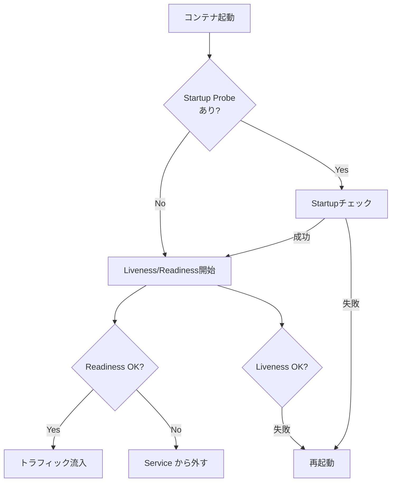

# Probe (Liveness/Readiness/Startup)
{: .no_toc }

## 目次
{: .no_toc .text-delta }

1. TOC
{:toc}

---

**Probe** は kubelet が Pod の状態を判定するための健全性チェック。
正しく設定されているかで、無停止デプロイが可能か、障害時に自動復旧するかが決まります。

## 3種類のProbe

| Probe | 失敗時の動作 | 用途 |
|-------|------------|------|
| **Liveness** | コンテナを再起動 | デッドロック検知 |
| **Readiness** | Service から外す (再起動はしない) | トラフィック制御 |
| **Startup** | 起動猶予を提供 (満了まで他Probeを抑止) | 起動が遅いアプリ |



## チェック方法

3 種類の方式が選べます。

```yaml
# HTTP GET
livenessProbe:
  httpGet:
    path: /healthz
    port: 8080
    httpHeaders:
    - {name: X-Custom, value: yes}
  initialDelaySeconds: 5
  periodSeconds: 10
  timeoutSeconds: 1
  failureThreshold: 3
  successThreshold: 1

# TCP
readinessProbe:
  tcpSocket:
    port: 5432

# Exec
livenessProbe:
  exec:
    command: ["sh", "-c", "pg_isready -U postgres"]
```

## 設定パラメータ

| フィールド | 既定 | 意味 |
|----------|------|------|
| `initialDelaySeconds` | 0 | コンテナ起動後、初回Probeまで待つ秒数 |
| `periodSeconds` | 10 | Probeの実行間隔 |
| `timeoutSeconds` | 1 | 1回のProbeのタイムアウト |
| `failureThreshold` | 3 | 連続失敗回数で「失敗」と判定 |
| `successThreshold` | 1 | 連続成功回数で「成功」と判定 |

## サンプルアプリの設計

FastAPI 側に専用エンドポイントを 2 種類用意します。

```python
# api/app/main.py
@app.get("/healthz")
def healthz():
    """Liveness: アプリ自体が動いているか"""
    return {"status": "ok"}

@app.get("/readyz")
def readyz():
    """Readiness: 依存先(DB/Redis)に到達できるか"""
    db_ok = check_db()
    redis_ok = check_redis()
    if db_ok and redis_ok:
        return {"status": "ready"}
    raise HTTPException(503, "not ready")
```

Deployment:

```yaml
spec:
  template:
    spec:
      containers:
      - name: api
        image: 192.168.56.10:5000/todo-api:0.1.0
        ports:
        - containerPort: 8000
        startupProbe:
          httpGet: {path: /healthz, port: 8000}
          failureThreshold: 30        # 最大 30×5=150秒の起動猶予
          periodSeconds: 5
        readinessProbe:
          httpGet: {path: /readyz, port: 8000}
          periodSeconds: 5
          failureThreshold: 3
        livenessProbe:
          httpGet: {path: /healthz, port: 8000}
          periodSeconds: 10
          failureThreshold: 3
```

## アンチパターン

### 1. Liveness と Readiness が同じ

DB に到達できない時に Pod が再起動 → 再起動しても直らない → CrashLoop。
**Liveness はアプリ自身、Readiness は依存先まで** が原則。

### 2. 重い処理を Probe にする

5秒に1回 SELECT がDBに走るなど。**Probe は超軽量に**。

### 3. Liveness を入れない

「Liveness は無くてもOK」という意見もあります。
理由: Pod が落ちれば kubelet は再起動するし、不要な再起動はサービス断を誘発するため。
**実際、本番でLivenessProbe無しで運用するパターンは普通にあります**。「明確な復旧シナリオがない限り入れない」が安全。

### 4. Startup Probe なしで initialDelaySeconds を巨大に

Java アプリで起動 60 秒の場合、`initialDelaySeconds: 60` にすると、起動後に問題があってもすぐ気づけません。
**Startup Probe を使う** のが現代的。

## ハンズオン

```bash
# わざと readyz を 503 を返すようにして観察
kubectl exec todo-api-xxx -- curl -X POST localhost:8000/admin/break-ready
kubectl get endpoints todo-api          # Pod が外れる
kubectl get pods                          # Running のまま (Liveness は通っている)
```

## チェックポイント

- [ ] Liveness と Readiness の使い分けを正確に説明できる
- [ ] Startup Probe が解決する課題は何か
- [ ] サンプルアプリの `/healthz` と `/readyz` の実装方針を立てられる
