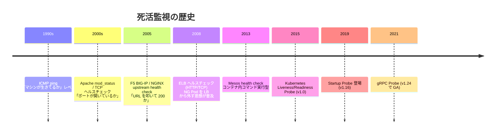
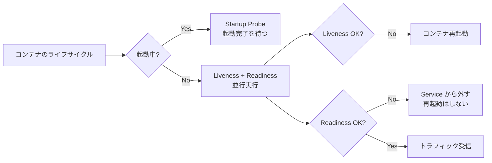
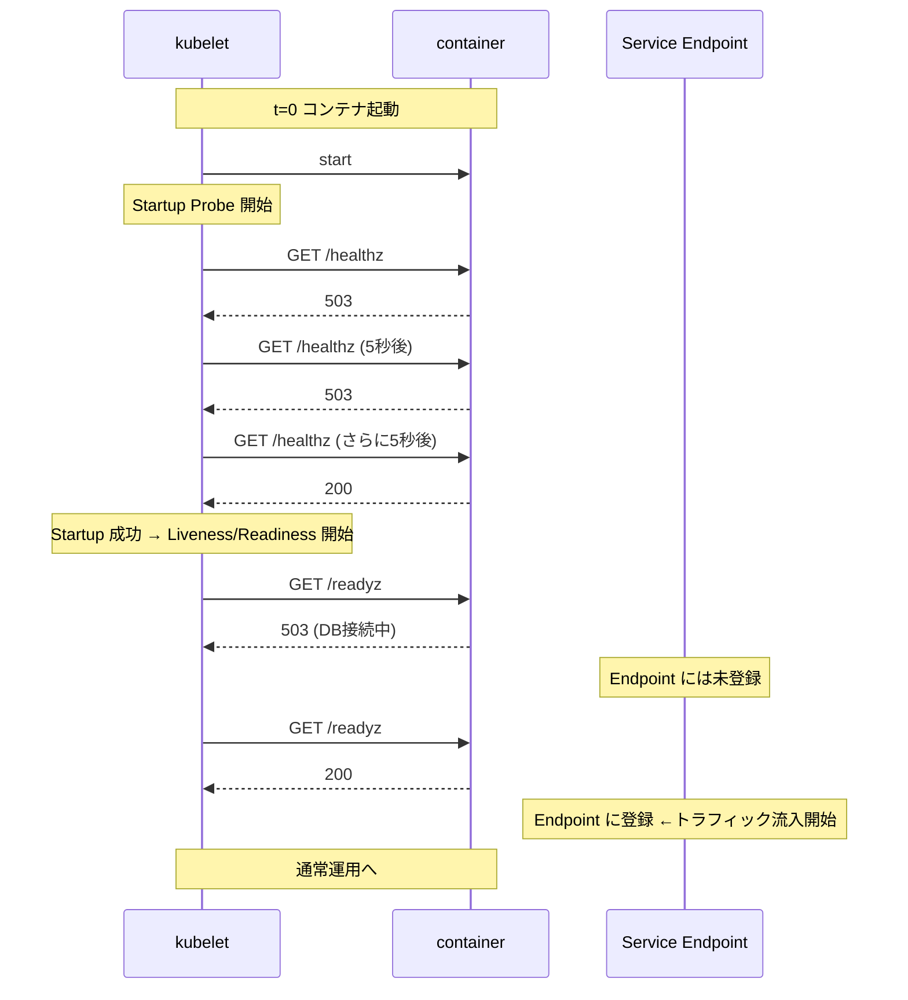
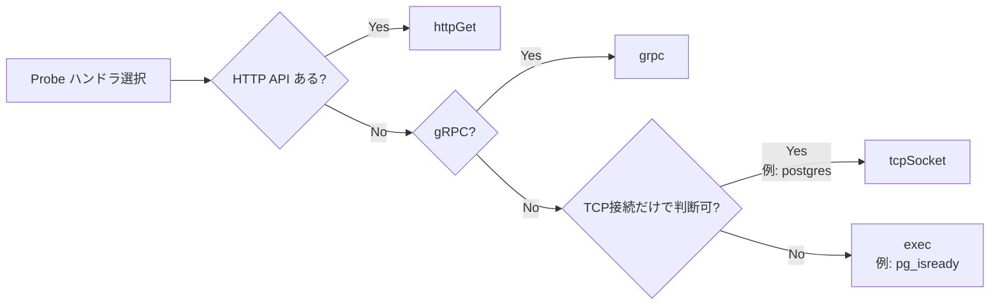
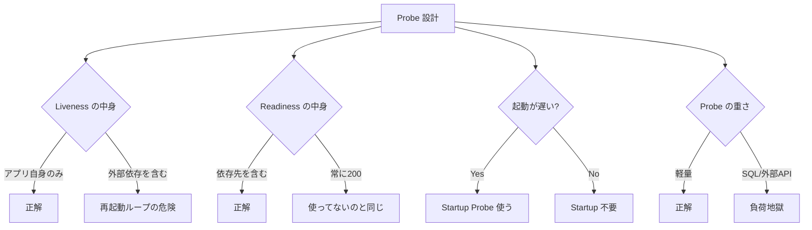
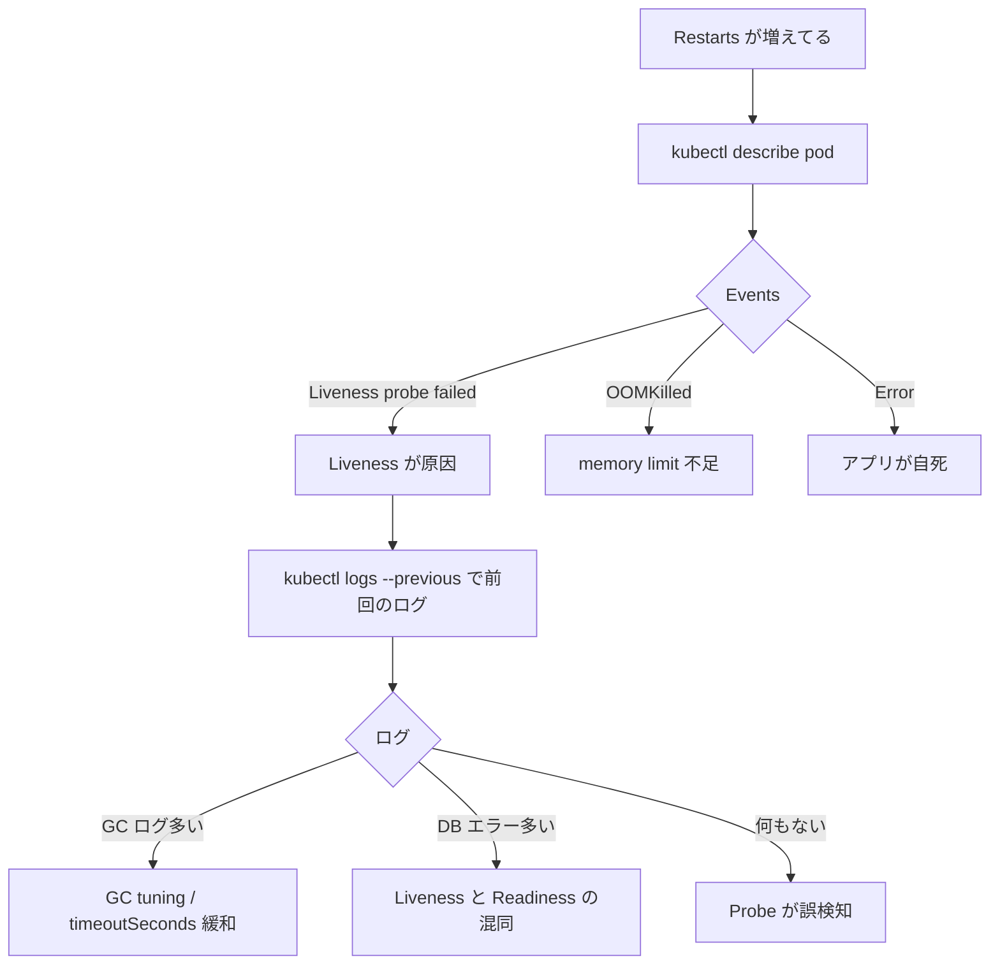
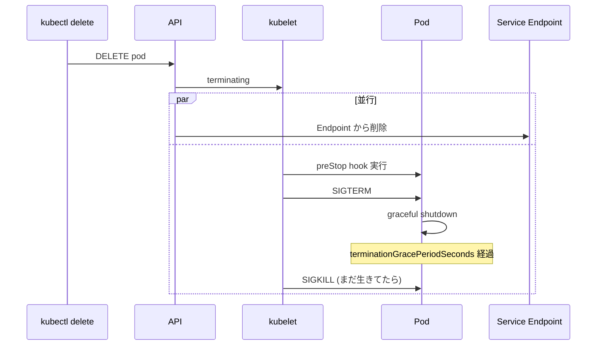

# Probe (Liveness/Readiness/Startup)
{: .no_toc }

## 目次
{: .no_toc .text-delta }

1. TOC
{:toc}

---

**Probe**(プローブ)は kubelet が Pod の状態を判定するための健全性チェックです。
正しく設定されていれば、無停止デプロイができ、障害時に自動復旧します。
逆に設定を誤ると、**起動できないアプリが永遠にループする**、**まだ準備できていない Pod にトラフィックが流れて 502 連発**、**健全な Pod が殺され続ける** などの本番事故を引き起こします。

## このページのゴール

このページを読み終えると、以下を **自分の言葉で説明できる** ようになります。

- Liveness / Readiness / Startup Probe の役割の違いを正確に説明できる
- HTTP / TCP / Exec / gRPC の 4 ハンドラの使い分けを説明できる
- 各パラメータ(`initialDelaySeconds`、`failureThreshold` 等)の意味と既定値を言える
- Probe の典型的アンチパターン 5 つ以上を挙げられる
- サンプル TODO API に Probe を設計し、`/healthz` と `/readyz` を実装できる
- 「Pod が Running なのにトラフィックが届かない」を Probe 視点で切り分けできる
- Pod の lifecycle の中で Probe がいつ実行されるかをタイムラインで説明できる

## なぜ Probe が必要か(歴史的経緯)

K8s 以前から「アプリの死活を外から確認する」仕組みは存在しました。歴史を追いながら、なぜ K8s に複数の Probe が用意されているか理解しましょう。


```mermaid
timeline
    title 死活監視の歴史
    1990s : ICMP ping<br>「マシンが生きてるか」レベル
    2000s : Apache mod_status / TCP ヘルスチェック<br>「ポートが開いているか」
    2005 : F5 BIG-IP / NGINX upstream health check<br>「URL を叩いて 200 か」
    2008 : ELB ヘルスチェック (HTTP/TCP)<br>NG Pod を LB から外す思想が普及
    2013 : Mesos health check<br>コンテナ内コマンド実行型
    2015 : Kubernetes Liveness/Readiness Probe (v1.0)
    2019 : Startup Probe 登場 (v1.16)
    2021 : gRPC Probe (v1.24 で GA)
```

### 「単一の health check」では足りない理由

ロードバランサ(L4 LB)の世界では「health check」は 1 種類でした。「200 が返れば up、返らなければ down」。
しかし K8s はもっと複雑な状況を扱います。

| 状況 | LB の health check | K8s に欲しい挙動 |
|------|------------------|----------------|
| 起動中(まだリクエスト受けられない) | NG → LB から外す | LB から外す + 再起動はしない |
| 起動完了したが、DB 接続中 | NG → LB から外す | LB から外す + 再起動はしない |
| 動いてるけど内部ループでハング | OK(プロセス生きてる) | 再起動したい |
| 起動が遅いだけ | NG → 即外される | 起動猶予を与えたい |

これを **1 つの health check で表現するのは無理** ということで、K8s は 3 種類に分けたのです。

| Probe 種別 | 答える質問 | 失敗時の動作 |
|----------|----------|------------|
| **Liveness** | 「再起動すれば直るか?」 | コンテナ再起動 |
| **Readiness** | 「いまトラフィック受けて大丈夫か?」 | Service Endpoint から外す |
| **Startup** | 「もう起動完了してる?」(他 Probe を抑止) | 起動猶予中はコンテナ再起動 |


```mermaid
flowchart LR
    A[コンテナのライフサイクル] --> B{起動中?}
    B -->|Yes| C[Startup Probe<br>起動完了を待つ]
    B -->|No| D[Liveness + Readiness<br>並行実行]
    D --> E{Liveness OK?}
    E -->|No| F[コンテナ再起動]
    D --> G{Readiness OK?}
    G -->|No| H[Service から外す<br>再起動はしない]
    G -->|Yes| I[トラフィック受信]
```

## 3 種類の Probe を詳しく

### Liveness Probe(死活監視)

**「このコンテナ、生きてる?死んでたら再起動するよ」** を判定するプローブ。

主な目的: **デッドロックの検出**。
プロセスは生きているが、内部のロック・メモリリーク・無限ループ・DB コネクション枯渇などで「実質死んでいる」状態を検出します。

```yaml
livenessProbe:
  httpGet:
    path: /healthz
    port: 8000
  initialDelaySeconds: 5
  periodSeconds: 10
  timeoutSeconds: 1
  failureThreshold: 3
```

失敗したら kubelet がコンテナを **再起動** します(Pod 削除ではなく、同じ Pod 内のコンテナを restart)。

### Readiness Probe(準備完了監視)

**「このコンテナ、いまリクエスト受けて平気?」** を判定するプローブ。

主な目的: **段階的な切り離し / 投入**。
失敗したら、その Pod は Service の Endpoint から外され、トラフィックが流れなくなります。**コンテナは再起動されません**。回復したら自動で Endpoint に戻ります。

```yaml
readinessProbe:
  httpGet:
    path: /readyz
    port: 8000
  periodSeconds: 5
  failureThreshold: 3
```

使いどころ:

- 起動直後の DB マイグレーション実行中
- 一時的な依存先障害(DB / 外部 API)
- アップロードファイルの index 構築中

### Startup Probe(起動猶予)

**「起動完了したかどうかだけ判断する。完了するまで他の Probe は走らせない」** という調停役。

主な目的: **Java や Rails のような起動に時間がかかるアプリで、Liveness の誤発動を防ぐ**。

Java のアプリは起動に 60 秒かかったりします。`initialDelaySeconds: 60` で逃げる手もありますが、**起動完了の判定が曖昧** になり、本当に正常起動したのか分かりません。Startup Probe は明示的に起動完了を判定します。

```yaml
startupProbe:
  httpGet:
    path: /healthz
    port: 8000
  failureThreshold: 30        # 30 回失敗まで許容
  periodSeconds: 5            # = 最大 150 秒の起動猶予
```

`failureThreshold × periodSeconds` 秒が起動猶予の上限。これを超えるとコンテナ再起動。
Startup Probe が **成功するまで** Liveness と Readiness は走りません。

## Pod ライフサイクルと Probe のタイミング


```mermaid
sequenceDiagram
    participant kubelet
    participant container
    participant svc as Service Endpoint
    Note over kubelet,container: t=0 コンテナ起動
    kubelet->>container: start
    Note over kubelet: Startup Probe 開始
    kubelet->>container: GET /healthz
    container-->>kubelet: 503
    kubelet->>container: GET /healthz (5秒後)
    container-->>kubelet: 503
    kubelet->>container: GET /healthz (さらに5秒後)
    container-->>kubelet: 200
    Note over kubelet: Startup 成功 → Liveness/Readiness 開始
    kubelet->>container: GET /readyz
    container-->>kubelet: 503 (DB接続中)
    Note over svc: Endpoint には未登録
    kubelet->>container: GET /readyz
    container-->>kubelet: 200
    Note over svc: Endpoint に登録 ←トラフィック流入開始
    Note over kubelet,container: 通常運用へ
```

## Probe ハンドラ(チェック方法)4 種類

### HTTP GET

最もよく使う。

```yaml
livenessProbe:
  httpGet:
    path: /healthz
    port: 8000
    scheme: HTTP             # HTTPS も可
    host: ""                 # デフォルトは Pod の IP
    httpHeaders:
    - name: X-Probe-Source
      value: kubelet
```

- `2xx` または `3xx` → 成功
- それ以外 → 失敗

### TCP Socket

ポートが開いているかだけ確認。HTTP を持たない DB / Redis などに。

```yaml
readinessProbe:
  tcpSocket:
    port: 5432
```

`SYN → SYN-ACK` の TCP 3way ハンドシェイクが成立すれば成功。

### Exec

コンテナ内でコマンドを実行し、終了コード 0 なら成功。

```yaml
livenessProbe:
  exec:
    command:
    - /bin/sh
    - -c
    - pg_isready -U postgres -d todo
```

メリット: 内部状態を細かく確認できる
デメリット: **重い**(プロセス生成のオーバーヘッド)、外部からの観測性が落ちる

### gRPC(v1.24 で GA)

gRPC Health Checking Protocol を直接使う。

```yaml
livenessProbe:
  grpc:
    port: 9000
    service: ""              # 空 = サーバ全体の health
```

サーバ側は [grpc-go の health package](https://pkg.go.dev/google.golang.org/grpc/health) を組み込みます。
それ以前は `grpc_health_probe` というバイナリを `exec` ハンドラから呼ぶ workaround が一般的でしたが、ネイティブ対応した今は不要。


```mermaid
flowchart LR
    A[Probe ハンドラ選択] --> B{HTTP API ある?}
    B -->|Yes| C[httpGet]
    B -->|No| D{gRPC?}
    D -->|Yes| E[grpc]
    D -->|No| F{TCP接続だけで判断可?}
    F -->|Yes<br>例: postgres| G[tcpSocket]
    F -->|No| H[exec<br>例: pg_isready]
```

## 設定パラメータすべて

| フィールド | 既定 | 範囲 | 意味 |
|----------|------|------|------|
| `initialDelaySeconds` | 0 | 0〜 | コンテナ起動から初回 Probe までの待機秒数 |
| `periodSeconds` | 10 | 1〜 | Probe の実行間隔 |
| `timeoutSeconds` | 1 | 1〜 | Probe 1 回のタイムアウト秒数 |
| `failureThreshold` | 3 | 1〜 | 連続失敗回数で「失敗」と判定 |
| `successThreshold` | 1 | 1(Liveness/Startup)、1〜(Readiness) | 連続成功回数で「成功」と判定 |
| `terminationGracePeriodSeconds` | (Pod の同名から継承) | 0〜 | Probe 起因の終了時の猶予 |

### 既定値が問題になるケース

`timeoutSeconds: 1` は **アプリが遅いと容易に失敗** します。GC が走ったり、外部 API への呼び出しが含まれていたり。本番では 3〜5 秒に伸ばす方が安全。

`failureThreshold: 3` × `periodSeconds: 10` = **30 秒で再起動**。短すぎると感じたら `failureThreshold: 6` 等に。

`initialDelaySeconds` は古い設計。**現代は Startup Probe を使う** のが定石です。

## サンプルアプリの設計

ミニ TODO API(FastAPI)に `/healthz` と `/readyz` を実装します。

### Python 側

```python
# api/app/main.py
from fastapi import FastAPI, HTTPException
from sqlalchemy import text
from .db import engine
from .redis_client import redis

app = FastAPI()

# Liveness: アプリ自体が動いているか(プロセス・イベントループ)
@app.get("/healthz")
def healthz():
    return {"status": "ok"}

# Readiness: 依存先(DB / Redis)に到達できるか
@app.get("/readyz")
def readyz():
    errors = []
    try:
        with engine.connect() as conn:
            conn.execute(text("SELECT 1"))
    except Exception as e:
        errors.append(f"db: {e}")
    try:
        redis.ping()
    except Exception as e:
        errors.append(f"redis: {e}")
    if errors:
        raise HTTPException(status_code=503, detail={"errors": errors})
    return {"status": "ready"}

# Startup: 起動完了の合図
# /healthz と同じでも可。起動時の重い処理(マイグレーション)を別で持つ場合は専用 endpoint
@app.get("/startup")
def startup():
    if not app.state.startup_complete:
        raise HTTPException(503, "startup not complete")
    return {"status": "started"}
```

### Deployment

```yaml
apiVersion: apps/v1
kind: Deployment
metadata:
  name: todo-api
  labels:
    app.kubernetes.io/name: todo-api
    app.kubernetes.io/part-of: todo
spec:
  replicas: 3
  selector:
    matchLabels:
      app.kubernetes.io/name: todo-api
  template:
    metadata:
      labels:
        app.kubernetes.io/name: todo-api
        app.kubernetes.io/part-of: todo
    spec:
      containers:
      - name: api
        image: 192.168.56.10:5000/todo-api:0.1.0
        ports:
        - containerPort: 8000
          name: http

        startupProbe:
          httpGet:
            path: /healthz
            port: http
          failureThreshold: 30   # 最大 30 × 5 = 150 秒の起動猶予
          periodSeconds: 5
          timeoutSeconds: 3

        readinessProbe:
          httpGet:
            path: /readyz
            port: http
          periodSeconds: 5
          timeoutSeconds: 3
          failureThreshold: 3

        livenessProbe:
          httpGet:
            path: /healthz
            port: http
          periodSeconds: 10
          timeoutSeconds: 3
          failureThreshold: 3
```

ポートを `name: http` で参照しているのは、**Deployment 全体の差し替えで port が変わってもプローブ側を直さなくて済む** ようにする小技。

### サイドカー / 依存先 Probe

PostgreSQL の StatefulSet には:

```yaml
readinessProbe:
  exec:
    command:
    - pg_isready
    - -U
    - todo
    - -d
    - todo
  periodSeconds: 5
livenessProbe:
  tcpSocket:
    port: 5432
  periodSeconds: 30
```

Redis:

```yaml
readinessProbe:
  exec:
    command: ["redis-cli", "ping"]
  periodSeconds: 3
livenessProbe:
  tcpSocket:
    port: 6379
```

`redis-cli ping` は `PONG` を期待。停止中は exit code 0 にならない。

## 主要コマンドと期待出力

### Probe を持つ Deployment を確認

```bash
kubectl get deploy todo-api -o yaml | grep -A 5 -E '(liveness|readiness|startup)Probe'
```

**期待される出力**:

```yaml
livenessProbe:
  httpGet:
    path: /healthz
    port: http
    scheme: HTTP
  failureThreshold: 3
  ...
```

### Probe の動作確認

```bash
# Pod 名を取得
POD=$(kubectl get pod -l app.kubernetes.io/name=todo-api -o jsonpath='{.items[0].metadata.name}')

# Pod 内から readyz を叩いて挙動を見る
kubectl exec $POD -- curl -s -o /dev/null -w "%{http_code}\n" localhost:8000/readyz
# 200
```

### Probe 失敗のイベント

```bash
kubectl describe pod $POD | grep -A 5 Events
```

**期待される出力(健全な場合)**:

```
Events:
  Type    Reason     Age   From               Message
  Normal  Scheduled  2m    default-scheduler  Successfully assigned ...
  Normal  Pulled     2m    kubelet            Container image already present
  Normal  Created    2m    kubelet            Created container api
  Normal  Started    2m    kubelet            Started container api
```

**期待される出力(Liveness 失敗)**:

```
Events:
  Type     Reason     Age   From     Message
  Warning  Unhealthy  20s   kubelet  Liveness probe failed: HTTP probe failed with statuscode: 503
  Warning  Unhealthy  10s   kubelet  Liveness probe failed: ...
  Normal   Killing    5s    kubelet  Container api failed liveness probe, will be restarted
```

### Probe 失敗時の確認方法

| 症状 | 確認コマンド | 見るべきもの |
|------|------------|-------------|
| `kubectl get pod` で `0/1` Running | `kubectl describe pod` | Events の `Readiness probe failed` |
| `Restarts` 増加 | `kubectl logs --previous` | クラッシュ前のログ |
| `Endpoints` が空 | `kubectl get endpoints <svc>` | Pod 全部 NotReady? |
| 起動失敗が続く | `kubectl describe pod` | Startup Probe の failureThreshold が足りていないか |

## アンチパターン

### 1. Liveness と Readiness が同じ

**典型的な事故の素**。

```yaml
livenessProbe:
  httpGet: {path: /readyz, port: 8000}    # ←DBチェック
readinessProbe:
  httpGet: {path: /readyz, port: 8000}
```

DB が一瞬切れた → Readiness 失敗 → Liveness も失敗 → 全 Pod 同時に再起動 → 再起動しても DB は直っていない → **CrashLoop**。

**正しくは**:

- Liveness: アプリ自身(プロセスが動いてるか)
- Readiness: 依存先まで(DB / Redis に届くか)

「再起動して直るか?」を Liveness の判断基準に。

### 2. Liveness で重い処理をする

```python
@app.get("/healthz")
def healthz():
    db.query("SELECT count(*) FROM todos")     # ←毎回 SELECT
    return {"ok": True}
```

`periodSeconds: 10` だと **10 秒に 1 回 SELECT が走る**。レプリカが 100 個あれば 10 秒に 100 SELECT。
**Probe は超軽量に**。`/healthz` は単に `{"ok":true}` を返すだけ、が原則。

### 3. Liveness を入れない / 入れすぎる

「Liveness はなくてもいい」という派閥もあります。理由:

- 不要な再起動はサービス断を誘発する
- 大半のクラッシュはプロセスが落ちるので kubelet が自動で再起動する
- デッドロック検知の必要性は実は少ない

**実際、本番で LivenessProbe 無しで運用するパターンは普通にあります**。
方針:

- 「Liveness なしを基本、明確な再起動シナリオがある場合だけ追加」
- または「`/healthz` は最も軽量なエンドポイントで、再起動は最終手段」

### 4. Startup Probe を使わず initialDelaySeconds を巨大化

```yaml
livenessProbe:
  httpGet: {path: /healthz, port: 8000}
  initialDelaySeconds: 120    # ←アプリ起動が遅いから
```

問題:

- 120 秒間「起動できているのか起動失敗しているのか」が分からない
- 起動完了が早かった場合に 120 秒間放置される

**Startup Probe を使う**:

```yaml
startupProbe:
  httpGet: {path: /healthz, port: 8000}
  failureThreshold: 30
  periodSeconds: 5            # = 最大 150 秒、ただし完了したら即 Liveness 移行
livenessProbe:
  httpGet: {path: /healthz, port: 8000}
  initialDelaySeconds: 0      # Startup 成功してから実行
```

### 5. timeoutSeconds が 1 のまま

既定値の 1 秒は **GC が走るだけで失敗** します。

```yaml
livenessProbe:
  httpGet: {path: /healthz, port: 8000}
  timeoutSeconds: 3           # ←最低でも 3
```

Probe が時々失敗するなら、`timeoutSeconds` を疑うのが先です。

### 6. failureThreshold が 1 で再起動連発

```yaml
livenessProbe:
  failureThreshold: 1    # ←1 回失敗で即再起動
```

GC で偶発的に 1 回失敗 → 即再起動 → 再起動中はもちろん失敗 → 連鎖再起動。
**failureThreshold は 3 以上**。

### 7. Probe で外部 API を叩く

```python
@app.get("/healthz")
def healthz():
    requests.get("https://api.payment-provider.com/health")    # ←絶対やるな
```

外部 API が落ちる → 自分の Pod が再起動 → 復旧してないので再再起動 → CrashLoop → 連休に呼ばれる。
**Probe は自分自身の状態のみ** が原則。外部依存は監視ツールで別軸でチェック。

### 8. Readiness の successThreshold を上げる

```yaml
readinessProbe:
  successThreshold: 5    # ←5 回連続成功で OK
```

`successThreshold` は Liveness/Startup では **1 固定**。Readiness のみ変更可ですが、上げる必要があるケースは稀。
意図しないと「Pod が Ready にならない」事故になります。デフォルト 1 でほぼ OK。

### 9. /readyz が常に 200

```python
@app.get("/readyz")
def readyz():
    return {"ready": True}
```

DB が落ちていても Pod に流れ込んでくるので **502 連発**。Readiness の意味がない。

## アンチパターン総括


```mermaid
flowchart TB
    A[Probe 設計] --> B{Liveness の中身}
    B -->|アプリ自身のみ| C[正解]
    B -->|外部依存を含む| D[再起動ループの危険]
    A --> E{Readiness の中身}
    E -->|依存先を含む| F[正解]
    E -->|常に200| G[使ってないのと同じ]
    A --> H{起動が遅い?}
    H -->|Yes| I[Startup Probe 使う]
    H -->|No| J[Startup 不要]
    A --> K{Probe の重さ}
    K -->|軽量| L[正解]
    K -->|SQL/外部API| M[負荷地獄]
```

## トラブルシューティング

### 症状: Pod が `0/1 Running` のまま動かない

```mermaid
flowchart TB
    A[Pod が 0/1 Running] --> B[kubectl describe pod]
    B --> C{Events}
    C -->|Readiness probe failed| D[/readyz の応答確認]
    D --> E[kubectl exec で curl localhost/readyz]
    E --> F{応答}
    F -->|503| G[依存先確認: DB / Redis]
    F -->|タイムアウト| H[アプリが応答していない]
    H --> I[kubectl logs]
    F -->|404| J[path の typo]
    F -->|200だがProbeはfailed| K[scheme HTTP/HTTPS違い]
```

### 症状: Pod がしばしば再起動する


```mermaid
flowchart TB
    A[Restarts が増えてる] --> B[kubectl describe pod]
    B --> C{Events}
    C -->|Liveness probe failed| D[Liveness が原因]
    C -->|OOMKilled| E[memory limit 不足]
    C -->|Error| F[アプリが自死]
    D --> G[kubectl logs --previous で前回のログ]
    G --> H{ログ}
    H -->|GC ログ多い| I[GC tuning / timeoutSeconds 緩和]
    H -->|DB エラー多い| J[Liveness と Readiness の混同]
    H -->|何もない| K[Probe が誤検知]
```

### エラーメッセージ → 対処

| ログ / Event | 原因 | 対処 |
|------------|------|------|
| `Liveness probe failed: HTTP probe failed with statuscode: 503` | アプリが 503 返している | アプリのログを確認 |
| `Readiness probe failed: Get "http://...": context deadline exceeded` | timeout | `timeoutSeconds` を増やす |
| `Readiness probe failed: dial tcp ...: connect: connection refused` | アプリ未起動 / port 違い | `containerPort` 確認、`kubectl exec` で起動確認 |
| `Readiness probe failed: HTTP probe failed with statuscode: 404` | path 間違い | `path` 確認、アプリのルート定義確認 |
| `Liveness probe failed: command timed out` | exec タイムアウト | `timeoutSeconds`、コマンドを軽量化 |
| `BackOff restarting failed container` | 再起動の再起動 | `failureThreshold` を増やすか、Startup Probe を使う |

### Probe を一時的に無効化して切り分け

```bash
kubectl edit deployment todo-api
# probes 全部コメントアウトして apply
```

これで再起動が止まるかどうかで「Probe が原因か / アプリ自身が落ちているか」を切り分け。

## ハンズオン

### 1. Probe 付き Deployment をデプロイ

```bash
kubectl apply -f sample-app/k8s/07-probe/api-deployment.yaml
kubectl get pods -l app.kubernetes.io/name=todo-api -w
# READY 0/1 → 1/1 に変わるのを観察
```

### 2. わざと readyz を 503 にする

API に「擬似的に DB 切断する管理 endpoint」を実装しておく:

```python
@app.post("/admin/break-ready")
def break_ready():
    app.state.fake_unhealthy = True
    return {"ok": True}

@app.post("/admin/recover-ready")
def recover_ready():
    app.state.fake_unhealthy = False
    return {"ok": True}
```

```bash
POD=$(kubectl get pod -l app.kubernetes.io/name=todo-api -o jsonpath='{.items[0].metadata.name}')

# breakする
kubectl exec $POD -- curl -X POST localhost:8000/admin/break-ready

# 別端末で
kubectl get endpoints todo-api -w
# Pod IP がだんだん消えていく

kubectl get pods -l app.kubernetes.io/name=todo-api
# READY 0/1 になっているはず(ただし Running 継続=Liveness は通っている)

# recover
kubectl exec $POD -- curl -X POST localhost:8000/admin/recover-ready
# 5〜10 秒で Endpoint に戻る
```

これが Readiness Probe の本領。**Pod は生きているがトラフィックは流さない**。

### 3. わざと healthz を 500 にして再起動を観察

```bash
kubectl exec $POD -- curl -X POST localhost:8000/admin/break-health

# 30秒くらい待つと…
kubectl get pod $POD
# RESTARTS が 1 に増えている
```

`failureThreshold:3` × `periodSeconds:10` = 30 秒で再起動。

### 4. Probe を使って無停止デプロイ

新バージョンの API イメージ(`0.2.0`)を起動が遅くしてみます。

```yaml
# Dockerfile に sleep を入れて疑似的に起動を遅くする
CMD ["sh", "-c", "sleep 60 && uvicorn app.main:app --host 0.0.0.0 --port 8000"]
```

Startup Probe なし → **Liveness が起動完了前に走って再起動ループ**。
Startup Probe あり(`failureThreshold:30, periodSeconds:5` = 150 秒猶予)→ 60 秒後に成功して通常運用へ。

### 5. ローリングアップデート時の挙動

```bash
kubectl set image deployment/todo-api api=192.168.56.10:5000/todo-api:0.2.0

# 別端末で
kubectl get pods -l app.kubernetes.io/name=todo-api -w
# 新 Pod が READY 0/1 で立ち上がる
# READY 1/1 になってから旧 Pod が落ちる
```

`maxSurge` / `maxUnavailable` と Readiness Probe の組み合わせで、**無停止デプロイ** が成立します。

## 代替手法・関連機能

### terminationGracePeriodSeconds と preStop

Probe ではないが、関連が深い設定です。

```yaml
spec:
  terminationGracePeriodSeconds: 30
  containers:
  - name: api
    lifecycle:
      preStop:
        exec:
          command: ["sh", "-c", "sleep 10"]    # SIGTERM 前に 10秒 待つ
```

Pod 削除時のシーケンス:


```mermaid
sequenceDiagram
    participant K as kubectl delete
    participant API
    participant kubelet
    participant Pod
    participant SVC as Service Endpoint
    K->>API: DELETE pod
    API->>kubelet: terminating
    par 並行
        API->>SVC: Endpoint から削除
    and
        kubelet->>Pod: preStop hook 実行
        kubelet->>Pod: SIGTERM
        Pod->>Pod: graceful shutdown
        Note over Pod: terminationGracePeriodSeconds 経過
        kubelet->>Pod: SIGKILL (まだ生きてたら)
    end
```

- **preStop**: コンテナ終了の前に実行する hook。LB/Endpoint から外れる時間稼ぎに使う
- **terminationGracePeriodSeconds**: SIGTERM から SIGKILL までの猶予秒数(デフォルト 30 秒)

参考: Pod Termination の流れは公式ドキュメントの [Termination of Pods](https://kubernetes.io/docs/concepts/workloads/pods/pod-lifecycle/#pod-termination) 参照。

### Pod Readiness Gates

Pod の Readiness は Probe だけでなく、**外部のシグナル** によっても制御できます。

```yaml
spec:
  readinessGates:
  - conditionType: example.com/feature-1
```

外部コントローラがこの condition を `True` にしないと、Pod は Ready になりません。
クラウドの NLB が Target Group に Pod を登録完了してから Ready にする、といった用途に使われます。

### Sidecar の Probe

Pod に複数コンテナがある場合、それぞれに独立した Probe を設定します。

```yaml
spec:
  containers:
  - name: api
    livenessProbe: {...}
    readinessProbe: {...}
  - name: log-shipper
    livenessProbe: {...}
    # log-shipper の readiness は通常不要(Service には登場しない)
```

**Pod の Ready** = **全コンテナの Readiness Probe が成功**。
log-shipper が立ち上がっていなくても api だけで Ready 扱いにしたければ、log-shipper には Readiness を入れない or `successThreshold` を 1 のままにしておきます。

## 本番運用での考慮点

### 1. 統一した /healthz / /readyz の規約

組織内で、**全アプリで `/healthz` と `/readyz` を実装する** という規約を決めておくと、Probe 設定がコピペで済みます。

### 2. アプリの shutdown handler

SIGTERM を受けたら:

1. **Readiness を 503 にする**(新規リクエスト受付停止)
2. preStop の sleep で Endpoint 削除を待つ
3. 受付中のリクエストを完了
4. 終了

FastAPI なら `lifespan` イベントで実装。

### 3. Probe の設定はコードでなく設定で

アプリのソースコードに `/healthz` を実装するが、Probe の `periodSeconds` などは **環境ごとに変える** ことが多いです。dev は緩く、prod は厳しく。Helm / Kustomize の overlay で。

### 4. Probe の観測性

Probe が失敗しているかどうかは、Prometheus メトリクスとしても出ています。

| メトリクス | 内容 |
|----------|------|
| `kube_pod_container_status_ready` | コンテナが Ready か(0/1) |
| `kube_pod_container_status_restarts_total` | 再起動回数 |
| `prober_probe_total` | Probe の試行回数 |
| `prober_probe_duration_seconds` | Probe の所要時間 |

これらを Grafana ダッシュボードに並べておくと、Probe の失敗が連発し始めたタイミングを早期発見できます。

## チェックポイント

- [ ] Liveness と Readiness の使い分けを正確に説明できる
- [ ] Startup Probe が解決する課題は何か
- [ ] HTTP / TCP / Exec / gRPC の 4 種類の使い分け
- [ ] `failureThreshold` × `periodSeconds` で何秒猶予があるか計算できる
- [ ] Pod ライフサイクルの中で Probe がいつ走るか説明できる
- [ ] サンプルアプリの `/healthz` と `/readyz` の実装方針を立てられる
- [ ] Probe アンチパターンを 5 つ以上挙げられる
- [ ] `terminationGracePeriodSeconds` と `preStop` の意味を説明できる
- [ ] 「Pod が 0/1 Running」のときの調査手順を言える
- [ ] 「Pod が時々再起動する」のときの切り分け手順を言える

→ 次は [リソース管理 (Requests/Limits)]({{ '/07-production/resources/' | relative_url }})
