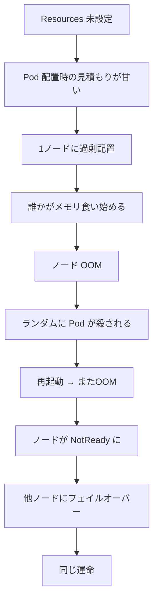
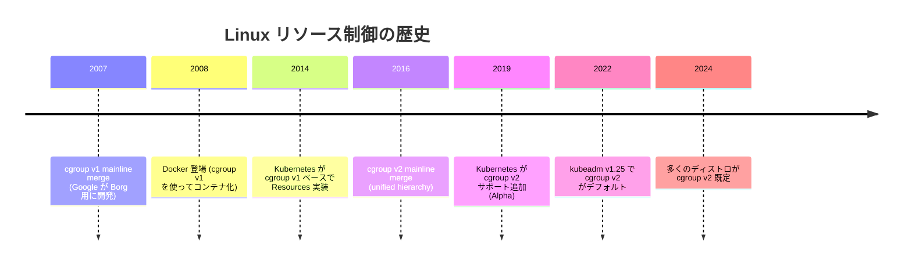
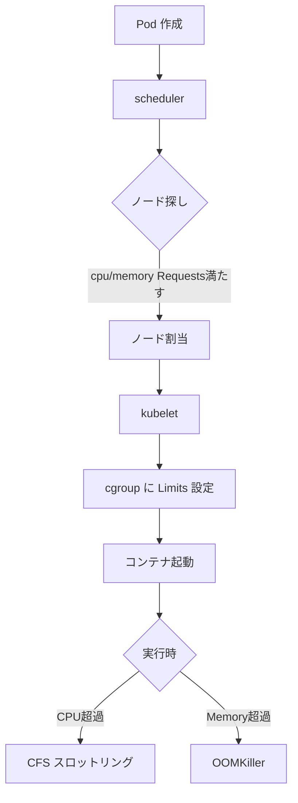
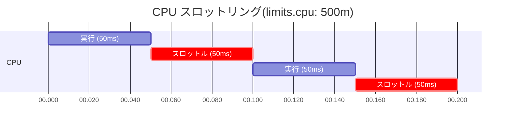
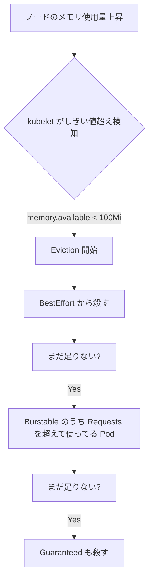
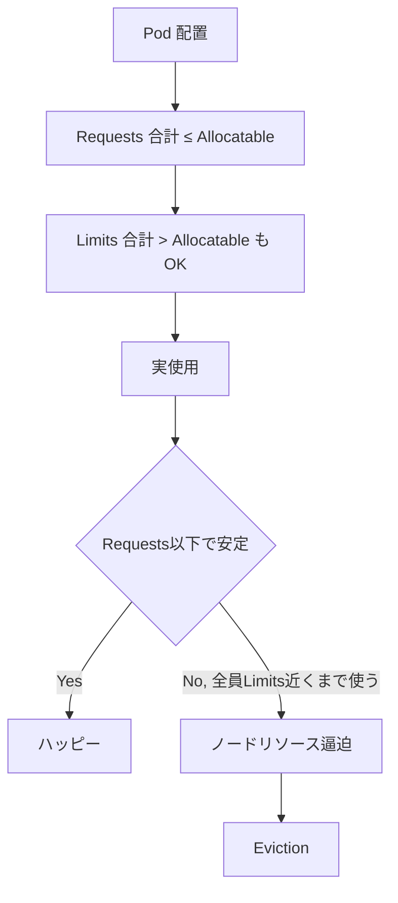
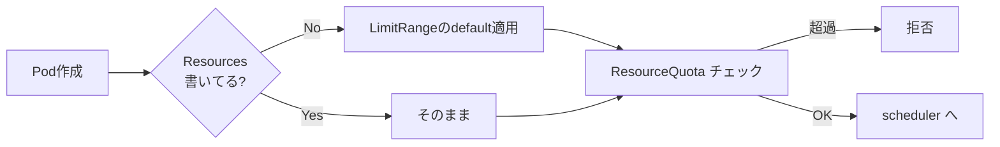
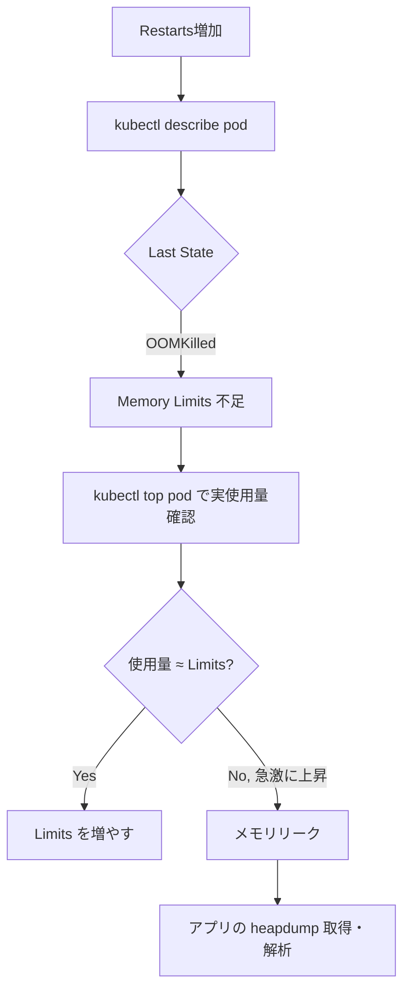
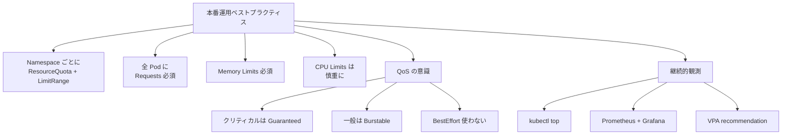

# リソース管理 (Requests/Limits)
{: .no_toc }

## 目次
{: .no_toc .text-delta }

1. TOC
{:toc}

---

Pod ごとに **CPU / Memory の Requests と Limits** を設定するのは、本番運用で **必須** です。
設定しないと「特定 Pod がノードを食い尽くしてクラスタ全体が不安定化」が容易に起こります。
このページでは Requests / Limits の意味、QoS Class、cgroup との関係、適切な値の決め方、よくある罠を扱います。

## このページのゴール

このページを読み終えると、以下を **自分の言葉で説明できる** ようになります。

- Requests と Limits の役割の違いをスケジューラ視点と kubelet 視点で説明できる
- CPU と Memory で「Limits 超過時の挙動」が違う理由を cgroup レベルで説明できる
- QoS Class の判定ロジックと Eviction 順序を説明できる
- なぜ近年「CPU Limits を設定しない」推奨が広まったのか説明できる
- `kubectl top` を使ってリソース使用量を観測し、Requests を妥当に決められる
- ResourceQuota / LimitRange / Resource Recommendations の関係を整理できる

## なぜ Requests / Limits が必要か

K8s の世界に入ると最初は「動けば OK」で、Resources を空欄のまま運用しがちです。これがどう破綻するか:



これを防ぐには、各 Pod に「**最低これだけは欲しい(Requests)**」と「**これ以上は使わないでね(Limits)**」を申告させる仕組みが必要です。

## 歴史的経緯

Linux で「プロセスごとにリソース上限を制御する」仕組みは複数の世代があります。



K8s の Resources は **cgroup の薄いラッパー** です。`requests.cpu: 100m` を書くと、kubelet が `cpu.weight=10` のような cgroup ファイルを書き込む。`limits.memory: 256Mi` を書くと `memory.max=268435456` を書き込む。
つまり「K8s が魔法でリソース制御している」のではなく「**Linux カーネルの機能を使っている**」のです。

参考:
- [cgroup v2 documentation](https://docs.kernel.org/admin-guide/cgroup-v2.html)
- [Kubernetes と cgroup v2](https://kubernetes.io/docs/concepts/architecture/cgroups/)

## Requests と Limits

| | Requests | Limits |
|---|---------|--------|
| 意味 | スケジューリングに使う「予約」 | 実行時の上限 |
| 誰が見るか | kube-scheduler | kubelet → cgroup |
| CPU 超過時 | 関係なし | スロットリング(throttle、kill されない) |
| Memory 超過時 | 関係なし | OOMKill |
| デフォルト値 | LimitRange があればそこから | LimitRange があればそこから / なければ無制限 |

### YAML

```yaml
apiVersion: v1
kind: Pod
metadata:
  name: api
spec:
  containers:
  - name: api
    image: 192.168.56.10:5000/todo-api:0.1.0
    resources:
      requests:
        cpu: 100m
        memory: 128Mi
      limits:
        cpu: 500m
        memory: 256Mi
```

これだけで:

- スケジューラは「CPU 100m / Memory 128Mi 以上の空きがあるノード」に配置
- kubelet は cgroup に「CPU 500m / Memory 256Mi」の上限を設定



## 単位の話

### CPU

| 表記 | 意味 |
|------|------|
| `1` | 1 vCPU(物理コア / ハイパースレッド)|
| `1000m` | 同上(`m` は milli)|
| `100m` | 0.1 vCPU |
| `0.5` | 0.5 vCPU(`500m` と同じ)|

CPU は「絶対的な計算能力の量」ではなく「**そのノードの 1 vCPU を何割使っていいか**」と覚えると良いです。
ノードが 4 vCPU で `requests.cpu: 1` の Pod は、その 1 / 4 を使う権利がある、という考え方。

### Memory

| 表記 | 意味 |
|------|------|
| `Ki` | 2 進数 KiB(1024 bytes)|
| `Mi` | 2 進数 MiB(1048576 bytes)|
| `Gi` | 2 進数 GiB |
| `K` | 10 進数 KB(1000 bytes)|
| `M` | 10 進数 MB |
| `G` | 10 進数 GB |

実務では `Mi` / `Gi` が主流。`128M` と `128Mi` は微妙に違うので注意(差は約 5%)。

## CPU の挙動を深掘り

CPU の cgroup 制御は **CFS(Completely Fair Scheduler)bandwidth control** を使います。

| cgroup ファイル(v2)| 役割 | K8s の対応 |
|----------------------|------|----------|
| `cpu.weight` | CPU 時間の重み(1〜10000、デフォルト 100)| `requests.cpu` から計算 |
| `cpu.max` | 期間内に使える CPU 時間 | `limits.cpu` から計算 |

`cpu.max` は `<quota> <period>` の形式で、`100000 100000` なら 100ms 中 100ms 使える(= 1 CPU 上限)。
`limits.cpu: 500m` だと `50000 100000`(50ms / 100ms = 50% 上限)。

### CPU スロットリング

Limits を超えると、コンテナは **強制的に止められます**。「殺される」のではなく「次の period(通常 100ms)が来るまで待たされる」。



つまり「使用率 50% 以下なら問題なし、超えると半分の時間止まる」。

### CPU スロットリングの問題

ここが最近物議を醸している部分です。

実際の負荷は **バースト的** で、1 秒平均では Limits 以下でも、100ms 単位で見ると瞬間的に超えます。スロットリングがかかると「アプリが応答しない 50ms」が発生し、p99 レイテンシが悪化。

```
時間  ----0ms----50ms----100ms----150ms----
負荷  低         高い (bursty)  低
スロ                  ▼ throttle
```

特に Java や Node.js のように **GC やイベントループ** がある言語では、GC バーストで簡単に Limits に当たります。

### 「CPU Limits を設定しない」推奨

近年、**CPU Limits は設定しない / 緩めに** という意見が広まっています。

| 主張する組織 | 主旨 |
|------------|------|
| Datadog | "Why you should never use CPU limits in Kubernetes" |
| Buoyant (Linkerd) | アプリの p99 が劇的に改善 |
| Robusta | 過半数の事故事例で CPU Limits が原因 |

理由:

1. **CPU は「奪い合うもの」**。Memory のように足りなくなると殺されるわけではない
2. **Requests があればクラスタ全体の公平性は担保される**
3. **Limits があると「使えるはずの CPU が使えない」**

代わりの方針:

```yaml
resources:
  requests:
    cpu: 100m       # 必須
    memory: 128Mi   # 必須
  limits:
    # cpu は意図的に書かない
    memory: 256Mi   # OOM 暴走防止に必須
```

ただし以下は CPU Limits を入れる派:

- マルチテナント環境で「他人に CPU を取られたくない」(でも Requests 増やせばよい)
- バッチ系で「夜中に CPU 100% 持っていかれると他に影響」

判断は **アプリの性質と運用** で。本教材ではサンプルアプリは CPU Limits なしで設計します。

## Memory の挙動を深掘り

Memory の cgroup 制御:

| cgroup ファイル(v2)| 役割 | K8s の対応 |
|----------------------|------|----------|
| `memory.low` | この値までは保護 | (使われていない) |
| `memory.max` | ハードリミット | `limits.memory` |
| `memory.swap.max` | swap の上限 | swap 無効化推奨なので 0 |

### OOMKill

メモリ Limits を超えると、Linux カーネルの **OOM killer** がそのプロセスに `SIGKILL` を送ります。

```bash
kubectl describe pod hungry
# Last State: Terminated
#   Reason: OOMKilled
#   Exit Code: 137         # 128 + 9 (SIGKILL)
```

`Exit Code 137` は **OOM のサイン**。覚えておくと便利。

### oom_score_adj

Linux カーネルは「どのプロセスを殺すか」を `oom_score` で決めます。スコアが高いプロセスが優先的に殺される。
K8s は QoS Class に基づいて `oom_score_adj` を調整します。

| QoS Class | oom_score_adj |
|-----------|--------------|
| Guaranteed | -997 |
| Burstable | 2〜999(リソース要求量で変動)|
| BestEffort | 1000 |

つまり **BestEffort が真っ先に殺され、Guaranteed は最後** です。

参考: [Linux OOM Killer](https://docs.kernel.org/admin-guide/mm/numa_memory_policy.html#proc-mem-info)

### Memory Limits の罠

CPU と違い、Memory は **超えたら殺される**。これは「殺されたくないなら超えるな」というシンプルな話ですが、難しいのは「**プログラムの実メモリ使用量を予測しにくい**」こと。

| 言語 / RT | メモリの読みやすさ |
|----------|------------------|
| Go | 比較的予測可能(GC は動くが量は安定)|
| Rust | 予測可能 |
| Python | so-so(GC ヒープが膨らみがち)|
| Java | むずい(JVM ヒープ + Metaspace + ネイティブ + スレッドスタック)|
| Node.js | so-so(V8 のヒープサイズに依存)|

JVM 系は特に注意:

- `-Xmx2g` を指定しても、JVM プロセス全体は 2GB を超えることが普通(Metaspace、JIT cache、direct buffers、スレッドスタック...)
- `limits.memory: 2Gi` で OOMKill されることがある
- 最近の JVM は `-XX:+UseContainerSupport`(Java 10+ 既定)で cgroup を見るようになり改善

### Memory Limits は必須

CPU と違って Memory は **必ず Limits を入れる** のが定石です。
理由:

1. メモリリークがあると無限に膨らみ、ノードを食い尽くす
2. OOM はプロセス単位で発動するので、Limits があればその Pod だけが殺される
3. CPU と違って「我慢」が効かない(swap 無効化前提)

## QoS Class

Pod の Requests/Limits の組み合わせから自動的に決まる優先度。
ノードリソース逼迫時の Eviction(Pod 追い出し)対象決定に使われます。

| QoS Class | 条件 | Eviction 順位 |
|-----------|------|-------------|
| **Guaranteed** | 全コンテナで Requests = Limits(かつ両方とも CPU/Memory 設定)| 最後 |
| **Burstable** | Guaranteed の条件を満たさず、何らかの Requests または Limits 設定 | 中間 |
| **BestEffort** | Requests / Limits 全く未設定 | 最初 |

### 確認

```bash
kubectl get pod <name> -o jsonpath='{.status.qosClass}'
# Guaranteed
```

### Guaranteed の例

```yaml
resources:
  requests:
    cpu: 500m
    memory: 256Mi
  limits:
    cpu: 500m       # ←requests と同じ
    memory: 256Mi   # ←requests と同じ
```

CPU Limits なし推奨と Guaranteed は両立しません。**Guaranteed が必須なクリティカル Pod のみ Limits を入れる**、という運用が現実的。

### Burstable の例

```yaml
resources:
  requests:
    cpu: 100m
    memory: 128Mi
  limits:
    memory: 256Mi
    # cpu Limits は意図的になし
```

通常のアプリはこれ。

### BestEffort の例

```yaml
# resources セクションなし
```

**本番では使わない**。Eviction 時に真っ先に殺される。

### Eviction の流れ

ノードのリソースが逼迫すると、kubelet が **Eviction Threshold** を見て Pod を追い出します。



Eviction Threshold(kubelet 設定):

| パラメータ | デフォルト |
|----------|-----------|
| `memory.available` | `< 100Mi` |
| `nodefs.available` | `< 10%` |
| `nodefs.inodesFree` | `< 5%` |
| `imagefs.available` | `< 15%` |

参考: [Node-pressure Eviction](https://kubernetes.io/docs/concepts/scheduling-eviction/node-pressure-eviction/)

## ノードの容量とオーバーコミット

```bash
kubectl describe node k8s-w1
```

期待される出力:

```
Capacity:
  cpu:                2
  ephemeral-storage:  40189076Ki
  memory:             4001852Ki
  pods:               110
Allocatable:
  cpu:                1900m              # システム予約後
  ephemeral-storage:  37068965713
  memory:             3399676Ki          # 600Mi 程度を kubelet/system 用に予約
  pods:               110
Allocated resources:
  Resource           Requests      Limits
  --------           --------      ------
  cpu                850m (44%)    1500m (78%)
  memory             1024Mi (30%)  2Gi (60%)
```

| 項目 | 意味 |
|------|------|
| `Capacity` | ノード本来の量 |
| `Allocatable` | K8s が割当に使える量 = Capacity - kube-reserved - system-reserved - eviction-hard |
| `Allocated resources` | 配置済み Pod の Requests / Limits 合計 |

`Allocatable < Capacity` なのは、kubelet 自身、systemd、CRI などが使う分を予約しているから。

### kube-reserved / system-reserved

```yaml
# /var/lib/kubelet/config.yaml
kubeReserved:
  cpu: 100m
  memory: 256Mi
systemReserved:
  cpu: 100m
  memory: 256Mi
evictionHard:
  memory.available: "100Mi"
```

予約量の計算:

```
Allocatable = Capacity - kubeReserved - systemReserved - evictionHard
            = 2000m - 100m - 100m - 0 = 1800m  (CPU)
            = 4Gi - 256Mi - 256Mi - 100Mi = 3.4Gi  (Memory)
```

### オーバーコミット

Requests の合計はノード Allocatable を **超えられません**(scheduler が拒否)。
Limits の合計は **超えられます**。

```
ノード: CPU 2 vCPU, Memory 4Gi
Pod A: requests {cpu:500m,mem:512Mi}, limits {cpu:1,mem:1Gi}
Pod B: requests {cpu:500m,mem:512Mi}, limits {cpu:1,mem:1Gi}
Pod C: requests {cpu:500m,mem:512Mi}, limits {cpu:1,mem:1Gi}
合計: requests {cpu:1.5,mem:1.5Gi}, limits {cpu:3,mem:3Gi}
                                         ↑Capacity 超えている = オーバーコミット
```

これが「コンテナの密度を上げる」コア原理。**全 Pod が一斉に Limits まで使ったら破綻** しますが、現実には「全 Pod が同時にピーク」は稀。



オーバーコミット率の管理:

- 開発環境: 高め(コスト最適化)
- ステージング: 中程度
- 本番: 低め(可用性重視)

## ResourceQuota と LimitRange

Namespace 単位でリソースを制限する仕組み。

### ResourceQuota

「このネームスペースで使える総量」を制限。

```yaml
apiVersion: v1
kind: ResourceQuota
metadata:
  name: todo-quota
  namespace: todo
spec:
  hard:
    requests.cpu: "4"
    requests.memory: 8Gi
    limits.cpu: "8"
    limits.memory: 16Gi
    pods: "20"
    persistentvolumeclaims: "10"
    services.loadbalancers: "2"
```

設定後、新しい Pod が `requests.cpu` を **書いていない** と admission で拒否されます:

```
Error from server (Forbidden): error when creating "pod.yaml":
pods "myapp" is forbidden: failed quota: todo-quota: must specify cpu
```

これが「**Resources 設定を強制する**」ベストプラクティス。

### LimitRange

「Pod / Container 個別のデフォルト値と上下限」を設定。

```yaml
apiVersion: v1
kind: LimitRange
metadata:
  name: todo-limits
  namespace: todo
spec:
  limits:
  - type: Container
    default:                 # limits 未指定時のデフォルト
      cpu: 500m
      memory: 256Mi
    defaultRequest:          # requests 未指定時のデフォルト
      cpu: 100m
      memory: 128Mi
    max:                     # ハードリミット
      cpu: "2"
      memory: 2Gi
    min:                     # ハードフロア
      cpu: 50m
      memory: 64Mi
```

これがあれば「**Resources を全く書いていない Pod でもデフォルト値が入る**」。

### 組み合わせ



本番では:

- Namespace ごとに ResourceQuota
- Namespace ごとに LimitRange(デフォルト + 上限)
- これにより「**個別 Pod に Resources 書かなくても安全な値が入る**」

## 適切な値を決める方法

### 1. 観測する

```bash
# Metrics Server をインストール
kubectl apply -f https://github.com/kubernetes-sigs/metrics-server/releases/latest/download/components.yaml
# ローカルではこれを編集して --kubelet-insecure-tls を追加
kubectl edit deployment -n kube-system metrics-server
```

Metrics Server が動いたら:

```bash
kubectl top pod
# NAME          CPU(cores)   MEMORY(bytes)
# todo-api-x    25m          85Mi
# todo-api-y    32m          90Mi

kubectl top pod -n todo --containers
# POD          NAME    CPU(cores)   MEMORY(bytes)
# todo-api-x   api     25m          85Mi
```

### 2. 負荷試験で観測

`hey` や `wrk` で負荷をかけて、p50 / p99 / max を観察。

```bash
kubectl run -it loadgen --rm --image=williamyeh/hey -- \
  -z 60s -c 50 http://todo-api/api/todos

# 別端末で
watch -n 1 kubectl top pod -l app.kubernetes.io/name=todo-api
```

### 3. 値の決め方の経験則

| | Requests | Limits |
|---|---------|--------|
| **Memory** | 平均使用量 + 30%(成長余地)| Requests × 2(余裕)or 観測上 max × 1.5 |
| **CPU** | 平均使用量 | (Limits なし)or Requests × 4 |

これはあくまで初期値。観測しながら調整。

### 4. VerticalPodAutoscaler を recommendation 用に使う

VPA を `updateMode: Off` で動かすと、推奨値だけ計算してくれます。

```yaml
apiVersion: autoscaling.k8s.io/v1
kind: VerticalPodAutoscaler
metadata:
  name: todo-api-rec
spec:
  targetRef:
    apiVersion: apps/v1
    kind: Deployment
    name: todo-api
  updatePolicy:
    updateMode: "Off"        # 自動適用しない
```

```bash
kubectl describe vpa todo-api-rec
# Recommendations:
#   Container Recommendations:
#     Container Name: api
#     Lower Bound:
#       Cpu:     50m
#       Memory:  100Mi
#     Target:
#       Cpu:     150m
#       Memory:  200Mi
#     Upper Bound:
#       Cpu:     500m
#       Memory:  500Mi
```

詳しくは autoscaling のページで。

## サンプルアプリの Resources 設計

### todo-api(Python FastAPI)

```yaml
resources:
  requests:
    cpu: 100m
    memory: 128Mi
  limits:
    memory: 256Mi
    # cpu Limits なし
```

理由:

- FastAPI は I/O バウンドで CPU 軽い
- メモリは Python 起動コストで 80Mi、リクエスト中に最大 150Mi 程度
- 安全マージンで Requests 128Mi、Limits 256Mi

### todo-frontend(Nginx 静的)

```yaml
resources:
  requests:
    cpu: 10m
    memory: 32Mi
  limits:
    memory: 64Mi
```

理由:

- Nginx は基本 sleeper、CPU はほとんど使わない
- メモリも数十 Mi で十分

### postgres(StatefulSet)

```yaml
resources:
  requests:
    cpu: 250m
    memory: 512Mi
  limits:
    memory: 1Gi       # postgres は max_connections や shared_buffers で読みやすい
```

PostgreSQL は `shared_buffers`(デフォルト 128MB)+ `work_mem` × max_connections + WAL バッファ … で見積もり可能。

### redis(StatefulSet)

```yaml
resources:
  requests:
    cpu: 100m
    memory: 128Mi
  limits:
    memory: 256Mi
```

`maxmemory` を `200mb` に設定して、redis 自身も制限。

### todo-worker(CronJob)

```yaml
resources:
  requests:
    cpu: 100m
    memory: 64Mi
  limits:
    memory: 128Mi
```

短時間で終わる軽量バッチ。

## 主要コマンドと期待出力

### Resources を確認する

```bash
kubectl get pod <name> -o jsonpath='{.spec.containers[*].resources}' | jq
```

**期待される出力**:

```json
{
  "limits": {"memory": "256Mi"},
  "requests": {"cpu": "100m", "memory": "128Mi"}
}
```

### QoS Class を確認

```bash
kubectl get pod <name> -o jsonpath='{.status.qosClass}'
# Burstable
```

### ノードのリソース状況

```bash
kubectl describe node k8s-w1 | sed -n '/Allocated/,/Events/p'
```

**期待される出力**:

```
Allocated resources:
  Resource           Requests      Limits
  --------           --------      ------
  cpu                850m (44%)    1500m (78%)
  memory             1024Mi (30%)  2Gi (60%)
  ephemeral-storage  0 (0%)        0 (0%)
```

### 全ノードのリソース使用量

```bash
kubectl top node
# NAME      CPU(cores)   CPU%   MEMORY(bytes)   MEMORY%
# k8s-w1    245m         12%    1234Mi          30%
# k8s-w2    132m         6%     980Mi           24%
# k8s-w3    78m          4%     512Mi           12%
```

## トラブルシューティング

### 症状: Pod が `OOMKilled` で再起動



```bash
kubectl describe pod hungry
# Last State:     Terminated
#   Reason:       OOMKilled
#   Exit Code:    137
```

`Exit Code: 137` (= 128 + SIGKILL 9) は OOM の決定的サイン。

### 症状: Pod が `Pending` のまま

```bash
kubectl describe pod pending
# Events:
#   Warning  FailedScheduling  default-scheduler  0/6 nodes are available:
#     6 Insufficient cpu, 4 Insufficient memory.
```

→ Requests が大きすぎる、ノード資源不足。

```bash
# 各ノードの空き
kubectl describe nodes | grep -A 4 "Allocated resources"
```

対処:

- Requests を小さくする
- ノードを増やす
- 不要な Pod を削除

### 症状: アプリが遅い、p99 レイテンシが悪い

```bash
# CPU スロットリングが発生していないか
kubectl exec <pod> -- cat /sys/fs/cgroup/cpu.stat
# nr_throttled 12345     ←これが伸びている = スロットリング発生中
# throttled_time 6789
```

→ CPU Limits が厳しすぎる。**Limits を緩めるか削除**。

### 症状: ノードが NotReady になる

```bash
kubectl describe node <name>
# Conditions:
#   MemoryPressure: True   ←メモリ逼迫
#   DiskPressure: False
```

→ Eviction が発生している。BestEffort Pod が殺されている可能性あり。

```bash
kubectl get events --field-selector reason=Evicted -A
```

### エラーメッセージ → 対処表

| エラー | 原因 | 対処 |
|--------|------|------|
| `OOMKilled` | Memory Limits 超過 | Limits を増やす / リーク調査 |
| `Insufficient cpu/memory` | Requests 過大 | Requests 縮小 or ノード追加 |
| `failed quota` | ResourceQuota 超過 | Quota を見直すか、別 Namespace で |
| `forbidden: minimum cpu usage per Container is 50m` | LimitRange.min 違反 | Requests を min 以上に |
| `forbidden: maximum memory usage per Container is 2Gi` | LimitRange.max 違反 | Limits を max 以下に |
| `pods "x" is forbidden: failed quota: must specify limits.memory` | Resources 未設定 | Resources を書く |

## 代替手法・関連機能

### 1. NodeOOM 対策(swap 有効化)

K8s v1.28 から `LimitedSwap` モードで swap を限定的に有効化できます(KEP-2400)。
本教材では使いませんが、メモリ制約のキツい環境では検討の余地あり。

### 2. cgroup v2 のメリット

- メモリ管理が改善(memory.high で「ソフトリミット」が使える)
- Pressure Stall Information(PSI)で詳細メトリクス
- swap 制御が分離

ローカル kubeadm v1.30 + Ubuntu 22.04 はデフォルトで cgroup v2。

### 3. NUMA awareness

大型ノードでは「コアによってメモリアクセス速度が違う」。kubelet には [Topology Manager](https://kubernetes.io/docs/tasks/administer-cluster/topology-manager/) があり、NUMA を意識した配置ができます。本教材スコープ外。

### 4. CPU Manager

`static` ポリシーで「特定の Pod に物理コアを専有させる」ことが可能。
レイテンシ重視のワークロード(取引、ゲーム)で。

```yaml
# /var/lib/kubelet/config.yaml
cpuManagerPolicy: static
```

Guaranteed QoS かつ CPU が整数値の Pod のみ対象。

### 5. ExtendedResources(GPU など)

GPU、IPアドレス、ライセンスなど任意のリソースを `requests/limits` で扱えます。

```yaml
resources:
  limits:
    nvidia.com/gpu: 1
```

ノードが対応する Device Plugin を入れておく必要があります。

## 本番運用のベストプラクティス



### チェックリスト

- [ ] Namespace に ResourceQuota が設定されている
- [ ] Namespace に LimitRange が設定されている(default + max)
- [ ] 全 Pod に CPU/Memory の Requests が設定されている
- [ ] 全 Pod に Memory Limits が設定されている
- [ ] BestEffort Pod が存在しない
- [ ] クリティカルなコンポーネント(API, DB)は Guaranteed
- [ ] Metrics Server が動作し、`kubectl top` が使える
- [ ] OOMKill / FailedScheduling が継続的に監視されている

## ハンズオン

### 1. メモリリーク Pod を作って OOM を観察

```yaml
# leak.yaml
apiVersion: v1
kind: Pod
metadata:
  name: leak
spec:
  containers:
  - name: leak
    image: python:3.12-slim
    command: ["python", "-c", "a=[];i=0
while True: a.append('x'*1024*1024);i+=1"]
    resources:
      limits:
        memory: 100Mi
```

```bash
kubectl apply -f leak.yaml
kubectl get pod leak -w
# leak  1/1  Running  0  10s
# leak  0/1  OOMKilled  0  20s
# leak  1/1  Running  1  25s    ←自動再起動
# leak  0/1  OOMKilled  1  35s
```

### 2. CPU スロットリングの観察

```yaml
apiVersion: v1
kind: Pod
metadata:
  name: cpu-burn
spec:
  containers:
  - name: burner
    image: alpine
    command: ["sh", "-c", "while true; do :; done"]
    resources:
      requests:
        cpu: 100m
      limits:
        cpu: 200m
```

```bash
kubectl apply -f cpu-burn.yaml
kubectl exec cpu-burn -- cat /sys/fs/cgroup/cpu.stat
# nr_throttled が増えていく
```

### 3. ResourceQuota の発動を確認

```bash
kubectl create namespace tight
cat <<EOF | kubectl apply -f -
apiVersion: v1
kind: ResourceQuota
metadata:
  name: tight-quota
  namespace: tight
spec:
  hard:
    requests.cpu: "1"
    requests.memory: 1Gi
EOF

# Resources なしの Pod を作る
kubectl run -n tight nores --image=nginx
# Error: pods "nores" is forbidden: failed quota: ...
```

### 4. VPA で推奨値を見る

VPA をインストール:

```bash
git clone https://github.com/kubernetes/autoscaler.git
cd autoscaler/vertical-pod-autoscaler
./hack/vpa-up.sh
```

サンプルアプリに `updateMode: Off` の VPA を当てて、しばらく動かした後 `kubectl describe vpa` で recommendation を確認。

## チェックポイント

- [ ] CPU Limits 超過時と Memory Limits 超過時の挙動の違いを cgroup レベルで説明できる
- [ ] QoS Class の判定ロジックを言える
- [ ] QoS Class が Eviction 順序にどう影響するか説明できる
- [ ] CPU Limits を「入れない / 緩める」現代的な推奨の根拠を説明できる
- [ ] `Allocatable` と `Capacity` の違い、kube-reserved の意味を説明できる
- [ ] オーバーコミットがなぜ可能か、何がリスクか説明できる
- [ ] ResourceQuota と LimitRange の役割の違いを言える
- [ ] `Exit Code 137` が何を意味するか言える
- [ ] `kubectl top` を使って Pod の使用量を確認できる
- [ ] サンプルアプリの API / DB / Frontend / Worker それぞれに妥当な Requests / Limits を設計できる

→ 次は [Autoscaling (HPA/VPA/CA)]({{ '/07-production/autoscaling/' | relative_url }})
