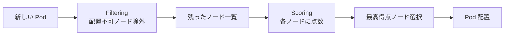
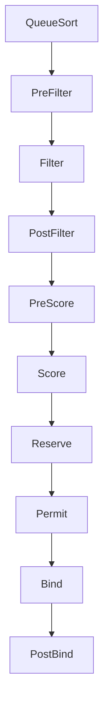
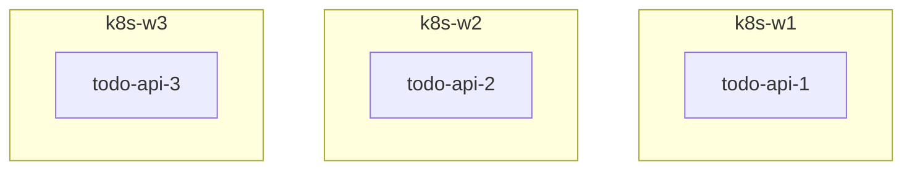
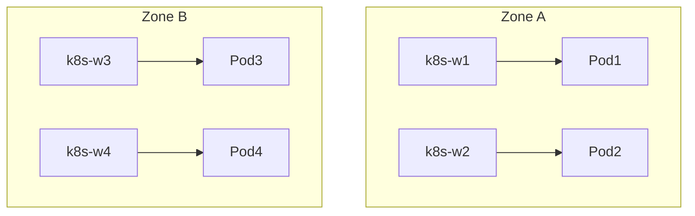
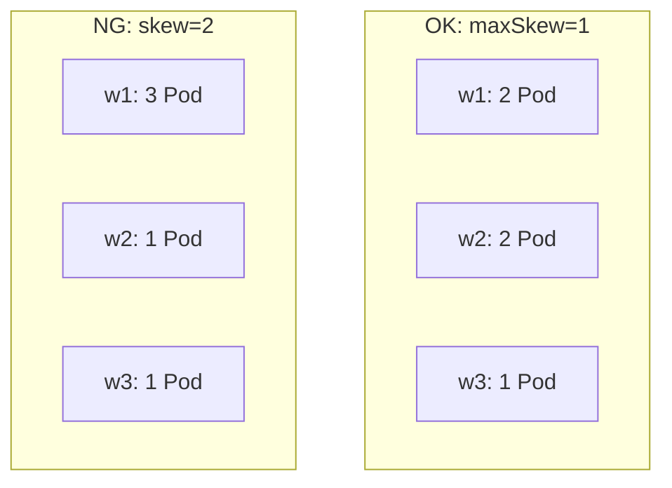
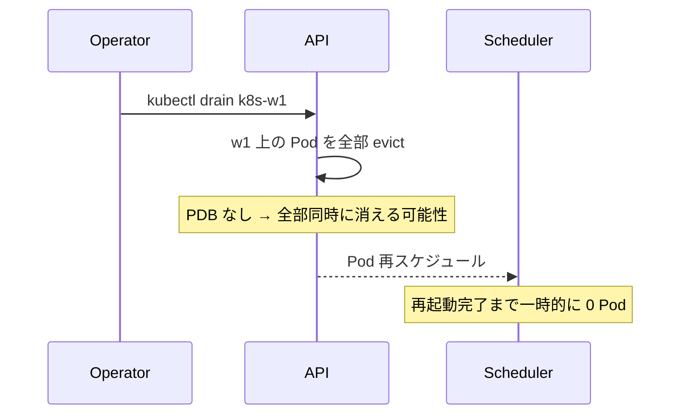
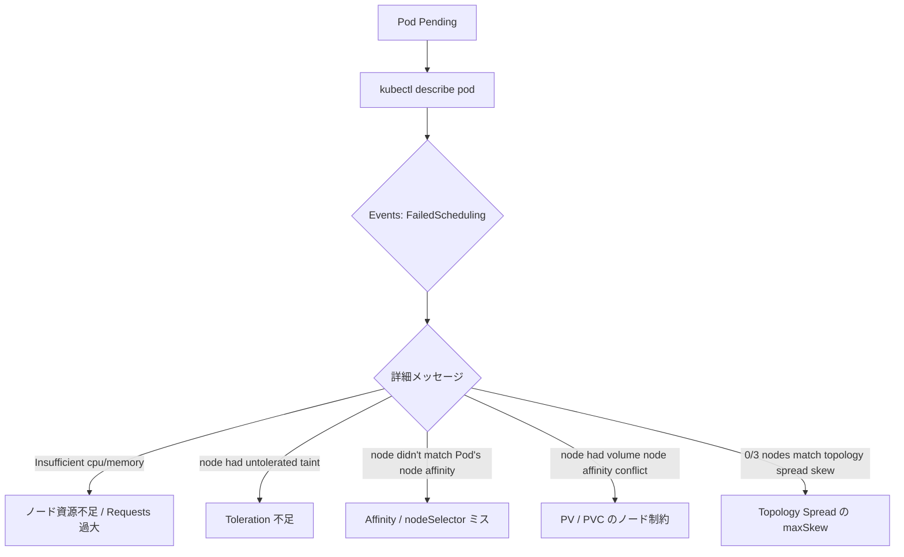
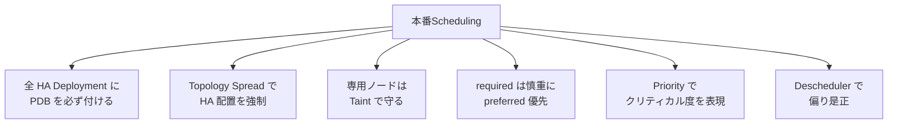

# Scheduling (Affinity/PDB/Taint)
{: .no_toc }

## 目次
{: .no_toc .text-delta }

1. TOC
{:toc}

---

Pod の配置先(=どのノードに置かれるか)は通常 K8s スケジューラに任せて問題ありません。
しかし本番では「**この Pod は SSD ノードに置きたい**」「**API は別ノードに分散させたい**」「**メンテで一斉に Pod が落ちないようにしたい**」など、配置を細かく制御する必要が出てきます。

このページでは:

- **nodeSelector**: 最もシンプルな配置指定
- **Node Affinity**: より柔軟な配置指定
- **Pod Affinity / Anti-Affinity**: 他の Pod を基準とした配置
- **Taint / Toleration**: ノード側からの拒否
- **Topology Spread Constraints**: 均等分散
- **PodDisruptionBudget**: メンテ時の同時停止数制限

を扱います。

## このページのゴール

このページを読み終えると、以下を **自分の言葉で説明できる** ようになります。

- スケジューラの 2 段階アルゴリズム(Filtering → Scoring)を説明できる
- nodeSelector / NodeAffinity / PodAffinity / Taint の使い分けを言える
- `requiredDuringScheduling` と `preferredDuringScheduling` の違いを説明できる
- Topology Spread Constraints が NodeAffinity / PodAntiAffinity と何が違うか言える
- PDB がない時にドレインで何が起きるかを正確に説明できる
- マスターに Taint が付いている理由を歴史的経緯とともに説明できる

## スケジューラの動作原理

K8s のデフォルトスケジューラ(`kube-scheduler`)は、Pod が作られると **2 段階の判定** で配置先を決めます。



### Filtering(配置不可ノード除外)

各ノードについて「**この Pod を置けるか?**」を判定します。

| 判定 | 内容 |
|------|------|
| `NodeResourcesFit` | ノードの空きが Pod の Requests を満たすか |
| `NodeName` | `pod.spec.nodeName` 指定があるか |
| `NodeSelector` / `NodeAffinity` | ノードのラベルが Pod の要件に合うか |
| `TaintToleration` | ノードの Taint に対応する Toleration を Pod が持つか |
| `PodAffinity` / `PodAntiAffinity` | 既存 Pod との位置関係 |
| `VolumeBinding` | 必要な PV がそのノードから利用可能か |
| `PodTopologySpread` | Topology 制約に違反しないか |

すべての Filter を通ったノードだけが残ります。残らなければ `Pending`。

### Scoring(点数付け)

残ったノードに 0〜100 の点数を付け、最高点のノードを選びます。

| 点数加算プラグイン | 内容 |
|-----------------|------|
| `LeastAllocated` | 空きが多いノードほど高得点 |
| `BalancedAllocation` | CPU と Memory のバランスが良いほど高得点 |
| `NodeAffinity` (preferred) | preferred 条件を満たすほど加点 |
| `InterPodAffinity` (preferred) | preferred 条件を満たすほど加点 |
| `ImageLocality` | 既にイメージがあるノードを優遇(pull 不要)|
| `TaintToleration` (preferred) | PreferNoSchedule の Taint を回避 |

### スケジューラフレームワーク

K8s v1.19 以降、スケジューラは **プラグインアーキテクチャ** になっています。
Filter/Score は 1 個のフェーズに過ぎず、実際は QueueSort / PreFilter / Filter / PostFilter / PreScore / Score / PostBind など複数の拡張点があります。



カスタムスケジューラは複数併用も可能(`schedulerName: my-scheduler`)。本教材ではデフォルトのみ扱います。

参考: [Scheduling Framework](https://kubernetes.io/docs/concepts/scheduling-eviction/scheduling-framework/)

## nodeSelector(最も基本)

ノードに付いたラベルが完全一致すれば配置、しなければ除外。

```yaml
spec:
  nodeSelector:
    disktype: ssd
```

ノード側にラベルを付ける:

```bash
kubectl label node k8s-w1 disktype=ssd
kubectl label node k8s-w2 disktype=ssd
kubectl label node k8s-w3 disktype=hdd

kubectl get nodes --show-labels
```

| 状況 | 結果 |
|------|------|
| ラベル `disktype=ssd` のノードが空きあり | そこに配置 |
| `disktype=ssd` ノードが満杯 / なし | Pending |

### 既定で付くラベル

ノードには K8s が自動で付けるラベルがあります(よく使う):

| ラベル | 例 |
|-------|---|
| `kubernetes.io/hostname` | `k8s-w1` |
| `kubernetes.io/os` | `linux` |
| `kubernetes.io/arch` | `amd64` |
| `node-role.kubernetes.io/control-plane` | `""`(値なし)|
| `topology.kubernetes.io/zone` | `zone-a`(クラウド設定済時)|
| `topology.kubernetes.io/region` | `us-east-1` |

これらは付け足し設定なしで利用できます。

## Node Affinity(柔軟な配置)

nodeSelector の上位互換。AND/OR/NOT の表現や、必須・推奨の区別ができます。

```yaml
spec:
  affinity:
    nodeAffinity:
      requiredDuringSchedulingIgnoredDuringExecution:
        nodeSelectorTerms:
        - matchExpressions:
          - key: disktype
            operator: In
            values: [ssd, nvme]
          - key: kubernetes.io/os
            operator: In
            values: [linux]
      preferredDuringSchedulingIgnoredDuringExecution:
      - weight: 100
        preference:
          matchExpressions:
          - key: topology.kubernetes.io/zone
            operator: In
            values: [zone-a]
      - weight: 10
        preference:
          matchExpressions:
          - key: spot-instance
            operator: NotIn
            values: ["true"]
```

### required と preferred

| キーワード | 必須/推奨 | 満たさない場合 |
|-----------|---------|--------------|
| `requiredDuringSchedulingIgnoredDuringExecution` | 必須(配置時)| Pending |
| `preferredDuringSchedulingIgnoredDuringExecution` | 推奨(配置時)| 他に良いノードがなければ妥協 |

`IgnoredDuringExecution` は「**配置済 Pod は条件外れても追い出さない**」の意。
かつて `RequiredDuringExecution` も計画されていましたが未実装。Pod を退去させる仕組みは Taint(NoExecute)で実現されます。

### operator

| operator | 意味 |
|---------|------|
| `In` | values のいずれか |
| `NotIn` | values のいずれでもない |
| `Exists` | キーが存在する(values 不要)|
| `DoesNotExist` | キーが存在しない |
| `Gt` | values より大きい(数値)|
| `Lt` | values より小さい |

### matchExpressions と matchFields

`matchExpressions` がノードラベルに対するマッチ。`matchFields` はノードの **フィールド** に対するマッチ:

```yaml
- matchFields:
  - key: metadata.name
    operator: In
    values: [k8s-w1]
```

ノード名直指定。ほぼ使わない(nodeName で十分)。

## Pod Affinity / Anti-Affinity

「他の Pod の **近くに** 置く / **離して** 置く」。HA 設計の核。

### Pod Anti-Affinity(分散配置の定番)

```yaml
spec:
  replicas: 3
  template:
    metadata:
      labels:
        app.kubernetes.io/name: todo-api
    spec:
      affinity:
        podAntiAffinity:
          requiredDuringSchedulingIgnoredDuringExecution:
          - labelSelector:
              matchLabels:
                app.kubernetes.io/name: todo-api
            topologyKey: kubernetes.io/hostname
```

**「同じ `app.kubernetes.io/name=todo-api` ラベルを持つ Pod が、同じ `kubernetes.io/hostname` ラベル(=同じノード)に居ないように」**。
つまり 1 ノード 1 Pod。



### topologyKey

「どのレベルで離す/寄せるか」。

| topologyKey | 意味 |
|------------|------|
| `kubernetes.io/hostname` | ノード単位 |
| `topology.kubernetes.io/zone` | AZ 単位(クラウドで自動、オンプレでも手で付けられる)|
| `topology.kubernetes.io/region` | リージョン単位 |
| 任意のラベルキー | カスタム(rack, row, など)|



`topologyKey: topology.kubernetes.io/zone` だと「AZ をまたいで分散」。

### Pod Affinity(同居させたい)

```yaml
spec:
  affinity:
    podAffinity:
      preferredDuringSchedulingIgnoredDuringExecution:
      - weight: 100
        podAffinityTerm:
          labelSelector:
            matchLabels:
              app.kubernetes.io/name: postgres
          topologyKey: kubernetes.io/hostname
```

「Postgres と同じノードに置きたい」=ローカル経由で通信したいケース。

ただし **Pod Affinity は乱用しない**。スケジューラが配置可能なノードを絞り込みすぎて、Pending になりがち。

### required vs preferred

Pod Anti-Affinity でよくある事故:

```yaml
podAntiAffinity:
  requiredDuringSchedulingIgnoredDuringExecution:
  - labelSelector:
      matchLabels:
        app.kubernetes.io/name: todo-api
    topologyKey: kubernetes.io/hostname
```

`replicas: 5` で worker が 3 台しかないと、4・5 個目が **永遠に Pending**。

これを `preferredDuringScheduling` にすれば「同居しないよう努力するが、必要なら同居も許可」になります。
**replicas <= worker 数** が見えている時は required、そうでないなら preferred。

## Taint と Toleration(ノード側からの拒否)

Affinity は「Pod が好みのノードを選ぶ」仕組み。Taint は逆で「**ノードが Pod を拒否する**」仕組み。
クリティカルなノードを汎用 Pod から守るのに使います。

### Taint を打つ

```bash
kubectl taint nodes k8s-w3 dedicated=db:NoSchedule
```

これで `k8s-w3` には、対応する Toleration を持たない Pod は **配置されません**。

### Toleration を持たせる

```yaml
spec:
  tolerations:
  - key: dedicated
    operator: Equal
    value: db
    effect: NoSchedule
```

Pod 側で「`dedicated=db:NoSchedule` の Taint があっても OK」と宣言。
Toleration を持つ Pod は、そのノードに配置可能になります(ただし強制ではない。Affinity と組み合わせる)。

### Effect の 3 種類

| effect | 動作 |
|--------|------|
| `NoSchedule` | 新規 Pod を配置しない(既存はそのまま)|
| `PreferNoSchedule` | できれば配置しない |
| `NoExecute` | 既存 Pod も追い出す |

`NoExecute` は強力。**Toleration がない Pod は即座に evict** されます。Toleration があっても `tolerationSeconds` を指定すると「N 秒後に追い出す」も可。

```yaml
tolerations:
- key: node.kubernetes.io/unreachable
  operator: Exists
  effect: NoExecute
  tolerationSeconds: 300        # 5 分間は粘る
```

### 既定で付いている Taint

#### マスターノード

```bash
kubectl describe node k8s-cp1 | grep Taint
# Taints: node-role.kubernetes.io/control-plane:NoSchedule
```

これにより一般 Pod はマスターに配置されません。これは:

- Control Plane の負荷を一般ワークロードから守る
- Control Plane の不調が広範囲に波及しないように

歴史: 古いバージョン(v1.24 まで)は `node-role.kubernetes.io/master` でした。GUI/CLI のインクルーシブ用語化で `master` → `control-plane` に。

#### ノード状態 Taint(自動)

ノードに問題があると K8s が自動で Taint を付けます。

| Taint | 条件 |
|-------|------|
| `node.kubernetes.io/not-ready` | ノードが NotReady |
| `node.kubernetes.io/unreachable` | ノードへの通信途絶 |
| `node.kubernetes.io/disk-pressure` | ディスク逼迫 |
| `node.kubernetes.io/memory-pressure` | メモリ逼迫 |
| `node.kubernetes.io/pid-pressure` | PID 不足 |
| `node.kubernetes.io/network-unavailable` | NW 構成不完全 |
| `node.kubernetes.io/unschedulable` | `cordon` 中 |

ほとんどの Pod は kubelet がこれらに対する Toleration を自動で付けてくれます(NotReady と unreachable は 5 分許容)。

### 用途別パターン

| 目的 | 使うもの |
|------|--------|
| 「特定ハードのノードを使いたい」 | nodeSelector / Node Affinity |
| 「特定ノードを専有させたい」 | Taint(他 Pod を排除)+ Toleration(自分は OK) |
| 「同種 Pod を分散させたい」 | Pod Anti-Affinity |
| 「均等にばらまきたい」 | Topology Spread Constraints |

## Topology Spread Constraints

Pod Anti-Affinity の進化形。「**できる限り均等に**」分散させたいケースに。

```yaml
spec:
  topologySpreadConstraints:
  - maxSkew: 1
    topologyKey: kubernetes.io/hostname
    whenUnsatisfiable: DoNotSchedule
    labelSelector:
      matchLabels:
        app.kubernetes.io/name: todo-api
```

| フィールド | 意味 |
|----------|------|
| `maxSkew` | 同じ topology 内で、同名 Pod の数の差の上限 |
| `topologyKey` | どのレベルで均等化するか |
| `whenUnsatisfiable` | `DoNotSchedule`(必須)/ `ScheduleAnyway`(推奨)|
| `labelSelector` | 対象 Pod の絞り込み |

### maxSkew=1 の意味

```
Worker 3 台に Pod を 5 個配置するとき:
  OK:    [2,2,1] (skew=1)
  NG:    [3,1,1] (skew=2)
  OK:    [2,1,2] (skew=1)
```



### Pod Anti-Affinity との違い

| | Pod Anti-Affinity | Topology Spread |
|---|------------------|----------------|
| 表現 | 「同居禁止」 | 「均等に分散」 |
| 結果 | 完全分離(replicas <= node) | 上限差を maxSkew で制御 |
| replicas > node | required では配置不可 | 偏り許容で配置 |

特に **replicas > node** の状況で Topology Spread が威力発揮。

### 複数の topologyKey

```yaml
topologySpreadConstraints:
- maxSkew: 1
  topologyKey: kubernetes.io/hostname
  whenUnsatisfiable: DoNotSchedule
  labelSelector:
    matchLabels: {app.kubernetes.io/name: todo-api}
- maxSkew: 1
  topologyKey: topology.kubernetes.io/zone
  whenUnsatisfiable: DoNotSchedule
  labelSelector:
    matchLabels: {app.kubernetes.io/name: todo-api}
```

「ホスト単位でも、ゾーン単位でも均等に」。

## PodDisruptionBudget(PDB)

ノードのドレインや CA でのノード削減で、**同時に何個まで Pod が落ちてよいか** を宣言。

### なぜ必要か



PDB がないと、**3 つあった Pod が一瞬 0 に** なる可能性があります。

### PDB の例

```yaml
apiVersion: policy/v1
kind: PodDisruptionBudget
metadata:
  name: todo-api
spec:
  minAvailable: 2          # 最低 2 つは生かす
  selector:
    matchLabels:
      app.kubernetes.io/name: todo-api
```

または:

```yaml
spec:
  maxUnavailable: 1        # 1 個までは落ちてよい
```

`replicas: 3, minAvailable: 2` だと、ドレイン中に常に 2 個動いている状態が保たれます。

### PDB が守るもの / 守らないもの

PDB は **「自発的中断」** から守るためのもの。

| 中断種別 | PDB が守る? |
|--------|--------------|
| `kubectl drain` | ✓ 守る |
| Cluster Autoscaler のノード削減 | ✓ 守る |
| Eviction API での退去 | ✓ 守る |
| ノード障害(NotReady)| ✗ 守らない(自発的でない)|
| `kubectl delete pod` | ✗ 守らない(直接削除)|
| OOMKill | ✗ 守らない |
| Preemption(優先度の低い Pod を退去)| 部分的(注意要)|

つまり「**計画的なメンテで PDB が守ってくれる**」というだけで、Pod が落ちる全シナリオから守るわけではありません。

### PDB の挙動

```yaml
replicas: 3
minAvailable: 2
```

→ 1 個までしか同時退去できない。`drain` コマンドは **PDB に違反する eviction を拒否** します。

```bash
kubectl drain k8s-w1 --ignore-daemonsets
# error: unable to drain node "k8s-w1" due to PodDisruptionBudget
# Cannot evict pod as it would violate the pod's disruption budget.
```

### maxUnavailable の意味の妙

```yaml
maxUnavailable: 50%
```

これは **percentage of replicas** で計算されます。

```yaml
replicas: 5
maxUnavailable: 50%      # → 2 個まで落ちてよい(切り捨て)
```

### percentage の四捨五入

| replicas | minAvailable: 50% の意味 |
|----------|-------------------------|
| 4 | minAvailable: 2(切り上げ)|
| 3 | minAvailable: 2(切り上げ)|
| 1 | minAvailable: 1 |

詳細は [PDB の挙動](https://kubernetes.io/docs/tasks/run-application/configure-pdb/) 参照。

## ハンズオン:ドレインと PDB

### 1. PDB なしでドレイン

```bash
# Deployment(replicas:3、PDB なし)を todo-api ラベルで作成
kubectl scale deployment todo-api --replicas=3

# w1 の Pod 数を確認
kubectl get pods -l app.kubernetes.io/name=todo-api -o wide

# w1 をドレイン
kubectl drain k8s-w1 --ignore-daemonsets --delete-emptydir-data

# その瞬間 / その直後の Endpoint
kubectl get endpoints todo-api
# w1 上の Pod がいきなり消える
```

### 2. PDB ありでドレイン

```yaml
# pdb.yaml
apiVersion: policy/v1
kind: PodDisruptionBudget
metadata:
  name: todo-api
spec:
  minAvailable: 2
  selector:
    matchLabels:
      app.kubernetes.io/name: todo-api
```

```bash
kubectl uncordon k8s-w1     # 戻す
kubectl apply -f pdb.yaml

# 全 worker をドレインしようとする
kubectl drain k8s-w1 --ignore-daemonsets
# → 1 つは退去できる(2/3 残る)
kubectl drain k8s-w2 --ignore-daemonsets
# → 退去すると 1/3 になり minAvailable 違反 → エラー
```

PDB のおかげで、3 つあった Pod が 1 つを下回ることはありません。

### 3. cordon と uncordon

`cordon` は **新規 Pod の配置を停止する**(既存 Pod はそのまま)。

```bash
kubectl cordon k8s-w1     # 新規配置停止
kubectl uncordon k8s-w1   # 復帰
```

`drain = cordon + 既存 Pod 退去`。

## サンプルアプリへの適用

### todo-api: HA 配置 + PDB

```yaml
apiVersion: apps/v1
kind: Deployment
metadata:
  name: todo-api
spec:
  replicas: 3
  selector:
    matchLabels:
      app.kubernetes.io/name: todo-api
  template:
    metadata:
      labels:
        app.kubernetes.io/name: todo-api
        app.kubernetes.io/part-of: todo
    spec:
      topologySpreadConstraints:
      - maxSkew: 1
        topologyKey: kubernetes.io/hostname
        whenUnsatisfiable: DoNotSchedule
        labelSelector:
          matchLabels:
            app.kubernetes.io/name: todo-api
      containers:
      - name: api
        image: 192.168.56.10:5000/todo-api:0.1.0
---
apiVersion: policy/v1
kind: PodDisruptionBudget
metadata:
  name: todo-api
spec:
  minAvailable: 2
  selector:
    matchLabels:
      app.kubernetes.io/name: todo-api
```

### postgres: 専用ノードへ

```bash
kubectl taint nodes k8s-w3 dedicated=db:NoSchedule
kubectl label node k8s-w3 dedicated=db
```

```yaml
spec:
  nodeSelector:
    dedicated: db
  tolerations:
  - key: dedicated
    operator: Equal
    value: db
    effect: NoSchedule
```

これで「DB は w3 に専用」+「他の Pod は w3 に来ない」が両立。

## トラブルシューティング

### 症状: Pod が `Pending` で配置されない



```bash
kubectl describe pod <name>
# Events:
#   Warning  FailedScheduling  default-scheduler  0/6 nodes are available:
#     3 Insufficient cpu, 3 node had untolerated taint
```

### 症状: drain が拒否される

```bash
kubectl drain k8s-w1 --ignore-daemonsets
# error: unable to drain node ... due to PodDisruptionBudget
```

→ PDB を確認:

```bash
kubectl get pdb -A
# NAMESPACE  NAME       MIN AVAILABLE  MAX UNAVAILABLE  ALLOWED DISRUPTIONS  AGE
# todo       todo-api   2              N/A              0                    10m
```

`ALLOWED DISRUPTIONS=0` だと drain できません。replicas を増やすか、PDB を緩和。

### 症状: 同名 Pod が同じノードに集まってしまう

→ Pod Anti-Affinity か Topology Spread が無いか間違っている。

### エラー対応表

| エラーメッセージ | 原因 | 対処 |
|---------------|------|------|
| `0/3 nodes are available: 3 node(s) had untolerated taint` | Taint で全ノード弾かれ | Toleration 追加 |
| `0/3 nodes are available: 3 node(s) didn't match Pod's node affinity/selector` | nodeSelector の値違い | label 確認 |
| `0/3 nodes are available: 3 node(s) didn't satisfy existing pods anti-affinity` | Anti-Affinity で配置先なし | required → preferred or replicas 削減 |
| `Cannot evict pod as it would violate the pod's disruption budget` | PDB 違反 | replicas を増やすか PDB 緩和 |
| `node had volume node affinity conflict` | PV のノード制約 | StorageClass の `volumeBindingMode` 確認 |

## 主要コマンド

```bash
# ノードのラベル
kubectl label node k8s-w1 disktype=ssd

# ノードの Taint
kubectl taint node k8s-w1 dedicated=db:NoSchedule
kubectl taint node k8s-w1 dedicated:NoSchedule-          # 末尾「-」で削除

# cordon / uncordon / drain
kubectl cordon k8s-w1
kubectl uncordon k8s-w1
kubectl drain k8s-w1 --ignore-daemonsets --delete-emptydir-data

# PDB
kubectl get pdb -A
kubectl describe pdb todo-api

# Pod の配置先
kubectl get pods -o wide -l app.kubernetes.io/name=todo-api
```

## 代替手法・関連機能

### Priority と Preemption

Pod に優先度を付けると、低優先度の Pod を退去させてでも高優先度を配置(=Preemption)。

```yaml
apiVersion: scheduling.k8s.io/v1
kind: PriorityClass
metadata:
  name: high-priority
value: 1000000
globalDefault: false
description: "High priority for critical apps"
```

```yaml
spec:
  priorityClassName: high-priority
```

特殊な PriorityClass:
- `system-cluster-critical`: kube-system 系
- `system-node-critical`: kubelet / コンテナランタイム系。退去されない

### スケジューラのプロファイル

複数のスケジューラ動作を 1 つの kube-scheduler に共存させる仕組み。

```yaml
profiles:
- schedulerName: default-scheduler
  plugins: ...
- schedulerName: latency-aware-scheduler
  plugins: ...
```

Pod 側:

```yaml
spec:
  schedulerName: latency-aware-scheduler
```

### Descheduler

スケジューラは「配置時のみ」判定。配置後に「あとから条件が悪くなった」場合にも対応するための補助コンポーネント。

[descheduler](https://github.com/kubernetes-sigs/descheduler) を入れると、定期的に「不適切な配置」を検出して Pod を evict、再スケジュールさせます。

| 戦略 | 内容 |
|------|------|
| `RemoveDuplicates` | 同じ ReplicaSet の Pod が同居 → 退去 |
| `LowNodeUtilization` | 使用率の偏りを是正 |
| `RemovePodsViolatingNodeAffinity` | Affinity 違反を退去 |
| `RemovePodsHavingTooManyRestarts` | 再起動多発 Pod を退去 |

## 本番運用のベストプラクティス



### チェックリスト

- [ ] HA な Deployment は Topology Spread Constraints を持つ
- [ ] HA な Deployment は PDB を持つ
- [ ] PDB の `minAvailable` は `replicas - 1` 以下
- [ ] DB / Stateful 系は専用ノード(Taint + nodeSelector)
- [ ] クリティカルなコンポーネントは PriorityClass あり
- [ ] required Affinity は最小限、ほぼ preferred
- [ ] ドレイン手順がドキュメント化されている

## チェックポイント

- [ ] スケジューラの 2 段階(Filtering と Scoring)を説明できる
- [ ] nodeSelector と NodeAffinity の違いを言える
- [ ] required と preferred の違い、それぞれが Pending を起こす条件
- [ ] 同名 Pod を別ノードに分散させる YAML を 2 通り(Anti-Affinity と Spread)書ける
- [ ] Taint と Toleration の組み合わせの効果を言える
- [ ] マスターノードにデフォルトで付いている Taint と、その理由
- [ ] NoSchedule / PreferNoSchedule / NoExecute の違い
- [ ] PDB を入れずにドレインすると何が起きるか
- [ ] PDB が守る中断と守らない中断を区別して言える
- [ ] `topology.kubernetes.io/zone` をオンプレでどう活用するか説明できる

→ 次は [Helm]({{ '/07-production/helm/' | relative_url }})
