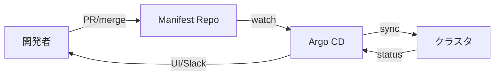

# Argo CD でGitOps
{: .no_toc }

## 目次
{: .no_toc .text-delta }

1. TOC
{:toc}

---

**GitOps** は「Git をシステムの真実の源泉にし、クラスタの状態を Git に収束させる」運用モデル。
代表的な実装は **Argo CD** と **Flux**。本教材では Argo CD を使います。

## なぜ GitOps か

- すべての変更が Git 履歴 = **監査ログ** になる
- レビュー可能 (PR ベースのデプロイ)
- ロールバックは Git revert
- マニフェストが Git にあるという **真実の源泉が一意**
- クラスタが消えても Git から再構築できる



## インストール

```bash
kubectl create namespace argocd
kubectl apply -n argocd -f https://raw.githubusercontent.com/argoproj/argo-cd/stable/manifests/install.yaml
```

UI を NodePort で公開:

```bash
kubectl patch svc argocd-server -n argocd -p '{"spec":{"type":"NodePort"}}'
kubectl get svc -n argocd argocd-server
```

初期パスワード:

```bash
kubectl -n argocd get secret argocd-initial-admin-secret \
  -o jsonpath='{.data.password}' | base64 -d
```

`https://<node-ip>:<nodeport>` で UI に入れます。

CLI も入れておく:

```bash
brew install argocd
argocd login <node-ip>:<nodeport>
```

## Application リソース

Argo CD の中心は `Application` リソース。Git の場所と適用先 Namespace を宣言します。

```yaml
apiVersion: argoproj.io/v1alpha1
kind: Application
metadata:
  name: todo-prod
  namespace: argocd
spec:
  project: default
  source:
    repoURL: https://github.com/<USER>/todo-manifests
    targetRevision: main
    path: overlays/prod
  destination:
    server: https://kubernetes.default.svc
    namespace: prod
  syncPolicy:
    automated:
      prune: true
      selfHeal: true
    syncOptions:
    - CreateNamespace=true
    - ApplyOutOfSyncOnly=true
    retry:
      limit: 5
      backoff:
        duration: 5s
        maxDuration: 3m
        factor: 2
```

`automated.selfHeal: true` で「クラスタ側を直接いじっても Git に戻す」動作になります。GitOps の本懐。

## 複数Applicationの管理: ApplicationSet

「dev / stg / prod 3 環境分のApplicationを自動生成」のような用途に。

```yaml
apiVersion: argoproj.io/v1alpha1
kind: ApplicationSet
metadata:
  name: todo
  namespace: argocd
spec:
  generators:
  - list:
      elements:
      - env: dev
        cluster: https://kubernetes.default.svc
      - env: stg
        cluster: https://kubernetes.default.svc
      - env: prod
        cluster: https://kubernetes.default.svc
  template:
    metadata:
      name: 'todo-{{env}}'
    spec:
      project: default
      source:
        repoURL: https://github.com/<USER>/todo-manifests
        targetRevision: main
        path: 'overlays/{{env}}'
      destination:
        server: '{{cluster}}'
        namespace: '{{env}}'
      syncPolicy:
        automated: {prune: true, selfHeal: true}
        syncOptions: [CreateNamespace=true]
```

## App-of-Apps パターン

Argo CD 自体や周辺ツール(Prometheus、Loki…)の Application も Git 管理し、それらを束ねる「親 Application」を1つ作る運用。
クラスタを1から再現できます。

```
manifests/
├── apps/
│   ├── todo.yaml         # ApplicationSet
│   ├── monitoring.yaml   # Application: kube-prometheus-stack
│   └── ingress.yaml      # Application: ingress-nginx
└── root.yaml             # 親Application: apps/ 全部読む
```

## 推奨設定: SyncPolicy

| オプション | 推奨 | 理由 |
|------------|------|------|
| `automated.prune: true` | dev/stg | Git から消したら消す |
| `automated.selfHeal: true` | dev/stg | ドリフトを自動修復 |
| `prod` の `automated` | 状況による | 監査要件・チーム成熟度次第。手動同意ベースもあり |

## Notification

Slack / Webhook 通知を設定可能。

```bash
helm install argocd-notifications argo/argo-cd-notifications -n argocd
```

## ハンズオン

1. Argo CD インストール
2. `todo-manifests` リポジトリを GitHub に作成
3. 上記 Application YAML を apply
4. UI で sync を確認
5. アプリリポジトリで適当な変更 push → CI → manifest更新 → Argo CD が自動 sync

## チェックポイント

- [ ] GitOps の利点を 3 つ説明できる
- [ ] selfHeal の挙動と、本番で有効化するときの注意点
- [ ] App-of-Apps パターンが解決する課題
