# Argo CD でGitOps
{: .no_toc }

## 目次
{: .no_toc .text-delta }

1. TOC
{:toc}

---

## このページのゴール

このページを読み終えると、以下を **自分の言葉で説明できる** ようになります。

- GitOps の 4 原則 (Declarative / Versioned / Approved / Continuously reconciled) を答えられる
- push 型 CI/CD と pull 型 GitOps の違いを、攻撃面 (attack surface) の観点で説明できる
- Argo CD のアーキテクチャ (server / repo-server / application-controller / redis / dex) を図示できる
- `Application` リソースの主要フィールドと、Helm / Kustomize / plain YAML の使い分けを説明できる
- `syncPolicy.automated.selfHeal: true` の挙動と、本番で有効にすべき条件・避けるべき条件を答えられる
- ApplicationSet の generator の種類と、3 環境を一括管理する例を書ける
- App-of-Apps と ApplicationSet の使い分けの判断軸を3つ挙げられる
- Sync wave / Sync hook で順序制御する例 (DB マイグレーション → API デプロイ等) を実装できる
- OutOfSync / SyncFailed / Degraded のいずれかの状態に陥ったとき、調査フローを示せる

---

## GitOps とは何か

### 4 原則 (OpenGitOps / CNCF)

CNCF の **OpenGitOps Working Group** が 2022 年に公開した GitOps の 4 原則:

1. **Declarative (宣言的)**: システムの「あるべき状態」が宣言的に書ける
2. **Versioned and Immutable (バージョン管理かつ不変)**: 状態は不変な記録 (Git) に保存される
3. **Pulled Automatically (自動 Pull)**: ソフトウェアエージェントが自動で状態を取得する
4. **Continuously Reconciled (継続的整合)**: エージェントが現状と比較し、差分を埋め続ける

参考: <https://opengitops.dev/>

### 「Operations by Pull Request」(2017)

Weaveworks の CEO Alexis Richardson が 2017 年に書いた[このブログ記事](https://www.weave.works/blog/gitops-operations-by-pull-request)が GitOps の名付け親です。コアアイデアは:

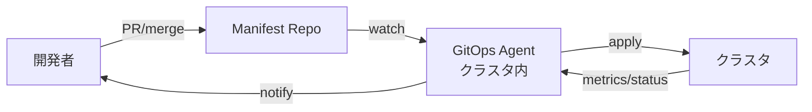
```mermaid
flowchart LR
    dev[開発者] -->|PR/merge| repo[Manifest Repo]
    repo -->|watch| agent[GitOps Agent<br/>クラスタ内]
    agent -->|apply| k8s[クラスタ]
    k8s -->|metrics/status| agent
    agent -->|notify| dev
```

ポイントは:

- **真実の源泉 (Source of Truth) は Git**
- **クラスタは Git に収束する**
- **人間は Git に対してだけ操作する** (kubectl apply は禁止に近い扱い)
- **エージェントはクラスタ内** にいて、外部から push されない

### なぜ pull 型なのか: 攻撃面の縮小

```mermaid
flowchart TB
    subgraph "Push型 (旧)"
    direction LR
    ci1[Jenkins/GHA<br/>kubeconfig所持] -.->|kubectl apply| api1[kube-apiserver]
    attacker1[攻撃者] -->|侵害| ci1
    attacker1 -.->|横展開可能| api1
    end
    subgraph "Pull型 (GitOps)"
    direction LR
    ci2[GHA] -->|commit| git[Git]
    agent[Argo CD<br/>クラスタ内] -->|pull| git
    agent -->|apply| api2[kube-apiserver]
    attacker2[攻撃者] -->|侵害| ci2
    attacker2 -.X|権限なし| api2
    end

    style attacker1 fill:#fbb
    style attacker2 fill:#fbb
```

| 比較項目 | push 型 | pull 型 (GitOps) |
|---------|--------|-----------------|
| クラスタへの外部アクセス | 必要 (CI に kubeconfig) | 不要 |
| シークレット流出時の影響 | CI トークン漏れ → 本番直接操作可 | CI トークンは Git 書き込みのみ。クラスタへは無力 |
| ファイアウォール設定 | クラスタを CI から到達可能に | 不要 (out-bound のみ) |
| 監査ログ | CI ログ依存 | Git log + Argo CD イベント |
| ドリフト検知 | なし | 自動検知 (selfHeal) |
| ロールバック | CI 再実行 | git revert |

これがエンタープライズで GitOps が急速に採用されている最大の理由です。

### CIOps との比較

「CIOps」という用語は、push 型 CI/CD を揶揄するために GitOps コミュニティが使った言葉です。

| | CIOps | GitOps |
|---|-------|--------|
| トリガ | CI で `kubectl apply` | Git の変更を Agent が検出 |
| 状態管理 | CI の各ジョブが部分的に管理 | クラスタ内 Agent が全体管理 |
| 信頼の源 | CI ログ | Git + クラスタ |
| 失敗時の挙動 | CI ジョブ失敗で部分適用状態 | Agent が再 reconcile |
| 並行性 | 複数 CI が衝突する可能性 | Agent が一元化 |

---

## GitOps のメリット (改めて整理)

### 1. すべての変更が Git 履歴 = 監査ログ

```bash
git log --oneline overlays/prod/
# a3f2c1b deploy(prod): todo-api 2024-01-15-a3f2c1b
# 9b8e7d4 chore: bump postgres 16.1 -> 16.2
# 4c5d6e7 fix: increase api replicas 3 -> 5
```

「2024-01-15 13:00 頃に何が変わったか」を Git で完全に追える。SOX 法、PCI DSS、HIPAA など監査要件がある業界には必須です。

### 2. PR ベースのレビュー可能なデプロイ

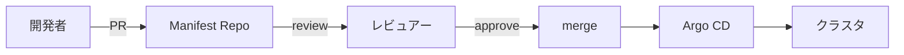
```mermaid
flowchart LR
    dev[開発者] -->|PR| repo[Manifest Repo]
    repo -->|review| reviewer[レビュアー]
    reviewer -->|approve| merge[merge]
    merge --> argo[Argo CD]
    argo --> k8s[クラスタ]
```

「本番に何が入るか」を merge する前にレビューできる。

### 3. ロールバックは git revert

```bash
git revert HEAD
git push
# Argo CD が前バージョンに自動で戻す
```

`kubectl rollout undo` を覚える必要すらありません。

### 4. 真実の源泉が一意

「Git に書いていない設定は存在しない」というルールが作れる。
ドリフト (誰かが `kubectl edit` した) も自動修復されます。

### 5. クラスタ消失時の再現性

「クラスタが死んだら、新しいクラスタを作って Argo CD を入れ、ルート Application を 1 つ apply するだけで全部復元」が可能。

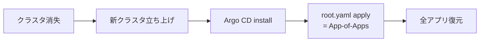
```mermaid
flowchart LR
    disaster[クラスタ消失] --> new[新クラスタ立ち上げ]
    new --> install[Argo CD install]
    install --> root[root.yaml apply<br/>= App-of-Apps]
    root --> recover[全アプリ復元]
```

---

## Argo CD と Flux の比較

GitOps の二大実装。

| 比較項目 | Argo CD | Flux v2 |
|---------|---------|---------|
| 開発元 | Intuit → Argo Project (2018) | Weaveworks → Flux Project (2018) |
| CNCF | Graduated (2022) | Graduated (2022) |
| UI | 強力な Web UI | 公式 UI なし (Weave GitOps が別途) |
| マルチクラスタ | 1 Argo CD で複数管理 | Flux 自体が各クラスタに |
| アプローチ | 中央集権型 | 分散型 |
| ApplicationSet 相当 | ApplicationSet | Bucket / GitRepository + Kustomization の組み合わせ |
| Helm 対応 | ◯ | ◯ (HelmRelease CRD) |
| 主要 CRD | `Application`, `AppProject`, `ApplicationSet` | `GitRepository`, `Kustomization`, `HelmRelease` |
| RBAC | UI/API レベルで強力 | K8s RBAC に依存 |
| Notifications | argocd-notifications | flux-notification-controller |
| プログレッシブデリバリ | Argo Rollouts (兄弟) | Flagger (兄弟) |

本教材では **Argo CD** を採用します。理由:

1. UI が学習に向いている (差分が視覚的に分かる)
2. Argo Rollouts との連携が前提化されている
3. App-of-Apps パターンの実装が直感的

---

## Argo CD のアーキテクチャ

### コンポーネント全体図

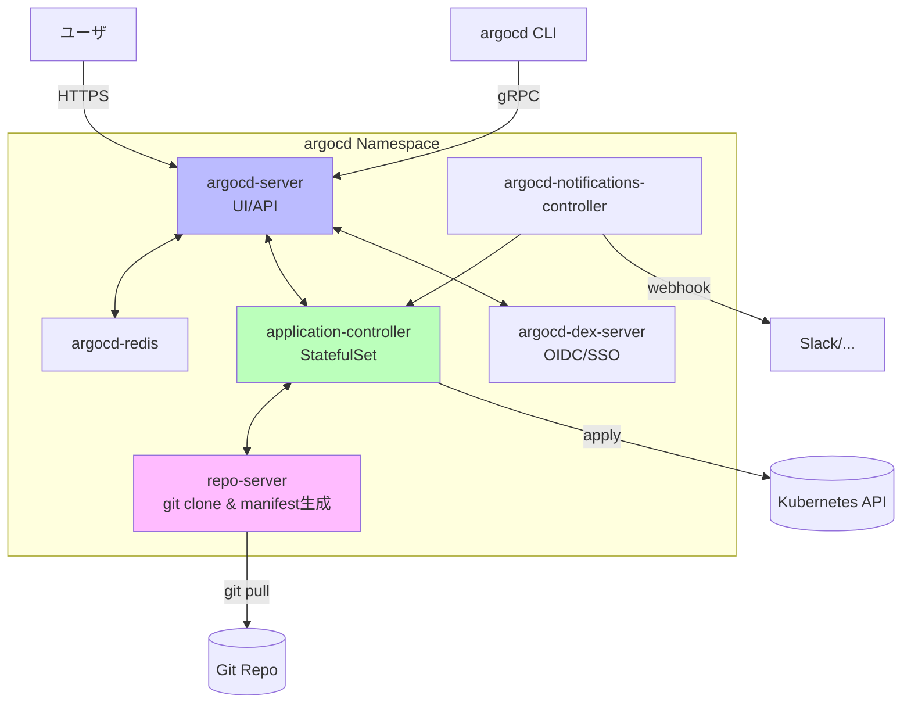
```mermaid
flowchart TB
    subgraph "argocd Namespace"
    server[argocd-server<br/>UI/API]
    ctrl[application-controller<br/>StatefulSet]
    repo[repo-server<br/>git clone & manifest生成]
    dex[argocd-dex-server<br/>OIDC/SSO]
    redis[argocd-redis]
    notif[argocd-notifications-controller]
    end

    user[ユーザ] -->|HTTPS| server
    cli[argocd CLI] -->|gRPC| server
    server <--> redis
    server <--> ctrl
    ctrl <--> repo
    repo -->|git pull| git[(Git Repo)]
    ctrl -->|apply| k8s[(Kubernetes API)]
    server <--> dex
    notif --> ctrl
    notif -->|webhook| slack[Slack/...]

    style server fill:#bbf
    style ctrl fill:#bfb
    style repo fill:#fbf
```

### 各コンポーネントの役割

| コンポーネント | 種類 | 役割 |
|--------------|------|------|
| **argocd-server** | Deployment | UI/API/gRPC のエンドポイント。状態の参照と sync 操作を受ける |
| **application-controller** | StatefulSet | 各 Application の reconcile を担当。クラスタ状態を監視 |
| **repo-server** | Deployment | Git を clone してマニフェストを生成 (Helm/Kustomize/Jsonnet) |
| **redis** | Deployment | UI/API のキャッシュ。controller の状態キャッシュ |
| **dex** | Deployment | OIDC SSO (LDAP, SAML, Google, GitHub OAuth) を統合 |
| **notifications-controller** | Deployment | 状態変化を Slack/Email/Webhook に通知 |
| **applicationset-controller** | Deployment | ApplicationSet から Application を生成 |

### Reconcile のシーケンス

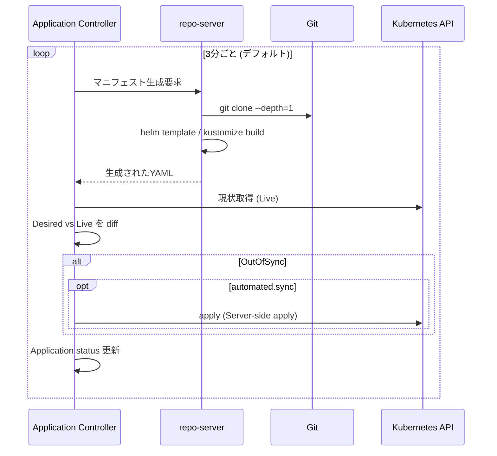
```mermaid
sequenceDiagram
    participant Ctrl as Application Controller
    participant Repo as repo-server
    participant Git
    participant K8s as Kubernetes API

    loop 3分ごと (デフォルト)
        Ctrl->>Repo: マニフェスト生成要求
        Repo->>Git: git clone --depth=1
        Repo->>Repo: helm template / kustomize build
        Repo-->>Ctrl: 生成されたYAML
        Ctrl->>K8s: 現状取得 (Live)
        Ctrl->>Ctrl: Desired vs Live を diff
        alt OutOfSync
            opt automated.sync
                Ctrl->>K8s: apply (Server-side apply)
            end
        end
        Ctrl->>Ctrl: Application status 更新
    end
```

### sync interval の設定

デフォルトでは **3分ごと** に Git を polling します。
即時反映したいなら **GitHub webhook** を設定します。

```bash
# Settings → Webhooks (GitHub側)
# URL: https://argocd.example.com/api/webhook
# Content type: application/json
# Secret: (任意の文字列)
```

```yaml
# argocd-secret に webhook secret を入れる
apiVersion: v1
kind: Secret
metadata:
  name: argocd-secret
  namespace: argocd
stringData:
  webhook.github.secret: <SECRET>
```

これで Git に push した瞬間に Argo CD が反応します。

### High Availability (HA) 構成

本番では HA マニフェストを使います。

```bash
kubectl apply -n argocd \
  -f https://raw.githubusercontent.com/argoproj/argo-cd/v2.11.0/manifests/ha/install.yaml
```

HA 構成での違い:
- `argocd-server`: 3 レプリカ、anti-affinity
- `application-controller`: shard 分散 (`replicas` を増やすと自動シャーディング)
- `repo-server`: 3 レプリカ
- `redis`: redis-ha (sentinel)

---

## インストール

### Step 1: Namespace と manifest 適用

```bash
kubectl create namespace argocd
kubectl apply -n argocd \
  -f https://raw.githubusercontent.com/argoproj/argo-cd/stable/manifests/install.yaml
```

**何が起きるか**:
- `argocd` Namespace に上記コンポーネントの Deployment/StatefulSet/Service が作成される
- CRD (`Application`, `AppProject`, `ApplicationSet`) がインストールされる
- ClusterRole/ClusterRoleBinding が作られ、Argo CD がクラスタ全体を操作可能に

**期待される出力**:

```
customresourcedefinition.apiextensions.k8s.io/applications.argoproj.io created
customresourcedefinition.apiextensions.k8s.io/applicationsets.argoproj.io created
customresourcedefinition.apiextensions.k8s.io/appprojects.argoproj.io created
serviceaccount/argocd-application-controller created
...
deployment.apps/argocd-repo-server created
deployment.apps/argocd-server created
statefulset.apps/argocd-application-controller created
```

### Step 2: Pod の起動確認

```bash
kubectl get pod -n argocd
```

**期待される出力**:

```
NAME                                                READY   STATUS    RESTARTS   AGE
argocd-application-controller-0                     1/1     Running   0          90s
argocd-applicationset-controller-7d4f4b8c4f-xxx     1/1     Running   0          90s
argocd-dex-server-65d5cc8f8d-yyy                    1/1     Running   0          90s
argocd-notifications-controller-7c4b9bb5d-zzz       1/1     Running   0          90s
argocd-redis-7f9d5b8c4f-aaa                         1/1     Running   0          90s
argocd-repo-server-6b6f8c9b9c-bbb                   1/1     Running   0          90s
argocd-server-7fbb5b8c4f-ccc                        1/1     Running   0          90s
```

全部 `Running` で `READY 1/1` なら OK。
そうでなければ:

```bash
kubectl describe pod -n argocd <pod-name>
kubectl logs -n argocd <pod-name>
```

### Step 3: UI の公開

本教材の VMware kubeadm 環境は MetalLB で LoadBalancer が使えるので、まず LoadBalancer 化:

```bash
kubectl patch svc argocd-server -n argocd \
  -p '{"spec": {"type": "LoadBalancer"}}'
```

```bash
kubectl get svc -n argocd argocd-server
```

**期待される出力**:

```
NAME            TYPE           CLUSTER-IP       EXTERNAL-IP        PORT(S)
argocd-server   LoadBalancer   10.96.156.123    192.168.56.200     80:30000/TCP,443:31000/TCP
```

`EXTERNAL-IP` が払い出されます。ブラウザで `https://192.168.56.200/` を開く (自己署名証明書なので警告は無視)。

### Step 4: 初期 admin パスワード取得

```bash
kubectl -n argocd get secret argocd-initial-admin-secret \
  -o jsonpath='{.data.password}' | base64 -d
```

ユーザ名 `admin`、表示されたパスワードでログイン。

### Step 5: パスワード変更 (必須)

```bash
argocd account update-password \
  --account admin \
  --current-password <初期パスワード> \
  --new-password <新パスワード>
```

または UI の User Info → Update Password。

### Step 6: 初期 Secret の削除

ベストプラクティスとして:

```bash
kubectl -n argocd delete secret argocd-initial-admin-secret
```

### Step 7: CLI のインストール

```bash
# macOS
brew install argocd

# Linux
curl -sSL -o argocd \
  https://github.com/argoproj/argo-cd/releases/latest/download/argocd-linux-amd64
chmod +x argocd
sudo mv argocd /usr/local/bin/
```

ログイン:

```bash
argocd login 192.168.56.200 --username admin
# Password: ********
# 'admin:login' logged in successfully
```

### Step 8: kubeconfig コンテキストの登録 (マルチクラスタ用、任意)

別クラスタを管理するときに使います。本教材は単一クラスタなので任意。

```bash
argocd cluster add <kubeconfig-context-name>
```

---

## Argo CD CLI / kubectl での操作

### CLI と kubectl の使い分け

| 操作 | CLI (`argocd`) | kubectl |
|------|---------------|---------|
| Application 作成 | `argocd app create` | `kubectl apply -f app.yaml` |
| Sync 実行 | `argocd app sync foo` | `kubectl patch app foo --type merge -p '{"operation":{"sync":{}}}'` |
| 差分確認 | `argocd app diff foo` | `kubectl get app foo -o yaml` (生のフィールドのみ) |
| Application 一覧 | `argocd app list` | `kubectl get app -A` |
| ログ確認 | `argocd app logs foo` | `kubectl logs ...` を使う |

GitOps の原則からは「`kubectl apply -f app.yaml`」が望ましいです (Application 自体も Git で管理)。
CLI は一時的なデバッグや手動 sync 時に。

### 主要 CLI コマンド

```bash
argocd app list                          # 全 Application 一覧
argocd app get todo-prod                 # 詳細
argocd app diff todo-prod                # Git と現状の差分
argocd app sync todo-prod                # 手動 sync
argocd app sync todo-prod --prune        # Git から消えたものも削除
argocd app sync todo-prod --dry-run      # 適用せずに確認
argocd app history todo-prod             # 過去の sync 履歴
argocd app rollback todo-prod 5          # 過去 ID=5 にロールバック
argocd app delete todo-prod              # Application 削除 (manifest は残る)
argocd app delete todo-prod --cascade    # manifest も削除
```

```bash
argocd repo add https://github.com/USER/todo-manifests \
  --username USER --password $PAT       # Private repo 登録
argocd repo list
argocd repo rm https://github.com/USER/todo-manifests
```

```bash
argocd cluster list
argocd cluster add <context>             # マルチクラスタ管理
```

```bash
argocd proj list
argocd proj create todo                  # AppProject 作成
argocd proj allow-repo todo https://...
```

---

## Application リソースの完全解説

Argo CD の中心となる CRD が `Application` です。1 つの Application = 「Git のあるパスを、あるクラスタのある Namespace に同期する」宣言です。

### 最小構成

```yaml
apiVersion: argoproj.io/v1alpha1
kind: Application
metadata:
  name: todo-prod
  namespace: argocd                          # Application 自体は argocd ns
spec:
  project: default
  source:
    repoURL: https://github.com/USER/todo-manifests
    targetRevision: main
    path: overlays/prod
  destination:
    server: https://kubernetes.default.svc    # 自クラスタの場合
    namespace: prod
  syncPolicy:
    automated:
      prune: true
      selfHeal: true
    syncOptions:
    - CreateNamespace=true
```

これだけで「`todo-manifests/overlays/prod` の中身を `prod` Namespace に同期する」が成立します。

### 全フィールド一覧

```yaml
apiVersion: argoproj.io/v1alpha1
kind: Application
metadata:
  name: todo-prod
  namespace: argocd
  finalizers:
  - resources-finalizer.argocd.argoproj.io   # 削除時に管理リソースもまとめて削除
  annotations:
    argocd.argoproj.io/manifest-generate-paths: "./overlays/prod;./base"
spec:
  project: todo                              # AppProject

  # ---- ソース (Single) ----
  source:
    repoURL: https://github.com/USER/todo-manifests
    targetRevision: HEAD                     # branch / tag / commit SHA
    path: overlays/prod                      # plain YAML / Kustomize
    # --- Helm の場合 ---
    helm:
      releaseName: todo
      valueFiles:
      - values.yaml
      - values-prod.yaml
      values: |                              # インライン values
        replicaCount: 5
      parameters:
      - name: image.tag
        value: 2024-01-15-a3f2c1b
      skipCrds: false
    # --- Kustomize の場合 ---
    kustomize:
      namePrefix: todo-
      images:
      - ghcr.io/USER/todo-api:2024-01-15-a3f2c1b
      commonLabels:
        app.kubernetes.io/part-of: todo
      patches: []                            # 動的 patch
    # --- Directory (plain YAML) の場合 ---
    directory:
      recurse: true                          # サブディレクトリも見る
      include: '*.yaml'
      exclude: 'README.*'
    # --- Plugin の場合 ---
    plugin:
      name: my-plugin
      env:
      - name: FOO
        value: bar

  # ---- ソース (Multi、v2.6+) ----
  sources:                                   # source の代わり
  - repoURL: https://github.com/USER/helm-charts
    chart: todo
    targetRevision: 0.1.2
    helm:
      valueFiles:
      - $values/overlays/prod/values.yaml
  - repoURL: https://github.com/USER/todo-manifests
    targetRevision: main
    ref: values                              # 他 source の参照名

  # ---- デプロイ先 ----
  destination:
    server: https://kubernetes.default.svc   # クラスタ
    # name: in-cluster                       # cluster name で指定も可
    namespace: prod

  # ---- 同期ポリシー ----
  syncPolicy:
    automated:
      prune: true                            # Git から消えたら削除
      selfHeal: true                         # ドリフトを自動修復
      allowEmpty: false                      # 全リソース削除を許すか
    syncOptions:
    - CreateNamespace=true                   # Namespace 自動作成
    - PrunePropagationPolicy=foreground      # 削除順序の制御
    - PruneLast=true                         # 削除を最後に
    - ApplyOutOfSyncOnly=true                # 差分があるものだけ apply
    - ServerSideApply=true                   # SSA を使う
    - RespectIgnoreDifferences=true
    - Validate=false                         # apply --validate=false
    - CreateNamespace=true
    retry:
      limit: 5
      backoff:
        duration: 5s
        maxDuration: 3m
        factor: 2
    managedNamespaceMetadata:                # 自動作成 ns に metadata付与
      labels:
        environment: prod
      annotations:
        owner: sre-team

  # ---- 無視する差分 ----
  ignoreDifferences:
  - group: apps
    kind: Deployment
    jsonPointers:
    - /spec/replicas                         # HPA 管理下なので無視
  - group: ""
    kind: Secret
    name: my-secret
    namespace: prod
    jqPathExpressions:
    - .data.password                         # password だけ無視

  # ---- 失敗を許容 ----
  revisionHistoryLimit: 10                   # ロールバック用に保持
```

### `source` の3パターンの使い分け

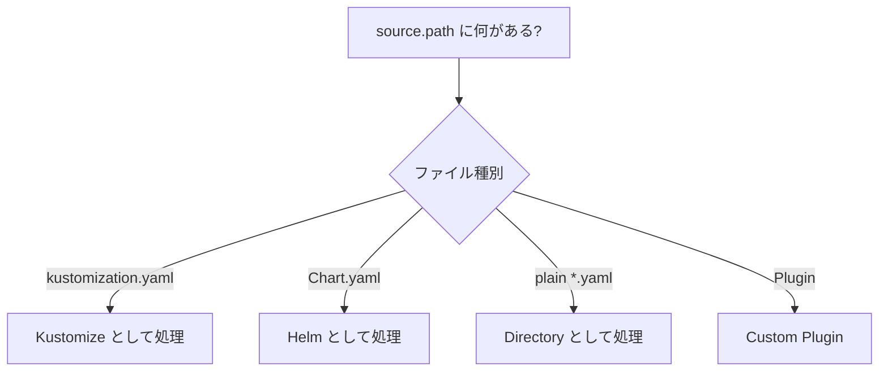
```mermaid
flowchart TB
    src[source.path に何がある?] --> q1{ファイル種別}
    q1 -->|kustomization.yaml| ks[Kustomize として処理]
    q1 -->|Chart.yaml| h[Helm として処理]
    q1 -->|plain *.yaml| d[Directory として処理]
    q1 -->|Plugin| p[Custom Plugin]
```

Argo CD は path の中身を自動判定します。

| 種類 | 判定条件 | 強み |
|------|---------|------|
| **Kustomize** | `kustomization.yaml` 存在 | overlay で環境差分を表現しやすい |
| **Helm** | `Chart.yaml` 存在 | values.yaml で柔軟な設定 |
| **Directory** | plain YAML が並んでる | シンプル、学習向き |
| **Plugin** | カスタムロジック | Jsonnet, CDK8s 等を呼べる |

本教材では **Kustomize** を主に使います (環境差分を表現しやすいため)。

### `destination` の指定方法

| 方式 | 例 | 用途 |
|------|---|------|
| `server` | `https://kubernetes.default.svc` | 自クラスタ |
| `server` | `https://192.168.56.11:6443` | 別クラスタ (URL指定) |
| `name` | `in-cluster` | クラスタ名で指定 (推奨) |

自分が動いているクラスタは特別に `https://kubernetes.default.svc` と書きます。
別クラスタを使うには `argocd cluster add <context>` で登録します。

### Multi-Source Application (v2.6+)

Helm chart と values を別 repo で管理したいときに便利:

```yaml
spec:
  sources:
  - repoURL: https://prometheus-community.github.io/helm-charts
    chart: kube-prometheus-stack
    targetRevision: 60.0.0
    helm:
      valueFiles:
      - $values/monitoring/values.yaml      # 下の values から参照
  - repoURL: https://github.com/USER/manifests
    targetRevision: main
    ref: values                              # 参照名
```

これで「公式 chart + 自分の values」を1つの Application で管理できます。

---

## syncPolicy: 同期戦略の選択

### 4つの動作モード

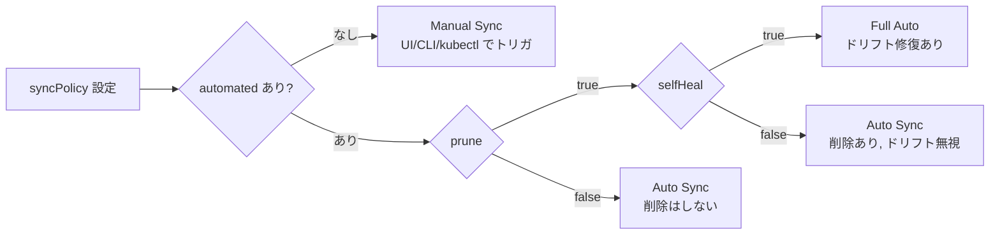
```mermaid
flowchart LR
    sp[syncPolicy 設定] --> q1{automated あり?}
    q1 -->|なし| manual[Manual Sync<br/>UI/CLI/kubectl でトリガ]
    q1 -->|あり| q2{prune}
    q2 -->|true| q3{selfHeal}
    q2 -->|false| auto1[Auto Sync<br/>削除はしない]
    q3 -->|true| full[Full Auto<br/>ドリフト修復あり]
    q3 -->|false| auto2[Auto Sync<br/>削除あり, ドリフト無視]
```

| 設定 | prod での推奨 | dev/stg での推奨 |
|------|--------------|-----------------|
| Manual | △ (監査要件次第で◯) | × (面倒) |
| Auto (no prune) | △ | △ |
| Auto + prune | △ | ◯ |
| Auto + prune + selfHeal | △ (チーム成熟度次第) | ◎ |

### `prune` の挙動

`prune: true` だと「Git から消した = クラスタからも消す」。
これがないと、Git からマニフェストを削除しても、クラスタには残り続けます (orphan resource)。

```mermaid
flowchart LR
    subgraph "prune: false"
    g1[Git: 3 manifests] -->|削除| g2[Git: 2 manifests]
    g2 -.X|残る| k1[Cluster: 3 resources]
    end
    subgraph "prune: true"
    g3[Git: 3 manifests] -->|削除| g4[Git: 2 manifests]
    g4 -->|削除も同期| k2[Cluster: 2 resources]
    end
```

### `selfHeal` の挙動

`selfHeal: true` だと「クラスタ側を `kubectl edit` で直接変更しても、Git の状態に戻す」。
GitOps の原則的にはこれが本来の姿。

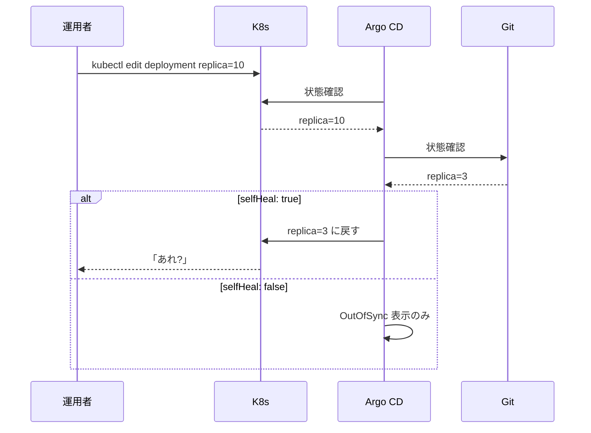
```mermaid
sequenceDiagram
    participant Op as 運用者
    participant K8s
    participant Argo as Argo CD
    participant Git

    Op->>K8s: kubectl edit deployment replica=10
    Argo->>K8s: 状態確認
    K8s-->>Argo: replica=10
    Argo->>Git: 状態確認
    Git-->>Argo: replica=3
    alt selfHeal: true
        Argo->>K8s: replica=3 に戻す
        K8s-->>Op: 「あれ?」
    else selfHeal: false
        Argo->>Argo: OutOfSync 表示のみ
    end
```

{: .warning }
> **selfHeal の罠**: HPA (Horizontal Pod Autoscaler) を使ってる Deployment では replicas が動的に変わります。それを selfHeal が「ドリフト」と判断して元に戻すと無限戦争が起きます。`ignoreDifferences` で `/spec/replicas` を無視するか、`spec.replicas` 自体をマニフェストから消すのが正解。

### `syncOptions` 詳細

| オプション | 意味 |
|----------|------|
| `CreateNamespace=true` | destination の Namespace を自動作成 |
| `PrunePropagationPolicy=foreground` | 削除順序を foreground 削除 (default: foreground) |
| `PruneLast=true` | 削除を最後に (依存リソースを先に消さないため) |
| `ApplyOutOfSyncOnly=true` | OutOfSync なものだけ apply (高速化) |
| `ServerSideApply=true` | Server-side Apply を使う |
| `RespectIgnoreDifferences=true` | `ignoreDifferences` を尊重 |
| `Validate=false` | `kubectl apply --validate=false` 相当 |
| `Replace=true` | `kubectl replace` 相当 (危険) |
| `SkipDryRunOnMissingResource=true` | CRD 未定義時の dry-run スキップ |

### retry の意味

sync が失敗したときの再試行戦略:

```yaml
retry:
  limit: 5
  backoff:
    duration: 5s          # 初回待機
    maxDuration: 3m       # 最大待機
    factor: 2             # 指数バックオフ
```

5s → 10s → 20s → 40s → 80s と倍々で待ち、最大 3m。
ネットワーク一時障害や webhook 失敗で有効。

---

## AppProject による論理的グルーピング

### なぜ AppProject が必要か

`default` AppProject は何でも許す状態で、本番では危険です。

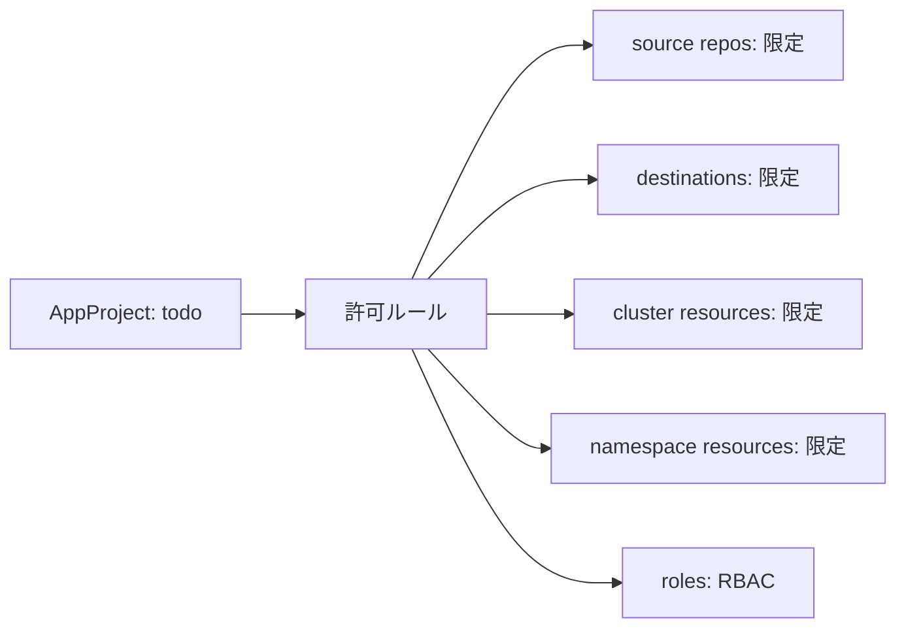
```mermaid
flowchart LR
    p[AppProject: todo] --> rules[許可ルール]
    rules --> r1[source repos: 限定]
    rules --> r2[destinations: 限定]
    rules --> r3[cluster resources: 限定]
    rules --> r4[namespace resources: 限定]
    rules --> r5[roles: RBAC]
```

AppProject で:
- **どの Git repo から取れるか**
- **どのクラスタ・Namespace にデプロイできるか**
- **どの種類のリソースを作れるか** (例: `ClusterRole` 作成禁止)
- **誰が操作できるか** (RBAC)

を制限できます。

### AppProject の定義例

```yaml
apiVersion: argoproj.io/v1alpha1
kind: AppProject
metadata:
  name: todo
  namespace: argocd
spec:
  description: "TODO アプリ用プロジェクト"

  # 許可する Git repos
  sourceRepos:
  - https://github.com/USER/todo-manifests
  - https://github.com/USER/helm-charts

  # 許可するデプロイ先
  destinations:
  - server: https://kubernetes.default.svc
    namespace: 'todo-*'                      # ワイルドカード可
  - server: https://kubernetes.default.svc
    namespace: 'prod'

  # 許可する cluster-scoped リソース
  clusterResourceWhitelist:
  - group: ''
    kind: Namespace
  - group: rbac.authorization.k8s.io
    kind: ClusterRole
  # 禁止リスト方式も可
  clusterResourceBlacklist:
  - group: ''
    kind: PersistentVolume                   # PV 作成は許さない

  # 許可する namespace-scoped リソース
  namespaceResourceWhitelist:
  - group: '*'
    kind: '*'                                # 全許可
  # 一部のみ許可するなら個別指定
  namespaceResourceBlacklist:
  - group: ''
    kind: ResourceQuota
  - group: ''
    kind: LimitRange

  # 「default」AppProject にしないための明示的役割
  roles:
  - name: read-only
    description: 全 Application の読み取り
    policies:
    - p, proj:todo:read-only, applications, get, todo/*, allow
    groups:
    - todo-developers                        # OIDC group
  - name: deployer
    description: prod 以外で sync 可能
    policies:
    - p, proj:todo:deployer, applications, *, todo/*-dev, allow
    - p, proj:todo:deployer, applications, *, todo/*-stg, allow
    groups:
    - todo-deployers

  # PR ベースの sync (オプション)
  signatureKeys:
  - keyID: 4AEE18F83AFDEB23                  # GPG signed commits 必須
```

### RBAC ポリシーの書式

```
p, <role>, <resource>, <action>, <object>, allow|deny
g, <user-or-group>, <role>
```

| フィールド | 例 |
|-----------|---|
| resource | `applications`, `clusters`, `repositories`, `projects`, `accounts`, `gpgkeys`, `logs`, `exec`, `certificates` |
| action | `get`, `create`, `update`, `delete`, `sync`, `override`, `action/*` |
| object | `<project>/<app>` 形式。`*` でワイルドカード |

例:

```
# admin は全権
p, role:admin, applications, *, */*, allow

# todo-developers は todo プロジェクトの dev のみ sync 可
p, role:todo-dev, applications, sync, todo/todo-dev, allow
g, todo-developers, role:todo-dev
```

---

## ApplicationSet による Application の自動生成

3 環境 (dev/stg/prod) で同じアプリを管理するとき、Application を 3 つ書くのは冗長です。**ApplicationSet** が generator から Application を生成します。

### Generator の種類

| Generator | 用途 |
|-----------|------|
| **List** | 静的なリストから生成 |
| **Cluster** | 登録済みクラスタごとに生成 |
| **Git Files** | Git 内の特定ファイルパターンごとに生成 |
| **Git Directories** | Git 内のディレクトリごとに生成 |
| **Matrix** | 複数 generator の積 |
| **Merge** | 複数 generator の結合 |
| **SCM Provider** | GitHub/GitLab/Bitbucket の組織を見て自動生成 |
| **Pull Request** | open な PR ごとに生成 (preview 環境用) |
| **Cluster Decision Resource** | カスタム CRD で決定 |

### List Generator

最も基本。

```yaml
apiVersion: argoproj.io/v1alpha1
kind: ApplicationSet
metadata:
  name: todo
  namespace: argocd
spec:
  generators:
  - list:
      elements:
      - env: dev
        cluster: https://kubernetes.default.svc
        namespace: todo-dev
      - env: stg
        cluster: https://kubernetes.default.svc
        namespace: todo-stg
      - env: prod
        cluster: https://kubernetes.default.svc
        namespace: todo-prod
  template:
    metadata:
      name: 'todo-{{env}}'
    spec:
      project: todo
      source:
        repoURL: https://github.com/USER/todo-manifests
        targetRevision: main
        path: 'overlays/{{env}}'
      destination:
        server: '{{cluster}}'
        namespace: '{{namespace}}'
      syncPolicy:
        automated:
          prune: true
          selfHeal: true
        syncOptions:
        - CreateNamespace=true
```

これで `todo-dev`, `todo-stg`, `todo-prod` という 3 つの Application が自動生成されます。

### Git Directory Generator

`overlays/` の下にディレクトリが増えるたびに自動で Application が生まれる:

```yaml
spec:
  generators:
  - git:
      repoURL: https://github.com/USER/todo-manifests
      revision: main
      directories:
      - path: overlays/*
      # 除外
      - path: overlays/_template
        exclude: true
  template:
    metadata:
      name: 'todo-{{path.basename}}'
    spec:
      source:
        repoURL: https://github.com/USER/todo-manifests
        targetRevision: main
        path: '{{path}}'
      destination:
        server: https://kubernetes.default.svc
        namespace: 'todo-{{path.basename}}'
```

`{{path.basename}}` で `overlays/dev` → `dev` が取れます。

### Git Files Generator

各環境ごとに `config.json` を置いて、その中身でテンプレ展開:

```yaml
generators:
- git:
    repoURL: https://github.com/USER/todo-manifests
    revision: main
    files:
    - path: 'overlays/*/config.json'
```

`overlays/prod/config.json`:

```json
{
  "env": "prod",
  "replicas": 5,
  "namespace": "todo-prod"
}
```

template で `{{env}}`, `{{replicas}}` 等が使える。

### Cluster Generator

複数クラスタを管理してるとき:

```yaml
generators:
- clusters:
    selector:
      matchLabels:
        environment: prod
template:
  metadata:
    name: 'todo-{{name}}'        # クラスタ名
  spec:
    destination:
      server: '{{server}}'
      namespace: todo
```

`argocd cluster add` で登録したクラスタに label を付ければ、その label にマッチするクラスタすべてに Application を作れます。

### Matrix Generator

「3 環境 × 5 クラスタ = 15 Application」みたいなとき:

```yaml
generators:
- matrix:
    generators:
    - list:
        elements:
        - env: dev
        - env: stg
        - env: prod
    - clusters:
        selector:
          matchLabels:
            ready: 'true'
template:
  metadata:
    name: 'todo-{{env}}-{{name}}'
```

### Pull Request Generator (preview 環境)

PR を作るたびに preview 環境を立てる:

```yaml
generators:
- pullRequest:
    github:
      owner: USER
      repo: todo-app
      tokenRef:
        secretName: github-token
        key: token
      labels: ['preview']                     # このラベル付きPRのみ
    requeueAfterSeconds: 60
template:
  metadata:
    name: 'todo-pr-{{number}}'
  spec:
    source:
      repoURL: https://github.com/USER/todo-manifests
      targetRevision: main
      path: overlays/preview
      helm:
        parameters:
        - name: image.tag
          value: 'pr-{{number}}'
        - name: ingress.host
          value: 'todo-pr-{{number}}.dev.example.com'
    destination:
      namespace: 'todo-pr-{{number}}'
```

PR が close されると Application も削除されます (ephemeral)。

---

## App-of-Apps パターン

複数の Application を1つの親 Application で束ねる運用パターン。

### なぜ必要か

クラスタには複数のものが入ります:

- アプリケーション (todo-api, todo-frontend, ...)
- インフラ周辺 (ingress-nginx, cert-manager, ...)
- 監視 (prometheus, loki, grafana)
- セキュリティ (kyverno, falco)

これら全部を「クラスタを1から立て直したら自動で復元」できるようにしたい。
そのために、 **Application を管理する Application** を作ります。

### 構造

```
todo-manifests/
├── apps/                          # Application を定義
│   ├── todo.yaml                  # ApplicationSet for todo-{dev,stg,prod}
│   ├── monitoring.yaml            # Application for kube-prometheus-stack
│   ├── ingress-nginx.yaml         # Application for ingress-nginx
│   ├── cert-manager.yaml          # Application for cert-manager
│   ├── argo-rollouts.yaml         # Application for Argo Rollouts
│   └── kyverno.yaml               # Application for Kyverno
└── root.yaml                      # 親: apps/ を全部読む

overlays/
├── prod/
└── dev/
```

`root.yaml`:

```yaml
apiVersion: argoproj.io/v1alpha1
kind: Application
metadata:
  name: root
  namespace: argocd
spec:
  project: default
  source:
    repoURL: https://github.com/USER/todo-manifests
    targetRevision: main
    path: apps                             # apps/ ディレクトリを読む
    directory:
      recurse: true
  destination:
    server: https://kubernetes.default.svc
    namespace: argocd
  syncPolicy:
    automated:
      prune: true
      selfHeal: true
```

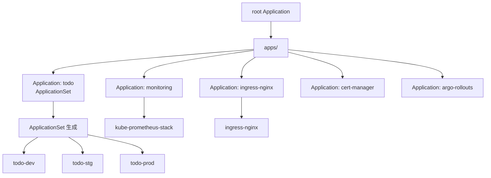
```mermaid
flowchart TB
    root[root Application] --> apps[apps/]
    apps --> a1[Application: todo<br/>ApplicationSet]
    apps --> a2[Application: monitoring]
    apps --> a3[Application: ingress-nginx]
    apps --> a4[Application: cert-manager]
    apps --> a5[Application: argo-rollouts]

    a1 --> i1[ApplicationSet 生成]
    i1 --> i1a[todo-dev]
    i1 --> i1b[todo-stg]
    i1 --> i1c[todo-prod]

    a2 --> i2[kube-prometheus-stack]
    a3 --> i3[ingress-nginx]
```

### クラスタ再構築の手順

新しいクラスタを立てたら:

```bash
# 1. Argo CD インストール
kubectl create namespace argocd
kubectl apply -n argocd -f https://.../install.yaml

# 2. root Application だけ apply
kubectl apply -f root.yaml

# 3. あとは待つだけ
# Argo CD が apps/ を読み、各 Application を作る
# 各 Application が個別のリソースをデプロイする
# 数分後にすべて復元される
```

これが GitOps の真骨頂です。

### App-of-Apps vs ApplicationSet の使い分け

| 軸 | App-of-Apps | ApplicationSet |
|---|------------|---------------|
| 用途 | 違うアプリの束 | 同じアプリの環境別展開 |
| 例 | ingress, monitoring, app | dev/stg/prod |
| 構造 | Application 内に Application YAML | 1つの ApplicationSet |
| 動的性 | 静的 (Git に YAML を書く) | 動的 (generator で展開) |
| 組み合わせ | App-of-Apps の中に ApplicationSet を入れる | ◎ |

両者は **対立するパターンではなく、組み合わせて使う** のが普通です。

---

## Sync waves と hooks

リソースに順序を付けたいときに使います。

### Sync wave

「DB → API → Frontend」の順番で sync したいなら:

```yaml
apiVersion: v1
kind: Secret
metadata:
  name: db-password
  annotations:
    argocd.argoproj.io/sync-wave: "-1"      # 最初
---
apiVersion: apps/v1
kind: StatefulSet
metadata:
  name: postgres
  annotations:
    argocd.argoproj.io/sync-wave: "0"        # 次
---
apiVersion: apps/v1
kind: Deployment
metadata:
  name: todo-api
  annotations:
    argocd.argoproj.io/sync-wave: "1"        # その次
---
apiVersion: apps/v1
kind: Deployment
metadata:
  name: todo-frontend
  annotations:
    argocd.argoproj.io/sync-wave: "2"        # 最後
```

数字が小さい順に apply され、前の wave のリソースが Healthy になるまで次に進まない。

### Sync hooks

特定タイミングで実行する Job を定義できます。

```yaml
apiVersion: batch/v1
kind: Job
metadata:
  name: db-migration
  annotations:
    argocd.argoproj.io/hook: PreSync
    argocd.argoproj.io/hook-delete-policy: BeforeHookCreation
spec:
  template:
    spec:
      containers:
      - name: migrate
        image: ghcr.io/USER/todo-migrator:latest
        command: ["python", "-m", "alembic", "upgrade", "head"]
      restartPolicy: Never
```

| Hook | タイミング |
|------|-----------|
| `PreSync` | sync の前 |
| `Sync` | 通常の sync と同時 |
| `PostSync` | sync 完了後 |
| `SyncFail` | sync 失敗時 |
| `Skip` | このリソースは sync しない |

| Hook delete policy | 動作 |
|------------------|------|
| `HookSucceeded` | hook 成功時に削除 |
| `HookFailed` | hook 失敗時に削除 |
| `BeforeHookCreation` | 新 hook 作成前に古いものを削除 (デフォルト推奨) |

### 典型的な使い方: DB マイグレーション

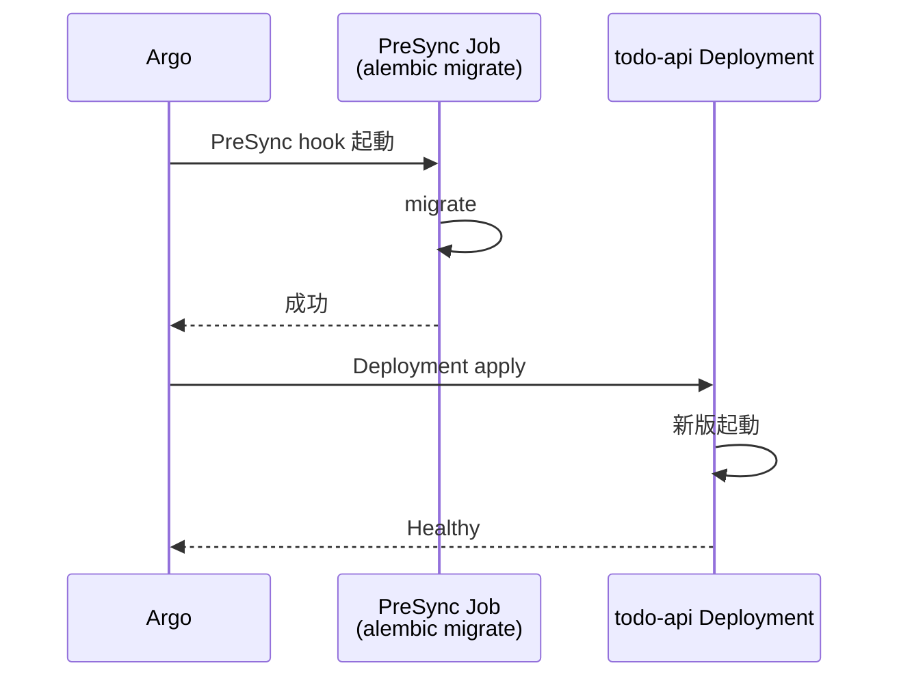
```mermaid
sequenceDiagram
    participant Argo
    participant Job as PreSync Job<br/>(alembic migrate)
    participant API as todo-api Deployment

    Argo->>Job: PreSync hook 起動
    Job->>Job: migrate
    Job-->>Argo: 成功
    Argo->>API: Deployment apply
    API->>API: 新版起動
    API-->>Argo: Healthy
```

これで「マイグレーション完了 → 新版起動」の順序が保たれます。

---

## マルチクラスタ管理

### 1つの Argo CD で複数クラスタ

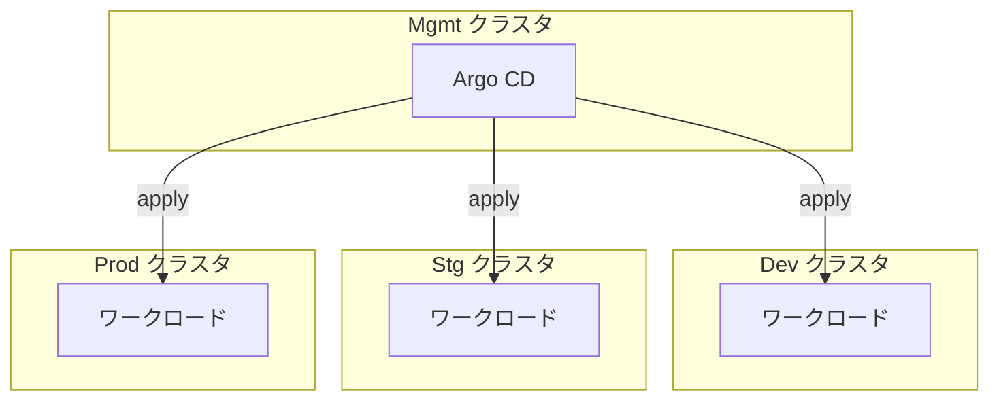
```mermaid
flowchart TB
    subgraph "Mgmt クラスタ"
    argo[Argo CD]
    end
    subgraph "Dev クラスタ"
    d[ワークロード]
    end
    subgraph "Stg クラスタ"
    s[ワークロード]
    end
    subgraph "Prod クラスタ"
    p[ワークロード]
    end
    argo -->|apply| d
    argo -->|apply| s
    argo -->|apply| p
```

```bash
# kubeconfig のコンテキスト追加
argocd cluster add prod-context
argocd cluster add stg-context
argocd cluster list
```

### Application で destination 指定

```yaml
destination:
  server: https://192.168.56.111:6443       # 別クラスタの kube-apiserver
  namespace: todo
```

### クラスタ間のシークレット問題

Argo CD は各クラスタの kubeconfig を Secret として保管します:

```bash
kubectl get secret -n argocd -l argocd.argoproj.io/secret-type=cluster
```

このシークレットが漏れると複数クラスタが侵害されるので、Sealed Secrets や External Secrets Operator との組み合わせ推奨。

---

## Helm chart リポジトリの利用

OCI レジストリの Helm chart も使えます。

```yaml
spec:
  source:
    repoURL: registry.example.com/charts
    chart: postgres
    targetRevision: 16.1.2
    helm:
      values: |
        primary:
          persistence:
            size: 50Gi
```

または HTTP リポジトリ:

```yaml
spec:
  source:
    repoURL: https://prometheus-community.github.io/helm-charts
    chart: kube-prometheus-stack
    targetRevision: 60.0.0
```

---

## Secrets を Git に置く問題

ここまでで素朴な疑問が湧くはずです: **「Secret も Git で管理するの? 平文で?」**

答えは「Git に置くが、暗号化する」。代表的な解は3つです。

### 方式1: Sealed Secrets (Bitnami)

公開鍵で暗号化された Secret を Git に置けます。クラスタ内のコントローラだけが秘密鍵で復号できる。

```bash
# kubeseal CLI のインストール
brew install kubeseal

# 通常の Secret を作って
kubectl create secret generic db-password \
  --from-literal=password=hunter2 \
  --dry-run=client -o yaml > secret.yaml

# Sealed Secret に変換
kubeseal -f secret.yaml -o yaml > sealed-secret.yaml

# Git に commit
git add sealed-secret.yaml
git commit -m "add db password"
```

`sealed-secret.yaml`:

```yaml
apiVersion: bitnami.com/v1alpha1
kind: SealedSecret
metadata:
  name: db-password
  namespace: prod
spec:
  encryptedData:
    password: AgBy3i4OJSWK+PiTySYZZA9rO43...    # 暗号化済み
  template:
    metadata:
      name: db-password
      namespace: prod
    type: Opaque
```

クラスタ内の **sealed-secrets-controller** がこれを Secret に展開します。

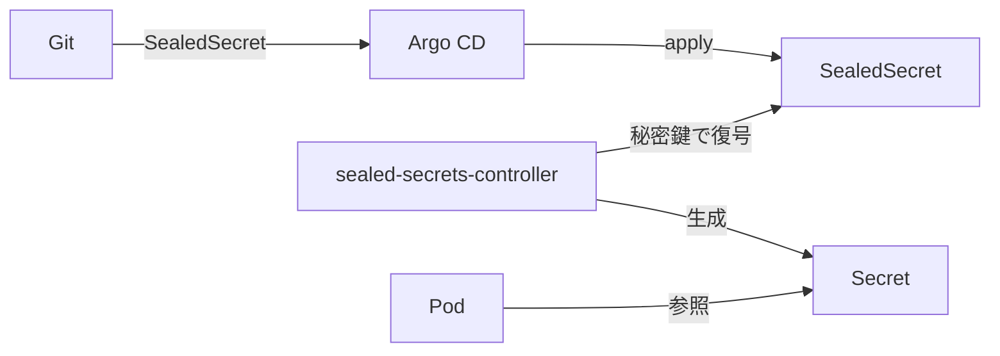
```mermaid
flowchart LR
    g[Git] -->|SealedSecret| argo[Argo CD]
    argo -->|apply| ss[SealedSecret]
    ctrl[sealed-secrets-controller] -->|秘密鍵で復号| ss
    ctrl -->|生成| s[Secret]
    pod[Pod] -->|参照| s
```

| メリット | デメリット |
|---------|----------|
| Git に置ける | 鍵管理が必要 (controller の秘密鍵を失うと全Secret 失う) |
| シンプル | 1 つの Namespace に scope された暗号化 (移動不可) |

### 方式2: External Secrets Operator (ESO)

外部のシークレットマネージャ (AWS Secrets Manager, HashiCorp Vault, GCP Secret Manager) から取得。

```yaml
apiVersion: external-secrets.io/v1beta1
kind: ExternalSecret
metadata:
  name: db-password
spec:
  refreshInterval: 1h
  secretStoreRef:
    name: vault-backend
    kind: SecretStore
  target:
    name: db-password
  data:
  - secretKey: password
    remoteRef:
      key: secret/data/todo/db
      property: password
```

クラスタ内の ESO controller が Vault 等から取得して Secret を作る。

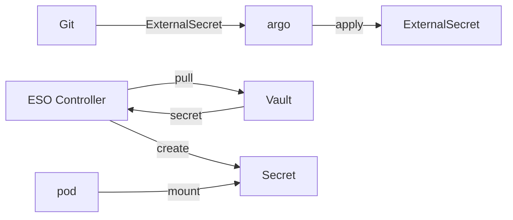
```mermaid
flowchart LR
    g[Git] -->|ExternalSecret| argo
    argo -->|apply| es[ExternalSecret]
    eso[ESO Controller] -->|pull| vault[Vault]
    vault -->|secret| eso
    eso -->|create| s[Secret]
    pod -->|mount| s
```

| メリット | デメリット |
|---------|----------|
| 外部のセキュア管理基盤と統合 | 外部依存 (Vault 等の運用) |
| ローテーション容易 | ややセットアップ重い |

### 方式3: SOPS (Mozilla)

YAML/JSON ファイルの特定フィールドだけを暗号化:

```bash
# sops でファイルを暗号化
sops -e --age <public-key> secret.yaml > secret.enc.yaml
```

```yaml
# secret.enc.yaml
apiVersion: v1
kind: Secret
metadata:
  name: db-password
data:
  password: ENC[AES256_GCM,data:abc...,iv:...,tag:...,type:str]
sops:
  age:
  - recipient: age1xy...
```

Argo CD には標準で sops のサポートはありませんが、 **Helm Plugin** や **Kustomize KSOPS** で組み込めます。

### 比較

| 方式 | 鍵管理 | 学習コスト | 推奨用途 |
|------|--------|-----------|---------|
| Sealed Secrets | クラスタ内 | 低 | 学習・小規模 |
| ESO + Vault | 外部 | 中 | 中〜大規模 |
| SOPS | age/PGP/KMS | 中 | 既存 sops 利用者 |

本教材では学習目的で **Sealed Secrets** を使います。

---

## Argo CD Image Updater (発展)

CI で「manifest repo の image tag を書き換える」のは、CI 側のロジックでした。
**Argo CD Image Updater** はこれを Argo CD 側でやります。

```yaml
apiVersion: argoproj.io/v1alpha1
kind: Application
metadata:
  name: todo-prod
  annotations:
    argocd-image-updater.argoproj.io/image-list: api=ghcr.io/USER/todo-api
    argocd-image-updater.argoproj.io/api.update-strategy: digest
    argocd-image-updater.argoproj.io/write-back-method: git
    argocd-image-updater.argoproj.io/git-branch: main
```

「新しい digest が GHCR に出たら、Git の値を書き換えてコミットする」を Argo CD 側で実行。
CI から manifest repo に書き込まないでよくなります。

| | CI で書き換え (本教材標準) | Image Updater |
|---|--------------------------|--------------|
| 制御 | アプリ側で完結 | クラスタ側に持つ |
| 仕組み | yq + git push | レジストリ polling |
| シンプルさ | 直感的 | やや複雑 |
| GitOps 純度 | やや低 (CI が manifest を触る) | 高 (アプリ CI は image push まで) |

両方とも一長一短ですが、本教材では学習目的で「CI で書き換え」を採用しています。
実務では Image Updater も検討してください。

---

## Notifications (Slack 通知)

Argo CD には標準で **argocd-notifications** が含まれています (v2.3 以降は built-in)。

### Slack 通知のセットアップ

```yaml
# argocd-notifications-cm ConfigMap
apiVersion: v1
kind: ConfigMap
metadata:
  name: argocd-notifications-cm
  namespace: argocd
data:
  service.slack: |
    token: $slack-token
  template.app-deployed: |
    message: |
      :white_check_mark: Application *{{.app.metadata.name}}* deployed.
      Revision: {{.app.status.sync.revision}}
      Sync status: {{.app.status.sync.status}}
  template.app-sync-failed: |
    message: |
      :x: Application *{{.app.metadata.name}}* sync failed.
      Error: {{(call .repo.GetCommitMetadata .app.status.sync.revision).Message}}
  trigger.on-deployed: |
    - when: app.status.operationState.phase in ['Succeeded'] and app.status.health.status == 'Healthy'
      send: [app-deployed]
  trigger.on-sync-failed: |
    - when: app.status.operationState.phase in ['Error', 'Failed']
      send: [app-sync-failed]
  subscriptions: |
    - recipients:
      - slack:devops
      triggers:
      - on-deployed
      - on-sync-failed
```

```yaml
# argocd-notifications-secret
apiVersion: v1
kind: Secret
metadata:
  name: argocd-notifications-secret
  namespace: argocd
stringData:
  slack-token: xoxb-...
```

Application 個別に subscribe:

```yaml
metadata:
  annotations:
    notifications.argoproj.io/subscribe.on-deployed.slack: devops-todo
```

### 主要なトリガ

| トリガ | 発火条件 |
|--------|---------|
| `on-created` | Application 作成 |
| `on-deleted` | 削除 |
| `on-deployed` | sync 成功 + Healthy |
| `on-health-degraded` | Degraded 化 |
| `on-sync-running` | sync 中 |
| `on-sync-succeeded` | sync 成功 |
| `on-sync-failed` | sync 失敗 |
| `on-sync-status-unknown` | 状態不明 |

Slack 以外にも Email、Webhook、Telegram、Teams、GitHub Status などをサポート。

---

## トラブルシュート

### 状態の意味

Application には2つの軸の状態があります。

| 軸 | 状態 |
|---|------|
| Sync Status | `Synced` / `OutOfSync` / `Unknown` |
| Health Status | `Healthy` / `Progressing` / `Degraded` / `Suspended` / `Missing` / `Unknown` |

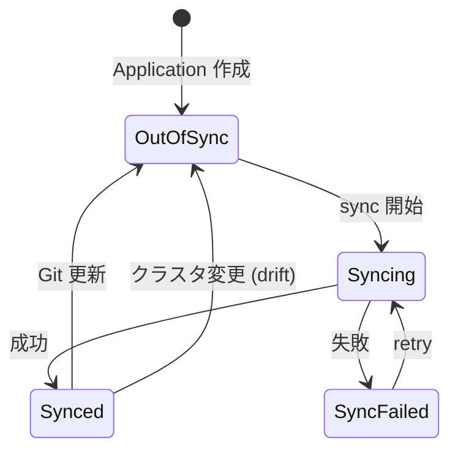
```mermaid
stateDiagram-v2
    [*] --> OutOfSync: Application 作成
    OutOfSync --> Syncing: sync 開始
    Syncing --> Synced: 成功
    Syncing --> SyncFailed: 失敗
    Synced --> OutOfSync: Git 更新
    Synced --> OutOfSync: クラスタ変更 (drift)
    SyncFailed --> Syncing: retry
```

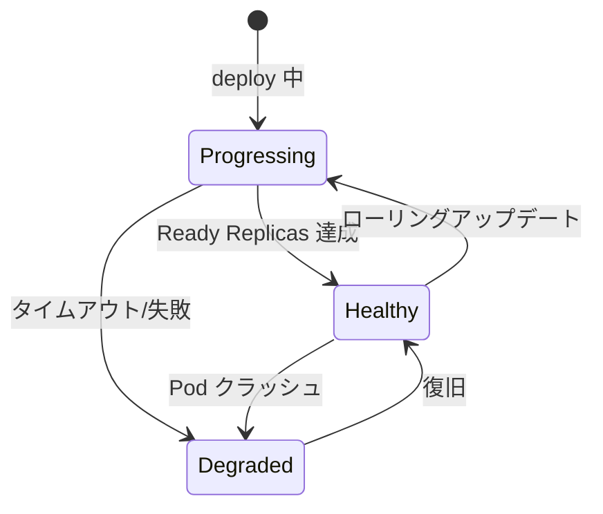
```mermaid
stateDiagram-v2
    [*] --> Progressing: deploy 中
    Progressing --> Healthy: Ready Replicas 達成
    Progressing --> Degraded: タイムアウト/失敗
    Healthy --> Progressing: ローリングアップデート
    Healthy --> Degraded: Pod クラッシュ
    Degraded --> Healthy: 復旧
```

### 症状別フローチャート

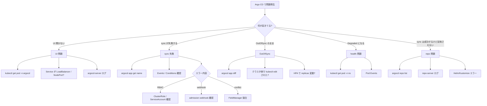
```mermaid
flowchart TD
    start[Argo CD で問題発生] --> q1{何が起きてる?}

    q1 -->|UI 開かない| UI[UI 問題]
    q1 -->|sync が失敗する| Sync[sync 失敗]
    q1 -->|OutOfSync のまま| Drift[OutOfSync]
    q1 -->|Degraded になる| Health[health 問題]
    q1 -->|sync は成功するけど反映されない| Repo[repo 問題]

    UI --> UI1[kubectl get pod -n argocd]
    UI --> UI2[Service が LoadBalancer / NodePort?]
    UI --> UI3[argocd-server ログ]

    Sync --> S1[argocd app get name]
    Sync --> S2[Events / Conditions 確認]
    Sync --> S3{エラー内容}
    S3 -->|RBAC| S3a[ClusterRole / ServiceAccount 確認]
    S3 -->|webhook| S3b[admission webhook 確認]
    S3 -->|conflict| S3c[FieldManager 競合]

    Drift --> D1[argocd app diff]
    Drift --> D2[クラスタ側で kubectl edit された?]
    Drift --> D3[HPA で replicas 変動?]

    Health --> H1[kubectl get pod -n ns]
    Health --> H2[Pod Events]

    Repo --> R1[argocd repo list]
    Repo --> R2[repo-server ログ]
    Repo --> R3[Helm/Kustomize エラー]
```

### よくあるエラーと対処

| エラー | 原因 | 対処 |
|--------|------|------|
| `Failed to load target state: rpc error: code = Unknown desc = repository not accessible` | リポジトリ認証失敗 | `argocd repo add` で再登録 |
| `ComparisonError: Manifest generation error (cached): ...` | Helm/Kustomize 失敗 | `argocd app refresh --hard <name>` でキャッシュ破棄 |
| `OutOfSync` から動かない | automated.sync オフ | `argocd app sync <name>` 手動 |
| `OutOfSync` で `kubectl edit` 痕跡 | ドリフト | `selfHeal: true` を有効化 or `argocd app sync --replace` |
| `SyncFailed: Conflict ... operation not permitted` | RBAC 不足 | ClusterRole の確認 |
| `Resource not permitted in project` | AppProject 制限 | `clusterResourceWhitelist` 等を緩める |
| `Application referencing project default which does not exist` | プロジェクト未作成 | `kubectl apply` で AppProject 先に |
| `ssh: handshake failed: ssh: unable to authenticate` | SSH 鍵未登録 | `argocd repo add --ssh-private-key-path` |
| `tls: failed to verify certificate` | 自己署名 CA | `argocd cert add-tls` |
| `webhook .* connect: connection refused` | admission webhook 死亡 | 該当 webhook 削除 |
| `the server could not find the requested resource` | CRD 未インストール | CRD を先にデプロイ (sync wave 利用) |
| Argo CD UI が真っ白 | argocd-server crash | `kubectl logs -n argocd deploy/argocd-server` |
| Sync が完了するのに永遠に Progressing | health check 失敗 | リソースの `status.conditions` 確認 |
| Helm chart で `Error: render error in "...": ...` | values 誤り | `helm template` でローカル確認 |
| `another operation is already in progress` | 既存 sync 中 | `argocd app terminate-op <name>` |
| `repository not accessible: authentication required` | GitHub PAT 切れ | Settings → Repositories で更新 |

### `argocd app get` の出力の読み方

```bash
argocd app get todo-prod
```

```
Name:               argocd/todo-prod
Project:            todo
Server:             https://kubernetes.default.svc
Namespace:          prod
URL:                https://argocd.example.com/applications/todo-prod
Source:
- Repo:             https://github.com/USER/todo-manifests
  Target:           main
  Path:             overlays/prod
SyncWindow:         Sync Allowed
Sync Policy:        Automated (Prune, Self Heal)
Sync Status:        Synced to main (a3f2c1b)
Health Status:      Healthy

GROUP  KIND        NAMESPACE  NAME           STATUS  HEALTH       MESSAGE
       Service     prod       todo-api       Synced  Healthy
apps   Deployment  prod       todo-api       Synced  Healthy      Deployment is available...
       Service     prod       todo-frontend  Synced  Healthy
```

これで「全リソースが Synced + Healthy」なら正常。
個別のリソースが Degraded なら、その行を見て kubectl で深掘りします。

### `argocd app diff` の使い方

```bash
argocd app diff todo-prod
```

Git の状態とクラスタの状態の差分を表示。selfHeal が無効で OutOfSync な時に何が違うか確認。

```bash
# 特定 revision との比較
argocd app diff todo-prod --revision HEAD
# 指定 manifest との比較
argocd app diff todo-prod --local manifests/
```

### `argocd app sync` の挙動

```bash
argocd app sync todo-prod                     # 通常 sync
argocd app sync todo-prod --dry-run           # dry-run
argocd app sync todo-prod --prune             # 削除も
argocd app sync todo-prod --force             # validation 無視
argocd app sync todo-prod --replace           # apply ではなく replace
argocd app sync todo-prod --resource :Pod:foo  # 特定リソースだけ
argocd app sync todo-prod --revision a3f2c1b  # 特定 commit
```

### Controller のログを見る

```bash
kubectl logs -n argocd statefulset/argocd-application-controller \
  --tail=200 | grep -i error
```

### repo-server のログを見る

```bash
kubectl logs -n argocd deployment/argocd-repo-server --tail=200
```

`helm template` や `kustomize build` の失敗はここに出ます。

### デバッグ用 Pod を起動

```bash
kubectl run -n argocd debug --rm -it --image=alpine -- sh
# レジストリ到達性、git アクセス等を確認
```

---

## 監査・運用のベストプラクティス

### 1. AppProject を必ず作る

`default` プロジェクトに何でも入れない。アプリ単位、チーム単位で分割。

### 2. signature verification を有効化

```yaml
spec:
  signatureKeys:
  - keyID: 4AEE18F83AFDEB23                  # GPG signed commits 必須
```

GPG で署名されたコミットだけを受け入れる。

### 3. Sync Windows

「平日昼間だけ自動 sync」のような制限:

```yaml
spec:
  syncWindows:
  - kind: allow
    schedule: '0 8 * * 1-5'                  # 平日 8:00 に開始
    duration: 8h                             # 8時間
    applications:
    - 'todo-prod'
    manualSync: true
  - kind: deny
    schedule: '0 0 * * *'
    duration: 24h
    namespaces:
    - 'prod'                                 # prod は常にデフォルト deny
```

金曜の夕方デプロイを禁止するのに使えます。

### 4. ResourceHealth カスタマイズ

Argo CD は CRD の health を自動判定できません。Lua で書きます:

```yaml
# argocd-cm ConfigMap
data:
  resource.customizations.health.argoproj.io_Rollout: |
    hs = {}
    if obj.status ~= nil then
      if obj.status.phase == "Healthy" then
        hs.status = "Healthy"
        hs.message = obj.status.message
        return hs
      end
      if obj.status.phase == "Degraded" then
        hs.status = "Degraded"
        return hs
      end
    end
    hs.status = "Progressing"
    return hs
```

### 5. PR でレビュー

manifest repo の main ブランチへの直 push を禁止し、PR を必須に。

### 6. アクセスログを保管

```bash
# argocd-server のログを ELK や Loki に集約
kubectl logs -n argocd deploy/argocd-server | grep audit
```

### 7. 起動時の RBAC を Read-only に

新人が初日に prod を消さないように、デフォルトは Read-only。

```yaml
# argocd-rbac-cm
data:
  policy.default: role:readonly             # デフォルトは閲覧のみ
  policy.csv: |
    p, role:org-admin, *, *, */*, allow
    g, my-org:platform-team, role:org-admin
```

---

## ハンズオン

### Step 1: Argo CD インストール

```bash
kubectl create namespace argocd
kubectl apply -n argocd \
  -f https://raw.githubusercontent.com/argoproj/argo-cd/stable/manifests/install.yaml
kubectl patch svc argocd-server -n argocd \
  -p '{"spec": {"type": "LoadBalancer"}}'
```

5分待って Pod が全部 Running になることを確認。

### Step 2: manifest repo の準備

`todo-manifests/base/api-deployment.yaml`:

```yaml
apiVersion: apps/v1
kind: Deployment
metadata:
  name: todo-api
  labels:
    app.kubernetes.io/name: todo-api
    app.kubernetes.io/part-of: todo
    app.kubernetes.io/managed-by: argocd
spec:
  replicas: 2
  selector:
    matchLabels:
      app.kubernetes.io/name: todo-api
  template:
    metadata:
      labels:
        app.kubernetes.io/name: todo-api
    spec:
      containers:
      - name: api
        image: ghcr.io/USER/todo-api:0.1.0
        ports:
        - containerPort: 8000
        readinessProbe:
          httpGet: {path: /healthz, port: 8000}
        livenessProbe:
          httpGet: {path: /healthz, port: 8000}
        resources:
          requests: {cpu: 100m, memory: 128Mi}
          limits: {cpu: 500m, memory: 512Mi}
```

`todo-manifests/base/api-service.yaml`:

```yaml
apiVersion: v1
kind: Service
metadata:
  name: todo-api
spec:
  selector:
    app.kubernetes.io/name: todo-api
  ports:
  - port: 80
    targetPort: 8000
```

`todo-manifests/base/kustomization.yaml`:

```yaml
apiVersion: kustomize.config.k8s.io/v1beta1
kind: Kustomization
resources:
- api-deployment.yaml
- api-service.yaml
```

`todo-manifests/overlays/prod/kustomization.yaml`:

```yaml
apiVersion: kustomize.config.k8s.io/v1beta1
kind: Kustomization
namespace: prod
resources:
- ../../base
patchesStrategicMerge:
- replica-patch.yaml
images:
- name: ghcr.io/USER/todo-api
  newTag: 0.1.0
```

`todo-manifests/overlays/prod/replica-patch.yaml`:

```yaml
apiVersion: apps/v1
kind: Deployment
metadata:
  name: todo-api
spec:
  replicas: 5
```

### Step 3: AppProject 作成

```yaml
# todo-project.yaml
apiVersion: argoproj.io/v1alpha1
kind: AppProject
metadata:
  name: todo
  namespace: argocd
spec:
  description: TODO アプリ
  sourceRepos:
  - https://github.com/USER/todo-manifests
  destinations:
  - server: https://kubernetes.default.svc
    namespace: 'todo-*'
  - server: https://kubernetes.default.svc
    namespace: 'prod'
  clusterResourceWhitelist:
  - group: ''
    kind: Namespace
  namespaceResourceWhitelist:
  - group: '*'
    kind: '*'
```

```bash
kubectl apply -f todo-project.yaml
```

### Step 4: Application 作成

```yaml
# todo-prod-app.yaml
apiVersion: argoproj.io/v1alpha1
kind: Application
metadata:
  name: todo-prod
  namespace: argocd
  finalizers:
  - resources-finalizer.argocd.argoproj.io
spec:
  project: todo
  source:
    repoURL: https://github.com/USER/todo-manifests
    targetRevision: main
    path: overlays/prod
  destination:
    server: https://kubernetes.default.svc
    namespace: prod
  syncPolicy:
    automated:
      prune: true
      selfHeal: true
    syncOptions:
    - CreateNamespace=true
    retry:
      limit: 5
      backoff:
        duration: 5s
        maxDuration: 3m
        factor: 2
```

```bash
kubectl apply -f todo-prod-app.yaml
```

### Step 5: UI で確認

`https://192.168.56.200/` を開いて `todo-prod` Application が現れることを確認。
初回 sync が始まり、緑になることを確認。

**期待される出力 (UI)**:
- Sync Status: `Synced`
- Health Status: `Healthy`
- リソースツリー: Deployment / ReplicaSet / Pod ×5 / Service

### Step 6: CI 経由でデプロイ

todo-app リポジトリで API を変更して push。
CI が走り、manifest repo の `overlays/prod/kustomization.yaml` の `newTag` が書き換わる。

数分以内 (もしくは webhook 即時) で Argo CD が検知:
- Sync Status: `OutOfSync` (一瞬)
- 自動 sync 開始
- 完了で `Synced` + `Healthy`

### Step 7: selfHeal を確認

クラスタを直接いじってみます:

```bash
kubectl scale deployment todo-api -n prod --replicas=10
kubectl get pod -n prod -l app.kubernetes.io/name=todo-api
# 10個に増える
```

しばらく待つと:

```bash
kubectl get pod -n prod -l app.kubernetes.io/name=todo-api
# 5個に戻る (Argo CD が selfHeal)
```

UI でも Events に「Auto-sync」が記録されています。

### Step 8: ロールバック

```bash
# manifest repo で revert
cd todo-manifests
git log --oneline overlays/prod/
git revert HEAD
git push
# Argo CD が前バージョンに戻す
```

### Step 9: ApplicationSet で3環境化

`todo-appset.yaml`:

```yaml
apiVersion: argoproj.io/v1alpha1
kind: ApplicationSet
metadata:
  name: todo
  namespace: argocd
spec:
  generators:
  - list:
      elements:
      - env: dev
        namespace: todo-dev
      - env: stg
        namespace: todo-stg
      - env: prod
        namespace: todo-prod
  template:
    metadata:
      name: 'todo-{{env}}'
      finalizers:
      - resources-finalizer.argocd.argoproj.io
    spec:
      project: todo
      source:
        repoURL: https://github.com/USER/todo-manifests
        targetRevision: main
        path: 'overlays/{{env}}'
      destination:
        server: https://kubernetes.default.svc
        namespace: '{{namespace}}'
      syncPolicy:
        automated:
          prune: true
          selfHeal: true
        syncOptions:
        - CreateNamespace=true
```

```bash
# 既存 Application を削除してから
kubectl delete -f todo-prod-app.yaml
kubectl apply -f todo-appset.yaml
```

`todo-dev`, `todo-stg`, `todo-prod` の3 Application が自動生成されます。
`overlays/dev/`, `overlays/stg/`, `overlays/prod/` ディレクトリも作っておきます。

### Step 10: App-of-Apps 化

`apps/` ディレクトリを作り、その中に `todo-appset.yaml` を移動。
`root.yaml`:

```yaml
apiVersion: argoproj.io/v1alpha1
kind: Application
metadata:
  name: root
  namespace: argocd
spec:
  project: default
  source:
    repoURL: https://github.com/USER/todo-manifests
    targetRevision: main
    path: apps
    directory:
      recurse: true
  destination:
    server: https://kubernetes.default.svc
    namespace: argocd
  syncPolicy:
    automated:
      prune: true
      selfHeal: true
```

```bash
kubectl apply -f root.yaml
```

これで「root だけ apply すれば、apps/ 配下が全部展開される」が実現します。

---

## 演習問題

1. `todo-prod` Application を一度削除し、root.yaml だけ apply して 5分以内に復元できるか確認
2. todo-frontend と todo-worker の Application を追加してみる
3. Sync waves を使って、Postgres → API → Frontend の順序で起動するように設定
4. Slack 通知を設定し、deploy 失敗が通知されるか試す
5. 意図的に Helm/Kustomize の YAML を壊し、ComparisonError がどう表示されるか観察
6. AppProject の `clusterResourceWhitelist` を厳しくし、Namespace 作成が許可されない場合の挙動を確認

---

## まとめ

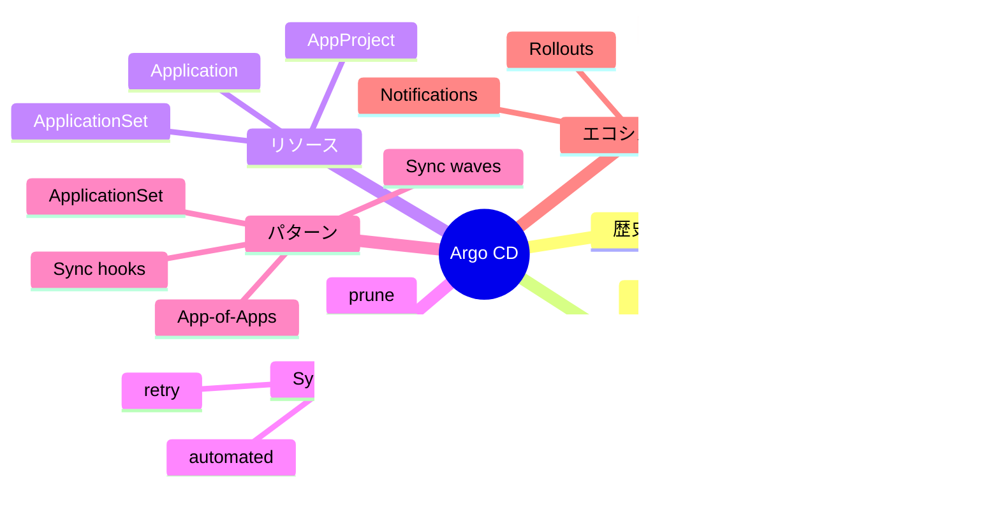
```mermaid
mindmap
  root((Argo CD))
    歴史
      Operations by PR 2017
      Argo CD OSS 2018
      CNCF Graduated 2022
    アーキテクチャ
      server
      controller
      repo-server
      redis
      dex
    リソース
      Application
      AppProject
      ApplicationSet
    SyncPolicy
      automated
      prune
      selfHeal
      retry
    パターン
      App-of-Apps
      ApplicationSet
      Sync waves
      Sync hooks
    エコシステム
      Image Updater
      Notifications
      Rollouts
      Sealed Secrets
      ESO
```

---

## チェックポイント

ここまでで以下を **自分の言葉で** 説明できるか確認してください。

- [ ] GitOps の 4 原則を答えられる
- [ ] push 型と pull 型の違いをセキュリティの観点で説明できる
- [ ] Argo CD のコンポーネント (server / controller / repo-server / redis / dex) の役割を図示できる
- [ ] Application の主要フィールド (source, destination, syncPolicy) を説明できる
- [ ] Helm / Kustomize / plain YAML の使い分け
- [ ] `automated.prune` と `automated.selfHeal` の挙動と、本番で有効化する条件
- [ ] HPA と selfHeal が衝突する理由と、その回避策
- [ ] AppProject による権限分離の必要性
- [ ] ApplicationSet の generator を3種類以上挙げ、それぞれの用途を説明
- [ ] App-of-Apps と ApplicationSet の使い分け
- [ ] Sync waves と hooks の挙動、DB マイグレーション → API 起動の順序実装
- [ ] OutOfSync / SyncFailed / Degraded のいずれかになった時の調査手順
- [ ] Secret を Git に置く3つの方式 (Sealed Secrets / ESO / SOPS) の特徴
- [ ] 自分のリポジトリで Argo CD が動き、CI → manifest 更新 → 自動デプロイの流れを実現できた

→ 次は [Progressive Delivery]({{ '/08-cicd-gitops/progressive-delivery/' | relative_url }})


