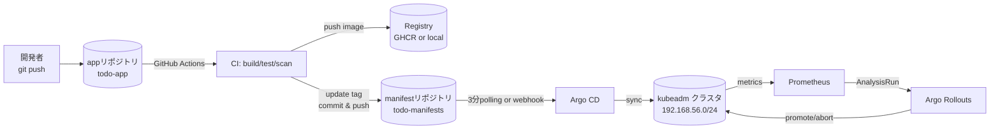
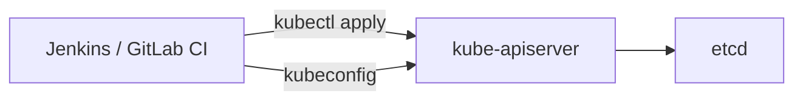
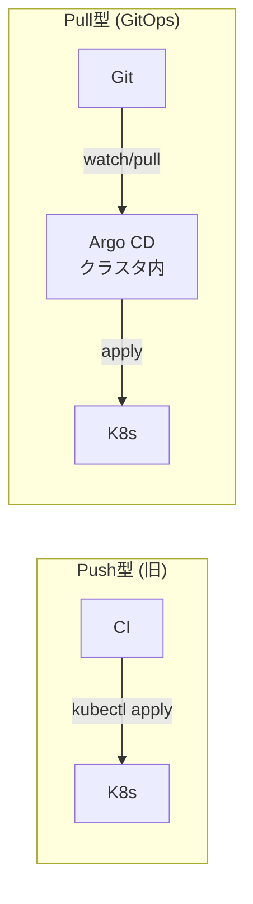
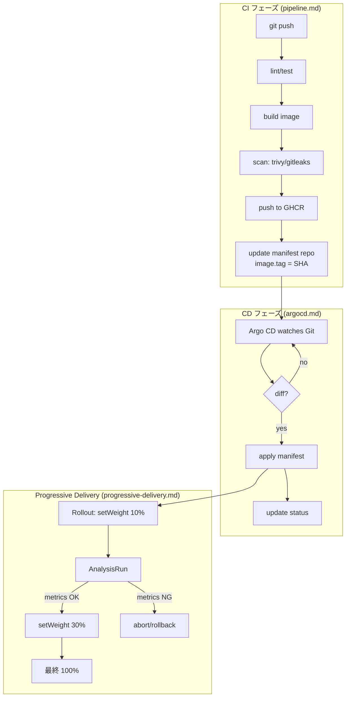
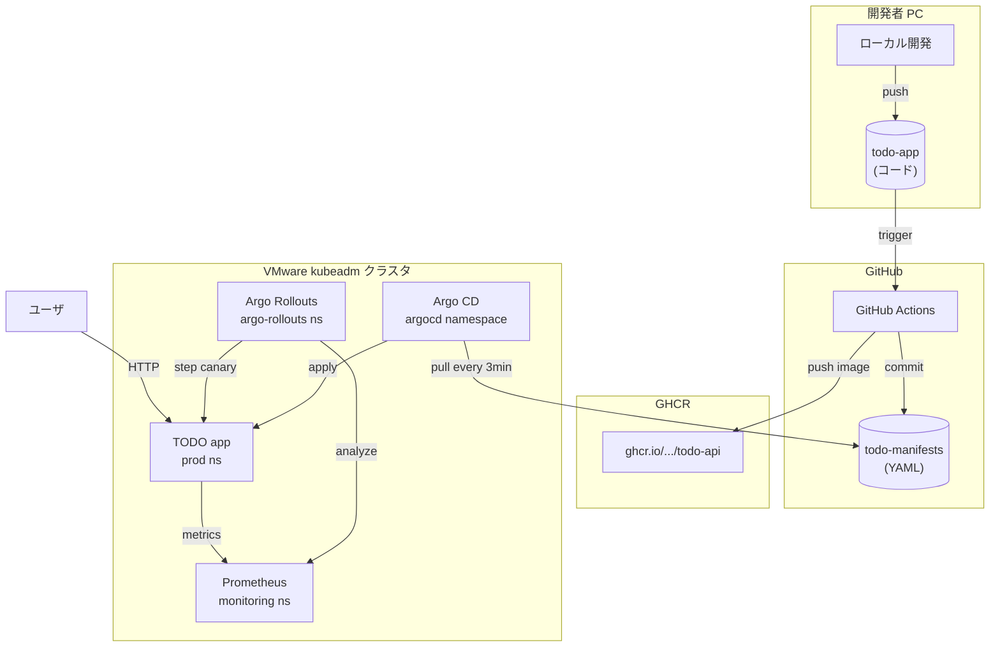

# 08. CI/CDとGitOps
{: .no_toc }

## 目次
{: .no_toc .text-delta }

1. TOC
{:toc}

---

## この章で学ぶこと

これまでの章では、ローカルの `kubectl apply -f` や、せいぜい Helm/Kustomize でマニフェストを **「人間が」** クラスタに流し込んでいました。
しかし現実の運用では、毎日何十回もデプロイが走ります。手作業では絶対に追いつきませんし、何より **「誰が、いつ、どのバージョンを、どの環境に、なぜ入れたか」** が記録に残らないと、本番障害時に何もできません。

本章では、サンプルアプリ「ミニTODOサービス」を題材に、以下の流れを **手元で完結する形** で構築します。

1. 開発者が `git push` する
2. GitHub Actions が走り、テスト・ビルド・脆弱性スキャン・イメージ push が自動実行される
3. CI ジョブの最後で、別途用意した **マニフェストリポジトリ** のイメージタグを書き換えてコミットする
4. Argo CD がマニフェストリポジトリの変更を検知し、クラスタに反映する
5. (任意) Argo Rollouts がカナリアリリースとして段階的にトラフィックを切り替え、メトリクスを監視しながら安全に新バージョンへ移行する

つまり、 **「Git にマージしただけで本番に反映される」** 一連のパイプラインを、自分の VMware kubeadm クラスタの上で動かすことが目標です。

## このページのゴール

このページを読み終えると、以下を **自分の言葉で説明できる** ようになります。

- CI と CD が何を意味し、それぞれの責務が何かを区別できる
- 「継続的デプロイメント」と「継続的デリバリー」の違いを答えられる
- GitOps が登場する以前のデプロイ方式 (push 型 / kubectl pipeline) の問題点を3つ挙げられる
- pull 型 GitOps が解決する課題と、そのトレードオフを説明できる
- Progressive Delivery がローリングアップデートと何が違うのかを言える
- 本章で構築する CI/CD パイプライン全体の流れを図示できる

---

## CI/CD の歴史: なぜここに辿り着いたか

### 1990年代後半: Nightly Build と Extreme Programming

「Continuous Integration」という言葉は、1991 年に Grady Booch が **Object Solutions** の中で初めて使ったとされていますが、概念として広まったのは 1996 年の **Extreme Programming (XP)** が登場してからです。Kent Beck らが提唱した XP のプラクティスの中に「Continuous Integration」が明示的に含まれていました。

当時の問題はシンプルでした。

- 開発者各自がローカルで作業し、何日も統合しない
- いざマージしようとすると衝突地獄
- 結合テストはリリース直前にようやく実施 (= integration hell)

これに対する処方箋が「**毎日少なくとも1回は統合する** (Continuous Integration)」でした。これを実現するために、CruiseControl (2001 年) のような CI サーバが登場します。

### 2000年代: Hudson と Jenkins

2005 年、Sun Microsystems の川口耕介氏が **Hudson** を公開しました。これが後の **Jenkins** (2011 年に Oracle 買収を機にフォーク) となり、CI の世界を一変させました。

| 時代 | 主流ツール | 特徴 |
|------|-----------|------|
| 〜2000 | 自作スクリプト + cron | ローカル PC で nightly build |
| 2001〜 | CruiseControl | XML 設定、Java 製 |
| 2005〜 | Hudson / Jenkins | プラグインで何でも繋がる |
| 2011〜 | Travis CI / CircleCI | SaaS、YAML 設定、OSS フレンドリー |
| 2013〜 | GitLab CI | リポジトリと統合 |
| 2018〜 | GitHub Actions | リポジトリと深く統合、Marketplace |

### 2010年代前半: Continuous Delivery と Continuous Deployment

Jez Humble と David Farley の書籍 **「Continuous Delivery」** (2010) は決定打でした。彼らは「ビルドが緑なら、いつでも本番にリリースできる状態に保つ」というプラクティスを言語化しました。

ここで重要なのは、 **CD という略称には2つの意味がある** ことです。

| 略称 | 正式名称 | 意味 |
|------|----------|------|
| CD | Continuous **Delivery** | 「いつでも本番にリリースできる状態」を保つ。最終リリースは人間のボタン押下 |
| CD | Continuous **Deployment** | リリースまで完全自動。テストが通ったら勝手に本番へ |

「Continuous Delivery」は文化・組織の状態を指し、「Continuous Deployment」は技術的な実装を指す、と言うこともできます。本教材では文脈に応じて使い分けますが、Argo CD 等で目指すのは Continuous Deployment 側です。

### 2014年: Kubernetes 登場と「kubectl apply pipeline」

Kubernetes が登場すると、最初は CI サーバから直接 `kubectl apply` する **push 型 CI/CD** が主流になりました。

この方式の問題点が、後の GitOps の議論を生みます。

| 問題 | 詳細 |
|------|------|
| **クレデンシャル流出リスク** | CI サーバが本番クラスタの kubeconfig を持つ。CI サーバが侵害されると本番もアウト |
| **真実の源泉が複数** | Git にあるマニフェストと、クラスタの実態がズレる (ドリフト) |
| **誰が変更したか不明瞭** | `kubectl edit` で直接いじれば履歴なし |
| **CI ジョブが失敗したら宙ぶらりん** | apply の途中で失敗すると、部分適用状態に |
| **デプロイ履歴が CI ログ依存** | CI サーバを変えると履歴が失われる |

### 2017年: GitOps の誕生

2017 年 8 月、Weaveworks の Alexis Richardson が **「Operations by Pull Request」** という記事で **GitOps** という言葉を生み出しました ([原典](https://www.weave.works/blog/gitops-operations-by-pull-request))。
コアアイデアは以下です。

- システムの **「あるべき状態」を Git に宣言的に書く**
- クラスタ内のエージェントが Git を pull し、 **「あるべき状態」と「現在の状態」を比較して収束させる**
- 人間は Git に対してだけ操作する (PR / merge / revert)

これにより、

- **CI サーバはクラスタへのアクセス権を持たなくてよい** (CI は Git にコミットするだけ)
- **クラスタ内のエージェント** だけが apply 権限を持つ → 攻撃面の縮小
- **Git の履歴 = デプロイ履歴**
- **ドリフトを自動検知し修復できる** (selfHeal)

という大きな改善が得られました。

### 2018年: Argo CD と Flux

2018 年、Intuit が社内で開発していた **Argo CD** が OSS 公開され、同年に Weaveworks も **Flux** v1 を公開しました。両者は GitOps の二大実装として現在も発展を続けています。2020 年に Argo Project と Flux Project の両方が CNCF Incubating Project となり、2022 年に両者とも **Graduated Project** に昇格しました。

### 2019年〜: Progressive Delivery

Continuous Deployment が普及すると、「全 Pod を一気に新版に置き換える」のはリスクが高いことが認識され始めます。Netflix や Google 内部では古くから「カナリアリリース」が行われていましたが、Kubernetes の世界に持ち込んだのが **Argo Rollouts** (2019) と **Flagger** (2018、Weaveworks) でした。

「Progressive Delivery」という言葉は **Split Software** の CEO Adam Zimman が 2018 年に提唱したとされ、メトリクスベースの自動判定と段階的トラフィックシフトを組み合わせた一連のプラクティスを指します。

---

## CI と CD の責務分担

本教材で構築するパイプラインの責務分担を改めて整理します。

| フェーズ | 責務 | ツール |
|---------|------|--------|
| **CI** | アプリリポジトリの変更を起点に、ビルド・テスト・スキャン・イメージ push を行い、最後にマニフェストリポジトリの **イメージタグを書き換えてコミット** する | GitHub Actions |
| **CD** | マニフェストリポジトリの変更を検知し、クラスタの状態を Git に合わせる | Argo CD |
| **Progressive Delivery** | Deployment の代わりに Rollout リソースで段階的にトラフィックを切り替え、メトリクスで自動判定する | Argo Rollouts |

### なぜこの3層に分けるのか

歴史的には、これらすべてを Jenkins だけでこなしていました。しかし以下の理由で分離が進みました。

1. **責務が違う**
   - CI: 「コードを動くアーティファクトにする」
   - CD: 「アーティファクトを安全に本番に届ける」
   - PD (Progressive Delivery): 「届けるときに事故らない」
2. **使うべきツールが違う**
   - CI: コードに近い場所で動くべき (GitHub Actions, GitLab CI…)
   - CD: クラスタの中で動くべき (pull 型、Argo CD…)
   - PD: アプリのメトリクスを見られる場所で動くべき (クラスタ内)
3. **更新頻度が違う**
   - CI ワークフローは月に何度も変える
   - CD のマニフェストはコミット毎に変わる
   - Rollout 戦略はサービスごとに最初に決めたら滅多に変えない

---

## 用語の整理

混乱しやすい用語を最初に揃えておきます。

| 用語 | 意味 |
|------|------|
| **アプリリポジトリ (app repo)** | アプリのソースコード、Dockerfile、Helm/Kustomize テンプレートを置く |
| **マニフェストリポジトリ (manifest repo)** | 各環境 (dev/stg/prod) に適用する具体的なマニフェストを置く |
| **イメージレジストリ** | Docker イメージを保存する場所。本教材では GHCR とローカルレジストリ (192.168.56.10:5000) |
| **Application** | Argo CD が「どの Git のどのパスを、どの Namespace に適用するか」を宣言するリソース |
| **ApplicationSet** | Application を動的に生成するメタリソース。dev/stg/prod を一括管理 |
| **Sync** | Argo CD が Git とクラスタを一致させる動作 |
| **Drift** | クラスタの状態が Git と一致していない状態。selfHeal=true なら自動修復される |
| **Rollout** | Argo Rollouts が提供する Deployment 上位互換。カナリア/Blue-Green を宣言できる |
| **AnalysisTemplate** | Rollout の途中でメトリクスを見て自動判定するためのテンプレート |
| **Progressive Delivery** | カナリア / Blue-Green / Feature Flag など、段階的にユーザに新版を見せる手法の総称 |

---

## 章の構成

3 つのページで段階的に学びます。

| ページ | 内容 | 主要ツール |
|--------|------|----------|
| [CIパイプライン]({{ '/08-cicd-gitops/pipeline/' | relative_url }}) | GitHub Actions の文法、ジョブ設計、品質ゲート、イメージタグ戦略、マニフェスト書き換え | GitHub Actions, Trivy, yq |
| [Argo CDでGitOps]({{ '/08-cicd-gitops/argocd/' | relative_url }}) | Argo CD のインストール、Application/ApplicationSet/App-of-Apps、Sync戦略、RBAC、トラブルシュート | Argo CD |
| [Progressive Delivery]({{ '/08-cicd-gitops/progressive-delivery/' | relative_url }}) | Argo Rollouts のカナリア/Blue-Green、AnalysisTemplate、トラフィック分割、ロールバック | Argo Rollouts, Prometheus |

---

## 本章で達成する到達点

3 ページを通じて、最終的に以下のシステムが手元で動きます。

これが手元で完成する頃には、 **あなたは個人開発でも本番運用品質のデプロイパイプラインを構築できる** ようになっているはずです。

---

## チェックポイント

ここまでで以下を **自分の言葉で** 説明できるか確認してください。

- [ ] Continuous Integration / Continuous Delivery / Continuous Deployment それぞれの定義の違い
- [ ] push 型 CI/CD と pull 型 (GitOps) の違いと、後者の利点を3つ
- [ ] アプリリポジトリとマニフェストリポジトリを分離する3つの理由
- [ ] Argo CD と Argo Rollouts が解決している、別々の課題
- [ ] 本章で構築する全体パイプラインを mermaid で描ける
- [ ] GitOps と Progressive Delivery が組み合わさることで何が嬉しいか

→ 次は [CIパイプライン]({{ '/08-cicd-gitops/pipeline/' | relative_url }})
