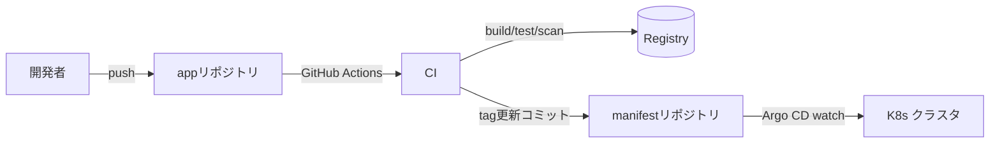

# CIパイプライン
{: .no_toc }

## 目次
{: .no_toc .text-delta }

1. TOC
{:toc}

---

CI/CD の責務分担をはっきりさせるところから。

## 責務分担



- **CI**: ビルド、テスト、スキャン、イメージ push、**マニフェストリポジトリ更新**
- **CD**: マニフェスト変更を検知してクラスタに反映 (Argo CD)

## なぜリポジトリを分けるか (App vs Manifest)

歴史的経緯では混在もありますが、分離する利点:

- マニフェスト履歴がデプロイ履歴になる
- アプリ側の権限とインフラ側の権限を分離できる
- コードのCIとデプロイのGitOpsを別々に進化させられる

本教材でも分離パターンで進めます。

```
github.com/<USER>/todo-app          # コード + Dockerfile + GitHub Actions
github.com/<USER>/todo-manifests    # K8s YAML (Helm/Kustomize)
```

## GitHub Actions ワークフロー

`.github/workflows/ci.yaml` をアプリリポジトリに置きます。

```yaml
name: CI
on:
  push:
    branches: [main]
  pull_request:
    branches: [main]

env:
  REGISTRY: 192.168.56.10:5000   # 自宅ネット内ローカルレジストリ
  IMAGE_NAME: todo-api

jobs:
  test:
    runs-on: ubuntu-latest
    steps:
      - uses: actions/checkout@v4
      - uses: actions/setup-python@v5
        with:
          python-version: '3.12'
      - run: pip install -e .[test]
      - run: pytest --cov

  build-push:
    needs: test
    runs-on: ubuntu-latest
    if: github.event_name == 'push'
    steps:
      - uses: actions/checkout@v4

      - name: Set tag
        id: tag
        run: echo "tag=$(git rev-parse --short HEAD)" >> $GITHUB_OUTPUT

      - uses: docker/setup-buildx-action@v3

      - name: Build & Push
        uses: docker/build-push-action@v5
        with:
          context: .
          push: true
          tags: |
            ${{ env.REGISTRY }}/${{ env.IMAGE_NAME }}:${{ steps.tag.outputs.tag }}
            ${{ env.REGISTRY }}/${{ env.IMAGE_NAME }}:latest

      - name: Trivy scan
        uses: aquasecurity/trivy-action@master
        with:
          image-ref: ${{ env.REGISTRY }}/${{ env.IMAGE_NAME }}:${{ steps.tag.outputs.tag }}
          severity: CRITICAL,HIGH
          exit-code: '1'

      - name: Update manifest repo
        uses: actions/checkout@v4
        with:
          repository: ${{ github.repository_owner }}/todo-manifests
          token: ${{ secrets.MANIFEST_TOKEN }}
          path: manifests
      - run: |
          cd manifests
          yq -i '.image.tag = "${{ steps.tag.outputs.tag }}"' overlays/prod/values.yaml
          git config user.name "ci-bot"
          git config user.email "ci@example.com"
          git add . && git commit -m "deploy: todo-api ${{ steps.tag.outputs.tag }}"
          git push
```

ポイント:

- イメージタグは **`latest` に頼らず、Git SHA を使う** ことで再現性を担保
- マニフェストリポジトリへの書き換えコミットで CD のトリガに
- `trivy` で脆弱性検知、CRITICAL/HIGH があれば失敗

## ローカルレジストリへの push

ローカル完結なので、自宅で動く `192.168.56.10:5000` を使います。
Actions の Runner からは到達できないため、選択肢としては:

1. **Self-hosted Runner** をクラスタ内 or 同一ネットワークの VM に立てる
2. ngrok 等でトンネリング
3. パブリックレジストリ (GHCR) を使い、CD がローカルクラスタで pull

学習用には GHCR が圧倒的に楽です。本教材では **GHCR をデフォルト**、Self-hosted Runner を任意採用とします。

```yaml
env:
  REGISTRY: ghcr.io
  IMAGE_NAME: ${{ github.repository_owner }}/todo-api
```

```bash
# ノード側で GHCR から pull するための ImagePullSecret
kubectl create secret docker-registry ghcr \
  --docker-server=ghcr.io \
  --docker-username=<USER> \
  --docker-password=<PAT>
```

## CI 単体での品質ゲート

ビルド → push の前にチェックすべき項目:

| 種類 | ツール例 |
|------|----------|
| Lint | `ruff`, `eslint`, `helm lint`, `kubeconform` |
| ユニットテスト | `pytest`, `jest` |
| コンテナイメージ脆弱性 | Trivy, Grype |
| YAML静的解析 | `kubeconform`, `kube-linter` |
| シークレット検知 | `gitleaks` |

これらを CI に組み込み、main にマージできない仕組みを作る。

## 演習: 1コミットで本番反映

1. アプリの API ハンドラに変更を入れて push
2. Actions が走り、テスト → ビルド → push → manifest 更新コミットが走る
3. manifest リポジトリが更新されたことを確認

次節 [Argo CD]({{ '/08-cicd-gitops/argocd/' | relative_url }}) で、この更新がクラスタに反映されるところまでを完成させます。

## チェックポイント

- [ ] アプリリポジトリとマニフェストリポジトリを分ける利点
- [ ] CIで実装すべき品質ゲートを 3 つ
- [ ] イメージタグに `latest` を使わない理由
