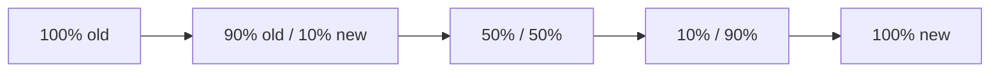

# Progressive Delivery
{: .no_toc }

## 目次
{: .no_toc .text-delta }

1. TOC
{:toc}

---

ローリングアップデートの先にある **段階的リリース** を扱います。
代表的なパターン: カナリア / Blue-Green / Feature Flag。
ツールは **Argo Rollouts** や **Flagger**。本教材では Argo Rollouts を使います。

## カナリアリリースとは

新バージョンに **少しだけトラフィックを流して様子を見て、徐々に増やす** 戦略。



各ステップで:

- メトリクスを見て自動判定
- 失敗ならロールバック
- OK なら次のステップへ

## Argo Rollouts のインストール

```bash
kubectl create namespace argo-rollouts
kubectl apply -n argo-rollouts -f https://github.com/argoproj/argo-rollouts/releases/latest/download/install.yaml
```

CLI:

```bash
curl -LO https://github.com/argoproj/argo-rollouts/releases/latest/download/kubectl-argo-rollouts-linux-amd64
sudo install kubectl-argo-rollouts-linux-amd64 /usr/local/bin/kubectl-argo-rollouts
```

## Rollout リソース

Deployment の代わりに `Rollout` を使います。

```yaml
apiVersion: argoproj.io/v1alpha1
kind: Rollout
metadata:
  name: todo-api
spec:
  replicas: 5
  selector:
    matchLabels:
      app.kubernetes.io/name: todo-api
  template:
    metadata:
      labels:
        app.kubernetes.io/name: todo-api
    spec:
      containers:
      - name: api
        image: ghcr.io/<USER>/todo-api:1.2.3
        ports:
        - containerPort: 8000
  strategy:
    canary:
      canaryService: todo-api-canary
      stableService: todo-api-stable
      trafficRouting:
        nginx:
          stableIngress: todo
      steps:
      - setWeight: 10
      - pause: {duration: 2m}
      - analysis:
          templates:
          - templateName: success-rate
      - setWeight: 30
      - pause: {duration: 2m}
      - setWeight: 60
      - pause: {duration: 2m}
      - setWeight: 100
```

2 つの Service と Ingress と組み合わせる構成:

```yaml
# stable
apiVersion: v1
kind: Service
metadata:
  name: todo-api-stable
spec:
  selector:
    app.kubernetes.io/name: todo-api
  ports: [{port: 80, targetPort: 8000}]
---
apiVersion: v1
kind: Service
metadata:
  name: todo-api-canary
spec:
  selector:
    app.kubernetes.io/name: todo-api
  ports: [{port: 80, targetPort: 8000}]
---
apiVersion: networking.k8s.io/v1
kind: Ingress
metadata:
  name: todo
spec:
  ingressClassName: nginx
  rules:
  - host: todo.local
    http:
      paths:
      - path: /api
        pathType: Prefix
        backend:
          service:
            name: todo-api-stable
            port: {number: 80}
```

NGINX Ingress と Argo Rollouts の連携で、`canary-by-weight` annotation を自動付与してトラフィック分割します。

## AnalysisTemplate

メトリクスベースの自動判定。

```yaml
apiVersion: argoproj.io/v1alpha1
kind: AnalysisTemplate
metadata:
  name: success-rate
spec:
  metrics:
  - name: success-rate
    interval: 30s
    count: 4
    successCondition: result[0] >= 0.99
    provider:
      prometheus:
        address: http://prometheus.monitoring.svc:9090
        query: |
          sum(rate(http_requests_total{job="todo-api",code!~"5.."}[1m]))
          /
          sum(rate(http_requests_total{job="todo-api"}[1m]))
```

成功率99%以上を保てば次のステップ、失敗時は自動ロールバック。

## Blue-Green 戦略

```yaml
spec:
  strategy:
    blueGreen:
      activeService: todo-api-active
      previewService: todo-api-preview
      autoPromotionEnabled: false      # 手動で Promote
      scaleDownDelaySeconds: 300        # Promote 後しばらく旧版を残す
```

新版を `preview` で立て、確認 OK なら `argo rollouts promote` で active 切替。

## ハンズオン

```bash
kubectl argo rollouts get rollout todo-api --watch
kubectl set image rollout/todo-api api=ghcr.io/<USER>/todo-api:1.2.4
kubectl argo rollouts promote todo-api      # 手動で次に進める
kubectl argo rollouts abort todo-api        # キャンセル
kubectl argo rollouts undo todo-api         # 巻き戻し
```

## チェックポイント

- [ ] カナリアリリースのメリットとリスク
- [ ] AnalysisTemplate に書く SLI を 1 つ提案できる
- [ ] Blue-Green とカナリアの使い分け
