# Progressive Delivery
{: .no_toc }

## 目次
{: .no_toc .text-delta }

1. TOC
{:toc}

---

## このページのゴール

このページを読み終えると、以下を **自分の言葉で説明できる** ようになります。

- 「Progressive Delivery」が何を意味し、Continuous Deployment と何が違うかを説明できる
- 主要なデプロイ戦略 (Recreate / Rolling / Blue-Green / Canary / Shadow / A/B / Feature Flag) を図示し、長所短所を答えられる
- Kubernetes の `Deployment` の rolling update の限界を3つ以上挙げられる
- Argo Rollouts と Flagger の違い、選定理由を説明できる
- `Rollout` リソースの canary / blueGreen 戦略のフィールドをすべて読める
- `AnalysisTemplate` で書くべき SLI を3種類以上挙げ、Prometheus クエリで実装できる
- カナリアが失敗した時の自動ロールバックの挙動を説明できる
- 本番でメトリクスベースの自動 promote/abort を運用する上での落とし穴を3つ挙げられる
- 「カナリアリリースをやってる」と言える状態を、ローカル kubeadm 環境で構築できた

---

## Progressive Delivery とは

### 定義

「**段階的にユーザーに新版を見せていく** デリバリー戦略の総称」です。

`Continuous Deployment` だけでは「新版を一気に 100% のユーザーへ」流してしまいます。これでは、新版にバグがあった時の被害が大きすぎる。
`Progressive Delivery` は、 **新版に対するユーザー暴露を時間的・空間的に段階化** することで、被害を最小化します。

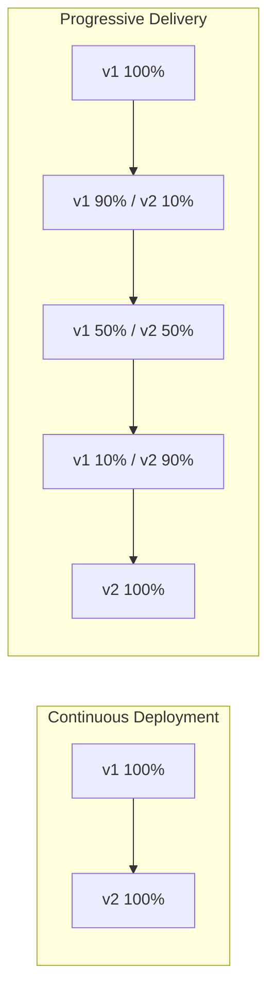
```mermaid
flowchart LR
    subgraph "Continuous Deployment"
    cd1[v1 100%] --> cd2[v2 100%]
    end
    subgraph "Progressive Delivery"
    pd1[v1 100%] --> pd2[v1 90% / v2 10%]
    pd2 --> pd3[v1 50% / v2 50%]
    pd3 --> pd4[v1 10% / v2 90%]
    pd4 --> pd5[v2 100%]
    end
```

### 「Progressive Delivery」という言葉の起源

2018 年に **Adam Zimman** (Split Software CEO) と **James Governor** (RedMonk) が提唱した用語です。Governor のブログ記事「[Progressive Delivery: New tools and techniques for changing software faster](https://redmonk.com/jgovernor/2018/08/06/progressive-delivery-new-tools-and-techniques-for-changing-software-faster/)」が原典。

技術的なバックグラウンドはもっと古く、Facebook や Netflix が 2010 年代前半から社内で実践していたものを一般化したものです。

### 何が嬉しいか

| メリット | 解説 |
|---------|------|
| **障害の局所化** | 全ユーザーではなく一部に限定。MTTR ではなく MTTD (検出までの時間) を短縮 |
| **メトリクスベース判定** | エラー率や p99 レイテンシをリアルタイムに見て自動判定 |
| **ロールバック高速化** | トラフィックを戻すだけ。Pod 再作成不要 |
| **A/B テスト** | 機能比較で意思決定できる |
| **ダークローンチ** | 本番トラフィックをコピーして検証 (Shadow) |

### Progressive Delivery が向く/向かないケース

| 向くケース | 向かないケース |
|----------|-------------|
| HTTP/gRPC のステートレス API | バッチ Job (Worker, CronJob) |
| 短時間のリクエスト | 長時間のセッション保持 (WebSocket は工夫要) |
| サービスメッシュや高度な Ingress を使ってる | KubernetesDeployment しか使ってない |
| メトリクス整備済み | メトリクス不在 |
| トラフィック十分 (1秒間に数百以上) | 低トラフィック (判定材料不足) |

---

## デプロイ戦略の総覧

### Recreate (停止 → 起動)


```mermaid
gantt
    title Recreate
    dateFormat HH:mm:ss
    axisFormat %H:%M:%S
    section old
    v1 (replicas=3) :a1, 00:00:00, 30s
    停止 :crit, a2, after a1, 5s
    section new
    v2 (replicas=3) :a3, after a2, 30s
```

- **挙動**: 全 Pod を停止してから新版を起動
- **メリット**: 単純、リソース 1 倍で済む
- **デメリット**: ダウンタイム発生
- **用途**: dev / DB マイグレーションなどステートフル

```yaml
spec:
  strategy:
    type: Recreate
```

### Rolling Update (Deployment デフォルト)


```mermaid
gantt
    title Rolling Update
    dateFormat HH:mm:ss
    axisFormat %H:%M:%S
    section v1
    Pod-1 :done, 00:00:00, 20s
    Pod-2 :done, 00:00:00, 30s
    Pod-3 :done, 00:00:00, 40s
    section v2
    Pod-4 :a1, 00:00:15, 30s
    Pod-5 :a2, 00:00:25, 30s
    Pod-6 :a3, 00:00:35, 30s
```

- **挙動**: 古い Pod を1つずつ新しい Pod に置き換える
- **メリット**: ダウンタイムなし、リソース 1.x 倍で済む
- **デメリット**: 失敗時の自動判定なし、トラフィック制御細かくない
- **用途**: 基本のデプロイ

```yaml
spec:
  strategy:
    type: RollingUpdate
    rollingUpdate:
      maxSurge: 25%             # 一時的に増やせる Pod 数
      maxUnavailable: 25%       # 一時的に減らせる Pod 数
```

### Blue-Green

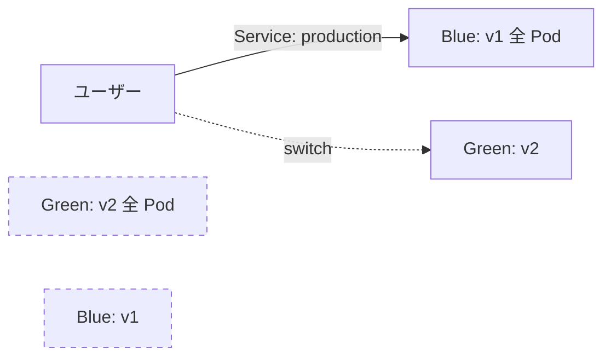
```mermaid
flowchart LR
    user[ユーザー] -->|Service: production| blue[Blue: v1 全 Pod]
    green[Green: v2 全 Pod]:::idle
    classDef idle stroke-dasharray: 5 5;

    user -.->|switch| green2[Green: v2]
    blue2[Blue: v1]:::idle
```

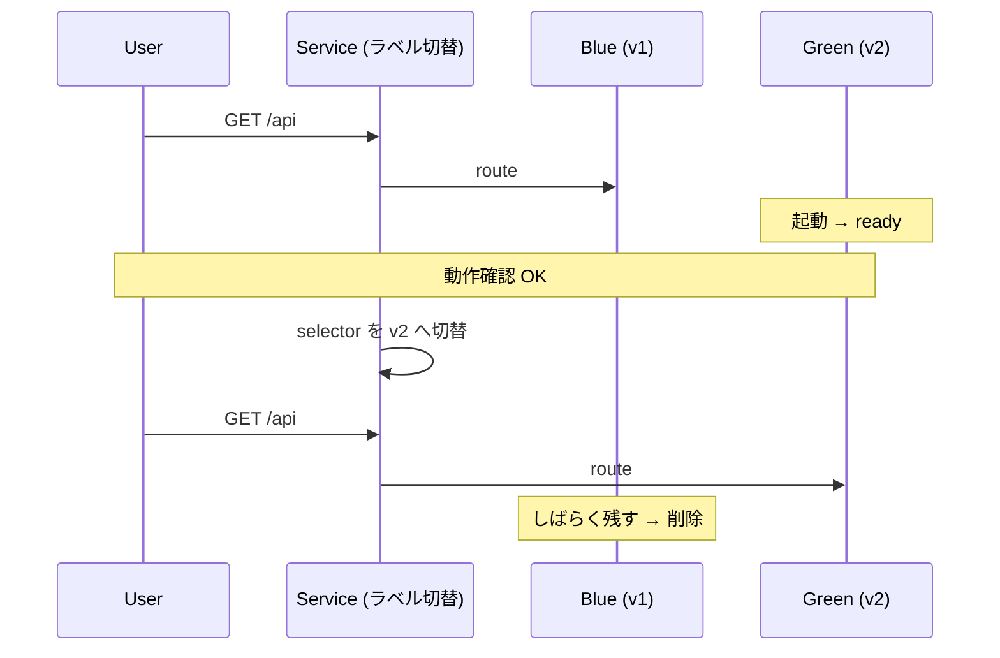
```mermaid
sequenceDiagram
    participant User
    participant Service as Service (ラベル切替)
    participant Blue as Blue (v1)
    participant Green as Green (v2)

    User->>Service: GET /api
    Service->>Blue: route
    Note over Green: 起動 → ready
    Note over User,Green: 動作確認 OK
    Service->>Service: selector を v2 へ切替
    User->>Service: GET /api
    Service->>Green: route
    Note over Blue: しばらく残す → 削除
```

- **挙動**: 新版を別途立てて、トラフィックを瞬間切替
- **メリット**: 即時ロールバック可、テスト環境としても使える
- **デメリット**: リソース 2 倍、DB スキーマ互換性が必要
- **用途**: 高い切替速度が必要なサービス

### Canary

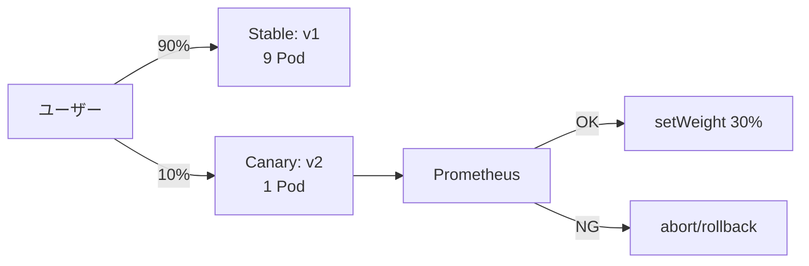
```mermaid
flowchart LR
    user[ユーザー] -->|90%| stable[Stable: v1<br/>9 Pod]
    user -->|10%| canary[Canary: v2<br/>1 Pod]
    canary --> metrics[Prometheus]
    metrics -->|OK| weight[setWeight 30%]
    metrics -->|NG| abort[abort/rollback]
```

- **挙動**: 新版に少しだけトラフィックを流し、徐々に増やす
- **メリット**: リスク最小、メトリクスベース判定が可能
- **デメリット**: 設定が複雑、サービスメッシュや高度な Ingress 必要
- **用途**: 本番のミッションクリティカルサービス

### A/B Testing

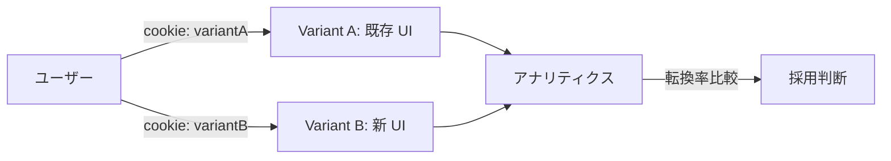
```mermaid
flowchart LR
    user[ユーザー] -->|cookie: variantA| a[Variant A: 既存 UI]
    user -->|cookie: variantB| b[Variant B: 新 UI]
    a --> analytics[アナリティクス]
    b --> analytics
    analytics -->|転換率比較| decision[採用判断]
```

- **挙動**: ユーザー属性 (cookie, header, geo) でルーティング分岐
- **メリット**: ビジネスメトリクスで判定
- **デメリット**: 統計的有意性まで時間がかかる、サンプルバイアス
- **用途**: 機能 A/B テスト

### Shadow (Dark Launch / Mirror)

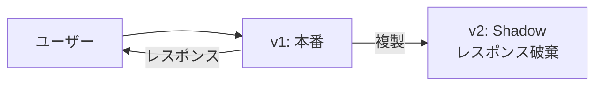
```mermaid
flowchart LR
    user[ユーザー] --> prod[v1: 本番]
    prod -->|レスポンス| user
    prod -->|複製| shadow[v2: Shadow<br/>レスポンス破棄]
```

- **挙動**: 本番トラフィックをコピーして新版にも流すが、レスポンスは破棄
- **メリット**: 本番トラフィックで負荷試験できる
- **デメリット**: side effect (DB 書き込み等) があると危険
- **用途**: 大規模なリファクタリングの検証

### Feature Flag

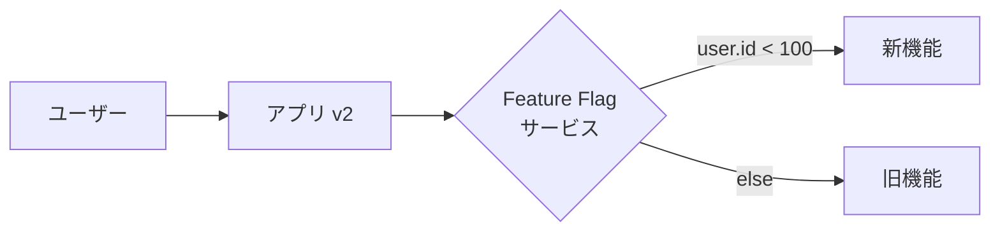
```mermaid
flowchart LR
    user[ユーザー] --> app[アプリ v2]
    app --> ff{Feature Flag<br/>サービス}
    ff -->|user.id < 100| new[新機能]
    ff -->|else| old[旧機能]
```

- **挙動**: アプリケーションコード内で機能を ON/OFF
- **メリット**: デプロイとリリースを分離、即時切替
- **デメリット**: コードに複雑性、長期化する flag が地雷
- **用途**: 機能ロールアウト、Kill switch

代表的ツール: LaunchDarkly, Split, Flagsmith, OpenFeature (CNCF)

### 全戦略の比較

| 戦略 | ダウンタイム | リソース | メトリクス判定 | トラフィック制御 | 実装難度 |
|------|------------|--------|------------|--------------|---------|
| Recreate | あり | 1x | なし | なし | 易 |
| Rolling | なし | 1.x | なし | なし (Pod 単位) | 易 |
| Blue-Green | なし | 2x | 手動 | 瞬間切替 | 中 |
| Canary | なし | 1.x〜2x | 自動 | 細かい | 難 |
| A/B | なし | 1.x | 手動 | ユーザ属性 | 難 |
| Shadow | なし | 2x | 手動 | 複製 | 難 |
| Feature Flag | なし | 1x | アプリ内 | 任意 | 中 (運用は難) |

---

## Kubernetes 標準 Deployment の rolling update の限界

```yaml
strategy:
  type: RollingUpdate
  rollingUpdate:
    maxSurge: 25%
    maxUnavailable: 25%
```

Deployment の rolling update は便利ですが、 **以下のことができません**:

1. **メトリクスを見て自動判定** できない (Pod が Ready なら次へ進むだけ)
2. **トラフィックの細かい制御** (90%/10% のようなパーセント制御) ができない
3. **A/B テスト** (ユーザー属性別ルーティング) はできない
4. **手動 Promote** で承認制にできない
5. **Blue-Green** はできない (StatefulSet で工夫すれば可能だが煩雑)
6. **Pause** して長時間待つ機能がない

これらを満たすために、 **Argo Rollouts** や **Flagger** という上位互換が必要になります。

---

## Argo Rollouts と Flagger の比較

| 比較項目 | Argo Rollouts | Flagger |
|---------|--------------|---------|
| 開発元 | Argo Project (Intuit) | Flux Project (Weaveworks) |
| 提供方式 | `Rollout` CRD で Deployment を置き換える | `Canary` CRD が既存 Deployment を参照 |
| Ingress 対応 | NGINX, ALB, Istio, AppMesh, Traefik, Apisix, SMI, Contour | NGINX, Istio, App Mesh, Contour, Gloo, Skipper |
| メトリクスソース | Prometheus, Datadog, New Relic, Wavefront, CloudWatch, Web, Job, Kayenta | Prometheus, Datadog, CloudWatch, New Relic, Stackdriver, Graphite, InfluxDB |
| Kubernetes API | CRD (`Rollout`, `AnalysisTemplate`, `Experiment`) | CRD (`Canary`, `MetricTemplate`) |
| UI / Dashboard | 公式 UI あり、Argo CD と統合 | なし (Grafana ダッシュボードのみ) |
| 既存 Deployment との関係 | Deployment を Rollout に置き換える必要あり | Deployment はそのまま、Canary が管理 |
| Workload Reference | `workloadRef` で Deployment を参照する方式もあり | Deployment が主、Flagger が副 |
| 機能の豊富さ | Experiment、AnalysisRun、Blue-Green、Canary、Header Routing | Canary、Blue-Green、A/B (header)、Mirror |
| Argo CD との親和性 | 完璧 (同じプロジェクト) | 良好 (CRD として扱える) |
| 学習コスト | やや高 (機能多い) | やや低 |

本教材では **Argo Rollouts** を採用します。理由:
- Argo CD と同じプロジェクトでドキュメントの連続性がある
- UI で進捗が視覚的に見える
- AnalysisRun の柔軟性

---

## Argo Rollouts のアーキテクチャ

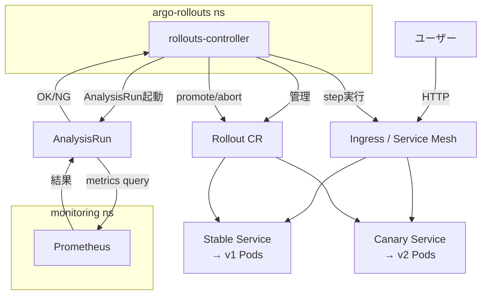
```mermaid
flowchart TB
    user[ユーザー] -->|HTTP| ing[Ingress / Service Mesh]
    ing --> stable[Stable Service<br/>→ v1 Pods]
    ing --> canary[Canary Service<br/>→ v2 Pods]

    subgraph "argo-rollouts ns"
    ctrl[rollouts-controller]
    end

    subgraph "monitoring ns"
    prom[Prometheus]
    end

    ctrl -->|管理| rollout[Rollout CR]
    rollout --> stable
    rollout --> canary
    ctrl -->|step実行| ing
    ctrl -->|AnalysisRun起動| run[AnalysisRun]
    run -->|metrics query| prom
    prom -->|結果| run
    run -->|OK/NG| ctrl
    ctrl -->|promote/abort| rollout
```

| コンポーネント | 役割 |
|-------------|------|
| **rollouts-controller** | Deployment コントローラと同じ位置付け。Rollout の reconcile |
| **Rollout CR** | Deployment の上位互換。canary/blueGreen 戦略を宣言 |
| **AnalysisTemplate** | メトリクス判定のテンプレート |
| **AnalysisRun** | AnalysisTemplate から生成される実行インスタンス |
| **Experiment** | 並行で複数バリアントを試す |
| **kubectl argo rollouts (plugin)** | CLI |

---

## インストール

### Step 1: コンポーネント install

```bash
kubectl create namespace argo-rollouts
kubectl apply -n argo-rollouts \
  -f https://github.com/argoproj/argo-rollouts/releases/latest/download/install.yaml
```

**期待される出力**:

```
customresourcedefinition.apiextensions.k8s.io/analysisruns.argoproj.io created
customresourcedefinition.apiextensions.k8s.io/analysistemplates.argoproj.io created
customresourcedefinition.apiextensions.k8s.io/clusteranalysistemplates.argoproj.io created
customresourcedefinition.apiextensions.k8s.io/experiments.argoproj.io created
customresourcedefinition.apiextensions.k8s.io/rollouts.argoproj.io created
serviceaccount/argo-rollouts created
...
deployment.apps/argo-rollouts created
```

### Step 2: 動作確認

```bash
kubectl get pod -n argo-rollouts
```

**期待される出力**:

```
NAME                             READY   STATUS    RESTARTS   AGE
argo-rollouts-7c8f8c8f4-xxxxx    1/1     Running   0          60s
```

### Step 3: CLI plugin インストール

```bash
# Linux
curl -LO https://github.com/argoproj/argo-rollouts/releases/latest/download/kubectl-argo-rollouts-linux-amd64
sudo install kubectl-argo-rollouts-linux-amd64 /usr/local/bin/kubectl-argo-rollouts

# macOS
brew install argoproj/tap/kubectl-argo-rollouts

# 動作確認
kubectl argo rollouts version
# kubectl-argo-rollouts: v1.7.1
```

### Step 4: Dashboard (Web UI) を立てる (任意)

```bash
kubectl argo rollouts dashboard --port 3100
```

`http://localhost:3100` でローカルの Web UI が開きます。
本番では `argo-rollouts-dashboard` Service として永続化:

```bash
kubectl apply -n argo-rollouts -f \
  https://raw.githubusercontent.com/argoproj/argo-rollouts/stable/manifests/dashboard-install.yaml
```

---

## Rollout リソース

`Deployment` の代わりに `Rollout` を使います。

### 最小構成 (Canary)

```yaml
apiVersion: argoproj.io/v1alpha1
kind: Rollout
metadata:
  name: todo-api
spec:
  replicas: 5
  revisionHistoryLimit: 3
  selector:
    matchLabels:
      app.kubernetes.io/name: todo-api
  template:                              # ← Pod template (Deployment と同じ)
    metadata:
      labels:
        app.kubernetes.io/name: todo-api
    spec:
      containers:
      - name: api
        image: ghcr.io/USER/todo-api:1.2.3
        ports:
        - containerPort: 8000
  strategy:
    canary:
      steps:
      - setWeight: 10                    # 10% を新版へ
      - pause: {duration: 2m}            # 2分待つ
      - setWeight: 30
      - pause: {duration: 2m}
      - setWeight: 60
      - pause: {duration: 2m}
      - setWeight: 100
```

### Deployment との違い

| 項目 | Deployment | Rollout |
|------|-----------|---------|
| API group | `apps/v1` | `argoproj.io/v1alpha1` |
| `spec.template` | あり | あり (同じ) |
| `spec.strategy` | `Recreate`/`RollingUpdate` | `canary`/`blueGreen` |
| メトリクス判定 | なし | `analysis` |
| 一時停止 | なし | `pause` |
| トラフィック分割 | Pod 単位のみ | `trafficRouting` で % |

### Workload Reference 方式 (v1.0+)

既存の Deployment を残したまま Rollout で制御もできます。

```yaml
apiVersion: argoproj.io/v1alpha1
kind: Rollout
metadata:
  name: todo-api
spec:
  workloadRef:
    apiVersion: apps/v1
    kind: Deployment
    name: todo-api
  strategy:
    canary:
      steps:
      - setWeight: 10
      - pause: {duration: 2m}
```

この場合、 **Deployment の `spec.replicas` を 0 に設定** し、Rollout が制御を引き継ぎます。
既存資産を活かして Rollouts を導入する移行パスとして便利。

---

## Canary 戦略の詳細

### 全フィールド

```yaml
spec:
  strategy:
    canary:
      # トラフィック分割なしモード (Pod 比率で近似)
      maxSurge: 25%
      maxUnavailable: 0

      # 2 Service モード (Ingress と組み合わせ)
      canaryService: todo-api-canary    # 新版だけを指す Service
      stableService: todo-api-stable    # 旧版だけを指す Service

      # Traffic Routing (上記 2 Service + Ingress 等)
      trafficRouting:
        nginx:
          stableIngress: todo-api
          additionalIngressAnnotations:
            canary-by-header: X-Canary
        # alb:
        #   ingress: todo-api
        #   servicePort: 80
        # istio:
        #   virtualService:
        #     name: todo-api
        #     routes: [primary]
        # smi:
        #   trafficSplitName: todo-api

      # ステップ列
      steps:
      - setWeight: 5
      - pause: {duration: 30s}
      - analysis:
          templates:
          - templateName: success-rate
          args:
          - name: service-name
            value: todo-api-canary
      - setWeight: 25
      - pause: {duration: 30s}
      - analysis:
          templates:
          - templateName: success-rate
      - setWeight: 50
      - pause: {}                        # 無期限 (手動 promote 待ち)
      - setWeight: 100

      # 分析失敗時の動作
      abortScaleDownDelaySeconds: 30      # abort 後、Pod を消すまでの猶予

      # canary の Pod 数調整
      dynamicStableScale: true            # 旧版を徐々に減らす

      # 共通 AnalysisTemplate
      analysis:
        templates:
        - templateName: success-rate
        startingStep: 2                   # step 2 から分析開始
```

### ステップの種類

#### `setWeight`

新版に流すトラフィックの割合。0〜100。

```yaml
- setWeight: 10
```

#### `pause`

実行を一時停止。`duration` を指定しない場合は手動 promote 待ち。

```yaml
- pause: {}                              # 手動 promote
- pause: {duration: 5m}                  # 5分後に自動で次へ
- pause: {duration: 1h}                  # 1時間
```

#### `analysis`

メトリクス判定。詳細は AnalysisTemplate のセクションで。

```yaml
- analysis:
    templates:
    - templateName: success-rate
    args:
    - name: service-name
      value: todo-api-canary
```

#### `experiment`

並行で複数バージョンを動かす (A/B テスト的)。

```yaml
- experiment:
    duration: 5m
    templates:
    - name: experiment-baseline
      specRef: stable
    - name: experiment-canary
      specRef: canary
```

#### `setCanaryScale`

「重みとは別に Pod 数だけ調整」したい時。

```yaml
- setCanaryScale:
    weight: 25                           # canary の重みは 25%
    replicas: 2                          # でも Pod は 2 だけ
```

トラフィックは 25% でも、絶対数は少なく抑えたいケース。

#### `setHeaderRoute` (Istio/SMI 等)

特定 header のリクエストだけを canary へ:

```yaml
- setHeaderRoute:
    name: canary-by-cookie
    match:
    - headerName: X-Canary
      headerValue:
        exact: "true"
```

社内ユーザーだけ canary を見せたい等。

#### `setMirrorRoute` (Istio)

トラフィックを **複製** して canary にも流す (レスポンスは破棄):

```yaml
- setMirrorRoute:
    name: shadow-test
    percentage: 10
    match:
    - method:
        exact: GET
```

shadow traffic で「本番負荷で大丈夫か」を確認。

---

## Blue-Green 戦略の詳細

```yaml
spec:
  strategy:
    blueGreen:
      activeService: todo-api-active      # ユーザートラフィックの行き先
      previewService: todo-api-preview    # 新版の検証用
      autoPromotionEnabled: false         # 手動承認待ち
      autoPromotionSeconds: 0             # 自動 promote までの秒数
      scaleDownDelaySeconds: 300          # promote 後、旧版を残す時間
      scaleDownDelayRevisionLimit: 2      # 旧版を保持する revision 数
      prePromotionAnalysis:               # promote 前の検証
        templates:
        - templateName: smoke-test
      postPromotionAnalysis:              # promote 後の検証
        templates:
        - templateName: success-rate
      antiAffinity:                        # 旧版と新版を別ノードに
        requiredDuringSchedulingIgnoredDuringExecution: {}
```

### Blue-Green のシーケンス

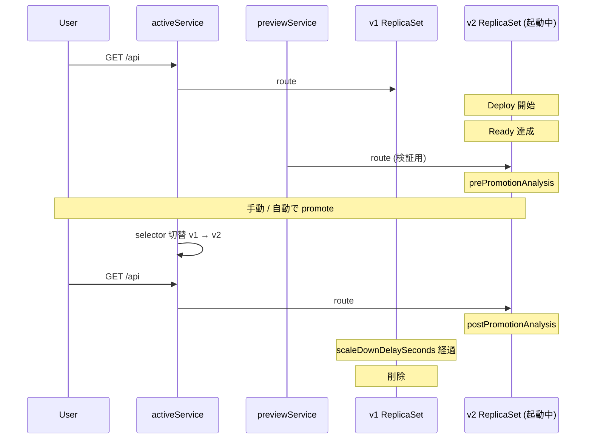
```mermaid
sequenceDiagram
    participant User
    participant Active as activeService
    participant Preview as previewService
    participant Old as v1 ReplicaSet
    participant New as v2 ReplicaSet (起動中)

    User->>Active: GET /api
    Active->>Old: route
    Note over New: Deploy 開始
    Note over New: Ready 達成
    Preview->>New: route (検証用)
    Note over New: prePromotionAnalysis
    Note over User,New: 手動 / 自動で promote
    Active->>Active: selector 切替 v1 → v2
    User->>Active: GET /api
    Active->>New: route
    Note over New: postPromotionAnalysis
    Note over Old: scaleDownDelaySeconds 経過
    Note over Old: 削除
```

### 必要な Service 2 個

```yaml
apiVersion: v1
kind: Service
metadata:
  name: todo-api-active
spec:
  selector:
    app.kubernetes.io/name: todo-api
  ports:
  - port: 80
    targetPort: 8000
---
apiVersion: v1
kind: Service
metadata:
  name: todo-api-preview
spec:
  selector:
    app.kubernetes.io/name: todo-api
  ports:
  - port: 80
    targetPort: 8000
```

ラベルは同じですが、Argo Rollouts が `rollout-pod-template-hash` ラベルを動的に注入することで、Active は v1 ReplicaSet を指し、Preview は v2 ReplicaSet を指す状態を作ります。

### scaleDownDelaySeconds の重要性

`scaleDownDelaySeconds: 300` だと、promote 後も **5 分間は旧 ReplicaSet が残る**。
これで「promote したけど致命的バグ発見 → 即時 rollback」が可能。

`kubectl argo rollouts abort` で abort すると、active を旧版に戻し、新版を消す。

---

## Traffic Routing

`setWeight: 10` を実現するには、Argo Rollouts 単体ではダメで、 **Ingress や Service Mesh と連携** する必要があります。

### NGINX Ingress Controller との連携

NGINX Ingress には **canary annotation** があり、これを Argo Rollouts が動的に書き換えます。

```yaml
spec:
  strategy:
    canary:
      canaryService: todo-api-canary
      stableService: todo-api-stable
      trafficRouting:
        nginx:
          stableIngress: todo-api
```

`stableIngress` で指定した Ingress と、自動生成される `-canary` Ingress の2つで動作します。

```yaml
# 元の Ingress (stable)
apiVersion: networking.k8s.io/v1
kind: Ingress
metadata:
  name: todo-api
spec:
  ingressClassName: nginx
  rules:
  - host: todo.local
    http:
      paths:
      - path: /api
        pathType: Prefix
        backend:
          service:
            name: todo-api-stable
            port: {number: 80}
```

Rollouts が自動生成する `todo-api-canary`:

```yaml
apiVersion: networking.k8s.io/v1
kind: Ingress
metadata:
  name: todo-api-canary
  annotations:
    nginx.ingress.kubernetes.io/canary: "true"
    nginx.ingress.kubernetes.io/canary-weight: "10"   # ここを step で書き換える
spec:
  rules:
  - host: todo.local
    http:
      paths:
      - path: /api
        pathType: Prefix
        backend:
          service:
            name: todo-api-canary
            port: {number: 80}
```

### Istio との連携

```yaml
trafficRouting:
  istio:
    virtualService:
      name: todo-api
      routes: [primary]
    destinationRule:
      name: todo-api
      canarySubsetName: canary
      stableSubsetName: stable
```

```yaml
apiVersion: networking.istio.io/v1beta1
kind: VirtualService
metadata:
  name: todo-api
spec:
  hosts: [todo-api]
  http:
  - name: primary
    route:
    - destination:
        host: todo-api
        subset: stable
      weight: 100
    - destination:
        host: todo-api
        subset: canary
      weight: 0
---
apiVersion: networking.istio.io/v1beta1
kind: DestinationRule
metadata:
  name: todo-api
spec:
  host: todo-api
  subsets:
  - name: stable
    labels: {}        # Rollouts が動的に注入
  - name: canary
    labels: {}
```

### AWS ALB (ALB Ingress Controller)

```yaml
trafficRouting:
  alb:
    ingress: todo-api
    servicePort: 80
```

### SMI (Service Mesh Interface)

ベンダー非依存の標準 API。Linkerd, Consul, OSM 等が対応。

```yaml
trafficRouting:
  smi:
    trafficSplitName: todo-api
```

### Traffic Routing 対応表

| Ingress/Mesh | Argo Rollouts 対応 | 特徴 |
|-------------|-------------------|------|
| NGINX | ✅ | annotation で重み制御、本教材で使用 |
| Istio | ✅ | VirtualService、最も柔軟 |
| Linkerd (SMI) | ✅ | 軽量メッシュ |
| AWS ALB | ✅ | AWS 限定 |
| Traefik | ✅ | TraefikService |
| Apisix | ✅ | ApisixRoute |
| Contour | ✅ | HTTPProxy |
| Gloo Edge | ✅ | RouteTable |
| AppMesh | ✅ | AWS App Mesh |

---

## AnalysisTemplate

メトリクスベースの自動判定の核心。

### 基本構造

```yaml
apiVersion: argoproj.io/v1alpha1
kind: AnalysisTemplate
metadata:
  name: success-rate
spec:
  args:
  - name: service-name                  # Rollout から渡されるパラメータ
  - name: namespace
    value: prod                          # デフォルト値

  metrics:
  - name: success-rate
    interval: 30s                       # 何秒ごとにクエリするか
    count: 5                            # 何回測定するか
    successCondition: result[0] >= 0.99
    failureLimit: 2                     # 何回失敗で abort するか
    inconclusiveLimit: 3                # 何回 inconclusive で abort するか
    provider:
      prometheus:
        address: http://prometheus.monitoring.svc:9090
        query: |
          sum(rate(
            http_requests_total{job="{{args.service-name}}",code!~"5.."}[1m]
          ))
          /
          sum(rate(
            http_requests_total{job="{{args.service-name}}"}[1m]
          ))
```

### 主要フィールドの意味

| フィールド | 意味 |
|----------|------|
| `interval` | 測定間隔 (30s なら 30 秒に 1 回クエリ) |
| `count` | 全部で何回測定するか (count 5 + interval 30s → 2.5分) |
| `initialDelay` | 開始までの待機時間 |
| `successCondition` | 成功とみなす条件式 (Go template + 関数) |
| `failureCondition` | 失敗とみなす条件 |
| `failureLimit` | 連続失敗回数の上限。超えると abort |
| `inconclusiveLimit` | inconclusive (中間判定) の上限 |
| `consecutiveErrorLimit` | クエリ自体のエラー上限 |
| `provider` | データソース |

### 条件式の書き方

`result` 配列を使います:

```yaml
successCondition: result[0] >= 0.99
successCondition: len(result) > 0 && result[0] < 100
successCondition: asFloat(result[0]) >= 0.95
```

Argo Rollouts は内部で `expr` ライブラリを使ってます。Go のテンプレ + JS 風の式が使える。

### Provider の種類

#### Prometheus

```yaml
provider:
  prometheus:
    address: http://prometheus.monitoring.svc:9090
    query: |
      sum(rate(http_requests_total{job="{{args.service-name}}",status=~"2.."}[1m]))
      /
      sum(rate(http_requests_total{job="{{args.service-name}}"}[1m]))
```

最もよく使う provider。

#### Datadog

```yaml
provider:
  datadog:
    interval: 5m
    query: |
      sum:trace.http.request.errors{service:todo-api,env:prod}.as_rate() /
      sum:trace.http.request.hits{service:todo-api,env:prod}.as_rate()
```

#### New Relic

```yaml
provider:
  newRelic:
    profile: my-newrelic-profile
    query: |
      FROM Metric SELECT percentile(duration, 99) WHERE app = 'todo-api'
```

#### Web (HTTP)

任意の HTTP エンドポイントから JSON を取得して判定:

```yaml
provider:
  web:
    url: http://my-monitoring/check?service=todo-api
    timeoutSeconds: 20
    method: GET
    jsonPath: "{$.healthScore}"
```

#### Job

Kubernetes Job を起動して、その exit code で判定:

```yaml
provider:
  job:
    spec:
      template:
        spec:
          restartPolicy: Never
          containers:
          - name: test
            image: curlimages/curl
            command: [/bin/sh, -c]
            args:
            - |
              curl -fsSL https://todo.example.com/health || exit 1
```

カスタム判定ロジック (smoke test 等) を Job として書ける。

#### Kayenta (Netflix の判定エンジン)

```yaml
provider:
  kayenta:
    address: https://kayenta.example.com
    application: todo
    canaryConfigName: todo-canary-config
    # ...
```

Spinnaker と統合された自動カナリア分析エンジン。

### 複数メトリクスの組み合わせ

```yaml
metrics:
- name: success-rate
  successCondition: result[0] >= 0.99
  provider: {prometheus: {...}}
- name: latency-p99
  successCondition: result[0] < 200
  provider: {prometheus: {...}}
- name: error-rate
  failureCondition: result[0] > 0.01
  provider: {prometheus: {...}}
```

すべての metric が成功なら次のステップへ。1つでも失敗すれば abort。

### 引数渡し

```yaml
# AnalysisTemplate
spec:
  args:
  - name: service-name
  - name: prometheus-port
    value: '9090'
  metrics:
  - name: success-rate
    provider:
      prometheus:
        address: 'http://prometheus.monitoring.svc:{{args.prometheus-port}}'
        query: |
          rate(http_requests_total{service="{{args.service-name}}"}[1m])
```

```yaml
# Rollout 側
- analysis:
    templates:
    - templateName: success-rate
    args:
    - name: service-name
      value: todo-api-canary
```

### ClusterAnalysisTemplate (クラスタ全体共通)

```yaml
apiVersion: argoproj.io/v1alpha1
kind: ClusterAnalysisTemplate
metadata:
  name: success-rate
# 以下同じ
```

複数 Namespace から参照できるテンプレ。

---

## SLI / SLO の設計

カナリア判定に使うメトリクスは、本質的には **SLI (Service Level Indicator)** です。
Google SRE 本で定義された4つの **Golden Signals** を中心に組み立てます。

### Golden Signals (Google SRE)

| Signal | 意味 | Prometheus クエリ例 |
|--------|------|-------------------|
| **Latency** | リクエスト処理時間 | `histogram_quantile(0.99, rate(http_request_duration_seconds_bucket[1m]))` |
| **Traffic** | トラフィック量 | `rate(http_requests_total[1m])` |
| **Errors** | エラー率 | `rate(http_requests_total{status=~"5.."}[1m]) / rate(http_requests_total[1m])` |
| **Saturation** | リソース飽和度 | `process_cpu_seconds_total[1m]` |

### RED Method (Tom Wilkie)

マイクロサービス向けに簡略化:

| Signal | 意味 |
|--------|------|
| **Rate** | 1秒あたりのリクエスト数 |
| **Errors** | エラーリクエスト数 |
| **Duration** | リクエスト処理時間の分布 |

### USE Method (Brendan Gregg)

リソース向け:

| Signal | 意味 |
|--------|------|
| **Utilization** | リソース使用率 |
| **Saturation** | 待ち行列 |
| **Errors** | エラーカウント |

### カナリアで使うべきメトリクス例

```yaml
# 1. 成功率 (5xx を除く)
sum(rate(http_requests_total{service="todo-api-canary",code!~"5.."}[1m]))
/
sum(rate(http_requests_total{service="todo-api-canary"}[1m]))
# >= 0.99 ならOK

# 2. p99 レイテンシ
histogram_quantile(0.99,
  sum(rate(http_request_duration_seconds_bucket{service="todo-api-canary"}[1m])) by (le)
)
# < 0.5 ならOK (500ms)

# 3. メモリ使用率
container_memory_usage_bytes{pod=~"todo-api-canary.*"}
/
container_spec_memory_limit_bytes{pod=~"todo-api-canary.*"}
# < 0.8 ならOK

# 4. Stable と Canary の比較
sum(rate(http_requests_total{service="todo-api-canary",code!~"5.."}[1m]))
/
sum(rate(http_requests_total{service="todo-api-canary"}[1m]))
>=
sum(rate(http_requests_total{service="todo-api-stable",code!~"5.."}[1m]))
/
sum(rate(http_requests_total{service="todo-api-stable"}[1m])) * 0.99
# canary が stable の 99% 以上の成功率
```

最後の例は **「canary が stable と比較して劣化していないか」** を見るもので、最も強力なカナリア判定です。

### 落とし穴: メトリクスのウォームアップ

新しい Pod が起動した直後は、JVM の warming up、JIT、コネクションプール初期化などで一時的に遅い。
これを「劣化」と判定すると、すべてのカナリアが abort されます。

対策:
- `initialDelay` でメトリクス収集前に待機
- `pause: {duration: 60s}` を analysis の前に置く
- `count: 5` で複数回測定して平均化

---

## Experiment

Rollout 全体を進めずに、ピンポイントで A/B テストを実行する仕組み。

```yaml
apiVersion: argoproj.io/v1alpha1
kind: Experiment
metadata:
  name: todo-api-experiment
spec:
  duration: 10m
  templates:
  - name: baseline
    replicas: 1
    selector:
      matchLabels:
        app: todo-api
        version: baseline
    template:
      metadata:
        labels:
          app: todo-api
          version: baseline
      spec:
        containers:
        - name: api
          image: ghcr.io/USER/todo-api:1.2.3
  - name: canary
    replicas: 1
    selector:
      matchLabels:
        app: todo-api
        version: canary
    template:
      metadata:
        labels:
          app: todo-api
          version: canary
      spec:
        containers:
        - name: api
          image: ghcr.io/USER/todo-api:1.2.4
  analyses:
  - name: compare
    templateName: compare-versions
```

10分間 baseline と canary を並行稼働させ、analysis で比較。
Rollout の `steps` に組み込むこともできます:

```yaml
- experiment:
    duration: 5m
    templates:
    - name: baseline
      specRef: stable
    - name: canary
      specRef: canary
    analyses:
    - name: compare
      templateName: compare-versions
```

---

## kubectl argo rollouts CLI

CLI の主要コマンド:

```bash
# 全 Rollout の状態
kubectl argo rollouts list rollouts -A

# 詳細
kubectl argo rollouts get rollout todo-api -n prod

# 続けて監視 (top コマンド風)
kubectl argo rollouts get rollout todo-api -n prod --watch

# イメージ更新
kubectl argo rollouts set image todo-api api=ghcr.io/USER/todo-api:1.2.4

# 手動 promote (次の step へ)
kubectl argo rollouts promote todo-api

# 全 step を飛ばして即座に 100%
kubectl argo rollouts promote todo-api --full

# 一時停止
kubectl argo rollouts pause todo-api

# 再開
kubectl argo rollouts resume todo-api

# キャンセル (abort)
kubectl argo rollouts abort todo-api

# 巻き戻し (rollback)
kubectl argo rollouts undo todo-api
kubectl argo rollouts undo todo-api --to-revision=3

# 再開 (restart Pod、image は同じまま)
kubectl argo rollouts restart todo-api

# 履歴
kubectl argo rollouts history rollout/todo-api
```

### `get rollout --watch` の出力

```
Name:            todo-api
Namespace:       prod
Status:          ॥ Paused
Message:         CanaryPauseStep
Strategy:        Canary
  Step:          2/8
  SetWeight:     10
  ActualWeight:  10
Images:          ghcr.io/USER/todo-api:1.2.3 (stable)
                 ghcr.io/USER/todo-api:1.2.4 (canary)
Replicas:
  Desired:       5
  Current:       6
  Updated:       1
  Ready:         6
  Available:     6

NAME                                          KIND        STATUS     AGE   INFO
⟳ todo-api                                    Rollout     ॥ Paused   3m
├──# revision:2
│  └──⧉ todo-api-7c4f8c8f4                    ReplicaSet  ✔ Healthy  90s   canary
│     └──□ todo-api-7c4f8c8f4-abcde            Pod         ✔ Running  90s   ready:1/1
└──# revision:1
   └──⧉ todo-api-6b7d8b9b8                    ReplicaSet  ✔ Healthy  10m   stable
      ├──□ todo-api-6b7d8b9b8-xxxxx            Pod         ✔ Running  10m   ready:1/1
      ├──□ todo-api-6b7d8b9b8-yyyyy            Pod         ✔ Running  10m   ready:1/1
      ├──□ todo-api-6b7d8b9b8-zzzzz            Pod         ✔ Running  10m   ready:1/1
      ├──□ todo-api-6b7d8b9b8-aaaaa            Pod         ✔ Running  10m   ready:1/1
      └──□ todo-api-6b7d8b9b8-bbbbb            Pod         ✔ Running  10m   ready:1/1
```

`Step: 2/8`, `SetWeight: 10`, `Paused` などが視覚的に分かる。

---

## Notifications

Argo Rollouts も Argo CD と同様に notifications-controller があります。

```yaml
apiVersion: v1
kind: ConfigMap
metadata:
  name: argo-rollouts-notification-configmap
data:
  service.slack: |
    token: $slack-token
  template.rollout-aborted: |
    message: |
      :rotating_light: Rollout {{.rollout.metadata.name}} aborted!
      Reason: {{.rollout.status.message}}
  trigger.on-rollout-aborted: |
    - when: rollout.status.phase == 'Degraded'
      send: [rollout-aborted]
```

Rollout 個別に subscribe:

```yaml
metadata:
  annotations:
    notifications.argoproj.io/subscribe.on-rollout-aborted.slack: devops
    notifications.argoproj.io/subscribe.on-rollout-completed.slack: devops
```

主要トリガ:

| トリガ | 発火条件 |
|--------|---------|
| `on-rollout-completed` | Rollout 完了 |
| `on-rollout-step-completed` | 個別 step 完了 |
| `on-rollout-aborted` | 中止 |
| `on-rollout-paused` | 一時停止 |
| `on-scaling-replicaset` | スケーリング発生 |
| `on-analysis-run-completed` | AnalysisRun 完了 |
| `on-analysis-run-error` | AnalysisRun エラー |

---

## 本番運用での落とし穴

### 1. 「メトリクスがない」と判定できない

トラフィックが少ない時間帯 (深夜など) は、判定材料がそもそも不足します。
`inconclusiveLimit` を高めに設定し、不確定なら次のステップに進めない設定が安全。

### 2. Cold start 問題

新版 Pod は起動直後は遅い。analysis の前に必ず `pause` で待機。

### 3. ステートフルなアプリでは使えない

DB のスキーマ変更、stateful なセッション保持などはカナリアでは扱えない。
DB マイグレーションは別途、サービス側で互換性を確保する設計が必要。

### 4. クライアント側キャッシュ

ブラウザの CDN キャッシュ、サービス間 HTTP キャッシュ等で、 **新版に流したつもりが古いキャッシュが返ってる** ケース。
`Vary` ヘッダや cache-control の見直しが必要。

### 5. Sticky session

ロードバランサが Cookie で sticky にしてると、`setWeight: 10` の通りに分散しません。
基本的に Rollouts はステートレスを前提。

### 6. テスト用 metric を本番判定に流用する罠

ステージングのメトリクスで「OK」だったから本番も OK、とは限らない。
本番用の `AnalysisTemplate` を別途用意する。

### 7. ダウンタイムを発生させる pause

`pause: {}` で人間 promote 待ちにしたまま週末を迎え、月曜まで放置されると `analysis` が反復実行で枯渇。
タイムアウト設定を必ず入れる。

### 8. abort 時の旧版 Pod 復活待ち

`abort` した瞬間、stable に戻すには旧版 ReplicaSet が必要。
`revisionHistoryLimit` を 3 以上に保つ。

```yaml
spec:
  revisionHistoryLimit: 3      # ロールバック用に直近 3 revisionを保持
```

---

## トラブルシュート

### 状態確認の入り口

```bash
kubectl argo rollouts get rollout todo-api -n prod
```

`Status` で大まかな状態が分かる:

| Status | 意味 |
|--------|------|
| Healthy | 正常運用中 |
| Progressing | デプロイ中 |
| Paused | 一時停止 (manual / step) |
| Degraded | 失敗 / 異常 |

### 症状別フローチャート

```mermaid
flowchart TD
    start[Rollout の問題] --> q1{何が起きてる?}

    q1 -->|Progressing から動かない| Stuck[stuck]
    q1 -->|Degraded| Deg[Degraded]
    q1 -->|setWeight 通りに流れない| Traffic[トラフィック問題]
    q1 -->|Analysis が常に失敗| Anly[Analysis 問題]

    Stuck --> ST1[kubectl argo rollouts get rollout]
    Stuck --> ST2{paused?}
    ST2 -->|manual pause| ST2a[promote コマンド]
    ST2 -->|analysis 待ち| ST2b[AnalysisRun のログ]

    Deg --> D1[Events を見る]
    Deg --> D2{原因}
    D2 -->|Image Pull| D2a[Registry, ImagePullSecret 確認]
    D2 -->|Probe 失敗| D2b[readinessProbe 設定見直し]
    D2 -->|Analysis 失敗| D2c[abort 履歴を確認]

    Traffic --> T1[curl -H "Host: ..." で実測]
    Traffic --> T2{Ingress 設定}
    T2 -->|NGINX| T2a[canary-weight annotation を確認]
    T2 -->|Istio| T2b[VirtualService の weight を確認]
    Traffic --> T3[stableService と canaryService の selector]

    Anly --> A1[kubectl get analysisrun]
    Anly --> A2[Prometheus に query を直接打って確認]
    Anly --> A3{結果}
    A3 -->|empty| A3a[メトリクス名、ラベル間違い]
    A3 -->|low| A3b[実際に異常か、閾値が厳しすぎるか]
```

### よくあるエラーと対処

| エラー | 原因 | 対処 |
|--------|------|------|
| `RolloutAborted: metric "success-rate" assessed Failed due to failed (1) > failureLimit (0)` | Analysis 失敗 | Prometheus で直接クエリ確認、閾値見直し |
| `CanaryPauseStep` のまま | pause が無期限 | `kubectl argo rollouts promote` |
| `setWeight: 10` でも 50% 流れる | Sticky session / Cookie | Service の `sessionAffinity: None` を確認 |
| `the rollout is paused, but no pause condition was found` | pause の解除タイミング | バージョン更新で v1.6+ |
| `analysisRun .* failed: Provider returned no data` | クエリで結果なし | メトリクス名、Pod label を確認 |
| `Failed to fetch metric: Get "http://prometheus...": dial tcp ... no such host` | Prometheus 接続失敗 | Service 名、Namespace 確認 |
| `Rollout completed all canary steps but never reached 100%` | 最終 step に setWeight: 100 なし | `steps` の最後に `- setWeight: 100` |
| `ImagePullBackOff` | Image 名間違い / Secret なし | `kubectl describe pod`, ImagePullSecret 確認 |
| Argo CD と Rollouts の health 表示が違う | カスタム health 未設定 | argocd-cm に Lua 設定追加 |

### Pod が ready にならない

```bash
kubectl describe pod -n prod -l rollouts-pod-template-hash=<新ハッシュ>
```

Events で `Liveness/Readiness probe failed` 等が出る。

### Analysis を直接デバッグ

```bash
# AnalysisRun の状態
kubectl get analysisrun -n prod
NAME                          STATUS      AGE
todo-api-7c4f8c8f4-2          Successful  30s
todo-api-7c4f8c8f4-3          Running     5s

# 詳細
kubectl describe analysisrun todo-api-7c4f8c8f4-3 -n prod
```

Status の `metricResults` でクエリ結果が見えます。

```bash
# Prometheus に直接打ってみる
kubectl port-forward -n monitoring svc/prometheus 9090:9090
curl 'http://localhost:9090/api/v1/query?query=rate(http_requests_total[1m])'
```

---

## ハンズオン

### Step 1: 前提準備

すでに動いていること:
- Argo CD インストール済み
- todo-api の Deployment が動いている (前節で構築)
- Prometheus と NGINX Ingress Controller がインストール済み

NGINX Ingress と Prometheus がない場合:

```bash
# NGINX Ingress
helm repo add ingress-nginx https://kubernetes.github.io/ingress-nginx
helm install ingress-nginx ingress-nginx/ingress-nginx -n ingress-nginx --create-namespace

# Prometheus
helm repo add prometheus-community https://prometheus-community.github.io/helm-charts
helm install prom prometheus-community/kube-prometheus-stack -n monitoring --create-namespace
```

### Step 2: Argo Rollouts のインストール

```bash
kubectl create namespace argo-rollouts
kubectl apply -n argo-rollouts \
  -f https://github.com/argoproj/argo-rollouts/releases/latest/download/install.yaml
kubectl get pod -n argo-rollouts -w
```

### Step 3: Deployment を Rollout に置き換え

`manifests/base/api-rollout.yaml`:

```yaml
apiVersion: argoproj.io/v1alpha1
kind: Rollout
metadata:
  name: todo-api
spec:
  replicas: 5
  revisionHistoryLimit: 3
  selector:
    matchLabels:
      app.kubernetes.io/name: todo-api
  template:
    metadata:
      labels:
        app.kubernetes.io/name: todo-api
    spec:
      containers:
      - name: api
        image: ghcr.io/USER/todo-api:0.1.0
        ports:
        - containerPort: 8000
        readinessProbe:
          httpGet: {path: /healthz, port: 8000}
          initialDelaySeconds: 5
        livenessProbe:
          httpGet: {path: /healthz, port: 8000}
          initialDelaySeconds: 30
        resources:
          requests: {cpu: 100m, memory: 128Mi}
          limits: {cpu: 500m, memory: 512Mi}
  strategy:
    canary:
      canaryService: todo-api-canary
      stableService: todo-api-stable
      trafficRouting:
        nginx:
          stableIngress: todo-api
      steps:
      - setWeight: 10
      - pause: {duration: 1m}
      - analysis:
          templates:
          - templateName: success-rate
          args:
          - name: service-name
            value: todo-api-canary
      - setWeight: 30
      - pause: {duration: 1m}
      - analysis:
          templates:
          - templateName: success-rate
      - setWeight: 60
      - pause: {duration: 1m}
      - setWeight: 100
```

### Step 4: 2つの Service と Ingress

`manifests/base/api-services.yaml`:

```yaml
apiVersion: v1
kind: Service
metadata:
  name: todo-api-stable
spec:
  selector:
    app.kubernetes.io/name: todo-api
  ports:
  - port: 80
    targetPort: 8000
---
apiVersion: v1
kind: Service
metadata:
  name: todo-api-canary
spec:
  selector:
    app.kubernetes.io/name: todo-api
  ports:
  - port: 80
    targetPort: 8000
```

`manifests/base/api-ingress.yaml`:

```yaml
apiVersion: networking.k8s.io/v1
kind: Ingress
metadata:
  name: todo-api
spec:
  ingressClassName: nginx
  rules:
  - host: todo.local
    http:
      paths:
      - path: /api
        pathType: Prefix
        backend:
          service:
            name: todo-api-stable
            port: {number: 80}
```

`canary` 用 Ingress は Argo Rollouts が自動生成します。

### Step 5: AnalysisTemplate

`manifests/base/analysis-template.yaml`:

```yaml
apiVersion: argoproj.io/v1alpha1
kind: AnalysisTemplate
metadata:
  name: success-rate
spec:
  args:
  - name: service-name
  metrics:
  - name: success-rate
    interval: 30s
    count: 3
    successCondition: result[0] >= 0.95
    failureLimit: 1
    provider:
      prometheus:
        address: http://prom-kube-prometheus-stack-prometheus.monitoring.svc:9090
        query: |
          sum(rate(
            http_requests_total{service="{{args.service-name}}",code!~"5.."}[1m]
          ))
          /
          sum(rate(
            http_requests_total{service="{{args.service-name}}"}[1m]
          ))
```

todo-api の Pod が `http_requests_total` メトリクスを expose していることが前提です (FastAPI なら `prometheus-fastapi-instrumentator`)。

### Step 6: 初回 apply

```bash
kubectl apply -n prod -f manifests/base/
```

```bash
kubectl argo rollouts get rollout todo-api -n prod --watch
```

5 個の Pod が起動して `Healthy` になることを確認。

### Step 7: 新版へのアップデート

```bash
kubectl argo rollouts set image todo-api -n prod \
  api=ghcr.io/USER/todo-api:0.2.0
```

または GitOps 流に manifest を更新して push:

```bash
yq -i '.images[0].newTag = "0.2.0"' overlays/prod/kustomization.yaml
git commit -am "deploy: todo-api 0.2.0" && git push
# Argo CD が sync
```

### Step 8: 進捗観察

```bash
kubectl argo rollouts get rollout todo-api -n prod --watch
```

期待される進行:
1. step 1: setWeight=10 (1 Pod が新版に、4 Pod が旧版)
2. step 2: 1分 pause
3. step 3: AnalysisRun 実行 → Prometheus にクエリ
4. step 4: setWeight=30
5. ...
6. step 8: setWeight=100、旧版 Pod 削除

### Step 9: トラフィック実測

```bash
# canary に流れてる割合を確認
for i in $(seq 1 100); do
  curl -s -H "Host: todo.local" http://<INGRESS-IP>/api/version
done | sort | uniq -c
# 0.1.0: 90
# 0.2.0: 10
```

`/api/version` エンドポイントを実装しておくと検証しやすい。

### Step 10: 意図的に失敗させる

`/api/healthz` が常に 500 を返すバージョンを deploy:

```python
@app.get("/healthz")
def healthz():
    raise HTTPException(status_code=500)
```

push → CI → manifest 更新 → Argo CD sync → Rollout が canary を起動。
Analysis で success-rate が下がり、failureLimit を超えて abort。

```bash
kubectl argo rollouts get rollout todo-api -n prod
# Status: Degraded
# Message: RolloutAborted: metric "success-rate" assessed Failed
```

stable に戻ることを確認:

```bash
kubectl get pod -n prod -l rollouts-pod-template-hash=<旧ハッシュ>
# 5 個
kubectl get pod -n prod -l rollouts-pod-template-hash=<新ハッシュ>
# 0 個 (削除済み)
```

### Step 11: Blue-Green も試す

`api-rollout.yaml` の `strategy` を書き換え:

```yaml
strategy:
  blueGreen:
    activeService: todo-api-active
    previewService: todo-api-preview
    autoPromotionEnabled: false
    scaleDownDelaySeconds: 120
```

Service も2つに変更 (active/preview)。

deploy 後:

```bash
# preview に新版が立ち上がるのを確認
kubectl get pod -n prod -l app.kubernetes.io/name=todo-api

# preview Service 経由で動作確認
kubectl port-forward -n prod svc/todo-api-preview 8080:80
curl http://localhost:8080/api/version    # 新版

# OK なら promote
kubectl argo rollouts promote todo-api -n prod

# active が新版になり、旧版 Pod は scaleDownDelay 経過後に削除
```

---

## メトリクスの実装 (todo-api 側)

FastAPI で Prometheus メトリクスを出す例:

```python
# api/src/todo_api/main.py
from fastapi import FastAPI
from prometheus_fastapi_instrumentator import Instrumentator

app = FastAPI()
Instrumentator().instrument(app).expose(app)

@app.get("/healthz")
def healthz():
    return {"status": "ok"}
```

`pyproject.toml`:

```toml
dependencies = [
  "fastapi>=0.110",
  "uvicorn>=0.29",
  "prometheus-fastapi-instrumentator>=7.0",
]
```

これで `/metrics` エンドポイントに以下のような出力が出ます:

```
# HELP http_requests_total Total HTTP requests
# TYPE http_requests_total counter
http_requests_total{handler="/todos",method="GET",status="2xx"} 145
http_requests_total{handler="/todos",method="GET",status="5xx"} 2
```

Prometheus が `ServiceMonitor` 経由でこれを scrape します:

```yaml
apiVersion: monitoring.coreos.com/v1
kind: ServiceMonitor
metadata:
  name: todo-api
  labels:
    release: prom               # kube-prometheus-stack に拾わせる
spec:
  selector:
    matchLabels:
      app.kubernetes.io/name: todo-api
  endpoints:
  - port: http
    path: /metrics
    interval: 15s
```

---

## 演習問題

1. canary の step を細かくして、 5% → 10% → 25% → 50% → 100% の段階にしてみる
2. AnalysisTemplate に p99 レイテンシも追加 (`successCondition: result[0] < 0.5`)
3. Blue-Green 戦略を試し、promote の前に preview で動作確認する流れを実装
4. 意図的に高負荷を canary にだけかけ、メトリクス劣化で abort されるか試す
5. Slack 通知で abort が来るように設定
6. App-of-Apps の中で Argo Rollouts も Application として管理してみる (root.yaml の更新で全部復元できる)

---

## まとめ

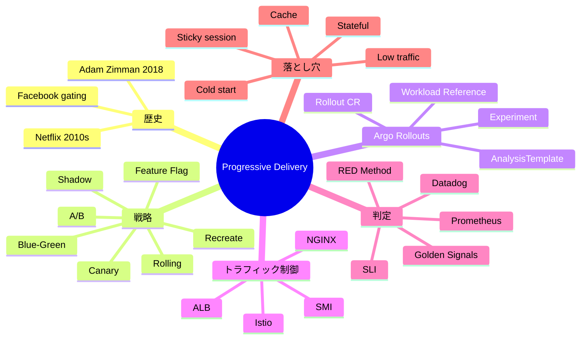
```mermaid
mindmap
  root((Progressive Delivery))
    歴史
      Netflix 2010s
      Facebook gating
      Adam Zimman 2018
    戦略
      Recreate
      Rolling
      Blue-Green
      Canary
      A/B
      Shadow
      Feature Flag
    Argo Rollouts
      Rollout CR
      AnalysisTemplate
      Experiment
      Workload Reference
    トラフィック制御
      NGINX
      Istio
      ALB
      SMI
    判定
      SLI
      RED Method
      Golden Signals
      Prometheus
      Datadog
    落とし穴
      Cold start
      Sticky session
      Low traffic
      Cache
      Stateful
```

---

## チェックポイント

ここまでで以下を **自分の言葉で** 説明できるか確認してください。

- [ ] Progressive Delivery と Continuous Deployment の違いを答えられる
- [ ] Recreate / Rolling / Blue-Green / Canary / Shadow / A/B / Feature Flag をそれぞれ図示できる
- [ ] Kubernetes 標準 Deployment の rolling update でできないこと3つを答えられる
- [ ] Argo Rollouts と Flagger の違いを技術的に説明できる
- [ ] Rollout の `strategy.canary` の主要フィールド (setWeight, pause, analysis, trafficRouting) を説明できる
- [ ] Blue-Green の `scaleDownDelaySeconds` の意義を答えられる
- [ ] NGINX Ingress 連携での「stableIngress + 自動生成 canary Ingress」の構造を説明できる
- [ ] AnalysisTemplate で書くべき SLI を3種類以上挙げられる (success rate, latency, error rate, etc)
- [ ] failureLimit / inconclusiveLimit の挙動を説明できる
- [ ] Cold start, Sticky session, Low traffic などの落とし穴を答えられる
- [ ] `kubectl argo rollouts get rollout --watch` の出力を読める
- [ ] abort / promote / undo の使い分けを答えられる
- [ ] 自分のクラスタで canary リリースが動き、Analysis 失敗時に自動 rollback されることを確認できた

---

## 章のまとめ: CI/CD と GitOps の全体像

3 ページを通じて構築したパイプライン:

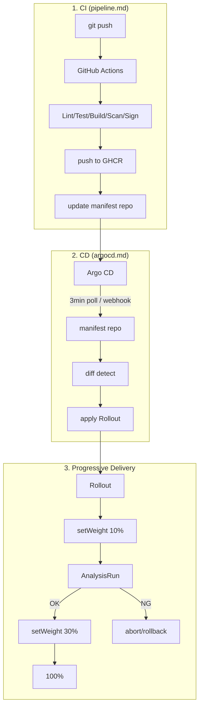
```mermaid
flowchart TB
    subgraph "1. CI (pipeline.md)"
    A1[git push] --> A2[GitHub Actions]
    A2 --> A3[Lint/Test/Build/Scan/Sign]
    A3 --> A4[push to GHCR]
    A4 --> A5[update manifest repo]
    end

    subgraph "2. CD (argocd.md)"
    B1[Argo CD] -->|3min poll / webhook| B2[manifest repo]
    B2 --> B3[diff detect]
    B3 --> B4[apply Rollout]
    end

    subgraph "3. Progressive Delivery"
    C1[Rollout] --> C2[setWeight 10%]
    C2 --> C3[AnalysisRun]
    C3 -->|OK| C4[setWeight 30%]
    C3 -->|NG| C5[abort/rollback]
    C4 --> C6[100%]
    end

    A5 --> B1
    B4 --> C1
```

完成したシステムでは:

1. `git push` するだけで本番反映が始まる
2. Git に履歴が残り、誰がいつ何を反映したかが追える
3. クラスタが消えても Git から復元できる
4. 障害は段階的トラフィックシフトで局所化される
5. メトリクス自動判定で人間判断より速く反応する

これは **個人開発でも、エンタープライズ品質のデプロイパイプライン** が手元で動く状態です。

おめでとうございます。CI/CD と GitOps の基礎は完成です。

次の章では、サービスメッシュや Observability、セキュリティといった、運用品質をさらに高めるための要素を学んでいきます。


