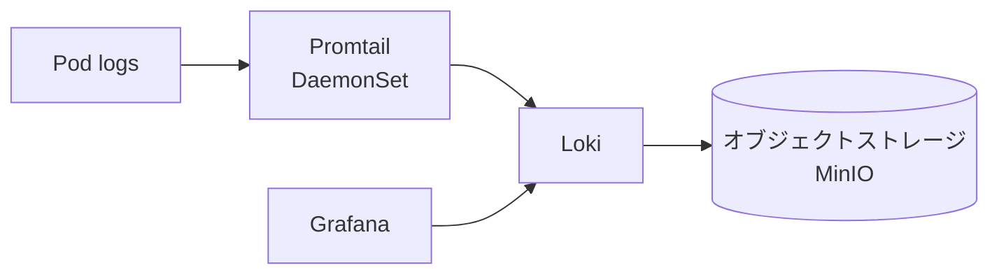

# ログ (Loki + Promtail)
{: .no_toc }

## 目次
{: .no_toc .text-delta }

1. TOC
{:toc}

---

Pod ログを集約・検索する基盤を構築します。Grafana 公式の **Loki** が、Prometheus との親和性も含めて使い勝手が良いのでこれを使います。

## Loki のアーキテクチャ



Loki は「ラベルだけインデックスし、本文はオブジェクトストレージにそのまま」という構造で、低コスト・高スケール。

## インストール

```bash
helm repo add grafana https://grafana.github.io/helm-charts

# Loki
helm install loki grafana/loki -n monitoring \
  -f values-loki.yaml

# Promtail (DaemonSet で各ノードのログを送る)
helm install promtail grafana/promtail -n monitoring \
  --set "config.clients[0].url=http://loki.monitoring.svc:3100/loki/api/v1/push"
```

`values-loki.yaml` (シングルバイナリモード、ローカル向け):

```yaml
deploymentMode: SingleBinary
loki:
  auth_enabled: false
  commonConfig:
    replication_factor: 1
  storage:
    type: filesystem
singleBinary:
  replicas: 1
  persistence:
    enabled: true
    storageClass: nfs
    size: 50Gi
read: {replicas: 0}
write: {replicas: 0}
backend: {replicas: 0}
```

本格運用なら MinIO + S3 互換ストレージ + 各 component を分離した distributed モードを検討。

## Grafana で参照

Grafana にデータソースを追加(URL: `http://loki.monitoring.svc:3100`)。
**Explore** 画面で LogQL を打てるようになります。

## LogQL

PromQL に似た構文。

```logql
{namespace="prod", app=~"todo-.*"}                  # 全ログ
{namespace="prod"} |= "ERROR"                       # 文字列含む
{namespace="prod"} != "DEBUG"                       # 文字列除外
{namespace="prod"} |~ "request_id=.*-.*"            # 正規表現
{namespace="prod"} | json | duration > 500          # JSONパースして数値比較

# メトリクス的な使い方
sum by (level) (rate({namespace="prod"} |~ ".*level=.*" [5m]))
```

## アプリ側で構造化ログ

JSON 構造化ログにすると LogQL で抽出しやすい。

```python
# api/app/log.py
import logging, sys, json, time

class JsonFormatter(logging.Formatter):
    def format(self, record):
        return json.dumps({
            "ts": time.time(),
            "level": record.levelname,
            "logger": record.name,
            "msg": record.getMessage(),
            "request_id": getattr(record, "request_id", None),
        })

handler = logging.StreamHandler(sys.stdout)
handler.setFormatter(JsonFormatter())
logging.basicConfig(level=logging.INFO, handlers=[handler])
```

Promtail の pipeline で JSON 解析を入れれば、フィールドが Loki のラベルにできます。

```yaml
- job_name: kubernetes-pods
  pipeline_stages:
  - json:
      expressions:
        level: level
        request_id: request_id
  - labels:
      level: level
```

{: .warning }
**ラベルを増やしすぎると Loki の性能が劣化します**(ラベル組み合わせの数=ストリーム数)。
変動が激しい値(request_id など)はラベルにしないこと。

## 監査ログ・kube-apiserver ログ

クラスタ自体のログも忘れずに:

- kube-apiserver の audit log は etcd 直近の操作履歴として重要
- ノードの journald は kubelet/containerd 起動失敗の調査に必要

これらも Promtail で `/var/log` を読ませて取り込めます。

## チェックポイント

- [ ] Loki のラベル設計の落とし穴
- [ ] アプリログを JSON 化する利点
- [ ] kube-apiserver の audit log を集約する意義
