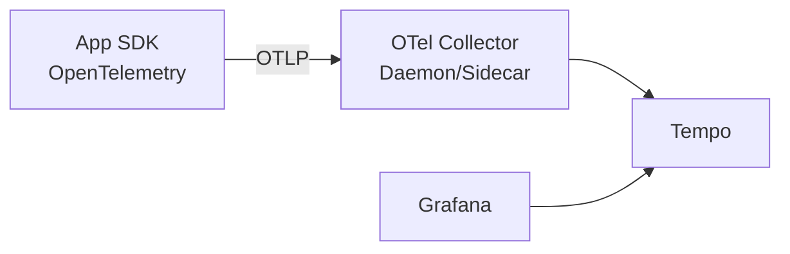

# トレース (OpenTelemetry + Tempo)
{: .no_toc }

## 目次
{: .no_toc .text-delta }

1. TOC
{:toc}

---

複数サービスにまたがる1リクエストを **エンド・トゥ・エンドで追跡** するのが分散トレーシングです。
業界標準は **OpenTelemetry (OTel)**、バックエンドは Grafana 公式の **Tempo** や Jaeger。本教材では Tempo を使います。

## なぜ必要か

サンプルアプリ: Browser → Ingress → Frontend → API → DB/Redis という多段構成で、
「全体で2秒かかる、どこが遅いのか?」を秒で答えられるのがトレース。

## アーキテクチャ



## インストール

```bash
# OpenTelemetry Operator (Sidecar/Inject機能)
helm install opentelemetry-operator open-telemetry/opentelemetry-operator -n monitoring

# OTel Collector (DaemonSet)
helm install otel-collector open-telemetry/opentelemetry-collector -n monitoring \
  -f values-otel.yaml

# Tempo
helm install tempo grafana/tempo -n monitoring \
  -f values-tempo.yaml
```

## アプリ側の計装

Python (FastAPI) なら `opentelemetry-instrument` で半自動計装ができます。

```bash
pip install opentelemetry-distro \
            opentelemetry-instrumentation-fastapi \
            opentelemetry-instrumentation-sqlalchemy \
            opentelemetry-instrumentation-redis \
            opentelemetry-exporter-otlp
```

```dockerfile
CMD opentelemetry-instrument \
    --traces_exporter otlp \
    --metrics_exporter otlp \
    --service_name todo-api \
    uvicorn app.main:app --host 0.0.0.0 --port 8000
```

```yaml
env:
- name: OTEL_EXPORTER_OTLP_ENDPOINT
  value: "http://otel-collector.monitoring.svc:4317"
- name: OTEL_RESOURCE_ATTRIBUTES
  value: "service.namespace=prod,deployment.environment=prod"
```

## サンプリング

全リクエストをトレースするとコスト・容量がきついので、サンプリング戦略を選びます。

| 戦略 | 内容 |
|------|------|
| Head-based | リクエスト先頭で確率的に採取 |
| Tail-based | 全部採取して終了時に判断 (エラーや高レイテンシのみ保持) |

OTel Collector の `tail_sampling` プロセッサを使うと、エラーや遅いリクエストだけ保持できます。

```yaml
processors:
  tail_sampling:
    decision_wait: 10s
    policies:
    - name: errors
      type: status_code
      status_code: {status_codes: [ERROR]}
    - name: slow
      type: latency
      latency: {threshold_ms: 1000}
    - name: probabilistic
      type: probabilistic
      probabilistic: {sampling_percentage: 5}
```

## Grafana から確認

Grafana にデータソース Tempo を追加。
Loki から Span に飛ぶ、Span から Loki に飛ぶといった双方向リンクが標準でできます。
**Trace ID をログに埋めておく** ことで連携が成立します。

```python
from opentelemetry import trace

@app.get("/api/todos")
async def list_todos():
    span = trace.get_current_span()
    trace_id = format(span.get_span_context().trace_id, "032x")
    logger.info("list_todos", extra={"trace_id": trace_id})
```

## チェックポイント

- [ ] メトリクス・ログ・トレースの役割の違い
- [ ] Tail-based sampling のメリット
- [ ] Trace ID をログに埋める意義
