# イメージセキュリティ
{: .no_toc }

## 目次
{: .no_toc .text-delta }

1. TOC
{:toc}

---

## このページのゴール

このページを読み終えると、以下を **自分の言葉で説明できる** ようになります。

- コンテナイメージの内部構造(OCI Image Spec / レイヤ / マニフェスト / Index)を上から下まで説明できる
- レジストリの API(`/v2/`)とイメージ pull のシーケンス、`imagePullPolicy` の挙動差を理解する
- なぜ「脆弱性スキャン・署名・SBOM・許可ポリシー」の **4つを揃える** 必要があるのか歴史から説明できる
- Trivy・Grype・Snyk・Clair の役割と棲み分けを判断できる
- Sigstore(cosign / Fulcio / Rekor / TUF)の **keyless 署名** がなぜ画期的かを語れる
- SLSA フレームワークの 4 つの level と、SLSA 3 を達成するための要素を列挙できる
- Kyverno でレジストリ・タグ・署名・脆弱性レベルを Admission で強制できる
- サンプル TODO アプリを Distroless + 署名 + SBOM + Trivy スキャン CI/CD に乗せる手順を再現できる

---

## イメージは攻撃の侵入経路 No.1

クラスタの守りを語るとき、しばしば「RBAC」「PSS」「NetworkPolicy」が話題になります。しかし侵入の事例を統計的に見ると、**最も多いのはイメージ経由** です。
理由は単純で、開発者が `FROM ubuntu:22.04` と書いたその瞬間に、自分が一行も書いていない数千のパッケージがクラスタに持ち込まれているからです。

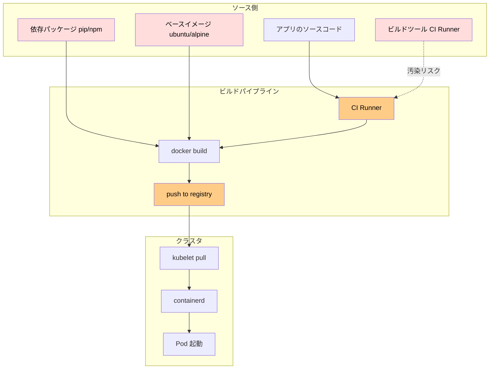

赤いのが「他人が書いたコード」、橙が「途中で改ざんされ得るポイント」です。
本ページの 4 つの柱は、それぞれこの図の異なる場所を守ります。

| 柱 | 守る場所 | 主な道具 |
|----|----------|----------|
| 脆弱性スキャン | 既知 CVE の検出 | Trivy / Grype / Snyk / Clair |
| 署名と検証 | 改ざん検知・出所証明 | Sigstore(cosign)+ Kyverno |
| SBOM(Software Bill of Materials)| 中身の可視化 | Syft / SPDX / CycloneDX |
| Admission ポリシー | クラスタへの入口 | Kyverno / OPA Gatekeeper / Kubewarden |

---

## 背景: サプライチェーン攻撃の歴史

ソフトウェアサプライチェーン攻撃の事例は、年を追うごとに洗練されています。
「自分のコードは安全」「公式イメージなら大丈夫」という素朴な前提が、なぜ崩されたのかを知ることで、本ページの対策の意味が腑に落ちます。

### 2017年: NotPetya(M.E.Doc 更新サーバ侵害)

ウクライナの会計ソフト M.E.Doc の **アップデート配信サーバ** がハッキングされ、正規の更新として悪意あるバイナリが配布されました。Maersk・FedEx・Merck などが被害。被害総額 100 億ドル超。
教訓: **公式アップデートでも安全とは限らない**。署名検証と来歴(provenance)が必須。

### 2020年: SolarWinds Orion(Sunburst)

SolarWinds 社のビルドサーバに侵入し、**ビルドプロセスの途中** で改ざんされた DLL を含むバイナリが正規署名付きで配布されました。米連邦政府機関を含む 18,000 組織が影響。
教訓: **ビルドプロセスそのものを攻撃対象にできる**。SLSA フレームワークが生まれた直接の動機。

### 2021年: Codecov bash uploader

CI でカバレッジ送信用に使われる Codecov の bash uploader が改ざんされ、CI 内の環境変数を全部外部に送信されていました。検知まで数ヶ月。
教訓: **CI 内で `curl | bash` する慣習は危ない**。CI 内のシークレットも漏れる前提で組む。

### 2021年: Dependency Confusion(Birsan)

社内パッケージと同名のパブリックパッケージを npm/PyPI に登録し、バージョンを高くしておくと、内部ビルドが社外パッケージを引いてくる手法。Apple/Microsoft/PayPal などを攻略。
教訓: **パブリックレジストリのデフォルト解決は危険**。社内 registry に向ける/scoped packages を使う。

### 2021年12月: Log4Shell(CVE-2021-44228)

Java の log4j に **ログメッセージから JNDI を引いて任意コード実行** される脆弱性。Minecraft サーバから Tesla の社用システムまで影響。CVSS 10.0。
教訓: **依存の依存(推移的依存)を全部把握していないと刺さる**。SBOM が業界標準になる契機。

### 2022年: PyTorch torchtriton(typosquatting)

PyPI に "torchtriton" という似た名前の悪意あるパッケージが登録され、PyTorch 開発版ユーザに被害。CI と SSH キーを抜かれた。
教訓: **依存パッケージの名前も検証対象**。SBOM と allowlist が必要。

### 2023年: 3CX Desktop App

通話アプリ 3CX のビルドが侵害され、Windows/macOS 両方のクライアントに悪意ある DLL が混入。北朝鮮グループ。
教訓: **マルチプラットフォームのビルドが侵害されると影響が連鎖する**。

### 2024年: XZ Utils バックドア(CVE-2024-3094)

Linux ディストリの大半が依存する圧縮ライブラリ xz に、**2年かけてメンテナの信頼を得た攻撃者** がバックドアを埋め込んだ事件。SSH 認証を迂回可能。Debian テスト版から発見、間一髪。
教訓: **OSS の人的サプライチェーン** も攻撃対象。コードレビュー文化と冗長性が肝。

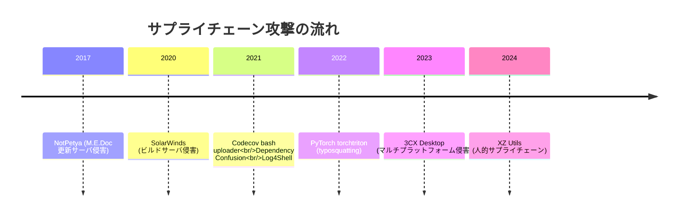

これらの教訓を体系化したのが、本章で扱う **「スキャン・署名・SBOM・Admission」** の 4 本柱と、**SLSA** という業界共通フレームワークです。

---

## コンテナイメージとは何か(OCI Image Spec)

まず「コンテナイメージ」の正体を理解しないと、署名や SBOM の話が霞みます。

### 歴史: Docker から OCI へ

- 2013: Docker が登場。独自のイメージフォーマット(Docker Image Manifest V1)。
- 2015年6月: Docker 社・CoreOS・Google・Red Hat などが **Open Container Initiative(OCI)** を設立。
- 2016: OCI Image Format Specification v1.0 草案。Docker のフォーマット v2 schema 2 をベースに策定。
- 2017年7月: OCI Image Spec v1.0 リリース。Docker イメージは事実上 OCI イメージとなる。
- 2021: OCI Distribution Spec v1.0 リリース(レジストリ API の標準)。
- 2022: OCI Artifact 概念導入。「コンテナ以外のもの(Helm chart, SBOM, signature)」も同じレジストリで配布可能に。

仕様:
- Image Spec: <https://github.com/opencontainers/image-spec>
- Distribution Spec: <https://github.com/opencontainers/distribution-spec>
- Runtime Spec: <https://github.com/opencontainers/runtime-spec>

### イメージの構造

OCI Image は実体としては **以下4種類のファイル群** です。

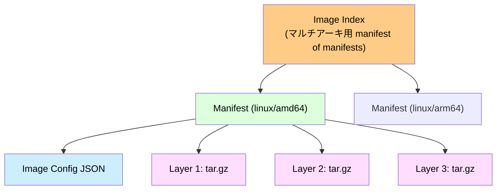

具体例を見るのが一番です。

```bash
# manifest を取得 (curl で直接 registry に問い合わせ)
curl -s -H "Accept: application/vnd.oci.image.manifest.v1+json" \
  http://192.168.56.10:5000/v2/todo-api/manifests/0.1.0 | jq
```

期待される出力:

```json
{
  "schemaVersion": 2,
  "mediaType": "application/vnd.oci.image.manifest.v1+json",
  "config": {
    "mediaType": "application/vnd.oci.image.config.v1+json",
    "digest": "sha256:0e9c0f...config の SHA256",
    "size": 1467
  },
  "layers": [
    {
      "mediaType": "application/vnd.oci.image.layer.v1.tar+gzip",
      "digest": "sha256:5f5c1d...",
      "size": 28567432
    },
    {
      "mediaType": "application/vnd.oci.image.layer.v1.tar+gzip",
      "digest": "sha256:a37ab2...",
      "size": 4128
    }
  ]
}
```

### Image Config を見る

```bash
# config blob を取得 (digest を上の出力からコピペ)
curl -s http://192.168.56.10:5000/v2/todo-api/blobs/sha256:0e9c0f... | jq
```

```json
{
  "architecture": "amd64",
  "os": "linux",
  "config": {
    "Env": ["PATH=/usr/local/sbin:/usr/local/bin:..."],
    "Entrypoint": ["python", "-m", "app.main"],
    "User": "1000",
    "WorkingDir": "/app"
  },
  "history": [
    {"created": "2024-04-01T...", "created_by": "FROM python:3.12-slim"},
    {"created": "2024-04-01T...", "created_by": "COPY pyproject.toml ./"},
    ...
  ],
  "rootfs": {
    "type": "layers",
    "diff_ids": ["sha256:...", "sha256:..."]
  }
}
```

### Digest と Tag

| 概念 | 例 | 性質 |
|------|-----|------|
| Tag | `0.1.0`, `latest`, `dev` | **可変**。同じタグが別物を指すことがある |
| Digest | `sha256:5f5c1d...` | **不変**。中身が 1 bit でも変われば変わる |

本番で守るべき大原則は: **Pod の image は digest 固定で参照する**。

```yaml
# 悪い (mutable)
image: 192.168.56.10:5000/todo-api:0.1.0
# 良い (immutable)
image: 192.168.56.10:5000/todo-api@sha256:5f5c1d...
```

これは Argo CD などの GitOps ツールでよく行われます。

{: .note }
> Docker Image v1(層が JSON で記述、parent chain あり)と OCI v1(層がフラット、 diff_ids で順序を保持)は異なります。古いツールや古いレジストリで `manifest unknown` が出る場合、media type を `application/vnd.docker.distribution.manifest.v2+json` に変えると通ることがあります。

### OCI Artifact: イメージ以外もレジストリに置く

OCI Artifact 仕様により、レジストリは **イメージ以外** も置けます。

- Helm Chart(`oras push` で `oci://...` に保存)
- Cosign 署名(`<image>:sha256-xxx.sig` で並列に存在)
- SBOM 添付物(`<image>:sha256-xxx.sbom`)
- WASM モジュール(Kubewarden)
- 任意のファイル(`oras` CLI)

レジストリは単なる「コンテナ置き場」から **アーティファクト置き場** に進化しました。

---

## レジストリの仕組み(OCI Distribution Spec)

`192.168.56.10:5000` で動いている docker registry は、OCI Distribution Spec を実装した HTTP API サーバです。
主要エンドポイント:

| メソッド | パス | 用途 |
|----------|------|------|
| GET | `/v2/` | API 存在確認(空 JSON が返れば OK) |
| GET | `/v2/_catalog` | レポジトリ一覧(認証/設定次第) |
| GET | `/v2/<name>/tags/list` | タグ一覧 |
| GET | `/v2/<name>/manifests/<reference>` | manifest 取得(reference は tag or digest) |
| PUT | `/v2/<name>/manifests/<reference>` | manifest push |
| GET | `/v2/<name>/blobs/<digest>` | blob(layer/config)取得 |
| POST | `/v2/<name>/blobs/uploads/` | blob アップロード開始(チャンク式) |
| HEAD | `/v2/<name>/blobs/<digest>` | blob 存在確認(重複アップロード防止) |

### pull のシーケンス

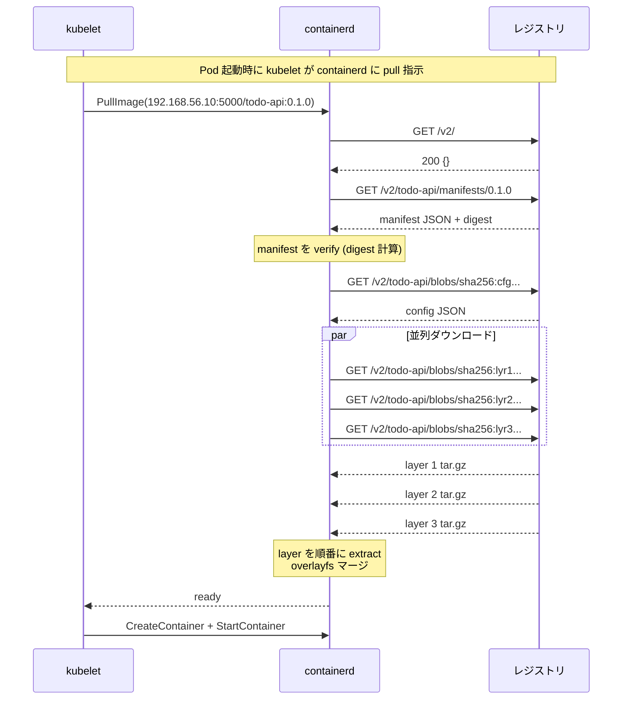

ポイント:

- containerd は **manifest と blob を別途取得** する。1 イメージ = 1 ファイルではない
- **digest 検証** を毎回行う(中身が manifest と一致しない blob は弾く)
- レイヤは **content addressable** なので、複数イメージで同じ digest のレイヤは 1 回しか pull しない
- /var/lib/containerd の中で snapshot として残る

### ノード上での確認

```bash
# k8s-w1 で
sudo crictl images
# IMAGE                                  TAG     IMAGE ID      SIZE
# 192.168.56.10:5000/todo-api            0.1.0   abc123...     45MB

# 詳細
sudo crictl inspecti abc123
```

`crictl` は CRI 経由で containerd を叩く CLI。`docker` のような感覚で使えますが、Kubernetes 標準は `crictl` です。

---

## imagePullPolicy: 「いつ pull するか」

Pod 定義の `imagePullPolicy` が pull 動作を決めます。

| 値 | 動作 |
|-----|------|
| `Always` | Pod 起動のたびにレジストリへ digest を問い合わせ、変わっていれば pull |
| `IfNotPresent` | ノードに同じタグが既にあれば pull しない |
| `Never` | 絶対に pull しない(事前ロード済みのみ動く) |

デフォルトは:

- `image: foo:latest` または タグ省略 → `Always`
- それ以外(`image: foo:1.2.3`)→ `IfNotPresent`

```yaml
spec:
  containers:
  - name: api
    image: 192.168.56.10:5000/todo-api:0.1.0
    imagePullPolicy: IfNotPresent
```

### 落とし穴: タグの再 push

`todo-api:0.1.0` を同じタグで複数回 push し直すと、ノードごとに古い・新しいが混在します。
これを **タグの mutable 問題** といい、本番ではバージョンタグ + digest 固定で防ぎます。

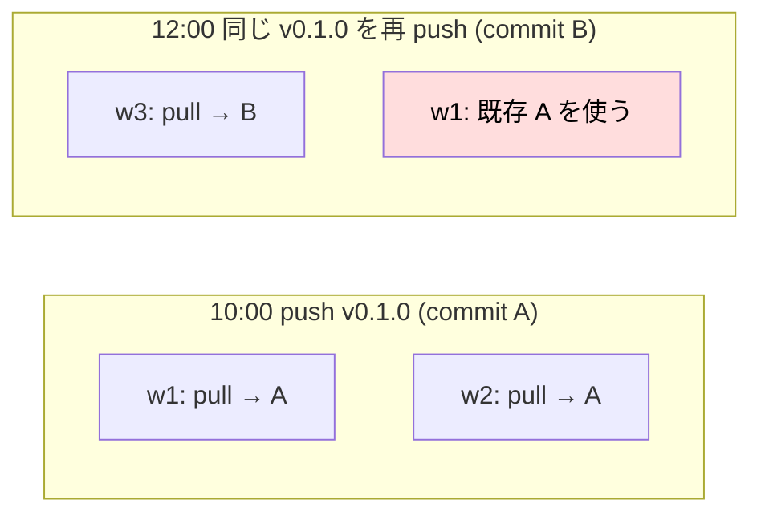

w1 だけ古いままで動き続ける、再現性ゼロのバグの元になります。
**タグは immutable に運用**(0.1.0 を二度 push しない)するのが基本ですが、社内で徹底できない場合は `image: foo@sha256:...` に切り替えるのが安全策。

### `Always` が必要な場面

CI から `:dev` のような可変タグで配るときは `Always` を強制する。

```yaml
imagePullPolicy: Always
```

ただし、レジストリが落ちると Pod 起動も失敗するため、**本番では digest 参照のほうが堅牢**。

---

## プライベートレジストリ認証

192.168.56.10:5000 を **TLS なし(HTTP)** で運用しているので、containerd の設定が必要です。本教材 7 章で済ませている前提で、ここでは復習と認証パターンを追加します。

### containerd の HTTP レジストリ許可

`/etc/containerd/config.toml`:

```toml
[plugins."io.containerd.grpc.v1.cri".registry]
  config_path = "/etc/containerd/certs.d"
```

`/etc/containerd/certs.d/192.168.56.10:5000/hosts.toml`:

```toml
server = "http://192.168.56.10:5000"

[host."http://192.168.56.10:5000"]
  capabilities = ["pull", "resolve", "push"]
  skip_verify = true
```

これで `crictl pull 192.168.56.10:5000/...` が通る。

### 認証付きレジストリ(imagePullSecrets)

社外の Harbor や GitHub Container Registry を使う場合は Secret 経由で認証情報を渡す。

```bash
kubectl create secret docker-registry ghcr-cred \
  --docker-server=ghcr.io \
  --docker-username=<USER> \
  --docker-password=<PAT> \
  --docker-email=<USER>@example.com \
  -n prod
```

```yaml
spec:
  imagePullSecrets:
  - name: ghcr-cred
  containers:
  - image: ghcr.io/foo/bar:1.0
```

### Secret を ServiceAccount に付ける

毎回書くのが面倒なら、SA に登録すると Pod 側の指定不要。

```yaml
apiVersion: v1
kind: ServiceAccount
metadata:
  name: default
  namespace: prod
imagePullSecrets:
- name: ghcr-cred
```

これで Namespace 内の Pod は自動的に `ghcr-cred` を使う。

### projected pull credentials(将来)

KEP-4412 で「短命トークンで pull できる仕組み」も議論中。クラウド環境では既に IRSA 経由で実現済み。

---

## 脆弱性スキャン

「中に何が入っているか」を知る最も基本的な技術。CVE データベースとイメージのパッケージリストを突き合わせる。

### CVE と CVSS の歴史

- **CVE(Common Vulnerabilities and Exposures)**: MITRE が 1999 年に開始。脆弱性に一意な ID(CVE-2021-44228 等)を振る。
- **NVD(National Vulnerability Database)**: NIST が運営。CVE に詳細メタデータ付与。
- **CVSS(Common Vulnerability Scoring System)**: v2(2007)→ v3.0(2015)→ v3.1(2019)→ v4.0(2023)。スコア 0.0〜10.0。
- **GHSA(GitHub Security Advisories)**: GitHub 独自の ID。エコシステム別の advisory。NVD より迅速。
- **OSV(Open Source Vulnerabilities)**: Google が 2021 開始。エコシステム横断、機械可読、URL 一発でクエリ可能。
- **EPSS(Exploit Prediction Scoring System)**: 「実際に悪用される確率」スコア。CVSS とは別軸。

```mermaid
flowchart LR
    subgraph 発見["脆弱性が発見される"]
        D1[研究者/ベンダ]
    end
    subgraph 報告["報告"]
        D2[CNA に報告]
    end
    subgraph 採番["採番"]
        D3[MITRE が CVE 採番]
        D4[NVD に詳細追加]
    end
    subgraph 配信["配信"]
        D5[OSV / GHSA]
        D6[Distro 各社 (Debian, Alpine)]
    end
    subgraph 検出["スキャナが取得"]
        D7[Trivy DB 更新]
    end
    D1-->D2-->D3-->D4-->D5-->D7
    D4-->D6-->D7

    style D7 fill:#dfd,color:#000
```

### Trivy(本書のメイン)

Aqua Security が開発する OSS スキャナ。デファクト。

特徴:

- イメージ・ファイルシステム・Git リポジトリ・k8s クラスタすべてスキャン可能
- 言語別のロックファイル(`requirements.txt`, `package-lock.json`)も読む
- ライセンスチェック、IaC スキャン、Secret スキャンも可
- Trivy Operator(クラスタ内常駐)で継続スキャン

```bash
# インストール
sudo apt install -y wget gpg
wget -qO - https://aquasecurity.github.io/trivy-repo/deb/public.key | sudo gpg --dearmor -o /usr/share/keyrings/trivy.gpg
echo "deb [signed-by=/usr/share/keyrings/trivy.gpg] https://aquasecurity.github.io/trivy-repo/deb generic main" | sudo tee /etc/apt/sources.list.d/trivy.list
sudo apt update && sudo apt install -y trivy
```

#### 基本コマンド

```bash
trivy image 192.168.56.10:5000/todo-api:0.1.0
```

期待される出力:

```
192.168.56.10:5000/todo-api:0.1.0 (debian 12.5)
==============================================
Total: 47 (HIGH: 8, CRITICAL: 2)

┌─────────────────┬────────────────┬──────────┬─────────────────┬───────────────┐
│     Library     │ Vulnerability  │ Severity │ Installed Ver.  │   Fixed Ver.  │
├─────────────────┼────────────────┼──────────┼─────────────────┼───────────────┤
│ libssl3         │ CVE-2024-XXXX  │ CRITICAL │ 3.0.11          │ 3.0.13        │
│ zlib1g          │ CVE-2024-YYYY  │ HIGH     │ 1.2.13.dfsg-1   │ 1.2.13.dfsg-3 │
...

Python (python-pkg)
===================
Total: 5 (HIGH: 1)
┌──────────┬────────────────┬──────────┬───────────────┬─────────────┐
│ pyyaml   │ CVE-2020-14343 │ HIGH     │ 5.3.1         │ 5.4         │
└──────────┴────────────────┴──────────┴───────────────┴─────────────┘
```

#### フラグの説明

```bash
trivy image \
  --severity CRITICAL,HIGH \
  --exit-code 1 \
  --ignore-unfixed \
  --format sarif \
  --output trivy.sarif \
  --vuln-type os,library \
  --scanners vuln,secret,misconfig,license \
  192.168.56.10:5000/todo-api:0.1.0
```

各フラグの意味:

| フラグ | 意味 | いつ使う |
|--------|------|---------|
| `--severity` | 検出する重大度を絞る | CI ゲートでは CRITICAL,HIGH のみ |
| `--exit-code 1` | 検出時に終了コード 1 | CI を失敗させる |
| `--ignore-unfixed` | パッチがまだ無い CVE を除外 | False positive 削減 |
| `--format` | json / table / sarif / cyclonedx / spdx | SARIF は GitHub Code Scanning と直結 |
| `--output` | 出力ファイル | CI のアーティファクト保存 |
| `--vuln-type` | os / library / 両方 | デフォルトは両方 |
| `--scanners` | vuln/secret/misconfig/license/sbom | 用途別に分けたいとき |
| `--skip-files` | 特定ファイルを除外 | 既知 false positive |
| `--cache-dir` | DB キャッシュ | CI で共有して高速化 |
| `--no-progress` | 進捗バーを抑制 | CI ログがきれいに |

#### .trivyignore で CVE をスキップ

「対応できない CVE」を明示的に許容するメカニズム:

```
# .trivyignore
CVE-2023-XXXX  # base image の glibc。upstream で未修正
CVE-2024-YYYY exp:2025-01-01  # 期限付き許可
```

`exp:` は trivy 0.45 以降で expiration date 指定可能。「許可しっぱなし」を防ぐ仕組み。

#### ローカル DB の話

trivy は GitHub からスキャン DB を pull します(数百 MB)。

```bash
trivy --cache-dir ./trivy-cache image --download-db-only
```

オフライン環境では `--db-repository` で社内ミラーを指定。CI で毎回 GitHub に取りに行くと rate limit に当たるので、共有キャッシュ必須。

### Trivy Operator(クラスタ常駐スキャン)

CI でスキャンするだけでは「**動いている Pod が脆弱かどうか**」分からない。Trivy Operator は **クラスタ内** で定期スキャンし、CRD で結果を保存する。

```bash
helm repo add aqua https://aquasecurity.github.io/helm-charts/
helm repo update
helm install trivy-operator aqua/trivy-operator \
  --namespace trivy-system \
  --create-namespace \
  --set trivy.severity=CRITICAL,HIGH \
  --set operator.scanJobTimeout=5m
```

作られる CRD:

| CRD | 内容 |
|------|------|
| `VulnerabilityReport` | コンテナごとの CVE リスト |
| `ConfigAuditReport` | YAML の misconfiguration(privileged 等) |
| `ExposedSecretReport` | イメージ内に埋まった鍵・トークン |
| `RbacAssessmentReport` | RBAC 過剰権限の指摘 |
| `ClusterComplianceReport` | NSA-CISA / CIS benchmark スコア |
| `SbomReport` | コンテナの SBOM |

```bash
kubectl get vulnerabilityreports -A
# NAMESPACE   NAME                                  REPOSITORY                            TAG    SCANNER   AGE   CRITICAL HIGH MEDIUM LOW
# prod        replicaset-todo-api-7d8b9-todo-api    192.168.56.10:5000/todo-api           0.1.0  Trivy     1h    2        8    15     20

kubectl describe vulnerabilityreport replicaset-todo-api-7d8b9-todo-api -n prod
```

Prometheus メトリクスも吐くので、Grafana で「クラスタ全体の CRITICAL 数」を可視化できる。

### Trivy の代替(知っておくべき4つ)

| ツール | ベンダ | 特徴 | いつ選ぶ |
|--------|-------|------|---------|
| **Grype** | Anchore(OSS) | Syft と組合せて高速 | Syft で SBOM 生成、Grype でスキャンの分業 |
| **Snyk** | Snyk(商用) | コード + 依存 + IaC 統合、開発者体験◎ | CI に深く統合したい商用環境 |
| **Clair** | Quay/CoreOS(OSS) | API ファースト、Quay レジストリと統合 | Red Hat エコシステム / Quay 利用 |
| **Docker Scout** | Docker(SaaS) | Docker Desktop に統合 | 開発者ローカル |
| **Anchore Enterprise** | Anchore(商用) | ポリシー駆動、コンプライアンス | 大企業 / FedRAMP |

スキャナ間で **結果が違うことがある** のが現実。なぜなら:

- DB ソースが違う(Trivy = aquasecurity/vuln-list、Grype = anchore/grype-db、Snyk = 独自 DB)
- マッチング方式が違う(distro-aware か否か)
- false positive の除外ロジックが違う

「複数スキャナを並走させて or 比較する」のが大企業の運用。学習段階では Trivy 一本で十分。

---

## CVE 管理運用

スキャンは検出するだけで何も解決しません。**運用が肝**。

### トリアージのフロー

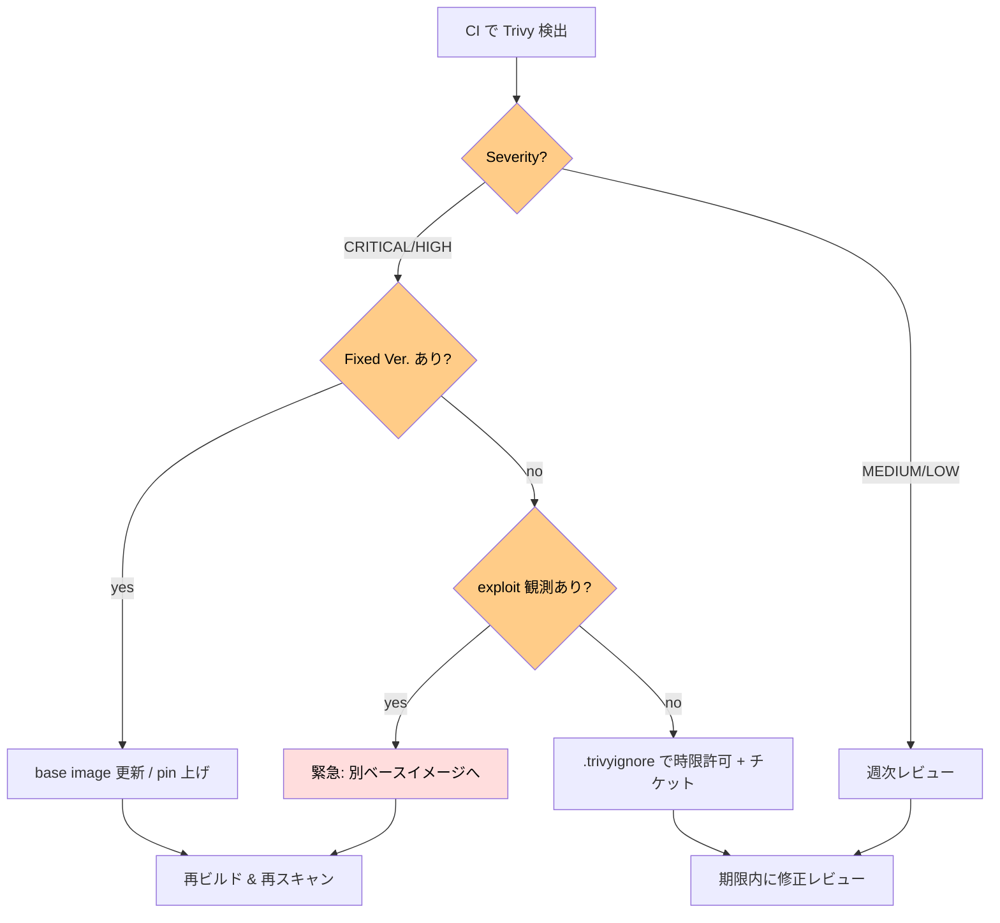

### 「Fixed Ver. なし」をどう扱うか

ベースイメージの選択を変える、または ignore + 監視。決して**「無視」ではなく「許容」**として明文化する。
プルリクで `.trivyignore` を編集するときに必ず:

- CVE ID
- 影響範囲(コンポーネント、攻撃ベクトル)
- 緩和策(NetworkPolicy で外部到達なし、等)
- 再評価日

を書く。

### base image を集約する

各リポジトリで FROM をバラバラに書くと、CVE の数も対応も増える。
組織として「golden base image」を 3-4 種類に絞り、社内レジストリで配るのが定石。

例:

| 用途 | golden base |
|------|------------|
| Python 系 | `192.168.56.10:5000/base/python-distroless:3.12` |
| Go 系 | `192.168.56.10:5000/base/go-distroless:1.22` |
| Java 系 | `192.168.56.10:5000/base/java-distroless:21` |
| Static binary | `192.168.56.10:5000/base/static:latest` |

base image 側で CVE が直れば、ぶら下がる全アプリが恩恵を受ける(再ビルドが必要)。

### Renovate / Dependabot で自動更新

依存ライブラリと base image を **PR で自動更新** する。

```json
// renovate.json
{
  "extends": ["config:base"],
  "kubernetes": {
    "fileMatch": ["k8s/.+\\.yaml$"]
  },
  "regexManagers": [
    {
      "fileMatch": ["Dockerfile$"],
      "matchStrings": ["FROM (?<depName>.+?):(?<currentValue>.+?)\\s"],
      "datasourceTemplate": "docker"
    }
  ]
}
```

---

## 署名と検証: Sigstore

CVE と並ぶもう一つの柱が「**これは本当に自社が作ったイメージか**」の証明。

### 歴史: Notary v1 から Sigstore へ

| 時期 | 仕組み | 問題点 |
|------|--------|-------|
| 2015 | Docker Content Trust(Notary v1) | TUF ベース。設定が複雑、鍵管理が大変 |
| 2018 | Cosign 前夜(各社が独自署名) | エコシステム分裂 |
| 2021 | Sigstore プロジェクト発足(Linux Foundation 配下) | OSS 横断で標準化 |
| 2022 | Sigstore 1.0 GA | keyless 署名が業界標準に |
| 2023 | Sigstore が CNCF Incubating |

### Sigstore の構成要素

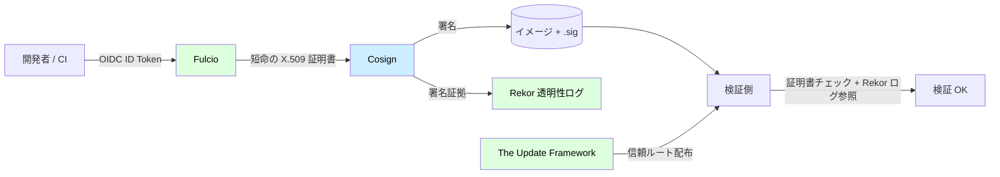

| 要素 | 役割 |
|------|------|
| **cosign** | CLI。署名と検証を行う |
| **Fulcio** | OIDC ID トークンを元に **短命(15分)の X.509 証明書** を発行する CA |
| **Rekor** | 改ざん不可能な **透明性ログ**。誰がいつ何に署名したかを公開記録 |
| **TUF** | 信頼ルート(Fulcio/Rekor の公開鍵)の安全な配布 |

### keyless 署名のすごさ

従来の署名: 開発者ローカルに秘密鍵を保持 → **鍵管理が地獄**。
Sigstore keyless: 鍵を持たない。代わりに **OIDC ID** で本人性を証明し、短命証明書で署名 → **使い捨て**。

具体的なフロー:

1. GitHub Actions が `id-token: write` 権限で OIDC ID トークンを取得
2. cosign が Fulcio に送信
3. Fulcio が「これは確かに `repo/.github/workflows/release.yaml` の Action である」と検証
4. 該当 ID を含む X.509 証明書を発行(15 分有効)
5. cosign がその証明書でイメージに署名
6. 署名と証明書を Rekor(透明性ログ)に登録
7. 検証側は **「特定の GitHub workflow から発行された署名か」** をチェックできる

これにより:

- 開発者は鍵を一切管理しない
- 「どの workflow からビルドされたか」がイメージ自体に紐づく
- 過去の署名はすべて公開ログに残り、隠せない

### 実際にやる: GitHub Actions で署名

```yaml
# .github/workflows/release.yaml
name: release
on:
  push:
    tags: ['v*']
permissions:
  id-token: write   # OIDC のために必須
  packages: write
  contents: read

jobs:
  build:
    runs-on: ubuntu-latest
    steps:
    - uses: actions/checkout@v4
    - uses: docker/setup-buildx-action@v3
    - uses: docker/login-action@v3
      with:
        registry: ghcr.io
        username: ${{ github.actor }}
        password: ${{ secrets.GITHUB_TOKEN }}
    - uses: docker/build-push-action@v5
      id: build
      with:
        push: true
        tags: ghcr.io/<USER>/todo-api:${{ github.ref_name }}
    - uses: sigstore/cosign-installer@v3
    - name: Sign image
      env:
        IMG: ghcr.io/<USER>/todo-api@${{ steps.build.outputs.digest }}
      run: cosign sign --yes "$IMG"
```

ローカルから keyless 署名する場合:

```bash
cosign sign --yes 192.168.56.10:5000/todo-api@sha256:abcd...
# ブラウザが開いて OIDC ログインを要求される
```

### 検証

```bash
cosign verify \
  --certificate-identity-regexp 'https://github.com/<USER>/todo-app/.github/workflows/.*' \
  --certificate-oidc-issuer 'https://token.actions.githubusercontent.com' \
  ghcr.io/<USER>/todo-api:0.1.0
```

期待される出力:

```
Verification for ghcr.io/<USER>/todo-api:0.1.0 --
The following checks were performed on each of these signatures:
  - The cosign claims were validated
  - Existence of the claims in the transparency log was verified offline
  - The code-signing certificate was verified using trusted certificate authority certificates
[{"critical":{"identity":{"docker-reference":"ghcr.io/<USER>/todo-api"}, ...
```

### Kyverno で Admission に署名検証を強制

Kyverno は **Pod 起動時に署名を検証** できる。

```yaml
apiVersion: kyverno.io/v1
kind: ClusterPolicy
metadata:
  name: verify-todo-images
spec:
  validationFailureAction: Enforce
  webhookTimeoutSeconds: 30
  background: false
  rules:
  - name: verify-cosign-signature
    match:
      any:
      - resources:
          kinds: [Pod]
          namespaces: [prod]
    verifyImages:
    - imageReferences:
      - "192.168.56.10:5000/todo-*"
      attestors:
      - count: 1
        entries:
        - keyless:
            subject: "https://github.com/<USER>/todo-app/.github/workflows/release.yaml@refs/heads/main"
            issuer: "https://token.actions.githubusercontent.com"
            rekor:
              url: https://rekor.sigstore.dev
      mutateDigest: true   # tag を digest に書き換える(immutable 保証)
      verifyDigest: true
      required: true
```

これだけで:

- 署名がないイメージは Pod 作成が拒否される
- 想定外の workflow から署名されたイメージも拒否
- 自動で digest に書き換えられる(mutable tag 問題の解消)

実演:

```bash
# 署名なしのイメージで Pod を作ろうとする
kubectl run nginx --image=nginx:latest
# Error from server: admission webhook "mutate.kyverno.svc" denied the request:
# rule verify-cosign-signature failed: image verification failed:
# no matching signatures found
```

### キー付き署名(オンプレで OIDC IdP がない場合)

教材環境のように OIDC IdP がない場合、従来型の鍵ペア署名を使う。

```bash
# 鍵生成 (パスフレーズ必須)
cosign generate-key-pair
# cosign.key (秘密) / cosign.pub (公開) ができる

# 署名
cosign sign --key cosign.key 192.168.56.10:5000/todo-api@sha256:abcd...

# 検証
cosign verify --key cosign.pub 192.168.56.10:5000/todo-api:0.1.0
```

鍵管理が必要なので keyless より弱いが、エアギャップ環境では現実解。
秘密鍵は **HashiCorp Vault / AWS KMS / GCP KMS** に保管するのが普通。

```bash
# Vault に置く例
cosign sign --key vault://transit/cosign-key 192.168.56.10:5000/todo-api@sha256:abcd...
```

### Rekor で透明性ログを覗く

```bash
rekor-cli search --rekor_server https://rekor.sigstore.dev \
  --artifact ghcr.io/<USER>/todo-api@sha256:abcd...
```

期待される出力:

```
Found matching entries (listed by UUID):
24296fb24b8...
```

```bash
rekor-cli get --uuid 24296fb24b8...
```

過去の署名はここに不変ログとして残るため、「あの日のあの署名は本当に存在した」を証明できる。

### Cosign 以外の署名

| 仕組み | 主体 | 状況 |
|--------|------|------|
| Notation(CNCF) | Notary v2 | OCI 準拠で再設計。Azure などが採用 |
| Docker Content Trust (Notary v1) | Docker | レガシー扱い。新規は非推奨 |
| Cosign (Sigstore) | Linux Foundation | デファクト |
| ssh-key based signing | git tag署名等 | コミット署名で代用するパターン |

学習段階では cosign の keyless 一択。

---

## SLSA フレームワーク

**Supply-chain Levels for Software Artifacts** (発音: salsa)。Google が提案、現在は OpenSSF が管理。
ビルドプロセスの **改ざんされにくさ** を 4 段階で評価。

### Level の概要

| Level | 要件 | 効果 |
|-------|------|------|
| **SLSA 1** | ビルドが自動化されている。Provenance(出所)が生成される | 開発者の手元でビルドした不明瞭なものを排除 |
| **SLSA 2** | バージョン管理 + ホスト型ビルドサービス + 署名付き provenance | CI が改ざんを検知できる |
| **SLSA 3** | ソースとビルドが **完全に隔離**、provenance が **改ざん不可** | 高度な攻撃に対抗 |
| **SLSA 4**(v0.1。v1.0 では廃止) | 2 人レビュー + 完全な hermeticity | ほぼ理想形 |

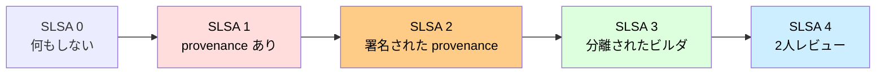

### Provenance とは

「**このバイナリは、このソースから、このビルダで、このコマンドで作られた**」を示す JSON。

```json
{
  "_type": "https://in-toto.io/Statement/v0.1",
  "predicateType": "https://slsa.dev/provenance/v0.2",
  "subject": [{
    "name": "192.168.56.10:5000/todo-api",
    "digest": {"sha256": "abcd..."}
  }],
  "predicate": {
    "builder": {"id": "https://github.com/actions/runner"},
    "buildType": "https://github.com/slsa-framework/slsa-github-generator/...",
    "invocation": {
      "configSource": {
        "uri": "git+https://github.com/<USER>/todo-app",
        "digest": {"sha1": "deadbeef..."},
        "entryPoint": ".github/workflows/release.yaml"
      }
    },
    "materials": [
      {"uri": "git+https://github.com/<USER>/todo-app", "digest": {"sha1": "deadbeef..."}}
    ],
    "metadata": {"completeness": {"environment": true, "materials": true}}
  }
}
```

これを cosign で attest としてイメージに添付:

```bash
cosign attest --predicate provenance.json --type slsaprovenance \
  192.168.56.10:5000/todo-api@sha256:abcd...
```

GitHub Actions では `slsa-framework/slsa-github-generator` を使えば自動で SLSA Level 3 相当の provenance が生成される。

### in-toto: provenance の元になる仕様

in-toto は「ソフトウェアパイプラインの完全性」を保証する一般的なフレームワーク(2016〜)。SLSA はその一実装。

- **Statement**: 何かについての主張(predicate)を subject に紐付けたもの
- **Predicate types**:
  - `https://slsa.dev/provenance/v0.2`: ビルドの来歴
  - `https://spdx.dev/Document`: SBOM(SPDX)
  - `https://cyclonedx.org/bom/v1.4`: SBOM(CycloneDX)
  - `https://example.com/scan-result/v1`: スキャン結果
- **Attestation**: Statement に署名したもの

「イメージに署名する」だけでなく、「**特定の主張(SBOM、ビルド方法、スキャン結果)を署名付きで添付する**」のが in-toto の世界観。

### Kyverno で SLSA Level を要求

```yaml
apiVersion: kyverno.io/v1
kind: ClusterPolicy
metadata:
  name: require-slsa-provenance
spec:
  validationFailureAction: Enforce
  rules:
  - name: check-slsa-attestation
    match:
      any:
      - resources:
          kinds: [Pod]
          namespaces: [prod]
    verifyImages:
    - imageReferences:
      - "192.168.56.10:5000/todo-*"
      attestations:
      - predicateType: https://slsa.dev/provenance/v0.2
        attestors:
        - entries:
          - keyless:
              subject: "https://github.com/<USER>/todo-app/.github/workflows/release.yaml@*"
              issuer: "https://token.actions.githubusercontent.com"
        conditions:
        - all:
          - key: "{{ predicate.builder.id }}"
            operator: Equals
            value: "https://github.com/actions/runner"
          - key: "{{ predicate.invocation.configSource.uri }}"
            operator: Equals
            value: "git+https://github.com/<USER>/todo-app"
```

これで「**指定の GitHub Actions ビルダから、指定のリポジトリから、provenance 付きでビルドされたイメージしか動かさない**」を強制。

---

## SBOM (Software Bill of Materials)

**「中身の成分表」**。一時期 EO 14028(2021 米大統領令)で連邦政府調達ソフトに義務付けられ、業界標準になった。

### 2 つのフォーマット

| 仕様 | 策定 | 特徴 |
|------|------|------|
| **SPDX** | Linux Foundation | 古参(2010〜)、ライセンス管理に強い |
| **CycloneDX** | OWASP | 新しい(2017〜)、脆弱性連携に強い |

両者は変換可能で、組織の好みで選ぶ。Trivy/Syft はどちらも出せる。

### Syft で生成

```bash
# Anchore の syft
syft 192.168.56.10:5000/todo-api:0.1.0 -o spdx-json > sbom.spdx.json
syft 192.168.56.10:5000/todo-api:0.1.0 -o cyclonedx-json > sbom.cdx.json
```

または Trivy で:

```bash
trivy image --format spdx-json --output sbom.spdx.json 192.168.56.10:5000/todo-api:0.1.0
trivy image --format cyclonedx --output sbom.cdx.json 192.168.56.10:5000/todo-api:0.1.0
```

### attest として添付

```bash
cosign attest --predicate sbom.spdx.json \
  --type spdxjson \
  192.168.56.10:5000/todo-api@sha256:abcd...
```

これで「**イメージと SBOM が同時に署名済みで配布される**」状態。検証側は SBOM が改ざんされていないことを確認できる。

### Grype で SBOM ベーススキャン

```bash
grype sbom:./sbom.spdx.json
```

イメージそのものをスキャンする代わりに **SBOM をスキャン**。
これがなぜ嬉しいか:

- 過去にビルドしたイメージの SBOM だけ保管しておけば、**新規 CVE が出たときに過去分も再評価できる**
- イメージは消したが SBOM は残せる(コスト削減)
- SBOM ベースなら **CI で生成した瞬間にスキャン** できる

### SBOM の活用シナリオ

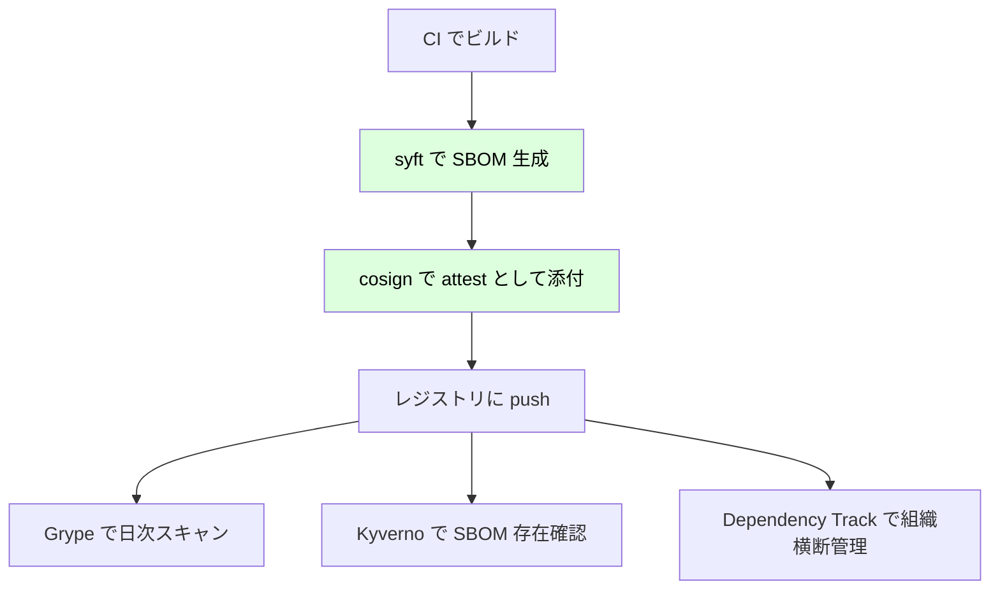

### Dependency Track(組織横断 SBOM 管理)

OWASP の OSS。SBOM をアップロードして組織全体の依存関係を可視化。新規 CVE 通知も。

```bash
# CI から SBOM を投げる
curl -X POST "https://depTrack.example.com/api/v1/bom" \
  -H "X-Api-Key: $DT_API_KEY" \
  -F "project=<UUID>" \
  -F "bom=@sbom.cdx.json"
```

---

## Distroless / Minimal イメージ

base image を小さくすると、**CVE の絶対数が劇的に減る**。同時に攻撃面も小さくなる。

### 比較

| ベース | サイズ | shell | CVE 数(参考値) |
|--------|--------|-------|-------------------|
| `ubuntu:22.04` | 80MB | あり | 100〜 |
| `debian:12-slim` | 80MB | あり | 50〜 |
| `python:3.12` | 1GB | あり | 200〜 |
| `python:3.12-slim` | 130MB | あり | 30〜 |
| `python:3.12-alpine` | 50MB | あり(ash) | 20〜 |
| `gcr.io/distroless/python3-debian12` | 50MB | **なし** | 5〜 |
| `cgr.dev/chainguard/python` | 60MB | なし | ~0(Chainguard が日次再ビルド) |
| `gcr.io/distroless/static` | 2MB | なし | ~0(静的バイナリ用) |

### Distroless とは

Google が提供。**「アプリの実行に必要な共有ライブラリだけ」** が入っている。`bash`, `apt`, `ls`, `cat` すら無い。
利点:

- 攻撃者が侵入しても **shell が無い** ので横展開しづらい
- パッケージマネージャが無い → イメージ内で追加導入できない(= prod 設定の固定化)
- CVE が少ない

### Chainguard Images

商用に近いがフリー枠もある。**毎日再ビルド** されるので CVE がほぼ 0 を維持。基本 distroless と同様の思想。

### 静的バイナリ + scratch

Go や Rust の static binary なら `FROM scratch` で **ベース 0 バイト**。

```dockerfile
# Go
FROM golang:1.22 AS builder
WORKDIR /src
COPY go.mod go.sum ./
RUN go mod download
COPY . .
RUN CGO_ENABLED=0 GOOS=linux go build -o /app ./cmd/api

FROM scratch
COPY --from=builder /etc/ssl/certs/ca-certificates.crt /etc/ssl/certs/
COPY --from=builder /app /app
USER 65534:65534
ENTRYPOINT ["/app"]
```

注意点:

- `tzdata`(タイムゾーン情報)も無いので必要なら `--from=builder /usr/share/zoneinfo` でコピー
- DNS 解決のために CA 証明書はコピー
- nonroot は `nonroot` という名前ではなく数字 UID(65532 / 65534)で指定

### Distroless 採用のトレードオフ

| メリット | デメリット |
|---------|-----------|
| CVE 大幅減 | 中で `exec` してデバッグできない |
| 攻撃面減 | curl で health チェックできない(`livenessProbe.exec` 使えない) |
| サイズ小 | ビルド時のレイヤキャッシュ戦略が変わる |
| Pull 高速 | アプリの起動エラーで何が起きてるか見えづらい |

### デバッグ手段

```bash
# kubectl debug で別イメージを ephemeral container として注入
kubectl debug -it todo-api-xxx --image=busybox --target=todo-api -n prod
```

「**本番イメージは distroless、調査時は debug container で busybox**」が現代の正攻法。

### マルチステージビルドの Python 完全版

```dockerfile
# === Stage 1: deps ===
FROM python:3.12-slim AS deps
WORKDIR /build
COPY pyproject.toml uv.lock ./
RUN pip install --no-cache-dir uv && \
    uv export --no-hashes --format requirements-txt > requirements.txt && \
    pip install --no-cache-dir --target=/deps -r requirements.txt

# === Stage 2: runtime ===
FROM gcr.io/distroless/python3-debian12:nonroot
WORKDIR /app
COPY --from=deps /deps /deps
COPY --chown=nonroot:nonroot app/ ./app/
ENV PYTHONPATH=/deps \
    PYTHONUNBUFFERED=1 \
    PYTHONDONTWRITEBYTECODE=1
USER nonroot
EXPOSE 8000
ENTRYPOINT ["python", "-m", "app.main"]
```

### Buildpacks(Dockerfile を書かない選択肢)

CNCF の Cloud Native Buildpacks は **Dockerfile レス** でアプリから OCI イメージを生成。
SBOM・provenance 自動付与、reproducible build、layer の意味的分割など、サプライチェーン的に優秀。

```bash
pack build 192.168.56.10:5000/todo-api:0.1.0 \
  --builder paketobuildpacks/builder-jammy-tiny \
  --path ./
```

「アプリエンジニアに Dockerfile を書かせない」運用に向く。

---

## Admission policy で入口を絞る

すべてのレイヤを通り抜けたとしても、最後にクラスタの入口で **ポリシー強制** ができる。

### 規制したい代表ルール

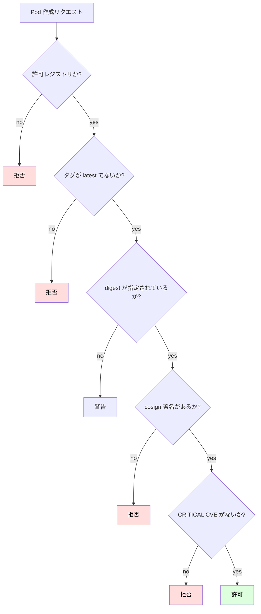

### Kyverno 個別ポリシー集

#### 1. 許可レジストリのみ

```yaml
apiVersion: kyverno.io/v1
kind: ClusterPolicy
metadata:
  name: allowed-registries
spec:
  validationFailureAction: Enforce
  background: false
  rules:
  - name: only-internal-and-trusted
    match:
      any:
      - resources:
          kinds: [Pod]
    validate:
      message: "イメージは社内レジストリ(192.168.56.10:5000)または ghcr.io/<USER>/* のみ許可。"
      pattern:
        spec:
          containers:
          - image: "192.168.56.10:5000/* | ghcr.io/<USER>/*"
```

#### 2. latest タグ禁止

```yaml
apiVersion: kyverno.io/v1
kind: ClusterPolicy
metadata:
  name: disallow-latest-tag
spec:
  validationFailureAction: Enforce
  rules:
  - name: forbid-latest
    match:
      any:
      - resources:
          kinds: [Pod]
    validate:
      message: "image: ...:latest は禁止。バージョンタグまたは digest を使用してください。"
      pattern:
        spec:
          containers:
          - image: "!*:latest & !*:*-latest"
```

#### 3. digest 強制(immutable)

```yaml
apiVersion: kyverno.io/v1
kind: ClusterPolicy
metadata:
  name: require-image-digest
spec:
  validationFailureAction: Enforce
  rules:
  - name: digest-required
    match:
      any:
      - resources:
          kinds: [Pod]
          namespaces: [prod]
    validate:
      message: "本番では image は digest 指定(@sha256:...)が必須。"
      pattern:
        spec:
          containers:
          - image: "*@sha256:*"
```

#### 4. CRITICAL CVE 検出時に拒否(Trivy Operator 連動)

```yaml
apiVersion: kyverno.io/v1
kind: ClusterPolicy
metadata:
  name: block-critical-vulns
spec:
  validationFailureAction: Enforce
  background: false
  rules:
  - name: deny-if-critical
    match:
      any:
      - resources:
          kinds: [Pod]
          namespaces: [prod]
    context:
    - name: vulnReport
      apiCall:
        urlPath: "/apis/aquasecurity.github.io/v1alpha1/namespaces/{{request.namespace}}/vulnerabilityreports"
        jmesPath: "items[?spec.repository=='{{request.object.spec.containers[0].image}}'].report.summary.criticalCount | sum(@)"
    validate:
      message: "CRITICAL CVE を含むイメージは本番にデプロイ不可。"
      deny:
        conditions:
          any:
          - key: "{{ vulnReport }}"
            operator: GreaterThan
            value: 0
```

#### 5. 署名検証 + provenance 検証(複合)

```yaml
apiVersion: kyverno.io/v1
kind: ClusterPolicy
metadata:
  name: verify-todo-supplychain
spec:
  validationFailureAction: Enforce
  rules:
  - name: signature-and-provenance
    match:
      any:
      - resources:
          kinds: [Pod]
          namespaces: [prod]
    verifyImages:
    - imageReferences:
      - "192.168.56.10:5000/todo-*"
      mutateDigest: true
      attestors:
      - count: 1
        entries:
        - keyless:
            subject: "https://github.com/<USER>/todo-app/.github/workflows/*"
            issuer: "https://token.actions.githubusercontent.com"
      attestations:
      - predicateType: https://slsa.dev/provenance/v0.2
        attestors:
        - entries:
          - keyless:
              subject: "https://github.com/<USER>/todo-app/.github/workflows/*"
              issuer: "https://token.actions.githubusercontent.com"
      - predicateType: https://spdx.dev/Document
        attestors:
        - entries:
          - keyless:
              subject: "https://github.com/<USER>/todo-app/.github/workflows/*"
              issuer: "https://token.actions.githubusercontent.com"
```

これ 1 つで「**社内 CI から署名・provenance・SBOM 添付済みのイメージしか本番に入らない**」を強制。

### OPA Gatekeeper との比較

| 観点 | Kyverno | OPA Gatekeeper |
|------|---------|----------------|
| 記述言語 | YAML | Rego |
| 学習コスト | 低 | 高(Rego) |
| 署名検証 | ネイティブ対応 | 別途必要(Conftest 等) |
| Mutation | あり(変更ポリシー) | あり(ConstraintTemplate v3+) |
| エコシステム | k8s 専用 | 汎用(CI でも使える) |

「k8s 内のイメージポリシーは Kyverno、CI 内のチェックは Conftest/OPA」と棲み分けるのが現代の落としどころ。

---

## ハンズオン: TODO アプリの完全サプライチェーン化

ここまでの要素を全部つなげて、TODO アプリを **「スキャン → 署名 → SBOM → Admission 検証」** のフルパイプラインに乗せます。

### 全体像

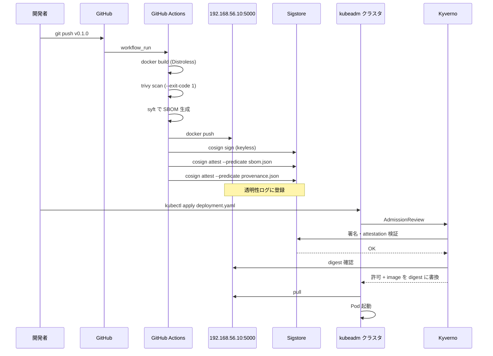

### 手順 1: ローカルレジストリ確認

k8s-lb で起動している registry を確認。

```bash
# k8s-lb で
curl http://localhost:5000/v2/
# {}
curl http://localhost:5000/v2/_catalog
# {"repositories":["todo-api","todo-frontend","todo-worker"]}
```

### 手順 2: Distroless 化した Dockerfile

`docker/Dockerfile`:

```dockerfile
# syntax=docker/dockerfile:1.7
FROM python:3.12-slim AS deps
WORKDIR /build
COPY pyproject.toml requirements.txt ./
RUN pip install --no-cache-dir --target=/deps -r requirements.txt

FROM gcr.io/distroless/python3-debian12:nonroot
WORKDIR /app
COPY --from=deps /deps /deps
COPY --chown=nonroot:nonroot app/ ./app/
ENV PYTHONPATH=/deps \
    PYTHONUNBUFFERED=1
USER nonroot
EXPOSE 8000
ENTRYPOINT ["python", "-m", "app.main"]
```

### 手順 3: CI 構築(GitHub Actions)

`.github/workflows/release.yaml`:

```yaml
name: release
on:
  push:
    tags: ['v*']

permissions:
  contents: read
  packages: write
  id-token: write    # cosign keyless 必須
  attestations: write

env:
  REGISTRY: 192.168.56.10:5000
  IMAGE: todo-api

jobs:
  build-sign-attest:
    runs-on: ubuntu-latest
    outputs:
      digest: ${{ steps.push.outputs.digest }}
    steps:
    - uses: actions/checkout@v4

    - uses: docker/setup-buildx-action@v3

    - uses: docker/build-push-action@v5
      id: push
      with:
        context: .
        file: docker/Dockerfile
        push: true
        tags: ${{ env.REGISTRY }}/${{ env.IMAGE }}:${{ github.ref_name }}
        provenance: true       # SLSA build provenance を自動付与
        sbom: true             # SBOM も自動付与

    # 重ねて Trivy で CRITICAL,HIGH チェック
    - uses: aquasecurity/trivy-action@master
      with:
        image-ref: ${{ env.REGISTRY }}/${{ env.IMAGE }}:${{ github.ref_name }}
        severity: 'CRITICAL,HIGH'
        exit-code: '1'
        ignore-unfixed: true

    - uses: sigstore/cosign-installer@v3

    - name: Cosign sign image
      env:
        IMG: ${{ env.REGISTRY }}/${{ env.IMAGE }}@${{ steps.push.outputs.digest }}
      run: |
        cosign sign --yes \
          --registry-username=ci \
          --registry-password=$REG_PASS \
          "$IMG"
      # 補足: registry が HTTP only ならアクセス可能なルートで実行する

    - name: Generate and attach SBOM (Syft)
      uses: anchore/sbom-action@v0
      with:
        image: ${{ env.REGISTRY }}/${{ env.IMAGE }}@${{ steps.push.outputs.digest }}
        format: spdx-json
        output-file: sbom.spdx.json

    - name: Cosign attest SBOM
      env:
        IMG: ${{ env.REGISTRY }}/${{ env.IMAGE }}@${{ steps.push.outputs.digest }}
      run: |
        cosign attest --yes \
          --predicate sbom.spdx.json \
          --type spdxjson \
          "$IMG"
```

### 手順 4: Kyverno インストール

```bash
helm repo add kyverno https://kyverno.github.io/kyverno/
helm repo update
helm install kyverno kyverno/kyverno -n kyverno --create-namespace \
  --set replicaCount=3   # HA
```

### 手順 5: 署名検証ポリシー適用

`policies/verify-todo.yaml`:

```yaml
apiVersion: kyverno.io/v1
kind: ClusterPolicy
metadata:
  name: verify-todo-images
spec:
  validationFailureAction: Enforce
  background: false
  webhookConfiguration:
    failurePolicy: Fail
  rules:
  - name: require-cosign-signature
    match:
      any:
      - resources:
          kinds: [Pod]
          namespaces: [prod, staging]
    verifyImages:
    - imageReferences:
      - "192.168.56.10:5000/todo-*"
      mutateDigest: true
      required: true
      attestors:
      - count: 1
        entries:
        - keyless:
            subject: "https://github.com/<USER>/todo-app/.github/workflows/release.yaml@*"
            issuer: "https://token.actions.githubusercontent.com"
      attestations:
      - predicateType: https://spdx.dev/Document
        attestors:
        - entries:
          - keyless:
              subject: "https://github.com/<USER>/todo-app/.github/workflows/release.yaml@*"
              issuer: "https://token.actions.githubusercontent.com"
```

```bash
kubectl apply -f policies/verify-todo.yaml
```

### 手順 6: 動作確認

```bash
# 署名済みイメージで Deployment を作る
kubectl -n prod apply -f k8s/todo-api.yaml
kubectl -n prod get pods -l app.kubernetes.io/name=todo-api
# todo-api-xxx-yyy   1/1   Running

# 署名なしイメージを差し替えて apply
kubectl -n prod set image deployment/todo-api todo-api=nginx:latest
# Error: admission webhook "mutate.kyverno.svc" denied the request:
# image verification failed: no matching signatures found for nginx:latest
```

### 手順 7: 既存 Pod のスキャン状況確認

```bash
kubectl get vulnerabilityreports -n prod
# NAMESPACE   NAME                        REPOSITORY                       TAG     CRITICAL  HIGH
# prod        deployment-todo-api-xxx     192.168.56.10:5000/todo-api      0.1.0   0         2

kubectl describe vulnerabilityreport deployment-todo-api-xxx -n prod | head -40
```

CRITICAL 0、HIGH 2 まで絞れたら成功。

### 手順 8: 自分の CVE を見つけて修正

```bash
# わざと古い pyyaml を入れて再ビルドし、CVE が検出される様子を見る
echo "pyyaml==5.3.1" >> requirements.txt
git commit -am "test: vulnerable yaml"
git tag v0.1.1
git push --tags
```

CI が **Trivy で落ちる** ことを確認:

```
2024-XX-XX  ERROR  Vulnerability Found
CVE-2020-14343  HIGH  pyyaml: 5.3.1  →  5.4
```

→ 修正して再 push。

---

## トラブル事例集

### 症状: `ImagePullBackOff` / `ErrImagePull`

```bash
kubectl describe pod <name> -n <ns>
# Events:
#   Failed to pull image "192.168.56.10:5000/todo-api:0.1.0":
#   failed to resolve reference ...
```

調査フロー:

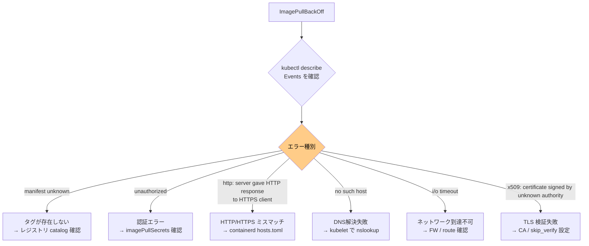

#### `manifest unknown` の代表原因

- typo: `todo-api:0.1.0` のはずが `tdoo-api:0.1.0`
- 再 push が遅延: CI から push 完了前に kubectl apply
- マルチアーキ未対応: arm64 ノードで amd64 only のイメージを引いた

確認:

```bash
curl http://192.168.56.10:5000/v2/todo-api/tags/list
# {"name":"todo-api","tags":["0.1.0","0.0.9"]}
```

#### `unauthorized` の代表原因

- imagePullSecrets が SA に登録されていない
- Secret の docker config が壊れている

確認:

```bash
kubectl get secret ghcr-cred -o jsonpath='{.data.\.dockerconfigjson}' | base64 -d
# {"auths":{"ghcr.io":{"auth":"...."}}}
```

#### `http: server gave HTTP response to HTTPS client`

containerd がデフォルトで HTTPS を試している。HTTP レジストリは `hosts.toml` に明示。

```bash
sudo cat /etc/containerd/certs.d/192.168.56.10:5000/hosts.toml
# server = "http://192.168.56.10:5000"
# [host."http://192.168.56.10:5000"]
#   capabilities = ["pull", "resolve"]

sudo systemctl restart containerd
```

#### `x509: certificate signed by unknown authority`

社内 CA のレジストリで起こる。CA を `/etc/containerd/certs.d/<host>/ca.crt` に置く。

### 症状: cosign verify が失敗

```
Error: no matching signatures
```

調査:

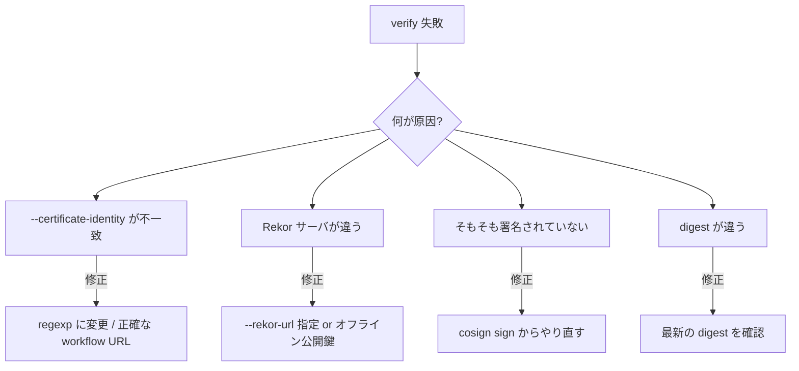

```bash
# 署名の存在確認
cosign tree 192.168.56.10:5000/todo-api:0.1.0
# 📦 Supply Chain Security Related artifacts:
#   └── 🔍 Signatures:
#       └── sha256-abcd....sig
#   └── 📜 SBOMs:
#       └── sha256-abcd....sbom
#   └── 📝 Attestations:
#       └── sha256-abcd....att
```

`cosign tree` で何が紐づいているか可視化できる。

### 症状: Trivy DB ダウンロードが遅い

```
INFO  Need to update DB
INFO  Downloading DB...
ERROR Failed to download trivy-db: too many requests
```

対策:

- GitHub Container Registry にミラーを作る
- `--cache-dir` を共有ボリュームにマウントして CI で持ち回す
- `TRIVY_DB_REPOSITORY` 環境変数で代替先指定

### 症状: Kyverno が遅くて Pod 起動が遅延

```
kubectl describe pod ...
# Events:
#   Warning  FailedCreate  10s  replicaset-controller  Error creating: admission webhook "validate.kyverno.svc" timeout
```

対策:

- `webhookTimeoutSeconds` を 30 に
- Kyverno を 3 replica で HA
- `verifyImages` が Rekor 問い合わせで遅延 → オフライン公開鍵モードに切替

### 症状: Trivy Operator のジョブが失敗し続ける

```bash
kubectl get jobs -n trivy-system
# scan-vulnerabilityreport-xxx   0/1   failed
kubectl logs job/scan-vulnerabilityreport-xxx -n trivy-system
# Error: failed to pull image: ...
```

原因: Trivy Operator のスキャンジョブが、自身が privileged なし・root なしで動くため、対象イメージを pull する権限が無い場合がある。
対策: Trivy Operator の SA にレジストリ認証 Secret を付ける。

```yaml
# values.yaml (helm)
trivy:
  serverServiceAccount: trivy-operator
operator:
  serviceAccount:
    create: true
    name: trivy-operator
# imagePullSecrets を SA に追加
```

---

## ベストプラクティス総まとめ

```mermaid
flowchart LR
    subgraph Build["ビルド時"]
        B1[Distroless ベース]
        B2[multi-stage]
        B3[USER nonroot]
        B4[goldenベース集約]
    end
    subgraph CI["CI"]
        C1[Trivy scan exit-code 1]
        C2[Syft SBOM生成]
        C3[Cosign sign keyless]
        C4[Cosign attest provenance + SBOM]
    end
    subgraph Reg["レジストリ"]
        R1[immutable タグ運用]
        R2[OCI Artifact: 署名/SBOM 同居]
    end
    subgraph Cluster["クラスタ"]
        K1[Kyverno verifyImages]
        K2[Trivy Operator 常駐]
        K3[allowedRegistries policy]
        K4[Disallow latest policy]
    end
    Build --> CI
    CI --> Reg
    Reg --> Cluster

    style B1 fill:#dfd,color:#000
    style C3 fill:#dfd,color:#000
    style K1 fill:#dfd,color:#000
    style K2 fill:#dfd,color:#000
```

| やる事 | 効果 |
|--------|------|
| Distroless / chainguard 採用 | CVE 数 90% 減 |
| USER nonroot | PSS restricted に適合 |
| Trivy --exit-code 1 in CI | 既知 CVE をブロック |
| Cosign keyless 署名 | 改ざん検知 + 出所証明 |
| Cosign attest SBOM | 中身の透明化 |
| Kyverno verifyImages | クラスタ入口で署名強制 |
| Trivy Operator 常駐 | 動いている Pod の状況把握 |
| .trivyignore + 期限 | 例外を可視化 |
| image: foo@sha256:... | tag mutable 問題回避 |
| allowedRegistries policy | typo / 悪意ある外部依存遮断 |

---

## 参考リンク

- OCI Image Spec: <https://github.com/opencontainers/image-spec>
- OCI Distribution Spec: <https://github.com/opencontainers/distribution-spec>
- Sigstore: <https://www.sigstore.dev/>
- Sigstore Cosign: <https://docs.sigstore.dev/cosign/overview/>
- SLSA: <https://slsa.dev/>
- in-toto: <https://in-toto.io/>
- Trivy: <https://aquasecurity.github.io/trivy/>
- Trivy Operator: <https://aquasecurity.github.io/trivy-operator/>
- Kyverno verifyImages: <https://kyverno.io/docs/writing-policies/verify-images/>
- SPDX: <https://spdx.dev/>
- CycloneDX: <https://cyclonedx.org/>
- Distroless: <https://github.com/GoogleContainerTools/distroless>
- Chainguard Images: <https://www.chainguard.dev/chainguard-images>

---

## チェックポイント

ここまでで以下を **自分の言葉で** 説明できるか確認してください。

- [ ] OCI Image Manifest / Image Index / Image Config / Layer の関係を図で描ける
- [ ] サプライチェーン攻撃の代表事例(SolarWinds、Log4Shell、XZ Utils 等)を最低3つ挙げ、それぞれの教訓を述べられる
- [ ] `imagePullPolicy` の 3 値の違いと、デフォルト挙動の決定方法
- [ ] Tag mutable 問題の本質と、digest 参照で回避できる理由
- [ ] CVE / NVD / GHSA / OSV / EPSS の違いと、なぜ EPSS が必要なのか
- [ ] Trivy / Grype / Snyk / Clair / Anchore の棲み分け
- [ ] Sigstore の Fulcio / Rekor / TUF それぞれの役割
- [ ] keyless 署名がなぜ画期的か(従来の鍵管理問題と比較して)
- [ ] SLSA Level 1〜3 で要求される具体的な要件
- [ ] in-toto attestation と provenance / SBOM の関係
- [ ] Distroless ベースのメリットとデバッグ手段(`kubectl debug`)
- [ ] Kyverno verifyImages で「署名 + provenance + SBOM」を強制する書き方
- [ ] `ImagePullBackOff` の原因切り分けフロー(unauthorized / manifest unknown / TLS 等)
- [ ] `.trivyignore` を運用するときに必須記載項目
- [ ] CI で Trivy を CI ゲートにする場合の `--exit-code 1` の意義

→ 次は [Secret管理]({{ '/10-security/secret-management/' | relative_url }})
