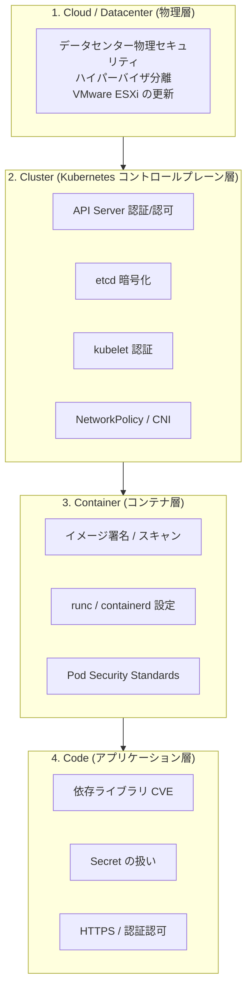
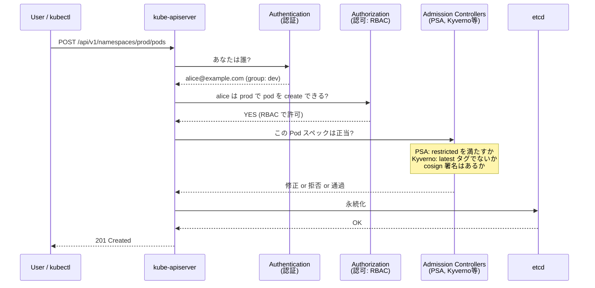
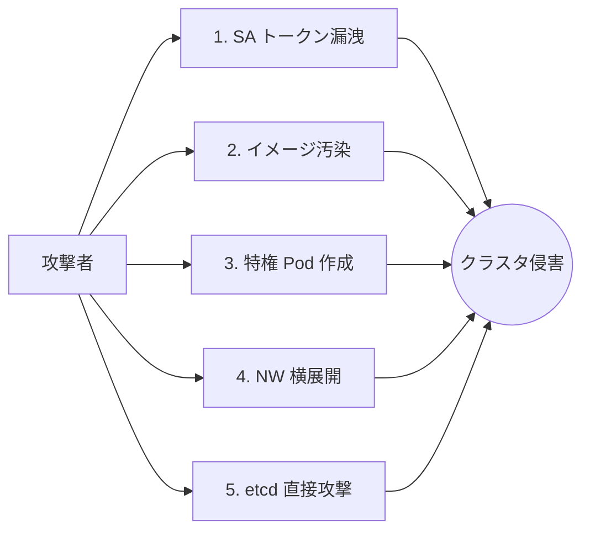
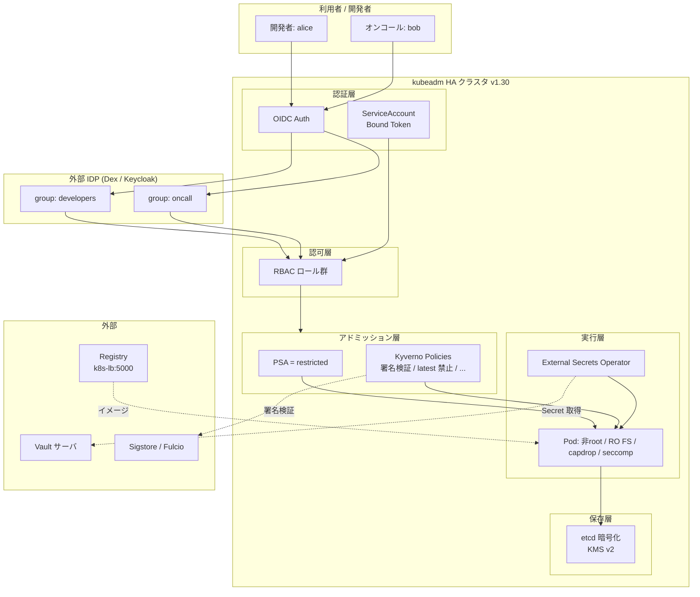
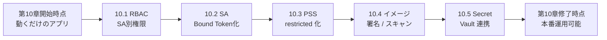

# 10. セキュリティ
{: .no_toc }

## 目次
{: .no_toc .text-delta }

1. TOC
{:toc}

---

## この章のゴール

この章を読み終えると、以下を **自分の言葉で説明できる** ようになります。

- Kubernetes における「認証」「認可」「アドミッション制御」の三段ロケットがそれぞれ何をしているか
- なぜ RBAC が PSP や ABAC を置き換えてデファクトになったのか、その歴史的経緯
- Pod Security Standards が PodSecurityPolicy の何を反省して作られたのか
- ServiceAccount の Bound Token がなぜ Secret 連携トークンを置き換えたのか
- イメージのサプライチェーン攻撃から守る三本柱(スキャン・署名・ポリシー)の役割分担
- なぜ素の Kubernetes Secret は本番に使ってはいけないのか、代替手段それぞれの長所短所
- 本番クラスタを「root で動かさず・Secret を平文で Git に置かず・不正な Pod を作らせない」状態にする最小手順

---

## この章の位置づけ

これまでの章で、皆さんはサンプルアプリ「ミニTODOサービス」を Kubernetes 上で動かせるようになりました。
Pod、Deployment、Service、Ingress、StatefulSet、ConfigMap、Secret、Volume、Helm、Kustomize、GitOps —— アプリを「動かす」ための部品は揃っています。

しかし、ここまでで構築したクラスタには **大きな穴** が空いています。

- すべての Pod は実質的に root で動いており、コンテナエスケープすればノードを乗っ取れる
- `default` の ServiceAccount に紐づくトークンが全 Pod にマウントされ、API サーバへの認証情報がコンテナ内に裸で置かれている
- Secret は base64 「エンコード」されているだけで、暗号化はされていない
- そして etcd の中身も平文である
- 誰でもクラスタに `kubectl apply` できれば、特権付き Pod を立ててホストの `/` をマウントできる
- イメージは外部レジストリから何でも引っ張れ、署名検証もスキャンも行われていない

この章は、これらの穴を一つずつ塞いでいくための章です。

{: .important }
> Kubernetes のセキュリティは「あとから入れる機能」ではなく、**Day 1 から考えるべき設計事項** です。
> 「とりあえず動かして、セキュリティはあとで」と言って事故を起こしたケースは、CNCF の事故報告書に山ほどあります。
> 本章を後回しにせず、第7章で kubeadm クラスタを構築したら **すぐに** 適用していくのが現代の運用です。

---

## Kubernetes のセキュリティ「四つの層」

Kubernetes セキュリティを語るとき、CNCF 公式では **4C** という整理がよく使われます。

本章は主に **Cluster 層と Container 層** を扱います。Cloud 層は VMware の章で、Code 層はアプリ実装の話なので各言語別に扱われます。

---

## 認証 / 認可 / アドミッション制御 ── 三段の処理

`kubectl apply` を叩いたとき、API Server がそのリクエストを受け取ってから etcd に書き込むまでに、**3つの関門** を通ります。

| 段階 | 何をするか | 本章で扱うもの |
|------|-----------|----------------|
| 認証 (AuthN) | リクエスタが誰かを確認 | ServiceAccount、X.509、OIDC |
| 認可 (AuthZ) | その人が何をしてよいか | **RBAC** |
| アドミッション (Admission) | そのリクエストの中身が妥当か | **Pod Security Admission**、Kyverno、ImagePolicy |

この三段ロケットを理解することが、Kubernetes セキュリティの基礎中の基礎です。

{: .note }
> 「認証」と「認可」は混同されやすいですが別物です。
> 認証は「あなたは誰?」、認可は「あなたはこれをしてよい?」です。
> パスポートで顔写真と名前が確認されるのが認証、ビザでその国に入る権利があるかが認可、税関で持ち込み物がチェックされるのがアドミッション ── と例えるとわかりやすいでしょう。

---

## なぜ Kubernetes のセキュリティは難しいのか

Kubernetes のセキュリティが難しい本質的な理由は、**「すべてが API で操作できる」というクラウドネイティブの強みが、そのまま攻撃面の広さに直結している** ことです。

伝統的なサーバ運用なら、SSH の鍵さえ守れば良かった。しかし Kubernetes では:

- API Server へのトークンが漏れれば、全クラスタが乗っ取られる
- ServiceAccount トークンが漏れれば、その権限分の API 操作ができる
- イメージが汚染されれば、Pod を立てた瞬間にマルウェアが動く
- Secret が漏れれば、DB が抜かれる
- etcd のダンプが漏れれば、全 Secret が読まれる
- ノードがコンテナエスケープで奪われれば、その上の全 Pod が見える
- そして、これら全てを制御する「コントロールプレーン」自体が API で動いている

このため、Kubernetes セキュリティは **多層防御 (Defense in Depth)** が必須です。一箇所が破られても次の層で止める、という思想で組み上げます。

---

## 歴史: Kubernetes セキュリティ機能の変遷

Kubernetes のセキュリティ機能は、コミュニティの「事故」と「反省」の歴史で進化してきました。

| 年 | バージョン | できごと |
|----|-----------|---------|
| 2014 | 0.x | 初期はほぼ認証なし。クラスタは「信頼できるネットワーク内」前提 |
| 2015 | 1.0 | ABAC (Attribute-Based Access Control) 導入。JSON ファイルで権限を定義 |
| 2016 | 1.3 | **RBAC alpha**。ABAC の運用性の悪さへの反省 |
| 2017 | 1.6 | RBAC beta、本番利用が現実的に |
| 2017 | 1.8 | RBAC stable、`cluster-admin` `view` 等の標準 ClusterRole 整備 |
| 2018 | 1.10 | PodSecurityPolicy (PSP) beta |
| 2019 | 1.13 | コンテナエスケープ脆弱性 CVE-2019-5736 (runc) — 業界全体に衝撃 |
| 2019 | 1.15 | CSI Volume / SecretStore の構想開始 |
| 2020 | 1.18 | **PSP が deprecated に**。設計の根本的問題が認識される |
| 2020 | 1.20 | Dockershim 削除予告 → containerd 移行へ |
| 2021 | 1.21 | **Bound Service Account Token** が default に。永続トークンの廃止へ |
| 2021 | 1.22 | Pod Security Admission (PSA) alpha |
| 2022 | 1.23 | PSA beta、 PSS (Pod Security Standards) 公式化 |
| 2022 | 1.24 | **SA Secret 自動生成の廃止**、Bound Token への完全移行 |
| 2022 | 1.25 | **PSP が削除**、PSA に完全移行 |
| 2023 | 1.27 | KMS v2 (Key Management Service v2) beta、etcd 暗号化が刷新 |
| 2024 | 1.30 | ValidatingAdmissionPolicy (CEL) stable、Kyverno 等の代替手段が成熟 |

特筆すべきは **PSP の廃止** と **SA Secret の廃止** という、ふたつの「設計のやり直し」です。
これらが何を反省して新方式になったのかを各ページで深く掘り下げます。

---

## 本章で構築する「ミニTODOサービス本番化」の最終形

第7章で構築した kubeadm HA クラスタ (k8s-cp1〜k8s-w3) に、本章を読み終えた時点で以下が入った状態を目指します。

具体的には:

1. **RBAC** で「開発者は dev/staging だけ触れる」「オンコールは prod の参照のみ」を定義
2. **ServiceAccount** ごとに `automountServiceAccountToken: false` を徹底し、Pod に不要なトークンを置かない
3. **PSS の restricted** を prod / staging に enforce、root で動く Pod は作れない
4. **Trivy Operator** が常時稼働し、CVE が検出されると Slack に通知
5. **cosign 署名検証** を Kyverno で強制、自社 CI 以外のイメージは拒否
6. **etcd 暗号化** を KMS v2 で有効化、etcd ダンプを取られても直接読めない
7. **External Secrets Operator + Vault** で Secret を一元管理、Git には参照だけ

これが現代 (2024-2026) の Kubernetes 本番運用の最低ライン、と言っても過言ではありません。

---

## 本章の構成

| ページ | 内容 | 推奨学習時間 |
|--------|------|--------------|
| [RBAC]({{ '/10-security/rbac/' | relative_url }}) | 認可機構の中核。Role/ClusterRole/Binding の使い分け、最小権限、外部 IDP 連携 | 90分 |
| [ServiceAccount]({{ '/10-security/serviceaccount/' | relative_url }}) | Pod の認証主体。Bound Token、IRSA/Workload Identity 的応用 | 60分 |
| [Pod Security Standards]({{ '/10-security/pss/' | relative_url }}) | PSP の後継。restricted プロファイル、Kyverno での補強 | 90分 |
| [イメージセキュリティ]({{ '/10-security/image/' | relative_url }}) | サプライチェーン保護。Trivy、cosign、SBOM、Distroless | 90分 |
| [Secret管理]({{ '/10-security/secret-management/' | relative_url }}) | etcd 暗号化、Sealed Secrets、SOPS、External Secrets Operator | 120分 |

合計でおおむね **8時間** ほどの学習量です。一気に全部やるのではなく、サンプルアプリに少しずつ適用しながら、1日1ページのペースで進めるのが現実的でしょう。

---

## この章を読むための前提知識

- 第6章までの内容(Pod、Deployment、Service、Secret、ConfigMap、Volume)
- 第7章 kubeadm HA クラスタ構築
- 第8章 Helm / Kustomize
- 第9章 GitOps (Argo CD)
- Linux のユーザ・グループ・ファイルパーミッションの基本
- 公開鍵暗号と署名の概念(これ自体は本章で復習します)

---

## サンプルアプリへの適用方針

各ページで「ミニTODOサービス」への適用を行います。

各ページの最後に **「現在のミニTODOサービスを実際に変更してみる」** ハンズオン課題を置きます。
これを順番にこなすことで、最終的にあなたのサンプルアプリが本番運用可能なセキュリティ水準に達します。

---

## チェックポイント

ここまでで以下を **自分の言葉で** 説明できるか確認してください。

- [ ] Kubernetes セキュリティの 4C(Cloud / Cluster / Container / Code)が指すもの
- [ ] 認証 / 認可 / アドミッション制御の三段ロケットの役割分担
- [ ] なぜ Kubernetes は SSH 時代より攻撃面が広いのか
- [ ] PSP が廃止された理由と、その後継が何か
- [ ] SA Secret の自動生成が廃止された理由と、その後継が何か
- [ ] 本章修了時点でクラスタが満たす最低ライン(7項目)

→ 次は [RBAC]({{ '/10-security/rbac/' | relative_url }})
