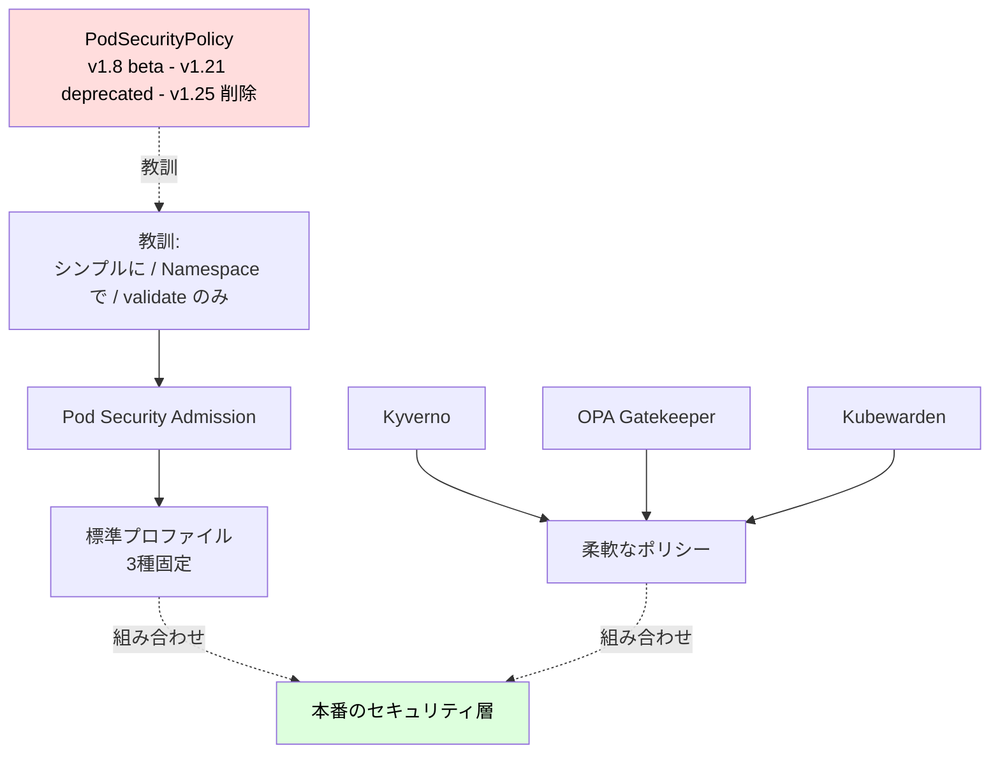
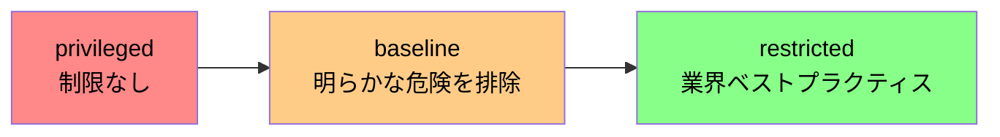
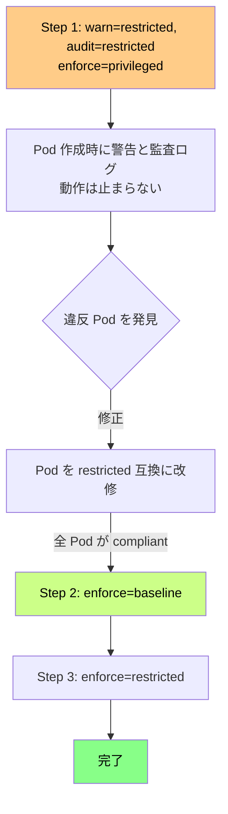
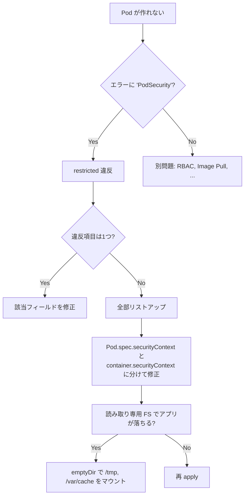
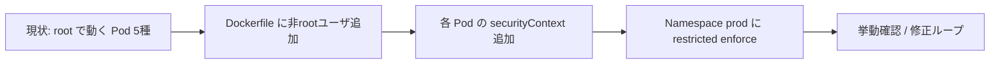

# Pod Security Standards
{: .no_toc }

## 目次
{: .no_toc .text-delta }

1. TOC
{:toc}

---

## このページのゴール

このページを読み終えると、以下を **自分の言葉で説明できる** ようになります。

- なぜ PodSecurityPolicy(PSP)が捨てられ、Pod Security Standards(PSS)+ Pod Security Admission(PSA)になったのか
- privileged / baseline / restricted の3プロファイルの具体的要件
- enforce / audit / warn ラベルの使い分けと、本番への段階的導入方法
- restricted を満たす Pod を作るための Dockerfile と Manifest 修正の具体パターン
- PSA だけでは足りない部分を Kyverno や OPA Gatekeeper でどう補うか
- セキュリティコンテキスト(`securityContext`)の主要フィールドの意味

---

## Pod のセキュリティ問題の本質

コンテナは「軽量な仮想化」と呼ばれることがありますが、実態は **Linux カーネルを全プロセスで共有するプロセス分離** です。
VM のような完全な隔離はなく、コンテナエスケープ脆弱性(例: CVE-2019-5736 runc)が起きるとホストを乗っ取られかねません。

特に危険なのは次のいずれかが揃ったとき:

1. コンテナが **root** で動いている
2. **CAP_SYS_ADMIN** などの強力な Capability を持っている
3. **privileged: true** で起動している
4. **hostPath、hostNetwork、hostPID** などホスト共有が有効
5. **seccomp プロファイル** が無効
6. **AppArmor / SELinux** が無効

これらは「とりあえず動かす」と気づかぬうちに ON になりがちです。Pod Security Standards は **これらを止める標準ルール** を提供します。

```mermaid
flowchart LR
    subgraph Risk["攻撃面が広い Pod"]
        R1[root で動作]
        R2[特権コンテナ]
        R3[hostPath マウント]
        R4[Cap drop なし]
        R5[seccomp 無効]
    end

    subgraph Attack["攻撃シナリオ"]
        A1[runc 脆弱性]
        A2[hostPath で /etc/shadow 読む]
        A3[CAP_SYS_PTRACE で他Pod 覗く]
        A4[/proc 経由で kernel 攻撃]
    end

    Risk -->|どれか1つでも開く| Attack
    Attack --> Pwned((ノード乗っ取り))
```

---

## 歴史: PSP の失敗から PSS へ

### PodSecurityPolicy (PSP) の時代 (~ v1.24)

2017年、Kubernetes 1.8 で beta となった **PodSecurityPolicy (PSP)** は、Pod スペックの中身を制約する admission controller でした。
クラスタ管理者が PSP を作り、それを **RBAC で SA に bind** することで「この SA で作られる Pod はこの PSP を満たすこと」を強制できました。

```yaml
# 旧 PSP の例(現在は無効)
apiVersion: policy/v1beta1
kind: PodSecurityPolicy
metadata:
  name: restricted
spec:
  privileged: false
  allowPrivilegeEscalation: false
  requiredDropCapabilities: [ALL]
  runAsUser:
    rule: MustRunAsNonRoot
  fsGroup:
    rule: RunAsAny
```

### なぜ PSP は捨てられたのか

PSP は **設計の根本的問題** を抱えていました。

1. **権限モデルが直感に反する**:
   PSP はそれを **使う SA に対する RBAC 権限**(`use` verb)で適用されるという、極めて奇妙なモデルでした。SA がどの PSP に紐づくかが「Pod を見るだけではわからない」状態だったのです。

2. **複数の PSP の解決順序が予測不能**:
   1 つの SA が複数の PSP を使える場合、どれが選ばれるかはアルファベット順という暗黙ルール。これにより、新しい PSP を作るだけで挙動が壊れることがあった。

3. **mutating の混在**:
   PSP は単に validate するだけでなく、`runAsUser` などのフィールドを **書き換える(mutating)** こともあった。意図せず Pod の中身が変えられる事故が頻発。

4. **opt-in が困難**:
   既存クラスタに PSP を導入しようとすると、すべての SA に PSP の `use` 権限を bind し直す必要があり、移行が困難。

5. **CRD ベースじゃない**:
   PSP は admission plugin としてハードコードされていた。Kyverno / OPA のような柔軟なポリシーエンジンの登場で、わざわざ本体に組み込む意義が薄れた。

2020年、Kubernetes 1.21 で **deprecated** が宣言され、1.25 で完全削除されました。

### PSS + PSA の登場

代替として登場したのが **Pod Security Standards (PSS)** + **Pod Security Admission (PSA)** です。

| 項目 | PSP | PSA |
|------|-----|-----|
| 管理単位 | RBAC で SA に bind | **Namespace ラベル** |
| プロファイル | 自由設計 | 標準3種 (privileged / baseline / restricted) |
| 順序問題 | あった | なし(明示) |
| 動作 | mutate + validate | **validate のみ** |
| 設定方法 | PSP リソース + RBAC | Namespace label |
| 補強 | 困難 | Kyverno/OPA で簡単 |

シンプル化したぶん、PSA でカバーできない要件(「特定の image しか使うな」「リソース要求は必須」など)は **Kyverno / OPA Gatekeeper / Kubewarden** などの外部ポリシーエンジンに任せる、という棲み分けが明確になりました。



{: .note }
> 2025 年現在、新規クラスタを構築するなら **最初から PSA で restricted を有効にする** のが推奨です。
> 「あとから入れる」は既存ワークロードの修正が必要になり、結局延期されがちです。

---

## PSS の3プロファイル

PSS は **3レベル** のプロファイルを規定しています。

| Level | 内容 | 用途 |
|-------|------|------|
| **privileged** | 制限なし(=何でも許可) | システム系 Namespace (kube-system 等) |
| **baseline** | 既知の特権昇格を防ぐ最小限 | 一般のアプリ Namespace |
| **restricted** | 強くハードニング(推奨) | 信頼境界の厳しい本番 |



### privileged プロファイル

何の制約もありません。`hostPath` も `privileged: true` も `hostNetwork` も使い放題です。
これは **kube-system Namespace 用** です。CNI(Calico、Cilium)や CSI ドライバ、kube-proxy などはノードに対する深い権限が必要で、制約をかけられません。

### baseline プロファイル ── 「最低限これは止めて」

「明らかにアウト」な設定だけを禁止します。後方互換性を重視し、既存アプリの大半は手を入れずに動きます。

主な禁止項目:

| 項目 | 禁止内容 |
|------|----------|
| `hostNetwork` | `true` 禁止 |
| `hostPID` | `true` 禁止 |
| `hostIPC` | `true` 禁止 |
| `hostPath` | volume 禁止 |
| `privileged` | `true` 禁止 |
| `allowPrivilegeEscalation` | `true` 禁止 |
| `procMount` | `Unmasked` 禁止 |
| `capabilities.add` | `NET_RAW` などの危険な capability 禁止 |
| `seLinuxOptions` | `type` の指定値を制限 |
| `seccompProfile` | `Unconfined` 禁止 |
| AppArmor / sysctl | 危険な値を制限 |

### restricted プロファイル ── 業界ベストプラクティス

baseline に加えて **積極的なハードニング** を要求します。

| 追加項目 | 内容 |
|----------|------|
| `runAsNonRoot` | `true` 必須 |
| `runAsUser` | 0(root)は禁止 |
| `allowPrivilegeEscalation` | **false 必須**(明示) |
| `capabilities.drop` | **`ALL` 必須** |
| `capabilities.add` | `NET_BIND_SERVICE` のみ許可 |
| `seccompProfile` | **必須**(`RuntimeDefault` または `Localhost`) |
| ボリュームタイプ | `configMap`, `secret`, `emptyDir`, `pvc`, `projected`, `downwardAPI`, `ephemeral`, `csi` のみ |

これを満たすには、Dockerfile と Manifest 両方の修正が必要になることが多いです。

### 全部のせ: restricted を満たす Pod

```yaml
apiVersion: v1
kind: Pod
metadata:
  name: hardened
spec:
  securityContext:
    runAsNonRoot: true
    runAsUser: 1000
    runAsGroup: 1000
    fsGroup: 1000
    seccompProfile:
      type: RuntimeDefault
  containers:
  - name: app
    image: 192.168.56.10:5000/todo-api:0.1.0
    securityContext:
      allowPrivilegeEscalation: false
      readOnlyRootFilesystem: true
      capabilities:
        drop: [ALL]
        # add: [NET_BIND_SERVICE]   # 80/443 で待ち受けるなら
    volumeMounts:
    - name: tmp
      mountPath: /tmp
    - name: var-cache
      mountPath: /var/cache
  volumes:
  - name: tmp
    emptyDir: {}
  - name: var-cache
    emptyDir: {}
```

---

## securityContext を分解する

Pod / Container レベルで指定できる `securityContext` を、フィールドごとに見ていきます。

### `runAsNonRoot`

```yaml
securityContext:
  runAsNonRoot: true
```

UID 0(root)で動くコンテナを禁止します。
**ただし**、これは Pod 起動時にイメージの UID を検査するだけです。Dockerfile で `USER 0` のまま `runAsNonRoot: true` にすると、Pod は起動失敗します:

```
Error: container has runAsNonRoot and image will run as root
```

### `runAsUser` / `runAsGroup`

明示的に UID/GID を指定します。`runAsUser: 1000` は UID 1000 ということ。
Dockerfile 側で `useradd -u 1000 app` してあれば一致しますが、ない場合は **存在しない UID で動く** ことになり、`getpwuid()` 等が失敗するアプリは壊れます(`whoami` も失敗する)。

```dockerfile
# Dockerfile 側で用意
FROM python:3.12-slim
RUN groupadd -g 1000 app && useradd -u 1000 -g 1000 -m -s /bin/bash app
USER 1000
```

### `fsGroup`

Pod にマウントされた Volume の **所有グループ** を指定します。
emptyDir などはこれで書き込み可能になります。

```yaml
securityContext:
  fsGroup: 1000
```

PVC をマウントする StatefulSet では特に重要。指定がないと Volume のオーナーが root のまま、非 root アプリは書き込めません。

### `allowPrivilegeEscalation`

`false` にすると、子プロセスが親より高い権限を持てなくなります(`setuid` バイナリ無効化)。
restricted では **必須** で、各コンテナの `securityContext` に明示しないと弾かれます。

### `readOnlyRootFilesystem`

コンテナのルート FS を **読み取り専用** にします。
攻撃者がマルウェアをディスクに書こうとしても失敗します。

ただし、多くのアプリは `/tmp` `/var/run` `/var/cache` などへの書き込みが必要なので、これらを `emptyDir` でマウントする必要があります。

```yaml
volumeMounts:
- name: tmp
  mountPath: /tmp
- name: var-run
  mountPath: /var/run
volumes:
- name: tmp
  emptyDir: {}
- name: var-run
  emptyDir: {}
```

### `capabilities`

Linux Capability の add/drop。

```yaml
capabilities:
  drop: [ALL]
  add: [NET_BIND_SERVICE]   # 80/443 など <1024 ポートを bind したいときだけ
```

restricted では `drop: [ALL]` が必須。デフォルトでは containerd が以下を渡しています(これらが全部消える):

- `AUDIT_WRITE` `CHOWN` `DAC_OVERRIDE` `FOWNER` `FSETID` `KILL`
- `MKNOD` `NET_BIND_SERVICE` `NET_RAW` `SETFCAP` `SETGID` `SETPCAP` `SETUID` `SYS_CHROOT`

このうち `NET_BIND_SERVICE` だけは restricted でも追加可能(`add` できる)。
`NET_RAW` は ICMP / raw socket を許可するもので、攻撃に使われやすいため drop が推奨。

### `seccompProfile`

Seccomp は Linux カーネルへのシステムコールをフィルタする機能。
`RuntimeDefault` はランタイム(containerd 等)既定のプロファイルで、**約 60 のシステムコール** をデフォルト禁止します。

```yaml
securityContext:
  seccompProfile:
    type: RuntimeDefault          # 既定プロファイル
    # type: Localhost
    # localhostProfile: my-app.json
```

`Localhost` を選ぶと、Node 上の `/var/lib/kubelet/seccomp/` に置いたカスタム JSON を使えます。
本番では `RuntimeDefault` で十分なケースが多いですが、極端に厳しくしたいなら独自プロファイルも可。

### `seLinuxOptions`

SELinux のラベルを指定。RHEL / Rocky Linux など SELinux 有効ホストで有効化されます。
Ubuntu はデフォルト無効なので、本教材の kubeadm 環境では実質スキップ可。

### `windowsOptions`

Windows コンテナ用。Linux クラスタでは無視。

---

## Pod Security Admission (PSA) ── どう適用するか

PSS は仕様、PSA は **その仕様を Namespace で強制する admission plugin** です。

### Namespace ラベルで適用

```yaml
apiVersion: v1
kind: Namespace
metadata:
  name: prod
  labels:
    pod-security.kubernetes.io/enforce: restricted
    pod-security.kubernetes.io/enforce-version: latest
    pod-security.kubernetes.io/audit: restricted
    pod-security.kubernetes.io/audit-version: latest
    pod-security.kubernetes.io/warn: restricted
    pod-security.kubernetes.io/warn-version: latest
```

| ラベル | 効果 |
|--------|------|
| `enforce` | 違反する Pod の作成を**拒否** |
| `audit` | 違反したら**監査ログに記録**(作成は通す) |
| `warn` | 違反したら**クライアントに警告**を表示(作成は通す) |

`enforce-version` は **適用するプロファイルの「Kubernetes バージョン」**(restricted の定義は時々強化されるため、バージョンで固定できる)。`latest` または `v1.30` のように指定。

### 段階的導入のベストプラクティス

いきなり `enforce=restricted` を当てると、既存 Pod が再起動できなくなる事故が起きます。
段階を踏んで適用するのが王道です。



実例:

```yaml
# Step 1: 観察モード
apiVersion: v1
kind: Namespace
metadata:
  name: prod
  labels:
    pod-security.kubernetes.io/enforce: privileged    # 強制なし
    pod-security.kubernetes.io/audit: restricted      # 監査
    pod-security.kubernetes.io/warn: restricted       # 警告
```

```bash
# 1週間運用して、warn が出ない Pod だけになったら
kubectl label ns prod \
  pod-security.kubernetes.io/enforce=baseline \
  --overwrite

# さらに修正して
kubectl label ns prod \
  pod-security.kubernetes.io/enforce=restricted \
  --overwrite
```

### クラスタ全体のデフォルト

API Server の `--admission-control-config-file` で「Namespace ラベルが無い場合のデフォルト」を設定できます。

```yaml
# /etc/kubernetes/admission/admission-control.yaml
apiVersion: apiserver.config.k8s.io/v1
kind: AdmissionConfiguration
plugins:
- name: PodSecurity
  configuration:
    apiVersion: pod-security.admission.config.k8s.io/v1
    kind: PodSecurityConfiguration
    defaults:
      enforce: "baseline"
      enforce-version: "latest"
      audit: "restricted"
      warn: "restricted"
    exemptions:
      usernames: []
      runtimeClasses: []
      namespaces: ["kube-system"]
```

これにより「ラベル無しの新規 Namespace は自動的に baseline を強制」状態になります。

---

## Dockerfile を restricted 互換にする

restricted を満たすには、**多くの場合 Dockerfile の修正** が必要です。

### Before

```dockerfile
FROM python:3.12-slim
WORKDIR /app
COPY . .
RUN pip install -r requirements.txt
CMD ["python", "main.py"]
# UID=0 root のまま!
```

### After

```dockerfile
FROM python:3.12-slim AS builder
WORKDIR /app
COPY pyproject.toml ./
RUN pip install --target=/build/deps .

FROM python:3.12-slim
RUN groupadd -g 1000 app && useradd -u 1000 -g 1000 -m -s /bin/false app
WORKDIR /app
COPY --from=builder /build/deps /deps
COPY app/ ./app/
ENV PYTHONPATH=/deps
USER 1000
ENTRYPOINT ["python", "-m", "app.main"]
```

ポイント:

- `useradd` で UID 1000 を作る
- `USER 1000` で非 root 化
- `/app` のオーナーを app に(`COPY --chown=1000:1000` でも可)
- マルチステージビルドで攻撃面を縮小
- shell を `/bin/false` にして対話シェル不能化

### 80/443 で待ち受けるなら

非 root だと <1024 番ポートが bind できません。
3 つの選択肢があります。

**選択肢A: 高位ポートで待ち受ける**

```yaml
# Nginx を 8080 で動かす
# Service の port は 80 のままで OK (targetPort: 8080)
```

これが最も推奨。Pod は 8080、Service が 80→8080 にマップ。Pod の Capability 不要。

**選択肢B: `NET_BIND_SERVICE` capability を追加**

```yaml
securityContext:
  capabilities:
    drop: [ALL]
    add: [NET_BIND_SERVICE]
```

restricted でもこの capability の add は許可されています。最小権限でポート bind だけ可能に。

**選択肢C: setcap でバイナリに付与**

```dockerfile
RUN setcap 'cap_net_bind_service=+ep' /usr/sbin/nginx
```

これでバイナリレベルで <1024 bind が許可されます。Pod の capability は drop=ALL のままで OK。

---

## Kyverno で「PSA で足りない部分」を補う

PSA は **標準3プロファイル固定** です。これ以外の組織独自ポリシー(例: 「`latest` タグ禁止」「resources.limits 必須」)は PSA では書けません。
**Kyverno** が代表的な代替/補完ポリシーエンジンです。

### Kyverno のインストール

```bash
helm repo add kyverno https://kyverno.github.io/kyverno/
helm install kyverno kyverno/kyverno -n kyverno --create-namespace
```

### よく使う Kyverno ポリシー集

**1. `latest` タグ禁止**

```yaml
apiVersion: kyverno.io/v1
kind: ClusterPolicy
metadata:
  name: disallow-latest-tag
spec:
  validationFailureAction: Enforce
  rules:
  - name: require-image-tag
    match:
      any:
      - resources:
          kinds: [Pod]
    validate:
      message: "Image tag 'latest' is not allowed."
      pattern:
        spec:
          containers:
          - image: "!*:latest"
          - image: "!*:*latest*"
```

**2. resources.limits を必須化**

```yaml
apiVersion: kyverno.io/v1
kind: ClusterPolicy
metadata:
  name: require-resources
spec:
  validationFailureAction: Enforce
  rules:
  - name: require-cpu-mem
    match:
      any:
      - resources:
          kinds: [Pod]
    validate:
      message: "CPU and memory limits are required."
      pattern:
        spec:
          containers:
          - resources:
              limits:
                memory: "?*"
                cpu: "?*"
```

**3. ホスト名前空間共有を禁止**

```yaml
apiVersion: kyverno.io/v1
kind: ClusterPolicy
metadata:
  name: disallow-host-namespaces
spec:
  validationFailureAction: Enforce
  rules:
  - name: host-namespaces
    match:
      any:
      - resources:
          kinds: [Pod]
    validate:
      message: "hostNetwork, hostIPC, hostPID は許可されていません。"
      pattern:
        spec:
          =(hostPID): "false"
          =(hostIPC): "false"
          =(hostNetwork): "false"
```

**4. 信頼できるレジストリだけ許可**

```yaml
apiVersion: kyverno.io/v1
kind: ClusterPolicy
metadata:
  name: allowed-registries
spec:
  validationFailureAction: Enforce
  rules:
  - name: registry-whitelist
    match:
      any:
      - resources:
          kinds: [Pod]
    validate:
      message: "信頼できるレジストリ (192.168.56.10:5000/, ghcr.io/myorg/) のみ許可"
      pattern:
        spec:
          containers:
          - image: "192.168.56.10:5000/* | ghcr.io/myorg/*"
```

### Kyverno vs OPA Gatekeeper vs Kubewarden

| 観点 | Kyverno | OPA Gatekeeper | Kubewarden |
|------|---------|----------------|-----------|
| 記述言語 | YAML (Kubernetes native) | Rego (OPA 言語) | WASM (Rust/Go 等任意の言語) |
| 学習コスト | 低 | 高 | 中 |
| 表現力 | 中 | 高 | 非常に高 |
| パフォーマンス | 中 | 中 | 高 |
| ライブラリ | 公式テンプレ豊富 | OPA Library 豊富 | 公式テンプレ豊富 |
| 採用事例 | CNCF Graduated | CNCF Graduated | CNCF Sandbox |

**選び方の指針**:

- 始めるなら **Kyverno**(YAML で書けるので Kubernetes ネイティブ感)
- Rego を既に使っているなら **Gatekeeper**
- 高性能・複雑なポリシーを書くなら **Kubewarden**

---

## PSS / PSA の挙動を試す ── ハンズオン

### Step 1: 違反 Pod を作ってみる

```bash
kubectl create namespace pss-demo
kubectl label namespace pss-demo \
  pod-security.kubernetes.io/enforce=restricted \
  pod-security.kubernetes.io/enforce-version=latest

# わざと root で動く Pod
cat <<EOF | kubectl apply -n pss-demo -f -
apiVersion: v1
kind: Pod
metadata:
  name: bad-pod
spec:
  containers:
  - name: app
    image: nginx:1.27
EOF
```

**期待される出力**:

```
Error from server (Forbidden): error when creating "STDIN":
pods "bad-pod" is forbidden:
violates PodSecurity "restricted:latest":
  allowPrivilegeEscalation != false (container "app" must set securityContext.allowPrivilegeEscalation=false),
  unrestricted capabilities (container "app" must set securityContext.capabilities.drop=["ALL"]),
  runAsNonRoot != true (pod or container "app" must set securityContext.runAsNonRoot=true),
  seccompProfile (pod or container "app" must set securityContext.seccompProfile.type to "RuntimeDefault" or "Localhost")
```

5項目すべて違反として報告されました。restricted が要求するものが具体的にわかります。

### Step 2: warn モードに切り替えて挙動を見る

```bash
kubectl label namespace pss-demo \
  pod-security.kubernetes.io/enforce=privileged \
  pod-security.kubernetes.io/warn=restricted \
  --overwrite

cat <<EOF | kubectl apply -n pss-demo -f -
apiVersion: v1
kind: Pod
metadata:
  name: bad-pod
spec:
  containers:
  - name: app
    image: nginx:1.27
EOF
```

**期待される出力**:

```
Warning: would violate PodSecurity "restricted:latest": ...
pod/bad-pod created
```

警告は出ましたが、Pod 自体は作られています。

### Step 3: 完全に restricted を満たす Pod

```yaml
# good-pod.yaml
apiVersion: v1
kind: Pod
metadata:
  name: good-pod
  namespace: pss-demo
spec:
  securityContext:
    runAsNonRoot: true
    runAsUser: 1000
    runAsGroup: 1000
    fsGroup: 1000
    seccompProfile:
      type: RuntimeDefault
  containers:
  - name: app
    image: nginx:1.27
    command: ["/bin/sleep", "3600"]   # nginx は <1024 を bind するのでこのままだと動かない
    securityContext:
      allowPrivilegeEscalation: false
      readOnlyRootFilesystem: true
      capabilities:
        drop: [ALL]
    volumeMounts:
    - name: tmp
      mountPath: /tmp
  volumes:
  - name: tmp
    emptyDir: {}
```

```bash
kubectl label namespace pss-demo \
  pod-security.kubernetes.io/enforce=restricted \
  --overwrite

kubectl apply -f good-pod.yaml
kubectl get pod good-pod -n pss-demo
# NAME       READY   STATUS    RESTARTS   AGE
# good-pod   1/1     Running   0          10s
```

通りました。

### Step 4: audit ログを確認

PSA の audit は API Server の audit log に書き込まれます。kubeadm では `/var/log/audit.log` の有効化が必要(`--audit-log-path` 等)。

```bash
# k8s-cp1 上で
sudo grep '"PodSecurity"' /var/log/audit.log | tail -1 | jq
```

---

## トラブルシュート ── PSA 違反の読み方

エラーメッセージは整理して読みます。

```
violates PodSecurity "restricted:latest":
  allowPrivilegeEscalation != false (container "app" must set securityContext.allowPrivilegeEscalation=false),
  unrestricted capabilities (container "app" must set securityContext.capabilities.drop=["ALL"]),
  runAsNonRoot != true (pod or container "app" must set securityContext.runAsNonRoot=true)
```

| 違反メッセージ | 修正 |
|----------------|------|
| `allowPrivilegeEscalation != false` | container.securityContext.allowPrivilegeEscalation: false |
| `unrestricted capabilities` | container.securityContext.capabilities.drop: [ALL] |
| `runAsNonRoot != true` | pod or container.securityContext.runAsNonRoot: true |
| `seccompProfile` | pod or container.securityContext.seccompProfile.type: RuntimeDefault |
| `hostPath volumes` | hostPath をやめて emptyDir/configMap/secret 等に |
| `privileged containers` | privileged を消す or false に |
| `host namespaces` | hostNetwork/hostPID/hostIPC を false に |
| `forbidden AppArmor profiles` | annotations から削除 |
| `forbidden sysctls` | securityContext.sysctls を制限 |
| `non-default capabilities` | capabilities.add から NET_RAW 等を削除 |

### 調査フローチャート



### よくあるハマりどころ

**1. `nginx` が起動しない**

```
[emerg] open() "/var/log/nginx/error.log" failed (30: Read-only file system)
```

→ `readOnlyRootFilesystem: true` の影響。`/var/log/nginx`、`/var/cache/nginx`、`/var/run`、`/tmp` を emptyDir でマウント。

**2. `postgres` が起動しない**

```
chown: cannot access '/var/lib/postgresql/data': Permission denied
```

→ `fsGroup` 未設定。PVC の所有グループが root のまま。`fsGroup: 999` (postgres ユーザ) を追加。

**3. `python -m app` で SSL エラー**

```
[SSL: CERTIFICATE_VERIFY_FAILED]
```

→ `runAsUser: 1000` だが、その UID 用のホームディレクトリがない、もしくは CA bundle 読めない。
   Dockerfile で `mkdir -p /home/app && chown 1000:1000 /home/app` し、`ENV HOME=/home/app`。

**4. `curl` が `Permission denied: socket()`**

→ NET_RAW を drop しているため raw socket 不可。`-4` `-6` の明示で済む場合も。

---

## サンプルアプリ「ミニTODOサービス」を restricted 化

実際にやってみます。前ページの SA 整備が済んでいる前提で進めます。

### 全体方針



### 1. Dockerfile を修正

**todo-api/Dockerfile**:

```dockerfile
FROM python:3.12-slim AS builder
WORKDIR /build
COPY pyproject.toml ./
RUN pip install --target=/build/deps .

FROM python:3.12-slim
RUN groupadd -g 1000 app && useradd -u 1000 -g 1000 -m -s /bin/false app && \
    mkdir -p /app && chown 1000:1000 /app
WORKDIR /app
COPY --from=builder /build/deps /deps
COPY --chown=1000:1000 app/ ./app/
ENV PYTHONPATH=/deps
USER 1000
ENTRYPOINT ["python", "-m", "app.main"]
```

**todo-frontend/Dockerfile** (Nginx ベース):

```dockerfile
FROM nginx:1.27-alpine
# 既存の nginx ユーザ (UID 101) を使う
RUN chown -R 101:101 /var/cache/nginx /var/log/nginx /etc/nginx /usr/share/nginx
# 8080 を bind するよう設定変更
RUN sed -i 's/listen       80;/listen       8080;/g' /etc/nginx/conf.d/default.conf && \
    sed -i 's|/var/run/nginx.pid|/tmp/nginx.pid|g' /etc/nginx/nginx.conf
USER 101
COPY --chown=101:101 dist/ /usr/share/nginx/html/
EXPOSE 8080
```

**todo-worker/Dockerfile** (todo-api と同様、省略)

PostgreSQL / Redis は公式イメージがそのまま使えますが、`fsGroup` の調整が必要。

### 2. Deployment / StatefulSet に securityContext を追加

```yaml
# todo-api Deployment
apiVersion: apps/v1
kind: Deployment
metadata:
  name: todo-api
  namespace: prod
spec:
  template:
    spec:
      serviceAccountName: todo-api
      automountServiceAccountToken: false
      securityContext:
        runAsNonRoot: true
        runAsUser: 1000
        runAsGroup: 1000
        fsGroup: 1000
        seccompProfile:
          type: RuntimeDefault
      containers:
      - name: api
        image: 192.168.56.10:5000/todo-api:0.1.0
        ports:
        - containerPort: 8000
        securityContext:
          allowPrivilegeEscalation: false
          readOnlyRootFilesystem: true
          capabilities:
            drop: [ALL]
        volumeMounts:
        - name: tmp
          mountPath: /tmp
        - name: home
          mountPath: /home/app
      volumes:
      - name: tmp
        emptyDir: {}
      - name: home
        emptyDir: {}
```

PostgreSQL StatefulSet:

```yaml
apiVersion: apps/v1
kind: StatefulSet
metadata:
  name: postgres
  namespace: prod
spec:
  template:
    spec:
      serviceAccountName: postgres
      automountServiceAccountToken: false
      securityContext:
        runAsNonRoot: true
        runAsUser: 999       # postgres ユーザ
        runAsGroup: 999
        fsGroup: 999         # PVC の所有グループ
        seccompProfile:
          type: RuntimeDefault
      containers:
      - name: postgres
        image: postgres:16
        env:
        - name: PGDATA
          value: /var/lib/postgresql/data/pgdata
        securityContext:
          allowPrivilegeEscalation: false
          # readOnlyRootFilesystem: true には postgres が対応しきれないため
          # ここでは false にし、必要箇所だけ emptyDir(後述: 完全 RO 化は応用)
          capabilities:
            drop: [ALL]
        volumeMounts:
        - name: data
          mountPath: /var/lib/postgresql/data
```

### 3. Namespace に enforce ラベルを付与

```bash
# 段階1: warn から
kubectl label namespace prod \
  pod-security.kubernetes.io/warn=restricted \
  pod-security.kubernetes.io/warn-version=latest \
  pod-security.kubernetes.io/audit=restricted \
  pod-security.kubernetes.io/audit-version=latest

# 修正済みを確認後
kubectl label namespace prod \
  pod-security.kubernetes.io/enforce=restricted \
  pod-security.kubernetes.io/enforce-version=latest \
  --overwrite
```

### 4. 確認

```bash
# Pod が動いていることを確認
kubectl get pods -n prod

# 各 Pod の SC を一覧
kubectl get pods -n prod -o json | jq '.items[] | {name: .metadata.name, sc: .spec.securityContext}'

# 違反 Pod を作ろうとする → 拒否される
kubectl run nginx --image=nginx:1.27 -n prod
# Error: pods "nginx" is forbidden: violates PodSecurity "restricted:latest" ...
```

### 5. Kyverno で追加ポリシー

```bash
# latest 禁止、自社レジストリ限定
kubectl apply -f kyverno-policies/disallow-latest.yaml
kubectl apply -f kyverno-policies/allowed-registries.yaml
```

---

## 「kube-system は除外する」のお作法

kube-system Namespace には CNI、CSI、kube-proxy など特権が必要な Pod が動いています。
ここに restricted を当てると壊れます。**privileged** のままにします。

```bash
kubectl label namespace kube-system \
  pod-security.kubernetes.io/enforce=privileged
```

ただし「kube-system 配下にユーザの作業 Pod を作れる」状態は脆弱なので、

- 開発者は kube-system に作成権限を持たない(RBAC)
- 監視や CNI 以外の Pod を勝手に作れない(Kyverno で別ポリシー)

を組み合わせます。

---

## トラブル事例集

### 事例1: GitLab Runner が動かなくなった

**症状**: GitLab Runner Pod が `runAsNonRoot != true` で起動失敗。

**原因**: GitLab Runner はデフォルトで root を要求するイメージ。

**対処**:
1. GitLab Runner を `gitlab-runner` Namespace に隔離し、そこだけ baseline にする
2. または GitLab Runner 設定の `runner.kubernetes.runAsNonRoot=true` + custom image

### 事例2: cert-manager が webhook 失敗

**症状**: 新規 Certificate リソース作成時に admission webhook がタイムアウト。

**原因**: cert-manager webhook Pod に `seccompProfile` が無く、PSA 違反で起動失敗していた。

**対処**: cert-manager v1.13 以降を使う(restricted 互換)。

### 事例3: ローカル開発用 PVC が空になる

**症状**: PVC を mount しても、中身が空。アプリは「データが消えた」と言う。

**原因**: `fsGroup` 設定により、起動時に Volume 内ファイルの所有者が一括書き換えされた。NFS の場合、所有者書き換えが失敗するか、ファイルがアクセス不能になる。

**対処**:
- `fsGroupChangePolicy: OnRootMismatch` を使い、ルートのみ変更する(v1.23+)
- もしくは NFS export で `no_root_squash` を設定

### 事例4: Pod が `CrashLoopBackOff`、ログ無し

**症状**: Pod がクラッシュし続けるが、ログ取得すると `Error: container has runAsNonRoot and image will run as root`。

**原因**: イメージが UID 0 のまま `runAsNonRoot: true` 指定。

**対処**: Dockerfile に `USER 1000` を追加、もしくは `runAsUser: 1000` を Pod 側に追加。

### 事例5: アプリが `/dev/shm` を欲しがる

**症状**: Chromium ベースの Pod が `/dev/shm` 不足でクラッシュ。

**原因**: デフォルトの `/dev/shm` は 64MB と小さい。

**対処**: emptyDir で `medium: Memory`、`sizeLimit: 1Gi` を `/dev/shm` にマウント:

```yaml
volumes:
- name: dshm
  emptyDir:
    medium: Memory
    sizeLimit: 1Gi
volumeMounts:
- name: dshm
  mountPath: /dev/shm
```

---

## より細かい制御を求めるなら

PSA + Kyverno で大体カバーできますが、より高度なユースケースには次の選択肢も。

### Open Policy Agent (OPA) Gatekeeper

Rego 言語で柔軟にポリシーが書ける。複雑な計算が必要な場面で有利。

```rego
package k8srequiredlabels

violation[{"msg": msg, "details": {"missing_labels": missing}}] {
  provided := {label | input.review.object.metadata.labels[label]}
  required := {label | label := input.parameters.labels[_]}
  missing := required - provided
  count(missing) > 0
  msg := sprintf("you must provide labels: %v", [missing])
}
```

### Kubewarden

WASM ベース。任意の言語(Rust、Go、AssemblyScript)でポリシーを書ける。
パフォーマンスが必要なケースに。

### ValidatingAdmissionPolicy (CEL ベース、v1.30 stable)

Kubernetes 本体に組み込まれた CEL ベースのポリシー。外部ポリシーエンジン無しで OK。

```yaml
apiVersion: admissionregistration.k8s.io/v1
kind: ValidatingAdmissionPolicy
metadata:
  name: deny-latest-tag
spec:
  failurePolicy: Fail
  matchConstraints:
    resourceRules:
    - apiGroups: ["apps"]
      apiVersions: ["v1"]
      operations: ["CREATE", "UPDATE"]
      resources: ["deployments"]
  validations:
  - expression: "!object.spec.template.spec.containers.exists(c, c.image.endsWith(':latest'))"
    message: "Image tag ':latest' is not allowed."
```

将来的には Kyverno の役割の一部を本体が吸収していくと予想されますが、当面 Kyverno のほうが機能豊富です。

---

## 監査と継続運用

restricted を当てた後も、運用中に **退行(regression)** がないか監視します。

### Polaris ── 設定スキャナ

```bash
helm install polaris fairwinds-stable/polaris -n polaris --create-namespace
kubectl port-forward -n polaris svc/polaris-dashboard 8080:80
# ブラウザで http://localhost:8080
```

ダッシュボードに「全 Pod のスコア」が出ます。

### kubescape ── NSA/CISA ガイドライン準拠スキャン

```bash
kubescape scan framework nsa
kubescape scan framework cis-v1.23
```

NSA や CIS のベストプラクティスに対する compliance を一発でレポート化できます。

### kube-bench ── CIS Benchmark スキャナ

```bash
kubectl apply -f https://raw.githubusercontent.com/aquasecurity/kube-bench/main/job.yaml
```

ノード自体の CIS Benchmark を測定。kubeadm 構築直後に必須。

---

## 高度なトピック

### Distroless と PSS の相性

Distroless イメージは shell を持たず、UID:GID も `nonroot:nonroot` (UID 65532) がデフォルト。
restricted との相性が非常に良いです。

```dockerfile
FROM gcr.io/distroless/python3-debian12:nonroot
COPY --chown=nonroot:nonroot app /app
WORKDIR /app
ENTRYPOINT ["python", "-m", "app.main"]
# USER は nonroot がデフォルトで設定済
```

イメージセキュリティの章で詳しく扱います。

### gVisor / Kata Containers でさらに分離

restricted でも「カーネル共有」という根本的な弱点は残ります。
**マルチテナント環境**(他人のコードを動かす環境、SaaS)では、これが致命的になり得ます。

その場合、ランタイムレベルでの分離を追加します。

- **gVisor** (`runsc`): Google 製。User-space カーネルを Pod ごとに用意
- **Kata Containers**: Pod を軽量 VM の中で動かす

```yaml
# RuntimeClass を作って opt-in
apiVersion: node.k8s.io/v1
kind: RuntimeClass
metadata:
  name: gvisor
handler: runsc
---
apiVersion: v1
kind: Pod
spec:
  runtimeClassName: gvisor   # この Pod だけ gVisor
  containers: [...]
```

### Linux Capabilities をもっと深く

`/etc/security/capability.conf` 参照。よく扱うもの:

| Capability | 内容 |
|------------|------|
| `CAP_NET_BIND_SERVICE` | <1024 のポートを bind |
| `CAP_NET_RAW` | raw socket(`ping` など) |
| `CAP_NET_ADMIN` | NIC 設定、route 操作 |
| `CAP_SYS_ADMIN` | 多くのシステムコール群。極めて危険 |
| `CAP_SYS_PTRACE` | プロセス調査(他コンテナを覗ける可能性) |
| `CAP_SYS_TIME` | 時刻設定 |
| `CAP_DAC_OVERRIDE` | ファイル権限を無視 |
| `CAP_CHOWN` | 任意のファイルの所有者変更 |
| `CAP_KILL` | 他プロセスにシグナル |

restricted ではすべて drop ですが、特殊な Pod (ネットワーク系 DaemonSet)では一部追加が必要なことがあります。

---

## チェックポイント

ここまでで以下を **自分の言葉で** 説明できるか確認してください。

- [ ] PSP が削除された理由を3つ以上
- [ ] privileged / baseline / restricted の差(具体的に5項目以上)
- [ ] enforce / audit / warn ラベルの違いと、段階的導入で使う順序
- [ ] restricted を満たすために container.securityContext に書くべきフィールド
- [ ] `readOnlyRootFilesystem: true` の影響と、emptyDir で逃がす定型パターン
- [ ] PSA で書けない要件を Kyverno / OPA / Kubewarden で補う棲み分け
- [ ] kube-system を restricted から除外する理由

→ 次は [イメージセキュリティ]({{ '/10-security/image/' | relative_url }})
