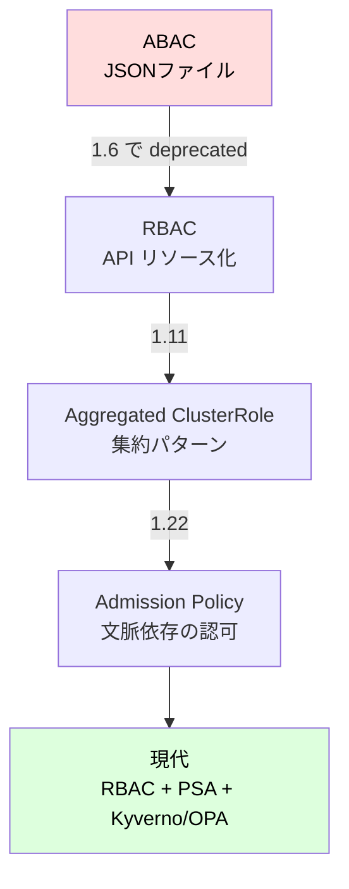
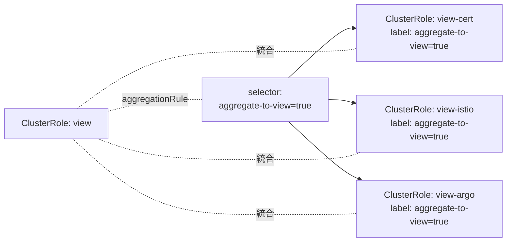
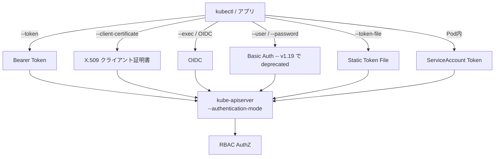
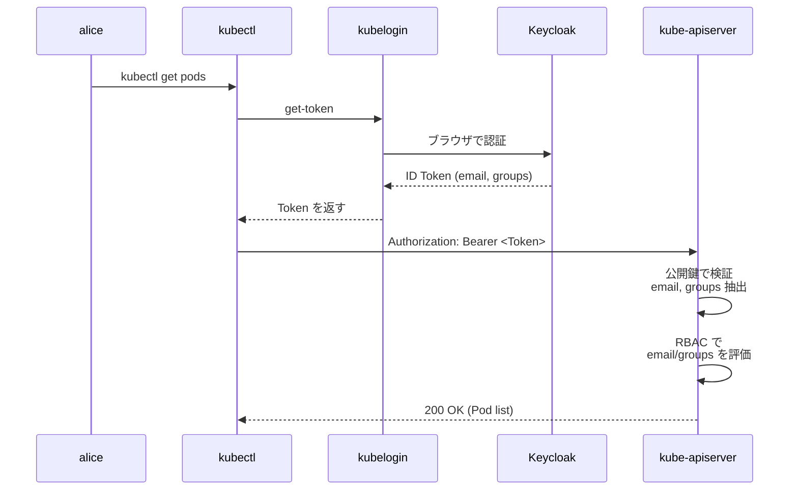
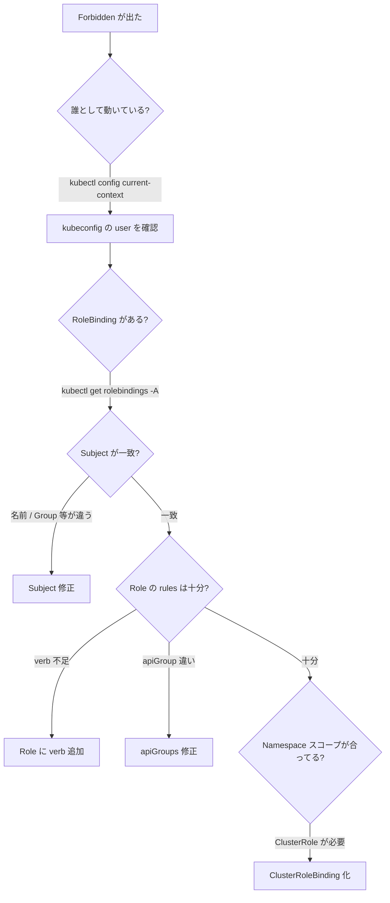

# RBAC
{: .no_toc }

## 目次
{: .no_toc .text-delta }

1. TOC
{:toc}

---

## このページのゴール

このページを読み終えると、以下を **自分の言葉で説明できる** ようになります。

- なぜ Kubernetes が ABAC を捨てて RBAC を選んだのか、その歴史的経緯
- Role / ClusterRole / RoleBinding / ClusterRoleBinding の使い分けと、それぞれの設計意図
- verb / resource / apiGroup / resourceNames / nonResourceURLs の意味と組み合わせ方
- aggregated ClusterRole が解決した運用上の問題
- 外部 IDP(OIDC)と RBAC をどう繋ぐか
- `kubectl auth can-i` の挙動と、デバッグでの使いどころ
- 「最小権限の原則」を Kubernetes で実装する具体手順

---

## なぜ「権限管理」がここまで重要なのか

クラスタを使い始めたばかりの頃は、たいてい全員が `cluster-admin` で操作しています。`~/.kube/config` をコピーすれば誰でもクラスタ管理者です。学習段階ではそれで構いません。

しかし、組織で運用するようになると、すぐに以下のような場面に出くわします。

- 新人エンジニアに開発環境を触らせたいが、本番には触れさせたくない
- アプリ A の Pod がアプリ B の Secret を読めるのは困る
- 監視サービスは Pod の状態だけ見せたい、書き換えはさせたくない
- 監査要件で「誰が何をできるか」をドキュメント化する必要がある
- 退職者の権限を即座に取り消したい

これらをすべて満たすのが **Role-Based Access Control (RBAC)** です。

{: .important }
> RBAC を理解せずに本番クラスタを運用するのは、Linux で全員 root で SSH するようなものです。
> 「動くから良い」では済まされません。

---

## 歴史: ABAC から RBAC、そしてその先へ

### Kubernetes 黎明期 (0.x ~ 1.5): ABAC の時代

Kubernetes 初期の認可機構は **ABAC (Attribute-Based Access Control)** でした。
JSON 行ファイルを API Server のフラグ `--authorization-policy-file` で渡し、そこに「誰が何にアクセスできるか」を書く方式です。

```json
{"apiVersion": "abac.authorization.kubernetes.io/v1beta1", "kind": "Policy",
 "spec": {"user": "alice", "namespace": "*", "resource": "pods", "readonly": true}}
{"apiVersion": "abac.authorization.kubernetes.io/v1beta1", "kind": "Policy",
 "spec": {"user": "bob", "namespace": "prod", "resource": "*"}}
```

これには重大な欠点がありました。

1. **API Server を再起動しないとポリシーが反映されない** — ファイルベースなので
2. **kubectl で操作できない** — JSON を手で書くしかない
3. **可視化が困難** — 「alice は今何ができるのか」を一覧する手段がない
4. **テストできない** — ドライランが存在しない
5. **委譲できない** — クラスタ管理者しか変更できない

つまり、**動的・宣言的・委譲可能** という Kubernetes の理念に反していました。

### Kubernetes 1.6 ~ 1.8: RBAC への移行

2017年、`rbac.authorization.k8s.io` API グループとして RBAC が登場しました。

- ポリシーが **API リソース** として表現される(`Role`、`RoleBinding`)
- `kubectl` で CRUD できる
- 再起動なしで動的に反映される
- `kubectl auth can-i` で問い合わせできる
- Role を作る権限を委譲できる(管理者でなくても、自分の Namespace の Role なら作れる)

これは **「権限管理もまた、Kubernetes リソースである」** という思想の徹底でした。
1.8 で stable になり、ABAC は事実上廃止されました。

### Kubernetes 1.9 ~: 標準 ClusterRole の整備

`cluster-admin` / `admin` / `edit` / `view` という **標準 ClusterRole** が用意され、各組織はこれを土台に運用ロールを組み立てるパターンが定着しました。

### Kubernetes 1.11 ~: Aggregated ClusterRole

「`view` を拡張したいが、毎回新しいバージョンの ClusterRole が出るたびにマージしたくない」という運用上の不満から、**ClusterRole の集約** が導入されました。

ラベルで `view-extra` のような ClusterRole を作ると、自動的に `view` に併合される仕組みです。

### Kubernetes 1.22 ~: より細やかな認可へ

CEL ベースの **ValidatingAdmissionPolicy** や、Kyverno / OPA Gatekeeper など、RBAC では表現できない「文脈依存の認可」(例: 「この Namespace の Pod は image が ghcr.io/myorg/ 配下じゃないとダメ」)はアドミッション層で行う棲み分けが明確になりました。



{: .note }
> RBAC が登場する前、kops や kubespray のようなツールは **デフォルトで RBAC を有効にしない** ことが多く、当時のチュートリアル記事の通りに作るとフル権限のクラスタになってしまうトラップが横行していました。
> 現代では `kubeadm init` がデフォルトで RBAC を有効化します。

---

## RBAC の登場人物 ── 4つのリソース

RBAC は次の4種類のリソースから成ります。

| リソース | スコープ | 用途 |
|----------|----------|------|
| **Role** | Namespace | Namespace 内のリソース操作権限を定義 |
| **ClusterRole** | Cluster | クラスタワイドな権限、または再利用テンプレート |
| **RoleBinding** | Namespace | Role(または ClusterRole)を Subject に付与 |
| **ClusterRoleBinding** | Cluster | ClusterRole を Subject にクラスタ全体で付与 |

```mermaid
flowchart LR
    subgraph "権限定義 (何ができるか)"
        Role[Role<br/>Namespace スコープ]
        ClusterRole[ClusterRole<br/>Cluster スコープ]
    end

    subgraph "Subject (誰に)"
        User[User<br/>alice@example.com]
        Group[Group<br/>developers]
        SA[ServiceAccount<br/>todo-api]
    end

    subgraph "結びつけ"
        RB[RoleBinding<br/>Namespace 内]
        CRB[ClusterRoleBinding<br/>全クラスタ]
    end

    Role -->|参照| RB
    ClusterRole -->|参照| RB
    ClusterRole -->|参照| CRB
    User -->|subjects| RB
    Group -->|subjects| RB
    SA -->|subjects| RB
    User -->|subjects| CRB
    Group -->|subjects| CRB
    SA -->|subjects| CRB
```

ポイントは次の通り。

- **Role 自体には Subject (誰) が書かれない**。Role はあくまで「権限のセット」であり、それを「誰に与えるか」は Binding で別途指定する。これにより同じ Role を複数の User や SA に再利用できる。
- **ClusterRole は RoleBinding からも参照できる**。「同じ権限を複数 Namespace で使いたい」とき、ClusterRole を1つだけ作って各 Namespace で RoleBinding する、というパターンが基本。
- **逆は不可**: Role を ClusterRoleBinding から参照することはできない。

---

## Role の構造を分解する

```yaml
apiVersion: rbac.authorization.k8s.io/v1
kind: Role
metadata:
  name: pod-reader
  namespace: prod
rules:
- apiGroups: [""]
  resources: ["pods", "pods/log"]
  resourceNames: []   # 空 = すべての pod
  verbs: ["get", "list", "watch"]
- apiGroups: ["apps"]
  resources: ["deployments"]
  verbs: ["get", "list"]
```

各フィールドを掘り下げます。

### `apiGroups`

Kubernetes の API は **groups** に分かれています。

| apiGroup | 主なリソース |
|----------|--------------|
| `""` (core) | Pod, Service, ConfigMap, Secret, Node, Namespace, PVC, PV |
| `apps` | Deployment, StatefulSet, DaemonSet, ReplicaSet |
| `batch` | Job, CronJob |
| `networking.k8s.io` | Ingress, NetworkPolicy, IngressClass |
| `rbac.authorization.k8s.io` | Role, ClusterRole, *Binding |
| `storage.k8s.io` | StorageClass, CSIDriver, VolumeAttachment |
| `policy` | PodDisruptionBudget |
| `autoscaling` | HorizontalPodAutoscaler |
| `cert-manager.io` (CRD) | Certificate, ClusterIssuer (拡張) |

`apiGroups: [""]` で core を、`apiGroups: ["apps", "batch"]` で複数を指定可能です。
`apiGroups: ["*"]` ですべての group(慎重に)。

{: .warning }
> CRD で追加されたリソースは独自の apiGroup を持ちます。`cert-manager.io` や `argoproj.io` などにも別途権限を切る必要があり、見落としが多いポイントです。

### `resources`

`apiGroup` 配下のリソース名(小文字、複数形)です。

| 書き方 | 意味 |
|--------|------|
| `pods` | Pod 本体 |
| `pods/log` | Pod のログ取得(`kubectl logs`) |
| `pods/exec` | Pod 内コマンド実行(`kubectl exec`) — 強力 |
| `pods/portforward` | Port-forward — 強力 |
| `pods/eviction` | Pod の eviction(drain 時に使用) |
| `pods/status` | Pod のステータス更新(controller 用) |
| `deployments` | Deployment 本体 |
| `deployments/scale` | レプリカ数のみ変更可 |
| `services/proxy` | Service 経由でのアクセス |

これらの `<resource>/<subresource>` は **別々に権限制御できる** ことを覚えておきましょう。
たとえば「Pod は読めるが exec はさせない」が表現できます。

```yaml
# 「Pod 一覧は見せるが exec/log/portforward はさせない」
rules:
- apiGroups: [""]
  resources: ["pods"]
  verbs: ["get", "list", "watch"]
# pods/exec を含めなければ kubectl exec は通らない
```

### `verbs`

操作の種類。これらは API 上の HTTP メソッドに対応します。

| verb | HTTP | 内容 |
|------|------|------|
| `get` | GET (単一) | 1つのリソースを取得 |
| `list` | GET (一覧) | 一覧取得 |
| `watch` | GET (long-poll) | 変更を購読 |
| `create` | POST | 新規作成 |
| `update` | PUT | 全置換更新 |
| `patch` | PATCH | 部分更新 |
| `delete` | DELETE | 削除 |
| `deletecollection` | DELETE (複数) | 一括削除 |

そして、特殊な verb もあります。

| verb | 用途 |
|------|------|
| `impersonate` | 「別ユーザの権限で操作する」(`kubectl --as`)。管理者だけに |
| `bind` | 特定の ClusterRole を RoleBinding に使う権限。エスカレーション防止 |
| `escalate` | 自分が持っていない権限を Role に書く権利 |
| `approve` (CSR) | 証明書署名要求の承認 |

{: .warning }
> `escalate` と `bind` の verb は、「権限管理権限」を扱うための特別な動詞です。
> 例えば alice が「Role を作る権限」だけ持っていても、`cluster-admin` を参照する RoleBinding は作れません(bind 権限がない)。
> これにより「Role 作成権限さえあれば cluster-admin になれる」という脆弱性を防いでいます。

### `resourceNames`

特定の名前のリソースだけに権限を絞り込めます。

```yaml
# todo-api の Deployment だけ操作可
rules:
- apiGroups: ["apps"]
  resources: ["deployments"]
  resourceNames: ["todo-api", "todo-frontend"]
  verbs: ["get", "update", "patch"]
```

ただし `list` や `watch` は対象が「一覧」なので `resourceNames` が効きません。注意点です。

| 効く verb | get, update, patch, delete |
|-----------|---------------------------|
| 効かない verb | list, watch, create, deletecollection |

### `nonResourceURLs`

ClusterRole 限定で、リソースではない URL(`/healthz`、`/metrics`、`/api`、`/apis` など)へのアクセス権を定義できます。

```yaml
apiVersion: rbac.authorization.k8s.io/v1
kind: ClusterRole
metadata:
  name: healthcheck
rules:
- nonResourceURLs: ["/healthz", "/livez", "/readyz"]
  verbs: ["get"]
```

これは LB のヘルスチェッカや Prometheus が `/metrics` を取得するための権限などに使います。

---

## RoleBinding と ClusterRoleBinding

権限を **誰に** 与えるかを表現する側です。

```yaml
apiVersion: rbac.authorization.k8s.io/v1
kind: RoleBinding
metadata:
  name: read-pods
  namespace: prod
subjects:
- kind: User
  name: alice@example.com
  apiGroup: rbac.authorization.k8s.io
- kind: Group
  name: developers
  apiGroup: rbac.authorization.k8s.io
- kind: ServiceAccount
  name: monitoring
  namespace: monitoring        # cross-namespace SA も可
roleRef:
  kind: Role                    # または ClusterRole
  name: pod-reader
  apiGroup: rbac.authorization.k8s.io
```

`subjects` は3種類:

| kind | apiGroup | 例 |
|------|----------|-----|
| `User` | rbac.authorization.k8s.io | OIDC や X.509 で認証されたユーザ |
| `Group` | rbac.authorization.k8s.io | OIDC のグループクレーム、X.509 の O フィールド |
| `ServiceAccount` | (省略 = "") | `system:serviceaccount:<ns>:<name>` 形式の実質ユーザ |

`roleRef` は変更不可です。Role を変えたい場合は Binding を作り直します(immutable に設計されている理由は、誤って権限を切り替えて事故るのを防ぐため)。

---

## 標準 ClusterRole ── まずこれを知る

Kubernetes 本体には4つの「お買い得セット」 ClusterRole が用意されています。

| ClusterRole | 内容 |
|-------------|------|
| `cluster-admin` | スーパーユーザ。`*` `*` `*`。緊急時のみ |
| `admin` | Namespace 内の admin。Role/RoleBinding も作れる |
| `edit` | リソースの読み書き。RBAC は触れない |
| `view` | 読み取り専用。Secret は除外 |

中身を見てみましょう。

```bash
kubectl get clusterrole view -o yaml
```

**何が起きるか**: `view` ClusterRole の rules 全文が表示されます。Pod、Service、Deployment などの `get/list/watch` が並んでいて、Secret や RBAC は含まれないことが確認できます。

**期待される出力**:

```yaml
apiVersion: rbac.authorization.k8s.io/v1
kind: ClusterRole
metadata:
  annotations:
    rbac.authorization.kubernetes.io/autoupdate: "true"
  labels:
    kubernetes.io/bootstrapping: rbac-defaults
    rbac.authorization.k8s.io/aggregate-to-admin: "true"
    rbac.authorization.k8s.io/aggregate-to-edit: "true"
  name: view
rules:
- apiGroups: [""]
  resources: ["configmaps", "endpoints", "persistentvolumeclaims", "pods", ...]
  verbs: ["get", "list", "watch"]
- ...
```

`aggregate-to-admin` / `aggregate-to-edit` ラベルがあるのは、後述する「集約」の仕組みです。

{: .tip }
> 自社の運用ロールを「ゼロから」設計しようとせず、まず `view` や `edit` の中身を読んで、必要なら **これらに乗っかる集約 ClusterRole** を作るのが最も保守性が高いです。

---

## Aggregated ClusterRole の威力

「`view` を拡張したい。CRD で追加した `Certificate` も読めるようにしたい」と思ったとします。
ナイーブにやるなら `view` を上書きするか、自分用の `view-with-cert` を作って RoleBinding し直す必要があります。

しかし、`view` の YAML を見ると次の記述があります。

```yaml
aggregationRule:
  clusterRoleSelectors:
  - matchLabels:
      rbac.authorization.k8s.io/aggregate-to-view: "true"
```

つまり、`aggregate-to-view: "true"` のラベルが付いた **どんな ClusterRole** も、自動的に `view` の rules に併合される、という仕組みです。

```yaml
apiVersion: rbac.authorization.k8s.io/v1
kind: ClusterRole
metadata:
  name: view-certificates
  labels:
    rbac.authorization.k8s.io/aggregate-to-view: "true"
rules:
- apiGroups: ["cert-manager.io"]
  resources: ["certificates", "issuers"]
  verbs: ["get", "list", "watch"]
```

これを適用するだけで、`view` を持つすべてのユーザが Certificate も見られるようになります。



CRD を追加する Operator(cert-manager、Argo CD、Istio など)は、自分専用の `aggregate-to-view` `aggregate-to-edit` `aggregate-to-admin` ClusterRole を自動で作るのが定番です。

---

## kubectl で RBAC を試す ── ハンズオン

VMware kubeadm クラスタ(第7章で構築済)で実際に手を動かしましょう。

### 1. 検証用 Namespace と ServiceAccount を作る

```bash
kubectl create namespace rbac-demo
kubectl -n rbac-demo create serviceaccount alice
```

**get / create の差**: `create serviceaccount alice` はサーバ側で SA リソースを作ります。`get sa alice -n rbac-demo` で確認できます。

### 2. 何もしない状態で alice の権限を確認

```bash
kubectl auth can-i list pods --as=system:serviceaccount:rbac-demo:alice -n rbac-demo
```

**何が起きるか**: API Server に「この SA は list pods できる?」と問い合わせます。

**期待される出力**:

```
no
```

これがデフォルト。SA は何の権限も持ちません(`automountServiceAccountToken` で API トークンが配られるだけで、認可は別)。

### 3. Role を作って付与

```yaml
# pod-reader.yaml
apiVersion: rbac.authorization.k8s.io/v1
kind: Role
metadata:
  name: pod-reader
  namespace: rbac-demo
rules:
- apiGroups: [""]
  resources: ["pods", "pods/log"]
  verbs: ["get", "list", "watch"]
---
apiVersion: rbac.authorization.k8s.io/v1
kind: RoleBinding
metadata:
  name: alice-can-read
  namespace: rbac-demo
subjects:
- kind: ServiceAccount
  name: alice
  namespace: rbac-demo
roleRef:
  kind: Role
  name: pod-reader
  apiGroup: rbac.authorization.k8s.io
```

```bash
kubectl apply -f pod-reader.yaml
kubectl auth can-i list pods --as=system:serviceaccount:rbac-demo:alice -n rbac-demo
```

**期待される出力**:

```
yes
```

### 4. 削除はできないことを確認

```bash
kubectl auth can-i delete pods --as=system:serviceaccount:rbac-demo:alice -n rbac-demo
```

**期待される出力**:

```
no
```

### 5. 別 Namespace に対しては効かないことを確認

```bash
kubectl auth can-i list pods --as=system:serviceaccount:rbac-demo:alice -n default
```

**期待される出力**:

```
no
```

Role は **Namespace スコープ** なので、同名の Pod を別 Namespace で見るには別の RoleBinding が必要です。

### 6. impersonate(なりすまし)を使う場面

`--as` フラグはあなた自身に **impersonate 権限** が必要です。`cluster-admin` ならデフォルトで持っています。
監査ログでは「impersonator: admin, user: alice」のように記録され、「誰が誰として何をした」が追跡できます。

```bash
# RBAC ポリシーのテストにとても便利
kubectl --as=system:serviceaccount:default:default get pods
```

---

## `kubectl auth can-i` 完全ガイド

RBAC のデバッグ最強ツールです。

### 基本形

```bash
kubectl auth can-i VERB RESOURCE [--subresource=SUB] [-n NAMESPACE] [--as=USER] [--as-group=GROUP]
```

### よく使うパターン

```bash
# 自分自身の権限確認
kubectl auth can-i list pods -n prod

# 別ユーザのシミュレーション
kubectl auth can-i list secrets -n prod --as=alice@example.com

# Group での確認
kubectl auth can-i list pods --as=alice --as-group=developers

# ServiceAccount
kubectl auth can-i list pods -n prod --as=system:serviceaccount:prod:todo-api

# 自分が「できることリスト」を全部出す
kubectl auth can-i --list -n prod

# Subresource (exec など)
kubectl auth can-i create pods --subresource=exec -n prod
```

`auth can-i --list` が特に有用で、「この SA に何を許可してしまっているか」の棚卸しに使えます。

**期待される出力(`--list` の場合)**:

```
Resources                                       Non-Resource URLs   Resource Names   Verbs
selfsubjectaccessreviews.authorization.k8s.io   []                  []               [create]
selfsubjectrulesreviews.authorization.k8s.io    []                  []               [create]
pods                                            []                  []               [get list watch]
...
```

{: .tip }
> 監査やレビューのために `kubectl auth can-i --list --as=system:serviceaccount:<ns>:<sa>` を CI に組み込んでおくと、「SA に余計な権限が増えていないか」をチェックできます。

---

## 認証の話を少しだけ ── User / Group はどこから来るか

RBAC は「権限管理」だけを行います。「あなたが alice であること」は **認証層** が決めます。Kubernetes には次の認証方式があります。



### X.509 クライアント証明書

`kubeadm init` で作られる `admin.conf` がこの方式。証明書の CN がユーザ名、O がグループになります。

```bash
# kubeconfig の証明書から CN/O を確認
kubectl config view --raw -o jsonpath='{.users[0].user.client-certificate-data}' | base64 -d | openssl x509 -noout -subject
# subject=O = system:masters, CN = kubernetes-admin
```

`kubernetes-admin` ユーザが `system:masters` グループに所属し、`system:masters` グループには ClusterRoleBinding `cluster-admin` が付与されているため、`admin.conf` は全権を持つわけです。

### ServiceAccount Token

Pod 内部のアプリが API Server を呼ぶときの認証方式。User名は `system:serviceaccount:<namespace>:<name>` 形式。
詳細は次ページ [ServiceAccount]({{ '/10-security/serviceaccount/' | relative_url }}) で。

### OIDC ── 本番では必須

組織で運用するなら **OIDC が事実上必須** です。Google / Azure AD / Keycloak / Dex / Auth0 などの IdP が発行する ID Token を kubectl が API Server に渡し、API Server が公開鍵で検証してユーザ名とグループを取り出します。

```yaml
# kube-apiserver 設定 (kubeadm の場合 /etc/kubernetes/manifests/kube-apiserver.yaml)
- --oidc-issuer-url=https://keycloak.example.com/realms/k8s
- --oidc-client-id=kubernetes
- --oidc-username-claim=email
- --oidc-groups-claim=groups
```

kubeconfig 側:

```yaml
users:
- name: alice@example.com
  user:
    exec:
      apiVersion: client.authentication.k8s.io/v1
      command: kubelogin           # int128/kubelogin が定番
      args: ["get-token", "--oidc-issuer-url=...", "--oidc-client-id=kubernetes"]
```

ユーザは `kubectl get pods` を叩くと kubelogin がブラウザを開き、ID Token を取得、Bearer Token として API に送ります。API Server が検証して `email` を user 名、`groups` クレームを所属グループに変換、RBAC で評価します。



{: .important }
> 本番クラスタは **個人 X.509 証明書ではなく OIDC** を使ってください。
> 証明書は失効が難しく(CRL を持たない構成が多い)、退職時のオフボーディングが困難です。
> OIDC なら IdP 側でユーザを無効化すれば即座に効きます。

---

## 設計パターン集

### パターン1: 開発者は dev/staging のフル権限、prod は閲覧のみ

```yaml
# 1. ClusterRole を流用 (edit, view は標準)

# 2. dev 用 RoleBinding (Group=developers に edit 付与)
apiVersion: rbac.authorization.k8s.io/v1
kind: RoleBinding
metadata:
  name: dev-edit
  namespace: dev
subjects:
- kind: Group
  name: developers
  apiGroup: rbac.authorization.k8s.io
roleRef:
  kind: ClusterRole
  name: edit
  apiGroup: rbac.authorization.k8s.io
---
# 3. staging 用 (同上)
apiVersion: rbac.authorization.k8s.io/v1
kind: RoleBinding
metadata:
  name: staging-edit
  namespace: staging
subjects:
- kind: Group
  name: developers
  apiGroup: rbac.authorization.k8s.io
roleRef:
  kind: ClusterRole
  name: edit
  apiGroup: rbac.authorization.k8s.io
---
# 4. prod 用 (view のみ)
apiVersion: rbac.authorization.k8s.io/v1
kind: RoleBinding
metadata:
  name: prod-view
  namespace: prod
subjects:
- kind: Group
  name: developers
  apiGroup: rbac.authorization.k8s.io
roleRef:
  kind: ClusterRole
  name: view
  apiGroup: rbac.authorization.k8s.io
```

### パターン2: アプリの SA に必要最小限だけ

「todo-api Pod は、自分の Namespace の Secret `todo-secret` だけ読めればよい」。

```yaml
apiVersion: rbac.authorization.k8s.io/v1
kind: Role
metadata:
  name: todo-api-secret-reader
  namespace: prod
rules:
- apiGroups: [""]
  resources: ["secrets"]
  resourceNames: ["todo-secret"]   # 特定の Secret だけ
  verbs: ["get"]
---
apiVersion: rbac.authorization.k8s.io/v1
kind: RoleBinding
metadata:
  name: todo-api-read-secret
  namespace: prod
subjects:
- kind: ServiceAccount
  name: todo-api
  namespace: prod
roleRef:
  kind: Role
  name: todo-api-secret-reader
  apiGroup: rbac.authorization.k8s.io
```

これで todo-api が侵害されても、漏れるのはこの1つの Secret だけ。

### パターン3: オペレータ用 ClusterRole

cert-manager のようなクラスタワイドのオペレータは、自身の CRD と Pod/Secret を全 Namespace で操作する必要があるため、ClusterRole + ClusterRoleBinding を使います。

```yaml
apiVersion: rbac.authorization.k8s.io/v1
kind: ClusterRole
metadata:
  name: cert-manager-controller
rules:
- apiGroups: ["cert-manager.io"]
  resources: ["*"]
  verbs: ["*"]
- apiGroups: [""]
  resources: ["secrets", "events"]
  verbs: ["*"]
- apiGroups: ["networking.k8s.io"]
  resources: ["ingresses"]
  verbs: ["get", "list", "watch", "update", "patch"]
```

### パターン4: kubectl-debug 的な「踏み台」権限

「インシデント時、オンコールに一時的に prod の exec を許可したい」。

```yaml
# 通常時は不在で、インシデント発生時にだけ apply する
apiVersion: rbac.authorization.k8s.io/v1
kind: RoleBinding
metadata:
  name: incident-exec
  namespace: prod
  annotations:
    expires-at: "2026-01-20T00:00:00Z"   # 慣習として annotation で記載
subjects:
- kind: Group
  name: oncall
  apiGroup: rbac.authorization.k8s.io
roleRef:
  kind: Role
  name: pod-execer
  apiGroup: rbac.authorization.k8s.io
```

24時間後に削除する Job をセットで運用するか、time-bound な仕組み(SPIFFE 等)を使うとなお安全です。

### パターン5: Argo CD / Flux 用の権限

GitOps コントローラはクラスタの全リソースを apply できる必要があるため、`cluster-admin` を付与しがちです。
しかし「Argo CD で何でも作れる」=「Argo CD が侵害されたら全クラスタ侵害」になります。
中規模以上では、**ProjectごとにClusterRoleを切り、Argo CD の AppProject 機能で制御** するのがベストプラクティスです。

---

## 落とし穴とアンチパターン

### アンチパターン1: `cluster-admin` をユーザに直接付与

```yaml
# ❌ やりがちな悪い例
subjects:
- kind: User
  name: bob@example.com
roleRef:
  kind: ClusterRole
  name: cluster-admin
```

これでは bob は誰の Secret も読めますし、誰の Role も書き換えられます。退職時に取り消し忘れたら大惨事です。
**Group に対して、必要最小限の ClusterRole/Role を** 付けるのが正解。

### アンチパターン2: `apiGroups: ["*"]` `resources: ["*"]` `verbs: ["*"]`

ワイルドカードは便利ですが、新しい CRD が追加されたとき意図せず権限が広がるリスクがあります。
できる限り明示列挙してください。

### アンチパターン3: `default` SA を使い回す

Pod に `serviceAccountName` を書かないと `default` SA が使われます。
本番では Pod ごとに専用 SA を作りましょう(詳細は次ページ)。

### アンチパターン4: Secret に対する `list` 権限

```yaml
# ❌ 危険
rules:
- apiGroups: [""]
  resources: ["secrets"]
  verbs: ["list"]
```

`list secrets` は、その Namespace の **全 Secret の中身を返します**。Secret の値そのものを取得できてしまいます。
本当に必要なら `resourceNames` で特定の Secret に限定するか、`get` だけにします。

### アンチパターン5: `escalate` / `bind` の付与忘れ防止策の理解

```yaml
# alice には「Role を作る権限」だけ与えたが、なぜ cluster-admin を bind できないのか?
rules:
- apiGroups: ["rbac.authorization.k8s.io"]
  resources: ["roles", "rolebindings"]
  verbs: ["create", "update"]
```

これだけだと alice は **自分が持っていない権限を新しい Role に書けません** (escalate 制限)。
また、`cluster-admin` を参照する RoleBinding も作れません(bind 制限)。
これは「Role 作成権限さえあれば何でもできる」を防ぐための **安全装置** です。
意図的に解除したい場合は、明示的に `escalate` `bind` を付与します。

### アンチパターン6: Namespace に閉じ込めたつもりが…

```yaml
# ❌ ClusterRole なのに Namespace スコープな気でいる
apiVersion: rbac.authorization.k8s.io/v1
kind: ClusterRoleBinding   # ← Cluster!
metadata:
  name: dev-team
subjects:
- kind: Group
  name: developers
roleRef:
  kind: ClusterRole
  name: edit
```

`ClusterRoleBinding` で `edit` を付けると、**全 Namespace** で edit できてしまいます。
Namespace に閉じたいなら必ず `RoleBinding`(Namespace スコープ)を使ってください。

---

## トラブルシューティング

### 症状: `Error from server (Forbidden): pods is forbidden`

```
Error from server (Forbidden): pods is forbidden:
User "alice@example.com" cannot list resource "pods" in API group "" in the namespace "prod"
```

エラーメッセージ自体が「誰が、何を、どの API グループで、どの Namespace で、何しようとして拒否されたか」を全部教えてくれます。

**調査フロー**:



### 症状: `kubectl auth can-i` は yes と言うのに、実際に呼ぶと Forbidden

考えられる原因:

1. **kubeconfig が違うコンテキスト** — `kubectl config current-context` で確認
2. **Webhook Authorization が別途拒否** — RBAC は OK でも、Cloud 系の Webhook で拒否されることがある
3. **アドミッション側で拒否** — RBAC は通っても PSA / Kyverno で止まることがある。エラーメッセージをよく読む
4. **`--as` でテストしていたが実際の SA トークンが古い**

### 症状: SA が API を呼べない

```bash
# Pod 内部から
kubectl --kubeconfig=/var/run/secrets/kubernetes.io/serviceaccount/... get pods
# Error from server (Forbidden)
```

切り分けチェックリスト:

- [ ] Pod の `serviceAccountName` は意図した SA か? `kubectl get pod <name> -o jsonpath='{.spec.serviceAccountName}'`
- [ ] その SA に RoleBinding はあるか? `kubectl get rolebindings -A -o yaml | grep -A5 <sa-name>`
- [ ] `automountServiceAccountToken: false` になっていないか?
- [ ] Bound Token の有効期限切れ?(kubelet が自動更新するはずだが、稀に問題が)
- [ ] RBAC は問題ないが NetworkPolicy で API Server へのアクセスが切られている?

### デバッグ用コマンド集

```bash
# SA の権限一覧
kubectl auth can-i --list --as=system:serviceaccount:prod:todo-api -n prod

# 特定リソースに対する全 RoleBinding を逆引き
kubectl get rolebindings,clusterrolebindings -A -o json | \
  jq '.items[] | select(.roleRef.name == "edit") | {kind, name, ns: .metadata.namespace, subjects: .subjects}'

# 「pods/exec」を許可している RoleBinding を全部探す
kubectl get clusterroles,roles -A -o json | \
  jq '.items[] | select(.rules[]? | select(.resources[]? == "pods/exec")) | .metadata'

# 監査ログから RBAC 拒否を抽出 (audit log 有効時)
sudo grep '"verb":"list"' /var/log/audit/audit.log | \
  grep -i forbidden | \
  jq -s '[.[] | {user: .user.username, verb, resource: .objectRef.resource, ns: .objectRef.namespace}]'
```

---

## サンプルアプリ「ミニTODOサービス」への適用

第7章の kubeadm クラスタで動いている todo-* に RBAC を適用します。

### 現状の問題

```bash
kubectl get pod todo-api-xxxx -n prod -o jsonpath='{.spec.serviceAccountName}'
# default

kubectl auth can-i list secrets -n prod --as=system:serviceaccount:prod:default
# yes (!)
```

`default` SA が使われており、しかも他の RoleBinding で `edit` 相当が付いている可能性があります。
todo-api が漏洩したらクラスタ全体に影響しかねません。

### 段階的に直す

**Step 1: 専用 SA を作る**

```yaml
# todo-rbac.yaml
apiVersion: v1
kind: ServiceAccount
metadata:
  name: todo-api
  namespace: prod
automountServiceAccountToken: false   # API は使わないので token も配らない
---
apiVersion: v1
kind: ServiceAccount
metadata:
  name: todo-frontend
  namespace: prod
automountServiceAccountToken: false
---
apiVersion: v1
kind: ServiceAccount
metadata:
  name: todo-worker
  namespace: prod
automountServiceAccountToken: false
```

**Step 2: Deployment に SA を指定**

```yaml
apiVersion: apps/v1
kind: Deployment
metadata:
  name: todo-api
  namespace: prod
spec:
  template:
    spec:
      serviceAccountName: todo-api               # ← ここ
      automountServiceAccountToken: false        # ← 念のためここでも
      containers:
      - name: api
        image: 192.168.56.10:5000/todo-api:0.1.0
```

**Step 3: 開発者グループの権限**

```yaml
# developers が prod を view、staging/dev を edit できるように
apiVersion: rbac.authorization.k8s.io/v1
kind: RoleBinding
metadata:
  name: developers-view
  namespace: prod
subjects:
- kind: Group
  name: developers
  apiGroup: rbac.authorization.k8s.io
roleRef:
  kind: ClusterRole
  name: view
  apiGroup: rbac.authorization.k8s.io
---
apiVersion: rbac.authorization.k8s.io/v1
kind: RoleBinding
metadata:
  name: developers-edit
  namespace: staging
subjects:
- kind: Group
  name: developers
  apiGroup: rbac.authorization.k8s.io
roleRef:
  kind: ClusterRole
  name: edit
  apiGroup: rbac.authorization.k8s.io
```

**Step 4: 確認**

```bash
kubectl auth can-i create deployments --as=alice@example.com --as-group=developers -n prod
# no
kubectl auth can-i list pods --as=alice@example.com --as-group=developers -n prod
# yes
kubectl auth can-i create deployments --as=alice@example.com --as-group=developers -n staging
# yes
```

### Kustomize での管理

GitOps でやっていくなら、RBAC マニフェストも当然 Kustomize / Helm 配下に置きます。

```
base/
├── kustomization.yaml
├── namespace.yaml
├── rbac/
│   ├── kustomization.yaml
│   ├── serviceaccounts.yaml
│   ├── role-secret-reader.yaml
│   └── rolebinding-secret-reader.yaml
├── deployments/
│   └── todo-api.yaml
└── ...
```

これを Argo CD で同期させれば、RBAC の変更履歴も全部 Git に残り、監査要件を満たせます。

---

## 監査と棚卸し

定期的に「誰が何をできるか」を棚卸しするためのスクリプト例。

```bash
#!/bin/bash
# rbac-audit.sh
# 全 ServiceAccount に対する権限を一覧化

for ns in $(kubectl get ns -o jsonpath='{.items[*].metadata.name}'); do
  for sa in $(kubectl get sa -n $ns -o jsonpath='{.items[*].metadata.name}'); do
    echo "===== ns=$ns sa=$sa ====="
    kubectl auth can-i --list --as=system:serviceaccount:$ns:$sa -n $ns 2>/dev/null \
      | grep -vE '^(Resources|selfsubject|$)'
  done
done > rbac-audit-$(date +%Y%m%d).txt
```

このアウトプットを Git に commit しておけば、「いつ誰が権限を増やしたか」が diff で追えます。

CNCF の `audit2rbac` ツールを使うと、監査ログから「実際に使われた権限」を逆算して最小 Role を作れます。

```bash
audit2rbac --filename audit.log --user system:serviceaccount:prod:todo-api
```

---

## 高度なトピック

### `SubjectAccessReview` API

`kubectl auth can-i` の内部実装は **`SubjectAccessReview` という API リソース** を作っているだけです。

```yaml
apiVersion: authorization.k8s.io/v1
kind: SubjectAccessReview
spec:
  user: alice@example.com
  groups: ["developers"]
  resourceAttributes:
    namespace: prod
    verb: list
    resource: pods
```

これを `kubectl apply` 的に POST すれば、`status.allowed: true/false` が返ります。
自前のツールから RBAC をチェックするときに使えます。

### `SelfSubjectRulesReview`

「自分は今何ができるのか」を知るための API。`kubectl auth can-i --list` の実装でもあります。

```yaml
apiVersion: authorization.k8s.io/v1
kind: SelfSubjectRulesReview
spec:
  namespace: prod
```

### Webhook Authorization

RBAC では表現できない複雑な認可ロジック(「平日9-18時のみ exec 許可」など)は、Webhook 認可で外部サービスに問い合わせる構成も可能です。
ただし API Server からの同期呼び出しなのでレイテンシに注意。

```yaml
# kube-apiserver 設定
- --authorization-mode=Node,RBAC,Webhook
- --authorization-webhook-config-file=/etc/kubernetes/authz-webhook.yaml
```

### ValidatingAdmissionPolicy (CEL ベース、v1.30 stable)

純粋な RBAC ではないですが、認可と密接に関係する **CEL (Common Expression Language)** で文脈依存の認可がアドミッション層で書けるようになりました。

```yaml
apiVersion: admissionregistration.k8s.io/v1
kind: ValidatingAdmissionPolicy
metadata:
  name: deny-evening-exec
spec:
  failurePolicy: Fail
  matchConstraints:
    resourceRules:
    - apiGroups: [""]
      apiVersions: ["v1"]
      operations: ["CONNECT"]
      resources: ["pods/exec"]
  validations:
  - expression: "request.userInfo.groups.exists(g, g == 'oncall') || request.requestKind.kind != 'PodExecOptions'"
    message: "Pod exec is only allowed for oncall group."
```

---

## RBAC 設計のチェックリスト

実運用前に確認すべき項目です。

- [ ] `cluster-admin` を直接ユーザに付与していない(緊急踏み台のみ)
- [ ] すべての Pod に専用 SA を割り当てている
- [ ] 不要な SA は `automountServiceAccountToken: false`
- [ ] Secret に対する `list` 権限を最小限にしている
- [ ] `pods/exec`, `pods/portforward` の権限は制限している
- [ ] 開発者と本番運用者は別グループ・別 RoleBinding
- [ ] 外部 IDP (OIDC) を導入している(本番)
- [ ] RBAC マニフェストは Git で管理し、変更はレビュー必須
- [ ] 監査ログで RBAC 拒否を可視化している
- [ ] 定期的に `auth can-i --list` で権限の棚卸しをしている
- [ ] CRD を追加する Operator の権限が広すぎないか確認
- [ ] Helm/Kustomize 経由でデフォルト権限を付与する Chart に注意

---

## 演習問題

### 演習1: read-only な monitoring SA

`monitoring` Namespace の `prometheus` SA が、全 Namespace で Pod と Node のメトリクスを取得できるよう設定してください。書き込みは不要。

ヒント:

- `nodes/metrics`, `pods/metrics` のような subresource
- `nonResourceURLs: /metrics` も必要
- Namespace 横断なので ClusterRole + ClusterRoleBinding

### 演習2: dev-team が自分の Namespace に Role を作れる権限

`dev-team` グループのメンバーが、自分たちの `dev` Namespace 内で Role / RoleBinding を自由に作れるようにしてください。
ただし、`cluster-admin` や他の特権 ClusterRole は bind できないように。

ヒント:

- Role/RoleBinding に対する CRUD
- `bind` verb を `view`, `edit` だけに限定

### 演習3: 緊急時の `break-glass` ロール

通常時は誰も使えないが、インシデント時に `break-glass` Group に追加されたユーザだけが prod の `cluster-admin` 相当の権限を持つ ── という構成を考えてください。
24時間後に自動で剥がれる仕組みも検討してみてください。

---

## チェックポイント

ここまでで以下を **自分の言葉で** 説明できるか確認してください。

- [ ] ABAC が捨てられた3つの理由
- [ ] Role と ClusterRole の使い分け、ClusterRole を RoleBinding から参照するパターンの利点
- [ ] verb / resource / apiGroup / resourceNames がそれぞれ何を絞り込むか
- [ ] `escalate` `bind` verb がなぜ存在するか
- [ ] aggregated ClusterRole が解決した運用課題
- [ ] OIDC と RBAC をつなぐ仕組み(ID Token の groups → Group subject)
- [ ] `kubectl auth can-i --list` がどう役立つか
- [ ] `default` SA を使い回すことのリスク

→ 次は [ServiceAccount]({{ '/10-security/serviceaccount/' | relative_url }})
