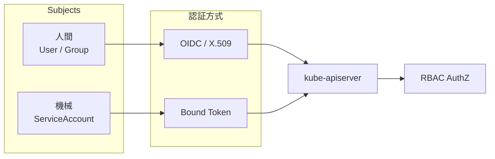
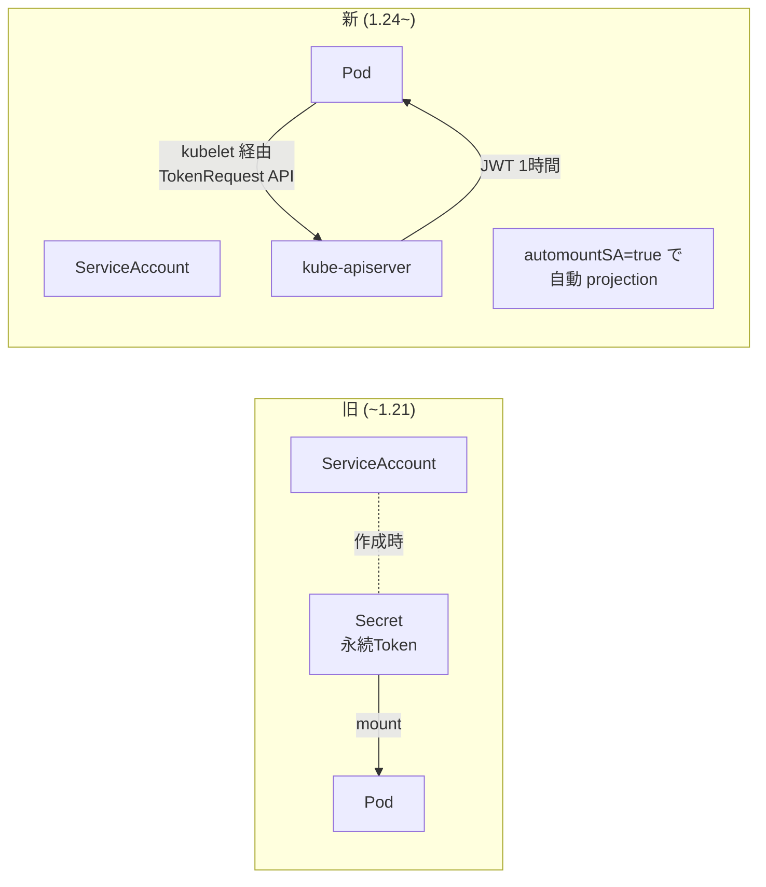
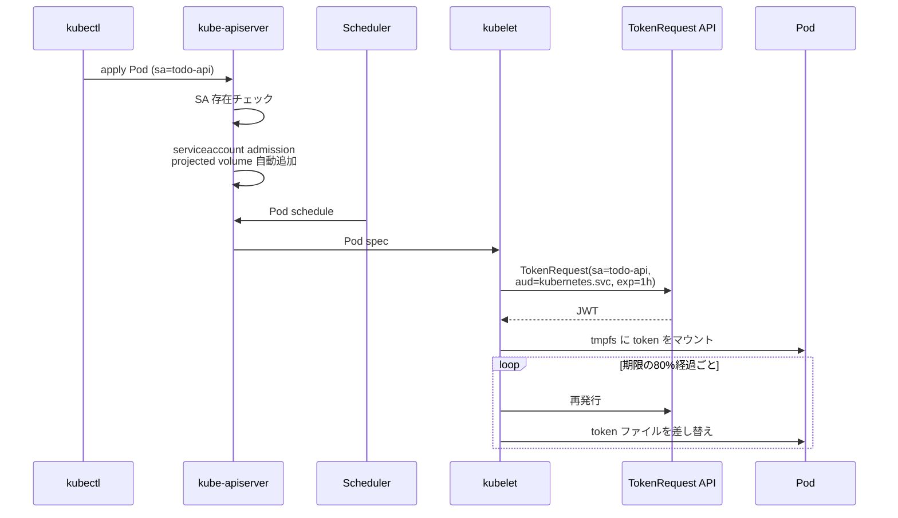
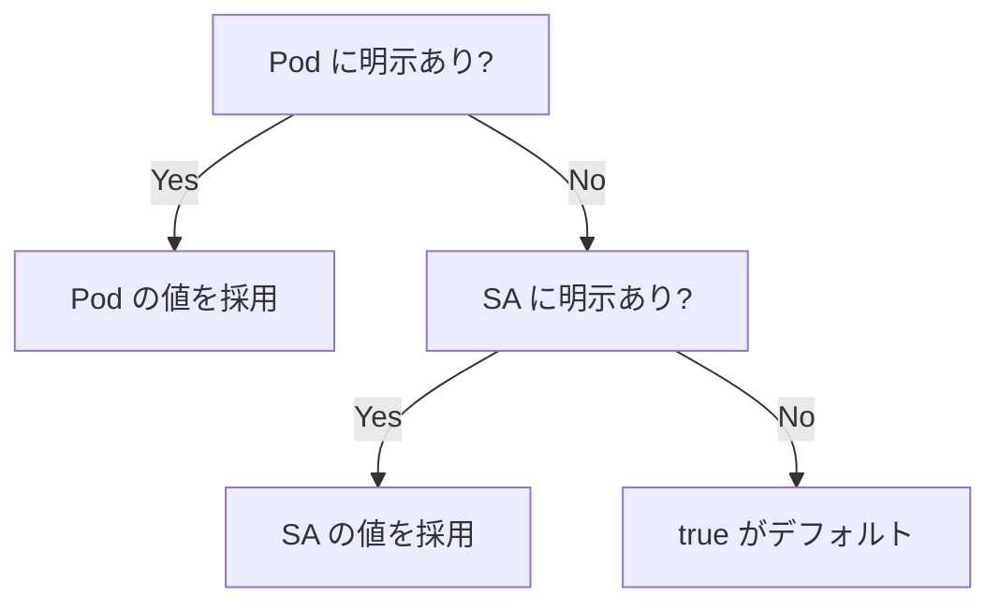
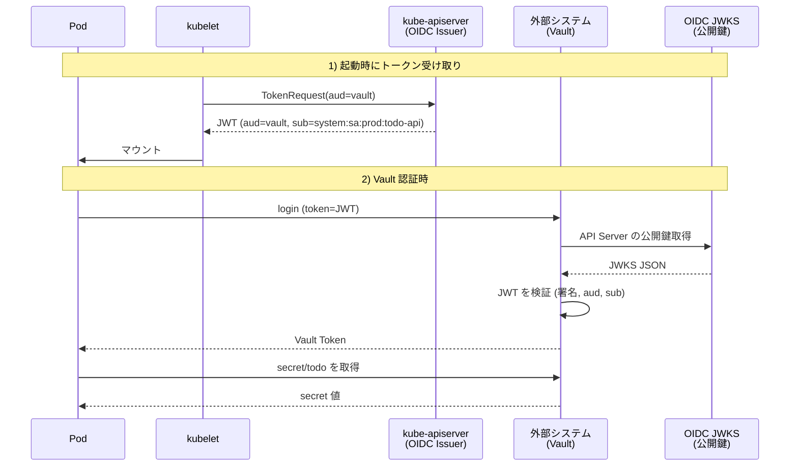
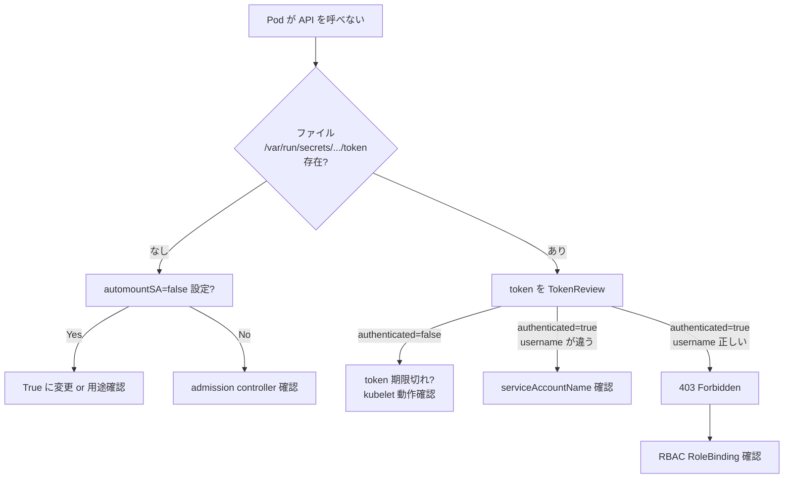
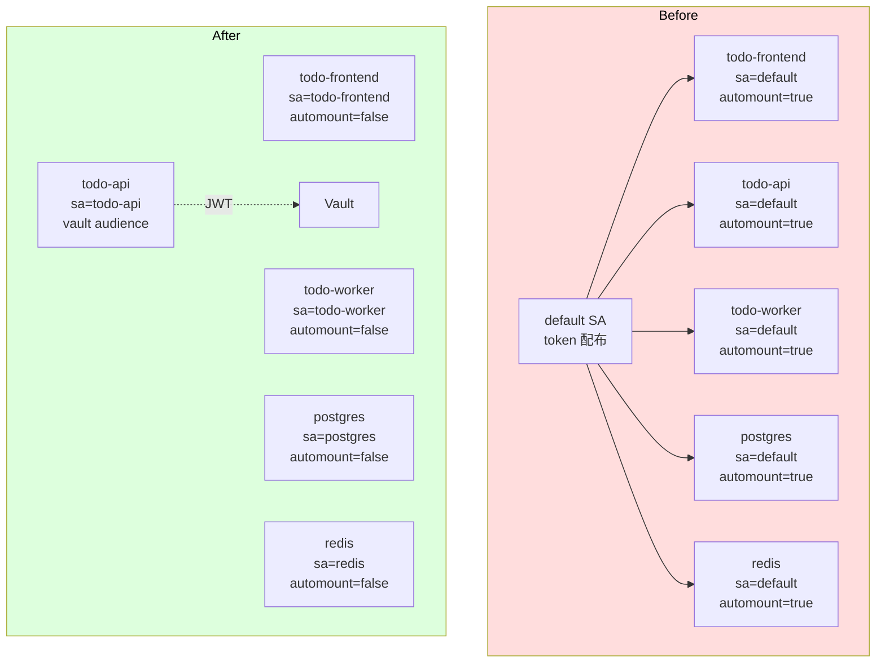

# ServiceAccount
{: .no_toc }

## 目次
{: .no_toc .text-delta }

1. TOC
{:toc}

---

## このページのゴール

このページを読み終えると、以下を **自分の言葉で説明できる** ようになります。

- ServiceAccount (SA) が「Pod の認証主体」として果たす役割
- 旧来の「Secret 連動の永続トークン」がなぜ廃止され、Bound Service Account Token に置き換わったのか
- Projected ServiceAccountToken の構造と、audience / expirationSeconds の意味
- `automountServiceAccountToken: false` をなぜ全 Pod の既定にすべきか
- SA トークンを外部システム(Vault / AWS / GCP)の認証に使う仕組み(Workload Identity 的応用)
- SA まわりのトラブルシュート手順

---

## ServiceAccount とは何か

クラスタの認証主体には「人間 (User)」と「機械 (ServiceAccount)」の2種類があります。



User は **API Server の外側** の Identity Provider が発行しますが、ServiceAccount は **Kubernetes 自身が発行する** 認証主体です。
そして RBAC からは両者を同じ「Subject」として扱えます。

**典型用途**:

- Pod 内のアプリが Kubernetes API を呼ぶときの認証(例: Argo CD コントローラ、cert-manager)
- Pod が外部システム(Vault / AWS Secrets Manager / GCP)を呼ぶときの認証(IRSA / Workload Identity)
- CI/CD パイプラインが kubectl を叩くときの認証

---

## 歴史: SA トークンの三世代

ServiceAccount トークンには、大きく **3つの世代** があります。

### 第1世代 (~ v1.21): Secret 連動の永続トークン

SA を作ると、`secret-controller` が自動的に同名の Secret を作り、その中に長寿命の JWT が入れられていました。

```bash
$ kubectl create sa todo-api -n prod
$ kubectl get secrets -n prod
NAME                  TYPE                                  DATA   AGE
todo-api-token-abc12  kubernetes.io/service-account-token   3      1s
```

そしてその Secret が、SA を使う Pod の `/var/run/secrets/kubernetes.io/serviceaccount/token` に自動でマウントされる仕組みでした。

問題点が **山ほど** ありました。

1. **永続トークン**: 失効しない。漏れたら永久に有効
2. **audience 指定なし**: API Server 用のトークンが、外部システムにも転用できてしまう
3. **etcd 肥大化**: Pod ごと、Namespace ごとに Secret が大量に作られる
4. **監査困難**: トークン使用ログから「どの Pod が使ったか」がわからない
5. **ローテーション困難**: ローテートには Secret を作り直して Pod を再起動

### 第2世代 (v1.20 ~): TokenRequest API による短命トークン

`TokenRequest` API (`v1.20` beta、`v1.22` stable) が導入され、API Server が **オンデマンドで短命トークンを発行** できるようになりました。
さらに `kubectl create token <sa>` というコマンドも追加されました。

```bash
# 1時間有効のトークンを発行
kubectl create token todo-api -n prod --duration=1h
```

ただし、Pod に **自動でマウントされる** のはまだ Secret 由来の永続トークンでした。

### 第3世代 (v1.22 ~ default): Projected ServiceAccountToken

Pod の `volumes` に「projected」タイプを使い、`serviceAccountToken` ソースから **kubelet が API Server に問い合わせて発行・自動更新する短命トークン** をマウントする仕組みが導入されました。

v1.22 で default が切り替わり、v1.24 で **SA 作成時の Secret 自動生成が廃止** されました。



これにより、

- **有効期限あり** (デフォルト1時間)
- **kubelet が自動で更新** (Pod 内のファイルが書き換わる)
- **Pod 削除と同時に無効化** (refresh されないため)
- **audience を指定可能** (転用防止)
- **etcd に Secret が増えない**

という、第1世代の問題が全部解消されました。

{: .important }
> v1.24 以降、`kubectl create sa <name>` で SA を作っても **Secret は自動生成されません**。
> 古いチュートリアル記事を読むと「`kubectl get secret <sa>-token-...` で取れる」と書いてありますが、現代では取れません。

---

## SA の基本

```yaml
apiVersion: v1
kind: ServiceAccount
metadata:
  name: todo-api
  namespace: prod
```

これだけで作成できます。デフォルトでは、

- `automountServiceAccountToken: true` 相当(SA 側で明示すれば override)
- imagePullSecrets: なし
- secrets: なし(v1.24 以降は自動付与されない)

Pod 側で SA を使う:

```yaml
apiVersion: v1
kind: Pod
metadata:
  name: todo-api
spec:
  serviceAccountName: todo-api    # 指定しない場合 default が使われる
  containers:
  - name: api
    image: 192.168.56.10:5000/todo-api:0.1.0
```

### Pod 起動時に起きること(v1.24+)



### マウントされるファイル

```bash
$ kubectl exec todo-api -- ls /var/run/secrets/kubernetes.io/serviceaccount/
ca.crt       # API Server の証明書
namespace    # この Pod の Namespace
token        # 短命 JWT
```

`token` の中身(復号後):

```json
{
  "aud": ["https://kubernetes.default.svc.cluster.local"],
  "exp": 1747200000,
  "iat": 1747196400,
  "iss": "https://kubernetes.default.svc.cluster.local",
  "kubernetes.io": {
    "namespace": "prod",
    "pod": { "name": "todo-api-xxx", "uid": "..." },
    "serviceaccount": { "name": "todo-api", "uid": "..." }
  },
  "nbf": 1747196400,
  "sub": "system:serviceaccount:prod:todo-api"
}
```

`pod` まで埋め込まれているので、「どの Pod がトークンを使ったか」まで監査できます。これも第3世代の大きな進歩です。

---

## `automountServiceAccountToken` を切る

**API を使わない Pod に token をマウントするのは害悪です**。
コンテナ脆弱性で `cat /var/run/secrets/.../token` されれば、SA 権限を奪われます。

明示的に切るには次の3通り。

### 1. SA 単位

```yaml
apiVersion: v1
kind: ServiceAccount
metadata:
  name: todo-api
  namespace: prod
automountServiceAccountToken: false
```

→ この SA を使うすべての Pod に対して token がマウントされない。

### 2. Pod 単位

```yaml
spec:
  automountServiceAccountToken: false
  serviceAccountName: todo-api
```

→ この Pod だけマウントしない。SA 単位設定を上書き可。

### 3. 両方とも明示(推奨)

防御的に書くなら **SA 側と Pod 側の両方で** `false` にしておきます。
誤って別の SA を使ったときの保険になります。

優先順位:



{: .tip }
> 私たちのサンプル「ミニTODOサービス」は Kubernetes API を呼びません(FastAPI、Nginx、PostgreSQL、Redis のいずれも)。
> したがって **全 Pod で automount = false** が正解です。

---

## Projected ServiceAccountToken ── 細かい制御

API Server とは別の audience(対象システム)に向けてトークンを発行したいときは、自分で projected volume を書きます。
たとえば「Vault 用のトークン」を `vault` audience で発行したい場合。

```yaml
apiVersion: v1
kind: Pod
metadata:
  name: todo-api
spec:
  serviceAccountName: todo-api
  automountServiceAccountToken: false      # API Server 用は不要
  containers:
  - name: api
    image: 192.168.56.10:5000/todo-api:0.1.0
    volumeMounts:
    - name: vault-token
      mountPath: /var/run/secrets/vault
      readOnly: true
  volumes:
  - name: vault-token
    projected:
      sources:
      - serviceAccountToken:
          path: token
          audience: vault.example.com
          expirationSeconds: 600           # 10分
```

audience を分けることで、**Vault に渡したトークンを API Server に流用された場合のリスク** を排除できます(audience が違うので API Server が拒否)。

### `expirationSeconds` の最小値

`kube-apiserver` の `--service-account-issuer` 設定にもよりますが、デフォルトでは **600秒 (10分) が最小**、最大は1日です。
さらに kubelet は「期限の 80% に達したら更新」を行います。

| 設定値 | kubelet が更新するタイミング |
|--------|-----------------------------|
| 600 (10分) | 8分経過時 |
| 3600 (1時間、default) | 48分経過時 |
| 86400 (1日、max) | 約19時間後 |

短くしすぎると更新負荷が上がります。**1時間が無難**。

---

## SA を作る・確認する ── ハンズオン

kubeadm クラスタで実際に試します。

### 1. SA を作って中身を見る

```bash
kubectl create namespace sa-demo
kubectl create serviceaccount demo-sa -n sa-demo
kubectl get sa demo-sa -n sa-demo -o yaml
```

**期待される出力**:

```yaml
apiVersion: v1
kind: ServiceAccount
metadata:
  name: demo-sa
  namespace: sa-demo
  uid: 12345-...
```

v1.24+ では `secrets:` フィールドが空 (or 存在しない) ことに注目。

### 2. SA に token を発行させる

```bash
# 1時間有効のトークン
TOKEN=$(kubectl create token demo-sa -n sa-demo --duration=1h)
echo $TOKEN
# eyJhbGciOiJSUzI1NiIsImtpZCI6...
```

JWT の構造を見るために `jwt-cli` や `jq` でデコード:

```bash
echo $TOKEN | cut -d. -f2 | base64 -d 2>/dev/null | jq
```

**期待される出力**:

```json
{
  "aud": ["https://kubernetes.default.svc.cluster.local"],
  "exp": 1747200000,
  "iss": "https://kubernetes.default.svc.cluster.local",
  "kubernetes.io": {
    "namespace": "sa-demo",
    "serviceaccount": {"name": "demo-sa", "uid": "..."}
  },
  "sub": "system:serviceaccount:sa-demo:demo-sa"
}
```

### 3. このトークンで API を叩く(認証だけ通る、認可はまだ)

```bash
APISERVER=$(kubectl config view -o jsonpath='{.clusters[0].cluster.server}')
CACERT=/etc/kubernetes/pki/ca.crt   # k8s-cp1 上で

curl -k -H "Authorization: Bearer $TOKEN" \
  $APISERVER/api/v1/namespaces/sa-demo/pods
```

**期待される出力**(認可なし):

```json
{
  "kind": "Status",
  "status": "Failure",
  "message": "pods is forbidden: User \"system:serviceaccount:sa-demo:demo-sa\" cannot list resource \"pods\" in API group \"\" in the namespace \"sa-demo\"",
  "reason": "Forbidden",
  "code": 403
}
```

認証は通っているが認可で蹴られている、と読み取れます。

### 4. RoleBinding を付けてもう一度

```bash
kubectl create rolebinding demo-view --clusterrole=view --serviceaccount=sa-demo:demo-sa -n sa-demo

curl -k -H "Authorization: Bearer $TOKEN" \
  $APISERVER/api/v1/namespaces/sa-demo/pods
# {"kind":"PodList","items":[]}
```

200 で空リストが返ります。

### 5. Pod の中から API を呼ぶ

```bash
kubectl run probe --image=curlimages/curl:8.7.1 -n sa-demo \
  --overrides='{"spec":{"serviceAccountName":"demo-sa"}}' \
  --command -- sleep 3600

kubectl exec -n sa-demo probe -- /bin/sh -c '
  TOKEN=$(cat /var/run/secrets/kubernetes.io/serviceaccount/token)
  CACERT=/var/run/secrets/kubernetes.io/serviceaccount/ca.crt
  curl --cacert $CACERT -H "Authorization: Bearer $TOKEN" \
    https://kubernetes.default.svc/api/v1/namespaces/sa-demo/pods
'
```

**期待される出力**: pods 一覧。Pod 内部から自動マウントされた token で API が叩けます。

### 6. automount を切ると…

```bash
kubectl delete pod probe -n sa-demo
kubectl run probe --image=curlimages/curl:8.7.1 -n sa-demo \
  --overrides='{"spec":{"serviceAccountName":"demo-sa","automountServiceAccountToken":false}}' \
  --command -- sleep 3600

kubectl exec -n sa-demo probe -- ls /var/run/secrets/kubernetes.io/
# ls: /var/run/secrets/kubernetes.io/: No such file or directory
```

ディレクトリ自体が存在しません。トークン奪取の余地もありません。

---

## SA トークンの外部認証への応用 ── Workload Identity

SA の Bound Token は **JWT** であり、**API Server が発行者** です。
API Server は OIDC IdP としても振る舞え、外部システムが API Server の公開鍵で JWT を検証できます。

これにより、Pod が外部システムに「私は SA `todo-api` です」と認証する仕組みが組めます。
これが AWS の **IRSA (IAM Roles for Service Accounts)**、GCP の **Workload Identity**、HashiCorp **Vault Kubernetes Auth** の正体です。



### Vault Kubernetes Auth の最小構成例

```bash
# Vault 側設定 (vault コマンド)
vault auth enable kubernetes
vault write auth/kubernetes/config \
  kubernetes_host="https://kubernetes.default.svc:443" \
  kubernetes_ca_cert=@/var/run/secrets/kubernetes.io/serviceaccount/ca.crt \
  token_reviewer_jwt=@/var/run/secrets/kubernetes.io/serviceaccount/token \
  issuer="https://kubernetes.default.svc.cluster.local"

# Role 作成: 「prod の todo-api SA を todo-api Vault Role にマッピング」
vault write auth/kubernetes/role/todo-api \
  bound_service_account_names=todo-api \
  bound_service_account_namespaces=prod \
  policies=todo-api \
  ttl=24h
```

Pod 側は projected token を `vault` audience で発行し、Vault に渡します。
詳細は [Secret管理]({{ '/10-security/secret-management/' | relative_url }}) で扱います。

### Workload Identity 全般のメリット

- Pod に **永続的な認証情報を埋め込まなくて済む**(AWS の Access Key を Secret に入れる必要なし)
- 認証情報は **Kubernetes と外部システム双方の管理者** が共同で制御
- 監査ログで「どの SA が、いつ、何を取得したか」が両側に残る

---

## SA とイメージ Pull Secret

SA は **imagePullSecrets** を持てます。

```yaml
apiVersion: v1
kind: ServiceAccount
metadata:
  name: todo-api
  namespace: prod
imagePullSecrets:
- name: ghcr-creds          # ghcr.io のクレデンシャル
```

Pod ごとに `imagePullSecrets` を書かなくても、この SA を使う Pod は自動でレジストリ認証に使えます。
private registry を組織で使うときの定番パターン。

```bash
# レジストリ認証 Secret を作る
kubectl create secret docker-registry ghcr-creds \
  --docker-server=ghcr.io \
  --docker-username=<USER> \
  --docker-password=<TOKEN> \
  -n prod

# SA に紐付け
kubectl patch sa todo-api -n prod -p '{"imagePullSecrets":[{"name":"ghcr-creds"}]}'
```

---

## トラブルシュート

### 症状1: `MountVolume.SetUp failed for volume "kube-api-access-..."`

```
Warning  FailedMount  pod/todo-api  MountVolume.SetUp failed for volume "kube-api-access-xxxxx" :
  secret "todo-api-token" not found
```

→ おそらく v1.24 以前の流儀で書かれた Pod または旧 Helm chart。SA に紐づく Secret を期待してマウントしようとしているが、v1.24 で自動生成されなくなった。

**対処**:

1. Pod の `volumes` を見て `secret:` で `<sa>-token-...` を指定していないか確認
2. していたら projected volume に書き換え、もしくは自動マウント機能 (`automountSA`) に任せる
3. 古い Chart なら chart のバージョンを更新

### 症状2: Pod 内で API を叩くと 401 (認証失敗)

```
Unauthorized
```

切り分け:

```bash
# 1. token がマウントされているか
kubectl exec <pod> -- ls /var/run/secrets/kubernetes.io/serviceaccount/

# 2. token は何者として認証される?
TOKEN=$(kubectl exec <pod> -- cat /var/run/secrets/kubernetes.io/serviceaccount/token)
kubectl create -f - <<EOF
apiVersion: authentication.k8s.io/v1
kind: TokenReview
spec:
  token: $TOKEN
EOF
```

`status.authenticated: true` で `username` が出れば認証 OK。

### 症状3: 1時間後に Pod が API 呼べなくなる

→ クライアントライブラリが token をキャッシュして再読み込みしていない。
projected token は kubelet が **ファイルを書き換える** ので、アプリは **毎リクエスト前に token を読み直すか、定期的にファイルを reload** する必要がある。
公式の client-go や python-kubernetes は対応済み。自前 HTTP リクエストの場合は注意。

### 症状4: `kubectl get sa <name> -o yaml` に `secrets:` が見当たらない

正常。v1.24+ では自動付与されません。
必要なら手動で Secret を作って imagePullSecrets に登録します。

### 症状5: SA を使うはずの Pod が `default` SA になっている

Pod spec の `serviceAccountName` 指定漏れ、または admission controller によって書き換えられている可能性。

```bash
kubectl get pod <name> -o jsonpath='{.spec.serviceAccountName}'
```

### デバッグフローチャート



---

## SA まわりの設計パターン

### パターンA: API を使わない一般アプリ(80% の Pod)

```yaml
apiVersion: v1
kind: ServiceAccount
metadata:
  name: todo-frontend
  namespace: prod
automountServiceAccountToken: false
```

`default` の代わりに専用 SA を作っておくと、後から「実は API 使いたい」となっても柔軟に変更できます。

### パターンB: 自クラスタの API を使うコントローラ

cert-manager や Argo CD などの「自分の Namespace の外のリソースも操作する」コントローラ用。

```yaml
apiVersion: v1
kind: ServiceAccount
metadata:
  name: argocd-application-controller
  namespace: argocd
# automount = true (default)
```

必ず ClusterRole + ClusterRoleBinding を **最小権限で** 紐付けます。

### パターンC: 外部システムを呼ぶアプリ(Workload Identity)

```yaml
apiVersion: v1
kind: ServiceAccount
metadata:
  name: todo-api
  namespace: prod
automountServiceAccountToken: false   # API Server 用は無効化
---
apiVersion: apps/v1
kind: Deployment
spec:
  template:
    spec:
      serviceAccountName: todo-api
      containers:
      - name: api
        volumeMounts:
        - name: vault-token
          mountPath: /var/run/secrets/vault
      volumes:
      - name: vault-token
        projected:
          sources:
          - serviceAccountToken:
              path: token
              audience: vault.example.com
              expirationSeconds: 3600
```

API Server 用ではなく、Vault 用 audience の token のみを projected で発行・マウントします。

### パターンD: CI/CD パイプライン用

外部 CI(GitHub Actions など)から kubectl を叩く場合、長寿命の永続トークンを発行する誘惑にかられますが、**必ず短命トークンを動的に発行** すべきです。

```bash
# CI 起動時に発行
kubectl create token ci-runner -n ci --duration=15m > /tmp/k8s.token

# kubeconfig を一時生成
kubectl config set-cluster prod --server=$APISERVER --certificate-authority=$CACERT
kubectl config set-credentials ci --token=$(cat /tmp/k8s.token)
kubectl config set-context ci --cluster=prod --user=ci
kubectl config use-context ci

# 仕事をする
kubectl apply -f deployment.yaml
```

15分後に勝手に失効するので、ログから token が漏れても短時間しか有効になりません。

### パターンE: クロス Namespace SA

`monitoring` Namespace の Prometheus が、`prod` Namespace の Pod メトリクスを取りたい場合。

```yaml
apiVersion: rbac.authorization.k8s.io/v1
kind: RoleBinding
metadata:
  name: prometheus-can-read
  namespace: prod
subjects:
- kind: ServiceAccount
  name: prometheus
  namespace: monitoring        # クロス Namespace 参照
roleRef:
  kind: ClusterRole
  name: view
  apiGroup: rbac.authorization.k8s.io
```

SA は別 Namespace でも RoleBinding の subject になれます。

---

## サンプルアプリへの適用 ── ミニTODOサービス

第7章で動かしている各 Pod の SA を整備しましょう。

### 現状の問題と Before/After



### 全 Pod の SA マニフェスト

`base/rbac/serviceaccounts.yaml`:

```yaml
apiVersion: v1
kind: ServiceAccount
metadata:
  name: todo-frontend
  namespace: prod
  labels:
    app.kubernetes.io/name: todo-frontend
    app.kubernetes.io/part-of: todo
automountServiceAccountToken: false
---
apiVersion: v1
kind: ServiceAccount
metadata:
  name: todo-api
  namespace: prod
  labels:
    app.kubernetes.io/name: todo-api
    app.kubernetes.io/part-of: todo
# Vault と通信するため automount は true のままにし、
# 別途 projected volume で vault audience の token を発行
---
apiVersion: v1
kind: ServiceAccount
metadata:
  name: todo-worker
  namespace: prod
  labels:
    app.kubernetes.io/name: todo-worker
    app.kubernetes.io/part-of: todo
automountServiceAccountToken: false
---
apiVersion: v1
kind: ServiceAccount
metadata:
  name: postgres
  namespace: prod
  labels:
    app.kubernetes.io/name: postgres
    app.kubernetes.io/part-of: todo
automountServiceAccountToken: false
---
apiVersion: v1
kind: ServiceAccount
metadata:
  name: redis
  namespace: prod
  labels:
    app.kubernetes.io/name: redis
    app.kubernetes.io/part-of: todo
automountServiceAccountToken: false
```

### Deployment 側の修正

```yaml
apiVersion: apps/v1
kind: Deployment
metadata:
  name: todo-frontend
  namespace: prod
spec:
  template:
    spec:
      serviceAccountName: todo-frontend
      automountServiceAccountToken: false    # 二重防御
      containers:
      - name: frontend
        image: 192.168.56.10:5000/todo-frontend:0.1.0
---
apiVersion: apps/v1
kind: Deployment
metadata:
  name: todo-api
  namespace: prod
spec:
  template:
    spec:
      serviceAccountName: todo-api
      automountServiceAccountToken: false   # API Server 用 token は不要
      containers:
      - name: api
        image: 192.168.56.10:5000/todo-api:0.1.0
        volumeMounts:
        - name: vault-token
          mountPath: /var/run/secrets/vault
          readOnly: true
      volumes:
      - name: vault-token
        projected:
          sources:
          - serviceAccountToken:
              path: token
              audience: vault.vault.svc:8200
              expirationSeconds: 3600
```

### 適用と確認

```bash
kubectl apply -k overlays/prod

# Pod 内に余計な token がないか
kubectl exec -n prod $(kubectl get pod -n prod -l app.kubernetes.io/name=todo-frontend -o name) -- \
  ls /var/run/secrets/kubernetes.io/ 2>&1 || echo "no API token: OK"

# todo-api には vault 用の token がある
kubectl exec -n prod $(kubectl get pod -n prod -l app.kubernetes.io/name=todo-api -o name) -- \
  ls /var/run/secrets/vault/
# token

# vault audience の token をデコードして確認
kubectl exec -n prod $(kubectl get pod -n prod -l app.kubernetes.io/name=todo-api -o name) -- \
  cat /var/run/secrets/vault/token | cut -d. -f2 | base64 -d 2>/dev/null | jq .aud
# ["vault.vault.svc:8200"]
```

---

## さらに深掘り

### `kubectl get serviceaccounts` の RBAC 影響

`default` SA を見るには `get serviceaccounts` 権限が必要です。
PSA で restricted を当てた Namespace でも、Pod が作られる際に内部的に SA を参照するので、Namespace に SA が無いと Pod が作れません。
**Namespace と同時に専用 SA を作る** クセを付けるとよいです。

### SA の名前規約

CNCF の Operator 系は概ね `<app>-<role>` 形式を採用。

| 例 | 説明 |
|----|------|
| `argocd-server` | Argo CD の API サーバ用 |
| `argocd-application-controller` | Argo CD のコントローラ用 |
| `cert-manager-controller` | cert-manager のコントローラ用 |
| `external-secrets` | ESO の本体用 |

自社アプリでも `<app>-<component>` で揃えると、後で audit / IaC の visibility が良くなります。

### `system:serviceaccount:` プレフィックスの意味

RBAC subjects の評価では、SA は内部的に
- ユーザ名: `system:serviceaccount:<namespace>:<name>`
- グループ: `system:serviceaccounts`, `system:serviceaccounts:<namespace>`, `system:authenticated`

として扱われます。`system:authenticated` は「とにかく認証済の何者か」を指す Group なので、これに大きな ClusterRole を当てるのは **絶対に避けるべき** です(全 SA に権限が漏れる)。

```yaml
# ❌ 絶対 NG
apiVersion: rbac.authorization.k8s.io/v1
kind: ClusterRoleBinding
metadata:
  name: too-much-power
subjects:
- kind: Group
  name: system:authenticated
roleRef:
  kind: ClusterRole
  name: cluster-admin
```

### NodeRestriction admission の話

kubelet が自分自身の Node Object を更新する権限など、SA とは別に、**Node 認証主体** が `system:node:<node-name>` として認証されます。
NodeRestriction admission plugin が「kubelet は自分の Pod / Node しか触れない」を強制しています。

これも本来は SA の延長で語られるトピックです。

### Pod-bound vs Node-bound Token

`expirationSeconds` の他に `boundObjectRef` という仕組みもあり、token を「特定の Pod がいる間だけ有効」にできます。
普段は kubelet が自動でやってくれますが、自前で TokenRequest を呼ぶときに使えます。

```yaml
apiVersion: authentication.k8s.io/v1
kind: TokenRequest
spec:
  audiences: ["vault"]
  expirationSeconds: 3600
  boundObjectRef:
    apiVersion: v1
    kind: Pod
    name: todo-api-xxxxx
    uid: "..."
```

---

## チェックポイント

ここまでで以下を **自分の言葉で** 説明できるか確認してください。

- [ ] User と ServiceAccount の違い、どちらも RBAC の subject になれること
- [ ] 永続トークン(第1世代)の5つの問題点
- [ ] Bound Service Account Token (第3世代) の構造と利点
- [ ] `automountServiceAccountToken: false` の SA 単位 / Pod 単位の優先順位
- [ ] projected volume の `audience` がなぜ大事か
- [ ] Workload Identity / IRSA / Vault K8s Auth が SA トークンを使う仕組み
- [ ] v1.24 以降で `kubectl get secret <sa>-token-...` ができなくなった理由

→ 次は [Pod Security Standards]({{ '/10-security/pss/' | relative_url }})
