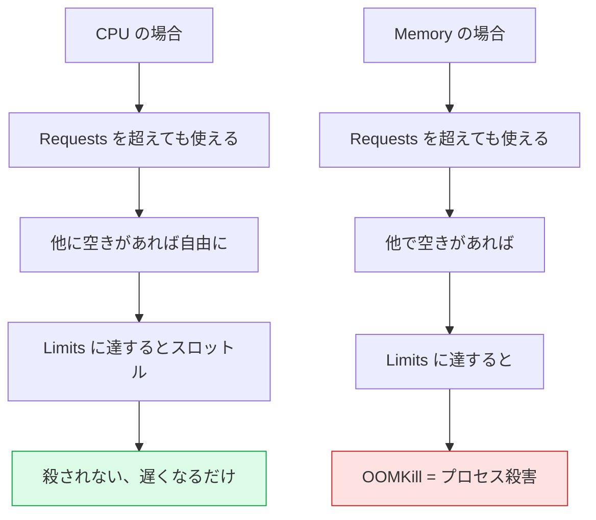
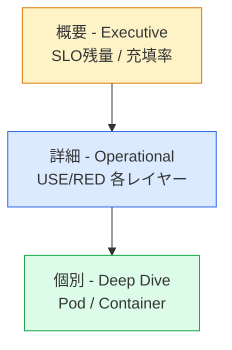
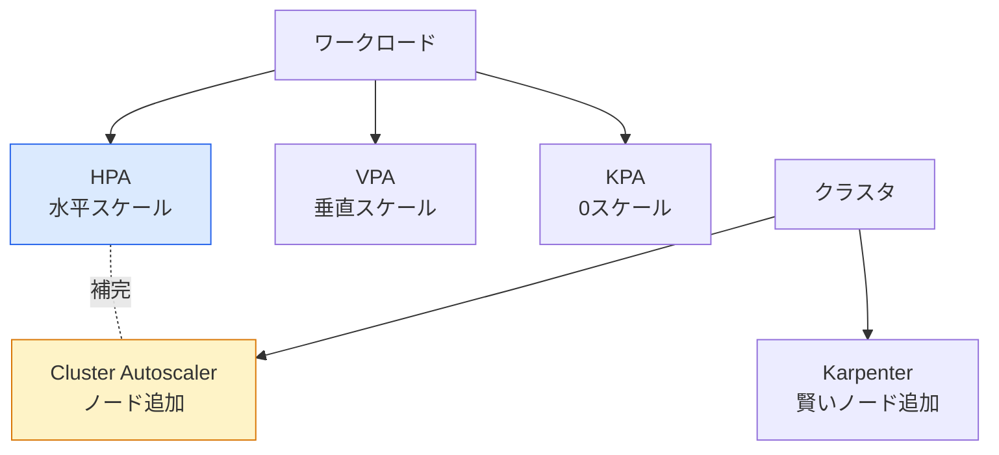
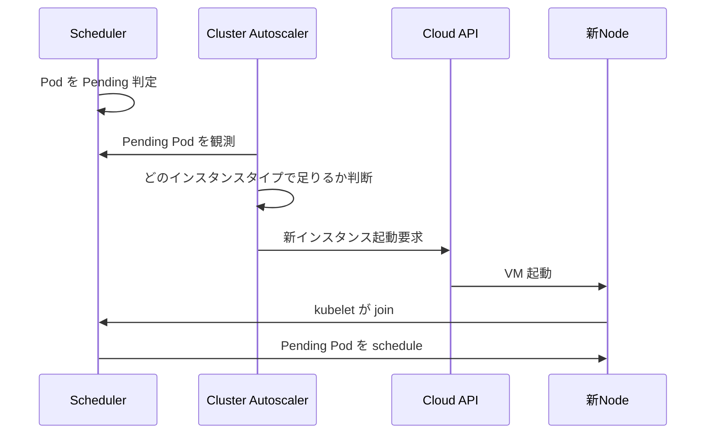

# キャパシティ計画
{: .no_toc }

## 目次
{: .no_toc .text-delta }

1. TOC
{:toc}

---

## このページのゴール

このページを読み終えると、以下を **自分の言葉で説明できる** ようになります。

- キャパシティ計画(Capacity Planning)が **なぜ「予測」と「計測」の両輪で進める必要があるのか**、その歴史的経緯と理論的根拠
- Kubernetes クラスタにおいて **どのレイヤーで何を測るか**(Node / Pod / etcd / API Server / Scheduler / Network / Storage)
- `Requests` と `Limits` の意味を **スケジューラの観点** から正確に説明できる
- CPU と Memory が **それぞれ枯渇したときに何が起きるか** の違い(throttle vs OOMKill)
- PromQL を使った **充填率・予測・トレンド** のクエリを 30 本以上書ける
- Grafana ダッシュボードを「概要 / 詳細 / 個別」の三層で設計できる
- Cluster Autoscaler / Karpenter / Vertical Pod Autoscaler / Horizontal Pod Autoscaler の役割と使い分け
- etcd のサイジング、コンパクション、デフラグの判断基準と手順
- ローカル VMware 環境で擬似的にオートスケーリングを試す方法
- キャパシティ予測の数学的アプローチ(線形回帰、季節性、Holt-Winters)の概念

---

## キャパシティ計画とは何か、なぜ必要か

### 一言で言うと

**「いつ、何が足りなくなるかを予測し、足りなくなる前に手を打つ」** 活動です。

逆に言うと、これをやらないと:

- 突然 Pod が Pending のままになる
- スケジューラが新規 Pod を受け付けなくなる
- etcd の DB サイズが上限を超え、書き込み停止
- API Server のレイテンシが悪化、kubectl すら遅くなる
- 深夜に「ノード追加してください」コールが来る

つまり、**キャパシティ計画は障害予防** です。

### キャパシティ計画の歴史

#### メインフレーム時代(1960〜80 年代)

メインフレームは超高価で、1 台に何百〜何千人のユーザーを乗せる時代。
キャパシティプランナー(Capacity Planner)という専門職が存在し、**Erlang 計算式や行列モデル** で利用率を予測していました。
ハードウェア追加は数ヶ月かかるリードタイムが当たり前で、半年〜1 年先を見越して発注する必要がありました。

#### サーバ時代(1990〜2000 年代)

x86 サーバが普及し、必要なら 1 台ずつ買い足せる時代に。
それでも調達から設置まで 2〜6 週間かかるため、**「半年先のサイジング」** が必須でした。
ハードウェアベンダーが提供する「Capacity Planning ツール」が一般的でした。

#### クラウド時代(2006 年〜)

AWS EC2 のローンチで、**分単位での調達** が可能に。
キャパシティ計画は「半年先の発注」から「数時間先のオートスケール」へ変化。
しかし、コストの観点で **「無計画にスケールアウト」では予算がもたない** ため、依然として計画は必要。

#### Kubernetes 時代(2014 年〜)

Pod 単位でリソース要求を宣言する → **クラスタ全体の充填率** で見る必要が出てきた。
さらに以下の特殊事情:

- 動的なスケジューリング(Pod がどのノードに乗るかは事前確定しない)
- リソースの過剰申請(over-provisioning)
- リソースの過小申請(under-provisioning)
- マルチテナント(複数チームが同じクラスタを使う)
- スポットインスタンスとの組み合わせ(クラウドのみ)

これらにより、**伝統的なキャパシティ計画手法そのままでは対応できない** 場面が出てきました。

### Google SRE のアプローチ

Google SRE 本(第 11 章 Being On-Call、第 22 章 Capacity Planning)では、以下のように整理されています。

> Capacity planning ensures that we have enough resources to serve our users, even at peak loads.

3 つの要素:

1. **需要予測(Demand Forecasting)**: 何ヶ月先までにどれだけ必要か
2. **リソース配置(Resource Allocation)**: それをどの DC / Region / クラスタに置くか
3. **継続的検証(Continuous Verification)**: 予測が当たっているか、計画通りに進んでいるか

本書のローカル kubeadm 環境では、(1) と (3) を中心に扱います。
(2) のマルチリージョン / マルチクラスタ配置はクラウドの話なので、第 12 章(マルチクラスタ)で扱います。

---

## Kubernetes のリソースモデルの基本

キャパシティを語る前に、Kubernetes が「リソース」をどう扱っているかを正確に理解する必要があります。

### Requests と Limits

`Pod.spec.containers[].resources` で指定する値:

```yaml
apiVersion: v1
kind: Pod
metadata:
  name: todo-api
spec:
  containers:
  - name: api
    image: 192.168.56.10:5000/todo-api:0.1.0
    resources:
      requests:
        cpu: "100m"          # 0.1 vCPU
        memory: "128Mi"      # 128 メビバイト
      limits:
        cpu: "500m"          # 0.5 vCPU
        memory: "256Mi"      # 256 メビバイト
```

#### Requests の正体

- **スケジューラが「このノードに置けるか」を判断する基準**
- ノードの Allocatable から、そのノード上の全 Pod の Requests 合計を引いた値が「空き」
- 空き ≥ Requests なら配置できる

**重要**: Requests は **予約** であり、**実際の消費量ではない**。

#### Limits の正体

- **kubelet とコンテナランタイムが「使いすぎ」を抑える上限**
- CPU の超過 → **throttle**(処理を遅らせる、殺さない)
- Memory の超過 → **OOMKill**(プロセスを殺す)

### CPU と Memory の挙動の違い



これは **キャパシティ計画上もっとも重要な区別** です:

- **CPU 不足** = サービス遅延(SLO のレイテンシに影響)
- **Memory 不足** = サービス停止(SLO の可用性に影響)

### QoS Class(Quality of Service)

Pod は以下の 3 クラスに自動分類されます。

| QoS Class | 条件 | Eviction 順 |
|-----------|------|-------------|
| **Guaranteed** | 全コンテナで requests = limits、CPU/Memory 両方指定 | **最後** |
| **Burstable** | requests < limits、または一部だけ指定 | 中間 |
| **BestEffort** | requests も limits も無指定 | **最初** |

```bash
# Pod の QoS Class 確認
kubectl get pod todo-api-xxx -n prod -o jsonpath='{.status.qosClass}'
```

ノードがメモリ枯渇したとき、kubelet は BestEffort → Burstable(超過量順) → Guaranteed の順で Evict します。
**ミッションクリティカルな Pod は Guaranteed にする** のが本番の原則。

### Allocatable と Capacity の違い

ノードには 2 つのリソース概念があります。

```bash
kubectl describe node k8s-w1 | grep -A 10 Capacity:
```

期待出力:

```
Capacity:
  cpu:                4
  ephemeral-storage:  40960Mi
  memory:             8000000Ki
  pods:               110
Allocatable:
  cpu:                3800m
  ephemeral-storage:  37683Mi
  memory:             7616000Ki
  pods:               110
```

- **Capacity**: ノードの物理リソース総量
- **Allocatable**: Pod に割り当て可能な量 = Capacity − (kube-reserved + system-reserved + eviction-threshold)

スケジューラが見るのは **Allocatable** です。
キャパシティ計画では Allocatable を分母にします。

### kube-reserved と system-reserved

kubelet には以下のフラグがあります:

```
--kube-reserved=cpu=200m,memory=512Mi,ephemeral-storage=1Gi
--system-reserved=cpu=200m,memory=512Mi,ephemeral-storage=1Gi
--eviction-hard=memory.available<100Mi,nodefs.available<10%
```

- `kube-reserved`: kubelet / kube-proxy / containerd 用
- `system-reserved`: OS / sshd / systemd 用
- `eviction-hard`: ここを下回ると Pod を強制 Evict

これらを設定しないと、**Pod が「使い切る」ことで OS まで死ぬ** ことがあります。
ローカル kubeadm でも本番運用想定なら必ず設定すべき。

```yaml
# /var/lib/kubelet/config.yaml に追記
systemReserved:
  cpu: 200m
  memory: 512Mi
  ephemeral-storage: 1Gi
kubeReserved:
  cpu: 200m
  memory: 512Mi
  ephemeral-storage: 1Gi
evictionHard:
  memory.available: "100Mi"
  nodefs.available: "10%"
  imagefs.available: "15%"
```

設定後 `systemctl restart kubelet`。

---

## 観測すべき指標

レイヤーごとに整理します。

```mermaid
flowchart TB
    cluster[クラスタ全体]
    cluster --> nl[ノードレイヤー]
    cluster --> pl[Pod レイヤー]
    cluster --> cp[コントロールプレーン]
    cluster --> nw[ネットワーク]
    cluster --> st[ストレージ]
    
    nl --> nl1[CPU 充填率]
    nl --> nl2[Memory 充填率]
    nl --> nl3[Disk 使用率]
    nl --> nl4[Pod 数充填率]
    
    pl --> pl1[Pod 数]
    pl --> pl2[Requests 充填率]
    pl --> pl3[実消費 / Requests 比]
    pl --> pl4[Eviction 件数]
    
    cp --> cp1[etcd DB サイズ]
    cp --> cp2[API Server p99 latency]
    cp --> cp3[Scheduler 待ち時間]
    cp --> cp4[Controller queue depth]
    
    nw --> nw1[Pod CIDR 使用率]
    nw --> nw2[Service IP 使用率]
    nw --> nw3[conntrack 使用率]
    
    st --> st1[PV 容量使用率]
    st --> st2[StorageClass 別空き]
    st --> st3[IOPS 飽和]
```



### ノードレイヤー指標

| 指標 | 警戒水準 | 行動 |
|------|----------|------|
| CPU Requests 充填率 | 70% 超 | 増設検討 |
| CPU Requests 充填率 | 85% 超 | 増設発注 |
| Memory Requests 充填率 | 70% 超 | 増設検討 |
| Memory Requests 充填率 | 85% 超 | 増設発注 |
| Pod 数 / Capacity | 80% 超 | 増設検討 |
| Disk 使用率 | 80% 超 | クリーンアップ / 増設 |
| Inode 使用率 | 80% 超 | 古いコンテナイメージ削除 |
| 実 CPU 使用率 | 80% 超 | アプリの limit 見直し |
| 実 Memory 使用率 | 80% 超 | アプリの limit 見直し |

**Requests 充填率と実使用率は別物** であることに注意。
Requests 充填率は「スケジューラが満員と判断する」基準、実使用率は「ノードが実際に苦しくなる」基準。

### Pod レイヤー指標

| 指標 | 警戒水準 |
|------|----------|
| Pod 数(Namespace 別) | LimitRange / ResourceQuota 接近 |
| 直近 1h の Evicted Pod 数 | 0 件超 = 問題 |
| 直近 1h の OOMKilled Pod 数 | 0 件超 = 問題 |
| Pending Pod 数 | 5 分以上継続なら警告 |
| Pod restart count | 1 分以内に 3 回以上 = CrashLoop |

### コントロールプレーン指標

| 指標 | 警戒水準 | 影響 |
|------|----------|------|
| etcd DB サイズ | 8GB 接近 | 書き込み停止リスク |
| etcd backend commit duration p99 | > 100ms | API レイテンシ悪化 |
| etcd leader changes | > 0/h | クラスタ不安定 |
| API Server request duration p99 | > 1s | kubectl が遅い |
| API Server inflight requests | キュー溢れ | 503 が出始める |
| Scheduler scheduling latency p99 | > 100ms | Pod 起動遅延 |
| Workqueue depth | 増加トレンド | コントローラ詰まり |

### ネットワーク指標

| 指標 | 警戒水準 |
|------|----------|
| Pod CIDR 使用率 | 80% 超 |
| Service IP 使用率 | 80% 超 |
| MetalLB IP プール残量 | < 5 個 |
| conntrack 使用率 | 80% 超 |
| Node 間ネットワーク帯域 | 70% 超 |
| Calico BGP セッション | establish 数の変動 |

### ストレージ指標

| 指標 | 警戒水準 |
|------|----------|
| PV 容量使用率 | 80% 超 |
| NFS サーバ容量 | 80% 超 |
| NFS サーバ inode | 80% 超 |
| NFS export 数 | 上限接近(default 65536) |
| PVC リクエスト失敗率 | 0% 超 |

---

## PromQL 実用集

ここからは、第 10 章で構築した Prometheus を前提に、キャパシティ計画で使う PromQL を網羅的に列挙します。

### ノード CPU 関連

```promql
# クラスタ全体の CPU Requests 充填率
sum(kube_pod_container_resource_requests{resource="cpu"})
/
sum(kube_node_status_allocatable{resource="cpu"})

# ノード別 CPU Requests 充填率
sum by (node) (kube_pod_container_resource_requests{resource="cpu"})
/
sum by (node) (kube_node_status_allocatable{resource="cpu"})

# CPU 実消費(node_exporter から)
1 - avg by (instance) (rate(node_cpu_seconds_total{mode="idle"}[5m]))

# ノード別、CPU 実消費(コア単位)
sum by (instance) (rate(node_cpu_seconds_total{mode!="idle"}[5m]))

# ノード別、Requests を超えて使っている Pod 数(burst 状態)
count by (node) (
  rate(container_cpu_usage_seconds_total{container!=""}[5m])
  >
  on (namespace, pod, container)
  kube_pod_container_resource_requests{resource="cpu"}
)

# Throttle 発生中の Pod
sum by (namespace, pod) (
  rate(container_cpu_cfs_throttled_periods_total[5m])
)
>
0

# Throttle の発生率(全 CFS periods に対する throttle 比)
sum by (namespace, pod) (
  rate(container_cpu_cfs_throttled_periods_total[5m])
)
/
sum by (namespace, pod) (
  rate(container_cpu_cfs_periods_total[5m])
)
```

### ノード Memory 関連

```promql
# クラスタ全体の Memory Requests 充填率
sum(kube_pod_container_resource_requests{resource="memory"})
/
sum(kube_node_status_allocatable{resource="memory"})

# ノード別 Memory 充填率
sum by (node) (kube_pod_container_resource_requests{resource="memory"})
/
sum by (node) (kube_node_status_allocatable{resource="memory"})

# 実メモリ使用率(node_exporter)
1 - (
  node_memory_MemAvailable_bytes / node_memory_MemTotal_bytes
)

# Pod の実メモリ使用量(WorkingSet)
sum by (namespace, pod) (container_memory_working_set_bytes{container!=""})

# OOMKill 発生数(直近 1h)
sum by (namespace, pod) (
  increase(kube_pod_container_status_restarts_total[1h])
  *
  on (namespace, pod) group_left
  kube_pod_container_status_last_terminated_reason{reason="OOMKilled"}
)
```

### Pod 数

```promql
# ノード別 Pod 数 / 上限
sum by (node) (kube_pod_info{node!=""})
/
sum by (node) (kube_node_status_allocatable{resource="pods"})

# Namespace 別 Pod 数
sum by (namespace) (kube_pod_info)

# Pending Pod 数(時間別)
sum by (namespace) (kube_pod_status_phase{phase="Pending"})

# 直近 5 分の状態変化が激しい Pod
changes(kube_pod_status_phase[5m]) > 3
```

### etcd

```promql
# DB サイズ
etcd_mvcc_db_total_size_in_bytes

# DB サイズ vs quota
etcd_mvcc_db_total_size_in_bytes
/
etcd_server_quota_backend_bytes

# Backend commit p99 latency
histogram_quantile(0.99, sum(rate(etcd_disk_backend_commit_duration_seconds_bucket[5m])) by (le))

# WAL fsync p99 latency
histogram_quantile(0.99, sum(rate(etcd_disk_wal_fsync_duration_seconds_bucket[5m])) by (le))

# Leader 変更
rate(etcd_server_leader_changes_seen_total[5m])

# proposal 失敗率
rate(etcd_server_proposals_failed_total[5m])
/
rate(etcd_server_proposals_committed_total[5m])
```

### API Server

```promql
# API Server レイテンシ p99
histogram_quantile(0.99,
  sum by (verb, le) (
    rate(apiserver_request_duration_seconds_bucket{verb!~"WATCH|CONNECT"}[5m])
  )
)

# API Server リクエストレート
sum by (verb, code) (rate(apiserver_request_total[1m]))

# Inflight リクエスト(キュー)
apiserver_current_inflight_requests

# キュー溢れによる 429
sum(rate(apiserver_dropped_requests_total[5m]))
```

### Scheduler

```promql
# スケジューリングレイテンシ p99
histogram_quantile(0.99,
  sum by (le) (
    rate(scheduler_e2e_scheduling_duration_seconds_bucket[5m])
  )
)

# スケジューリング失敗
sum(rate(scheduler_schedule_attempts_total{result="error"}[5m]))
sum(rate(scheduler_schedule_attempts_total{result="unschedulable"}[5m]))
```

### Storage

```promql
# PV 使用率(各 PVC)
kubelet_volume_stats_used_bytes / kubelet_volume_stats_capacity_bytes

# 警戒対象(80% 超)
(kubelet_volume_stats_used_bytes / kubelet_volume_stats_capacity_bytes) > 0.8

# NFS サーバの disk(node_exporter on NFS host)
node_filesystem_avail_bytes{mountpoint="/export"} / node_filesystem_size_bytes{mountpoint="/export"}
```

### トレンド・予測クエリ

```promql
# 7 日前比
sum(kube_pod_container_resource_requests{resource="cpu"})
/
sum(kube_pod_container_resource_requests{resource="cpu"} offset 7d)
- 1

# 30 日前比
sum(kube_pod_container_resource_requests{resource="cpu"})
/
sum(kube_pod_container_resource_requests{resource="cpu"} offset 30d)
- 1

# 14 日の傾きから 30 日先を予測(線形回帰)
predict_linear(
  sum(kube_pod_container_resource_requests{resource="cpu"})[14d:1h],
  30 * 86400
)

# 充填率 100% に達するまでの秒数(同上の predict_linear)
(
  sum(kube_node_status_allocatable{resource="cpu"})
  -
  predict_linear(
    sum(kube_pod_container_resource_requests{resource="cpu"})[14d:1h],
    30 * 86400
  )
)
/
deriv(sum(kube_pod_container_resource_requests{resource="cpu"})[14d:1h])

# 1 日の最大消費(ピーク)
max_over_time(
  sum(rate(container_cpu_usage_seconds_total{container!=""}[5m]))[1d:5m]
)
```

`predict_linear` は最近 N 秒のデータから線形回帰し、`+T` 秒後の値を予測します。
完璧な予測ではないが、**直線的トレンドの早期警告** には十分。

### Recording Rules による効率化

毎回複雑なクエリを計算すると Prometheus が重くなります。**Recording Rules** で事前計算を:

```yaml
# /etc/prometheus/rules/capacity.yaml
groups:
- name: capacity_rules
  interval: 60s
  rules:
  - record: cluster:cpu_requests:fill_rate
    expr: |
      sum(kube_pod_container_resource_requests{resource="cpu"})
      /
      sum(kube_node_status_allocatable{resource="cpu"})
  - record: cluster:memory_requests:fill_rate
    expr: |
      sum(kube_pod_container_resource_requests{resource="memory"})
      /
      sum(kube_node_status_allocatable{resource="memory"})
  - record: node:cpu_requests:fill_rate
    expr: |
      sum by (node) (kube_pod_container_resource_requests{resource="cpu"})
      /
      sum by (node) (kube_node_status_allocatable{resource="cpu"})
  - record: cluster:pods:fill_rate
    expr: |
      sum(kube_pod_info)
      /
      sum(kube_node_status_allocatable{resource="pods"})
```

これで Grafana では:

```promql
cluster:cpu_requests:fill_rate
```

と書くだけで済みます。**応答が速く、ダッシュボードが軽く** なる。

---

## アラートルール

PromQL を Alertmanager のアラートに昇格させます。

```yaml
groups:
- name: capacity_alerts
  rules:
  - alert: ClusterCPUNearCapacity
    expr: cluster:cpu_requests:fill_rate > 0.70
    for: 30m
    labels: {severity: warning, category: capacity}
    annotations:
      summary: "Cluster CPU requests over 70% for 30m"
      runbook: "https://docs.example/runbooks/capacity-cpu"

  - alert: ClusterCPUHighCapacity
    expr: cluster:cpu_requests:fill_rate > 0.85
    for: 10m
    labels: {severity: page, category: capacity}
    annotations:
      summary: "Cluster CPU requests over 85% — order more nodes NOW"

  - alert: NodeOOMKilledRecently
    expr: |
      increase(kube_pod_container_status_last_terminated_reason{reason="OOMKilled"}[1h]) > 0
    labels: {severity: warning, category: capacity}
    annotations:
      summary: "OOMKilled Pod detected in last 1h"

  - alert: EtcdDBSizeNearLimit
    expr: |
      etcd_mvcc_db_total_size_in_bytes / etcd_server_quota_backend_bytes > 0.80
    for: 5m
    labels: {severity: page, category: capacity}
    annotations:
      summary: "etcd DB size over 80% of quota"
      runbook: "https://docs.example/runbooks/etcd-compaction"

  - alert: CapacityExhaustionPredicted
    expr: |
      predict_linear(cluster:cpu_requests:fill_rate[7d], 14*86400) > 1.0
    for: 1h
    labels: {severity: warning, category: capacity}
    annotations:
      summary: "Cluster CPU predicted to exceed capacity within 14 days"
```

`predict_linear` ベースのアラートは **「壊れる前に教えてくれる」** ので特に価値があります。

---

## Grafana ダッシュボードの設計

### 三層構造



#### 概要レイヤー(チームリードや経営層が見る)

- クラスタ全体の CPU / Memory 充填率(時系列、過去 30 日)
- Pod 数の総量
- SLO とエラーバジェット残量
- 直近 30 日のインシデント件数
- 「あと何日でリソース枯渇」予測値
- 月次コスト(クラウドなら)

#### 詳細レイヤー(SRE が見る)

USE メソッド(Brendan Gregg):
- **U**tilization: ノード・ディスク・ネットワークの利用率
- **S**aturation: キュー、wait time、throttle
- **E**rrors: OOMKilled、Evicted、Pull Failures

RED メソッド(Tom Wilkie, サービス向け):
- **R**ate: リクエストレート
- **E**rrors: エラー率
- **D**uration: レイテンシ p50/p95/p99

#### 個別レイヤー(問題発生時)

- 特定 Namespace / Pod / Container のリソース消費
- リソース予約 vs 実消費
- イベント履歴(Pod 再起動、Evicted)

### ダッシュボード JSON 設計の基本

Grafana のパネルを JSON で管理する場合のサンプル(抜粋):

```json
{
  "title": "Cluster Capacity Overview",
  "panels": [
    {
      "type": "stat",
      "title": "CPU Requests Fill Rate",
      "targets": [
        {"expr": "cluster:cpu_requests:fill_rate"}
      ],
      "fieldConfig": {
        "defaults": {
          "unit": "percentunit",
          "thresholds": {
            "steps": [
              {"value": null, "color": "green"},
              {"value": 0.7, "color": "yellow"},
              {"value": 0.85, "color": "red"}
            ]
          }
        }
      }
    },
    {
      "type": "timeseries",
      "title": "CPU Requests Fill Rate (30d)",
      "targets": [
        {"expr": "cluster:cpu_requests:fill_rate"}
      ],
      "timeFrom": "30d"
    }
  ]
}
```

これを GitOps 管理することで:
- 変更履歴が残る
- レビュー可能
- 別環境(staging / dev クラスタ)に同じものを反映できる

---

## オートスケーリングの全体像

Kubernetes には複数のスケーリングメカニズムがあります。



### Horizontal Pod Autoscaler (HPA)

Pod 数を増減。

```yaml
apiVersion: autoscaling/v2
kind: HorizontalPodAutoscaler
metadata:
  name: todo-api
  namespace: prod
spec:
  scaleTargetRef:
    apiVersion: apps/v1
    kind: Deployment
    name: todo-api
  minReplicas: 3
  maxReplicas: 20
  metrics:
  - type: Resource
    resource:
      name: cpu
      target:
        type: Utilization
        averageUtilization: 70    # Requests に対する利用率
  - type: Resource
    resource:
      name: memory
      target:
        type: Utilization
        averageUtilization: 80
  - type: Pods
    pods:
      metric:
        name: http_requests_per_second
      target:
        type: AverageValue
        averageValue: "100"
  behavior:
    scaleDown:
      stabilizationWindowSeconds: 300
      policies:
      - type: Percent
        value: 10
        periodSeconds: 60
    scaleUp:
      stabilizationWindowSeconds: 0
      policies:
      - type: Percent
        value: 100
        periodSeconds: 30
      - type: Pods
        value: 4
        periodSeconds: 30
      selectPolicy: Max
```

**フラグ詳解**:

- `minReplicas` / `maxReplicas`: 上下限
- `target.averageUtilization`: Requests に対する平均利用率(% 表記)
- `target.averageValue`: 絶対値(metric の単位)
- `behavior.scaleUp.stabilizationWindowSeconds: 0`: スケールアップは即時
- `behavior.scaleDown.stabilizationWindowSeconds: 300`: スケールダウンは 5 分待つ(フラッピング防止)

`policies.value: 100` の `Percent` は「今の数の 100% を加算」、つまり「2 倍に増やせる」。

#### HPA のアルゴリズム

```
desiredReplicas = ceil(currentReplicas × (currentMetricValue / desiredMetricValue))
```

例: 現在 5 Pod、CPU 90%、目標 70% → `5 × (90 / 70) = 6.43` → 7 Pod。

#### カスタムメトリクスでのスケール

HTTP リクエストレートでスケールする場合は **Prometheus Adapter** が必要:

```bash
helm install prometheus-adapter prometheus-community/prometheus-adapter \
  --namespace monitoring \
  --set prometheus.url=http://prometheus.monitoring.svc \
  --set prometheus.port=9090
```

```yaml
# adapter rules
rules:
- seriesQuery: 'http_requests_total{namespace!="",pod!=""}'
  resources:
    overrides:
      namespace: {resource: "namespace"}
      pod: {resource: "pod"}
  name:
    matches: "^(.*)_total$"
    as: "${1}_per_second"
  metricsQuery: sum(rate(<<.Series>>{<<.LabelMatchers>>}[2m])) by (<<.GroupBy>>)
```

これで HPA から `pods` メトリクスとして利用可能。

### Vertical Pod Autoscaler (VPA)

Pod の Requests / Limits を実消費に合わせて自動調整。

```yaml
apiVersion: autoscaling.k8s.io/v1
kind: VerticalPodAutoscaler
metadata:
  name: todo-api
  namespace: prod
spec:
  targetRef:
    apiVersion: apps/v1
    kind: Deployment
    name: todo-api
  updatePolicy:
    updateMode: "Auto"   # Off / Initial / Recreate / Auto
  resourcePolicy:
    containerPolicies:
    - containerName: api
      minAllowed:
        cpu: 100m
        memory: 128Mi
      maxAllowed:
        cpu: 2
        memory: 2Gi
```

**updateMode**:

- `Off`: 推奨だけ計算、変更しない
- `Initial`: Pod 作成時のみ変更
- `Recreate`: 既存 Pod を再作成して変更(=ダウンタイム)
- `Auto`: in-place update(K8s 1.27 から alpha、まだ不安定)

VPA と HPA を **同じ Pod に併用するのは推奨されない**(両方が「足りない」と判断して暴走しがち)。

### Cluster Autoscaler (CA)

クラウド前提のツールですが、ローカルでも擬似可能。
Pending Pod を検知してノードを追加、空きすぎたノードを削除します。

挙動:



### Karpenter

AWS が開発し、よりインテリジェントなノードプロビジョナー。
Pending Pod の **形状(CPU/Memory/Affinity/Taint)** を見て、最適なインスタンスタイプを動的に選択。

本書のローカル環境では使えませんが、概念として知っておくべき:

- CA は「事前定義されたノードプール」から選ぶ
- Karpenter は「Pod に最適なインスタンスタイプ」を毎回選ぶ
- → コスト効率がよい

---

## ローカル環境での擬似オートスケーリング

VMware kubeadm 環境では Cluster Autoscaler はそのまま動きません。
学習用に **手動スクリプト** で擬似します。

### k8s-w4 を予備として用意しておく

第 7 章で構築したクラスタに、未参加の「予備 Worker」を 1〜2 台用意:

```bash
# k8s-w4 の VM を作成、Ubuntu 22.04 をインストール
# /etc/hosts 設定、containerd インストールまで済ませる
# ただし kubeadm join はまだしない
```

### add-worker.sh

```bash
#!/bin/bash
# scripts/add-worker.sh - 予備 Worker を join
set -euo pipefail
NEW_NODE=${1:-k8s-w4}

# Control Plane でトークン発行
JOIN_CMD=$(ssh k8s-cp1 'sudo kubeadm token create --print-join-command')

# 新 Worker で join
ssh "${NEW_NODE}" "sudo ${JOIN_CMD}"

# 動作確認
kubectl wait --for=condition=Ready node/${NEW_NODE} --timeout=120s
echo "Node ${NEW_NODE} joined and Ready"
```

### remove-worker.sh

```bash
#!/bin/bash
# scripts/remove-worker.sh - Worker を退避して削除
set -euo pipefail
NODE=${1}

kubectl cordon "${NODE}"
kubectl drain "${NODE}" --ignore-daemonsets --delete-emptydir-data --timeout=600s
ssh "${NODE}" 'sudo kubeadm reset --force'
kubectl delete node "${NODE}"
echo "Node ${NODE} removed"
```

### scale-cluster.sh(疑似 Cluster Autoscaler)

```bash
#!/bin/bash
# scripts/scale-cluster.sh - 充填率を見て自動 add/remove
set -euo pipefail

PROM=http://prometheus.monitoring.svc.cluster.local:9090
RATE=$(curl -s "${PROM}/api/v1/query?query=cluster:cpu_requests:fill_rate" \
       | jq -r '.data.result[0].value[1]')

echo "Current CPU fill rate: ${RATE}"

if (( $(echo "${RATE} > 0.85" | bc -l) )); then
  # 未参加の予備ノードを探す
  CANDIDATE=$(/usr/local/bin/list-spare-nodes.sh | head -1)
  if [ -n "${CANDIDATE}" ]; then
    echo "Adding ${CANDIDATE}..."
    /usr/local/bin/add-worker.sh "${CANDIDATE}"
  else
    echo "WARNING: No spare nodes available, manual intervention required"
  fi
elif (( $(echo "${RATE} < 0.30" | bc -l) )); then
  # 削除候補(ワーカーのうち最も埋まっていない)
  REMOVABLE=$(kubectl get nodes -l '!node-role.kubernetes.io/control-plane' \
              -o json | jq -r '.items[] | .metadata.name' \
              | tail -1)
  echo "Removing ${REMOVABLE}..."
  /usr/local/bin/remove-worker.sh "${REMOVABLE}"
fi
```

cron で 10 分ごとに実行:

```bash
*/10 * * * * /usr/local/bin/scale-cluster.sh >> /var/log/scale-cluster.log 2>&1
```

これで **本物の Cluster Autoscaler の挙動を体験** できます。
本番ではもちろんこんなシェル芸はやらず、CA を使います。

### HPA 実演

```bash
# todo-api に HPA を付ける
kubectl apply -f - <<EOF
apiVersion: autoscaling/v2
kind: HorizontalPodAutoscaler
metadata:
  name: todo-api
  namespace: prod
spec:
  scaleTargetRef:
    apiVersion: apps/v1
    kind: Deployment
    name: todo-api
  minReplicas: 3
  maxReplicas: 15
  metrics:
  - type: Resource
    resource:
      name: cpu
      target:
        type: Utilization
        averageUtilization: 60
EOF

# 負荷をかけて様子を見る
kubectl run loader --rm -it --image=alpine -- sh
# 中で
apk add curl
while true; do curl -s http://todo-api.prod:8000/api/todos > /dev/null; done

# 別ターミナルで監視
watch kubectl get hpa,pods -n prod
```

期待される動き:

1. CPU 使用率が 60% を超える
2. HPA が `kubectl describe hpa` で「Scaling Up」と表示
3. Pod 数が増える(60s 周期で再評価)
4. CPU 使用率が下がる
5. ロードを止めると、5 分後にスケールダウン開始

---

## etcd のキャパシティ管理

etcd は K8s の **唯一のステートストア**。ここが壊れるとクラスタ全滅です。

### etcd のサイジング

| クラスタ規模 | CPU | Memory | Disk | IOPS |
|--------------|-----|--------|------|------|
| 小(<50 Pod) | 1 core | 2GB | 10GB SSD | 50 |
| 中(<500 Pod) | 2 core | 4GB | 20GB SSD | 200 |
| 大(<5000 Pod) | 4 core | 8GB | 50GB NVMe | 1000 |
| 超大(>5000 Pod) | 8 core | 16GB | 100GB NVMe | 5000+ |

**最重要は SSD**。HDD では絶対に動かない(WAL fsync が遅すぎる)。

### Storage Quota

デフォルトは **2GB**。これを超えると **NOSPACE アラーム** が立ち、書き込み停止します。

```bash
# 現在の quota 確認
ssh k8s-cp1 'sudo grep quota-backend-bytes /etc/kubernetes/manifests/etcd.yaml'

# 8GB に増やす(/etc/kubernetes/manifests/etcd.yaml)
spec:
  containers:
  - command:
    - etcd
    - --quota-backend-bytes=8589934592   # 8GB
```

ただし「上限を上げる」のは応急処置。**サイズが大きくなる原因を直す** のが本来の対処。

### コンパクションとデフラグ

etcd はキーの更新ごとに **過去リビジョン** を残します(MVCC)。
これを掃除しないと DB が肥大化します。

#### コンパクション(古いリビジョンを削除)

```bash
ssh k8s-cp1

# 現在のリビジョン取得
REV=$(sudo ETCDCTL_API=3 etcdctl \
  --endpoints=https://127.0.0.1:2379 \
  --cacert=/etc/kubernetes/pki/etcd/ca.crt \
  --cert=/etc/kubernetes/pki/etcd/server.crt \
  --key=/etc/kubernetes/pki/etcd/server.key \
  endpoint status -w json | jq -r '.[0].Status.header.revision')

# コンパクション
sudo ETCDCTL_API=3 etcdctl \
  --endpoints=https://127.0.0.1:2379 \
  --cacert=... --cert=... --key=... \
  compact ${REV}
```

K8s 1.x には **自動コンパクション**(`--etcd-compaction-interval=5m` 等)もあるが、明示的に手動でやることで挙動を理解できる。

#### デフラグ(物理的なファイルサイズを縮小)

```bash
# 全ノードに対して順番に(同時にやるな!)
for CP in 192.168.56.11 192.168.56.12 192.168.56.13; do
  sudo ETCDCTL_API=3 etcdctl \
    --endpoints=https://${CP}:2379 \
    --cacert=... --cert=... --key=... \
    defrag
done
```

{: .warning }
> デフラグ中は **そのメンバが一時的に応答不能** になります。
> 必ず 1 メンバずつ、間隔を空けて実施。並列実行すると etcd クラスタ全体が落ちます。

### NOSPACE アラーム解除

書き込み停止状態からの復旧:

```bash
# 1. コンパクション
ETCDCTL_API=3 etcdctl compact ${REV}

# 2. デフラグ
ETCDCTL_API=3 etcdctl defrag --cluster

# 3. アラーム解除
ETCDCTL_API=3 etcdctl alarm list
ETCDCTL_API=3 etcdctl alarm disarm
```

### etcd 肥大化の主犯

何が etcd を肥大化させるか:

```bash
# Namespace 別のリソース数
kubectl get events -A --no-headers | awk '{print $1}' | sort | uniq -c | sort -rn

# 全リソースの数
kubectl api-resources --verbs=list -o name | while read r; do
  count=$(kubectl get "${r}" -A --ignore-not-found --no-headers 2>/dev/null | wc -l)
  if [ "${count}" -gt 100 ]; then
    echo "${count} ${r}"
  fi
done | sort -rn
```

よくある肥大化原因:

| 原因 | 対策 |
|------|------|
| Events が溜まりすぎ | `--event-ttl=1h`(default)、それでも多ければアプリ側 |
| ConfigMap の更新が多い | 不要更新を抑える、Helm の hash サフィックス削除など |
| CRD の数が多い(Operator 多数) | 不要 Operator の削除 |
| 巨大な ConfigMap / Secret | 1MB 超は要見直し |
| 古い Lease オブジェクト | 自動 GC されるが、kube-controller-manager の停止中は溜まる |

---

## キャパシティ予測の数学

「あと何ヶ月で増設が必要か」を計算する方法。

### 線形回帰(Linear Regression)

最も単純。**直線で外挿** する。

```
y = a*t + b
```

PromQL の `predict_linear()` がこれを実装しています。

```promql
# 7 日分のデータから、30 日後を予測
predict_linear(cluster:cpu_requests:fill_rate[7d], 30 * 86400)

# 100% に達する時刻(秒数)
(1 - cluster:cpu_requests:fill_rate)
/
deriv(cluster:cpu_requests:fill_rate[7d])
```

**長所**: 単純、計算が軽い
**短所**: 季節性(週末・夜間)を無視する、非線形成長に弱い

### 季節調整(Seasonality)

「平日は使う、週末は使わない」のような周期性がある場合。

```
y(t) = trend(t) + season(t) + noise(t)
```

Prometheus 単体では難しいが、Thanos や Loki のクエリ言語で実装可能。

シンプルには:

```promql
# 7 日前の同時刻と比較してトレンド抽出
sum(kube_pod_container_resource_requests{resource="cpu"})
-
sum(kube_pod_container_resource_requests{resource="cpu"} offset 7d)
```

### Holt-Winters

Holt-Winters は **指数平滑** の発展形。Prometheus にも `holt_winters()` 関数があります。

```promql
holt_winters(cluster:cpu_requests:fill_rate[1h], 0.5, 0.1)
```

- 第 2 引数: smoothing factor (0〜1)、1 に近いほど直近を重視
- 第 3 引数: trend factor (0〜1)

**短所**: パラメータチューニングが必要。本格的には外部の時系列モデルへ。

### より発展的な手法(本書範囲外)

- ARIMA / SARIMA(統計モデル)
- Prophet(Facebook 製、季節性に強い)
- LSTM(機械学習、複雑な周期に強い)

これらは Python の `statsmodels` / `prophet` / `tensorflow` で実装し、Prometheus からデータを引いてオフラインで回す方式が一般的。

---

## マルチテナント環境のキャパシティ

複数チームが同じクラスタを使う場合、リソースの取り合いが起きます。

### LimitRange(Namespace 単位の上限)

```yaml
apiVersion: v1
kind: LimitRange
metadata:
  name: defaults
  namespace: team-a
spec:
  limits:
  - type: Container
    default:                # limits 無指定時のデフォルト
      cpu: 500m
      memory: 512Mi
    defaultRequest:         # requests 無指定時のデフォルト
      cpu: 100m
      memory: 128Mi
    max:                    # コンテナ単体の上限
      cpu: 4
      memory: 4Gi
    min:                    # コンテナ単体の下限
      cpu: 10m
      memory: 16Mi
  - type: PersistentVolumeClaim
    max:
      storage: 100Gi
    min:
      storage: 1Gi
```

### ResourceQuota(Namespace 単位の総量上限)

```yaml
apiVersion: v1
kind: ResourceQuota
metadata:
  name: team-a-quota
  namespace: team-a
spec:
  hard:
    requests.cpu: "20"
    requests.memory: 40Gi
    limits.cpu: "40"
    limits.memory: 80Gi
    persistentvolumeclaims: "20"
    requests.storage: 500Gi
    count/deployments.apps: "30"
    count/pods: "100"
    count/services: "30"
    count/services.loadbalancers: "2"
```

**ScopeSelector** で QoS Class や priority 別の上限も:

```yaml
scopeSelector:
  matchExpressions:
  - operator: In
    scopeName: PriorityClass
    values: ["high"]
```

### PriorityClass

優先度の高い Pod が、低い Pod を **Preempt(追い出し)** できる:

```yaml
apiVersion: scheduling.k8s.io/v1
kind: PriorityClass
metadata:
  name: critical
value: 100000
globalDefault: false
description: "Mission critical workloads"
preemptionPolicy: PreemptLowerPriority
```

Pod 側:

```yaml
spec:
  priorityClassName: critical
```

これで、リソース不足時に低 priority の Pod が evict され、高 priority Pod がスケジュールされます。

---

## キャパシティレビュー会議

四半期に 1 回、SRE チームで **キャパシティレビュー** を行う。

### 議題

1. 過去 3 ヶ月の充填率トレンド
2. 直近のキャパシティ起因インシデント
3. 次の四半期の需要予測(各チームからのインプット)
4. 必要な増設台数 / クラウドインスタンスタイプ変更
5. 廃止可能なノード(削減できるか)
6. アクションアイテム

### 発表資料テンプレート

```markdown
# Q2 2026 キャパシティレビュー

## 現状サマリ
- 総ノード数: 6 (cp3 + worker3)
- 平均 CPU 充填率: 65% (Q1: 52%)
- 平均 Memory 充填率: 70% (Q1: 58%)
- 平均 Pod 数: 280 (Q1: 215)

## トレンド
- 過去 90 日で +25% の成長
- 主要因: 新サービス todo-search の追加

## インシデント
- 1 件: 2026-04 CPU 充填率 95% で Pod Pending(対応: 緊急ノード追加)

## 予測
- Q2 末で CPU 充填率 82% 予測
- Q3 で 90% 超の可能性高

## 提案
- worker を 2 台追加(k8s-w4, k8s-w5)
- スケジュール: 5 月中旬
- コスト: VM ライセンス + サーバリソース

## アクション
- [ ] 新ノード調達 (@alice, 5/15)
- [ ] HPA を todo-api 以外にも展開 (@bob, 5/20)
- [ ] VPA の試験運用開始 (@carol, 6/1)
```

---

## ハンズオン

### Hands-on 1: 充填率ダッシュボード作成

1. Prometheus に Recording Rules を追加(上記参照)
2. Grafana にダッシュボードを作成
   - Panel 1: クラスタ全体の CPU 充填率 (stat、しきい値 70/85)
   - Panel 2: 同 Memory
   - Panel 3: ノード別 CPU 充填率 (Heatmap)
   - Panel 4: 予測値 (`predict_linear` 結果、時系列)
3. アラートを Alertmanager に登録

### Hands-on 2: HPA 動作確認

1. `todo-api` に HPA を設定
2. `k6` で負荷をかける:

```bash
# k6 スクリプト
cat > load.js <<EOF
import http from 'k6/http';
import { sleep } from 'k6';

export const options = {
  stages: [
    { duration: '2m', target: 50 },
    { duration: '5m', target: 50 },
    { duration: '2m', target: 0 },
  ],
};

export default function () {
  http.get('http://192.168.56.200/api/todos');
  sleep(0.1);
}
EOF

k6 run load.js
```

3. Pod が増えていく様子を観察
4. Grafana で CPU・Pod 数・レイテンシを確認
5. 負荷停止後、5 分でスケールダウン確認

### Hands-on 3: etcd デフラグ演習

1. 現在の DB サイズ確認
2. 大量の ConfigMap を作成(肥大化を演出):

```bash
for i in $(seq 1 1000); do
  kubectl create cm test-cm-${i} --from-literal=key=value -n default
done
```

3. 全部削除し、サイズを確認(残ったまま):

```bash
kubectl delete cm --all -n default
# etcd の DB サイズは下がらない
```

4. コンパクション + デフラグ実行
5. サイズが下がることを確認

### Hands-on 4: 擬似 Cluster Autoscaler

1. `k8s-w4` を予備として用意
2. `add-worker.sh` / `remove-worker.sh` を実装
3. テストとして、大量の Pod を作成:

```bash
kubectl create deploy hog --image=busybox \
  --replicas=50 -- sleep 9999
kubectl set resources deploy/hog --requests=cpu=500m
```

4. Pending Pod が出始める
5. `scale-cluster.sh` を手動実行 → 新ノードが join → Pending が解消

---

## キャパシティ計画のアンチパターン

### 1. 「とりあえず大きめに」

`requests.memory: 1Gi` を全 Pod に設定 → 実は 100Mi しか使ってない → **Allocatable の無駄**。
VPA の Recommend モードで実消費を計測してから決める。

### 2. requests と limits の比が大きすぎる

requests: 100m / limits: 4 のような設定は:
- スケジューラから見ると「100m しか予約してない」
- 実行時には 4 core 使える
- → ノードの **実消費が予約を大きく超え**、OOMKill / Throttle が頻発

ratio: 1.5〜3 程度に抑える。

### 3. limits なし

CPU の limits なしは **アプリ次第で危険**。
1 Pod が暴走すると、同ノードの他 Pod まで巻き込む。
Memory は必ず limits を設定する(無いと OOMKill されないが、ノード全体が OOM になる)。

### 4. HPA と VPA を同 Pod に併用

両方が「もっとリソースが必要」と判断して、Pod 数と Pod サイズの両方を増やす。
**結果として爆発的に増える** ことがある。

回避策:
- VPA は updateMode: Off(推奨だけ計算)
- スケールアップは HPA、サイジングは VPA の推奨を参考に人間が判断

### 5. ピーク時の余裕ゼロ

70% 充填率を「ちょうどよい」と思っていると、ピークで 100% に達して Pending。
**ピーク時に 60〜70% 程度** を目安にすること。

### 6. キャパシティ計画を「年 1 回のイベント」にする

毎月、できれば週次で見るのが理想。**自動化** すれば負担にならない。

---

## チェックポイント

ここまでで以下を **自分の言葉で** 説明できるか確認してください。

- [ ] Requests と Limits の違いを、スケジューラの観点から説明できる
- [ ] CPU と Memory が枯渇したときの違い(throttle vs OOMKill)を説明できる
- [ ] QoS Class の 3 種類と Eviction 順序を説明できる
- [ ] Capacity と Allocatable の違いを説明できる
- [ ] kube-reserved と system-reserved の役割を説明できる
- [ ] キャパシティ計画で観測すべき指標を 5 レイヤー以上、それぞれ 2 つ以上挙げられる
- [ ] PromQL で充填率を計算できる(暗記不要、書ける)
- [ ] `predict_linear` を使った予測アラートが書ける
- [ ] HPA と VPA と Cluster Autoscaler の役割を区別して説明できる
- [ ] HPA のアルゴリズムを式で書ける
- [ ] etcd の Quota / Compaction / Defrag の関係を説明できる
- [ ] etcd 肥大化の主犯になりがちなリソース 3 つを挙げられる
- [ ] LimitRange / ResourceQuota / PriorityClass の使い分けを説明できる
- [ ] 自分のクラスタの「あと何ヶ月もつか」の数値を出せる

→ 次は [DR (Disaster Recovery)]({{ '/11-sre/dr/' | relative_url }})
