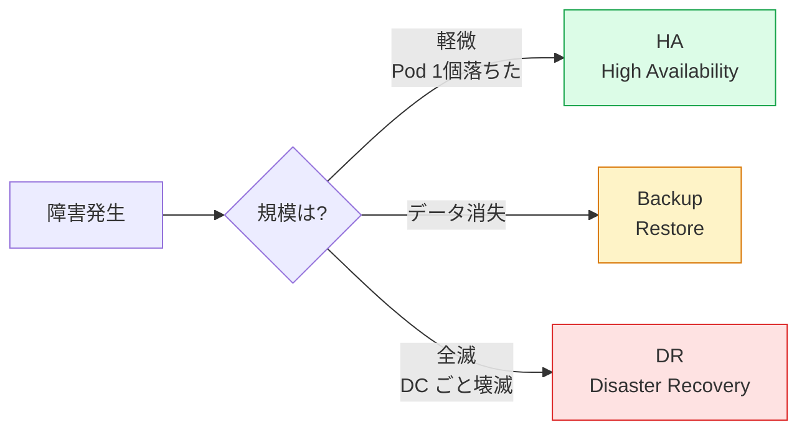
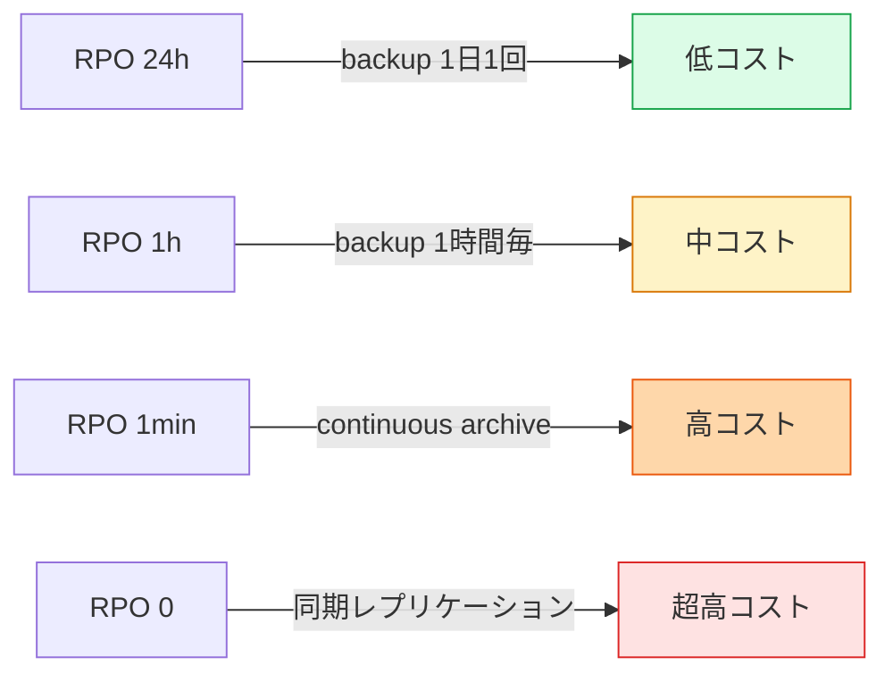
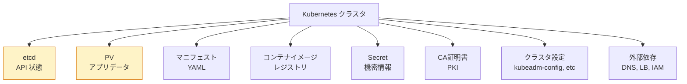
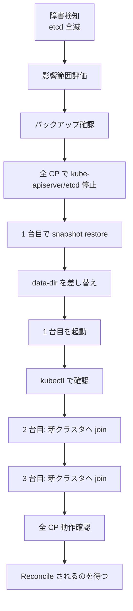
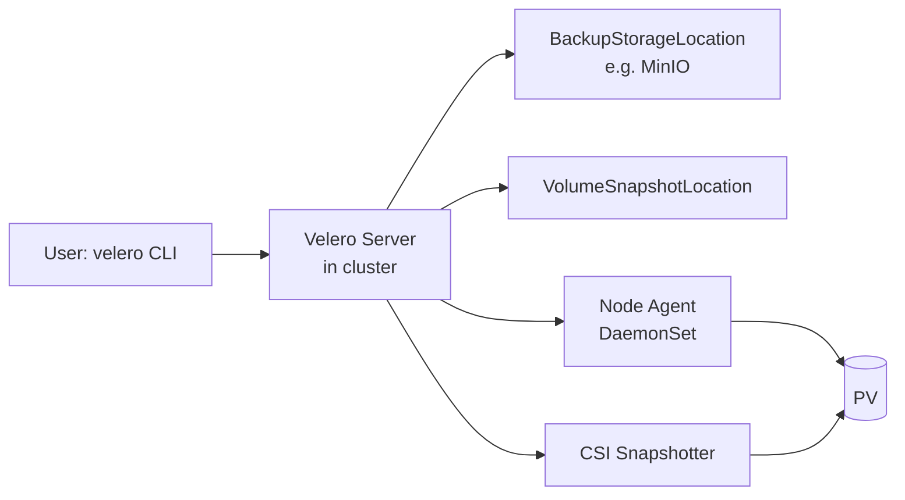
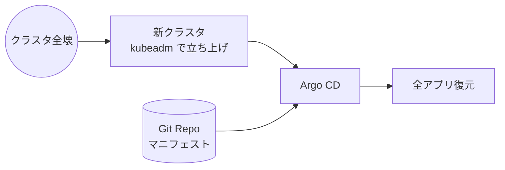
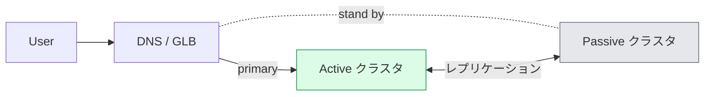
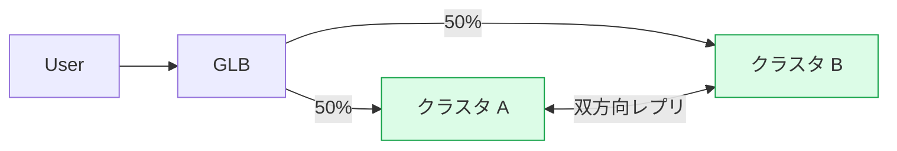

# DR (Disaster Recovery)
{: .no_toc }

## 目次
{: .no_toc .text-delta }

1. TOC
{:toc}

---

## このページのゴール

このページを読み終えると、以下を **自分の言葉で説明できる** ようになります。

- 「Disaster Recovery(災害復旧)」と「High Availability(高可用性)」「Backup」の **違い** と、それぞれが守る対象
- **RPO / RTO / MTPD** の意味と、ビジネス要件に応じた **数値の決め方**
- Kubernetes 環境で **何をバックアップすべきか**、その対象を網羅的に列挙できる
- etcd スナップショットの取得・検証・リストア手順を **実機で完遂** できる
- Velero による Namespace / PV バックアップの動作原理と、CSI Snapshot との違い
- 「クラスタ自体を使い捨てる」 GitOps 思想と、「クラスタを大事にする」 Pet 思想の **使い分け**
- マルチクラスタ / マルチリージョン構成での **フェイルオーバー戦略**
- DR 演習(Disaster Recovery Drill)の設計・実施・評価方法
- セキュリティと DR の交差点(バックアップが侵害ベクターにならないようにする)
- 実際にローカル kubeadm クラスタを **故意に壊して、復元する** 演習を完遂できる

---

## DR とは何か、なぜ必要か

### 一言で言うと

**「クラスタごと壊れた」「データセンターが燃えた」「人為的ミスで本番 DB を DROP した」** といった **大規模障害から、定められた時間内に、定められた損失量で復旧する** ための準備と訓練。

「壊れた Pod を再起動する」「ノードを 1 台再構築する」といった日常運用とは、**スケールが違う** ことに注意してください。
日常運用は障害対応(`incident.md`)で扱い、本ページは **「クラスタが死んだ前提」** で議論します。

### HA と DR と Backup の違い

混同されがちな 3 つの概念。



| 概念 | 対象 | 例 |
|------|------|-----|
| **HA** | 部品の冗長化で「落ちても見えない」 | Pod を 3 個複製、Control Plane 3 台、AZ 分散 |
| **Backup** | データを別場所にコピーし、消えても戻せる | etcd snapshot、PV backup |
| **DR** | クラスタ / DC が全滅しても事業継続 | 別 DC への切替、Cold Standby 起動 |

DR は HA と Backup の **両方を内包** する、より大きな概念です。

### DR が必要な「災害」の種類

- **物理災害**: 地震、火災、洪水、停電、雷
- **インフラ災害**: DC ごと停止、ネットワーク切断、ISP 障害、DNS 全断
- **人為災害**: 誤った削除コマンド、設定ミスでの全 Pod 削除、不正アクセスでの破壊
- **論理災害**: 暗号化ランサムウェア、データ整合性の破壊、サプライチェーン攻撃
- **依存先災害**: クラウドプロバイダー大規模障害、外部 API ベンダーの倒産

これらに対する **準備度合い** は組織ごとに違いますが、最低限「何が起きたらどう対応するか」を **書類化** しておくことが DR の出発点。

### DR の歴史

#### 1980〜90 年代

メインフレーム時代、災害復旧サイトを「Hot Site / Warm Site / Cold Site」と階層化していました。

- **Hot Site**: 常時稼働、即座にフェイルオーバー(超高コスト)
- **Warm Site**: 待機サーバあり、データ同期、起動に数時間
- **Cold Site**: 空のラックスペースだけ、復旧に数日

これらは今もクラウド DR の用語として生きています。

#### 9.11 (2001)

米国 9.11 同時多発テロで WTC のデータセンターが破壊され、**「DC が物理的に消失する」** リスクが現実化。
この後、金融業界では地理的に離れた DR サイトの整備が法的に義務化されました(日本も同様)。

#### 東日本大震災 (2011)

日本のサーバ業界に多大な影響。**「東京と大阪の 2 拠点」** という分散構成が一般化。
Active-Active や Multi-Master DB(Galera、Vitess 等)の普及も後押し。

#### クラウド時代

AWS / GCP / Azure が **複数 AZ・複数 Region** を標準提供することで、DR の難易度が劇的に下がりました。
ただし「マネージドだから DR 不要」ではなく、**アプリレイヤーの DR** は依然として自分で設計する必要があります。

#### Kubernetes 時代

K8s 自体は無状態(stateless)を前提に設計されており、「壊れたら作り直す」が思想。
ただし etcd と PV は **状態を持つ** ため、ここの DR が課題に。

GitOps の登場で、**「クラスタは使い捨て」** という思想が現実的になりました(後述)。

---

## RPO / RTO / MTPD

DR を語る上での **最重要 3 用語**。

### 定義

| 用語 | 正式名称 | 意味 |
|------|----------|------|
| **RPO** | Recovery Point Objective | 失ってよいデータの最大量(=どこまで戻ってよいか) |
| **RTO** | Recovery Time Objective | 復旧までに許される最大時間 |
| **MTPD** | Maximum Tolerable Period of Disruption | 事業継続上の耐えられる最大停止時間 |

```mermaid
gantt
    title RPO / RTO のタイムライン
    dateFormat HH:mm
    axisFormat %H:%M

    section バックアップ
    最終バックアップ :done, 11:00, 1h
    
    section 障害
    障害発生 :crit, milestone, 13:00, 0min
    復旧完了 :crit, milestone, 16:00, 0min

    section 損失
    RPO 範囲 (失われるデータ) :active, 12:00, 1h
    RTO 範囲 (復旧時間) :active, 13:00, 3h
```



### RPO の決め方

RPO = 0(=データ消失ゼロ)を求めると、**同期レプリケーション** が必要になり、性能とコストが跳ね上がります。
ビジネスインパクトと天秤で決めます。

例(ミニ TODO サービス):

- **ユーザー作成データ(TODO 本体)**: RPO 1 時間。1 時間前以降の TODO が消えても、再投入してもらえる範囲
- **認証情報(セッション)**: RPO 5 分。ログインし直しを多発させない
- **メトリクス**: RPO 24 時間。歴史データは失ってよい
- **ログ**: RPO 1 時間。直近の調査ができればよい
- **設定(マニフェスト)**: RPO 0(Git にあるから常に最新)

### RTO の決め方

RTO = 0 は無限のコストがかかります。これも妥協点を探します。

例:

- **コア機能(TODO 作成・閲覧)**: RTO 4 時間
- **付帯機能(通知、検索)**: RTO 24 時間
- **管理画面**: RTO 48 時間

### MTPD との関係

MTPD は **「これを超えると事業が傾く」境界線**。
RTO < MTPD でなければなりません。逆の場合、その RTO は受け入れ不可。

### RPO と RTO のコスト関係



### ビジネスとの合意

RPO/RTO は **技術者だけで決めるものではない**。ビジネス側との合意が必須。

合意プロセス:
1. **BIA (Business Impact Analysis)**: 停止 1h / 4h / 1day / 1week でどれだけ損害か
2. **コスト見積**: 各 RPO/RTO の達成コスト
3. **トレードオフ議論**: コストと損害のバランス
4. **合意文書化**: SLA や DR 計画書に明記
5. **定期見直し**: 半年〜年次でレビュー

---

## バックアップ対象

「クラスタ全体」をバックアップするには、以下のレイヤー全てを考える必要があります。



### 1. etcd

Kubernetes API の **全ての状態** が入っている。

- Deployment / Service / Pod 定義
- ConfigMap / Secret(平文 or KMS 暗号化)
- RBAC / ServiceAccount
- Namespace
- 各種 Operator のカスタムリソース
- イベント

etcd を失う = K8s クラスタの記憶を失う。

### 2. PersistentVolume

ストレージに置かれたアプリケーションデータ。

- PostgreSQL の WAL とテーブル
- Redis の RDB / AOF
- アップロードされたファイル
- ログファイル
- メトリクス時系列(Prometheus)

これは etcd には入っていない。**別途バックアップが必要**。

### 3. マニフェスト

YAML ファイル自体。GitOps を使っていれば **Git リポジトリ自体がバックアップ**。

- アプリケーションの Deployment / Service 等
- Helm Chart や Kustomize overlay
- Argo CD Application 定義
- CRD 定義

### 4. コンテナイメージ

レジストリに置かれているイメージ。

- 本番でデプロイ中のバージョン
- 過去 N 世代の安定版(ロールバック先として)

### 5. Secret(機密情報)

etcd の暗号化が無効ならそのまま入っているが、KMS 暗号化されている場合は **KMS 鍵自体** のバックアップが必要。

### 6. CA 証明書と PKI

クラスタの認証基盤。失うと kubelet と API Server の通信が成立しなくなる。

- `/etc/kubernetes/pki/` 配下(kubeadm の場合)
- 関連する serving certificate

### 7. クラスタ設定

- `/etc/kubernetes/kubeadm-config.yaml`
- kubelet 設定 (`/var/lib/kubelet/config.yaml`)
- containerd 設定
- ネットワーク設定 (Calico の bgppeer 等)

### 8. 外部依存

クラスタ単体では完結しないもの。

- DNS レコード(`api.example.com` → 192.168.56.10 等)
- LoadBalancer 設定(HAProxy 設定、MetalLB IP プール)
- IAM / OAuth Provider 設定
- TLS 証明書(cert-manager の場合は Let's Encrypt から再取得可)

### バックアップ対象の完全リスト(チェックリスト)

```markdown
- [ ] etcd スナップショット
- [ ] PV (アプリデータ)
- [ ] マニフェスト (Git)
- [ ] イメージ (レジストリ)
- [ ] Secret / 暗号化鍵
- [ ] kubeadm 証明書 (/etc/kubernetes/pki)
- [ ] kubeadm-config
- [ ] kubelet 設定
- [ ] containerd 設定
- [ ] CNI 設定 (Calico 等)
- [ ] DNS レコード (外部 DNS 提供元)
- [ ] LoadBalancer 設定 (HAProxy.cfg 等)
- [ ] MetalLB IP プール定義
- [ ] NFS 設定 (exports)
- [ ] バックアップ自体の検証履歴
```

---

## バックアップ戦略の階層

すべてを毎時バックアップすると **コストもストレージも爆発** します。
データの重要度に応じて頻度を変えます。

| 対象 | 頻度 | 保管期間 | 場所 |
|------|------|----------|------|
| etcd snapshot | 1 時間ごと | 7 日 | `k8s-nfs:/export/etcd-backup` |
| etcd snapshot (daily) | 1 日 1 回 | 30 日 | NFS + 外部メディア(USB / S3) |
| PV (Velero, daily) | 1 日 1 回 (深夜) | 30 日 | MinIO on k8s-nfs |
| PV (Velero, weekly full) | 週 1 回 | 90 日 | 外部 |
| マニフェスト (Git) | 即時 (commit ごと) | 永続 | GitHub + ローカルミラー |
| イメージ | リリースごと | 主要バージョン永続 | レジストリ + バックアップ |
| 証明書 (PKI) | 月 1 回 | 1 年 | NFS + 暗号化 |
| 設定 (kubeadm-config) | 変更時 | 永続 | Git |

### 3-2-1 ルール

伝統的なバックアップ原則:

- **3** つのコピー(本番 + 2 つのバックアップ)
- **2** 種類のメディア(NFS と外部メディア)
- **1** つはオフサイト(物理的に離れた場所)

ローカル kubeadm 学習環境では完全には満たしませんが、考え方として:

- **3**: 本番 etcd + NFS バックアップ + 別 NFS / ローカル PC へのコピー
- **2**: NFS(ネットワーク)+ ローカル(USB SSD など)
- **1**: ノート PC を別の場所(家・会社)に持ち帰っておく

### バックアップとリストアの非対称性

**「バックアップが取れた」≠「リストアできる」**。
これは古今東西、最もよくあるアンチパターン。

**「定期的にリストア演習する」** までやって、初めて DR が成立します(後述)。

---

## etcd バックアップ

### etcdctl snapshot save

```bash
ssh k8s-cp1

sudo ETCDCTL_API=3 etcdctl \
  --endpoints=https://127.0.0.1:2379 \
  --cacert=/etc/kubernetes/pki/etcd/ca.crt \
  --cert=/etc/kubernetes/pki/etcd/server.crt \
  --key=/etc/kubernetes/pki/etcd/server.key \
  snapshot save /tmp/etcd-snap-$(date +%Y%m%d-%H%M).db
```

**フラグ解説**:

| フラグ | 意味 |
|--------|------|
| `--endpoints` | etcd の接続先(複数可、カンマ区切り) |
| `--cacert` | etcd CA 証明書(認証先の検証) |
| `--cert` | クライアント証明書(自分の認証) |
| `--key` | クライアント秘密鍵 |
| `--dial-timeout` | 接続タイムアウト(default 2s) |
| `--command-timeout` | コマンド全体のタイムアウト(default 5s) |

### スナップショットの検証

取っただけでは安心できません。**ハッシュとサイズを検証** します。

```bash
sudo ETCDCTL_API=3 etcdctl \
  --write-out=table \
  snapshot status /tmp/etcd-snap-20260515-1400.db
```

期待出力:

```
+----------+----------+------------+------------+
|   HASH   | REVISION | TOTAL KEYS | TOTAL SIZE |
+----------+----------+------------+------------+
| abc1234  |   523678 |       1842 |     12 MB  |
+----------+----------+------------+------------+
```

- **TOTAL KEYS**: K8s API オブジェクトの数。普段の値と大きく違えば異常
- **TOTAL SIZE**: 想定範囲か
- **HASH**: スナップショットの整合性

### 自動化(CronJob)

```yaml
apiVersion: batch/v1
kind: CronJob
metadata:
  name: etcd-backup
  namespace: kube-system
spec:
  schedule: "0 * * * *"   # 毎時 00 分
  successfulJobsHistoryLimit: 3
  failedJobsHistoryLimit: 5
  concurrencyPolicy: Forbid
  jobTemplate:
    spec:
      backoffLimit: 2
      template:
        spec:
          restartPolicy: OnFailure
          hostNetwork: true
          tolerations:
          - operator: Exists
          nodeSelector:
            node-role.kubernetes.io/control-plane: ""
          containers:
          - name: backup
            image: registry.k8s.io/etcd:3.5.13-0
            command:
            - sh
            - -c
            - |
              set -euo pipefail
              FILENAME="etcd-$(hostname)-$(date +%Y%m%d-%H%M).db"
              ETCDCTL_API=3 etcdctl \
                --endpoints=https://127.0.0.1:2379 \
                --cacert=/etc/kubernetes/pki/etcd/ca.crt \
                --cert=/etc/kubernetes/pki/etcd/server.crt \
                --key=/etc/kubernetes/pki/etcd/server.key \
                snapshot save /backup/${FILENAME}
              # 検証
              ETCDCTL_API=3 etcdctl snapshot status /backup/${FILENAME} -w table
              # 7 日以上古いものを削除
              find /backup -name 'etcd-*.db' -mtime +7 -delete
              echo "Backup completed: ${FILENAME}"
            volumeMounts:
            - {name: pki, mountPath: /etc/kubernetes/pki/etcd, readOnly: true}
            - {name: backup, mountPath: /backup}
          volumes:
          - name: pki
            hostPath: {path: /etc/kubernetes/pki/etcd}
          - name: backup
            nfs:
              server: 192.168.56.30
              path: /export/etcd-backup
```

**設計のポイント**:

- `hostNetwork: true`: etcd は 127.0.0.1:2379 にしかバインドされていないため
- `nodeSelector` で control plane に限定
- `tolerations: operator: Exists` で control-plane の taint を tolerate
- `hostPath` で証明書を読み込み
- NFS にバックアップ保管
- ファイル名にホスト名を含めて、どの CP から取ったか分かるように
- 古いものを自動削除

### バックアップの検証アラート

バックアップが取れなくなっていることに気づかない、を防ぐ:

```yaml
# prometheus rule
- alert: EtcdBackupOutdated
  expr: |
    time() - max(kube_job_status_completion_time{job_name=~"etcd-backup-.*"}) > 3600 * 2
  labels: {severity: page}
  annotations:
    summary: "etcd backup has not completed in 2h"
```

Job の完了時刻が **2 時間以上前** なら警告。

---

## etcd リストア

ここが DR の **本番演習** です。机上演習ではなく、必ず実機で。

### リストアの全体フロー



### 詳細手順

#### Step 0: バックアップから戻すべきポイントを決定

```bash
ls -lh /export/etcd-backup/
```

最新の正常なものを選ぶ。**「事故直前のもの」** とは限らない(事故原因が etcd 内のデータなら、それを含まないバージョン)。

#### Step 1: 全 control plane で kube-apiserver と etcd を停止

```bash
for CP in k8s-cp1 k8s-cp2 k8s-cp3; do
  ssh ${CP} 'sudo mv /etc/kubernetes/manifests /etc/kubernetes/manifests.bak'
done

# kubelet が manifest フォルダの空化を検知して、static pod を停止
# 確認:
for CP in k8s-cp1 k8s-cp2 k8s-cp3; do
  ssh ${CP} 'sudo crictl ps | grep -E "etcd|apiserver" || echo "stopped"'
done
```

{: .warning }
> ここで kube-apiserver も停止するため、`kubectl` は一切使えなくなります。
> 操作はすべて SSH 経由で control plane に直接ログインします。

#### Step 2: 1 台目で snapshot restore

```bash
ssh k8s-cp1

# バックアップを取り寄せる(NFS マウントしておく)
sudo mount -t nfs 192.168.56.30:/export/etcd-backup /mnt/backup

SNAP=/mnt/backup/etcd-k8s-cp1-20260515-1400.db

# リストア(新しい data-dir に書き出す)
sudo ETCDCTL_API=3 etcdctl snapshot restore ${SNAP} \
  --name k8s-cp1 \
  --initial-cluster k8s-cp1=https://192.168.56.11:2380,k8s-cp2=https://192.168.56.12:2380,k8s-cp3=https://192.168.56.13:2380 \
  --initial-cluster-token etcd-cluster-1 \
  --initial-advertise-peer-urls https://192.168.56.11:2380 \
  --data-dir /var/lib/etcd-restore
```

**フラグ解説**:

| フラグ | 意味 |
|--------|------|
| `--name` | このメンバの名前(etcd メンバ識別子) |
| `--initial-cluster` | クラスタを構成する全メンバの URL(`name=url` 形式) |
| `--initial-cluster-token` | 同じ token で起動した者同士でクラスタを組む |
| `--initial-advertise-peer-urls` | このメンバが他に告知するピア URL |
| `--data-dir` | 既存と異なるパスを指定(衝突回避) |
| `--skip-hash-check` | ハッシュ検証をスキップ(本番では使わない) |

#### Step 3: data-dir を入れ替え

```bash
# 古い data-dir を退避
sudo mv /var/lib/etcd /var/lib/etcd.broken

# 新しい data-dir を本物の場所へ
sudo mv /var/lib/etcd-restore /var/lib/etcd
sudo chown -R etcd:etcd /var/lib/etcd  # 所有者を合わせる
```

#### Step 4: 1 台目だけ kube-apiserver と etcd を起動

最初は **k8s-cp1 だけ起動** して、新クラスタを立ち上げます。

ただし、`etcd.yaml` の `--initial-cluster` には全 3 台が書かれていると、起動時に他の 2 台を待ち続けます。
**一時的に「自分だけのクラスタ」として起動** するには、`etcd.yaml` を編集:

```bash
sudo cp /etc/kubernetes/manifests.bak/etcd.yaml /etc/kubernetes/etcd-restore.yaml

# 編集して以下のように
# - --initial-cluster=k8s-cp1=https://192.168.56.11:2380  # 自分だけ
# - --initial-cluster-state=existing → new
# - --force-new-cluster=true   # 完全リセット
```

または、kubeadm のフローでは:

```bash
# etcd だけ先に起動するため
sudo mkdir -p /etc/kubernetes/manifests
sudo mv /etc/kubernetes/manifests.bak/etcd.yaml /etc/kubernetes/manifests/

# kubelet が起動を検知
sudo crictl ps -a | grep etcd

# 1 分待って etcd が応答するか
sudo ETCDCTL_API=3 etcdctl \
  --endpoints=https://127.0.0.1:2379 \
  --cacert=/etc/kubernetes/pki/etcd/ca.crt \
  --cert=/etc/kubernetes/pki/etcd/server.crt \
  --key=/etc/kubernetes/pki/etcd/server.key \
  endpoint health
```

#### Step 5: kube-apiserver を 1 台目で起動

```bash
sudo mv /etc/kubernetes/manifests.bak/kube-apiserver.yaml /etc/kubernetes/manifests/
sudo mv /etc/kubernetes/manifests.bak/kube-controller-manager.yaml /etc/kubernetes/manifests/
sudo mv /etc/kubernetes/manifests.bak/kube-scheduler.yaml /etc/kubernetes/manifests/

# 起動確認(クライアント側から)
kubectl get pods -A
kubectl get nodes
```

NotReady になるノードがあるかもしれないが、ここでは「リストアされた状態」が見えれば OK。

#### Step 6: 2 台目、3 台目を新クラスタに join

```bash
ssh k8s-cp2
# まず etcd と kube-apiserver の data を消す
sudo rm -rf /var/lib/etcd
sudo mv /etc/kubernetes/manifests.bak /tmp/cp2-old-manifests

# k8s-cp1 から、member add で 2 台目を登録
ssh k8s-cp1
sudo ETCDCTL_API=3 etcdctl \
  --endpoints=https://127.0.0.1:2379 \
  --cacert=... --cert=... --key=... \
  member add k8s-cp2 --peer-urls=https://192.168.56.12:2380

# 戻り値で表示される ETCD_INITIAL_CLUSTER 等を控える

# k8s-cp2 で manifests を戻す(etcd.yaml の initial-cluster を更新)
ssh k8s-cp2
# initial-cluster を、上で得た値に書き換えてから manifests を配置

# 同様に k8s-cp3 も
```

これで HA クラスタが復元されます。

#### Step 7: 全体動作確認

```bash
# etcd クラスタ
sudo ETCDCTL_API=3 etcdctl ... endpoint status --cluster -w table
# 全 3 メンバが Leader/Follower で揃っているか

# K8s
kubectl get nodes
kubectl get pods -A
kubectl get componentstatuses  # deprecated だが参考
```

#### Step 8: アプリの再 reconcile

etcd を巻き戻したため、現実のクラスタ状態と etcd の状態にズレがあることがあります:

- ノードに残っている Pod が「etcd 側では存在しない」状態 → kubelet が後始末
- PV / PVC のバインド状態
- Service の Endpoint

これらは数分待てば controller が reconcile します。
おかしい場合は当該リソースを `kubectl delete` して再作成。

### リストア後のチェック

```bash
# Pod の起動状況
kubectl get pods -A | grep -v Running

# Node の Ready 状態
kubectl get nodes

# 主要 Service の Endpoint
kubectl get endpoints -A

# etcd の健全性
sudo ETCDCTL_API=3 etcdctl ... endpoint health --cluster

# etcd の alarm
sudo ETCDCTL_API=3 etcdctl ... alarm list
```

### リストアの落とし穴

| 罠 | 対処 |
|----|------|
| バックアップ時刻と現在の TLS 証明書が違う(更新があった) | 証明書もバックアップから戻す or 再発行 |
| etcd quota が default の 2GB に戻る | manifest の `--quota-backend-bytes` を確認 |
| Static Pod の image が新しすぎる(古い snapshot 時点と不整合) | etcd manifest の image を一旦古いものに |
| 他の CP のメンバ ID が変わって join できない | `etcdctl member remove` で古いものを削除してから add |
| NFS マウントが etcd より先に必要 | NFS マウントを systemd で先に |

---

## Velero による PV バックアップ

etcd は **設定** だが、**実データ** は PV にあります。これは Velero で取ります。

### Velero のアーキテクチャ



- **BackupStorageLocation (BSL)**: バックアップを置く場所(S3 / MinIO / Azure Blob 等)
- **VolumeSnapshotLocation (VSL)**: ボリュームスナップショット(CSI)を置く場所
- **Node Agent**(以前 `restic`、現在 `kopia`): CSI 非対応の StorageClass で **ファイルレベル** バックアップ
- **CSI Snapshotter**: CSI ドライバが対応していれば **ブロックレベル** バックアップ

### MinIO のセットアップ(BSL のため)

ローカル kubeadm 環境では S3 がないので、MinIO で代替します。

`k8s-nfs` 上に Docker で立てる:

```bash
ssh k8s-nfs
sudo mkdir -p /export/minio
sudo docker run -d --name minio \
  -p 9000:9000 -p 9001:9001 \
  -e MINIO_ROOT_USER=admin \
  -e MINIO_ROOT_PASSWORD=changeme123 \
  -v /export/minio:/data \
  --restart=always \
  minio/minio:RELEASE.2024-12-01T00-00-00Z \
  server /data --console-address ":9001"
```

ブラウザで `http://192.168.56.30:9001` にアクセス、`admin / changeme123` でログイン。バケット `velero` を作成。

### Velero インストール

```bash
# MinIO クレデンシャル
cat > credentials-velero <<EOF
[default]
aws_access_key_id=admin
aws_secret_access_key=changeme123
EOF

# インストール
velero install \
  --provider aws \
  --plugins velero/velero-plugin-for-aws:v1.10.0 \
  --bucket velero \
  --secret-file ./credentials-velero \
  --backup-location-config region=minio,s3ForcePathStyle=true,s3Url=http://192.168.56.30:9000 \
  --use-volume-snapshots=false \
  --use-node-agent \
  --uploader-type=kopia
```

**フラグ解説**:

| フラグ | 意味 |
|--------|------|
| `--provider aws` | プラグインタイプ(MinIO は AWS S3 互換) |
| `--plugins` | 使うプラグインの container image |
| `--bucket` | バックアップを置く S3 バケット名 |
| `--secret-file` | クレデンシャルファイル |
| `--backup-location-config` | S3 互換のエンドポイント設定 |
| `--use-volume-snapshots=false` | NFS-CSI が VolumeSnapshot 非対応のため |
| `--use-node-agent` | Node Agent (file-level backup) を有効化 |
| `--uploader-type=kopia` | バックエンドに kopia を使う(以前は restic) |

確認:

```bash
kubectl get pods -n velero
# velero-... と node-agent-... が Running になっているはず

velero version
velero backup-location get
```

### バックアップを取る

```bash
# 全 Namespace を取る
velero backup create initial-backup --include-namespaces='*' \
  --exclude-namespaces='kube-system,velero'

# 特定 Namespace
velero backup create prod-$(date +%Y%m%d) \
  --include-namespaces=prod \
  --include-cluster-resources=true \
  --ttl 720h0m0s    # 30 日後に自動削除

# 進捗確認
velero backup describe prod-20260515
velero backup logs prod-20260515
```

### スケジュール化

```bash
velero schedule create daily-prod \
  --schedule="0 2 * * *" \
  --include-namespaces=prod \
  --ttl 720h

velero schedule create weekly-full \
  --schedule="0 3 * * 0" \
  --include-namespaces='*' \
  --exclude-namespaces='kube-system,velero' \
  --ttl 2160h    # 90 日
```

### リストア

```bash
# バックアップ一覧
velero backup get

# Namespace ごとリストア
velero restore create --from-backup prod-20260515

# 別 Namespace に
velero restore create restore-1 --from-backup prod-20260515 \
  --namespace-mappings prod:prod-restored

# 進捗
velero restore describe restore-1
velero restore logs restore-1
```

### バックアップ対象を細かく制御

```bash
# ラベルセレクタ
velero backup create selective \
  --selector app.kubernetes.io/part-of=todo

# 特定リソースを除外
velero backup create no-secrets \
  --exclude-resources secrets

# Pre-hook / Post-hook(バックアップ前後にコマンド実行)
# Pod の annotation で指定:
# backup.velero.io/backup-volumes: data
# pre.hook.backup.velero.io/command: '["/bin/sh","-c","pg_dump ..."]'
# post.hook.backup.velero.io/command: '["/bin/sh","-c","rm /tmp/dump"]'
```

### CSI VolumeSnapshot との関係

CSI ドライバが対応していれば、より高速な **ブロックレベル** スナップショットが使えます:

```yaml
# NFS-CSI ではなく、例えば LonghornCSI / Ceph-CSI 等で
apiVersion: snapshot.storage.k8s.io/v1
kind: VolumeSnapshotClass
metadata:
  name: csi-snapshot-class
driver: longhorn.io
deletionPolicy: Retain
```

```bash
velero install ... \
  --use-volume-snapshots=true \
  --features=EnableCSI
```

NFS-CSI は VolumeSnapshot 非対応のため、本書ではファイルレベル(Node Agent)で進めます。

---

## マニフェストのバックアップ ─ GitOps 戦略

実は **「manifests を Git で管理して、Argo CD で同期」** という GitOps 構成は、それ自体が強力な DR 戦略です。

### 「クラスタ使い捨て」の発想



手順:
1. 新クラスタを kubeadm で立てる(自動化スクリプト)
2. Argo CD インストール
3. Root Application 1 つだけ apply
4. すべてのアプリ・周辺ツールが自動で復元

**「クラスタ自体は Cattle、Pet ではない」** という Mark Burgess / Patrick Debois の名言の実現です。

### GitOps による DR の限界

ただし、これだけでは:

- **アプリデータ(PV)は復元されない** → Velero と組み合わせる
- **etcd の状態(動的に作られたリソース)は復元されない** → ものによっては Operator が再生成
- **証明書の再発行が必要** → cert-manager / Let's Encrypt なら自動

つまり **GitOps + Velero + etcd snapshot のセット** で初めて完全な DR になります。

### Argo CD でのフォルダ構成例

```
gitops/
├── bootstrap/
│   └── root-app.yaml          # Argo CD 自身も自動デプロイ
├── platform/
│   ├── ingress-nginx/
│   ├── cert-manager/
│   ├── prometheus/
│   ├── argo-cd/
│   └── velero/
├── apps/
│   ├── todo-frontend/
│   ├── todo-api/
│   ├── todo-worker/
│   └── postgres/
└── clusters/
    ├── prod/
    │   └── kustomization.yaml
    └── staging/
        └── kustomization.yaml
```

`bootstrap/root-app.yaml` をクラスタに 1 つだけ apply すると、その中で Argo CD が自分自身を管理し、platform と apps を順次同期します(**App of Apps** パターン)。

---

## マルチクラスタフェイルオーバー

「1 つのクラスタが壊れたら別のクラスタに切り替える」戦略。本書のローカル環境では完全には実装できませんが、概念を理解しておきます。

### Active-Passive



- 通常時: Active のみ
- 障害時: DNS / Global LB が切替

利点: 設計が単純、コスト抑えめ
欠点: フェイルオーバーに数分〜数十分

### Active-Active



- 両方が常時稼働
- どちらかが落ちても残りが受け持つ

利点: フェイルオーバー時間ゼロに近い
欠点: データ同期が難しい(整合性 vs 性能)

### ローカル環境での擬似

VMware で 2 つの kubeadm クラスタを立てる(本書 12 章以降で詳細):

- クラスタ A: 192.168.56.0/24 上
- クラスタ B: 192.168.57.0/24 上(別 VMnet)
- DB レプリケーション: PostgreSQL の論理レプリケーション
- DNS: ローカル DNS で切替

詳細は本書の範囲外。

---

## バックアップの暗号化とセキュリティ

「バックアップが盗まれる」のは、本番が侵害されるのと同等のリスク。

### 脅威

- バックアップサーバへの侵入で全データ流出
- バックアップに含まれる Secret から本番への侵入
- ランサムウェアがバックアップごと暗号化(復旧不可能に)

### 対策

#### 1. 暗号化

Velero は kopia 経由で **client-side 暗号化** をサポート:

```bash
# encryption key 設定
velero ... --features=EnableAPIGroupVersions \
  ...
```

#### 2. アクセス制御

- バックアップ Bucket への書き込み権限を Velero に **限定**
- 読み取り権限も最小限の人間のみ
- IAM / RBAC を厳格に

#### 3. Immutability(変更不可)

S3 Object Lock や WORM ストレージで、**バックアップを後から消せない** ようにする。
ランサムウェア対策の最終防衛線。

#### 4. オフライン保管

定期的にバックアップを外部メディア(LTO テープ、外付け SSD)にコピーし、ネットワーク非接続で保管。
完全なエアギャップ。

#### 5. アクセスログ

バックアップの **読み取り操作も含めて** ログ化し、異常検知。

---

## DR 演習(Disaster Recovery Drill)

### なぜ必要か

DR 計画は **試さない限り動きません**。
机上計画書だけでは、実際に災害が起きたときに必ず詰みます。
航空業界・原発・医療では、定期演習が法的に義務化されています。SRE も同じ。

### 演習の種類

| 種類 | 概要 | 頻度 |
|------|------|------|
| **机上演習(Tabletop)** | シナリオを読み上げ、対応を口頭で議論 | 月 1 |
| **部分演習(Functional)** | 特定機能(etcd リストア等)を実機で | 月 1〜四半期 |
| **完全演習(Full)** | 本番想定で全クラスタを切替 | 半年〜年 1 |

### 演習設計

#### シナリオ例 1: etcd 全滅

```markdown
# DR Drill: etcd 全滅シナリオ

## 想定
2026-06-01 02:00 JST、ストレージ故障により全 control plane の /var/lib/etcd が破損。

## 目標
- RTO: 2 時間以内に kubectl が動く
- RPO: 直前のバックアップ(1 時間前)まで戻せる

## 参加者
- IC: @taro
- Ops: @jiro
- Scribe: @sakura

## 演習手順
1. 14:00 全 CP で `sudo rm -rf /var/lib/etcd` (シミュレーション)
2. 14:01 障害宣言、インシデントチャンネル開設
3. 14:05 NFS から snapshot を取得
4. 14:10〜 etcd リストア手順を実行
5. 16:00 までに kubectl 復活、Node Ready

## 評価項目
- RTO 達成: 2h 以内
- 手順書の不備: ノートに記録
- 必要だが書かれていない手順: 追記候補
- 関係者のスキル: 自己評価
```

#### シナリオ例 2: NFS サーバ全滅

```markdown
# DR Drill: NFS サーバ消失

## 想定
k8s-nfs サーバが物理故障し、起動不能。
PV のデータが全て失われた。

## 目標
- 30 日前のフルバックアップから復旧
- PostgreSQL データの整合性確認

## 演習手順
1. k8s-nfs を強制シャットダウン
2. 新 VM (k8s-nfs2) を構築、NFS exports 設定
3. StorageClass の server を更新
4. Velero から PostgreSQL データを restore
5. アプリの動作確認、テストデータで CRUD

## 評価項目
- データ整合性
- アプリ修正の有無
- ダウンタイム
```

#### シナリオ例 3: 人為的災害

```markdown
# DR Drill: 全 Namespace 削除

## 想定
オペレータの誤操作で `kubectl delete ns prod` が実行された。

## 演習手順
1. (シミュレーション) staging で `kubectl delete ns prod-test`
2. GitOps (Argo CD) で再同期可能か確認
3. PV だけ消えていれば Velero で復元
4. アプリの動作確認

## 評価項目
- 復旧時間
- 「Argo CD だけで戻るか / Velero が必要か」の整理
```

### 演習後の改善

演習結果から:

- ランブックに欠けている手順を追記
- 自動化できる手順をスクリプト化
- 改善アクションをポストモーテム形式でまとめる

### 演習を本番でやる勇気

「Game Day」と同じく、本番環境で計画的に DR 演習を行うことも価値があります(深夜・低負荷帯、十分な準備のもと)。

---

## ハンズオン

### Hands-on 1: etcd バックアップ & リストア演習

#### 準備

1. etcd snapshot を取る
2. テスト用 Namespace を作って、明示的なリソースを置く

```bash
kubectl create ns dr-test
kubectl run test-pod -n dr-test --image=nginx:1.27
kubectl create cm dr-marker -n dr-test --from-literal=created=$(date -Iseconds)
```

3. もう一度 snapshot を取る(test-pod を含むスナップショット)

#### 演習

1. test-pod を削除、新しい cm を作る:

```bash
kubectl delete pod test-pod -n dr-test
kubectl create cm dr-marker-2 -n dr-test --from-literal=created=$(date -Iseconds)
```

2. 前述の手順で etcd リストア
3. リストア後、test-pod が **戻っていて**、dr-marker-2 が **無い** ことを確認

成功の判定:

```bash
kubectl get pod -n dr-test
# test-pod が見える
kubectl get cm -n dr-test
# dr-marker のみ、dr-marker-2 はない
```

これで「etcd リストア = 時間を巻き戻す」ことが体験できます。

### Hands-on 2: Velero バックアップ & リストア

1. MinIO 起動、Velero インストール(前述)
2. PostgreSQL に明確なテストデータ:

```bash
kubectl exec -it todo-postgres-0 -n prod -- psql -U todo -d todo \
  -c "INSERT INTO todos (title) VALUES ('DR test backup marker $(date)');"
```

3. Velero バックアップ:

```bash
velero backup create dr-test-$(date +%H%M) --include-namespaces=prod --wait
```

4. データを破壊:

```bash
kubectl exec -it todo-postgres-0 -n prod -- psql -U todo -d todo \
  -c "TRUNCATE TABLE todos;"
```

5. Velero リストア:

```bash
velero restore create --from-backup dr-test-XXXX
```

6. データが戻っていることを確認:

```bash
kubectl exec -it todo-postgres-0 -n prod -- psql -U todo -d todo \
  -c "SELECT * FROM todos WHERE title LIKE 'DR test%';"
```

### Hands-on 3: クラスタ全体再構築(難易度高)

1. **何もないところから kubeadm でクラスタを再構築できるスクリプト** を用意(第 7 章を参照)
2. 動いているクラスタ全体をバックアップ:
   - etcd snapshot
   - Velero ですべての Namespace
   - kubeadm-config と PKI を NFS にコピー
3. 全 VM を `vmrun stop hard` → 削除
4. 新 VM を 7 台立てる(または同じ VM を初期化)
5. kubeadm で再構築
6. Argo CD インストール、Git からアプリを同期
7. Velero リストアで PV データを戻す
8. **動作確認**

これを 1 度通してみることが、本書の **最も価値ある演習** です。完遂したら、本物の SRE スキルが身についています。

---

## DR 計画書テンプレート

最後に、組織で実際に使える DR 計画書のテンプレートを示します。

```markdown
# DR 計画書 ─ ミニ TODO サービス

## 1. 適用範囲
- 対象システム: ミニ TODO サービス (todo-api / frontend / worker)
- 対象環境: ローカル kubeadm クラスタ (192.168.56.0/24)

## 2. RPO / RTO

| データ | RPO | RTO | 根拠 |
|--------|-----|-----|------|
| TODO データ | 1h | 4h | ビジネス合意 |
| ユーザー認証 | 5min | 1h | UX 観点 |
| メトリクス | 24h | 24h | 重要度低 |
| ログ | 1h | 24h | 監査要件 |

## 3. バックアップ運用

| 対象 | ツール | 頻度 | 保管先 | 保管期間 |
|------|--------|------|--------|----------|
| etcd | etcd snapshot CronJob | 毎時 | k8s-nfs:/export/etcd-backup | 7 日 |
| etcd (daily) | 同上 | 毎日 | + USB SSD | 30 日 |
| PV | Velero | 毎日 | MinIO on k8s-nfs | 30 日 |
| マニフェスト | Git | コミットごと | GitHub + ローカル | 永続 |
| PKI 証明書 | rsync | 月次 | NFS + 暗号化 | 1 年 |

## 4. 復旧シナリオと手順

### シナリオ A: 単一 Control Plane 障害
- 手順: 当該 CP を kubeadm reset → 新 CP を join
- ランブック: docs/runbooks/cp-replace.md
- 想定時間: 30 分

### シナリオ B: etcd 全滅
- 手順: 全 CP 停止 → snapshot restore → 段階的に起動
- ランブック: docs/runbooks/etcd-restore.md
- 想定時間: 2 時間

### シナリオ C: NFS サーバ消失
- 手順: 新 NFS 構築 → Velero restore → アプリ動作確認
- ランブック: docs/runbooks/nfs-rebuild.md
- 想定時間: 4 時間

### シナリオ D: クラスタ全壊
- 手順: 新 VM 7 台 → kubeadm 初期化 → Argo CD → Velero restore
- ランブック: docs/runbooks/full-rebuild.md
- 想定時間: 8 時間

## 5. 訓練計画
- 月次: 机上演習 1 回
- 四半期: 部分演習 1 回 (etcd restore / Velero restore のいずれか)
- 半年: 完全演習 1 回

## 6. 役割と連絡先
- IC: SRE リード (TEL: xxx-xxxx-xxxx)
- Ops: オンコール (PagerDuty)
- 経営連絡: CTO (TEL: yyy-yyyy-yyyy)

## 7. 改訂履歴
- 2026-04-01: 初版
- 2026-05-15: NFS-CSI 採用に伴い更新
```

---

## アンチパターン

### 1. バックアップを取って安心する

取るのは前提。**戻せること** を検証していないと無意味です。

### 2. リストアは初回が本番

「練習せずに本番でやる」は、災害が起きてから手順書を読みながら手探りすることになります。
初回のリストアで成功する確率は経験的に **30% 程度**。

### 3. 「クラウドのバックアップサービス」だけ信用

クラウドベンダーの故障や、誤って同じ事業者の全機能を契約しているケースで全滅する事例が定期的にあります。
**サードパーティへのコピー** を必ず持つ。

### 4. RPO / RTO がビジネスと未合意

技術者が勝手に決めると、ビジネス上は耐えられない値だったり、過剰に高コストだったりする。
**必ず文書で合意**。

### 5. 暗号化鍵をクラスタ内にだけ保管

鍵もクラスタと一緒に消える。**鍵は別管理**(KMS、Vault、別 DC のサーバ)。

### 6. バックアップに Secret が平文で入っている

漏洩リスク。Velero は **暗号化バックアップ** を使う、または Secret を `Sealed Secret` / `External Secret` 等で外部管理する。

### 7. 訓練しない

DR 計画書は引き出しの中で死ぬ。最低限、**机上演習だけでも月次** で。

---

## チェックポイント

ここまでで以下を **自分の言葉で** 説明できるか確認してください。

- [ ] HA / Backup / DR の違いを、対象とする障害規模で説明できる
- [ ] RPO と RTO の違いを、ガントチャートで示せる
- [ ] バックアップ対象を 5 種類以上挙げられる
- [ ] etcd バックアップの自動化(CronJob)を YAML で書ける
- [ ] etcd リストアの全 8 ステップを順番に説明できる
- [ ] `etcdctl snapshot restore` の主要フラグ 5 つを説明できる
- [ ] Velero の BSL / VSL / Node Agent の役割を説明できる
- [ ] CSI Snapshot とファイルレベルバックアップ(kopia/restic)の違いを説明できる
- [ ] GitOps による「クラスタ使い捨て」戦略のメリットと限界を説明できる
- [ ] Active-Active と Active-Passive の違いを図示できる
- [ ] バックアップ暗号化が必要な理由を 3 つ挙げられる
- [ ] DR 演習の 3 種類(机上 / 部分 / 完全)を説明できる
- [ ] 自分のクラスタの DR 計画書を 1 ページで書ける
- [ ] 「バックアップが取れる ≠ リストアできる」を実体験として説明できる

→ 次は [クラスタアップグレード]({{ '/11-sre/upgrade/' | relative_url }})
