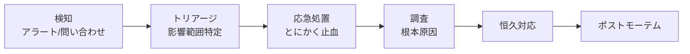

# 障害対応
{: .no_toc }

## 目次
{: .no_toc .text-delta }

1. TOC
{:toc}

---

「障害が起きないシステム」は存在しません。**起きたときに迅速に復旧し、再発を防ぐ** のが SRE 運用の中心。

## 障害対応の流れ



**応急処置と根本原因究明は分ける**。まずユーザー影響を止めるのが最優先。

## トリアージのフレーム

最初の数分でやること:

1. 影響範囲を見積もる(全ユーザー? 一部?)
2. 重大度を確定(SEV-1 / SEV-2 / SEV-3)
3. インシデントチャンネル開設・コマンダー任命
4. 関係者を集める

## Kubernetes固有の調査スポット

```bash
# クラスタ全体の健全性
kubectl get nodes
kubectl get componentstatuses    # deprecatedだが、まだ参考になる
kubectl top nodes
kubectl get events -A --sort-by=.metadata.creationTimestamp | tail -50

# Pod レベル
kubectl get pods -A | grep -v Running
kubectl describe pod <name> -n <ns>
kubectl logs <name> -c <container> --previous

# Node レベル
kubectl describe node <name>
ssh <node> 'journalctl -u kubelet --since "10 min ago"'
ssh <node> 'crictl ps -a'

# ネットワーク
kubectl run debug -n <ns> --rm -it --image=nicolaka/netshoot -- bash
# 中で: dig, curl, tcpdump, traceroute

# API Server
kubectl get --raw=/healthz
kubectl get --raw=/metrics | grep apiserver_request_duration
```

## よくある障害パターンとチェックリスト

### Pod が Pending のまま

- ノード資源不足? `describe pod` の Events 確認
- Taint があり Toleration が無い?
- PVC がBoundしていない? StorageClass のプロビジョナが壊れていない?
- Image PullSecret が無い、Registry到達不可?

### Pod が CrashLoopBackOff

- `kubectl logs --previous` で 1 つ前のログ確認
- 起動時の env / configMap / secret が不足?
- Liveness Probe が厳しすぎる?
- Init Container が失敗?

### サービスにつながらない

- Service の selector ↔ Pod label が一致?
- Endpoints が空でない?
- NetworkPolicy で遮断されていない?
- DNS は引ける? `nslookup <svc>` を debug pod から
- kube-proxy の iptables が破損?

### ノードが NotReady

- kubelet 停止? `systemctl status kubelet`
- メモリ枯渇? OOMKill ?
- 時刻ずれ? `chronyc tracking`
- containerd 停止?

### etcd 異常

- ディスク IO 飽和?
- リーダー選挙が頻繁? `etcdctl endpoint status --cluster`
- スナップショットを取って退避

## 対応中のコミュニケーション

- インシデント開始時に共有チャンネル作成
- 状況更新を 15-30 分ごとに行う
- **同時に何人もが kubectl edit するな**(競合の元、コマンダーが指揮)
- すべての変更コマンドを履歴に残す(`script` 録画 or 共有ターミナル)

## 訓練 (Game Day)

意図的に障害を起こす日を作って慣れる。Chaos Engineering と呼ばれる。

ローカル環境でできる Chaos:

```bash
# 1. Pod を殺す
kubectl delete pod -l app.kubernetes.io/name=todo-api --grace-period=0 --force

# 2. ノードを止める
vmrun stop /vm/k8s-w1.vmx

# 3. Chaos Mesh で計画的に
helm install chaos-mesh chaos-mesh/chaos-mesh -n chaos-mesh --create-namespace
```

```yaml
# 50% の確率で 1分間 ネットワーク遅延を入れる
apiVersion: chaos-mesh.org/v1alpha1
kind: NetworkChaos
metadata:
  name: api-latency
spec:
  action: delay
  mode: random-max-percent
  value: "50"
  selector:
    namespaces: [prod]
    labelSelectors:
      app.kubernetes.io/name: todo-api
  delay:
    latency: "200ms"
  duration: "1m"
```

## チェックポイント

- [ ] Pod Pending の主要4原因を答えられる
- [ ] 「全ユーザー影響かどうか」を判定する観測手段を 2 つ
- [ ] Game Day を 1 つ自分のサンプルアプリで設計できる
