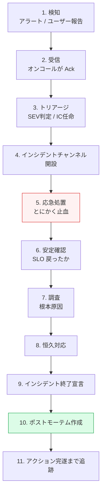
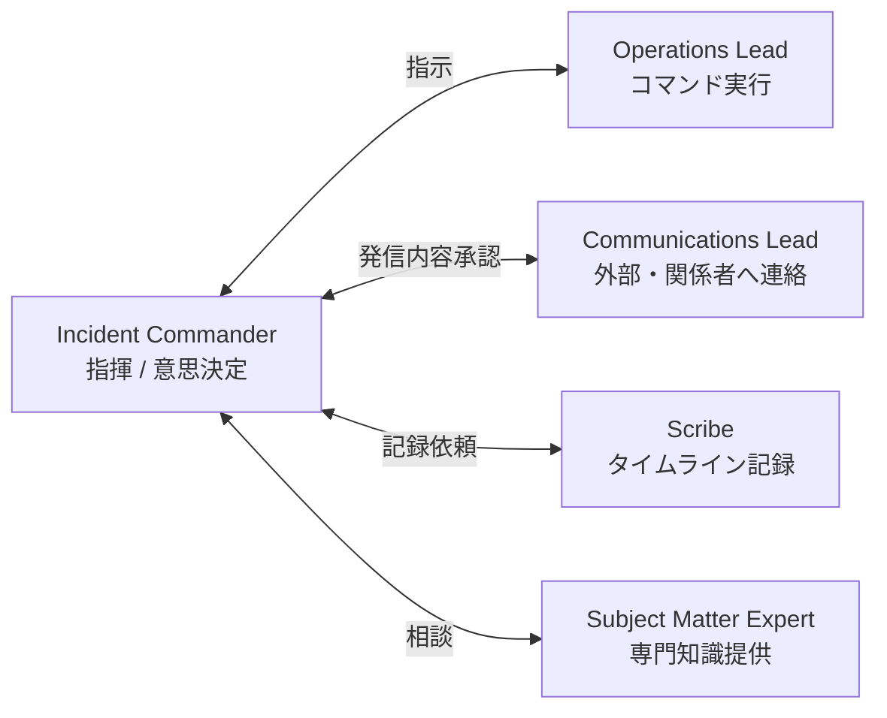
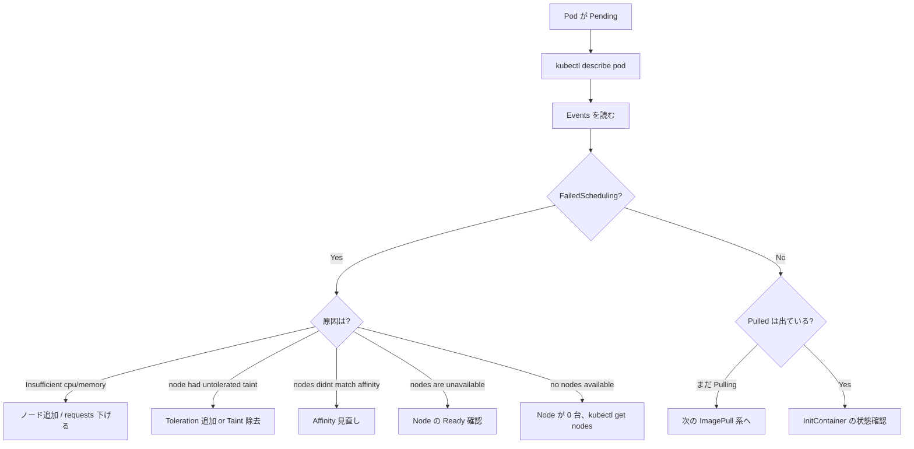
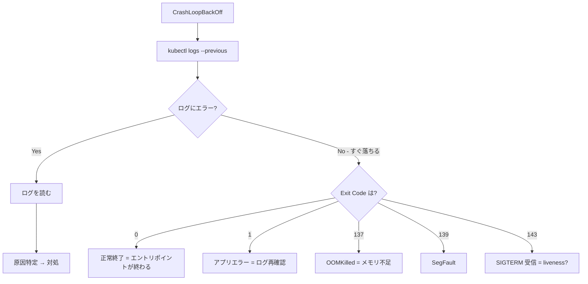
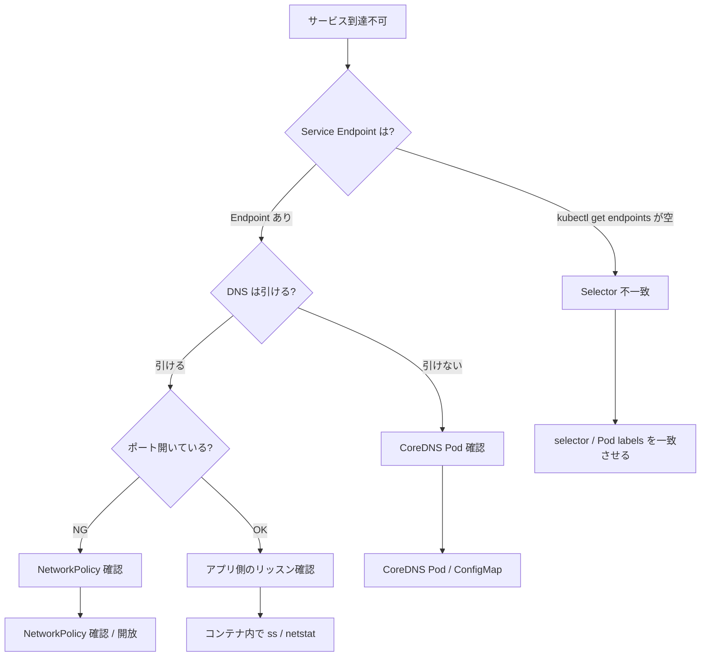
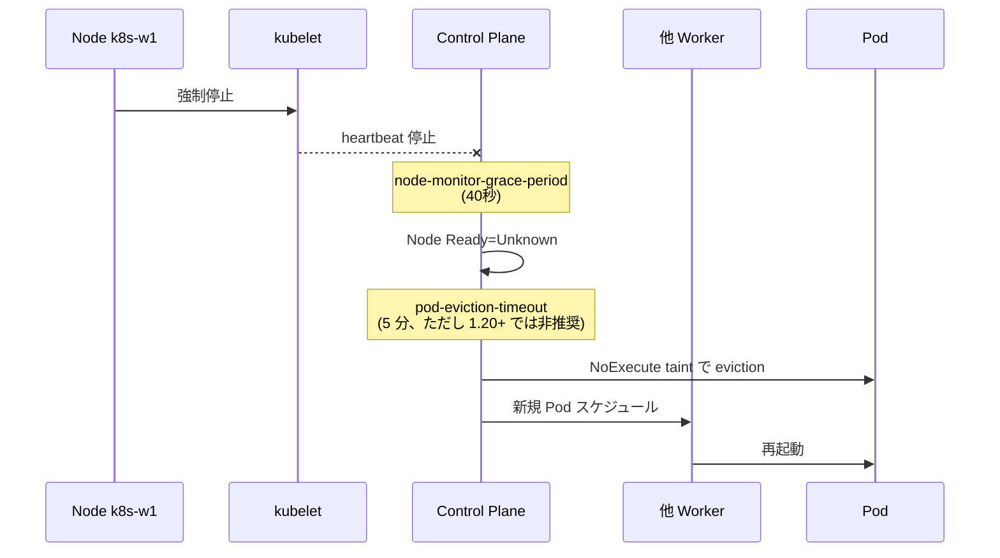
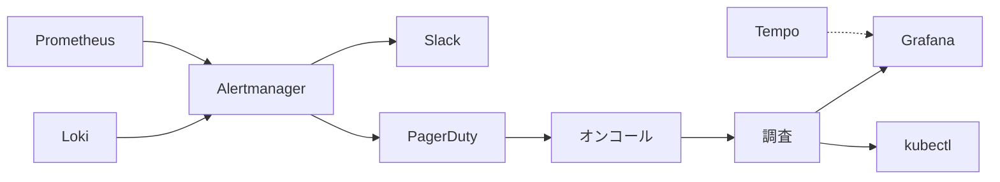

# 障害対応
{: .no_toc }

## 目次
{: .no_toc .text-delta }

1. TOC
{:toc}

---

## このページのゴール

このページを読み終えると、以下を **自分の言葉で説明できる** ようになります。

- 障害対応がなぜ **応急処置 → 調査 → 恒久対応** という順序で進められるのか、その歴史的背景と理論的根拠
- インシデントを **検知 → トリアージ → 沈静化 → 復旧 → 学習** に分けたフレームと、Kubernetes 上での具体的なアクション
- SEV(Severity)レベルの設計と、どのレベルでどのプロセスを発動するか
- **Incident Commander(IC)** をはじめとする役割分担と、ローカル環境でも 1 人で実演する方法
- 「Pod が動かない」「Service につながらない」「Node が NotReady」「etcd が応答しない」など、**Kubernetes の主要な障害シグネチャ 30 種類以上** の切り分け手順
- `kubectl` の各種コマンドのフラグまで掘り下げた **調査ツールボックス**
- Game Day(Chaos Engineering)の設計・実行・振り返り
- ミニ TODO サービスに対する具体的な障害注入演習を 6 種類以上設計・実行できる

---

## 障害対応の歴史と思想

### 「障害ゼロ」という幻想

1990 年代までのインフラ業界では、「無停止稼働(High Availability)」が至上目標とされていました。
ハードウェア冗長化、二重化、三重化を重ねれば、いつかは「100% 落ちないシステム」が作れる、という発想です。

しかし、これは経験的に **不可能** であることが分かってきました。理由は:

1. **ハードウェアは必ず壊れる**: ディスク、メモリ、電源、ファン、すべて MTBF(平均故障間隔)が存在する
2. **ソフトウェアにはバグがある**: 検証で全てを除去はできない
3. **人間がミスをする**: 設定変更、リリース、運用作業がインシデントの最大の引き金
4. **依存先が落ちる**: 外部 API、DNS、CDN、認証局、すべて自分の管理外
5. **物理事象**: 地震、火災、洪水、停電

Google SRE は、これを正面から受け入れ、「**100% 信頼性を目指すことは、それ自体がトイルと機会損失の山を作る**」と主張しました。
代わりに、許容できる失敗の量を **エラーバジェット** として明示し、その範囲内で運用する。

つまり障害対応の現代的定義は:

> **障害は起きる。問題は「いつ・どれくらい起きるか」と「起きた時にどう振る舞うか」だけ。**

### 「すぐ直す」 vs 「根本から直す」 のトレードオフ

障害発生時にエンジニアが最初に直面するのが、この二択です。

- A: ロールバックして 5 分で症状を消し、5xx 率を下げる
- B: 根本原因を突き止めて修正リリースする(数時間〜数日)

歴史的に、ベテランのインフラエンジニアは B を好む傾向がありました。「再発するから根本対応すべき」という発想です。
しかし SRE では **A が原則的に正解** です。なぜなら:

- ユーザーが今この瞬間に困っている(エラーバジェット消費中)
- 根本原因の調査は **落ち着いた環境で** やるほうが正確
- 焦った状態で根本対応すると、二次障害を生む

これを **Mitigation First**(まず止血)と呼びます。
逆に「症状だけ消して放置」してはいけないので、ポストモーテムで必ず根本対応に進みます。

### 「Heroic な深夜対応」を称賛しない

かつての運用文化では、「3 日寝ずに障害対応した A さんは英雄」という評価がありました。
これは SRE 的には **アンチパターン** です。

- 個人の超人的努力に頼るシステムは、その個人がいなくなると崩壊する
- 疲労した人間がコマンドを打つと、二次障害が増える
- 「ヒーローが必要な状況」自体が、仕組みの未熟さを示す

SRE では「ヒーローがいなくても回るシステム」を目指します。
具体的には:

- 明確なランブックを用意する
- オンコールを 1 人に集中させない
- 自動化できる対応は自動化する
- 障害から疲労した人を交代させる仕組みを持つ

### 障害対応はチームスポーツである

野球やサッカーと同じく、各人の役割が決まっていて、それぞれが連携することで成り立ちます。
1 人がベンチプレスのように 1 人で持ち上げるものではありません。

このページでは、後ほど **役割分担(IC, Ops, Comms, Scribe, SME)** を詳しく扱います。

---

## インシデントの定義

「インシデント」と呼ぶ基準を、まず明確化します。

### インシデントとは何か

PagerDuty の定義が分かりやすいです:

> An incident is an unplanned interruption to a service or a reduction in the quality of a service.
> (インシデントとは、サービスへの計画外の中断、またはサービス品質の低下)

要点:

- **計画外**: 計画停止は含まない
- **中断 or 品質低下**: 完全停止だけでなく、遅延・部分障害も含む
- **サービスへの影響**: 内部システムの不具合でも、最終的にユーザーに影響しないなら「障害」だが「インシデント」未満

### インシデントと欠陥の違い

- **インシデント**: 「いま起きている」「対応が必要」
- **欠陥(Defect)**: 「設計や実装の問題」「将来の改善が必要」

例:

- DB がダウンして API が応答しない → インシデント
- API のレスポンスタイムが遅い設計だが、SLO は超えていない → 欠陥(対応はバックログへ)

---

## SEV(Severity)レベル

インシデントの「重大度」を分類します。チームによって 3 段階 / 4 段階 / 5 段階様々ですが、本書では 4 段階に統一します。

| SEV | 名称 | 定義 | エスカレーション | 通知 |
|-----|------|------|------------------|------|
| **SEV-1** | Critical | 全ユーザー影響、サービス停止、データ消失リスク | 即時・全員召集 | 経営層まで |
| **SEV-2** | High | 一部機能停止、SLO 急速消費、限定ユーザー影響 | 30 分以内 | チームリーダー |
| **SEV-3** | Medium | 性能劣化、回避策あり、SLO 余裕あり | 営業時間内 | チーム内 |
| **SEV-4** | Low | 軽微な異常、ユーザー影響なし | バックログ | チーム内 |

ミニ TODO サービスでの例:

- **SEV-1**: `todo-api` 全体が 5xx を返している、DB が応答しない、データ消失
- **SEV-2**: `todo-api` の 5xx 率が 10% を超え SLO を急速消費、特定ユーザーグループで TODO 作成不可
- **SEV-3**: バッチ Worker が 1 回失敗、レイテンシが p95 で 500ms に増加(SLO 内)
- **SEV-4**: ログに ERROR が時折出る、メトリクス収集が一部欠落

{: .note }
> SEV を **数値で判定する基準** を事前に決めておくことが重要です。例: 「`todo-api` の 5xx 率 5 分平均が 5% を超えたら SEV-2」「10 分間 0 リクエストなら SEV-1」など。
> 主観で「これは SEV-2 かな?」と毎回悩むのは時間の無駄であり、組織知になりません。

---

## インシデント対応の全体フロー


```mermaid
flowchart TB
    detect[1. 検知<br>アラート / ユーザー報告] --> ack[2. 受信<br>オンコールが Ack]
    ack --> triage[3. トリアージ<br>SEV判定 / IC任命]
    triage --> ch[4. インシデントチャンネル開設]
    ch --> mitigate[5. 応急処置<br>とにかく止血]
    mitigate --> stable[6. 安定確認<br>SLO 戻ったか]
    stable --> investigate[7. 調査<br>根本原因]
    investigate --> fix[8. 恒久対応]
    fix --> close[9. インシデント終了宣言]
    close --> pm[10. ポストモーテム作成]
    pm --> followup[11. アクション完遂まで追跡]

    style mitigate fill:#fef2f2,stroke:#dc2626
    style pm fill:#dcfce7,stroke:#16a34a
```

各ステップの目標時間例(SEV-2 の場合):

| ステップ | 目標時間 |
|----------|----------|
| 検知 → Ack | 5 分以内 |
| Ack → SEV 判定 | 5 分以内 |
| SEV 判定 → 応急処置開始 | 10 分以内 |
| 応急処置 → 安定 | 30 分以内 |
| 終了宣言 → ポストモーテム公開 | 5 営業日以内 |

これを **MTTR(Mean Time To Recover)** や、より細かく **MTTD(Detect)/ MTTA(Acknowledge)/ MTTI(Investigate)/ MTTR(Resolve)** として測定し、改善目標にします。


```mermaid
gantt
    title MTTx の分解
    dateFormat HH:mm
    section インシデント
    障害発生         :milestone, 14:32, 0min
    検知遅延 MTTD    :crit, 14:32, 6min
    Ack 待ち MTTA    :active, 14:38, 2min
    調査 MTTI        :14:40, 8min
    復旧作業 MTTM    :active, 14:48, 7min
    全体 MTTR        :done, 14:32, 23min
```

---

## 役割分担(オンコール体制)


```mermaid
flowchart LR
    IC[Incident Commander<br>指揮 / 意思決定]
    Ops[Operations Lead<br>コマンド実行]
    Comms[Communications Lead<br>外部・関係者へ連絡]
    Scribe[Scribe<br>タイムライン記録]
    SME[Subject Matter Expert<br>専門知識提供]

    IC <-->|指示| Ops
    IC <-->|発信内容承認| Comms
    IC <-->|記録依頼| Scribe
    IC <-->|相談| SME
```

### IC(Incident Commander)

- **意思決定者**。応急処置の方針、エスカレーション、終了宣言を判断
- **コマンドは打たない**(打つと指揮ができない)
- 「私がコマンダーです」と明示する

### Ops(Operations Lead)

- **コマンドを打つ人**。`kubectl` を実行するのはここだけ
- 何を実行したかを Scribe に伝える
- 不確実なコマンドは IC に確認してから実行

### Comms(Communications Lead)

- 状況を **関係者と顧客に発信**
- ステータスページ更新、Slack、メール
- 「いつ、何が、いま、どう」の 4W を簡潔に

### Scribe(書記)

- すべての発言、コマンド、判断を **タイムスタンプ付きで記録**
- インシデント中の記憶は朝霧のように消える → 記録しないと再現不能
- ポストモーテムの元データになる

### SME(Subject Matter Expert)

- 当該システムに詳しい開発者・運用者
- 必要に応じて IC が招集する
- 複数 SME を呼ぶこともある(DB、ネットワーク、アプリ etc.)

### ローカル環境で 1 人でやるとき

学習中は 1 人で全部をやります。その場合のコツ:

- **タイマーを使う**: 自分が今どのモードか(Ops / IC / Comms)を 5 分単位で意識的に切り替える
- **手書きで Scribe**: 紙とペンで時刻を打ちながら作業
- **声に出す**: 「これからこの kubectl を打ちます」と独り言で言うと、IC モードのチェックが入る

---

## 検知(Detection)

### 1. アラートで検知

第 10 章で構築した Prometheus + Alertmanager から発火します。

例: `todo-api` の 5xx 率アラート(SLO Burn Rate):

```yaml
# prometheus rule
groups:
- name: todo-api-slo
  rules:
  - alert: TodoApiBurnRate
    # 1h と 5m の 2 window マルチバーンレート(SLO 99.5%)
    expr: |
      (
        sum(rate(http_requests_total{service="todo-api",code=~"5.."}[5m]))
        /
        sum(rate(http_requests_total{service="todo-api"}[5m]))
      ) > (14.4 * 0.005)
      and
      (
        sum(rate(http_requests_total{service="todo-api",code=~"5.."}[1h]))
        /
        sum(rate(http_requests_total{service="todo-api"}[1h]))
      ) > (14.4 * 0.005)
    for: 2m
    labels:
      severity: page
      slo: todo-api-availability
    annotations:
      summary: "todo-api SLO burning fast"
      description: "5xx burn rate is high. error budget will be exhausted in <2 days."
      runbook: "https://docs.example.com/runbooks/todo-api-5xx"
```

ここで `14.4` という数字は、SRE Workbook の **Multi-window, multi-burn-rate alert** の標準値です。
「1 時間あたり 2%(14.4 / 720)のエラーバジェットを消費したら警告」を意味します。

### 2. ユーザー報告で検知

- Twitter で「TODO 保存できない」と書かれる
- サポート窓口にチケットが立つ
- 顧客から直接メールが来る

**ユーザーがアラートより先に気づいたら、それは観測性の不足です** → ポストモーテムで改善対象。

### 3. 同僚から「動いてる?」と聞かれる

- 隣の開発者が「ローカルから API 叩けない」と Slack に書く
- これはアラートでもユーザー報告でもない、**準アラート**

### 4. 自分で気づく

- 「あれ、Pod の数いつもより少なくない?」と巡回中に気づく
- Grafana を見ていて、何か変だと感じる

---

## トリアージ(Triage)

### 影響範囲の見積もり

最初の 5 分でやること:

1. **どのサービスに影響?**(todo-api / frontend / worker / 全体)
2. **どのユーザーに影響?**(全員 / 一部 / 特定 IP / 特定リージョン)
3. **エラー率は?**(0% → 5% / 50% / 100%)
4. **直近の変更は?**(リリース / 設定変更 / インフラ変更)

```bash
# 全体のサービス健全性をワンビューで
kubectl get pods -A -o wide \
  --field-selector=status.phase!=Running,status.phase!=Succeeded

# 直近のイベント(降順)
kubectl get events -A --sort-by='.lastTimestamp' | tail -50
```

**`kubectl get pods -A` のフラグ全解説**:

| フラグ | 意味 | 使いどころ |
|--------|------|------------|
| `-A`, `--all-namespaces` | 全 Namespace を対象に | クラスタ全体の障害確認時に必須 |
| `-o wide` | Pod IP、Node、Nominated Node などを追加表示 | どの Node の Pod がやられているかを瞬時に把握 |
| `-o yaml` | YAML 全文 | 詳細仕様の確認用 |
| `-o json` | JSON 全文 | `jq` でフィルタする際に |
| `-o jsonpath='{...}'` | JSONPath で必要なフィールドだけ | スクリプト用 |
| `-l app=todo-api` | ラベルセレクタ | 特定アプリだけに絞る |
| `--field-selector=status.phase!=Running` | フィールドセレクタ | 異常な Pod のみ |
| `-w`, `--watch` | 変更をストリーム表示 | リアルタイム監視 |
| `--sort-by='.metadata.creationTimestamp'` | 作成順 | 古い順に並べる |
| `--show-labels` | ラベル列を表示 | デバッグ時 |
| `--show-kind` | リソース種別を Name 列に含める | 複数リソースを混合表示時 |

{: .warning }
> `-w` を使ったあと **Ctrl-C** を忘れないこと。バックグラウンドで watch が走り続けて、API Server に余計な負荷をかけ続けます。

### SEV 判定の例

判定マトリクス(参考):

| 観点 | SEV-1 | SEV-2 | SEV-3 |
|------|-------|-------|-------|
| 影響ユーザー | 全員 | 50% 以上 | 部分的 |
| データ消失 | あり / 疑い | なし | なし |
| 機能 | 完全停止 | コア機能停止 | 一部機能のみ |
| エラーバジェット | 1 日で枯渇 | 1 週間で枯渇 | 1 ヶ月で枯渇 |
| 回避策 | なし | 限定的 | あり |

### IC 任命とチャンネル開設

```text
@channel #incidents

INCIDENT START
ID: INC-2026-05-15-01
SEV: 2
Title: todo-api 5xx burst
IC: @taro
Comms: @hanako
Ops: @jiro
Scribe: @sakura
Bridge: https://meet.example.com/incidents/now
Status: investigating
```

このテンプレートを Slack のスニペットに登録しておくと、コピペで即開始できます。

---

## 応急処置(Mitigation)

### 最頻出の 3 つの応急処置

#### 1. ロールバック

```bash
# 直近のロールアウト履歴
kubectl rollout history deployment/todo-api -n prod

# 1 つ前に戻す
kubectl rollout undo deployment/todo-api -n prod

# 特定リビジョンに戻す
kubectl rollout undo deployment/todo-api -n prod --to-revision=42

# 完了を待つ
kubectl rollout status deployment/todo-api -n prod --timeout=120s
```

**フラグ解説**:

- `--to-revision=<n>`: 戻す先のリビジョン番号
- `--timeout=120s`: タイムアウト(超えるとコマンドは失敗終了するが、ロールアウト自体は継続)

GitOps(Argo CD)使用時は:

```bash
argocd app rollback todo-api 42
```

または Git でリバートして push し、自動同期に任せる:

```bash
git revert <commit-sha>
git push origin main
```

{: .tip }
> 「コマンドで応急対応」と「Git でリバート」のどちらをやるかは、**事前に決めておく**。インシデント中に議論すると時間の無駄。

#### 2. Pod 再起動

```bash
# Deployment 全体を再起動(無停止)
kubectl rollout restart deployment/todo-api -n prod

# 特定 Pod だけ削除(Deployment が再作成)
kubectl delete pod todo-api-7d8b5cf89-abcde -n prod

# Pod を全削除 ─ ラベルセレクタ
kubectl delete pod -l app.kubernetes.io/name=todo-api -n prod

# 強制削除(普通の状態ではしない)
kubectl delete pod todo-api-xxx -n prod --grace-period=0 --force
```

**`--grace-period=0 --force` の意味と危険性**:

- 通常、Pod は `terminationGracePeriodSeconds`(デフォルト 30 秒)の間に SIGTERM で終了処理をする
- `--grace-period=0` はこれを 0 秒に → SIGKILL で即殺し
- `--force` はさらに、API オブジェクトを **etcd から即削除** する
- **危険性**: 実際の Pod プロセスは Node にまだ残っているのに、API Server からは「削除済み」になる。同名 Pod が再作成されると、ホスト名衝突や PV 取り合いが起きる
- **使う場面**: ノードが死んでいて Pod が永遠に Terminating のとき。それ以外では使わない

#### 3. スケール調整

```bash
# 緊急スケールアップ
kubectl scale deployment/todo-api -n prod --replicas=10

# トラフィックを全部遮断したい場合
kubectl scale deployment/todo-api -n prod --replicas=0

# HPA を一時無効化(scale を有効にするため)
kubectl patch hpa/todo-api -n prod -p '{"spec":{"minReplicas":10,"maxReplicas":10}}'
```

### 4. NetworkPolicy で隔離

不正アクセスや特定ソースからの DoS で、トラフィック遮断が必要なとき:

```yaml
# api を全外部から遮断、内部 Ingress のみ許可
apiVersion: networking.k8s.io/v1
kind: NetworkPolicy
metadata:
  name: emergency-isolate-api
  namespace: prod
spec:
  podSelector:
    matchLabels:
      app.kubernetes.io/name: todo-api
  policyTypes: [Ingress]
  ingress:
  - from:
    - namespaceSelector:
        matchLabels:
          name: ingress-nginx
```

### 5. Feature Flag を切る

アプリケーション側で機能フラグを実装していれば、危ない機能だけ即座に切れます。

```bash
kubectl patch cm/feature-flags -n prod --type=merge \
  -p '{"data":{"NEW_TODO_ALGORITHM":"false"}}'
kubectl rollout restart deployment/todo-api -n prod
```

### 6. Drain(ノード退避)

ノード障害の予兆があるとき:

```bash
# 全 Pod を退避(DaemonSet 以外)
kubectl drain k8s-w1 --ignore-daemonsets --delete-emptydir-data --timeout=600s

# 戻す
kubectl uncordon k8s-w1
```

**フラグ詳細**:

- `--ignore-daemonsets`: DaemonSet の Pod は退避しない(ノードに残る)
- `--delete-emptydir-data`: emptyDir ボリュームのデータは消える、それでよいか
- `--force`: ReplicaSet / Job / StatefulSet 等のオーナーがない Pod も削除
- `--grace-period=600`: Pod 終了猶予(秒)
- `--timeout=600s`: drain 全体のタイムアウト
- `--disable-eviction`: PDB を無視(危険、最後の手段)
- `--pod-selector=app=foo`: 特定 Pod だけ drain

{: .warning }
> `--force` と `--disable-eviction` は **PDB を無視する** ことを意味します。本番では絶対に避けてください。「PDB が邪魔だから無効化」ではなく、「PDB に従う設計に戻す」が正解です。

---

## Kubernetes における調査ツールボックス

### `kubectl get` 系

```bash
# Pod 一覧の基本
kubectl get pods -n prod -o wide

# 異常な Pod のみ
kubectl get pods -A --field-selector=status.phase!=Running

# 最近作成された Pod
kubectl get pods -A --sort-by='.metadata.creationTimestamp' | tail -20

# 古い restart カウントを見る
kubectl get pods -n prod -o custom-columns=NAME:.metadata.name,RESTARTS:.status.containerStatuses[*].restartCount
```

`-o custom-columns` のフォーマット:

```
列名:JSONPath
```

複数指定はカンマ区切り。たとえば:

```bash
kubectl get pods -n prod -o custom-columns=\
NAME:.metadata.name,\
NODE:.spec.nodeName,\
PHASE:.status.phase,\
READY:.status.containerStatuses[*].ready
```

### `kubectl describe` 系

最重要コマンドです。**Events** を見る最初の入り口。

```bash
kubectl describe pod todo-api-xxx -n prod
kubectl describe node k8s-w1
kubectl describe pvc todo-postgres-data-0 -n prod
kubectl describe svc todo-api -n prod
```

Events に出てくる主要なメッセージとその意味:

| Event | 意味 | 対処 |
|-------|------|------|
| `FailedScheduling` | スケジューラが Node を見つけられない | リソース、Taint、Affinity を確認 |
| `Insufficient cpu/memory` | リソース不足 | Requests を下げる or Node 追加 |
| `Pulled / Pulling` | イメージ取得中 | 通常正常 |
| `Failed to pull image` | レジストリ到達不可、認証失敗、タグ不存在 | レジストリ確認、imagePullSecrets |
| `Back-off pulling image` | プル失敗の指数バックオフ中 | 上記同様 |
| `Started / Killing` | Pod のライフサイクル | 正常 or 強制終了 |
| `Unhealthy` | Liveness / Readiness 失敗 | Probe 設定確認、アプリログ |
| `BackOff` | CrashLoopBackOff | 起動失敗、ログ確認 |
| `Evicted` | Node のリソース不足で追放 | Node 状態、QoS Class 確認 |
| `OutOfcpu` / `OutOfmemory` | Node が約束したリソースを切らした | キャパシティ計画見直し |
| `NodeNotReady` | Node が NotReady | kubelet ログ確認 |
| `FailedMount` | ボリュームマウント失敗 | PVC、StorageClass、NFS 確認 |
| `FailedAttachVolume` | CSI ドライバが付け外しに失敗 | CSI Pod のログ確認 |
| `NetworkNotReady` | CNI 初期化失敗 | CNI Pod 確認 |

### `kubectl logs` 系

```bash
# 単一コンテナの Pod
kubectl logs todo-api-xxx -n prod

# 複数コンテナの Pod ─ コンテナ名指定
kubectl logs todo-api-xxx -c api -n prod

# 直前のクラッシュコンテナのログ
kubectl logs todo-api-xxx -c api -n prod --previous

# テール
kubectl logs todo-api-xxx -c api -n prod --tail=200

# フォロー
kubectl logs todo-api-xxx -c api -n prod -f

# 時刻指定
kubectl logs todo-api-xxx -c api -n prod --since=10m
kubectl logs todo-api-xxx -c api -n prod --since-time='2026-05-15T10:00:00Z'

# 全コンテナ
kubectl logs todo-api-xxx -n prod --all-containers=true

# ラベルセレクタで複数 Pod を一度に
kubectl logs -l app.kubernetes.io/name=todo-api -n prod --tail=50

# stern を使うとマルチ Pod / マルチコンテナで色分け
stern -n prod 'todo-api-.*'
```

**`--previous` と `--since` の組み合わせの罠**:

- `--previous` は「現在の Pod の」前のコンテナのログ。Pod 自体が削除されると消える
- 永続化したい場合は Loki などの集約システムへ

### `kubectl exec` 系

```bash
# シェルに入る
kubectl exec -it todo-api-xxx -c api -n prod -- /bin/sh

# 単発コマンド
kubectl exec todo-api-xxx -c api -n prod -- ps aux

# 標準入力を渡す
echo "SELECT 1" | kubectl exec -i todo-postgres-0 -n prod -- psql

# 引数の `--` の意味
# `--` 以降は kubectl ではなくコンテナのコマンドへ
```

**注意**: Distroless イメージや scratch イメージでは `sh` も `ls` もないため、exec できません。
そういう時は **ephemeral container** を使います(後述)。

### `kubectl debug`(エフェメラルコンテナ)

K8s 1.23 から GA(1.18 から alpha)。実行中の Pod に **デバッグ用の追加コンテナ** を注入できます。

```bash
# 既存 Pod にツール付きコンテナを差し込む
kubectl debug -it todo-api-xxx -n prod --image=nicolaka/netshoot --target=api

# プロセス Namespace を共有(他コンテナの ps が見える)
kubectl debug -it todo-api-xxx -n prod --image=busybox --share-processes --copy-to=todo-api-debug

# ノードに入ってデバッグ
kubectl debug node/k8s-w1 -it --image=ubuntu
```

`--target=<container>` で対象コンテナの Namespace を共有することで、ファイルシステム / プロセスを覗き見できます。
**ただし Distroless だと共有 fs が小さい場合あり**。ephemeral container はコンテナがランタイムレベルで対応している必要があります。

### `kubectl top` 系(リソース消費)

Metrics Server が必要。

```bash
kubectl top nodes
kubectl top pods -A
kubectl top pods -n prod --containers
kubectl top pods -n prod --sort-by=cpu
kubectl top pods -n prod --sort-by=memory
```

### `kubectl events`(専用コマンド、v1.27 以降は推奨)

```bash
# 通常の events より見やすい
kubectl events -A --watch
kubectl events --for pod/todo-api-xxx -n prod
```

### `kubectl get --raw`(API Server を直接叩く)

```bash
# ヘルスチェック
kubectl get --raw=/healthz
kubectl get --raw=/livez?verbose
kubectl get --raw=/readyz?verbose

# 個別チェック
kubectl get --raw=/livez/etcd
kubectl get --raw=/livez/poststarthook/start-kube-apiserver-admission-initializer

# メトリクス
kubectl get --raw=/metrics > /tmp/apiserver-metrics.txt

# 任意のリソースを RESTful に
kubectl get --raw=/api/v1/namespaces/prod/pods/todo-api-xxx
```

### ノードに SSH しての調査

```bash
ssh k8s-w1

# kubelet
sudo systemctl status kubelet
sudo journalctl -u kubelet -n 200 --no-pager
sudo journalctl -u kubelet --since '10 minutes ago' -f

# containerd
sudo systemctl status containerd
sudo journalctl -u containerd -n 100

# crictl(コンテナランタイム直叩き)
sudo crictl ps
sudo crictl ps -a  # 停止済み含む
sudo crictl logs <container-id>
sudo crictl inspect <container-id>
sudo crictl pods
sudo crictl images

# ノードのリソース消費
top
free -h
df -h
df -i  # inode 確認(意外と忘れる)
iostat -xm 5
sar -n DEV 5
```

**crictl のフラグ**:

```bash
# 全 Pod とコンテナをツリー状に
sudo crictl ps -a -o table

# JSON 出力
sudo crictl ps -o json | jq '.containers[] | {name: .metadata.name, state: .state}'

# ログをフォロー
sudo crictl logs -f <id>

# 直接 exec
sudo crictl exec -it <id> sh
```

### ネットワーク調査

```bash
# debug pod を立てる
kubectl run debug --rm -it --image=nicolaka/netshoot -n prod -- bash

# 中で:
dig todo-postgres.prod.svc.cluster.local
dig +trace todo-postgres
nslookup todo-postgres
curl -v http://todo-api.prod.svc:8000/healthz
curl -v http://todo-api/healthz   # Namespace 内ショートフォーム
nc -zv todo-postgres 5432
tcpdump -i any -nn -s0 -A 'port 5432' &
mtr todo-postgres
ip route show
iptables-save | grep todo
ss -tnlp
ss -tn 'state established'
```

### ホスト側ネットワーク調査

```bash
ssh k8s-w1

# CNI のルーティング(Calico の場合)
sudo calicoctl node status
sudo calicoctl get felixconfiguration
sudo calicoctl get ippool

# iptables(legacy)
sudo iptables -t nat -L KUBE-SERVICES -n | head -30

# ipvs(モードによる)
sudo ipvsadm -Ln

# conntrack
sudo conntrack -L | wc -l
sudo cat /proc/sys/net/netfilter/nf_conntrack_max
```

---

## 障害シグネチャ別 切り分けフロー

ここからは **「症状 → 原因 → 対処」** をシグネチャごとに掘り下げます。

### Pod が Pending のまま動かない


```mermaid
flowchart TB
    start[Pod が Pending] --> describe[kubectl describe pod]
    describe --> events[Events を読む]
    events --> q1{FailedScheduling?}
    q1 -->|Yes| q2{原因は?}
    q1 -->|No| q3{Pulled は出ている?}
    q2 -->|Insufficient cpu/memory| res_resource[ノード追加 / requests 下げる]
    q2 -->|node had untolerated taint| res_taint[Toleration 追加 or Taint 除去]
    q2 -->|nodes didnt match affinity| res_affinity[Affinity 見直し]
    q2 -->|nodes are unavailable| res_unavail[Node の Ready 確認]
    q2 -->|no nodes available| res_nonodes[Node が 0 台、kubectl get nodes]
    q3 -->|まだ Pulling| res_pull[次の ImagePull 系へ]
    q3 -->|Yes| res_init[InitContainer の状態確認]
```

**症状別の詳細**:

- `0/6 nodes are available: 6 Insufficient cpu`: クラスタ全体で CPU が足りない
  - 解決1: `kubectl top nodes` で空き確認、Pod の `requests.cpu` を下げる
  - 解決2: ノード追加(VMware で k8s-w4 を増設)
  - 解決3: 不要 Pod を削減、Priority Class で優先度の低い Pod を Evict
- `0/3 nodes are available: 3 node(s) had untolerated taint`: Worker が 0 台で Control Plane に Taint がある
  - 解決: Worker を Ready にする、または Toleration を追加(本番では非推奨)
- `0/6 nodes are available: 6 node(s) didn't match Pod's node affinity/selector`: Affinity ルールに合うノードがない
  - 解決: `nodeSelector` / `nodeAffinity` を再考、対象 Node にラベルを付ける
- `0/6 nodes are available: 4 node(s) had volume node affinity conflict`: PV のゾーンと Pod のスケジュール先が不一致
  - 解決: StorageClass の `volumeBindingMode: WaitForFirstConsumer`、または Pod を PV と同じゾーンへ
- `0/6 nodes are available: 6 pod has unbound immediate PersistentVolumeClaims`: PVC が Pending
  - 解決: PVC を describe して StorageClass / Provisioner を確認

```bash
# PVC が Pending な場合
kubectl describe pvc <name> -n <ns>
kubectl get storageclass
kubectl logs -n kube-system -l app=csi-nfs-controller  # NFS-CSI の場合
```

### Pod が ContainerCreating のまま

ContainerCreating は「Pod は Bind 済みで、コンテナ起動準備中」の状態。
ここで止まる代表的原因:

- **ボリュームマウント失敗**:
  - PV が存在しない
  - NFS サーバ到達不可
  - SubPath が不正
  - Secret / ConfigMap が存在しない(volume として参照)
- **CNI 失敗**:
  - Calico の calico-node が NotReady
  - IP プール枯渇
  - ノードの BGP ピアが落ちている
- **イメージプル中**(別カテゴリ)

```bash
# 何で詰まっているか
kubectl describe pod <name> -n <ns> | grep -A 20 Events

# Volume 関連なら
kubectl describe pvc <name> -n <ns>
kubectl get pv | grep <name>

# CNI なら
kubectl get pods -n kube-system | grep -i calico
kubectl logs -n kube-system <calico-node-xxx> --previous
```

### Pod が CrashLoopBackOff

「起動 → 即終了」を繰り返している状態。BackOff の間隔は指数バックオフで増加(10s, 20s, 40s, 80s, …、最大 5 分)。


```mermaid
flowchart TB
    cl[CrashLoopBackOff] --> logs[kubectl logs --previous]
    logs --> q1{ログにエラー?}
    q1 -->|Yes| read[ログを読む]
    q1 -->|No - すぐ落ちる| q2{Exit Code は?}
    q2 -->|0| ok[正常終了 = エントリポイントが終わる]
    q2 -->|1| app_err[アプリエラー = ログ再確認]
    q2 -->|137| oom[OOMKilled = メモリ不足]
    q2 -->|139| segv[SegFault]
    q2 -->|143| sigterm[SIGTERM 受信 = liveness?]
    read --> cause[原因特定 → 対処]
```

```bash
# 直前のコンテナのログ
kubectl logs <pod> -c <container> -n <ns> --previous

# 終了コード
kubectl get pod <pod> -n <ns> -o jsonpath='{.status.containerStatuses[*].lastState.terminated.exitCode}'

# OOM の確認
kubectl get pod <pod> -n <ns> -o jsonpath='{.status.containerStatuses[*].lastState.terminated.reason}'
# OOMKilled が出れば確定
```

**Exit Code 一覧**:

| Code | 意味 |
|------|------|
| 0 | 正常終了(=ENTRYPOINT が完了) |
| 1 | 一般的なエラー |
| 2 | Misuse of shell builtins |
| 126 | コマンドは見つかったが実行不可 |
| 127 | コマンドが見つからない |
| 128+N | シグナル N で終了(128+9=137=SIGKILL=OOM、128+15=143=SIGTERM) |
| 130 | Ctrl-C (SIGINT) |
| 137 | OOMKilled or SIGKILL |
| 139 | SIGSEGV (SegFault) |
| 143 | SIGTERM(Probe 失敗での Kill など) |

### ImagePullBackOff / ErrImagePull

```bash
kubectl describe pod <name> -n <ns> | grep -A 5 Events
# Failed to pull image "192.168.56.10:5000/todo-api:0.1.0": rpc error: code = NotFound desc = ...

# 1. レジストリ到達確認
kubectl run reg-check --rm -it --image=alpine -n prod -- sh
# 中で:
wget -O - http://192.168.56.10:5000/v2/_catalog
wget -O - http://192.168.56.10:5000/v2/todo-api/tags/list

# 2. ノード側からの解像度
ssh k8s-w1 'curl -v http://192.168.56.10:5000/v2/'

# 3. containerd 設定(insecure registry)
ssh k8s-w1 'cat /etc/containerd/config.toml | grep -A 3 192.168.56.10'

# 4. imagePullSecrets(プライベートレジストリで認証必要な場合)
kubectl get sa default -n prod -o yaml
kubectl get secret -n prod | grep dockercfg
```

`192.168.56.10:5000` のローカルレジストリで認証なしの場合、containerd は HTTPS 前提なので **insecure として明示** が必要:

```toml
# /etc/containerd/config.toml
[plugins."io.containerd.grpc.v1.cri".registry]
  config_path = "/etc/containerd/certs.d"
```

```toml
# /etc/containerd/certs.d/192.168.56.10:5000/hosts.toml
server = "http://192.168.56.10:5000"

[host."http://192.168.56.10:5000"]
  capabilities = ["pull", "resolve"]
  skip_verify = true
```

設定後 `systemctl restart containerd`。

### Service / Ingress につながらない


```mermaid
flowchart TB
    no_conn[サービス到達不可] --> svc{Service Endpoint は?}
    svc -->|kubectl get endpoints が空| label[Selector 不一致]
    svc -->|Endpoint あり| dns{DNS は引ける?}
    dns -->|引けない| coredns[CoreDNS Pod 確認]
    dns -->|引ける| port{ポート開いている?}
    port -->|NG| np[NetworkPolicy 確認]
    port -->|OK| app[アプリ側のリッスン確認]
    label --> fix1[selector / Pod labels を一致させる]
    coredns --> fix2[CoreDNS Pod / ConfigMap]
    np --> fix3[NetworkPolicy 確認 / 開放]
    app --> fix4[コンテナ内で ss / netstat]
```

```bash
# 1. Service の Endpoints(空でないか)
kubectl get endpoints todo-api -n prod
kubectl get endpointslices -n prod -l kubernetes.io/service-name=todo-api

# 2. Selector ↔ Pod labels
kubectl get svc todo-api -n prod -o jsonpath='{.spec.selector}'
kubectl get pods -n prod --show-labels | grep todo-api

# 3. DNS
kubectl run dns --rm -it --image=busybox:1.36 -n prod -- nslookup todo-api

# 4. ポート到達
kubectl run nc --rm -it --image=alpine -n prod -- nc -zv todo-api 8000

# 5. NetworkPolicy
kubectl get networkpolicy -n prod
kubectl describe networkpolicy -n prod

# 6. kube-proxy(古いがまだ重要)
kubectl get pods -n kube-system -l k8s-app=kube-proxy
kubectl logs -n kube-system <kube-proxy-xxx>

# 7. Ingress
kubectl get ingress -n prod
kubectl describe ingress -n prod
kubectl logs -n ingress-nginx -l app.kubernetes.io/name=ingress-nginx
```

### Node が NotReady

```bash
kubectl get nodes
kubectl describe node k8s-w1 | head -40

# NotReady の理由が Conditions に出る
# Type: Ready Status: False Reason: KubeletNotReady ...

# kubelet 不調?
ssh k8s-w1 'systemctl status kubelet'
ssh k8s-w1 'journalctl -u kubelet -n 100 --no-pager'

# よくある Conditions
# - MemoryPressure=True: メモリ不足
# - DiskPressure=True: ディスク不足
# - PIDPressure=True: プロセス数上限
# - NetworkUnavailable=True: CNI 未初期化
```

**MemoryPressure / DiskPressure 時の挙動**:

- kubelet が Pod を Evict する(QoS Class が低い順)
- Evict 順: BestEffort → Burstable → Guaranteed
- Pod の `Quality of Service` Class を `kubectl describe pod` で確認

**eviction の閾値(kubelet デフォルト)**:

```
memory.available < 100Mi
nodefs.available < 10%
imagefs.available < 15%
```

これは `--eviction-hard` フラグで変えられる。

### etcd 異常

```bash
# 全 control plane で確認
ssh k8s-cp1
sudo ETCDCTL_API=3 etcdctl \
  --endpoints=https://127.0.0.1:2379 \
  --cacert=/etc/kubernetes/pki/etcd/ca.crt \
  --cert=/etc/kubernetes/pki/etcd/server.crt \
  --key=/etc/kubernetes/pki/etcd/server.key \
  endpoint status --cluster -w table

# ヘルスチェック
sudo ETCDCTL_API=3 etcdctl ... endpoint health

# アラート出ているか
sudo ETCDCTL_API=3 etcdctl ... alarm list
```

**症状別**:

- **DB サイズ > 8GB**: コンパクション + デフラグが必要(capacity.md 参照)
- **slow apply 警告**: ディスク IO が遅い → SSD 化、IOPS 確認
- **leader 選挙頻発**: ネットワーク不調、`heartbeat-interval` ミスマッチ
- **アラート `NOSPACE`**: 即書き込み停止状態。compact + defrag + alarm disarm

### 全 API リクエストが遅い / タイムアウト

```bash
# API Server 自体の応答
time kubectl version

# API Server のリクエストレイテンシ
kubectl get --raw=/metrics | grep apiserver_request_duration_seconds | grep p99

# webhook が原因?
kubectl get mutatingwebhookconfigurations
kubectl get validatingwebhookconfigurations
# 失敗してる Webhook が一つあると、全 API がブロックされる

# 該当 Webhook の Pod 確認
kubectl get pods -A -l app=<webhook-name>
```

特に **`failurePolicy: Fail`** の Webhook が応答不能になると、対象リソースの作成/更新が全停止します。緊急時は:

```bash
# Webhook を一時的に Ignore に
kubectl patch validatingwebhookconfiguration <name> --type=json \
  -p='[{"op":"replace","path":"/webhooks/0/failurePolicy","value":"Ignore"}]'
```

ただし、これは **応急処置**。後で必ず元に戻すこと。

### イメージ取得は成功するのに Pod が ImagePullBackOff になる稀ケース

`describe` で `signature verification failed` が出ていれば、cosign / sigstore 等で署名検証が有効化されており、署名なしイメージが拒否されている。

---

## デバッグ環境を作る ─ ハンズオン

### 1. ステージング Namespace の作成

```bash
kubectl create namespace todo-staging
kubectl label namespace todo-staging environment=staging
```

### 2. 故意に壊れた Pod を作る

```yaml
# break-1.yaml: image 名が間違っている
apiVersion: v1
kind: Pod
metadata:
  name: broken-image
  namespace: todo-staging
spec:
  containers:
  - name: app
    image: 192.168.56.10:5000/todo-api:NOT_EXIST
```

```bash
kubectl apply -f break-1.yaml
kubectl describe pod broken-image -n todo-staging
# Events: Failed to pull image ... not found
```

```yaml
# break-2.yaml: memory limit が小さすぎる
apiVersion: v1
kind: Pod
metadata:
  name: oom-test
  namespace: todo-staging
spec:
  containers:
  - name: app
    image: alpine:3.20
    command: ["sh","-c","while true; do x=$(yes | head -c 200M); sleep 1; done"]
    resources:
      limits:
        memory: "50Mi"
```

```bash
kubectl apply -f break-2.yaml
kubectl get pod oom-test -n todo-staging -w
# 数秒で OOMKilled
kubectl describe pod oom-test -n todo-staging | grep -i reason
```

```yaml
# break-3.yaml: liveness が厳しすぎる
apiVersion: v1
kind: Pod
metadata:
  name: livenes-test
  namespace: todo-staging
spec:
  containers:
  - name: app
    image: nginx:1.27
    livenessProbe:
      httpGet:
        path: /not-exist
        port: 80
      initialDelaySeconds: 2
      periodSeconds: 2
      failureThreshold: 1
```

```bash
kubectl apply -f break-3.yaml
# CrashLoopBackOff になっていく
```

### 3. ネットワークデバッグセット

```bash
# 常設のデバッグ Pod
kubectl run debug-tools -n todo-staging --image=nicolaka/netshoot \
  --command -- sleep infinity

# 入る
kubectl exec -it debug-tools -n todo-staging -- bash

# 中でできること
# dig, nslookup, host
# curl, wget
# nc, ncat
# tcpdump, tshark
# traceroute, mtr
# nmap
# ss, netstat
# iptables, ipset
# strace, ltrace
```

---

## インシデント時のコミュニケーション

### Slack 運用パターン

#### 1. 専用チャンネル開設

```
#inc-2026-05-15-todoapi5xx
```

メリット:
- インシデントごとに記録が分離
- 関係者だけ集まる
- ログとして残る

#### 2. Status 更新の型

15-30 分ごとに、必ず IC が以下を投稿:

```
STATUS UPDATE [14:55]

Current state: 5xx rate is back to 0.3% (was 28%)
Last action: rolled back todo-api to 1.2.9
Next: monitoring for 30 minutes
ETA to resolved: 15:30

Open questions:
- root cause not yet identified
- check if N+1 query in /api/todos
```

#### 3. アクションログ

Ops が打つコマンドは別チャンネル `#inc-2026-05-15-cmd` に流す:

```
[14:48] kubectl rollout undo deployment/todo-api -n prod
[14:48] kubectl rollout status deployment/todo-api -n prod
[14:53] kubectl logs -n prod -l app=todo-api --tail=100
```

### ステータスページの更新

外部公開しているサービスなら、ステータスページも適切に更新:

```
[Investigating]
14:45 JST - We are investigating reports of high error rates on the TODO API.

[Identified]
14:55 JST - We have identified the issue and are working on a fix.

[Monitoring]
15:10 JST - A fix has been deployed and we are monitoring the results.

[Resolved]
15:24 JST - The issue has been resolved. We will publish a postmortem within 5 business days.
```

### NG パターン

- 「対応中です」とだけ書いて、進捗を共有しない
- 個人の DM で対応する(後で誰も読めない)
- 顧客に「もうすぐ直ります」と根拠なく言う(信頼を失う)
- 「誰々のせいで」と個人を名指しする(Blameful)

---

## Chaos Engineering と Game Day

### Chaos Engineering の歴史と思想

2010 年頃、Netflix が "Chaos Monkey" を発表しました。
本番環境の EC2 インスタンスを **ランダムに** 殺すツールです。これにより:

- 「インスタンスは壊れて当然」という設計を強制
- インスタンスに状態を持たせない(Cattle, not Pets)
- 自動復旧の経路を実際に発火させて検証

その後、"Simian Army" として:
- Chaos Monkey: インスタンス停止
- Chaos Gorilla: AZ 全滅
- Chaos Kong: リージョン全滅
- Latency Monkey: ネットワーク遅延
- Conformity Monkey: 設定逸脱検知

…が公開されました。
**Chaos Engineering の本質は「壊して直す」ではなく「壊れても回ることを証明する」** ことです。

### Game Day

カオスエンジニアリングを **イベント化** したものが Game Day。

- 日時を決めて、関係者を集める
- 想定シナリオを共有(完全ブラインドにはしない)
- 障害を注入
- 対応を実演 → 振り返り

### ローカルでできる Game Day 6 種

#### Game Day 1: ノード停止

```bash
# VMware で k8s-w1 を強制停止
vmrun stop /vmware/k8s-w1.vmx hard

# 観測:
# - kubectl get nodes で w1 が NotReady
# - 5 分後、w1 上の Pod が他ノードへ再スケジュール
# - todo-api の SLO バーンレートが一時的に上がる

# 復旧:
vmrun start /vmware/k8s-w1.vmx
```

期待される動き:


```mermaid
sequenceDiagram
    participant N as Node k8s-w1
    participant kubelet as kubelet
    participant cp as Control Plane
    participant other as 他 Worker
    participant Pod as Pod
    
    N->>kubelet: 強制停止
    kubelet--xcp: heartbeat 停止
    Note over cp: node-monitor-grace-period<br>(40秒)
    cp->>cp: Node Ready=Unknown
    Note over cp: pod-eviction-timeout<br>(5 分、ただし 1.20+ では非推奨)
    cp->>Pod: NoExecute taint で eviction
    cp->>other: 新規 Pod スケジュール
    other->>Pod: 再起動
```

#### Game Day 2: Pod 強制終了

```bash
# 1つだけ
kubectl delete pod -l app.kubernetes.io/name=todo-api -n prod \
  $(kubectl get pods -n prod -l app.kubernetes.io/name=todo-api -o jsonpath='{.items[0].metadata.name}')

# 全部
kubectl delete pods -l app.kubernetes.io/name=todo-api -n prod
```

Chaos Mesh を使う場合:

```yaml
apiVersion: chaos-mesh.org/v1alpha1
kind: PodChaos
metadata:
  name: api-pod-kill
  namespace: prod
spec:
  action: pod-kill
  mode: one
  selector:
    namespaces: [prod]
    labelSelectors:
      app.kubernetes.io/name: todo-api
  scheduler:
    cron: "@every 5m"
```

期待:

- 1 Pod が消えるが、Service の Endpoint から外れる → 残り Pod でカバー
- HPA があれば数分後に補充
- SLO への影響は **ほぼゼロ** であるべき

#### Game Day 3: DNS 障害

```bash
# CoreDNS Pod を全部止める
kubectl scale -n kube-system deploy/coredns --replicas=0

# 観測:
# - 全 Pod 内からの DNS 解決が失敗
# - クラスタ内通信が壊滅

# 戻す
kubectl scale -n kube-system deploy/coredns --replicas=2
```

学ぶこと: アプリの DNS タイムアウト設定、`ndots` の影響、NodeLocal DNSCache の重要性。

#### Game Day 4: API Server 不通

実機で全 API Server を止めると Game Day どころでなくなるので、**1 台だけ** 止めて HAProxy のフェイルオーバーを観測:

```bash
ssh k8s-cp1
sudo mv /etc/kubernetes/manifests/kube-apiserver.yaml /root/
# kubelet が manifest を見て kube-apiserver を停止

# 観測:
# - HAProxy が cp1:6443 を unhealthy 判定 → cp2/cp3 へ
# - kubectl は問題なく動き続けるはず

# 戻す
sudo mv /root/kube-apiserver.yaml /etc/kubernetes/manifests/
```

#### Game Day 5: ネットワーク遅延注入

```yaml
apiVersion: chaos-mesh.org/v1alpha1
kind: NetworkChaos
metadata:
  name: api-latency
  namespace: prod
spec:
  action: delay
  mode: all
  selector:
    namespaces: [prod]
    labelSelectors:
      app.kubernetes.io/name: todo-api
  delay:
    latency: "300ms"
    jitter: "100ms"
    correlation: "50"
  duration: "5m"
```

観測: p95 レイテンシが急上昇、SLO ヒット、HPA は反応しない(CPU 基準のため)。

#### Game Day 6: ディスクフル

```bash
ssh k8s-w1
sudo dd if=/dev/zero of=/var/log/big bs=1M count=20000

# DiskPressure → Evictions
kubectl describe node k8s-w1 | grep -A 5 Conditions
kubectl get events -n prod | grep Evicted

# クリーンアップ
sudo rm /var/log/big
```

### Game Day の Pre-Mortem

実施前に書くテンプレート:

```markdown
# Game Day Plan

Date: 2026-05-20 14:00 JST
Duration: 2h
Owner: @taro

## シナリオ
todo-api の Pod が突然 3 分間、すべて削除される。

## 仮説
- Deployment の replicas=3 設定により、削除されても新 Pod が再作成される
- HPA は反応しない(瞬間的なため)
- SLO は 5 分間で 0.5% 程度の影響にとどまる
- 自動アラートが 1 分以内に発火する

## 中止条件
- 5xx 率 10% を超え、5 分以上戻らない
- データ消失の兆候
- 外部ユーザーから苦情

## ロール
- Lead: @taro
- Observer: @hanako
- Safety: @jiro (中止判定)

## チェックリスト
- [ ] バックアップ確認
- [ ] ロールバック手順確認
- [ ] 関係者通知
- [ ] ステータスページに「メンテ中」表示
```

実施後の Post-Mortem は次ページで扱います。

---

## ランブック(Runbook)

「特定のアラートに対する対応手順書」をランブックと呼びます。
ポストモーテムで得た知見を **ランブック化** することで、次回同じ障害が来た時、誰でも対応できます。

### ランブックテンプレート

```markdown
# Runbook: todo-api high 5xx rate

## アラート
- TodoApiBurnRate

## 影響
- ユーザーの TODO 作成・取得が 5xx を返す
- SLO のエラーバジェット消費

## 確認手順
1. Grafana ダッシュボード: https://grafana.example/d/todo-api
2. 5xx 内訳: `sum by (status_code) (rate(http_requests_total{service="todo-api",code=~"5.."}[5m]))`
3. 直近のリリース確認: `kubectl rollout history deploy/todo-api -n prod`

## 応急処置
| 状況 | アクション |
|------|------------|
| リリース直後の 5xx | ロールバック: `kubectl rollout undo deploy/todo-api -n prod` |
| DB 接続エラー | DB Pod / postgres Service 確認 |
| メモリ枯渇 (OOM) | replicas 増加: `kubectl scale deploy/todo-api -n prod --replicas=10` |
| Webhook 失敗 | mutatingwebhookconfiguration を Ignore に |

## エスカレーション
- 15 分で改善しなければ SEV-1 化、DB チーム召集
- 30 分で改善しなければ Blue-Green クラスタへ切替

## 関連リンク
- 過去の同種ポストモーテム: PM-2026-04-30-01, PM-2026-02-12-01
- アーキテクチャ図: docs/architecture/todo-api.md
```

### ランブックのアンチパターン

- **古い**: 6 ヶ月前から更新されていないランブックは害悪
- **長すぎる**: 50 ページのランブックは深夜に読めない
- **コード化されていない**: 「手順 3 を実行」では再現性が低い → スクリプト化を

---

## 監視・観測との連動

第 10 章で構築した観測スタックとの連動:


```mermaid
flowchart LR
    metric[Prometheus] --> alert[Alertmanager]
    log[Loki] --> alert
    trace[Tempo] -.-> grafana
    alert --> slack[Slack]
    alert --> pager[PagerDuty]
    pager --> oncall[オンコール]
    oncall --> investigate[調査]
    investigate --> grafana[Grafana]
    investigate --> kubectl[kubectl]
```

### ダッシュボードの三層

1. **概要(SLO)**: 各サービスの SLO とエラーバジェット残量
2. **詳細(USE / RED)**: USE (Utilization, Saturation, Errors) / RED (Rate, Errors, Duration)
3. **個別**: Pod / Container / Node の詳細メトリクス

オンコールエンジニアは **概要 → 詳細 → 個別** の順に降りていく。

---

## チェックポイント

ここまでで以下を **自分の言葉で** 説明できるか確認してください。

- [ ] 障害対応の 5 ステップ(検知 → トリアージ → 沈静化 → 復旧 → 学習)をそれぞれ 30 秒で説明できる
- [ ] SEV-1〜4 の判定基準を、自分のサンプルアプリに具体的に当てはめられる
- [ ] IC / Ops / Comms / Scribe / SME の役割の違いを、なぜ分離が必要かまで説明できる
- [ ] Pod が Pending の主要 4 原因(Insufficient resources / Taint / Affinity / Volume)を挙げて、それぞれの調査コマンドを言える
- [ ] CrashLoopBackOff の Exit Code 137 と 143 の違いを説明できる
- [ ] `--grace-period=0 --force` の危険性を説明できる
- [ ] Service につながらないときの切り分けフローを、5 段階以上で書ける
- [ ] Game Day を 1 種類、自分のサンプルアプリで設計し、Pre-Mortem を書ける
- [ ] ランブックがあるとなぜ良いのか、3 つ以上の理由を挙げられる
- [ ] アラートの「Multi-window, multi-burn-rate」の意義を説明できる

→ 次は [ポストモーテム]({{ '/11-sre/postmortem/' | relative_url }})
