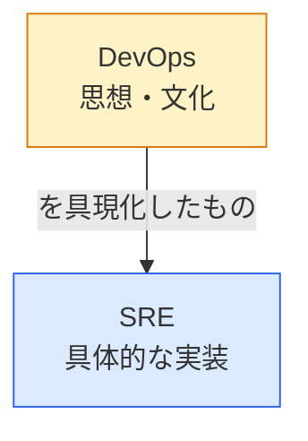
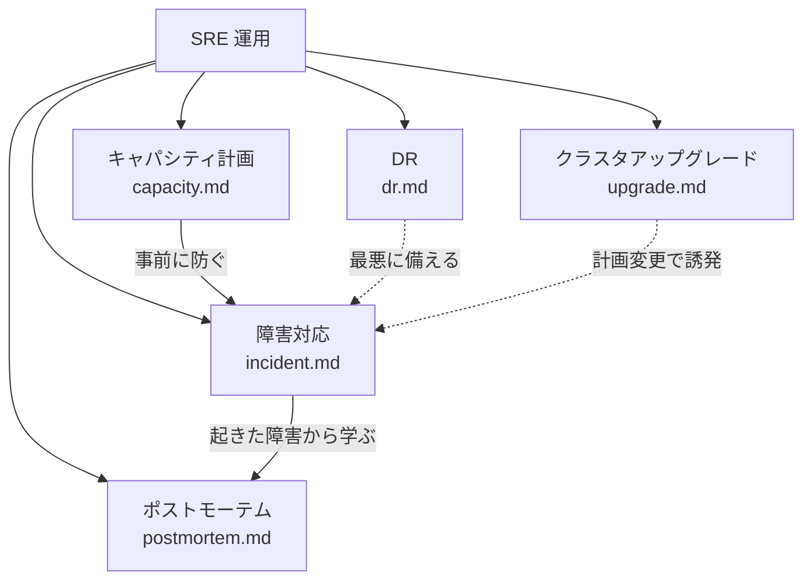
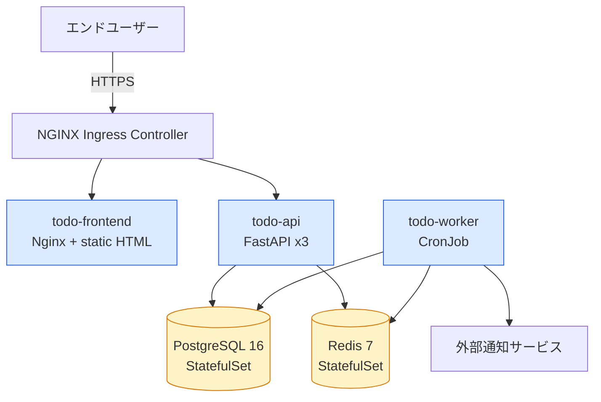
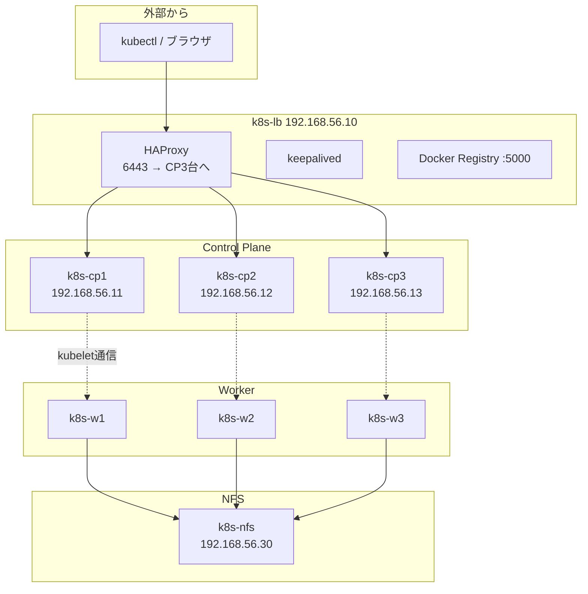
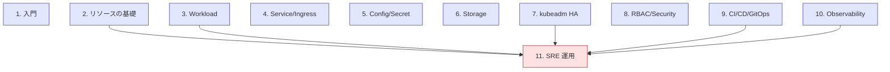

# 11. SRE運用
{: .no_toc }

## 目次
{: .no_toc .text-delta }

1. TOC
{:toc}

---

## この章のゴール

この章を読み終えると、以下を **自分の言葉で説明できる** ようになります。

- SRE という職能が **どのような歴史的経緯で生まれたのか**、従来の Sysadmin / Operator とどう違うのか
- Kubernetes クラスタを「動かし続ける」ために必要な **5 つの柱**(障害対応 / ポストモーテム / キャパシティ計画 / DR / アップグレード)の全体像
- SLI / SLO / SLA / エラーバジェット / トイル(Toil)といった **SRE のコア概念** とその使い方
- ミニ TODO サービスを本番想定で運用するときに、**どこにどんな運用負担が発生するか** を見積もる方法
- ローカルの VMware kubeadm クラスタ上で、**本番と同じ訓練ができる** Game Day / DR 演習の設計方法
- 「クラスタを使い捨てる」 GitOps 思想と「クラスタを大事にする」 Pet 思想の違いと、どちらをいつ使うか
- 本章以降のページをどの順で読み、どんなハンズオンを実施すれば、現場で通用する SRE スキルが身につくかの **学習ロードマップ**

---

## なぜ「SRE運用」という独立章を立てるのか

ここまでの第 1 章〜第 10 章では、「Kubernetes をどう構築するか」「アプリケーションをどう乗せるか」「観測性をどう確保するか」を順を追って学んできました。
しかし、現場で本当に難しいのは **作ることではなく、動かし続けること** です。

実際の現場で起きる典型的な出来事を、いくつか挙げてみます。

- ある朝、`todo-api` の 5xx 率が突然 30% を超えた。Slack のアラートチャンネルでオンコールエンジニアが反応するまでの 6 分の間に、ユーザーは TODO を保存できず、サポート窓口には問い合わせが殺到していた。
- 半年前に立てたクラスタが、いつのまにか CPU Requests 充填率 85% に達していた。誰も気づかないまま、Pending の Pod が増え始め、CI/CD のデプロイがタイムアウトするようになっていた。
- 「セキュリティパッチが必要なので、K8s 1.27 から 1.30 まで一気に上げてください」と言われたが、kubeadm は 1 マイナーずつしか上げられず、しかも Webhook が新 API に対応していないことに当日まで気づかなかった。
- ストレージサーバの RAID コントローラが壊れ、PV が全滅した。バックアップは取っていたはずだが、最後に検証したのが 8 ヶ月前で、リストア手順を誰も覚えていなかった。
- 退職した同僚しか知らないノード(`k8s-w-special`)が `taints` のせいで使われずに 8 ヶ月放置されていた。そのノードのディスクが、ある日突然 100% になった。

これらはすべて、「構築」ではなく「運用」のフェーズで起きる問題です。
本章は、こうした **「動かし続ける」ための知識と訓練** を、ローカル環境で身体に染み込ませるための章です。

{: .important }
> 本書は EKS / GKE / AKS のようなマネージドサービスを使いません。
> 「マネージドだから自分で運用ノウハウを持つ必要はない」と思いがちですが、それは誤りです。
> マネージドサービスでも、**アプリケーション層の障害対応・ポストモーテム・キャパシティ計画・アプリレベルの DR ・アプリ起因のアップグレード問題** は自分で面倒を見る必要があります。
> 本章で学ぶプラクティスは、マネージドを使う場合にもそのまま応用できます。

---

## SRE という職能の歴史

「SRE(Site Reliability Engineering)」という言葉そのものは、**2003 年に Google が初めて公式に使い始めた** 役職名です。
当時の Google は爆発的に成長しており、従来の「Operator が手動で運用する」モデルでは、サーバ台数の増加に運用人員の増加が追いつかなくなっていました。

それ以前のインフラ運用は、おおむね以下のような世界でした。

### Sysadmin 時代(1990 年代〜 2000 年代前半)

1 人のシステム管理者が、数台〜数十台のサーバに SSH で入り、シェルスクリプトと `cron` で運用する世界です。

- **デプロイ**: `scp` で `.war` や `.tar.gz` を配って、`init.d` で再起動
- **監視**: `Nagios` がメールを送り、人間が `top` と `tail -f /var/log/messages` で原因を追う
- **キャパシティ計画**: 「来月、サーバを 2 台買い足してください」という稟議書を書く
- **障害対応**: 個人の暗黙知に依存。「あの障害は山田さんしか直せない」
- **復旧計画**: テープバックアップは取るが、リストア訓練はやらない

この方式は、サーバが数百台を超えると **線形にスケールしません**。運用工数がサーバ台数に比例して増えるからです。Google ではこの限界がいち早く露呈しました。

### DevOps の登場(2008 年〜)

2008 年、Patrick Debois らによって「DevOps」というムーブメントが提唱されます。
**Dev(開発者)と Ops(運用者)の壁を壊し、共同で動かそう** という思想です。

ツール面では:

- 構成管理ツール(Puppet、Chef、Ansible)による「冪等な構成」
- IaC(Infrastructure as Code)としての Terraform、CloudFormation
- CI/CD パイプライン(Jenkins、Travis CI、GitLab CI)

これらが普及しました。しかし DevOps は **「文化と思想」を主に語る** ものであり、「具体的にどう運用するか」の **エンジニアリング的なアプローチ** はあまり整理されていませんでした。

### SRE の確立(2003 年〜、2016 年に書籍化)

Google の Ben Treynor Sloss は SRE を次のように定義しました。

> **SRE is what happens when a software engineer is tasked with what used to be called operations.**
> (SRE とは、運用と呼ばれていた仕事をソフトウェアエンジニアにやらせるとどうなるかである)

ポイントは「Sysadmin の延長ではなく、**ソフトウェアエンジニアリングのアプローチで運用を解く**」という発想の転換です。

具体的には:

- **トイル(Toil)を 50% 未満に保つ**: 反復的・自動化可能な手作業に費やす時間を、エンジニア時間の半分以下に
- **エラーバジェット**: 「100% は目指さない」ことを数値で合意する
- **ブラメレス・ポストモーテム**: 個人を責めるのではなく、仕組みを直す
- **オンコールのローテーション**: 単一障害点の人間を作らない
- **ソフトウェアによる自動化**: ランブックをコード化する

2016 年、Google が "Site Reliability Engineering: How Google Runs Production Systems"(通称 SRE 本) を出版し、これらが世界中に広まりました。

### SRE と DevOps の関係

混同されがちですが、関係は以下のように整理できます。



Google は「SRE is one prescriptive way of implementing DevOps」と表現しています。
DevOps が「Dev と Ops の溝を埋めよう」という **方向性** を示すのに対し、SRE は「具体的にこうやって運用しろ」という **処方箋** を提供します。

### Kubernetes と SRE

Kubernetes はもともと Google 社内のシステム "Borg" を起源とし、**Borg を運用していた Google SRE のノウハウ** が色濃く反映されています。

- **宣言的 API**: 望ましい状態を書く → 現実をそれに収束させる(=自動化前提)
- **自己修復**: Pod が落ちたら自動で再起動(=人間が深夜に SSH する必要がない)
- **ローリングアップデート**: 無停止デプロイがビルトイン
- **オブザーバビリティ**: metrics エンドポイントが標準化されている
- **コントローラパターン**: 「監視 → 修正」のループをユーザーも書ける

つまり、Kubernetes を使う以上、**SRE 的な運用は前提です**。
逆に SRE のプラクティスを知らないと、Kubernetes が本来持っている強みを使い切れません。

---

## SRE のコア概念

本章を読み進めるうえで、最低限知っておくべき概念を整理します。

### SLI / SLO / SLA

| 用語 | 正式名称 | 意味 | 例 |
|------|----------|------|-----|
| **SLI** | Service Level Indicator | サービスレベル指標(実測値) | `todo-api の 5xx 率 = 0.2%` |
| **SLO** | Service Level Objective | サービスレベル目標(内部目標) | `5xx 率 ≤ 0.1% を 99% の時間帯で達成` |
| **SLA** | Service Level Agreement | サービスレベル合意(顧客との契約) | `99.9% 未達なら 10% 返金` |

数値の関係は **SLI < SLO < SLA** が原則です。
内部目標(SLO)を顧客との契約(SLA)よりも厳しく設定することで、SLA 違反前に手を打つ余地を確保します。

### エラーバジェット

SLO が `99.9%` なら、許容される失敗の割合は `0.1%`。これが **エラーバジェット** です。

30 日(43,200 分)の月で考えると:

- `99.9%` SLO → エラーバジェット 43.2 分/月
- `99.95%` SLO → エラーバジェット 21.6 分/月
- `99.99%` SLO → エラーバジェット 4.32 分/月

エラーバジェットの使い方:

- 残量が潤沢 → 新機能リリースしてよい(攻めの姿勢)
- 残量がゼロに近い → リリース凍結、信頼性向上に集中(守りの姿勢)

これにより、「リリースしたい開発」と「安定させたい運用」の対立を、**数値で客観的に解決** できます。

### トイル(Toil)

「価値を生まないが、繰り返し発生する手作業」を **トイル** と呼びます。

特徴:

- 手作業(automate できるはず)
- 反復的(同じことを何度もやる)
- 戦術的(根本対応ではなく対症療法)
- サービス規模に比例して増える
- 永続的価値がない

Google SRE は **トイルを業務時間の 50% 未満に保つ** ことを目標とします。
半分以上が自動化と改善に使われる、それが SRE の条件です。

例:

- 「毎週月曜に PVC のスナップショットを手動で取る」→ CronJob 化(トイル削減)
- 「ノードのディスクが満杯になったら毎回手動で `journalctl --vacuum` する」→ `logrotate` 設定(トイル削減)
- 「リリース時に `kubectl apply` するためにジャンプサーバに SSH する」→ Argo CD で自動化(トイル削減)

### Blameless(非難しない)文化

障害対応とポストモーテムで最重要となる原則です。詳しくは `postmortem.md` で扱いますが、要点は:

- 「Aさんがミスした」と書かない
- 「Aさんがコマンドを打ったとき、確認の仕組みが無かった」と書く
- **個人ではなく仕組みを直す**

これを徹底しないと、隠ぺい・改ざんが始まり、組織の学習が止まります。

### Production Readiness Review (PRR)

新サービスを本番に投入する前に行う **本番受け入れ検査** です。
チェック項目の例:

- [ ] Liveness / Readiness / Startup Probe が設定されているか
- [ ] Resource Requests / Limits が設定されているか
- [ ] PDB(PodDisruptionBudget)が設定されているか
- [ ] HPA(HorizontalPodAutoscaler)が設定されているか
- [ ] メトリクスエンドポイントを公開しているか(`/metrics`)
- [ ] 構造化ログを出しているか
- [ ] ランブックが存在するか
- [ ] オンコールローテーションに登録されているか
- [ ] SLO が定義されているか
- [ ] バックアップ・リストア手順があるか
- [ ] DR 演習を実施したか

第 5 章〜第 10 章で扱った内容の総まとめでもあります。

---

## この章の 5 つの柱

本章は以下の 5 つのページで構成されます。



それぞれの位置づけ:

### 1. 障害対応(incident.md)

「いま起きている問題をどう止めるか」。
**応急処置 → 調査 → 恒久対応** の流れと、Kubernetes 固有の調査手法、Game Day(訓練)までを扱います。

### 2. ポストモーテム(postmortem.md)

「終わった障害から、組織として何を学ぶか」。
Blameless テンプレート、5 Whys、アクションアイテム管理、組織への展開を扱います。

### 3. キャパシティ計画(capacity.md)

「いまのリソースで何ヶ月もつか」。
CPU / Memory / Pod 数 / etcd / Network といったレイヤーごとの監視指標、PromQL、Grafana ダッシュボード、Cluster Autoscaler を扱います。

### 4. DR ─ Disaster Recovery(dr.md)

「クラスタごと壊れた / データが消えた」前提の復旧設計。
RPO / RTO の合意形成、etcd スナップショット、Velero、GitOps による「クラスタ使い捨て」戦略、DR 演習を扱います。

### 5. クラスタアップグレード(upgrade.md)

「Kubernetes の新バージョンに上げる」。
kubeadm でのインプレースアップグレード、Blue-Green クラスタアップグレード、Deprecated API の検出、Webhook 互換性確認を扱います。

---

## ミニ TODO サービスの本番運用想定

本章では、ここまで作ってきた **ミニ TODO サービス** を「本番運用している」想定で進めます。

### システム構成のおさらい



### 仮の SLO 設定

| サービス | SLI | SLO | エラーバジェット/月 |
|----------|-----|------|---------------------|
| `todo-frontend` | 可用性 (2xx + 3xx 率) | 99.9% | 43.2 分 |
| `todo-api` | 可用性 (5xx 率の補数) | 99.5% | 216 分 |
| `todo-api` | レイテンシ p95 | 300ms 以下 | ─ |
| `todo-worker` | バッチ成功率 | 99% | ─ |
| データ整合性 | RPO | 1 時間 | ─ |
| 復旧時間 | RTO | 4 時間 | ─ |

`todo-api` の SLO が 99.9% でなく **99.5%** なのは、「これは学習用システムなので、過剰な信頼性要求はトイルを増やすだけ」という意図的な選択です。
実プロジェクトでは、**ビジネス側との合意** で決めます。

### 想定される運用ロール

学習用には 1 人で全部やりますが、現場では以下のように分担します。

| ロール | 責務 |
|--------|------|
| **Incident Commander (IC)** | 障害時の指揮、対応の決定権 |
| **Communications Lead** | 関係者・顧客への状況共有 |
| **Operations Lead** | コマンド実行、調査の実務 |
| **Subject Matter Expert (SME)** | 当該システムに詳しい開発者 |
| **Scribe** | タイムラインを記録する書記 |

オンコールローテーションは、最小でも 4 名以上で回すのが健全(週 7 日 × 24 時間 ÷ 1 人あたり週 40 時間 = ≒ 4.2 人)。

---

## ローカル VMware kubeadm 環境のおさらい

本章のハンズオンは、第 7 章で構築した HA クラスタを使います。

```
k8s-lb   192.168.56.10   HAProxy + keepalived + Docker Registry
k8s-cp1  192.168.56.11   Control Plane HA #1
k8s-cp2  192.168.56.12   Control Plane HA #2
k8s-cp3  192.168.56.13   Control Plane HA #3
k8s-w1   192.168.56.21   Worker #1
k8s-w2   192.168.56.22   Worker #2
k8s-w3   192.168.56.23   Worker #3
k8s-nfs  192.168.56.30   NFS サーバ (バックアップ保管にも使用)
```



### 本章で追加するもの

- **監視スタック**: Prometheus + Alertmanager + Grafana(第 10 章で構築済み想定)
- **バックアップ保管**: `k8s-nfs:/export/etcd-backup` と `/export/velero`
- **MinIO**: Velero のオブジェクトストレージとして `k8s-nfs` 上に Docker で起動
- **Chaos Mesh**: Game Day 用

---

## 学習ロードマップ

本章の推奨進行順:

```mermaid
flowchart LR
    start([章開始]) --> read1[1. index.md を読む<br>≈30 分]
    read1 --> incident_r[2. incident.md 通読<br>≈90 分]
    incident_r --> incident_h[3. incident.md ハンズオン<br>≈120 分]
    incident_h --> pm_r[4. postmortem.md<br>≈60 分]
    pm_r --> pm_h[5. 自分で書いてみる<br>≈60 分]
    pm_h --> cap_r[6. capacity.md<br>≈90 分]
    cap_r --> cap_h[7. PromQL 演習<br>≈120 分]
    cap_h --> dr_r[8. dr.md<br>≈90 分]
    dr_r --> dr_h[9. etcd リストア演習<br>≈180 分]
    dr_h --> up_r[10. upgrade.md<br>≈60 分]
    up_r --> up_h[11. v1.30 → v1.31 演習<br>≈240 分]
    up_h --> done([章完了])
```



合計学習時間目安: **約 20〜25 時間**(初学者ベース)。

各ページのハンズオンを **必ず実機で** 一度は通すことを強く推奨します。
「読むだけ」では身につきません。失敗してクラスタを壊して直す経験こそが SRE スキルです。

---

## 本章で使う追加ツール一覧

| ツール | 用途 | インストール先 |
|--------|------|----------------|
| `kubectl` | 基本操作 | クライアント PC |
| `kubectl-debug` プラグイン | Pod の中に入って調査 | クライアント PC |
| `stern` | 複数 Pod のログ集約閲覧 | クライアント PC |
| `k9s` | TUI クラスタダッシュボード | クライアント PC |
| `etcdctl` | etcd 直接操作 | Control Plane |
| `velero` CLI | バックアップ管理 | クライアント PC |
| `pluto` / `kubent` | Deprecated API 検出 | クライアント PC |
| `chaos-mesh` | カオスエンジニアリング | クラスタ内 |
| `minio` | オブジェクトストレージ(Velero 用) | k8s-nfs |
| `node-problem-detector` | ノード異常検知 | クラスタ内 |
| `Robusta` (オプション) | アラート対応支援 | クラスタ内 |

### インストール例

```bash
# kubectl プラグインマネージャ krew
(
  set -x; cd "$(mktemp -d)" &&
  OS="$(uname | tr '[:upper:]' '[:lower:]')" &&
  ARCH="$(uname -m | sed -e 's/x86_64/amd64/' -e 's/\(arm\)\(64\)\?.*/\1\2/' -e 's/aarch64$/arm64/')" &&
  KREW="krew-${OS}_${ARCH}" &&
  curl -fsSLO "https://github.com/kubernetes-sigs/krew/releases/latest/download/${KREW}.tar.gz" &&
  tar zxvf "${KREW}.tar.gz" &&
  ./"${KREW}" install krew
)
export PATH="${KREW_ROOT:-$HOME/.krew}/bin:$PATH"

# プラグイン追加
kubectl krew install ctx        # コンテキスト切替
kubectl krew install ns         # Namespace切替
kubectl krew install debug      # デバッグ用Pod差し込み
kubectl krew install neat       # YAMLからmanagedFields除去
kubectl krew install tree       # オーナーリファレンス可視化
kubectl krew install who-can    # RBAC逆引き
kubectl krew install deprecations  # 廃止API検知

# stern
go install github.com/stern/stern@latest
# または curl で取得

# k9s
curl -sS https://webinstall.dev/k9s | bash

# velero CLI
wget https://github.com/vmware-tanzu/velero/releases/download/v1.14.0/velero-v1.14.0-linux-amd64.tar.gz
tar -xvzf velero-v1.14.0-linux-amd64.tar.gz
sudo mv velero-v1.14.0-linux-amd64/velero /usr/local/bin/

# pluto
wget https://github.com/FairwindsOps/pluto/releases/download/v5.20.1/pluto_5.20.1_linux_amd64.tar.gz
tar -xvzf pluto_5.20.1_linux_amd64.tar.gz
sudo mv pluto /usr/local/bin/

# kubent
sh -c "$(curl -sSL https://git.io/install-kubent)"
```

---

## SRE プラクティスをローカル環境で学ぶ意義

「ローカルの 3+3 ノードクラスタなんかで、本物の SRE スキルが身につくのか?」という疑問は当然あります。
結論としては、**身につくものとつかないものがあり、ローカルで学べる範囲は実はかなり広い** というのが本書の立場です。

### ローカルで学べるもの(◎)

- kubectl による調査・トラブルシュート手順
- マニフェストの YAML 設計
- etcd バックアップ・リストアの実機
- kubeadm によるアップグレード手順
- Velero による PV バックアップ
- Prometheus / Grafana によるメトリクス収集
- GitOps(Argo CD)による宣言的運用
- Chaos Engineering(Pod 殺し、ネットワーク遅延注入)
- Game Day の進め方
- ポストモーテムの書き方
- ランブックの整備
- ノード障害時の挙動観察

### ローカルでは限定的に学べるもの(△)

- マルチリージョン構成(VM の数で擬似可)
- 数千ノード規模の挙動(スケジューラ評価は別途)
- ハードウェア障害(VM 停止で擬似は可能)
- ネットワーク機器障害(VMware Host-only 内で擬似可能)
- 大規模負荷下の挙動(k6 / locust を別途使う)

### ローカルでは学びにくいもの(×)

- リアルなユーザー行動パターン
- 数十億リクエスト/日の運用感覚
- 巨大なチーム内コミュニケーション
- 真のオンコール疲労

しかし、**プラクティスとツールチェーンの「型」を体に染み込ませる** ことは、ローカルで十二分にできます。
むしろローカルだからこそ、**安心して壊せる** という大きな利点があります。

{: .tip }
> 本章のハンズオン中、クラスタが壊れて元に戻せなくなったら、それは大成功です。
> 第 7 章のインストール手順を見返して再構築してください。
> 「壊して、原因を理解して、直す」というサイクルこそが学習です。

---

## 各ページのページごとの概観

### `incident.md`(障害対応)で得るもの

- **トリアージのフレーム**: 影響範囲、SEV 判定、IC 任命
- **kubectl ベースの調査手順** を 30 シナリオ以上の網羅(Pod Pending、CrashLoopBackOff、ImagePullBackOff、Evicted、NotReady、etcd 異常、Network 不通、DNS 解決失敗、ConfigMap 不整合、Secret 期限切れ、…)
- **mermaid によるフローチャート** での切り分け
- **Chaos Mesh による Game Day 設計** と実演 6 種
- **インシデント時のコミュニケーション** プロトコル

### `postmortem.md`(ポストモーテム)で得るもの

- Blameless の本質的意味
- Postmortem テンプレートの全項目解説
- 5 Whys / Fishbone(石川ダイアグラム)/ Causal Loop の手法
- アクションアイテム管理(防止 / 検知 / 緩和 / プロセス)
- Postmortem を組織知に変える運用方法
- サンプルの完成版 Postmortem を 3 つ

### `capacity.md`(キャパシティ計画)で得るもの

- レイヤーごとの監視指標(ノード / Pod / etcd / API Server / Network)
- PromQL の実用例 50 本以上
- Grafana ダッシュボードの作り方
- Cluster Autoscaler / Karpenter / 手動スケーリングの使い分け
- etcd サイジング・コンパクション・デフラグ
- 容量予測モデル(線形回帰、季節調整)

### `dr.md`(DR)で得るもの

- RPO / RTO の決め方
- バックアップ対象の網羅(etcd、PV、マニフェスト、イメージ、Secret、IAM)
- etcd スナップショットからの完全リストア(実機演習)
- Velero による Namespace / PV バックアップ
- GitOps による「クラスタ使い捨て」戦略
- マルチクラスタフェイルオーバー

### `upgrade.md`(アップグレード)で得るもの

- Kubernetes のリリースサイクルとサポートポリシー
- Deprecated API の事前検出(`pluto`、`kubent`)
- kubeadm によるインプレースアップグレード(v1.30 → v1.31 完全手順)
- アドオンの互換性確認
- Blue-Green クラスタアップグレード
- 切り戻し計画

---

## SRE 関連の参考文献

本格的に学ぶには以下が定番です。本書だけに頼らず、必ず併読してください。

### 必読

- **"Site Reliability Engineering: How Google Runs Production Systems"** (Beyer et al., 2016, O'Reilly)
  - 通称「SRE 本」。全文 Google が無料公開: https://sre.google/sre-book/table-of-contents/
- **"The Site Reliability Workbook: Practical Ways to Implement SRE"** (Beyer et al., 2018, O'Reilly)
  - SRE 本の実践編。https://sre.google/workbook/table-of-contents/
- **"Building Secure and Reliable Systems"** (Adkins et al., 2020, O'Reilly)
  - セキュリティと信頼性。https://sre.google/books/building-secure-reliable-systems/

### 推奨

- **"Database Reliability Engineering"** (Campbell & Majors, 2017, O'Reilly): データ層の SRE
- **"Seeking SRE"** (Blank-Edelman, 2018, O'Reilly): SRE 実装パターン集
- **"Implementing Service Level Objectives"** (Hidalgo, 2020, O'Reilly): SLO 入門
- **"Observability Engineering"** (Majors, Fong-Jones, Miranda, 2022, O'Reilly): 可観測性
- **"Chaos Engineering"** (Rosenthal & Jones, 2020, O'Reilly): 障害注入の体系
- **"Learning from Incidents in Software"** (Galletta, 2023, O'Reilly): 障害学習組織論

### 論文

- Verma et al. "Large-scale cluster management at Google with Borg" (EuroSys 2015)
  - Kubernetes の前身 Borg。Pod や Controller の原型がここに。
- Burns et al. "Borg, Omega, and Kubernetes" (ACM Queue 2016)
  - Google 3 世代のクラスタマネージャの比較。
- "Service Level Indicators (SLIs) and Service Level Objectives (SLOs)" (Google Cloud Architecture Center)

### コミュニティ

- **CNCF**: https://www.cncf.io/
- **Kubernetes Slack**: #sig-* 各種チャンネル
- **SREcon** (USENIX): 毎年開催される SRE の国際カンファレンス
- **SLOconf**: SLO に特化したカンファレンス

---

## 本章で何を「卒業」したいか

本章を完了したとき、以下ができるようになっていることを目指します。

1. 自分が運用するクラスタに **本番障害が起きた時**、慌てずに 30 分以内に応急処置を打てる
2. その障害について **24 時間以内** にブラメレスなポストモーテムを書ける
3. 半年後のキャパシティを **数値で予測** し、必要な増設を稟議できる
4. 「明日クラスタが壊れたら」 という問いに **手順書ベースで答えられる**
5. K8s のマイナーバージョンアップを **無停止で** 完遂できる
6. これらを **後輩に教えられる**(自分の言葉で説明できる、最大のテスト)

これは現場の SRE のジュニア〜ミドルレベルの要件にほぼ一致します。

---

## 章間の関連性

本章は、他章の知識を統合して使う集大成的な位置づけです。



特に第 10 章(Observability)で構築した Prometheus / Grafana / Loki / Tempo / Alertmanager は、本章の前提として動いている必要があります。
もしまだなら、第 10 章のセクションに戻って先に構築してください。

---

## チェックポイント

ここまでで以下を **自分の言葉で** 説明できるか確認してください。

- [ ] SRE が生まれた歴史的経緯と、DevOps との関係を説明できる
- [ ] SLI / SLO / SLA / エラーバジェットの違いと相互関係を例示できる
- [ ] トイル(Toil)の定義と、SRE が目指す比率を答えられる
- [ ] Blameless の意義を、Blame ありの場合に起きる問題と対比して説明できる
- [ ] ミニ TODO サービスの SLO 例を 1 つ自分で設計できる
- [ ] 本章の 5 つのページがそれぞれ何を扱うか答えられる
- [ ] 本章のハンズオンに必要なローカル環境がすでに整っていることを確認した

→ 次は [障害対応]({{ '/11-sre/incident/' | relative_url }})
