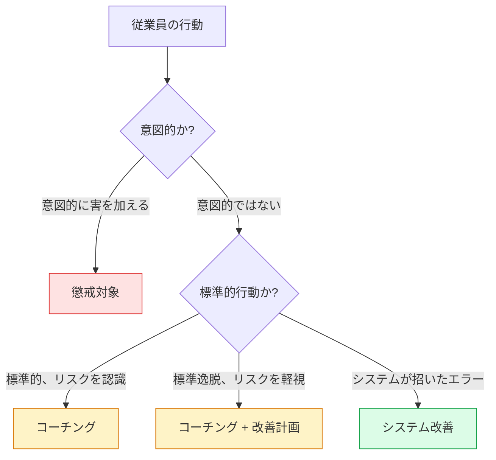
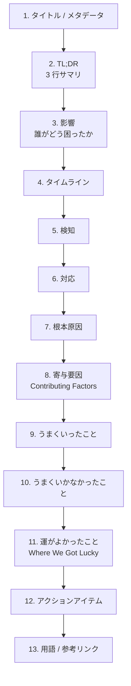
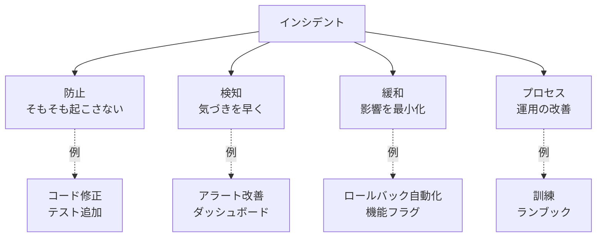
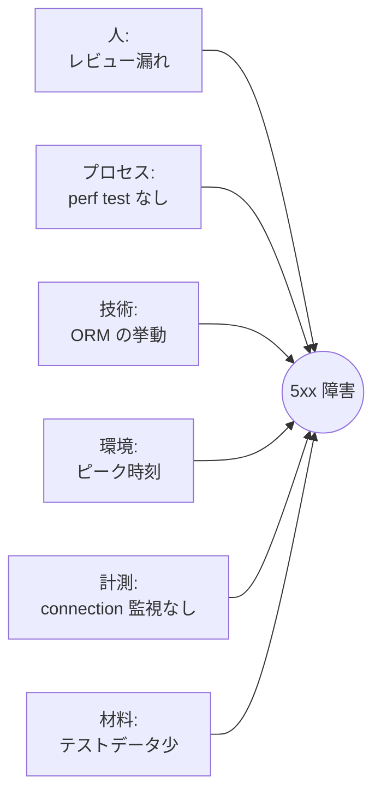
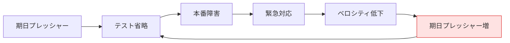
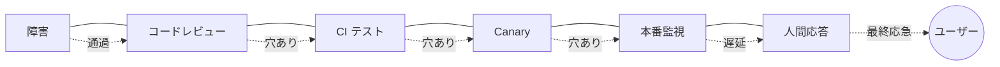

# ポストモーテム
{: .no_toc }

## 目次
{: .no_toc .text-delta }

1. TOC
{:toc}

---

## このページのゴール

このページを読み終えると、以下を **自分の言葉で説明できる** ようになります。

- ポストモーテム(Postmortem)が **どんな歴史的経緯で生まれ**、どんな失敗の反省から「Blameless(非難しない)」という原則が確立されたのか
- Blameless がなぜ単なる「お行儀」ではなく、組織が学習し続けるための **構造的に必要な仕組み** なのか
- ポストモーテム文書の **全項目** とそれぞれの書き方、ありがちな失敗
- タイムライン(Timeline)を **正確に再構築する** ための情報源(Slack ログ、コマンド履歴、メトリクス、Tempo トレース)
- 根本原因分析の手法(**5 Whys / Fishbone / Causal Loop / Sequence of Events / Swiss Cheese Model**)を、状況に応じて使い分けられる
- アクションアイテムを「防止 / 検知 / 緩和 / プロセス」に分類し、**5 個以下に絞り、必ず完遂する** ためのトラッキング手法
- ミニ TODO サービスで起きた仮想インシデントに対して、**完成形のポストモーテムを書ける**
- ポストモーテム会議(Postmortem Review Meeting)の進行と、組織知への展開方法

---

## ポストモーテムとは何か、なぜ書くのか

「ポストモーテム」は元々ラテン語 *post mortem*(「死後」)で、**検死** を意味する医学用語です。
死因を明らかにし、医学知識を蓄積し、次に同じ死を防ぐ。

それが転じて、ソフトウェア業界では「障害が終わったあとに書く、原因究明と再発防止のための文書」を指します。
20 世紀のソフトウェア工学の文脈で散発的に使われていましたが、**現在のような体系化された運用** は、Google SRE と Etsy のエンジニアリング文化が広めたものです。

### なぜ書くのか

**目的の優先順位** はだいたい次のとおりです:

1. **同じ障害を二度と起こさない**(再発防止)
2. **似た障害を防ぐ**(横展開)
3. **検知・対応を速くする**(MTTD / MTTR の改善)
4. **組織として学習する**(知識の蓄積)
5. **顧客への透明性**(信頼を取り戻す)
6. **将来のエンジニアの教材**(オンボーディング)

**書かない理由」になりがちなもの**:

- 「忙しい」 → 書かないと忙しいまま(同じ障害が再発するから)
- 「自分が悪かったのが知れ渡る」 → そのために Blameless がある
- 「公開すると顧客が不安になる」 → 不透明さの方が信頼を失う
- 「いつものパターンだから」 → 「いつものパターン」が放置されている = 仕組みの問題

### ポストモーテムが必要な障害の基準

すべての障害でポストモーテムを書くと、それ自体がトイルになります。**書く基準** を決めておきます。

ミニ TODO サービスでの例:

| 状況 | ポストモーテム |
|------|----------------|
| SEV-1, SEV-2 が発生した | **必ず書く** |
| SEV-3 で SLO のエラーバジェットを 10% 以上消費 | 書く |
| SEV-3 でも、過去 30 日以内に同種の障害が再発 | 書く |
| データ消失 / セキュリティインシデント | 必ず書く(SEV 問わず) |
| ニアミス(あと一歩でユーザー影響) | 書く |
| 単なる SEV-4(影響なし、内部のみ) | 任意 |
| 同じパターンが連続発生中 | 親ポストモーテム 1 つにまとめる |

{: .tip }
> **ニアミス(near miss)** の重要性: 影響がなかったからといって学習機会を逃すのはもったいない。
> 航空業界では「ヒヤリ・ハット」を毎件報告するのが安全文化の根幹。SRE でも同じです。

---

## ポストモーテムの歴史

### 1986: チャレンジャー号事故

NASA のスペースシャトル「チャレンジャー号」が打ち上げ直後に爆発した事故では、Rogers Commission(調査委員会)が **「事故の物理的原因(O リングの低温脆化)」と「組織的原因(エンジニアの警告が経営層に届かなかった)」を分けて報告** しました。
これが「技術的根本原因 + 組織的根本原因」を併せて分析する現代の手法の原型です。

### 2000 年代: トヨタの「なぜなぜ分析」

トヨタ生産方式の「**5 回の "なぜ?" を繰り返せ**」が世界中に広まりました。
ソフトウェア業界でも 5 Whys として定着。

### 2003〜2016: Google SRE のポストモーテム文化

Google は社内で **数万件のポストモーテム** を書き続けてきました。彼らの本『Site Reliability Engineering』第 15 章で公開された **テンプレートと Blameless 原則** は、業界標準となりました。

### 2012: Etsy "Debriefing Facilitation Guide"

Etsy の John Allspaw らが書いた "Blameless PostMortems and a Just Culture" という記事は、Blameless の哲学を業界全体に広めた決定的な文書です。
"Just Culture"(公正な文化) という概念を、医療・航空業界から IT 業界に持ち込みました。

### 2018〜: Learning from Incidents in Software

近年は「学習する組織」という観点で、ポストモーテムを **個別文書ではなく組織プロセス** として設計する動きが活発です。
Lorin Hochstein、Nora Jones、Laura Maguire らの研究が代表的です。

### 名称のバリエーション

| 名称 | 使われる文脈 |
|------|--------------|
| Postmortem | 最も一般的(Google 由来) |
| Post-incident review | 学術的 / 中立的 |
| RCA (Root Cause Analysis) | 古い ITIL 文脈、現在は批判もある |
| Incident Report | 顧客向け文書 |
| After-Action Review (AAR) | 米軍由来、Google Cloud で使う場面も |
| 5 Whys document | 簡略版 |
| Learning Review | 「学習」を強調する近年の呼び方 |

本書では **Postmortem** で統一します。

---

## Blameless(非難しない)文化

### Blameless とは何か

最重要原則。**ポストモーテムに個人を非難する表現を入れない** こと。

NG 例(Blameful):

> 田中さんが本番 DB に DROP TABLE を実行したため、データが消えた。
> 田中さんは確認不足だった。

OK 例(Blameless):

> オンコールエンジニア(田中さん)が本番 DB に DROP TABLE を実行したことで、データが消えた。
> このコマンドが、確認なしに本番に届いた背景には以下の仕組みの問題があった:
> - ステージング DB と本番 DB の URL が酷似していた(staging.db.internal と prod.db.internal)
> - psql の接続情報が `.psqlrc` で自動補完される設定だった
> - DROP TABLE を実行する前の二段階確認(`--confirm` のような)がなかった
>
> 行動した本人を責めることは、これらの仕組みの問題を見えなくする。

### なぜ Blameless でなければならないか

「非難しない」は単なる優しさや道徳ではなく、**組織が学習し続けるための合理的なメカニズム** です。

#### 1. 隠ぺい・改ざんを防ぐ

非難される文化では:
- 「自分のミス」を認めると人事評価が下がる
- だから、ログを消す、Slack の発言を編集する、嘘の証言をする
- 結果、**事実が分からなくなる** → 学習不可能

非難しない文化では:
- 「率直に話せば叱られない」と信じられる
- 全ての事実が明るみに出る
- 仕組みの問題が見える

#### 2. 心理的安全性を維持する

Google の Project Aristotle(高成果チームの研究)で、最重要因子は **Psychological Safety(心理的安全性)** だと結論されました。
非難文化はこれを破壊します。

#### 3. 「人間が悪い」では本質的解決にならない

「田中さんが悪かったので、もっと注意するように教育します」は、解決ではなく **問題を覆い隠す** 行為。
来週、田中さんと同じ役割で疲労した別の人が、同じミスをする可能性は何も変わっていない。

仕組みを直す:
- staging と prod の URL を変える
- psql の自動補完を切る
- `--confirm` フラグを必須化する

これが恒久対応です。

### Blameless ≠ Blame-free(無責任)

ここを誤解する人が多いので明確にします。

| Blameless | Blame-free(誤解) |
|-----------|---------------------|
| 個人を非難しないが、責任は明確化する | 誰も責任を取らない、放任 |
| アクションアイテムに担当者を付ける | 「みんなで頑張ろう」で終わる |
| 行動の意図と判断を尊重する | 行動の影響を無視する |
| 仕組みの改善を求める | 何も求めない |

**Blameless でも責任は問う** のが正しい。
ただし、責任の対象は「障害を起こしたこと」ではなく **「学習と改善に貢献すること」** です。

### Just Culture(公正な文化)

Sidney Dekker による分類:



- **意図的な悪意**(データを売る、サボタージュ): 懲戒対象
- **標準を守らない逸脱**: コーチングと改善計画
- **システムが招いたエラー**: システム改善(ほとんどがここ)

ポストモーテムで扱うのは **大部分が下 2 つ** です。意図的悪意は人事案件であり、ポストモーテムの範囲外です。

### Blameless を阻む組織的な圧力

書く側に意志があっても、組織が以下のようだと Blameless は崩れます。

- 経営層が「誰が悪かったのか」を必ず聞く
- 人事評価でインシデント件数を見られる
- ポストモーテムが懲戒の根拠資料になる
- 「責任者を見つけて謝罪させろ」という顧客対応文化

これらに対しては、**ポストモーテム文書だけでなく組織の仕組み全体** を変える必要があります。
本書は技術書なので深入りしませんが、参考文献に挙げた Sidney Dekker の本などを推奨します。

---

## ポストモーテム文書の構成

Google SRE 本のテンプレートを基に、現代的に少し拡張したものを使います。



### 1. タイトルとメタデータ

```markdown
# Incident Postmortem: todo-api 5xx burst due to N+1 query

| 項目 | 内容 |
|------|------|
| Incident ID | INC-2026-04-30-01 |
| 発生日時 | 2026-04-30 14:32 JST |
| 検知日時 | 2026-04-30 14:38 JST(検知遅延 6 分) |
| 復旧日時 | 2026-04-30 15:24 JST |
| 全体時間 | 52 分 |
| SEV | SEV-2 |
| 主担当 | @taro(Incident Commander) |
| 関係者 | @hanako (Comms), @jiro (Ops), @sakura (Scribe), @ichiro (SME-API) |
| 影響範囲 | todo-api 全エンドポイント、5xx 率 28% |
| 影響ユーザー | 約 12,000 名(同時刻平均 DAU の 100%) |
| エラーバジェット消費 | 月間 216 分中 52 分(24.1%) |
| 文書著者 | @taro |
| レビュー | @cto, @sre-team |
| 状態 | Draft / Under Review / Approved |
| 公開範囲 | 社内全員 |
```

**書き方のポイント**:

- インシデント ID は **検索可能** にする(日付 + 通番が無難)
- 「検知遅延」を明示することで、MTTD を後で集計できる
- 「エラーバジェット消費 %」は SLO 文化と直結する重要指標
- 「文書著者」と「レビュー」を分けることで責任を明確化

### 2. TL;DR(3 行サマリ)

経営層や他チームは、まずこの 3 行しか読みません。
**「何が起きたか」「なぜ」「どう直したか」** を簡潔に。

例:

> DB 接続プールが枯渇し、todo-api が 5xx を返す状態が 52 分継続した。
> 原因は、リリース 1.3.0 で導入された /api/todos エンドポイントの N+1 クエリにより、DB へのスロークエリが大量に発生したことだった。
> 旧バージョン 1.2.9 へロールバックし応急復旧。恒久対応として N+1 クエリを修正したリリース 1.3.1 を翌日デプロイした。

**NG な TL;DR**:

- 「API が落ちました。直しました。」(情報なし)
- 「複合的な原因により…」(具体性がない、なぜを掘れていない)
- 「人為的ミスにより…」(Blameful、原因記述になっていない)

### 3. 影響(Impact)

「誰が、どう困ったか」を具体的に書きます。

```markdown
## 影響

### ユーザー影響
- TODO 作成・取得・更新が 5xx エラー(28% の確率)
- 影響時間: 52 分(14:32 〜 15:24)
- 同時接続ユーザー数: 約 1,200 名
- リトライによるユーザー体験劣化: 平均 2.3 回のリトライで成功

### 売上影響
- B2B 顧客向け SLA 違反は **なし**(99.5% SLO 内に収まった)
- お問い合わせチケット: 18 件

### 内部影響
- オンコールエンジニア 4 名が対応に拘束(合計 4.5 時間)
- DB チーム 1 名が SME として参加(1 時間)
- リリースパイプライン凍結 18 時間
- エラーバジェット 24.1% 消費

### 派生インシデント
- なし
```

**書き方のポイント**:

- 「ユーザー影響」を最優先で書く(ビジネスへの説明責任)
- 「内部影響」もちゃんと書く(運用コストの可視化)
- 数字を入れる(感覚的でなく定量的に)

### 4. タイムライン(Timeline)

**ポストモーテムの中核** です。事実を時系列に羅列します。

```markdown
## タイムライン (JST)

| 時刻 | 出来事 | ソース |
|------|--------|--------|
| 14:00 | リリース 1.3.0 が canary 10% に展開 | Argo CD Audit |
| 14:15 | canary 全体展開完了、新バージョンに 100% トラフィック | Argo CD Audit |
| 14:32 | DB 接続プールの使用率が 80% を超える | PostgreSQL pg_stat |
| 14:33 | DB から「too many connections」エラー | postgres ログ |
| 14:34 | todo-api が DB connection エラーで 5xx を返し始める | アプリログ + Prometheus |
| 14:38 | TodoApiBurnRate アラート発火 (5min window) | Alertmanager |
| 14:38 | @taro が PagerDuty を Ack | PagerDuty |
| 14:39 | @taro がインシデントチャンネル #inc-2026-04-30-01 開設、SEV-2 宣言 | Slack |
| 14:42 | @jiro が `kubectl get pods` を実行、Pod は全て Running | Slack コマンドログ |
| 14:46 | @jiro が DB の pg_stat_activity を確認、スロークエリを発見 | Slack 添付 |
| 14:48 | @jiro が DB の statement_timeout を 5s に変更 (一時応急処置) | コマンドログ |
| 14:50 | 5xx 率が一時的に低下(20% → 8%) | Grafana |
| 14:53 | @ichiro が「リリース 1.3.0 の /api/todos が怪しい」と指摘 | Slack |
| 14:55 | @taro が「ロールバックする」と判断 | Slack |
| 14:56 | @jiro が `kubectl rollout undo deployment/todo-api -n prod` 実行 | コマンドログ |
| 15:02 | ロールバック完了、5xx 率 0.5% に低下 | Grafana |
| 15:05 | DB の statement_timeout を元の値(30s)に戻す | コマンドログ |
| 15:24 | 5xx 率が通常水準 (0.2%) に戻る、@taro が復旧宣言 | Slack |
| 15:30 | インシデントチャンネルクローズ | Slack |
| 翌 17:00 | 修正版 1.3.1 を canary で展開開始 | Argo CD |
```

**書き方のポイント**:

- **ソースを明記**: ログ、Slack、メトリクス、コマンド履歴のどれを引いたか
- 1 分単位の精度を目指す(可能なら秒単位)
- 「議論があった」「判断した」も時刻入りで記録
- **解釈ではなく事実** だけを書く(分析は後の章で)

#### タイムライン構築のためのデータソース

```mermaid
flowchart LR
    timeline[タイムライン]
    timeline <-- メトリクス --- prom[Prometheus]
    timeline <-- ログ --- loki[Loki]
    timeline <-- トレース --- tempo[Tempo]
    timeline <-- イベント --- ev[K8s Events]
    timeline <-- コマンド --- bash[bash history / Slack]
    timeline <-- 監査 --- audit[K8s Audit Log]
    timeline <-- GitOps --- argo[Argo CD History]
    timeline <-- 通信 --- slack[Slack export]
    timeline <-- アラート --- am[Alertmanager]
    timeline <-- ステータス --- sp[Statuspage]
```

すべて時刻同期されている前提。NTP / chrony は最重要のインフラサービスです。

#### タイムスタンプの罠

- ログのタイムゾーンが揃っていない(UTC / JST 混在) → ポストモーテム作成時に **JST に統一する**
- コンテナログとノードログで時刻ズレ → chrony を必ず動かしておく
- アラートの発火時刻 vs 受信時刻 vs 通知時刻が違う → 全部記録

#### Scribe が記録すべき項目

1. 各人の発言(時刻 + 発言者 + 内容)
2. 実行したコマンド(時刻 + 実行者 + コマンド + 結果)
3. 判断ポイント(時刻 + 判断者 + 判断 + 理由)
4. アラート発火 / メトリクスの変化
5. 外部からの問い合わせ

### 5. 検知(Detection)

```markdown
## 検知

### どう検知したか
TodoApiBurnRate アラートが 14:38 に発火し、PagerDuty 経由でオンコールに通知された。

### 検知遅延
- 障害発生 14:32
- アラート発火 14:38
- 遅延 6 分

### 遅延の原因
- アラートが 5 分の window で評価されているため、平均 5 分の遅延がそもそも構造的にある
- かつ、burnrate alert は SLO の急減を見ているので、瞬間的な値ではなく平均値での閾値超過を待つ

### 改善余地
- もう少し短い window (1 min) の急激 burst 検知アラートを追加すべきか? 
  → 過去のノイズ率を見て判断する必要あり
```

### 6. 対応(Response)

```markdown
## 対応

応答時間:
- 検知 → Ack: 0 分(オンコールがほぼ即時)
- Ack → SEV 判定: 1 分
- SEV 判定 → 応急処置開始: 9 分
- 応急処置 → 5xx 率改善: 14 分

応援要請:
- 14:53 に DB チーム SME @ichiro を Slack で呼び出し
- 1 分以内に応答、対応に大きく貢献
```

### 7. 根本原因(Root Cause)

```markdown
## 根本原因

リリース 1.3.0 で導入された `/api/todos` エンドポイントが、TODO 一覧取得時に N+1 クエリを発生させていた。
具体的には、各 TODO ごとに `WHERE user_id = ?` で別途 SELECT を発行する実装になっていた。

ピークタイム(14:00〜)の同時接続増加と相まって、DB の接続プール(max_connections=200)を埋め尽くした。
接続が解放されないため、後続リクエストは connection timeout で 5xx を返した。

### 修正コミット
[fix: eager-load todo items in /api/todos](https://github.com/example/todo/commit/abc1234)

### 該当 SQL の改善

前(N+1):
```sql
SELECT * FROM todos WHERE user_id = ?;  -- 1 回
SELECT * FROM tags WHERE todo_id = ?;   -- todos の件数分繰り返し
```

後(JOIN による eager load):
```sql
SELECT t.*, tg.* FROM todos t
LEFT JOIN tags tg ON t.id = tg.todo_id
WHERE t.user_id = ?;  -- 1 回
```
```

### 8. 寄与要因(Contributing Factors)

根本原因 **以外** にも、障害を引き起こす / 拡大させた要因を列挙します。

```markdown
## 寄与要因

### なぜリリース前に発見できなかったか
- 開発者のローカル DB に TODO が 10 件しかなく、N+1 が体感できなかった
- CI のテスト DB にも数百件しかデータがなく、性能問題が顕在化しなかった
- パフォーマンステストが PR レベルで実施されていない

### なぜ canary で気づかなかったか
- canary は 10% で 15 分しか様子を見ていなかった
- canary の判定基準が「5xx 率 1% 未満」のみで、DB 接続プール使用率や latency p95 を見ていなかった
- 14:00 の展開はピーク前で、まだ DB 接続プールに余裕があった

### なぜ検知が 6 分遅れたか
- アラートが 5 分平均で評価されている(短い window のアラートがない)
- ユーザー報告チャンネルからの第一報がもう少し早ければ気づけたが、自動化されていない

### なぜ復旧に時間がかかったか
- ロールバック手順が文書化されていたが、誰も実演したことがなかった
- ロールバックの実行に Argo CD UI を使うか kubectl 直叩きするかで一瞬迷った
```

### 9. うまくいったこと(What Went Well)

ポジティブな面も必ず書きます。**強みを認識する** ことも学習の一部。

```markdown
## うまくいったこと

- TodoApiBurnRate アラートが適切な閾値で発火し、ノイズもなくクリーンに反応した
- オンコールがアラート受信後 1 分で対応開始できた
- ロールバック手順 (`kubectl rollout undo`) が文書化されていて、迷わず実行できた
- DB チームの SME が即座に応答し、原因特定に貢献した
- インシデントチャンネルの開設と SEV 判定が 1 分以内に行われた
- Status ページの更新が 10 分間隔で行われ、顧客サポートに混乱がなかった
```

### 10. うまくいかなかったこと(What Went Wrong)

```markdown
## うまくいかなかったこと

- リリース前のレビューで N+1 クエリを見抜けなかった
- DB connection pool の使用率を可視化していなかった
- canary の判定基準が単一指標(5xx 率)に偏っていた
- パフォーマンステストが PR ベースで存在しなかった
- ロールバックの判断が、応急処置開始(14:48)から 8 分遅れた
```

### 11. 運がよかったこと(Where We Got Lucky)

しばしば見落とされますが、**未来の障害を予防** するのに最も重要なセクションかもしれません。

```markdown
## 運がよかったこと(Where We Got Lucky)

- 障害がピーク時間帯の **入り口** で起きたため、DB 接続プールがフル枯渇する前に対応できた。30 分遅ければ完全停止だった
- DB チーム SME @ichiro がたまたまオフィスにいて、即対応できた。深夜時間帯なら応答に 30 分以上かかった可能性
- ロールバック対象のバージョン 1.2.9 が「正常に動くと検証済み」だった。最近のロールバック先が壊れていたことがあったが、今回は無事だった
- データ整合性に影響する操作ではなかった。書き込みが部分的に成功した状態でロールバックしたら、データ修復に数時間かかっていた可能性
```

### 12. アクションアイテム(Action Items)

```markdown
## アクションアイテム

| ID | カテゴリ | 内容 | 担当 | 期限 | 状態 |
|----|----------|------|------|------|------|
| AI-1 | 防止 (Prevent) | /api/todos の N+1 修正 | @ichiro | 2026-05-02 | Done |
| AI-2 | 検知 (Detect) | DB connection pool 使用率を Grafana に追加、80% 超アラート設定 | @bob | 2026-05-05 | In Progress |
| AI-3 | 防止 | パフォーマンステストを GitHub Actions に追加(k6) | @carol | 2026-05-15 | Open |
| AI-4 | 緩和 (Mitigate) | canary の判定基準に p95 latency と DB connection を追加 | @dave | 2026-05-10 | Open |
| AI-5 | プロセス | ロールバックの月次訓練を Game Day に組み込む | @eve | 2026-06-01 | Open |
```

#### アクションアイテムのカテゴリ



理想は **4 つのカテゴリにバランスよく分散** すること。
「防止」だけに偏ると、検知や対応の改善が進まない(完全な防止は不可能なため)。

#### 5 つに絞る

「30 個アクションを出して全部やる」は機能しません。3 ヶ月後には誰も触っていない墓場になります。
**最も効果的な 5 個** を選び、必ず期限と担当を付けます。

5 個に絞る基準:

1. **インパクト × 実現性** で並べる
2. 「他の障害でも効くもの」を優先(横展開効果)
3. 「測定可能な完了条件」があるもの

#### アクションアイテムの追跡

すべて完了するまでフォローアップする仕組みが必要です:

- **GitHub Issue / JIRA チケットとして起票**(週次レビュー)
- **完了率を月次で報告**(SRE チームの KPI)
- **未完了が 30 日以上経過したら、Why の検証**
- **完了 30 日後に効果検証**(ちゃんと再発防止になっているか)

### 13. 用語 / 参考リンク

```markdown
## 用語
- N+1 クエリ: 1 + N 回の DB クエリ。SELECT で複数行取得後、各行に対してさらに SELECT すること
- 接続プール: アプリと DB の TCP 接続を再利用する仕組み

## 参考リンク
- 当該リリース PR: https://github.com/example/todo/pull/345
- 修正 PR: https://github.com/example/todo/pull/348
- Grafana ダッシュボード: https://grafana.example/d/todo-api
- インシデントチャンネル: #inc-2026-04-30-01
- 過去の類似ポストモーテム: PM-2025-09-15-01(別エンドポイントの N+1)
```

---

## 根本原因分析の手法

「根本原因」を 1 つに絞ろうとするのは、実は **危険な発想** であることが分かっています(なぜなら、現実の障害は単一原因ではないため)。
ここでは、根本原因を探る複数の手法を紹介します。

### 5 Whys

トヨタ生産方式由来の古典的手法。

```
症状: todo-api が 5xx を返した
 ↓ なぜ?
原因1: DB 接続プールが枯渇した
 ↓ なぜ?
原因2: スロークエリで接続が解放されなかった
 ↓ なぜ?
原因3: /api/todos が N+1 クエリを実行していた
 ↓ なぜ?
原因4: コードレビューで N+1 を検知する仕組みが無かった
 ↓ なぜ?
原因5: ローカル / CI で件数が少なく、性能問題が顕在化しなかった
```

5 つで止めずに、もう一歩深堀りすると:

```
 ↓ なぜ?
原因6: パフォーマンステストが PR レベルで実施されない
 ↓ なぜ?
原因7: パフォーマンステストの整備が後回しになっている (organizational priority)
```

**5 Whys の限界**:

- 「なぜ?」を直列に追うので、**並列の寄与要因を見逃す**
- 結論が「人」に行きがち(なぜ気づかなかった → 注意不足、で止まる)
- **インタビュアーの仮説に沿った答えを誘導しがち**

### Fishbone(石川ダイアグラム)

複数のカテゴリを並列に検討する。1960 年代に石川馨が考案。



代表的なカテゴリ: 4M(Man / Machine / Material / Method) or 5M(+Measurement) or 6M(+Mother Nature)。
ソフトウェア向けに: People / Process / Technology / Environment / Measurement / Inputs。

### Causal Loop(因果ループ)

互いに影響する要因が **ループ** になっているケース。例:



「期日に追われる → テストを省く → 本番障害 → 緊急対応で手が止まる → さらに期日に追われる」
このループを断ち切るには、**ループのどこか 1 箇所** を改善する。

### Sequence of Events

時系列で「もしこの時点で違う行動を取っていれば」を考える。
Tools: `Why because analysis (WBA)`、`Causal tree`。

### Swiss Cheese Model

James Reason が提唱した安全工学のモデル。
複数の **防御層** がそれぞれ穴(脆弱性)を持っていて、たまたま穴が一直線に並ぶと事故が起きる。



各層の「穴」を分析し、**どの層を改善すれば最大効果か** を見極めます。
ポストモーテムのアクションアイテムは、複数の層に分散して入れるのが理想。

### 「人為的ミス」は根本原因ではない

ポストモーテムでよく出てくる NG な「根本原因」:

- 「人為的ミスにより」 → 何のミス? なぜそのミスが起きた?
- 「コミュニケーション不足」 → どのタイミングで誰と誰が?
- 「確認不足」 → どんな確認が必要だった?

これらは **症状の言い換え** であって、原因ではありません。
**「もしも理想の世界なら起きないこと」を「現実が理想と違うから」と書いているだけ**。

良い根本原因の書き方:

- 「人為的ミス」 → 「ステージング DB と本番 DB の URL が酷似していたため、SSH コンテキストを取り違えた」
- 「コミュニケーション不足」 → 「リリース前の Go/NoGo 会議が任意であり、開発と SRE の予定が合わず開催されなかった」
- 「確認不足」 → 「kubectl apply 前に dry-run を必須化する CI ステップがなく、人間の目視確認に依存していた」

---

## ポストモーテム会議(Postmortem Review Meeting)

文書を書いただけで終わると、組織知になりません。**会議体で共有** することが大切です。

### 開催タイミング

- インシデント終了後 **5 営業日以内**
- ドラフトが完成した段階で開く(完成版を待たない)

### 参加者

- インシデント関係者全員
- 関連チームの代表(DB、Network、Security 等)
- 開発リード
- SRE リード
- (経営層は **オプション**、参加すると Blameless が崩れやすい)

### 進行

1. **5 分**: TL;DR と Impact を読む(参加者に時間を取らせる)
2. **10 分**: タイムラインを Scribe が朗読
3. **10 分**: 根本原因 / 寄与要因のディスカッション
4. **15 分**: アクションアイテムのレビュー(優先度、担当、期限)
5. **5 分**: 学びの共有(各人 1 ターン)
6. **5 分**: 公開範囲・次のアクション確認

### NG 行動

- 個人を糾弾する
- 経営層が「誰のせいか」を問う
- 「次は気をつけます」で終わる
- アクションアイテムを 20 個にする

---

## ポストモーテムを組織知に変える

### 1. ポストモーテムレポジトリ

すべてのポストモーテムを 1 箇所に集約:

```
postmortems/
├── 2026/
│   ├── 04-30-todo-api-5xx.md
│   ├── 04-15-coredns-down.md
│   └── 02-12-pvc-stuck.md
├── 2025/
│   └── ...
├── INDEX.md (一覧)
├── TEMPLATE.md
└── README.md
```

検索性のために:
- タグ(`tags: [database, n+1, rollback]`)
- カテゴリ(`category: SEV-2`)
- 影響範囲(`service: todo-api`)

### 2. 月次レビュー

SRE チームで **過去 1 ヶ月のポストモーテム** を見直す:

- 共通パターンはあるか?
- アクションアイテムの完了率は?
- 同じ根本原因が再発していないか?
- ニアミスから学べることはあるか?

### 3. 横展開

他チームでも同じ落とし穴がある可能性:
- 「N+1 クエリ」は他のエンドポイントにも潜んでいる → 全チームに通知
- 「ロールバック手順の未訓練」は他サービスも同じ → ガイドライン化

### 4. 新入社員教育

オンボーディング資料にポストモーテム 5 件を必須読書として入れる:
- このサービスで過去に何が起きたか
- どう対応してきたか
- なぜこのアーキテクチャになっているか

---

## ポストモーテムのアンチパターン

### アンチパターン 1: 「人」に原因を帰結させる

```
根本原因: 田中さんが本番 DB に DROP TABLE を実行した
アクション: 田中さんに教育を実施
```

問題: 仕組みが改善されていない。明日、別の人が同じことをする可能性は変わらない。

良い書き方:

```
寄与要因:
- staging と prod の URL が類似していた(staging.db.internal / prod.db.internal)
- psql の自動補完で実行先を取り違えた
- 危険コマンド前の二段階確認が無かった

アクション:
- prod の DB ホスト名を redshield-prod.internal に変更
- 本番接続時にプロンプトの色を赤に変更
- DROP TABLE 等の危険コマンドに pre-commit-style 確認を導入
```

### アンチパターン 2: ノイズで埋める

タイムラインに 100 件の Slack ログを貼り付けたり、関係ない情報で埋めたりすると、**重要なポイントが埋没** します。

良いタイムラインは **30〜50 行** が目安。それ以上必要なら、別添資料に。

### アンチパターン 3: 「再発防止策: 注意します」

これは「何もしない」と同じです。
具体的・測定可能・期限ありのアクションに落とし込む。

| 悪い | 良い |
|------|------|
| 「気をつける」 | 「pre-commit hook で本番 SSH 接続を検知し警告する」 |
| 「コミュニケーションを強化する」 | 「リリース前 Go/NoGo 会議を必須化、議事録を所定 Repo に保存」 |
| 「監視を改善する」 | 「DB connection pool 使用率 70% でアラート、Grafana に追加」 |

### アンチパターン 4: 「これは一過性の問題」

「同じことは起きないだろうから対応不要」と書くと、たいてい数ヶ月後に再発します。
**「起きうる」前提で書く** こと。

### アンチパターン 5: 完璧主義で公開しない

ポストモーテムは **ドラフトでも早く共有** したほうがよいです。
完璧を求めて 1 ヶ月寝かせると、組織の記憶が薄れて学習効果が下がります。

---

## ハンズオン: 自分でポストモーテムを書く

### Step 1: 模擬インシデントの発生

前ページの Game Day 1(ノード停止)を実施します。

```bash
# 1. 開始時刻を記録
echo "Start: $(date -Iseconds)" >> /tmp/incident-log.txt

# 2. todo-api Pod が動いている Worker を 1 台停止
TARGET_NODE=k8s-w1
vmrun stop /vmware/${TARGET_NODE}.vmx hard

# 3. 観察
kubectl get nodes -w
kubectl get pods -n prod -o wide -w

# 4. 5 分後に復旧
vmrun start /vmware/${TARGET_NODE}.vmx

# 5. 終了時刻
echo "End: $(date -Iseconds)" >> /tmp/incident-log.txt
```

### Step 2: タイムラインを集める

```bash
# 1. K8s イベント
kubectl get events -A --sort-by='.lastTimestamp' \
  | awk '/k8s-w1|todo-api/' > /tmp/events.log

# 2. メトリクス(必要なら PromQL を実行)
# 5xx 率の推移、Pod 数の推移を Grafana で

# 3. オンコールの自分の発言
cat /tmp/incident-log.txt
```

### Step 3: テンプレートに沿って書く

下記テンプレートを `/tmp/postmortem-w1-down.md` として保存し、埋めてください。

```markdown
# Postmortem: k8s-w1 Node 停止演習

## メタデータ

| 項目 | 内容 |
|------|------|
| Incident ID | PM-DRILL-001 |
| 種別 | Game Day 演習 |
| 発生日時 | 2026-05-20 14:00 JST |
| 復旧日時 | 2026-05-20 14:08 JST |
| SEV | DRILL-2 |

## TL;DR
(自分の言葉で 3 行)

## 影響
- ...
- ...

## タイムライン
| 時刻 | 出来事 | ソース |
|------|--------|--------|
| 14:00 | k8s-w1 を vmrun stop | bash |
| 14:01 | k8s-w1 が NotReady に | kubectl |
| 14:01 | todo-api Pod 1/3 が NotReady | kubectl |
| 14:06 | Pod が他ノードへ再スケジュール開始 | events |
| ...   | ... | ... |

## 検知
- 何分後に NotReady になったか
- pod-eviction-timeout の挙動

## 根本原因
- ノードが強制停止されたため(意図的)

## 寄与要因
- node-monitor-grace-period (40s) と pod-eviction-timeout の組み合わせで、Pod 再起動まで 5 分以上かかった

## うまくいったこと
- ...

## うまくいかなかったこと
- ...

## 運がよかったこと
- DaemonSet(calico-node)は別ノードで継続稼働していた

## アクションアイテム
| ID | カテゴリ | 内容 | 担当 | 期限 |
|----|----------|------|------|------|
| 1 | 防止 | tolerations の `unreachable` 設定で eviction を早める | self | +1w |
| 2 | 検知 | NodeNotReady アラートを設定 | self | +3d |
| 3 | プロセス | ノード停止演習を月次化 | self | +1m |
```

### Step 4: レビューしてもらう

理想的には他人にレビューしてもらいます。
1 人学習の場合は、書いてから **1 日寝かせて** 自分で読み直すと、たいてい改善点が見えます。

---

## サンプル: 完成形のポストモーテム 3 例

実物に近いポストモーテムを 3 件、参考として掲載します。

### サンプル 1: シンプルな構成ミス

```markdown
# Postmortem: todo-frontend index.html が 404

| 項目 | 内容 |
|------|------|
| Incident ID | INC-2026-03-12-01 |
| SEV | SEV-2 |
| 発生 | 2026-03-12 10:15 JST |
| 復旧 | 2026-03-12 10:42 JST |
| 全体 | 27 分 |
| 影響 | todo-frontend (Nginx) の全リクエストが 404 |

## TL;DR
ConfigMap の更新で nginx.conf の `root` ディレクティブが誤って削除され、
todo-frontend の全リクエストが 404 を返した。
ConfigMap を 1 つ前のバージョンに戻して復旧。

## タイムライン
| 時刻 | 出来事 |
|------|--------|
| 10:00 | feature: 新ロゴの導入で nginx.conf を更新 (PR #123) |
| 10:14 | Argo CD で本番反映 |
| 10:15 | 404 率が急増 |
| 10:18 | TodoFrontend4xxBurst アラート発火 |
| 10:21 | オンコール対応開始 |
| 10:25 | nginx Pod のログから root が指していないことを確認 |
| 10:30 | ConfigMap の最近の変更を git log から特定 |
| 10:38 | `kubectl rollout undo` でロールバック |
| 10:42 | 404 率正常化 |

## 根本原因
nginx.conf を更新したコミット (abcdef1) で、`root /usr/share/nginx/html;` 
の行が誤って削除されていた。レビュアーは差分の追加行だけを見て、削除行を見落とした。

## 寄与要因
- nginx -t の構文チェックは CI で実行していたが、`root` 必須のテストはなかった
- canary なしで一斉デプロイされた(small change だったため)
- アラートが 404 率しか見ておらず、smoke test が定期実行されていなかった

## うまくいったこと
- ロールバックの実行が迅速だった

## うまくいかなかったこと
- レビューで削除行を見落とした
- canary を経由しなかった

## 運がよかったこと
- ピーク前の時間帯だったため、影響ユーザー数が少なかった

## アクション
| ID | カテゴリ | 内容 | 担当 | 期限 |
|----|----------|------|------|------|
| 1 | 防止 | nginx.conf の smoke test を CI に追加 | @alice | +1w |
| 2 | 防止 | 全リリースを 10% canary 必須に | @bob | +1w |
| 3 | 検知 | 1 分毎の synthetic smoke test を CronJob で導入 | @carol | +2w |
| 4 | プロセス | レビューチェックリストに「削除行も確認」を追加 | @dave | +3d |
```

### サンプル 2: データ整合性に関わる障害

```markdown
# Postmortem: todo-worker が duplicate notification を送信

| 項目 | 内容 |
|------|------|
| Incident ID | INC-2026-02-28-01 |
| SEV | SEV-2 |
| 発生 | 2026-02-28 09:00 JST |
| 復旧 | 2026-02-28 11:30 JST |
| データ整合性 | ユーザー約 800 名に重複通知を送信 |

## TL;DR
todo-worker(CronJob, 毎時実行)が突然 09:00 と 09:30 の 2 回起動し、
同じ通知バッチを 2 回送信。約 800 ユーザーが同じメールを 2 通受け取った。
原因は、CronJob の `concurrencyPolicy` が `Allow` のままで、
前回ジョブが長引いて新ジョブと並列実行されたこと。

## タイムライン
| 時刻 | 出来事 |
|------|--------|
| 08:00 | 通常の通知バッチ実行開始(通常は 10 分で完了) |
| 08:55 | DB スロークエリで処理遅延、バッチがまだ実行中 |
| 09:00 | 次の CronJob が起動、前回ジョブと並列実行 |
| 09:00-09:30 | 同じユーザーに同じ通知が 2 通送られる |
| 09:32 | サポートに「同じメールが 2 通来た」と問い合わせ |
| 09:38 | SRE 対応開始 |
| 09:50 | CronJob の二重実行を確認 |
| 10:00 | CronJob を一時停止 |
| 11:00 | concurrencyPolicy を Forbid に変更、再開 |
| 11:30 | 影響ユーザーへの謝罪メール送信完了 |

## 根本原因
CronJob の YAML で `concurrencyPolicy: Allow` がデフォルトのまま。
通常は 10 分で終わるバッチが、DB スロークエリで 1 時間以上かかり、次の起動と並列実行された。

## 寄与要因
- 通知バッチに冪等性(idempotency)がなかった
  - 「送信済み通知」を記録していなかった
- バッチの処理時間に対するアラートがなかった

## アクション
| ID | カテゴリ | 内容 | 担当 | 期限 |
|----|----------|------|------|------|
| 1 | 防止 | concurrencyPolicy を Forbid に | @alice | Done |
| 2 | 防止 | 通知に notification_id を発行、送信済みフラグで重複防止 | @bob | +2w |
| 3 | 検知 | バッチ実行時間 30 分超でアラート | @carol | +1w |
| 4 | 緩和 | バッチ進行中フラグ用に Redis 排他ロック導入 | @bob | +2w |
```

### サンプル 3: 観測の難しい間欠障害

```markdown
# Postmortem: 早朝 02:00 に断続的に発生する 502

| 項目 | 内容 |
|------|------|
| Incident ID | INC-2026-01-20-03 |
| SEV | SEV-3 (1 週間継続) |
| 期間 | 2026-01-14 〜 2026-01-20 |
| 影響 | 02:00 前後、毎晩 1〜3 分間 502 が散発 |

## TL;DR
毎晩 02:00 前後に Ingress NGINX が 502 を散発的に返していた。
原因は cert-manager の Let's Encrypt 証明書更新時の挙動と、
Nginx の reload 戦略が組み合わさり、worker プロセス再起動中に
in-flight リクエストが中断されていたこと。

## 観測上の難しさ
- 1〜3 分の短時間
- 大半のユーザーは寝ている時間帯のため、報告が少ない
- 5xx 率が「短時間」しか上がらず、SLO アラートを発火させない

## 検知のきっかけ
週次 SLO レポートで「02:00 前後の小スパイク」が複数日発生していることに気づいた。

## 根本原因
1. cert-manager が 90 日に 1 度のはずが、ConfigMap の `renewBefore: 720h` 設定で 30 日に 1 度発生
2. Ingress NGINX の reload は default で graceful だが、worker_shutdown_timeout が 240s と長く
3. 接続終了待ちの間、新 worker への切替時に短時間 conntrack の整合性が崩れた

## アクション
| ID | カテゴリ | 内容 | 担当 | 期限 |
|----|----------|------|------|------|
| 1 | 防止 | NGINX のグレースフルリロード設定見直し | @alice | +2w |
| 2 | 検知 | 5 分単位の急速 burnrate アラート追加 | @bob | +1w |
| 3 | プロセス | 週次 SLO レポートで「小スパイク」を自動マークアップ | @carol | +3w |
```

---

## 文化づくりへのヒント

ポストモーテムは **個人の文書作成スキル** で完結するものではなく、組織文化の問題です。
最後に、現場で文化を作っていくための実践的ヒントを。

### 経営層への説明

「ポストモーテムは時間の無駄では?」と問われたら、以下のように答えます:

- ポストモーテム 1 件の作成コスト: 4〜8 時間
- 同種障害の再発コスト(売上機会損失 + 対応工数): 数十〜数百時間
- **再発を 1 件防げば、ROI は数十倍**

### 「責任者を出せ」要求への対応

顧客や経営層から「責任者は誰か」と問われたとき、対外的には:

- 「我々のシステムの設計と運用全体に責任がある」
- 「個人ではなく、組織として対応している」
- 「具体的な改善計画(アクションアイテム)はこちら」

と答えるのが原則。これも組織トップの合意が必要。

### Postmortem of Postmortem

四半期に 1 度、「ポストモーテム自体のポストモーテム」を行うとよい:

- 過去のアクションアイテムの完了率
- ポストモーテムが組織に届いているか
- 同じ根本原因が複数回登場していないか
- Blameless が守られているか

---

## チェックポイント

ここまでで以下を **自分の言葉で** 説明できるか確認してください。

- [ ] ポストモーテムを書く目的の優先順位を 5 つ挙げられる
- [ ] Blameless と Blame-free(無責任)の違いを説明できる
- [ ] Just Culture の 3 つの分類(意図的悪意 / 標準逸脱 / システム由来エラー)を説明できる
- [ ] ポストモーテム文書の主要 13 セクションを列挙できる
- [ ] タイムライン構築のデータソースを 5 つ以上挙げられる
- [ ] 5 Whys、Fishbone、Causal Loop、Swiss Cheese Model それぞれを使うべき場面を説明できる
- [ ] アクションアイテムを「防止 / 検知 / 緩和 / プロセス」に分類して例示できる
- [ ] アクションアイテムを 5 個以下に絞る理由を説明できる
- [ ] ポストモーテム会議の進行を 6 ステップで説明できる
- [ ] 「人為的ミス」を根本原因にしてはいけない理由と、代わりの書き方を例示できる
- [ ] ニアミス(near miss)の重要性を説明できる
- [ ] 自分のサンプルアプリの仮想インシデントについて、TL;DR を 3 行で書ける

→ 次は [キャパシティ計画]({{ '/11-sre/capacity/' | relative_url }})
