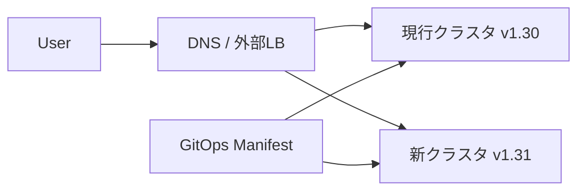

# クラスタアップグレード
{: .no_toc }

## 目次
{: .no_toc .text-delta }

1. TOC
{:toc}

---

Kubernetes のリリースは概ね **4ヶ月ごと**、サポート期間は約 14ヶ月。
本番運用では半年〜1年に一度はマイナーバージョンを上げる必要があります。

## アップグレードの基本方針

- **マイナーバージョンは1段ずつ**(1.30 → 1.32 は不可、1.30 → 1.31 → 1.32)
- **コンポーネント順序**: コントロールプレーン → Worker → Add-on
- **コントロールプレーンは1台ずつ**

## 事前準備

```bash
# リリースノートを必ず読む
# https://github.com/kubernetes/kubernetes/blob/master/CHANGELOG/CHANGELOG-1.31.md

# Deprecated API を使っていないか確認
kubectl deprecations    # plugin
# または
pluto detect-helm -o wide --target-versions k8s=v1.31.0

# etcd バックアップ
ETCDCTL_API=3 etcdctl snapshot save /backup/pre-upgrade-$(date +%Y%m%d).db ...

# Velero バックアップ
velero backup create pre-upgrade-$(date +%Y%m%d) --include-namespaces=prod
```

## kubeadm でのアップグレード手順

### 1. 1台目のコントロールプレーン

```bash
# k8s-cp1 で
apt-mark unhold kubeadm
apt-get update && apt-get install -y kubeadm=1.31.0-1.1
apt-mark hold kubeadm

kubeadm upgrade plan
kubeadm upgrade apply v1.31.0

# kubelet も上げる
kubectl drain k8s-cp1 --ignore-daemonsets
apt-mark unhold kubelet kubectl
apt-get install -y kubelet=1.31.0-1.1 kubectl=1.31.0-1.1
apt-mark hold kubelet kubectl
systemctl daemon-reload && systemctl restart kubelet
kubectl uncordon k8s-cp1
```

### 2. 残りのコントロールプレーン

```bash
# k8s-cp2, k8s-cp3 で
apt-get install -y kubeadm=1.31.0-1.1
kubeadm upgrade node
# kubelet 入替え (上と同じ)
```

### 3. ワーカー

```bash
# クライアント側から
kubectl drain k8s-w1 --ignore-daemonsets --delete-emptydir-data

# k8s-w1 で
apt-get install -y kubeadm=1.31.0-1.1
kubeadm upgrade node
apt-get install -y kubelet=1.31.0-1.1 kubectl=1.31.0-1.1
systemctl daemon-reload && systemctl restart kubelet

# クライアント側から
kubectl uncordon k8s-w1
```

これを w2, w3 に対しても繰り返す。

### 4. Addon の更新

CNI (Calico)、CoreDNS、metrics-server、Ingress、各種 Operator も新バージョンへ。
リリースノートで K8s 1.31 サポート版を確認。

## アップグレード時の落とし穴

### 1. API の削除

K8s では **Deprecated → 数バージョン後に削除** の流れ。
事前検出には `pluto` / `kube-no-trouble (kubent)`:

```bash
kubent
# 結果: extensions/v1beta1 Ingress が削除予定 → networking.k8s.io/v1 へ移行を
```

### 2. Webhook の互換性

Admission Webhook (Kyverno、cert-manager 等) は新 API バージョンに対応していないと、Pod 作成が一切ブロックされることがあります。

### 3. etcd

etcd 自体のメジャーバージョンも上がる場合あり。手順は kubeadm が面倒見てくれるが、リリースノート確認は必須。

### 4. CSI ドライバ

CSI も追従が必要。古い CSI で新バージョンを動かすと PV の付け外しが壊れる。

## Blue-Green クラスタアップグレード

「クラスタごと丸ごと立て直す」考え方もあります。



GitOpsで運用していれば、新クラスタを構築 → Argo CDで同じマニフェストを適用 → DNS切替 → 旧クラスタ廃棄、という流れが現実的。
**クラスタを使い捨てる** 思想で運用すると、アップグレードの心理的負担が大きく下がる。

## チェックポイント

- [ ] kubeadm upgrade の実行順序を答えられる
- [ ] アップグレード前に必ず取るべきバックアップ
- [ ] Blue-Green クラスタアップグレードの利点と欠点
