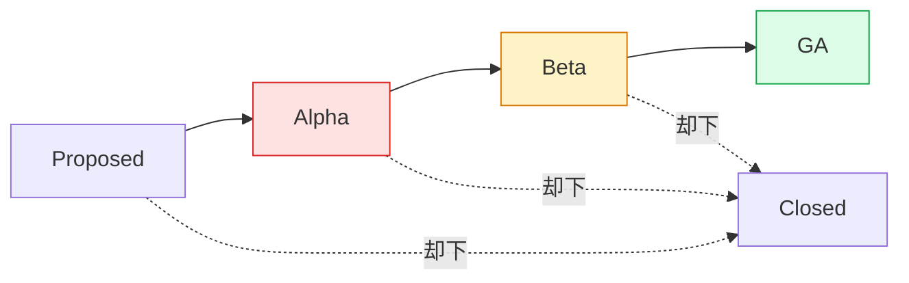
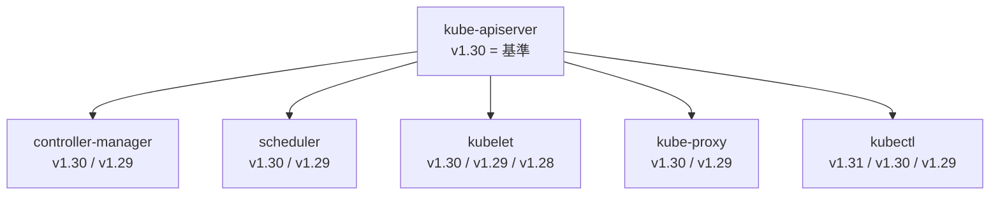
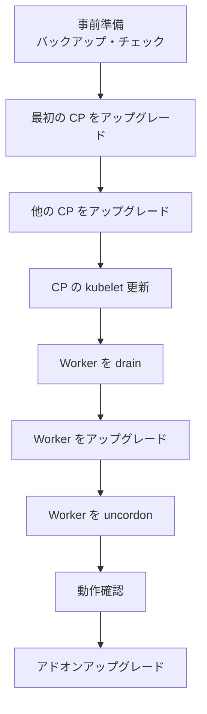
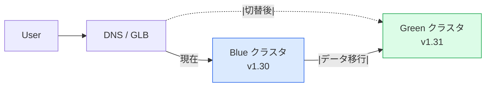
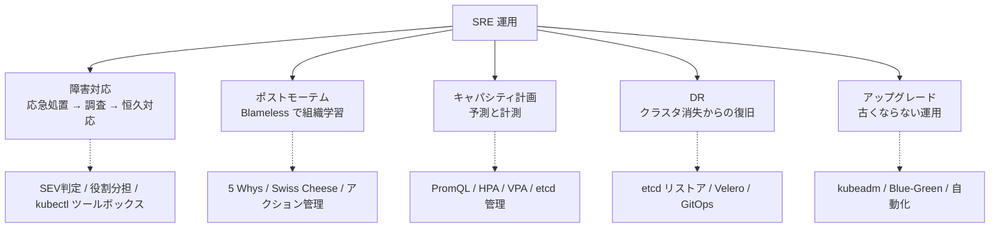

# クラスタアップグレード
{: .no_toc }

## 目次
{: .no_toc .text-delta }

1. TOC
{:toc}

---

## このページのゴール

このページを読み終えると、以下を **自分の言葉で説明できる** ようになります。

- Kubernetes の **リリースサイクル** と **サポートポリシー**(KEP の進化、minor バージョン毎の意味)
- **Version Skew Policy**(kubelet / kube-proxy / kubectl が apiserver より何バージョン遅れてよいか)の正確な条件
- **API Deprecation Policy** と、過去の代表的な廃止 API(extensions/v1beta1、PodSecurityPolicy など)
- アップグレード前に必須の **チェックリスト 15 項目** と、それぞれの確認方法
- `pluto` / `kubent` を使った **Deprecated API の事前検出**
- ローカル VMware kubeadm 環境で `v1.30 → v1.31` を **無停止で完遂する** 完全手順
- Calico / MetalLB / NGINX Ingress / cert-manager / NFS-CSI / Argo CD / metrics-server / Prometheus といった **アドオンの互換性確認とアップグレード**
- アップグレード中に頻発する落とし穴と回避策、**4 つの典型シナリオでの切り戻し戦略**
- Blue-Green クラスタアップグレードの設計と、ローカルで擬似実装する方法
- アップグレードを **シェル → Ansible → Cluster API** と段階的に自動化していくロードマップ

---

## なぜアップグレードが必要か

「動いてるなら触らない」は IT インフラの古い格言ですが、Kubernetes には通用しません。理由は:

### 1. サポート期間が短い

Kubernetes は **おおむね 4 ヶ月に 1 度** マイナーリリースされ、各バージョンの公式サポートは **14 ヶ月** で打ち切られます。
これは古典的な OS(RHEL 等の 10 年サポート)とは比較にならない速さです。

つまり、**何もしないと 1 年 2 ヶ月でクラスタが EOL** になります。

### 2. CVE(脆弱性)パッチが当たらなくなる

EOL バージョンには CVE 修正パッチが提供されません。重大な脆弱性が出ても放置せざるをえない。

### 3. クラウドベンダーが先にサポートを打ち切る

マネージドサービス(EKS / GKE / AKS)は **より早く** 古いバージョンを退役させます。
EKS は v1.23 を v1.30 リリースから数ヶ月で強制アップグレード対象にする、といった事例があります。

### 4. 新機能が使えない

Sidecar containers (1.29 GA)、Pod Resource Resize (1.27 alpha)、ImageVolume (1.30 alpha)、Pod-level resource requests (1.32 beta)、CRI Image Pull per Runtime Class (1.29)、Validating Admission Policy (1.30 GA)、Job Pod Replacement Policy (1.29) など、多くの新機能が後方バージョンには来ません。

### 5. 周辺エコシステムが新バージョンに依存

Operator、CRD、cert-manager、Argo CD、Prometheus Operator など、エコシステムのツールは **最新 3〜4 バージョン** だけサポートする傾向。
古いクラスタを使い続けると、ツールも更新できず、その結果セキュリティ問題に。

---

## Kubernetes のリリースサイクル

### 公式スケジュール

- **マイナーリリース**: 約 4 ヶ月に 1 度
- **パッチリリース**: 数週間〜月ごと
- **サポート期間**: マイナーリリースから **14 ヶ月**(最新 3 マイナー + α)

具体的に最近のリリース(参考、本書の前提として):

```
v1.28: 2023-08
v1.29: 2023-12
v1.30: 2024-04
v1.31: 2024-08
v1.32: 2024-12
v1.33: 2025-04
```

各リリースの正式サポート終了は約 14 ヶ月後。本書執筆時点(2026)では、v1.30 以降がサポート対象。
**正確な日付は必ず公式 https://kubernetes.io/releases/ を確認すること**(本書執筆後にも変動するため)。

### バージョン番号の意味

`v1.30.5` の形式:

- **1**: メジャー(現状すべて 1)
- **30**: マイナー(機能追加)
- **5**: パッチ(バグ修正・セキュリティ)

マイナーアップを「メジャーアップ」と呼ぶ人がいますが正確ではない。

### KEP (Kubernetes Enhancement Proposal)

新機能は **KEP** と呼ばれる提案書で議論されます。
各機能は以下のステージを経ます:


```mermaid
flowchart LR
    proposed[Proposed] --> alpha[Alpha]
    alpha --> beta[Beta]
    beta --> ga[GA]
    
    proposed -.却下.-> closed[Closed]
    alpha -.却下.-> closed
    beta -.却下.-> closed

    style alpha fill:#fee2e2,stroke:#dc2626
    style beta fill:#fef3c7,stroke:#d97706
    style ga fill:#dcfce7,stroke:#16a34a
```

| ステージ | 意味 | デフォルト有効 | 本番利用 |
|----------|------|----------------|----------|
| Alpha | 試験実装 | OFF (`FeatureGate` で ON) | NO |
| Beta | 実用前提のテスト | 1.24 以降は OFF | 限定的 |
| GA / Stable | 完成、API 安定 | ON | OK |

**注意**: 1.24 以降、Beta は **デフォルト OFF** に方針変更されました(以前はデフォルト ON だった)。
古い記事や書籍を読むときは注意してください。

---

## Version Skew Policy

クラスタ内の各コンポーネントは、**完全に同じバージョンである必要はありません**。
ただし、許される **ズレ(skew)の上限** があります。


```mermaid
flowchart TB
    api[kube-apiserver<br>v1.30 = 基準]
    cm[controller-manager<br>v1.30 / v1.29]
    sch[scheduler<br>v1.30 / v1.29]
    kubelet[kubelet<br>v1.30 / v1.29 / v1.28]
    proxy[kube-proxy<br>v1.30 / v1.29]
    cli[kubectl<br>v1.31 / v1.30 / v1.29]
    
    api --> cm
    api --> sch
    api --> kubelet
    api --> proxy
    api --> cli
```

正確には(v1.28 以降の現行ポリシー):

| コンポーネント | 許容される skew(対 apiserver) |
|----------------|--------------------------------|
| kube-apiserver | 基準 |
| kube-controller-manager | 同じ or 1 マイナー古い |
| kube-scheduler | 同じ or 1 マイナー古い |
| cloud-controller-manager | 同じ or 1 マイナー古い |
| kubelet | 同じ or 1, 2, **3** マイナー古い(1.28 から拡張) |
| kube-proxy | 同じ or 1, 2, **3** マイナー古い(1.28 から拡張) |
| kubectl | 同じ or **1 マイナー新しい** or 1 マイナー古い |

つまり:

- apiserver より kubelet が **新しい** ことは認められない(逆は OK)
- kubectl だけは「+1」も許される(新しい kubectl で古いクラスタを操作可能)

### アップグレード順序の必然

このポリシーから、アップグレードは **「中央 → 末端」** という順序が必然になります:

```mermaid
flowchart TB
    s1[1. etcd] --> s2[2. kube-apiserver]
    s2 --> s3[3. controller-manager / scheduler]
    s3 --> s4[4. kubelet on control plane]
    s4 --> s5[5. kubelet on worker]
    s5 --> s6[6. kubectl(クライアント)]
    s6 --> s7[7. アドオン]
```

逆順だと skew policy に違反します。

### Minor バージョンを飛ばせない

kubeadm では、`v1.30 → v1.32` のような **2 マイナー飛ばし** はできません。
v1.30 → v1.31 → v1.32 と **1 マイナーずつ** 上げる必要があります。

これは大きな計画上の制約です。半年ほっておくと、上げるべきバージョンが 2 つ溜まり、作業時間も 2 倍になります。
**「2 マイナーまで遅れたら必ず追いつく」スケジュール** を組むのが現実的。

---

## API Deprecation Policy

K8s API には Deprecation(廃止予告)ポリシーがあります:

- **GA(v1)の API**: 12 ヶ月 + 1 マイナー以上の予告期間
- **Beta API**: 9 ヶ月 + 1 マイナー以上
- **Alpha API**: 予告なしに変更・削除可能

つまり、v1 API が消えるには **最低 1 年 + 3 マイナー** ほどの予告期間があります。

### 過去の代表的な API 廃止

| K8s バージョン | 廃止された API | 移行先 |
|----------------|----------------|--------|
| v1.16 | `extensions/v1beta1 Deployment, DaemonSet, ReplicaSet` | `apps/v1` |
| v1.16 | `extensions/v1beta1 NetworkPolicy` | `networking.k8s.io/v1` |
| v1.16 | `extensions/v1beta1 PodSecurityPolicy` | `policy/v1beta1` |
| v1.22 | `admissionregistration.k8s.io/v1beta1` | `admissionregistration.k8s.io/v1` |
| v1.22 | `apiextensions.k8s.io/v1beta1 CRD` | `apiextensions.k8s.io/v1` |
| v1.22 | `apiregistration.k8s.io/v1beta1` | `apiregistration.k8s.io/v1` |
| v1.22 | `networking.k8s.io/v1beta1 Ingress` | `networking.k8s.io/v1` |
| v1.22 | `rbac.authorization.k8s.io/v1beta1` | `v1` |
| v1.25 | `policy/v1beta1 PodSecurityPolicy` | **完全削除**、Pod Security Admission へ |
| v1.25 | `batch/v1beta1 CronJob` | `batch/v1` |
| v1.26 | `flowcontrol.apiserver.k8s.io/v1beta1` | `v1` |
| v1.26 | `horizontalpodautoscaler.autoscaling/v2beta2` | `autoscaling/v2` |
| v1.27 | `storage.k8s.io/v1beta1 CSIStorageCapacity` | `v1` |
| v1.29 | `flowcontrol.apiserver.k8s.io/v1beta2` | `v1` |
| v1.29 | `node.k8s.io/v1beta1 RuntimeClass` | `v1` |

これらに該当する YAML を本番で使ったままアップグレードすると、**API 不在で apply 不能** になります。

### Deprecated API の検出

#### `pluto`(FairwindsOps 製)

```bash
# 静的解析: マニフェストファイル
pluto detect-files -d ./manifests/ --target-versions k8s=v1.31

# クラスタ動的検査: in-use API を見る
pluto detect-helm --target-versions k8s=v1.31
pluto detect-all-in-cluster --target-versions k8s=v1.31
```

期待出力:

```
NAME              NAMESPACE   KIND          VERSION         REPLACEMENT     REMOVED   DEPRECATED   REPL AVAIL
my-old-ingress    default     Ingress       extensions/v1beta1   networking.k8s.io/v1   true     true        true
```

`REMOVED true` のものは **アップグレード前に必ず修正**。

#### `kubent`

```bash
kubent --target-version 1.31
```

実行例:

```
______________________________________________________________________________________________________________________
>>> Deprecated API Reports <<<
------------------------------------------------------------------------------------------------------------------------
KIND                NAMESPACE     NAME                          API_VERSION                            REPLACE_WITH    SINCE
PodSecurityPolicy   <undefined>   restricted                    policy/v1beta1                         <removed>       v1.21
```

#### kube-apiserver の Audit Log 経由で動的に検出

実際に **どのクライアントが古い API を呼んでいるか** を知るには:

```yaml
# /etc/kubernetes/audit-policy.yaml
apiVersion: audit.k8s.io/v1
kind: Policy
omitStages:
  - "RequestReceived"
rules:
- level: Metadata
  resources:
  - group: "extensions"
- level: Metadata
  resources:
  - group: "policy"
    resources: ["podsecuritypolicies"]
```

そして、`apiserver_requested_deprecated_apis` メトリクスを Prometheus で監視:

```promql
sum(rate(apiserver_requested_deprecated_apis[5m])) by (group, version, resource)
```

これが 0 でないなら、誰かが Deprecated API を叩いている。

---

## アップグレード前のチェックリスト

### 必須 15 項目

1. **対象バージョンのリリースノートを読む**
   - https://github.com/kubernetes/kubernetes/blob/master/CHANGELOG/CHANGELOG-1.31.md
   - "Urgent Upgrade Notes" と "Deprecation" を精読

2. **Deprecated API を全削除済みか**
   - `pluto` / `kubent` でクラスタ全体を検査
   - 残っていれば修正

3. **etcd の最新バックアップを取得・検証**
   - `etcdctl snapshot save` → `snapshot status` で size と revision 確認

4. **Velero で全 Namespace バックアップ**

5. **kubeadm-config の控え**
   - `kubectl get cm -n kube-system kubeadm-config -o yaml > kubeadm-config.bak`

6. **証明書の有効期限確認**
   - `kubeadm certs check-expiration`
   - 30 日以内に切れるものがあれば、アップグレード序でに更新

7. **Node の Drain 可能性確認**
   - PDB と replicas のバランス
   - StatefulSet の更新戦略

8. **アドオンの互換性表確認**
   - Calico、MetalLB、ingress-nginx、cert-manager 等が v1.31 対応か
   - 各 README / Compatibility Matrix を参照

9. **CRD のスキーマ互換**
   - Operator が新スキーマで動くか

10. **Webhook の対応**
    - mutating/validating webhook が新 API を理解できるか

11. **ストレージドライバの対応**
    - NFS-CSI のサポートバージョン

12. **CNI (Calico) の対応**
    - Calico の Compatibility Matrix

13. **CRI(containerd)の対応**
    - 同じく対応バージョン

14. **テスト用クラスタでの事前リハーサル**
    - staging 環境で同じ手順を実行

15. **DR 計画と切り戻し手順の確認**
    - もし失敗したらどう戻すか

### チェックスクリプト

```bash
#!/bin/bash
# scripts/preflight-upgrade.sh
set -euo pipefail
TARGET=${1:-v1.31}

echo "=== Cluster info ==="
kubectl version --short
kubectl get nodes -o wide

echo "=== Deprecated APIs (pluto) ==="
pluto detect-all-in-cluster --target-versions k8s=${TARGET} || true

echo "=== Deprecated APIs (kubent) ==="
kubent --target-version ${TARGET#v} || true

echo "=== Certificate expiration ==="
for CP in k8s-cp1 k8s-cp2 k8s-cp3; do
  ssh ${CP} 'sudo kubeadm certs check-expiration | grep -v "no error" || true'
done

echo "=== Latest etcd backup ==="
ls -lh /export/etcd-backup/ | tail -5

echo "=== PDB violations ==="
kubectl get pdb -A

echo "=== Webhook configurations ==="
kubectl get mutatingwebhookconfigurations
kubectl get validatingwebhookconfigurations

echo "=== Done ==="
```

---

## kubeadm によるアップグレード(v1.30 → v1.31 完全手順)

### 全体フロー


```mermaid
flowchart TB
    pre[事前準備<br>バックアップ・チェック] --> first_cp[最初の CP をアップグレード]
    first_cp --> other_cp[他の CP をアップグレード]
    other_cp --> kubelet_cp[CP の kubelet 更新]
    kubelet_cp --> worker_drain[Worker を drain]
    worker_drain --> worker_upgrade[Worker をアップグレード]
    worker_upgrade --> worker_uncordon[Worker を uncordon]
    worker_uncordon --> verify[動作確認]
    verify --> addons[アドオンアップグレード]
```

### Step 1: 事前準備

```bash
# etcd バックアップ
ssh k8s-cp1 'sudo ETCDCTL_API=3 etcdctl ... snapshot save /tmp/pre-upgrade.db'
scp k8s-cp1:/tmp/pre-upgrade.db ./
sudo ETCDCTL_API=3 etcdctl snapshot status pre-upgrade.db -w table

# Velero バックアップ
velero backup create pre-upgrade-$(date +%Y%m%d) --wait

# Preflight
./scripts/preflight-upgrade.sh v1.31
```

### Step 2: 最初の Control Plane(k8s-cp1)

#### 2.1 リポジトリの追加(K8s pkg リポジトリの移行に注意)

K8s は以前 `apt.kubernetes.io` を使っていましたが、**2023 年から `pkgs.k8s.io` に移行** しました。
**マイナーバージョンごとに別のリポジトリ** であることに注意。

```bash
ssh k8s-cp1

# v1.30 リポジトリを v1.31 リポジトリに切り替え
sudo curl -fsSLo /etc/apt/keyrings/kubernetes-apt-keyring.gpg \
  https://pkgs.k8s.io/core:/stable:/v1.31/deb/Release.key

cat <<EOF | sudo tee /etc/apt/sources.list.d/kubernetes.list
deb [signed-by=/etc/apt/keyrings/kubernetes-apt-keyring.gpg] \
  https://pkgs.k8s.io/core:/stable:/v1.31/deb/ /
EOF

sudo apt update
```

ファイル名と GPG キーが Apple GPG とは異なります。

#### 2.2 kubeadm のアップグレード

```bash
# 利用可能なバージョン確認
apt-cache madison kubeadm

# 1.30 の pin を外す(以前 hold していた)
sudo apt-mark unhold kubeadm

# アップグレード
sudo apt install -y kubeadm=1.31.0-1.1

# pin する
sudo apt-mark hold kubeadm

# バージョン確認
kubeadm version
```

#### 2.3 アップグレードプランの確認

```bash
sudo kubeadm upgrade plan
```

期待出力:

```
[upgrade/config] Making sure the configuration is correct:
[upgrade/config] Reading configuration from the cluster...
[upgrade/config] FYI: You can look at this config file with 'kubectl -n kube-system get cm kubeadm-config -o yaml'
[upgrade/preflight] Running pre-flight checks.
[upgrade] Running cluster health checks
[upgrade] Fetching available versions to upgrade to
[upgrade/versions] Cluster version: v1.30.5
[upgrade/versions] kubeadm version: v1.31.0

Components that must be upgraded manually after you have upgraded the control plane with 'kubeadm upgrade apply':
COMPONENT   NODE      CURRENT    TARGET
kubelet     k8s-cp1   v1.30.5    v1.31.0
kubelet     k8s-cp2   v1.30.5    v1.31.0
kubelet     k8s-cp3   v1.30.5    v1.31.0
...

Upgrade to the latest stable version:
COMPONENT                 NODE      CURRENT    TARGET
kube-apiserver            k8s-cp1   v1.30.5    v1.31.0
kube-controller-manager   k8s-cp1   v1.30.5    v1.31.0
kube-scheduler            k8s-cp1   v1.30.5    v1.31.0
kube-proxy                          1.30.5     v1.31.0
CoreDNS                             v1.11.1    v1.11.3
etcd                      k8s-cp1   3.5.12-0   3.5.15-0

You can now apply the upgrade by executing the following command:

	kubeadm upgrade apply v1.31.0
```

**確認するポイント**:

- すべての主要コンポーネントが v1.31.0 に上がるか
- 大きな skew がないか
- etcd のバージョンが大幅に変わっていないか
- CoreDNS が問題ないバージョンか

#### 2.4 アップグレード適用

```bash
sudo kubeadm upgrade apply v1.31.0
# yes と入力して進める
```

このコマンドは:

1. プリフライトチェック
2. etcd のアップグレード(必要なら)
3. apiserver / controller-manager / scheduler の Pod を新バージョンに置き換え
4. kube-proxy DaemonSet を更新
5. CoreDNS を更新

**待ち時間**: 5〜10 分。途中で Ctrl-C しないこと。

#### 2.5 kubelet と kubectl のアップグレード

apiserver は v1.31 になりましたが、kubelet はまだ v1.30 です。続けて:

```bash
# CP の kubelet を drain
kubectl drain k8s-cp1 --ignore-daemonsets --delete-emptydir-data

# パッケージアップグレード
sudo apt-mark unhold kubelet kubectl
sudo apt install -y kubelet=1.31.0-1.1 kubectl=1.31.0-1.1
sudo apt-mark hold kubelet kubectl

# kubelet 再起動
sudo systemctl daemon-reload
sudo systemctl restart kubelet

# Pod 再開を許可
kubectl uncordon k8s-cp1

# 確認
kubectl get nodes
# k8s-cp1 のバージョンが v1.31.0 になっている
```

### Step 3: 他の Control Plane(k8s-cp2, cp3)

同じ手順ですが、apply ではなく `node` サブコマンドを使います:

```bash
ssh k8s-cp2

# リポジトリ更新
# (上の Step 2.1 と同じ)

# kubeadm 更新
sudo apt-mark unhold kubeadm
sudo apt install -y kubeadm=1.31.0-1.1
sudo apt-mark hold kubeadm

# node サブコマンドで実行(apply ではない)
sudo kubeadm upgrade node

# kubelet 更新
kubectl drain k8s-cp2 --ignore-daemonsets --delete-emptydir-data
sudo apt-mark unhold kubelet kubectl
sudo apt install -y kubelet=1.31.0-1.1 kubectl=1.31.0-1.1
sudo apt-mark hold kubelet kubectl
sudo systemctl daemon-reload
sudo systemctl restart kubelet
kubectl uncordon k8s-cp2

# 同様に k8s-cp3 でも
```

### Step 4: Worker ノード(k8s-w1, w2, w3)

Worker は **1 台ずつ** 実施。同時に全 Worker を drain すると Pod が動く場所がなくなる。

```bash
# まず最初の Worker を drain
kubectl drain k8s-w1 --ignore-daemonsets --delete-emptydir-data --timeout=600s

ssh k8s-w1

# リポジトリ更新(Step 2.1 と同じ)

# kubeadm
sudo apt-mark unhold kubeadm
sudo apt install -y kubeadm=1.31.0-1.1
sudo apt-mark hold kubeadm

# Worker は upgrade node を実行
sudo kubeadm upgrade node

# kubelet
sudo apt-mark unhold kubelet kubectl
sudo apt install -y kubelet=1.31.0-1.1 kubectl=1.31.0-1.1
sudo apt-mark hold kubelet kubectl
sudo systemctl daemon-reload
sudo systemctl restart kubelet

# 復帰
kubectl uncordon k8s-w1
```

k8s-w1 の Ready を確認してから、k8s-w2 → k8s-w3 と進める。

### Step 5: 検証

```bash
# ノードバージョン
kubectl get nodes

# 全 Pod
kubectl get pods -A | grep -v Running

# kube-system の挙動
kubectl logs -n kube-system -l component=kube-apiserver --tail=20

# サンプルアプリが動くか
curl -sS http://192.168.56.200/healthz

# etcd の状態
ssh k8s-cp1 'sudo ETCDCTL_API=3 etcdctl ... endpoint status --cluster -w table'
```

### Step 6: アドオン更新

これは次のセクションで詳細。

---

## アドオンのアップグレード

各アドオンには独自のアップグレード手順があります。

### Calico

`tigera-operator` を使っているなら:

```bash
# operator 自体の更新
kubectl apply --server-side --force-conflicts \
  -f https://raw.githubusercontent.com/projectcalico/calico/v3.28.2/manifests/tigera-operator.yaml

# Installation CR の version 更新は不要(operator が自動)
```

manifest デプロイの場合は対応する `calico.yaml` を適用。

互換性: Calico Compatibility Matrix を参照。Calico v3.28+ は K8s v1.27〜v1.31 をサポート。

### MetalLB

```bash
# CR (IPAddressPool, L2Advertisement) は通常後方互換
# manifest を新バージョンで再適用
kubectl apply -f https://raw.githubusercontent.com/metallb/metallb/v0.14.8/config/manifests/metallb-native.yaml
```

新バージョンでは `Layer2 mode` の挙動が変わったり、`FRR mode` が追加されたり。CHANGELOG を必ず確認。

### NGINX Ingress Controller

```bash
helm repo update ingress-nginx
helm upgrade ingress-nginx ingress-nginx/ingress-nginx \
  --namespace ingress-nginx \
  --version 4.11.2 \
  --reuse-values
```

ConfigMap の主要オプション(`enable-real-ip`、`use-proxy-protocol` 等)が大きく変わることがあるので、リリースノート確認必須。

### cert-manager

```bash
# CRD は別途
kubectl apply -f https://github.com/cert-manager/cert-manager/releases/download/v1.15.3/cert-manager.crds.yaml

# Helm
helm upgrade cert-manager jetstack/cert-manager \
  --namespace cert-manager \
  --version v1.15.3 \
  --reuse-values
```

certificate / clusterissuer の CRD が変わっていないか確認。

### NFS-CSI

```bash
helm upgrade csi-driver-nfs csi-driver-nfs/csi-driver-nfs \
  --namespace kube-system \
  --version v4.9.0 \
  --reuse-values
```

PV / PVC は変更不要だが、StorageClass のオプションが変わっていることがある。

### Argo CD

```bash
helm repo update argo
helm upgrade argocd argo/argo-cd \
  --namespace argocd \
  --version 7.6.12 \
  --reuse-values
```

Application CRD のスキーマがマイナーアップで変わる場合あり。

### metrics-server

```bash
kubectl apply -f https://github.com/kubernetes-sigs/metrics-server/releases/download/v0.7.2/components.yaml
```

K8s v1.31 では v0.7.x が推奨。

### Prometheus stack

```bash
helm upgrade kube-prometheus-stack prometheus-community/kube-prometheus-stack \
  --namespace monitoring \
  --version 62.6.0 \
  --reuse-values
```

ServiceMonitor / PodMonitor / PrometheusRule CRD の更新を含むので、`--force` が必要な場合あり。

### アドオンの優先順位

複数のアドオンを同時に上げると、トラブル時にどれが原因か分かりにくい。
**1 つずつ、間に動作確認を挟んで** 上げる。

順序の目安:

1. metrics-server(他のアドオンの依存)
2. CNI(Calico)
3. CSI(NFS-CSI)
4. MetalLB
5. ingress-nginx
6. cert-manager
7. Argo CD
8. Prometheus stack
9. アプリ依存の Operator

---

## アップグレードの落とし穴

実際に頻発する問題を、シナリオ別に整理します。

### 落とし穴 1: Webhook 互換性

**症状**: アップグレード後、apply / create が `webhook timeout` でエラー。

**原因**: validating/mutating webhook を提供している Operator が、新 K8s API バージョンに対応していない。

**対処**:
- 事前に Operator の対応バージョンを確認
- 仕方ない場合、Webhook の `failurePolicy` を一時的に `Ignore` に
- アップグレード後、Operator も更新

### 落とし穴 2: CSI ドライバの非互換

**症状**: PVC が新規作成できない、または マウント失敗。

**原因**: CSI ドライバが K8s 新バージョンの API を理解できない。

**対処**:
- 事前に CSI ドライバを K8s 対応バージョンに更新
- 場合によっては CSI を先に更新してから K8s

### 落とし穴 3: PodSecurityPolicy(PSP)の完全削除

**v1.25** で PSP は完全削除されました。代わりに **Pod Security Admission (PSA)** を使います。

PSP を使っていた場合:

```yaml
# Pod Security Admission の有効化(Namespace ラベル)
apiVersion: v1
kind: Namespace
metadata:
  name: prod
  labels:
    pod-security.kubernetes.io/enforce: restricted
    pod-security.kubernetes.io/enforce-version: latest
    pod-security.kubernetes.io/audit: restricted
    pod-security.kubernetes.io/warn: restricted
```

PSA は 3 つのレベル: `privileged` / `baseline` / `restricted`。

### 落とし穴 4: cgroup v2 移行

**v1.25 で cgroup v2 がデフォルト** に変更されています。Ubuntu 22.04 はすでに cgroup v2 がデフォルトなので問題ないですが、Ubuntu 20.04 や CentOS 7 では cgroup v1 のままの場合があり、`SystemdCgroup = true` の設定が必要。

```bash
ssh k8s-w1 'mount | grep cgroup'
# cgroup2 on /sys/fs/cgroup type cgroup2 (...)
# なら OK

# containerd の設定
sudo grep SystemdCgroup /etc/containerd/config.toml
# [plugins."io.containerd.grpc.v1.cri".containerd.runtimes.runc.options]
#   SystemdCgroup = true
# となっているか
```

### 落とし穴 5: dockershim 削除

**v1.24** で Docker (dockershim) のサポートが削除されました。Docker を CRI として使っていた場合、containerd か CRI-O に移行が必要。
本書のローカル環境は最初から containerd を使っているので影響なし。

### 落とし穴 6: Feature Gates の変化

各バージョンで Feature Gate が GA に昇格 / 削除されます。
**`--feature-gates=Foo=true`** が指定されていると、その Feature が GA になった後 **未知のフラグエラー** で起動不能に。

事前にチェック:

```bash
ssh k8s-cp1 'sudo grep feature-gates /etc/kubernetes/manifests/*.yaml /var/lib/kubelet/config.yaml'
```

該当があれば、新バージョンでまだ Feature Gate として有効か確認。

### 落とし穴 7: Image レジストリの移行

K8s v1.25+ から、公式イメージは `k8s.gcr.io` から **`registry.k8s.io`** に移行されています。
古いマニフェストや Helm Chart が `k8s.gcr.io` を参照していると、いずれ pull できなくなります。

```bash
# 検出
kubectl get pods -A -o yaml | grep -i 'k8s.gcr.io'
```

移行は単純な置換:

```bash
sed -i 's|k8s.gcr.io|registry.k8s.io|g' manifest.yaml
```

### 落とし穴 8: etcd quota とサイズ

アップグレード中に etcd サイズが急増することがあります(古いリビジョンが残るため)。
事前に コンパクション + デフラグしておく。

### 落とし穴 9: kubeadm-config の手動編集

`kubectl edit cm kubeadm-config -n kube-system` で手動編集した内容が、`kubeadm upgrade apply` で **上書きされる** ことがあります。
カスタマイズは ClusterConfiguration の patch として保存。

### 落とし穴 10: 証明書の期限

kubeadm の証明書は **1 年で切れます**。アップグレード時に再生成されますが、worker の kubelet 証明書は手動更新が必要なケースあり。

```bash
sudo kubeadm certs check-expiration
sudo kubeadm certs renew all
```

---

## 切り戻し戦略

アップグレードが失敗したらどう戻すか。シナリオ別に。

### シナリオ 1: 最初の Control Plane でだけ失敗

**まだ他の CP がアップグレードされていない**ので、影響は最小。

```bash
# 失敗した CP で
sudo apt install -y kubeadm=1.30.5-1.1 kubelet=1.30.5-1.1
sudo systemctl restart kubelet

# etcd の状態によっては:
# 1. 当該 CP を kubeadm reset
# 2. 他の CP から member remove
# 3. 再 join
```

### シナリオ 2: 全 CP が新バージョン、Worker 途中で失敗

CP は v1.31、Worker は一部 v1.31、残りは v1.30。
skew policy 内なら問題なく動く。失敗した Worker だけ再試行か、当該ノードを除外して別ノード追加。

### シナリオ 3: アプリレベルの非互換が発覚

K8s 自体は v1.31 で正常、しかしアプリが動かない。
クラスタを v1.30 に戻すのは難しい(etcd は新バージョンになっている)。
**アプリ側の修正** が現実的な解。

事前のテスト環境での検証がここで重要。

### シナリオ 4: etcd 致命的失敗

etcd 自体がスタートしない。
**etcd スナップショットからのリストア** を実施(`dr.md` 参照)。
スナップショットを取った時点に戻る → アップグレード前に戻る。

### 切り戻しの基本原則

- **K8s は基本「戻せない」**(API のスキーマが進むため)
- **戻すのは etcd スナップショットからのみ**
- だから **事前バックアップが必須**
- だから **staging で必ず予行演習**

---

## Blue-Green クラスタアップグレード

「インプレースアップグレード」ではなく、**新クラスタを別途立てて切り替える** 戦略。


```mermaid
flowchart LR
    user[User]
    user --> dns[DNS / GLB]
    dns -->|現在| blue[Blue クラスタ<br>v1.30]
    dns -.|切替後|.-> green[Green クラスタ<br>v1.31]
    blue --|データ移行|--> green

    style blue fill:#dbeafe,stroke:#2563eb
    style green fill:#dcfce7,stroke:#16a34a
```

### 利点

- **戻し** が簡単(DNS を戻すだけ)
- **アプリのテスト** を別クラスタで安全にできる
- **複数バージョンの非互換** を一気に解消できる(v1.28 → v1.31 が現実的)

### 欠点

- **2 倍のリソース** が必要(一時的)
- **データ移行** が複雑(PostgreSQL の論理レプリ、Velero etc.)
- **状態同期** が難しい(セッション、進行中のジョブ)

### ローカル環境での擬似

VMware で 2 つ目のクラスタ(192.168.57.x)を構築し、HAProxy で DNS-like なルーティング:

```
# HAProxy 設定
frontend todo
  bind 192.168.56.10:443 ssl crt /etc/haproxy/certs/
  default_backend blue
  acl is_green hdr(host) -i green.todo.example
  use_backend green if is_green

backend blue
  server cluster1 192.168.56.200:443 check

backend green
  server cluster2 192.168.57.200:443 check
```

切替時は `default_backend blue` → `default_backend green` に変更。

---

## アップグレード自動化のロードマップ

手作業 → スクリプト → Ansible → Cluster API という発展段階があります。

### Level 1: Shell スクリプト

```bash
# scripts/upgrade-node.sh
#!/bin/bash
set -euo pipefail
NODE=$1
VERSION=$2

ssh ${NODE} "
  sudo apt-mark unhold kubeadm
  sudo apt install -y kubeadm=${VERSION}-1.1
  sudo apt-mark hold kubeadm
  sudo kubeadm upgrade node
  
  sudo apt-mark unhold kubelet kubectl
  sudo apt install -y kubelet=${VERSION}-1.1 kubectl=${VERSION}-1.1
  sudo apt-mark hold kubelet kubectl
  sudo systemctl daemon-reload
  sudo systemctl restart kubelet
"

kubectl wait --for=condition=Ready node/${NODE} --timeout=300s
echo "${NODE} upgraded to ${VERSION}"
```

### Level 2: Ansible Playbook

```yaml
# playbook/upgrade.yaml
- hosts: control_plane
  serial: 1
  tasks:
  - name: Drain node
    delegate_to: localhost
    command: kubectl drain "{{ inventory_hostname }}" --ignore-daemonsets --delete-emptydir-data
  - name: Update kubeadm
    ansible.builtin.apt:
      name: "kubeadm=1.31.0-1.1"
      state: present
      allow_change_held_packages: true
  - name: Run kubeadm upgrade
    command: kubeadm upgrade {{ 'apply v1.31.0 -y' if inventory_hostname == groups['control_plane'][0] else 'node' }}
  - name: Update kubelet, kubectl
    ansible.builtin.apt:
      name: "{{ item }}=1.31.0-1.1"
      state: present
      allow_change_held_packages: true
    loop: [kubelet, kubectl]
  - name: Restart kubelet
    ansible.builtin.systemd:
      name: kubelet
      state: restarted
      daemon_reload: true
  - name: Uncordon
    delegate_to: localhost
    command: kubectl uncordon "{{ inventory_hostname }}"
```

`serial: 1` で 1 台ずつ実行。

### Level 3: Cluster API

宣言的にクラスタを管理する CNCF プロジェクト。

```yaml
apiVersion: cluster.x-k8s.io/v1beta1
kind: Cluster
metadata:
  name: prod
spec:
  topology:
    version: v1.31.0  # ここを変えるだけ
    controlPlane:
      replicas: 3
    workers:
      machineDeployments:
      - class: default-worker
        replicas: 3
```

Cluster API は K8s 上に「メタクラスタ(Management Cluster)」を構築し、その上でターゲットクラスタを管理。
本書のローカル環境では複雑すぎるため、興味があれば公式ドキュメントを参照。

---

## ハンズオン

### Hands-on 1: Deprecated API の検出

1. `pluto` と `kubent` をインストール
2. クラスタに対して実行:

```bash
pluto detect-all-in-cluster --target-versions k8s=v1.31
kubent --target-version 1.31
```

3. 何か出てきたら、それを修正する PR を作る練習(staging で)

### Hands-on 2: 単体ノードの kubelet アップグレード

完全なクラスタアップグレードは大仕事なので、まずは **kubelet 単体** のアップグレードを 1 台で。

```bash
# k8s-w3 だけ
kubectl drain k8s-w3 --ignore-daemonsets --delete-emptydir-data
ssh k8s-w3
sudo apt-mark unhold kubelet
sudo apt install -y kubelet=1.30.6-1.1  # パッチバージョンを 1 つ上げる
sudo apt-mark hold kubelet
sudo systemctl restart kubelet
exit
kubectl uncordon k8s-w3
kubectl get nodes
```

これだけでも、drain / upgrade / uncordon の流れが体感できる。

### Hands-on 3: フルアップグレード演習 (v1.30 → v1.31)

本書の真骨頂。完全な手順を実機で:

1. 事前にバックアップ(etcd snapshot, Velero)
2. preflight チェック
3. k8s-cp1 で `kubeadm upgrade apply v1.31.0`
4. k8s-cp2, k8s-cp3 で `kubeadm upgrade node`
5. 全 CP の kubelet を更新
6. k8s-w1〜w3 を順次 upgrade
7. 動作確認
8. アドオン更新

**所要時間**: 初回は半日〜1 日。慣れれば 2〜3 時間。

完了後にぜひポストモーテム(`postmortem.md`)を書いてみてください。Game Day と同じ要領で「うまくいかなかったこと」「運がよかったこと」を残すと、次回大幅に効率化されます。

### Hands-on 4: 切り戻し演習

故意に失敗させて、etcd snapshot から戻す:

1. アップグレード前の snapshot を保管
2. v1.31 にアップグレード
3. 別のテスト用 Namespace で「v1.31 でしか動かない」設定を入れる
4. etcd snapshot からリストア
5. クラスタが v1.30 の状態に戻り、3 で入れた設定が消えていることを確認

ここまで通せれば、現場の SRE として通用するレベルです。

---

## アンチパターン

### 1. リリースノートを読まない

「kubeadm upgrade apply」で「何が変わるか分かってない」状態で実行。
本番ではかなりの確率で事故。

### 2. staging を持っていない

本番で初めて新バージョンを試す。99% の確率で何かしら問題が起きる。

### 3. ロールバック計画なし

「失敗したら戻せる」前提なしに進める。実際は戻せないことが多い。

### 4. アドオンを同時に大量アップデート

問題発生時に原因切り分けができない。

### 5. PDB を無視して drain --force

ワーカー数 < replicas の状態で drain。サービス停止。

### 6. 2 マイナー以上溜める

「忙しいから」と先送りして、v1.28 → v1.32 のような状況に。インプレースでは不可能で、Blue-Green が必要に。

### 7. Deprecated API を放置

v1.16 の `extensions/v1beta1 Ingress` が残ったまま v1.22 にアップグレード → 全 Ingress が壊れる。

### 8. cert-manager のバージョンを動かさず Kubernetes だけ上げる

cert-manager は ValidatingAdmissionWebhook を提供しているため、不一致だと全 Certificate リソースが apply 不能に。

### 9. kubeadm-config の手動編集後にアップグレード

`kubeadm upgrade apply` が手動編集を上書き → 設定が消える。
カスタマイズは ClusterConfiguration の patch として保存。

### 10. アップグレード中に他の変更を入れる

「ついでにこれも」と新しい Deployment を入れる → 何が原因の障害か特定不能。
**アップグレード中は他の変更凍結**。

---

## アップグレードの成熟度モデル

組織のアップグレード能力を評価するモデル:

| Level | 状態 | 特徴 |
|-------|------|------|
| **L1: 場当たり** | 「動いてるから触らない」、年単位で放置 | EOL バージョン稼働、CVE 放置 |
| **L2: 計画的手作業** | 半年〜1 年ごとに手作業で実施 | ランブックあり、staging あり |
| **L3: 自動化** | スクリプト / Ansible で半自動 | preflight 自動、ロールバック手順 |
| **L4: 継続的** | 月次でパッチ、四半期でマイナー | 演習込み、Blue-Green 可能 |
| **L5: 宣言的** | Cluster API、GitOps で完全宣言的 | 「version 変更 = PR マージ」 |

本書のローカル環境では Level 2〜3 を目指します。クラウドのマネージドサービスで Level 4〜5。

---

## ローカル環境での具体的な注意点

### apt リポジトリの URL

`apt.kubernetes.io` は古い。**`pkgs.k8s.io` を使う**:

```
deb [signed-by=/etc/apt/keyrings/kubernetes-apt-keyring.gpg] https://pkgs.k8s.io/core:/stable:/v1.31/deb/ /
```

### registry.k8s.io への移行

`k8s.gcr.io` は EOL です。すべて `registry.k8s.io` に置換。

### ローカルレジストリ(192.168.56.10:5000)

新バージョンの K8s イメージをローカルレジストリにキャッシュしておくとアップグレードが速い:

```bash
for IMAGE in $(sudo kubeadm config images list --kubernetes-version v1.31.0); do
  docker pull ${IMAGE}
  NEW_TAG=$(echo ${IMAGE} | sed 's|registry.k8s.io|192.168.56.10:5000|')
  docker tag ${IMAGE} ${NEW_TAG}
  docker push ${NEW_TAG}
done
```

そして `kubeadm-config.yaml` に:

```yaml
imageRepository: 192.168.56.10:5000
```

---

## チェックポイント

ここまでで以下を **自分の言葉で** 説明できるか確認してください。

- [ ] K8s のリリースサイクル(4 ヶ月 / 14 ヶ月サポート)を答えられる
- [ ] Version Skew Policy で kubelet が apiserver より何バージョン古くてよいかを答えられる
- [ ] API Deprecation Policy(GA は最低 12 ヶ月予告)を説明できる
- [ ] PSP が v1.25 で完全削除されたこと、代替の PSA を説明できる
- [ ] `pluto` または `kubent` で deprecated API を検出する方法を示せる
- [ ] kubeadm アップグレードの全体フロー(CP → Worker)を順に説明できる
- [ ] `kubeadm upgrade apply` と `kubeadm upgrade node` の使い分けを説明できる
- [ ] アップグレード前のチェックリストを 10 項目以上挙げられる
- [ ] アドオン(Calico, MetalLB, cert-manager 等)のアップグレード順序を説明できる
- [ ] アップグレード失敗時の切り戻し戦略を 4 シナリオで説明できる
- [ ] Blue-Green クラスタアップグレードの利点と欠点を説明できる
- [ ] cgroup v2、dockershim 削除、registry.k8s.io 移行の歴史的経緯を説明できる
- [ ] Feature Gate の動きを、Alpha/Beta/GA で説明できる
- [ ] 自分の環境で v1.30 → v1.31 アップグレードを実機で完遂した

---

## 本章のまとめ

ここまで来たら、本章 11「SRE 運用」を完走しました。お疲れさまでした。

獲得したスキル:


```mermaid
flowchart TB
    sre[SRE 運用]
    sre --> i[障害対応<br>応急処置 → 調査 → 恒久対応]
    sre --> p[ポストモーテム<br>Blameless で組織学習]
    sre --> c[キャパシティ計画<br>予測と計測]
    sre --> d[DR<br>クラスタ消失からの復旧]
    sre --> u[アップグレード<br>古くならない運用]

    i -.-> i_skill[SEV判定 / 役割分担 / kubectl ツールボックス]
    p -.-> p_skill[5 Whys / Swiss Cheese / アクション管理]
    c -.-> c_skill[PromQL / HPA / VPA / etcd 管理]
    d -.-> d_skill[etcd リストア / Velero / GitOps]
    u -.-> u_skill[kubeadm / Blue-Green / 自動化]
```

本書は **ローカル VMware kubeadm 環境** という制約の中で、商用環境と同じ思考プロセスを身につけることを目指してきました。
クラウドのマネージドサービスを使う場合でも、ここで学んだ原則は **そのまま応用** できます:

- アプリケーション層の SLO / エラーバジェット → どこで運用しようと同じ
- 障害対応のフレーム(SEV / IC / Ops / Comms / Scribe) → 同じ
- ポストモーテムの書き方 → 同じ
- アプリのキャパシティ計画(HPA / VPA) → 同じ
- アプリデータの DR(Velero / アプリ層レプリ) → 同じ
- アドオンと依存ライブラリの追従 → 同じ

クラウドでは「kubeadm でクラスタを立てる」「etcd スナップショット」「Worker を増設」が **見えなく** なりますが、**裏でクラウドベンダーが同じことをしている** と理解できると、トラブルシュートも怖くなくなります。

---

## 第 11 章を終えて、何を読むか

本書の続きとして:

- **第 12 章 マルチクラスタ**: フリートマネジメント、Fleet、Argo CD ApplicationSet、KubeFed
- **第 13 章 セキュリティ強化**: NetworkPolicy 詳細、Falco による Runtime Security、署名検証 (cosign)
- **第 14 章 コスト最適化**: ノード型選定、Spot Instance、Karpenter、Right Sizing

本書の外で:

- **Google SRE 本**(必読)https://sre.google/sre-book/
- **SRE Workbook**(実践) https://sre.google/workbook/
- **Kubernetes 公式ドキュメント** https://kubernetes.io/docs/
- **CNCF Landscape** https://landscape.cncf.io/(関連エコシステム)
- **KubeCon** の動画(YouTube で無料公開)

---

## 最後に

SRE は終わりのない学習の旅です。今日得た知識も、来年には半分が古くなっています。
しかし、**根本的な原則** ─ Blameless、エラーバジェット、自動化、観測性、訓練 ─ は変わりません。

本章で身についた **「型」** を持って、ぜひ実際の現場で挑戦してください。
そして、自分の組織で得た知見を、本書の続きとして書き残してください。それが SRE コミュニティへの最大の貢献です。

→ 次の章: [12. マルチクラスタ]({{ '/12-multicluster/' | relative_url }})
