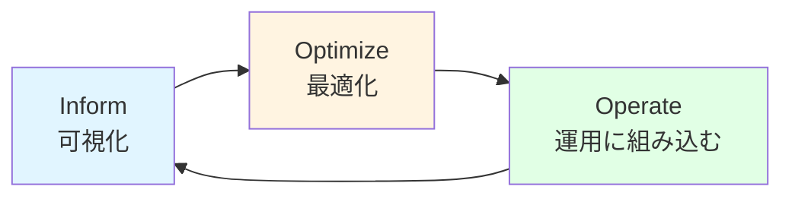
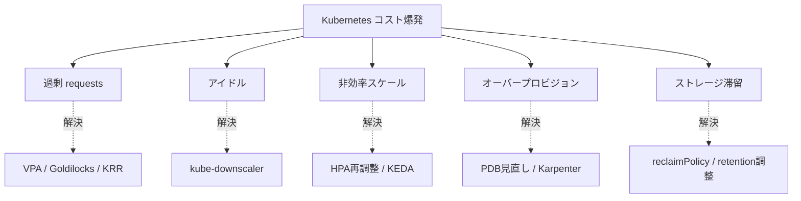
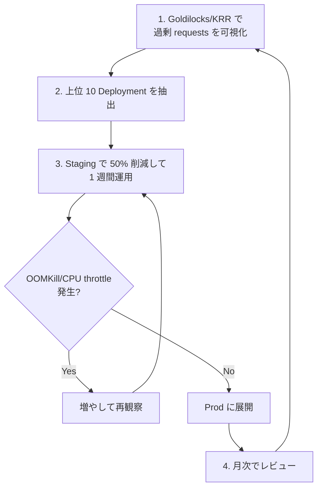
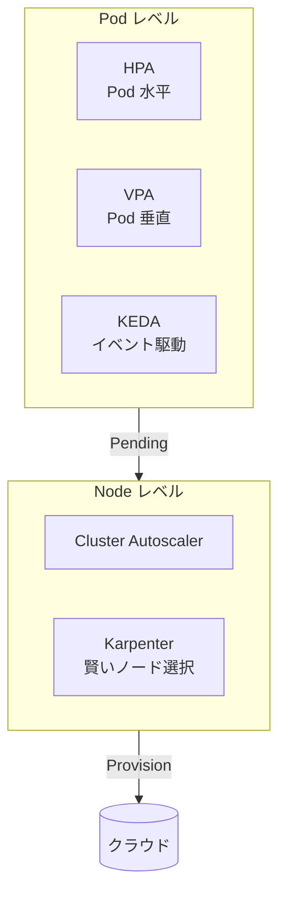

# コスト最適化
{: .no_toc }

## 目次
{: .no_toc .text-delta }

1. TOC
{:toc}

---

## このページのゴール

このページを読み終えると、以下を **自分の言葉で説明できる** ようになります。

- Kubernetes でコストが膨らむ **5 大要因**(過剰 requests / アイドル / 非効率スケール / オーバープロビジョン / ストレージ滞留)を挙げられる
- **FinOps** の基本概念(Inform / Optimize / Operate)を Kubernetes に適用できる
- **Right-sizing** の手法(VPA / Goldilocks / KRR)とそれぞれの違い
- **Bin-packing** とスケジューラ設定で詰め込み効率を上げる方法
- **HPA / VPA / Cluster Autoscaler / KEDA / Karpenter** の役割の違い
- **Spot / Preemptible** インスタンスの活用法と前提条件
- **OpenCost / Kubecost** によるコスト可視化の仕組み
- ローカル環境でも適用できる **コスト意識の付け方** と、クラウドに行った時のリターン
- サンプルアプリの requests/limits を実測ベースに最適化する実践

---

## 1. なぜコスト最適化が必要か

### 1.1 「Kubernetes はお金がかかる」現実

クラウドで Kubernetes を本格運用し始めた組織の **97%** が、最初の 1 年で「**予算超過**」を経験しているという調査結果が CNCF FinOps Foundation の 2024 年レポートにあります。
理由を端的にまとめると:

| 原因 | 何が起きるか |
|------|------------|
| 開発者が好きに `resources.requests` を書ける | 「とりあえず多めに」で過剰要求 |
| dev / stg 環境が 24h 動く | 夜間・週末も課金 |
| HPA が中途半端な閾値 | スケールアウトが効きすぎる / 効かない |
| Cluster Autoscaler が **減らさない** | スケールインしないノードが溜まる |
| PVC を消し忘れる | 削除した Pod の PVC が残って課金 |
| 監視 / ログが想定外に巨大 | Prometheus の retention、Loki のストレージ |

「**Kubernetes に乗せたら 3 倍になった**」というのは典型例です。多くの場合、原因は Kubernetes ではなく **利用者の設計** にあります。

### 1.2 オンプレでも効く

本書はローカル(VMware)環境で学習していますが、**コスト最適化の習慣はオンプレでも同様に効きます**。

オンプレで効く理由:

- ノード数 = ハードウェア投資 + 電力 + ラックスペース + 冷却
- ノード数を 30% 減らせれば、その分のサーバ調達を **5 年延ばせる**
- 運用人員の認知コストも減る

「クラウドだから無駄が見える、オンプレだから許される」は逆。**ハードウェアは見えづらいだけで、本質的に同じ無駄** です。

### 1.3 FinOps という枠組み

**FinOps**(Financial Operations、Cloud Financial Management の略)は、CNCF とは別の **FinOps Foundation** が策定する業界標準。

FinOps の 3 フェーズ:

| フェーズ | やること |
|---------|--------|
| **Inform** | コストを **可視化** する。誰が何にいくら使っているか、まず知る |
| **Optimize** | データに基づいて最適化する。Right-sizing、自動停止、Spot 活用 |
| **Operate** | 文化 / プロセスに組み込む。チームに権限と責任を渡す |

「Inform → Optimize → Operate」を回し続けるのが FinOps。本ページもこの順で説明します。



---

## 2. コスト膨張の 5 大要因(詳細)

### 2.1 過剰な resources.requests

最大の犯人。

- 開発者は「足りないと OOMKill されるから、念のため」と要求を盛る
- Pod の `requests` 合計 = ノードの allocatable に到達すると、CPU/memory に余裕があっても Pod がスケジュールされない
- 結果、**実際は 10% しか使ってないのにノードが満杯** → 新ノード追加

**実例**:

```yaml
# 開発者が書いた典型
resources:
  requests: {cpu: 1000m, memory: 1Gi}
  limits: {cpu: 2000m, memory: 2Gi}
```

実測すると平均 CPU 30m、メモリ 80Mi。**33 倍過剰**。

### 2.2 アイドルワークロード

- dev / stg 環境が 24 時間動く(実労働時間は 8 時間)
- 廃止予定のサービスが消されずに残る
- 「念のため」起動した検証 Pod
- 元従業員が立てたまま放置された namespace

**夜間と週末を停止するだけで、dev コストは 70% 減** が可能(168h → 50h)。

### 2.3 非効率なオートスケール

- HPA の閾値が低すぎ → 軽い負荷でもスケールアウト
- HPA の閾値が高すぎ → スパイクに追いつかず、結果的に limits を盛る → 2.1 へ
- Cluster Autoscaler の **scale-down 設定** がデフォルトのままで効かない

### 2.4 オーバープロビジョン(余裕枠の取りすぎ)

- 「障害時のフェイルオーバー先」として常時ノードを空けておく
- replicas=10 だが平均負荷は 2 で済む
- PodDisruptionBudget が過剰で、ノードを減らせない

### 2.5 ストレージ滞留

- 消した Pod の PVC が残る(reclaimPolicy=Retain だと自動削除されない)
- Prometheus の retention が 30 日のまま(本当は 7 日で十分)
- Loki のログが BackupRestore 用に何 TB も
- snapshot の世代管理がされず溜まり続ける



---

## 3. Inform ─ コストを可視化する

最初のステップ。「**何が高いか分からなければ何も減らせない**」。

### 3.1 OpenCost(CNCF Graduated)

Kubernetes ネイティブなコスト可視化 OSS。

- 公式: <https://www.opencost.io/>
- Prometheus メトリクスと連動して動作
- **クラウド請求書と突合** することで、Pod / Namespace / Label 単位の課金が見える
- **オンプレでも動く**(custom pricing で「もしクラウドなら月いくらか」を試算可能)

#### インストール

```bash
helm repo add opencost https://opencost.github.io/opencost-helm-chart
helm install opencost opencost/opencost \
  -n opencost --create-namespace \
  --set opencost.exporter.defaultClusterId=cluster-a
```

#### 何が見えるか

UI(`kubectl port-forward svc/opencost 9090`)で:

- **Cost by Namespace**: prod $1,234/月、stg $456/月、dev $789/月
- **Cost by Workload**: todo-api Deployment $123/月
- **Cost Efficiency**: requests に対して実測使用率 18%(つまり 82% を無駄に予約)
- **What-if 分析**: Spot に変えたら月いくら浮くか

#### CLI

```bash
kubectl cost namespace --window 7d
# +----------------+-------+-------+--------+
# | NAMESPACE      | CPU   | RAM   | TOTAL  |
# +----------------+-------+-------+--------+
# | prod           | $50   | $30   | $80    |
# | stg            | $20   | $15   | $35    |
# +----------------+-------+-------+--------+
```

### 3.2 Kubecost

OpenCost をベースにした **商用** 製品(無料枠あり)。

- マルチクラスタ統合表示
- 異常アラート(「先月比 30% 上昇」)
- 詳細なレポート / SSO / 監査
- Kubecost EE はサブスクリプション

「Inform は OSS で十分、運用としてレポート機能が欲しければ Kubecost」が定石。

### 3.3 Prometheus メトリクス直接

OpenCost を使わなくても、Prometheus に出ているメトリクスから直接計算もできます。

```promql
# 過去 24h の Namespace ごとの CPU 使用時間
sum by (namespace) (
  rate(container_cpu_usage_seconds_total[24h])
)
```

```promql
# Namespace ごとの requests 合計 vs 実使用率
sum by (namespace) (kube_pod_container_resource_requests{resource="cpu"})
/
sum by (namespace) (rate(container_cpu_usage_seconds_total[7d]))
```

「Efficiency = 実使用 / requests」が **20% 未満なら最適化余地大**、80% 超なら危険(スパイクに耐えられない)。

### 3.4 タグ / ラベル戦略

可視化が成り立つ前提として、**コスト配分用のラベル** を全リソースに付ける文化が必要。

```yaml
metadata:
  labels:
    app.kubernetes.io/name: todo-api
    app.kubernetes.io/part-of: todo
    cost-center: product-engineering      # ← コスト配分用
    environment: prod
    team: backend
    owner: alice
```

会計部門と合意した **コスト配分タグ** を、Admission Controller(Kyverno / OPA Gatekeeper)で強制すると統制が効きます。

---

## 4. Optimize: Right-sizing(requests を実測ベースに)

最大のリターン領域。

### 4.1 何をしたいか

- **CPU**: 実測の **p95** くらいを `requests` に
- **memory**: 実測の **max + 余裕 20%** を `requests = limits` に(memory は scale 不可)

これを **手作業でやるのは無理**。ツールに任せます。

### 4.2 VPA (Vertical Pod Autoscaler)

Kubernetes 標準寄りの公式アドオン(`kubernetes-sigs/autoscaler` 配下)。

VPA には 3 モード:

| モード | 動作 |
|--------|------|
| **Off / Recommender** | 推奨値を計算するだけ。Pod は変更しない |
| **Initial** | Pod 作成時のみ推奨値を適用 |
| **Auto / Recreate** | 推奨値が乖離したら Pod を再作成して適用 |

#### インストール

```bash
git clone https://github.com/kubernetes/autoscaler.git
cd autoscaler/vertical-pod-autoscaler
./hack/vpa-up.sh
```

#### VPA リソース

```yaml
apiVersion: autoscaling.k8s.io/v1
kind: VerticalPodAutoscaler
metadata:
  name: todo-api-vpa
  namespace: prod
spec:
  targetRef:
    apiVersion: apps/v1
    kind: Deployment
    name: todo-api
  updatePolicy:
    updateMode: "Off"            # まず Recommender だけで様子見
  resourcePolicy:
    containerPolicies:
    - containerName: '*'
      minAllowed: {cpu: 50m, memory: 64Mi}
      maxAllowed: {cpu: 4, memory: 4Gi}
      controlledResources: ["cpu", "memory"]
```

#### 推奨値の確認

```bash
$ kubectl describe vpa todo-api-vpa -n prod
...
Recommendation:
  Container Recommendations:
    Container Name: todo-api
    Lower Bound:
      Cpu: 30m
      Memory: 80Mi
    Target:
      Cpu: 70m
      Memory: 140Mi
    Upper Bound:
      Cpu: 200m
      Memory: 400Mi
```

- Target: 推奨値の中央
- Lower / Upper: 信頼区間

これを見て手動で `requests` を更新します。

### 4.3 Goldilocks(Fairwinds)─ VPA をレポート化

VPA は Recommender だけだと「推奨が見えにくい」。これを **Web UI で一覧表示** してくれる OSS が Goldilocks。

```bash
helm repo add fairwinds-stable https://charts.fairwinds.com/stable
helm install goldilocks fairwinds-stable/goldilocks -n goldilocks --create-namespace
```

```bash
# Goldilocks 対象にする Namespace に label
kubectl label namespace prod goldilocks.fairwinds.com/enabled=true
```

```bash
kubectl port-forward -n goldilocks svc/goldilocks-dashboard 8080:80
# ブラウザで http://localhost:8080
```

UI で各 Deployment について:

```
todo-api (prod)
  Container: todo-api
  Quality of Service: Burstable
  Current:
    Requests:  cpu: 200m, memory: 256Mi
    Limits:    cpu: 500m, memory: 512Mi
  Guaranteed Recommendation:
    Requests:  cpu: 70m,  memory: 140Mi
    Limits:    cpu: 70m,  memory: 140Mi
  Burstable Recommendation:
    Requests:  cpu: 50m,  memory: 100Mi
    Limits:    cpu: 200m, memory: 250Mi
```

「Burstable 推奨」を YAML にコピペすれば 60-80% のリソース削減が可能になります。

### 4.4 KRR(Robusta Kubernetes Resource Recommender)

VPA とは別系統のツール。Prometheus からデータを取得して計算するため、**VPA を入れなくても良い** のがメリット。

```bash
brew install robusta-dev/homebrew-krr/krr
krr simple --prometheus-url http://prometheus.monitoring:9090
```

```bash
# 出力(抜粋)
| Namespace | Pod         | Container | CPU req → rec    | Memory req → rec   | %保存 |
| prod      | todo-api    | todo-api  | 200m → 50m       | 256Mi → 100Mi      | 70%   |
| prod      | todo-frontend| nginx    | 100m → 10m       | 64Mi → 30Mi        | 80%   |
```

CLI で結果が出るので **CI 統合や定期レポート** に向きます。

### 4.5 ツール比較

| ツール | 計算方式 | UI | 自動適用 |
|--------|---------|-----|--------|
| VPA Recommender | API + ヒストリ | 無し | Auto モードで可 |
| Goldilocks | VPA を可視化 | Web UI | 無し |
| KRR | Prometheus メトリクス | CLI | 無し |

実運用では:

- **Goldilocks** で UI で確認
- **KRR** で CI レポート
- **VPA Auto** は本番では慎重に(Pod 再起動を伴うため)

### 4.6 Right-sizing の進め方



---

## 5. Optimize: Bin-packing(詰め込み効率)

requests が適正でも、**スケジューラの詰め込みが甘い** とノードが余ります。

### 5.1 bin-packing スコアラ(MostAllocated)

Kubernetes のスケジューラはデフォルトで「**Pod を均等にノードに分散**」(LeastAllocated)します。**コスト最適には逆**。

`MostAllocated` プロファイルに変えると、**詰めるだけ詰めて空ノードを増やす**(Cluster Autoscaler で消せる)動作になります。

```yaml
# kube-scheduler-config.yaml
apiVersion: kubescheduler.config.k8s.io/v1
kind: KubeSchedulerConfiguration
profiles:
- schedulerName: default-scheduler
  pluginConfig:
  - name: NodeResourcesFit
    args:
      scoringStrategy:
        type: MostAllocated
        resources:
        - name: cpu
          weight: 1
        - name: memory
          weight: 1
```

### 5.2 ノード規格を揃える

同じスペックのノードを並べると、bin-packing がしやすい:

- 16 CPU / 64GB のノード 5 台 vs 4/16, 8/32, 32/128 の混在
- 後者はパズルが難しく、無駄が増える

### 5.3 大きすぎる Pod を避ける

「1 つで 8 CPU + 32 GB」みたいな巨大 Pod は、bin-packing を著しく悪化させます。可能なら分割。

### 5.4 不要な Affinity を入れない

- 「とりあえず anti-affinity required」がノード分散を強制 → 余剰ノード
- 必要な分散は **TopologySpreadConstraints** で柔軟に

```yaml
topologySpreadConstraints:
- maxSkew: 1
  topologyKey: topology.kubernetes.io/zone
  whenUnsatisfiable: ScheduleAnyway       # required ではなく ScheduleAnyway
  labelSelector:
    matchLabels:
      app: todo-api
```

`whenUnsatisfiable: ScheduleAnyway` が重要。`DoNotSchedule` は「条件満たさないなら Pending」と同義で、コスト的に厳しい。

---

## 6. Optimize: オートスケーリング

### 6.1 HPA(Horizontal Pod Autoscaler)

Pod 数を増減。

```yaml
apiVersion: autoscaling/v2
kind: HorizontalPodAutoscaler
metadata:
  name: todo-api
  namespace: prod
spec:
  scaleTargetRef:
    apiVersion: apps/v1
    kind: Deployment
    name: todo-api
  minReplicas: 2
  maxReplicas: 20
  metrics:
  - type: Resource
    resource:
      name: cpu
      target:
        type: Utilization
        averageUtilization: 70
  behavior:
    scaleUp:
      stabilizationWindowSeconds: 30
      policies:
      - type: Percent
        value: 100         # 100% 増(2倍)
        periodSeconds: 30
    scaleDown:
      stabilizationWindowSeconds: 300
      policies:
      - type: Percent
        value: 50          # 50% 減
        periodSeconds: 60
```

注意点:

- `averageUtilization` は **requests に対する割合**。requests が過剰だと HPA が効きにくい
- まず Right-sizing → HPA の順
- `scaleDown.stabilizationWindowSeconds` を長めにしてフラッピング(振動)を防ぐ

### 6.2 KEDA(Kubernetes Event-Driven Autoscaling、CNCF Graduated)

HPA を **イベントソース** で駆動する仕組み。

- Kafka のラグ、SQS のメッセージ数、PostgreSQL のクエリ結果、Cron 等
- **Pod 数 0 にも下げられる**(HPA は 1 が下限)

```yaml
apiVersion: keda.sh/v1alpha1
kind: ScaledObject
metadata:
  name: todo-worker
  namespace: prod
spec:
  scaleTargetRef:
    name: todo-worker
  minReplicaCount: 0       # ← イベントなしなら 0 まで縮小
  maxReplicaCount: 30
  triggers:
  - type: redis
    metadata:
      address: redis.prod.svc:6379
      listName: todo-queue
      listLength: '10'
```

Redis のキュー長が増えたら Worker をスケールアウト、空なら 0 Pod。Spot 活用と組み合わせると効果倍増。

### 6.3 VPA + HPA 同時利用

- VPA は **CPU/memory based** だと HPA と競合する(同じシグナルで動作)
- 解決策: VPA は memory のみ、HPA は CPU のみ
- または VPA を Recommender モードに固定

### 6.4 Cluster Autoscaler

ノード数を増減。

- Pending Pod があれば → ノード追加
- ノードに Pod が乗ってない時間が一定超え → ノード削除

設定の落とし穴:

```yaml
# Cluster Autoscaler の Deployment 引数
- --scale-down-utilization-threshold=0.5      # 利用率 50% 未満なら削除候補
- --scale-down-delay-after-add=10m            # 追加後 10 分は削除しない
- --scale-down-unneeded-time=10m              # 10 分連続で不要なら削除
- --scale-down-unready-time=20m
```

デフォルトだと scale-down が控えめ。本気でコスト削減するならパラメータ調整必須。

### 6.5 Karpenter(AWS 発、Graduated 2024)

Cluster Autoscaler の上位互換的存在。

- **NodePool** でノードクラスを宣言、Pod 要件に最適なインスタンスタイプを自動選択
- 数十秒でノード起動(Cluster Autoscaler は数分)
- **Spot / On-Demand 混在を賢く扱える**
- AWS 用に作られたが Azure 版もあり、Cloud Provider 抽象化が進行中

```yaml
apiVersion: karpenter.sh/v1beta1
kind: NodePool
metadata:
  name: default
spec:
  template:
    spec:
      requirements:
      - key: karpenter.k8s.aws/instance-category
        operator: In
        values: [c, m, r]
      - key: karpenter.sh/capacity-type
        operator: In
        values: [spot, on-demand]
      - key: kubernetes.io/arch
        operator: In
        values: [amd64, arm64]
      nodeClassRef:
        name: default
  disruption:
    consolidationPolicy: WhenUnderutilized
    consolidateAfter: 30s
```

`consolidationPolicy: WhenUnderutilized` が秀逸で、**ノードの再配置で詰め込み直す** ことを自動でやってくれます。

### 6.6 オートスケーリング全体像



---

## 7. Optimize: アイドルワークロードの停止

### 7.1 kube-downscaler

Codecentric 製の OSS。指定時間外に Deployment / StatefulSet を **replicas=0** にする。

```bash
helm install downscaler hjacobs/kube-downscaler -n kube-system
```

Namespace に annotation:

```yaml
apiVersion: v1
kind: Namespace
metadata:
  name: dev
  annotations:
    downscaler/uptime: "Mon-Fri 09:00-19:00 Asia/Tokyo"
    downscaler/exclude: "false"
```

これで、`dev` Namespace のワークロードが **平日 9-19 時のみ稼働**、それ以外は 0 Pod。

#### 効果計算

- 24h × 7 = 168h
- 10h × 5 = 50h
- **70% 削減**

dev / stg にこれを入れるだけで、クラスタコストが顕著に下がります。

### 7.2 PR 環境の自動削除

ApplicationSet の PR ジェネレータと組み合わせて、PR がクローズされたら自動削除。

```yaml
generators:
- pullRequest:
    github: {...}
    requeueAfterSeconds: 1800
template:
  spec:
    syncPolicy:
      automated: {prune: true, selfHeal: true}
```

`prune: true` で、PR が閉じられたら関連 Application も削除されます。

### 7.3 ゾンビ Namespace の検出

```bash
# 30 日以上更新がない Namespace を抽出
kubectl get ns -o json | jq '.items[] | 
  select(.metadata.creationTimestamp | fromdate < (now - 86400 * 30)) | 
  .metadata.name'
```

定期的に列挙してオーナーに「これ要りますか?」を投げる運用が必要。

---

## 8. Optimize: Spot / Preemptible 活用(クラウド)

Spot インスタンスは **70% 程度の割引**(AWS、GCP、Azure とも)。

### 8.1 何が条件か

- Pod が **ステートレス**(state が消えても困らない)
- **再起動耐性** がある(数秒のダウン許容)
- **PodDisruptionBudget** が設定されている(最低 X 個は残す)
- **複数 Replicas** で動く
- **すぐ起動できる**(初期化に 10 分かかるアプリは不向き)

### 8.2 適性チェック表

| ワークロード | Spot OK? |
|------------|---------|
| Web API(replicas 多) | ◎ |
| バッチ Worker | ◎ |
| ML Training(checkpointing 必須) | △ |
| DB プライマリ | ✗ |
| etcd | ✗ |
| Ingress Controller(replicas 多なら OK) | ○ |

### 8.3 設定例(Karpenter + Spot)

```yaml
apiVersion: karpenter.sh/v1beta1
kind: NodePool
spec:
  template:
    spec:
      requirements:
      - key: karpenter.sh/capacity-type
        operator: In
        values: [spot]                    # Spot だけ
  limits:
    cpu: 1000                              # クラスタ全体の Spot CPU 上限
```

ステートフルなワークロードは別 NodePool で `on-demand` 専用に。

### 8.4 Spot 中断時のハンドリング

- AWS は **2 分前** に通知
- `aws-node-termination-handler` で受信して Pod を退避
- PodDisruptionBudget で連鎖中断を防ぐ

```yaml
apiVersion: policy/v1
kind: PodDisruptionBudget
metadata:
  name: todo-api-pdb
spec:
  minAvailable: 2
  selector:
    matchLabels:
      app: todo-api
```

---

## 9. ストレージ最適化

### 9.1 PVC のライフサイクル

`reclaimPolicy`:

- **Delete**: PVC 削除 → PV 削除 + 実体削除(クラウドだとボリューム削除)
- **Retain**: PVC 削除 → PV は `Released` 状態で残る、手動清掃が必要

クラウドで気をつけたいのは Retain で残った EBS / Disk が **永遠に課金される** こと。
本書の NFS-CSI 環境では Delete でも実体ファイルが残ることが多いので、定期清掃必要。

### 9.2 容量の見直し

```bash
# PVC 使用率
kubectl exec -n prod postgres-1 -- df -h /var/lib/postgresql/data
```

「100Gi 確保したが実際は 5Gi」みたいなのが頻発。**シュリンク不可** なので、最初から控えめにして必要なら拡張するのが定石。

### 9.3 Prometheus retention

```yaml
# prometheus-operator の Prometheus CR
spec:
  retention: 7d                          # デフォは 24h、伸ばしすぎ注意
  retentionSize: 50GiB
```

リテンションを伸ばすと、ストレージは線形に増えます。**7 日で十分**、それ以上は **Thanos / VictoriaMetrics で長期保存** に分離。

### 9.4 Loki ログ

ログ量は油断するとすぐ TB に到達。

- **Namespace ごとの retention** を分ける(prod: 30d、dev: 3d)
- **集約**(同一エラーをカウントだけにする)
- **重要ログ以外を sampling**

---

## 10. ローカル環境での演習

### 10.1 Goldilocks で TODO アプリの requests を見直す

```bash
helm repo add fairwinds-stable https://charts.fairwinds.com/stable
helm install goldilocks fairwinds-stable/goldilocks -n goldilocks --create-namespace

kubectl label namespace prod goldilocks.fairwinds.com/enabled=true

# 1-2 日待ってから
kubectl port-forward -n goldilocks svc/goldilocks-dashboard 8080:80
```

UI で「現在 vs 推奨」を確認、Burstable 推奨を YAML に反映。

### 10.2 KRR で CI レポート

```bash
brew install robusta-dev/homebrew-krr/krr
krr simple --prometheus-url http://prometheus.monitoring.svc:9090 \
  --formatter table > krr-report.txt
```

`krr-report.txt` を Pull Request にコミット → レビューで合意 → 適用。

### 10.3 OpenCost で「クラウドだったら月いくらか」

```bash
helm install opencost opencost/opencost \
  -n opencost --create-namespace \
  --set opencost.exporter.defaultClusterId=local-vmware
```

`opencost.exporter.cloudIntegrationSecret` で AWS / GCP の価格表を読ませると、「ローカルで動かしているこの構成、AWS なら月 $X」と試算してくれます。

### 10.4 kube-downscaler を dev に適用

```bash
helm install downscaler hjacobs/kube-downscaler -n kube-system

# dev Namespace に annotation
kubectl annotate ns dev downscaler/uptime="Mon-Fri 09:00-19:00 Asia/Tokyo"
```

夜 19 時に Pod が消え、朝 9 時に戻ることを確認。

### 10.5 HPA を入れて負荷テスト

```bash
# 軽い HPA を todo-api に
kubectl autoscale -n prod deploy todo-api --cpu-percent=70 --min=2 --max=10

# 負荷掛ける(別 Pod から)
kubectl run -n prod hey --rm -it --image=williamyeh/hey -- \
  -z 5m -c 50 http://todo-api:8080/items

# 経過観察
watch kubectl get hpa,pod -n prod
```

スケールアウトする様子と、負荷を止めた後にスケールインする様子を観察。

---

## 11. 組織にコスト文化を根付かせる(Operate)

ツールを入れるだけでは続きません。**文化** が必要。

### 11.1 ショーバック(Showback) vs チャージバック(Chargeback)

| 方式 | 説明 |
|------|------|
| **Showback** | 各チームに「今月いくら使ったか」を見せる。請求はしない |
| **Chargeback** | 実際に各チームの予算から差し引く |

最初は Showback で文化を作り、定着したら Chargeback、が定石。

### 11.2 月次レビュー

毎月、各チームと一緒に:

- OpenCost / Kubecost のレポートを見る
- 上位コスト Workload を 3 つピックアップ
- 各 1 件で「削減アクション」をコミット

これを 6 ヶ月続けると、**コストが 30-50% 下がる** ことが多いです。

### 11.3 開発者教育

「`requests` をなぜ盛りすぎてはいけないか」を、開発者全員が理解している組織は強い。

- Goldilocks の使い方を入社オリエンに含める
- PR のレビューで「requests 値の根拠」を確認するルール
- 「Right-sizing チャンピオン」をチームに 1 人

### 11.4 SLO ベースの判断

「**SLO を守るために必要な最小** リソース」を基準にする。

- p99 latency が SLO を満たすなら、それ以上はコストの無駄
- 「念のため」は禁句。データで判断

---

## 12. クラウドでの追加コスト最適化

ローカル環境では発生しないが、クラウドで効くもの:

### 12.1 NAT Gateway 料金

EKS / GKE で意外と効くのが NAT Gateway の通信料金($0.045/GB)。

- Pod が外部 API を大量に呼ぶと請求書が膨らむ
- VPC Endpoint で AWS サービスは直接接続
- 外部呼び出しはキャッシュで減らす

### 12.2 LoadBalancer の数

各 Service type=LoadBalancer = AWS NLB / GCP TCP LB = 月 $20+。
**Ingress 1 つに集約** すれば 1 つで済む。

### 12.3 リージョン間通信

- AZ 跨ぎは $0.01/GB
- リージョン跨ぎは $0.02-0.09/GB
- マルチクラスタを越境通信させる前に、本当に必要か考える

### 12.4 ARM(Graviton)の活用

AWS Graviton(arm64)は x86 比で **20-40% 安く、性能同等以上** のことが多い。
コンテナイメージのマルチアーキ対応が必要だが、ペイバック大。

---

## 13. トラブルシュート / よくある質問

### 13.1 VPA Auto モードで Pod が再起動しすぎる

`updatePolicy.updateMode: "Auto"` だと、推奨値が変わる度に Pod が再作成される。本番では `Off` または `Initial` を推奨。

### 13.2 HPA がスケールしない

```bash
kubectl describe hpa <name>
# Conditions の "ScalingActive" が False なら何かおかしい
```

よくある原因:

- metrics-server が動いてない
- Pod に `resources.requests.cpu` が無い(percentage計算不能)
- behavior の stabilization が長すぎ

### 13.3 Cluster Autoscaler がノードを消さない

```bash
kubectl logs -n kube-system deploy/cluster-autoscaler -f
```

よくある原因:

- ノードに **削除不可な Pod** がある(`kube-system` 系、PDB が緩い、`safe-to-evict: false` annotation)
- scale-down 閾値が厳しすぎ
- Pending Pod があって scale-up が優先

### 13.4 OOMKill が増えた(requests 削減後)

- memory は spike が出やすい。**過去 7 日の max** を見て決める
- limits=requests にして Guaranteed QoS にすると安心

---

## 14. ハンズオン演習

### 演習 1: 現状把握

OpenCost を入れて、Namespace ごとのコスト試算を出す。上位 3 つの Workload を特定。

### 演習 2: Right-sizing

Goldilocks を入れて、上位 Workload の推奨値を確認。1 件だけ Staging で適用し、1 週間運用観察。

### 演習 3: dev の夜間停止

kube-downscaler を入れて、dev Namespace を平日 9-19 時のみ稼働に。3 日連続で確認。

### 演習 4: HPA + 負荷テスト

todo-api に HPA を入れ、`hey` で負荷を掛けてスケールアウトとスケールインを観察。

### 演習 5: コストレポート

これらの結果から、「今後の月次コストレポートのテンプレ」を Markdown で書く(社内向け運用)。

---

## 15. 推奨学習リソース

- **FinOps Foundation**: <https://www.finops.org/>
- **OpenCost**: <https://www.opencost.io/docs/>
- **Kubecost**: <https://www.kubecost.com/>
- **VPA**: <https://github.com/kubernetes/autoscaler/tree/master/vertical-pod-autoscaler>
- **Goldilocks**: <https://goldilocks.docs.fairwinds.com/>
- **KRR**: <https://github.com/robusta-dev/krr>
- **Karpenter**: <https://karpenter.sh/>
- **KEDA**: <https://keda.sh/>
- **書籍**: "Cloud FinOps" (J.R. Storment & Mike Fuller、O'Reilly)
- **資格**: FinOps Certified Practitioner

---

## チェックポイント

ここまでで以下を **自分の言葉で** 説明できるか確認してください。

- [ ] Kubernetes コスト膨張の 5 大要因(過剰 requests / アイドル / 非効率スケール / オーバープロビジョン / ストレージ滞留)を挙げられる
- [ ] FinOps の 3 フェーズ(Inform / Optimize / Operate)を説明できる
- [ ] OpenCost と Kubecost の関係、それぞれの使い分けを語れる
- [ ] VPA / Goldilocks / KRR の違いを、計算方式と UI で説明できる
- [ ] HPA / VPA / Cluster Autoscaler / KEDA / Karpenter の役割の違いを区別できる
- [ ] bin-packing 改善のための設定(MostAllocated、ノード規格統一、TopologySpread)を挙げられる
- [ ] Spot インスタンスを使える / 使えないワークロードを判定できる
- [ ] PodDisruptionBudget の役割と、Spot との関係を説明できる
- [ ] kube-downscaler で dev/stg の夜間停止を構成できる
- [ ] サンプルアプリの requests を実測ベースに見直す手順を実行できる
- [ ] ショーバック / チャージバックの違いと、組織導入の順序

→ 次は [トラブルシューティング集]({{ '/12-advanced/troubleshooting/' | relative_url }})
