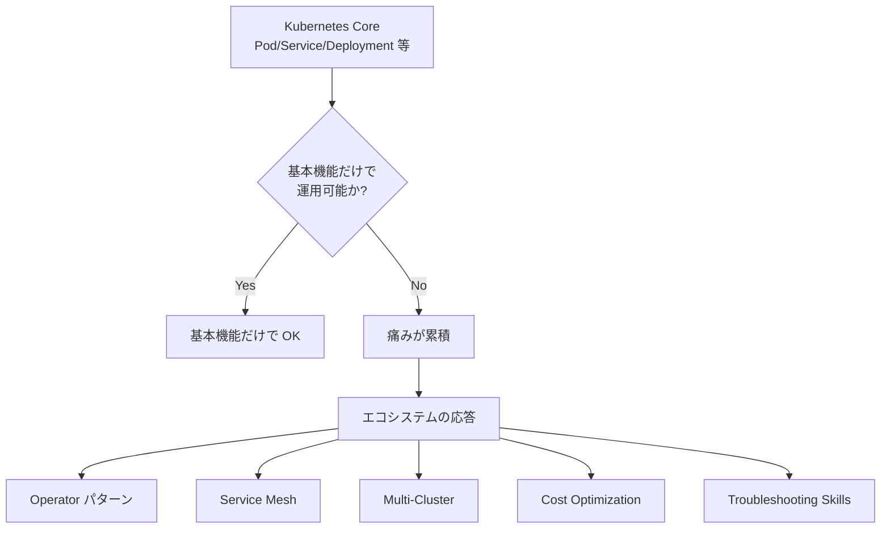
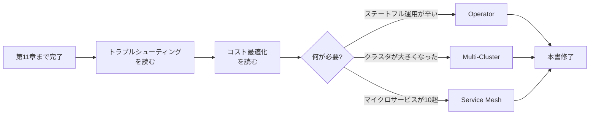
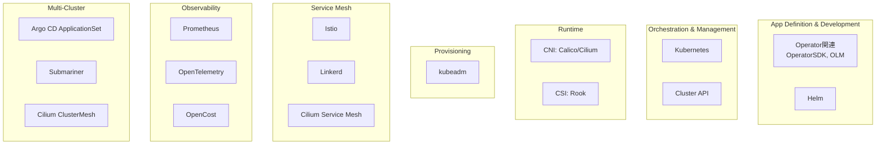
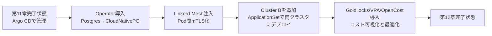
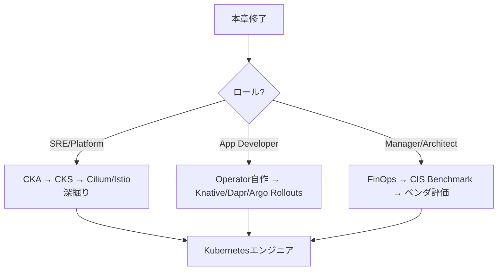

# 12. 発展トピック
{: .no_toc }

## 目次
{: .no_toc .text-delta }

1. TOC
{:toc}

---

## この章のゴール

この章を読み終えると、以下を **自分の言葉で説明できる** ようになります。

- 第1〜11章で築いた Kubernetes の基盤の **上に何を乗せていくか** のロードマップを描ける
- Operator / Service Mesh / マルチクラスタ / コスト最適化 / トラブルシューティングが、それぞれ **どんな現場課題に応える技術か** を説明できる
- それぞれの技術の **歴史的経緯**(なぜ生まれ、何を解決し、何を犠牲にしているか)を簡潔に語れる
- 自社・自プロジェクトに **どの発展トピックを、どの順番で導入すべきか** の判断軸を持てる
- 「Kubernetes を使う」と「Kubernetes を運用する」の違いを説明できる
- この章以降の学習で参照すべき **一次情報源**(KEP、CNCF Landscape、SIG)を挙げられる

---

## この章で扱うこと、扱わないこと

### 扱うこと

ここまでの章(第1〜11章)で、私たちは次のものを積み上げてきました。

- 第1章: Kubernetes の全体像と Minikube での最初の一歩
- 第2〜4章: Pod / Deployment / Service / Ingress / ConfigMap / Secret などの基本リソース
- 第5章: ストレージ(PV / PVC / StatefulSet)
- 第6章: スケジューリング(Taint / Toleration / Affinity / TopologySpreadConstraints)
- 第7章: kubeadm による HA クラスタ構築(本書のメイン環境)
- 第8章: ネットワーキング(CNI / NetworkPolicy / DNS)
- 第9章: 認証認可(RBAC / ServiceAccount / Admission Controller)
- 第10章: 観測性(Prometheus / Grafana / Loki / OpenTelemetry)
- 第11章: GitOps(Argo CD / Helm / Kustomize)

ここまで積み上げると、**ミニTODOサービスを本番に近い品質で安全に動かす** 最低限の力がつきます。
ですが現実の組織で Kubernetes を運用していくと、まだ足りない領域が見えてきます。

| 残された課題 | 解決する技術 | 本章での扱い |
|--------------|------------|--------------|
| ステートフル DB を自前で運用するのが辛い | **Operator パターン** | [Operator]({{ '/12-advanced/operator/' | relative_url }}) |
| マイクロサービスが増えてきて、通信の暗号化・可観測性・トラフィック制御を統一したい | **Service Mesh**(Istio / Linkerd / Cilium) | [Service Mesh]({{ '/12-advanced/service-mesh/' | relative_url }}) |
| クラスタを 1 つに集中させるとリスクが大きい / リージョン分散したい | **マルチクラスタ**(Argo CD ApplicationSet / Submariner / Cilium ClusterMesh / vCluster) | [マルチクラスタ]({{ '/12-advanced/multi-cluster/' | relative_url }}) |
| クラウドに上げたとき(あるいはオンプレでも)コストの可視化と削減が必要 | **FinOps / コスト最適化**(VPA / KRR / Karpenter / OpenCost) | [コスト最適化]({{ '/12-advanced/cost/' | relative_url }}) |
| 本番で発生する各種障害の、初動と切り分けを高速化したい | **トラブルシューティングの体系化** | [トラブルシューティング集]({{ '/12-advanced/troubleshooting/' | relative_url }}) |

これらは「Kubernetes を **使う** 段階」から「Kubernetes を **運用していく** 段階」への橋渡しになるトピック群です。

### 扱わないこと

逆に、本章で **深く扱わない** トピックも明示しておきます。これらは各々が本 1 冊分のテーマで、概念だけ紹介して深い学習は外部資料に譲ります。

- **クラウドマネージド固有の機能**(EKS / GKE / AKS の細かい運用、IAM 連携、マネージド DB との接続パターンなど)
  - 本教材はローカル完結が方針です。クラウドはあくまで「持っていったときに効く知識」として触れます。
- **エッジ Kubernetes / IoT**(K3s、KubeEdge、OpenYurt)
  - 一部触れるレベルにとどめます。
- **AI/ML プラットフォーム**(Kubeflow、KServe、Ray on K8s)
  - 別教材で扱うべき領域です。
- **Serverless on K8s**(Knative、OpenFaaS)
  - 概念は紹介しますが、ハンズオンはありません。
- **WebAssembly ワークロード**(Wasm Runtime、SpinKube)
  - 2024 年以降ホットな領域ですが、まだ動きが激しいので概観のみ。
- **CRI / CSI / CNI プラグインの自作**
  - 各プラグインの「使い方」は前章までで扱いました。自作までは含めません。

{: .note }
> 「扱わない」と書いたものも、章末で **推奨学習リソース** を必ず紹介します。
> 興味のある領域は GitHub の Awesome リストや CNCF Landscape から芋づる式に探してください。

---

## 「発展トピック」とは何か ─ 用語の位置づけ

「発展トピック(Advanced Topics)」という言葉は、書籍によって意味が違います。本章での定義をはっきりさせておきます。

### 定義

本教材における「発展トピック」とは、

> **Kubernetes の基本機能だけでは解決しきれない、あるいは解決できるが運用が辛い領域に対する、エコシステム側の応答**

を指します。すべての発展トピックには、以下の共通構造があります。



つまり「**Kubernetes 単体の使い方** から **Kubernetes を取り巻くエコシステムとの組み合わせ方** に視点が移る章」が本章です。

### 「Kubernetes を使う」と「運用する」の違い

ここで一度、「使う」と「運用する」の差を整理しておきます。

| 観点 | 使う(Day 1) | 運用する(Day 2) |
|------|-------------|----------------|
| 主な活動 | デプロイ・更新 | 障害対応・キャパシティ管理・コスト最適化 |
| 主役 | アプリ開発者 | SRE / プラットフォームエンジニア |
| 関心事 | 動くこと | 動き続けること、安く動くこと、すぐ直せること |
| 必要な能力 | YAML を書ける | クラスタの内部動作を把握できる |
| この本での章 | 第 1〜6 章 | 第 7〜12 章 |

第 12 章はその中でも **「Day 2 運用の山場」** にあたります。
ここを越えるかどうかで、Kubernetes 担当者と Kubernetes エンジニアの差が出ます。

### 「Day 0 / Day 1 / Day 2」という考え方

クラウドネイティブ界隈でよく使われる時系列の区切り方を補足します。元は航空業界から来た概念です。

| Day | 意味 | Kubernetes での例 |
|-----|------|-----------------|
| **Day 0** | 設計・選定段階 | どのディストリビューションを選ぶか、何ノードに何 CPU か、CNI は何か、認証バックエンドは何か |
| **Day 1** | 構築・初期導入 | kubeadm init、最初のアプリのデプロイ、ステークホルダー研修 |
| **Day 2** | 運用・改善 | 障害対応、バージョンアップ、セキュリティパッチ、コスト最適化、新規ワークロードの追加 |

Day 2 は **永遠に続く** という点が特徴です。本章の各トピックはすべて Day 2 を楽にするためのものだと考えてください。

---

## 学習順序の推奨

本章の 5 トピック(Operator / Service Mesh / マルチクラスタ / コスト / トラブルシューティング)は **互いに独立** しているので、興味の順で読んで構いません。ただし、現場での **導入優先度** にはおおむね定石があります。

### 推奨度: 高(早めに身につけたい)

1. **トラブルシューティング** ─ どの環境でも明日から必要。先に身につけるほど安心して他を学べる。
2. **コスト最適化** ─ クラウドに上げた瞬間に効く。オンプレでも「ノード数を 30% 減らせる」効果がある。

### 推奨度: 中(プロジェクトの規模が育ってきたら)

3. **Operator** ─ ステートフルなミドルウェア(DB、メッセージキューなど)を運用し始めたら必須に近い。
4. **マルチクラスタ** ─ 単一クラスタの限界(規模、可用性、テナント分離)が見えてきたら検討。

### 推奨度: 状況による

5. **Service Mesh** ─ マイクロサービスの数が **10 を超え**、サービス間通信のセキュリティ・観測性・カナリアリリースの必要性が **同時に** 出てきたら検討。それ未満なら Network Policy + アプリ側 mTLS で十分なケースが多い。



{: .tip }
> 本書のページの並び(nav_order)は「概念の理解しやすさ」で並べています(Operator → Service Mesh → マルチクラスタ → コスト → トラブルシューティング)。
> しかし **実務での着手順** は上の図のように、トラブルシューティングを最初にやるのが安全です。

---

## 各トピックの「ひと言サマリ」と「学び終わった後の景色」

各トピックを「これを学ぶと何ができるようになるか」で要約します。

### Operator (CRD + Controller パターン)

- **ひと言**: Kubernetes の制御ループを「アプリ固有の運用知識」で拡張する仕組み
- **生まれた経緯**: 2016 年、CoreOS の Brandon Phillips らが etcd / Prometheus の運用知識を Kubernetes に組み込みたかった。当時、StatefulSet だけでは複雑な DB のフェイルオーバーやバックアップを自動化できなかった
- **解決する痛み**: 「PostgreSQL のレプリケーション設定、フェイルオーバー、バックアップ、PITR、メジャーバージョンアップグレード」を手作業で運用する辛さ
- **代替手段**: 自前 Helm Chart + cron job、Ansible + cron、各 DB ベンダのマネージドサービス
- **学び終わった後**: CloudNativePG で PostgreSQL を「YAML 1 枚で 3 ノード HA + バックアップ + PITR」できる。さらに自社特有のワークロードを Operator 化する判断ができる

### Service Mesh

- **ひと言**: サービス間通信を Sidecar(あるいは eBPF)で「透過的に」制御・観測・暗号化する仕組み
- **生まれた経緯**: 2016 年に Buoyant が Linkerd 1.x を公開。2017 年に Google / IBM / Lyft (Envoy) が Istio を公開。きっかけは「マイクロサービス化が進んだ Twitter / Lyft / Netflix で、ライブラリ実装の mTLS / リトライ / サーキットブレーカが各言語で重複し、コードの保守が破綻したこと」(いわゆる Polyglot 問題)
- **解決する痛み**: 言語ごとに HTTP リトライ・mTLS・分散トレーシングを実装する重複コスト、L7 トラフィック分割のしんどさ、サービス間通信の暗号化漏れ
- **代替手段**: アプリ側ライブラリ(gRPC + go-resiliency、Resilience4j 等)、Ingress 単体、Network Policy + アプリ mTLS、API Gateway
- **学び終わった後**: Linkerd を入れて、サンプルアプリの Pod 間通信が mTLS 化されている状態と RPS / Success Rate / レイテンシが見える状態を作れる。さらに「うちの規模でメッシュを入れるべきか」を判断できる

### マルチクラスタ

- **ひと言**: クラスタを複数立ててデプロイ・運用する技術全般
- **生まれた経緯**: Kubernetes 自身は「単一クラスタ」を前提に設計されたが、2017 年頃から「単一クラスタの可用性上限」「ブラストラジウス(障害影響範囲)の縮小」「地域分散」「マルチテナント分離」のため複数クラスタ前提のツールが多数生まれた
- **解決する痛み**: 1 クラスタに全部詰めると障害影響範囲が大きい、リージョン分散したい、本番と非本番を完全に分離したい
- **代替手段**: Namespace 分離(同一クラスタ内テナント)、vCluster(クラスタ内仮想クラスタ)、Hierarchical Namespaces (HNC)
- **学び終わった後**: Argo CD ApplicationSet で 2 つのクラスタにまとめてデプロイする運用、Submariner / Cilium ClusterMesh でクラスタ越境通信を構成できる

### コスト最適化

- **ひと言**: 「過剰な resources.requests」と「アイドルワークロード」と「非効率なオートスケール」を撲滅する取り組み
- **生まれた経緯**: クラウドで Kubernetes を使い始めた組織が一様に「コスト爆発」を経験(2018-2020 年頃)。CNCF の FinOps Foundation が業界横断で枠組みを策定
- **解決する痛み**: クラウド請求書が想定の 3 倍来る、CPU 使用率 5% で動くノードが大量にある、夜間も dev 環境が動き続ける
- **代替手段**: 手動の resources チューニング、cron での dev/stg 停止、自前スクリプト
- **学び終わった後**: VPA / Goldilocks で requests を実測ベースに、kube-downscaler で夜間停止、OpenCost で「もしクラウドなら月いくら」を可視化できる

### トラブルシューティング

- **ひと言**: 症状から原因を逆引きするための、体系化された知識集
- **生まれた経緯**: 各社の SRE / プラットフォームチームが個別に書いていた Runbook(障害対応手順書)が、Kubernetes 普及とともに業界標準パターンに収斂してきた
- **解決する痛み**: 「Pending のまま動かない」と言われたときに、毎回ググるしんどさ。深夜の障害対応で迷子になる
- **代替手段**: GPT / Claude にエラーメッセージを貼って聞く(ただし原理がわかってないと外す)、ベンダのサポートに丸投げ
- **学び終わった後**: 主要症状(ImagePullBackOff / CrashLoopBackOff / Pending / Service 到達不能 / NotReady / OOMKill / etcd 遅延 / 証明書期限切れ等)について、迷わず初動を打てる

---

## CNCF Landscape の位置づけ

本章のトピックを **業界全体のマップ** の中で見ておきましょう。CNCF (Cloud Native Computing Foundation) は Kubernetes を含むクラウドネイティブ技術のホスト団体で、「Landscape」と呼ばれる業界マップを公開しています。

- 公式: <https://landscape.cncf.io/>(2026 年 5 月時点で 1,200+ プロジェクト掲載)
- Interactive 版で、各プロジェクトの GitHub Stars、Maturity Level、CNCF プロジェクト分類などが確認できます

CNCF プロジェクトには **3 段階の成熟度**(Maturity Level)があります。

| Level | 意味 | 例 |
|-------|------|----|
| **Graduated** | 卒業: 本番運用に十分な実績がある | Kubernetes、Prometheus、Envoy、Helm、containerd、Argo、Cilium、Linkerd、Istio、CloudNativePG(2024 年卒業)、OpenCost |
| **Incubating** | 育成中: 一定の採用実績がある | OpenTelemetry の一部、KEDA、Cert-Manager、Falco、Crossplane、kubevirt、Knative |
| **Sandbox** | 試験的: 早期段階、本番要注意 | OpenFunction、Kyverno-JSON、Headlamp、kube-burner 等 |

{: .note }
> 本章で扱うトピックは **すべて Graduated 級** のプロジェクトを中心に紹介します。
> 学習対象としても、初学者がまず触るべきは Graduated と Incubating です。
> 2024-2026 年は「Cilium」「Argo」「Linkerd」が運用現場でとくに勢いがあります。

### 本章トピックと CNCF カテゴリ

本章のトピックを CNCF Landscape カテゴリにマッピングすると以下になります。



---

## 第 12 章の前提知識・準備

### 必要な前提知識

第 11 章までの内容を「自分の言葉で説明できる」レベルで理解していること。とくに次の概念が即答できる必要があります。

- Pod / Deployment / StatefulSet の違い
- Service と Endpoints の関係
- PV / PVC / StorageClass の関係(動的プロビジョニング)
- ConfigMap / Secret と、それを Pod から使う 2 方式(volume / env)
- kubectl describe で Events を読む習慣
- Resource Requests / Limits の意味
- Namespace と RBAC の組み合わせ
- Helm / Kustomize / Argo CD の基本

不安があれば該当章に戻ってから本章へ進んでください。

### 必要な環境

本章のハンズオンは、第 7 章で構築した **VMware kubeadm HA クラスタ** で行います。

| ホスト名 | IP | 役割 |
|----------|-----|------|
| k8s-lb | 192.168.56.10 | HAProxy + keepalived + Docker Registry |
| k8s-cp1 | 192.168.56.11 | Control Plane HA #1 |
| k8s-cp2 | 192.168.56.12 | Control Plane HA #2 |
| k8s-cp3 | 192.168.56.13 | Control Plane HA #3 |
| k8s-w1 | 192.168.56.21 | Worker #1 |
| k8s-w2 | 192.168.56.22 | Worker #2 |
| k8s-w3 | 192.168.56.23 | Worker #3 |
| k8s-nfs | 192.168.56.30 | NFS サーバ |

- ネットワーク: VMware Host-only (VMnet1) 192.168.56.0/24
- OS: Ubuntu 22.04 LTS Server
- コンテナランタイム: containerd
- CNI: Calico(Service Mesh ページで Cilium 系を試す場合は別途構成説明あり)
- ストレージ: NFS-CSI(StorageClass=nfs)
- LoadBalancer: MetalLB(192.168.56.200-250 プール)
- Kubernetes バージョン: v1.30

マルチクラスタの章では追加で **クラスタ B** を立てます(同じく VMware 上、192.168.57.0/24)。
ホストの RAM 64GB 以上を推奨、128GB あれば 2 クラスタを同時起動できます。

### 動作確認コマンド

各ページのハンズオンに入る前に、以下が通ることを確認してください。

```bash
# 1. クラスタが応答する
kubectl get nodes
# 期待: 6台が Ready

# 2. サンプルアプリの Namespace と Pod
kubectl get pod -n prod
# 期待: todo-frontend, todo-api, postgres, redis, worker が Running

# 3. Argo CD が動いている
kubectl get pod -n argocd
# 期待: argocd-server, argocd-application-controller, argocd-repo-server 等が Running

# 4. Prometheus / Grafana が動いている
kubectl get pod -n monitoring
# 期待: prometheus-*, grafana-*, alertmanager-* 等

# 5. ストレージクラスが nfs (default)
kubectl get sc
# 期待: nfs が default(末尾に (default) が付いている)
```

{: .warning }
> 一つでも通らなければ該当章に戻って復旧してから進んでください。発展トピックは基盤の上に構築されるので、基盤がぐらつくとデバッグが二重に難しくなります。

---

## サンプルアプリの拡張シナリオ

本章ではサンプルアプリ「ミニ TODO サービス」に対して、以下の段階的な進化を施します。



各ページで、自分の手元のクラスタが上のどのフェーズにあるかを意識すると、全体の流れが把握しやすくなります。
すべてを完走しなくても、興味のあるトピックだけ取り組んで構いません。

### ベースラインのリソース使用状況(出発点)

第 11 章修了時点(本章開始時点)のサンプルアプリのリソース消費は、参考値として以下です。

| コンポーネント | Replicas | CPU req | Memory req | 実測 CPU 平均 | 実測 Memory 平均 |
|----------------|---------|--------|-----------|-------------|---------------|
| todo-frontend (Nginx) | 2 | 100m | 64Mi | 5m | 18Mi |
| todo-api (FastAPI) | 3 | 200m | 256Mi | 30m | 120Mi |
| postgres (StatefulSet, 1台) | 1 | 500m | 512Mi | 50m | 200Mi |
| redis (StatefulSet, 1台) | 1 | 100m | 128Mi | 10m | 40Mi |
| worker (CronJob) | n/a | 100m | 128Mi | 起動時のみ | 起動時のみ |

「**requests と実測の乖離が大きい**」のが分かりますね。これがコスト最適化の出発点になります。

---

## この章を読み終えた後に向かう先

本章修了後、興味とロールに応じて以下の方向に進めます。

### プラットフォームエンジニア(SRE / Cloud Engineer)を目指す場合

- **CKA (Certified Kubernetes Administrator)** 試験を受ける
  - 本書修了相当の知識で合格圏内に入ります
- **CKS (Certified Kubernetes Security Specialist)** 試験
  - 第9章を深掘り。Falco、Trivy、OPA Gatekeeper、Kyverno
- **CKAD (Certified Kubernetes Application Developer)** 試験
  - 開発者寄りの内容
- 深掘りすべき領域: **etcd の運用**、**Cilium の運用**、**Istio の運用**、**Crossplane や Cluster API による IaC 化**

### アプリケーション開発者の場合

- Operator 自作(kubebuilder / kopf)で自社特有の運用を自動化
- Knative / Dapr / Crossplane で「アプリケーションらしさを守った Kubernetes 利用」
- ArgoCD Rollouts や Flagger でカナリア / Blue-Green デプロイの実践
- gRPC + Service Mesh(Linkerd / Istio)でマイクロサービス設計

### マネジメント / アーキテクトの場合

- **FinOps Practitioner** 資格(FinOps Foundation)
- 組織への Kubernetes 導入計画策定(Day 0)
- マルチテナント設計、コンプライアンス、監査(CIS Kubernetes Benchmark)
- ベンダ評価(Red Hat OpenShift、Rancher、VMware Tanzu)



---

## 一次情報源(リファレンス)

本章および以降の学習で、**常に手元に置いておくべき** 一次情報源を一覧化します。

### 公式ドキュメント

- Kubernetes 公式: <https://kubernetes.io/docs/>
- KEPs (Kubernetes Enhancement Proposals): <https://github.com/kubernetes/enhancements>
  - 「次に何が来るか」「現状の機能はなぜそう設計されたか」がここにある
- API リファレンス: <https://kubernetes.io/docs/reference/kubernetes-api/>
- kubectl リファレンス: <https://kubernetes.io/docs/reference/kubectl/>

### SIG (Special Interest Group)

Kubernetes は SIG という分科会で開発されています。本章関連:

| SIG | 関心領域 |
|-----|---------|
| SIG Apps | Workload リソース(Deployment、StatefulSet 等) |
| SIG Architecture | API 設計の方針 |
| SIG API Machinery | CRD、Webhook、Controller の基盤 |
| SIG Cluster Lifecycle | kubeadm、Cluster API |
| SIG Network | Service、Ingress、Gateway API、Network Policy |
| SIG Node | kubelet、CRI、Pod ライフサイクル |
| SIG Scheduling | Scheduler、Topology Spread 等 |
| SIG Storage | PV、CSI |
| SIG Auth | RBAC、認証認可 |
| SIG Multicluster | マルチクラスタ |

各 SIG は **隔週でミーティング** を公開しています。録画が YouTube に残るので、興味ある SIG だけでもチェックすると最新動向が掴めます。

### 標準仕様

- **OCI (Open Container Initiative)**: <https://opencontainers.org/>
  - Image Spec / Runtime Spec / Distribution Spec
- **CRI (Container Runtime Interface)**: <https://github.com/kubernetes/cri-api>
- **CNI (Container Network Interface)**: <https://www.cni.dev/>
- **CSI (Container Storage Interface)**: <https://github.com/container-storage-interface/spec>
- **Gateway API**: <https://gateway-api.sigs.k8s.io/>
- **OpenTelemetry**: <https://opentelemetry.io/>

### 信頼できるニュースソース

- **Kubernetes Blog** 公式: <https://kubernetes.io/blog/>(主要バージョンリリース時の必読)
- **CNCF Blog**: <https://www.cncf.io/blog/>
- **Last Week in Kubernetes Development**: <https://lwkd.info/>
- **KubeWeekly** メールマガジン

### 書籍

- "Kubernetes Up & Running" (Hightower, Burns, Beda) ─ 基礎
- "Programming Kubernetes" (Hausenblas, Schimanski) ─ Operator 自作
- "Production Kubernetes" (Dotson, Lukša 監修) ─ 本番運用
- "Kubernetes in Action 2nd Edition" (Lukša) ─ 包括的な定番
- "The Kubernetes Book" (Poulton) ─ 軽い読み物として

### 動画

- KubeCon + CloudNativeCon の YouTube アーカイブ(年 2 回開催)
  - <https://www.youtube.com/@cncf>
- TGI Kubernetes(Joe Beda の伝説の解説シリーズ、古いが価値高)

{: .tip }
> 「公式ドキュメントを読む癖」をぜひ習慣化してください。
> Kubernetes は変化が早く、Stack Overflow の回答は 3 年で古くなります。
> KEP と公式ドキュメントを直接読めるスキルは、5 年スパンで効きます。

---

## この章での「学び方」のヒント

### ハンズオンは「壊して直す」までやる

各ページにハンズオンを用意していますが、教材通りに動かすだけでは身に付きません。**意図的に壊してみる** ことを推奨します。

例:

- Operator のページで、CNPG が立ち上がった Postgres の Pod を `kubectl delete pod` で落としてみる → Operator がどう復旧させるか観察
- Service Mesh のページで、Linkerd の Sidecar を `kubectl edit deployment` で剥がしてみる → トラフィックがどう変化するか
- マルチクラスタのページで、ApplicationSet の対象クラスタを 1 つ停止 → Argo CD の挙動を確認
- コストのページで、Goldilocks が推奨した値を半分にしてみる → OOMKill が出るか確認
- トラブルシューティングのページで、紹介された症状を 1 つ意図的に再現してみる

「動いている状態を作る」だけでなく、「**壊れた状態から復旧できるか**」が運用力を測る基準です。

### ノートを取る ── 自分専用 Runbook

各ハンズオンの結果は、自分用の Runbook(障害対応手順書)として書き留めておくと、将来同じ問題に遭遇したときに 3 倍速で解決できます。Markdown で十分です。

```markdown
# Postgres Pod 再起動時の挙動 (検証日: 2026-04-12)

## 状況
- CNPG で構築した postgres クラスタ(3 レプリカ)
- プライマリ Pod (postgres-1) を kubectl delete pod で削除

## 観察
- 6 秒で別 Pod (postgres-2) がプライマリに昇格
- 削除した postgres-1 は新規 Pod として起動、リードレプリカに復帰
- アプリ(todo-api)からの接続は 1 秒未満で復旧(コネクションプール再接続)

## 残課題
- フェイルオーバー時のクライアント側リトライ実装は要再確認
```

このノートを 1 年続けると、貴方は「**社内で頼られる Kubernetes 人材**」になっています。

### コミュニティに参加する

- **Kubernetes Slack**(<https://slack.k8s.io/>)
  - `#kubernetes-novice` で質問
  - `#sig-*` で SIG ごとの議論
- **Reddit**: r/kubernetes、r/devops
- **日本国内**: Kubernetes Meetup Tokyo、Cloud Native Days(Connpass)、JP-CSI / JP-CNI 系
- **CNCF Slack**(<https://slack.cncf.io/>)─ 各プロジェクトのチャンネル

質問するときは「**症状 + 実行コマンド + 出力 + 試したこと**」を必ずセットで。これは本章のトラブルシューティングの章でも繰り返し強調するスキルです。

---

## 章の進め方の例

最後に、本章を 4 週間で消化する例を示します(週 5 時間想定)。

| 週 | 内容 |
|----|------|
| 第 1 週 | トラブルシューティングをひと通り読む。自分の環境で 3 症状以上を意図的に再現してみる |
| 第 2 週 | Operator(CNPG 導入と Postgres リプレース)。サンプルアプリの DB を CNPG に切り替え |
| 第 3 週 | Service Mesh(Linkerd 導入とサンプルアプリへの注入)+ コスト最適化前半(Goldilocks) |
| 第 4 週 | マルチクラスタ(クラスタ B 立てて ApplicationSet 配布)+ コスト最適化後半(OpenCost) |

時間がない場合は、トラブルシューティング → コスト → (興味のある領域 1 つ)で 1 週間で要点だけ掴むことも可能です。

---

## チェックポイント

ここまでで以下を **自分の言葉で** 説明できるか確認してください。

- [ ] 本章で扱う 5 トピック(Operator / Service Mesh / マルチクラスタ / コスト / トラブルシューティング)を、それぞれ「ひと言で」説明できる
- [ ] 各トピックが **どんな現場の痛み** に応える技術かを説明できる
- [ ] 「Kubernetes を使う」と「運用する」の違いを Day 1 / Day 2 という用語で説明できる
- [ ] CNCF Maturity Level(Graduated / Incubating / Sandbox)の意味を説明できる
- [ ] 自分のロール(SRE / App Dev / Manager)から、次に学ぶべき方向性が言える
- [ ] 一次情報源(公式ドキュメント、KEP、SIG)の役割の違いを説明できる
- [ ] 本章のハンズオン環境(VMware kubeadm HA クラスタ)の前提構成を諳んじられる
- [ ] サンプルアプリの現状(requests と実測の乖離)を出発点として、何を改善していくかが見えている

→ 次は [Operator]({{ '/12-advanced/operator/' | relative_url }})
