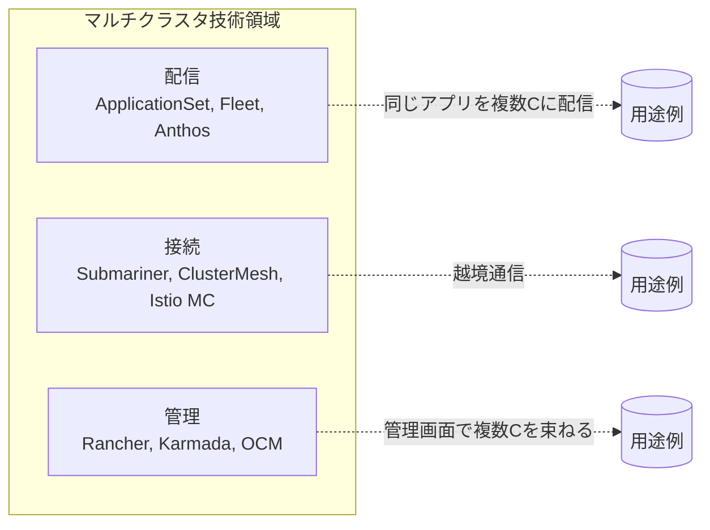
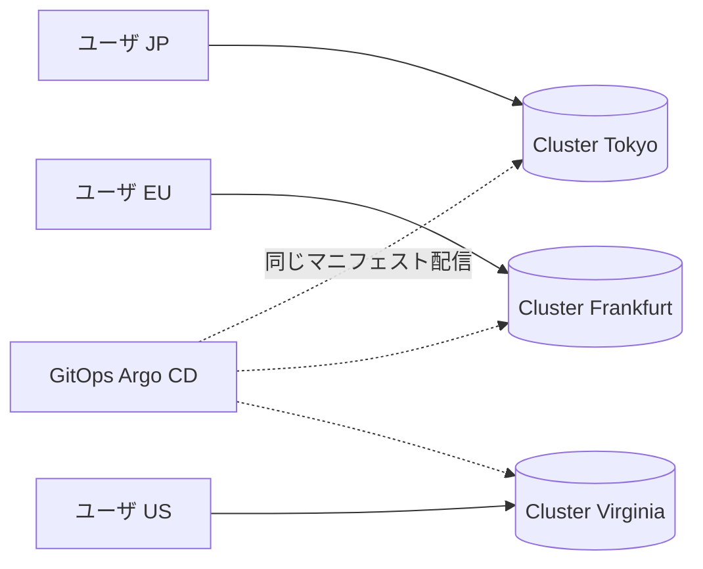
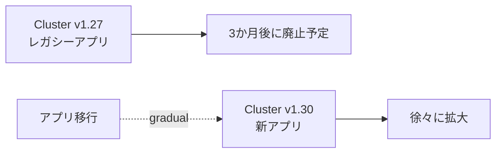
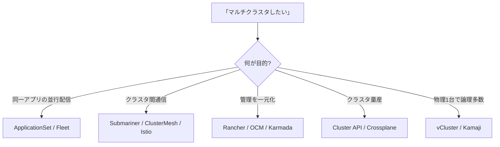
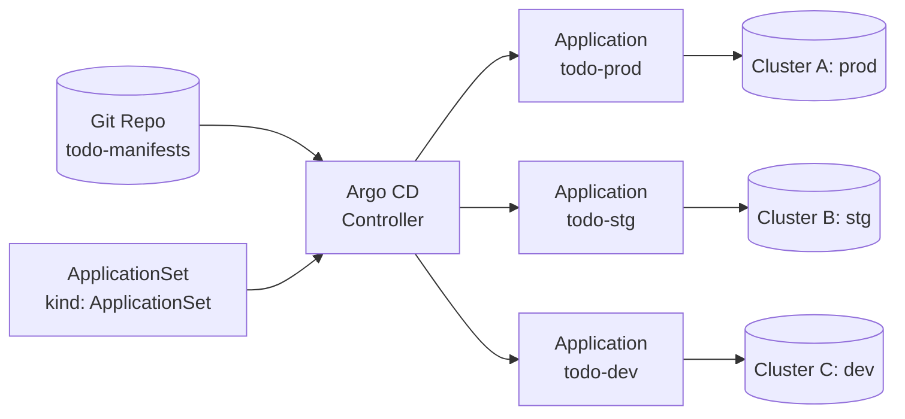
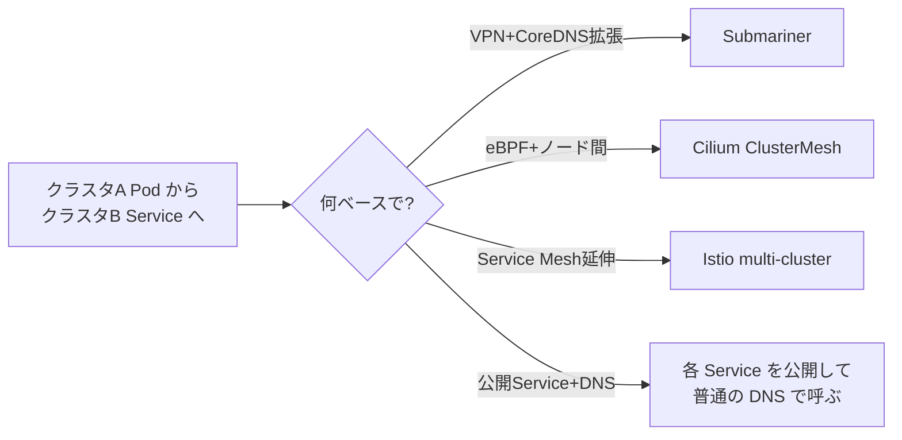
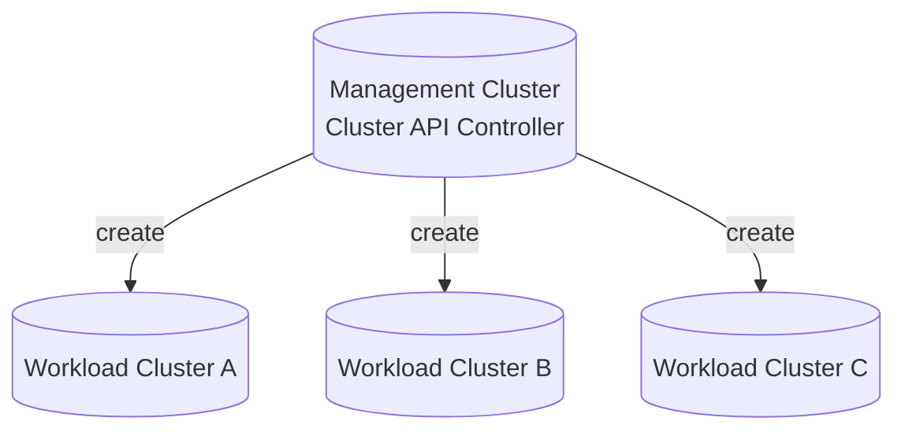
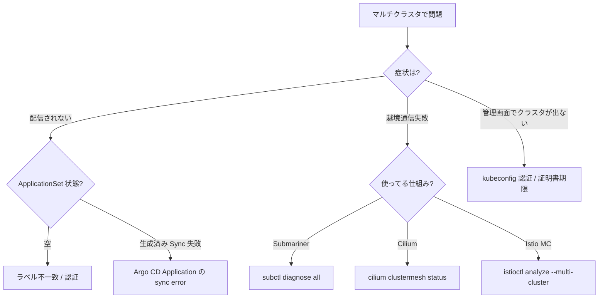

# マルチクラスタ
{: .no_toc }

## 目次
{: .no_toc .text-delta }

1. TOC
{:toc}

---

## このページのゴール

このページを読み終えると、以下を **自分の言葉で説明できる** ようになります。

- **マルチクラスタ** を構築する **5 つの動機**(障害分離 / 地理分散 / 環境分離 / マルチテナント / バージョン混在)を区別できる
- 単一クラスタの **スケール上限**(ノード 5,000、Pod 150,000、API レイテンシ等)と、なぜそれが上限になるかの根拠を語れる
- マルチクラスタの **構築パターン**(ApplicationSet による配信 / クラスタ間サービスディスカバリ / Federation / 仮想クラスタ)とそれぞれの解決領域
- Argo CD **ApplicationSet** で複数クラスタに同一マニフェストを配信する仕組み
- **Submariner / Cilium ClusterMesh / Istio multi-cluster** でクラスタ越境通信を実現する原理
- **vCluster / Kamaji** による「クラスタ内仮想クラスタ」のアプローチと、本物のマルチクラスタとの違い
- ローカル(VMware)で **2 クラスタ環境** を構築し、ApplicationSet で同時デプロイする実体験
- マルチクラスタの **複雑性コスト** と、入れる前に検討すべき代替手段(Namespace 分離 / HNC)

---

## 1. マルチクラスタとは ─ ひと言と全体像

### 1.1 ひと言

**マルチクラスタ (Multi-Cluster)** とは、

> **2 つ以上の Kubernetes クラスタを意図的に運用し**、それらを横断してアプリケーションをデプロイ・運用する技術領域全般

を指します。「クラスタ」が複数あるだけでは技術ではなく、それを **どう管理・連携させるか** がマルチクラスタの主題です。

マルチクラスタの 3 大要素:

1. **配信 (Distribution)**: 同じアプリを複数クラスタにどう届けるか
2. **接続 (Connectivity)**: クラスタを越えて Service / Pod を呼ぶ仕組み
3. **管理 (Governance)**: 複数クラスタを束ねた認可・監視・運用



### 1.2 「マルチクラスタ」とは違うもの

混同されやすい概念を整理します。

| 言葉 | 意味 | マルチクラスタとの違い |
|------|------|------------------|
| **マルチクラスタ** | 2 つ以上の Kubernetes クラスタ運用 | 本ページのテーマ |
| **マルチテナント** | 1 つのクラスタを複数チーム / 顧客で共有 | 1 クラスタの中の話。Namespace 分離 + RBAC で実現するのが基本 |
| **マルチクラウド** | AWS + GCP + Azure 等、複数クラウドベンダ利用 | クラスタ数とは無関係 |
| **ハイブリッドクラウド** | オンプレ + クラウド | クラスタ数とは無関係 |
| **クラスタフェデレーション** | 複数クラスタの API を 1 つに見せる | マルチクラスタの 1 実現方式 |
| **仮想クラスタ (vCluster)** | 1 つの物理クラスタの中に論理クラスタを作る | 「マルチクラスタ風」だが物理は 1 つ |

「**マルチテナント** か **マルチクラスタ** か」は最初の重要な分岐点です。Namespace 分離で十分なケースを誤ってクラスタ分離すると、運用負荷が無駄に増えます。

---

## 2. なぜマルチクラスタか ─ 5 つの動機

マルチクラスタが必要になる動機を、それぞれ「具体例 + 規模感」で説明します。

### 2.1 障害分離(ブラストラジウス縮小)

最大の動機。**1 つのクラスタに全てを集約するとリスクが大きい** ─ 例えば:

- Control Plane の etcd が壊れる → 全アプリが apply できなくなる
- CNI のバグで全 Pod 間通信が落ちる
- kubeadm upgrade で control plane が壊れる
- 誤って `kubectl delete namespace prod` を実行(よくある)

これらが起きたとき、**1 クラスタ運用なら全アプリ停止** です。
**「本番を 3 クラスタに分ける」「prod / staging を別クラスタにする」** といった分割で、ブラストラジウスが減ります。

### 2.2 地理分散(レイテンシと法令)

- ユーザが世界中にいる → リージョンごとにクラスタを配置(東京 / シンガポール / フランクフルト / バージニア)
- データ主権法令(EU GDPR、中国データ規制 等)→ 国境を越えないクラスタが必要
- エッジコンピューティング → 工場 / 店舗 / 基地局ごとにクラスタ(K3s や KubeEdge 想定)



### 2.3 環境分離(prod / staging / dev)

最も普及した動機。

- **prod**(本番): 高 SLO、慎重に運用
- **staging**(検証): 本番直前テスト
- **dev**(開発): 開発者自由
- **playground**(遊び場): 各人個別

「Namespace 分離でも十分では?」という議論はありますが、

- prod のリソース不足が dev に影響する
- dev で OPA ポリシー停止すると prod も停止
- 認証バックエンドが別(prod は SSO 必須、dev は自由)
- バージョンを別に上げたい(prod は枯れた版、dev は最新)

このあたりが効いてくると、**クラスタ分離が現実解** になります。

### 2.4 マルチテナント(顧客別クラスタ)

SaaS で「顧客ごとにクラスタを分ける」運用パターン。

- 強い分離が必要(顧客間で絶対漏洩しない)
- 顧客の規制要件(SOC2、HIPAA、ISO 27001)
- 顧客ごとの SLO 約束

ただしクラスタ数が爆発するため、Cluster API などで「**クラスタを Operator で量産**」する仕組みが必須。

### 2.5 バージョン違いの混在

- 古いアプリは Kubernetes 1.27 で動作確認済み、新アプリは 1.30 が必要
- ある依存ライブラリが kubelet バージョンに敏感
- アップグレード中(Blue-Green でクラスタ自体を入れ替え)



---

## 3. 単一クラスタの限界 ─ 数値の根拠

「**そもそも 1 クラスタの上限はどこか?**」を知っておくと、マルチクラスタが必要かの判断ができます。
公式に Kubernetes Scalability SIG が示している上限(v1.30 時点):

| メトリック | 上限 |
|-----------|------|
| ノード数 | **5,000** |
| Pod 数(クラスタ全体) | **150,000** |
| Pod 数(ノードあたり) | **110**(デフォルト) |
| コンテナ数(クラスタ全体) | **300,000** |
| Namespace 数 | 数万(実用上)|
| Service 数 | 数万(iptables モードで遅くなる、IPVS 推奨) |

実際には:

- etcd のサイズ上限 8GB(デフォルト)
- API Server の latency が増える
- Scheduler の判断が遅くなる
- DNS(CoreDNS)の負荷
- Network Policy 評価コスト

など、**「動くけど運用が辛い」** ラインがあります。**「数百ノード超えたら 2 クラスタに分ける」** が多くの組織の落とし所。

### よくある誤解: 「単一巨大クラスタで頑張る」

- ✗ 「クラスタは大きい方が効率がいいから 1 つに集約しよう」
- ○ 「ブラストラジウスとアップグレードのリスクを考えて、適切な単位で分ける」

クラウドベンダのマネージド K8s でも、**「リージョンあたり数千ノードのクラスタが上限」** とドキュメントされている例が多いです(EKS / GKE / AKS いずれも同様)。

---

## 4. マルチクラスタの構築パターン

ここから本題。**何をしたいか** で使う技術が決まります。

| やりたいこと | 使うツール |
|------------|----------|
| 同一マニフェストを複数クラスタへ配信したい | **Argo CD ApplicationSet** / Flux Multi-Cluster / Fleet |
| クラスタを跨ぐ Service ディスカバリしたい | **Submariner** / **Cilium ClusterMesh** / **Istio multi-cluster** |
| 複数クラスタの API を 1 つに見せたい | **Karmada** / KubeFed v2(停滞)/ Anthos |
| 複数クラスタの管理画面が欲しい | **Rancher** / Open Cluster Management (OCM) / Cluster API |
| クラスタ自体を Operator で量産したい | **Cluster API** / Crossplane + provider-kubernetes |
| 1 物理クラスタの中に論理クラスタを作りたい | **vCluster** / Kamaji |

それぞれを順に見ていきます。



---

## 5. Argo CD ApplicationSet ─ 配信パターン

最も普及している配信ツール。第 11 章で扱った Argo CD の上に乗ります。

### 5.1 何ができるか

- **1 つの YAML マニフェスト** を、複数クラスタ / 複数 Namespace に **テンプレ展開して同時デプロイ**
- 各クラスタごとに **値の上書き** が可能(env: prod の場合は replicas 多め、dev は少なめ等)
- クラスタを増やすと **自動的にそこにもデプロイされる**(ジェネレータが感知)

### 5.2 アーキテクチャ



ApplicationSet は **「Application を量産する仕掛け」** で、Application が各クラスタ宛になります。

### 5.3 ジェネレータ ─ 何で展開するか

ApplicationSet には複数の **ジェネレータ** があります。

| ジェネレータ | 何を元に展開するか |
|-------------|----------------|
| **List** | 静的なリスト(クラスタ名・URL を YAML に直書き) |
| **Cluster** | Argo CD に登録されたクラスタ一覧 |
| **Git (Directory)** | Git リポジトリ内のディレクトリ |
| **Git (File)** | Git リポジトリ内のファイル(JSON / YAML) |
| **Matrix** | 複数ジェネレータの組み合わせ(クラスタ × Namespace 等) |
| **Merge** | 複数ジェネレータをマージ |
| **SCM Provider** | GitHub / GitLab Org 配下の全リポジトリ |
| **Pull Request** | PR ごとに preview 環境を生成 |
| **Plugin** | 自前ジェネレータ |

### 5.4 ハンズオン: 2 クラスタへの配信

#### Step 1: クラスタの登録

クラスタ A(本書のメイン、`192.168.56.0/24`)に Argo CD があるとします。
ここにクラスタ B(`192.168.57.0/24`、後述)を **追加クラスタ** として登録します。

```bash
# Cluster B のコンテキストに切り替えて kubeconfig を確認
kubectl config get-contexts

# Argo CD CLI でクラスタ追加
argocd cluster add cluster-b-context

# ラベル追加
argocd cluster set https://192.168.57.10:6443 \
  --label env=stg \
  --label region=tokyo-2
```

#### Step 2: ApplicationSet を作成

```yaml
apiVersion: argoproj.io/v1alpha1
kind: ApplicationSet
metadata:
  name: todo-multi
  namespace: argocd
spec:
  goTemplate: true
  generators:
  - clusters:
      selector:
        matchLabels:
          purpose: app
  template:
    metadata:
      name: 'todo-{{.name}}'
      labels:
        app.kubernetes.io/part-of: todo
    spec:
      project: default
      source:
        repoURL: https://github.com/<USER>/todo-manifests
        targetRevision: main
        path: 'overlays/{{.metadata.labels.env}}'
      destination:
        server: '{{.server}}'
        namespace: prod
      syncPolicy:
        automated:
          prune: true
          selfHeal: true
        syncOptions:
        - CreateNamespace=true
        retry:
          limit: 5
          backoff:
            duration: 5s
            factor: 2
            maxDuration: 3m
```

主要フィールド解説:

| フィールド | 意味 |
|-----------|------|
| `goTemplate: true` | Go Template 構文を使う(新しめ) |
| `generators.clusters.selector` | 対象クラスタの絞り込みラベル |
| `template.metadata.name` | 生成される Application 名(クラスタ名を含める) |
| `template.spec.source.path` | クラスタごとに異なるオーバーレイディレクトリ |
| `syncPolicy.automated.prune` | Git から削除されたリソースを自動削除 |
| `syncPolicy.automated.selfHeal` | クラスタ側を手動変更しても自動的に Git の状態へ戻す |

#### Step 3: 動作確認

```bash
$ kubectl get application -n argocd
NAME                  SYNC STATUS   HEALTH STATUS
todo-cluster-a-prod   Synced        Healthy
todo-cluster-b-stg    Synced        Healthy
```

クラスタ A / クラスタ B の両方に、`overlays/prod` と `overlays/stg` がそれぞれデプロイされた状態になります。

#### Step 4: クラスタを増やす

ApplicationSet の魅力は **「ラベル付きクラスタを増やすと自動的にデプロイされる」** こと。

```bash
argocd cluster add cluster-c-context --label purpose=app --label env=dev
```

これだけで、`todo-cluster-c-dev` Application が **自動生成** され、デプロイされます。

### 5.5 オーバーレイ構造の例(Kustomize)

```
todo-manifests/
├── base/
│   ├── deployment.yaml
│   ├── service.yaml
│   ├── ingress.yaml
│   └── kustomization.yaml
└── overlays/
    ├── prod/
    │   ├── replica-patch.yaml      # replicas: 5
    │   ├── resources-patch.yaml    # cpu: 1, memory: 1Gi
    │   └── kustomization.yaml
    ├── stg/
    │   ├── replica-patch.yaml      # replicas: 2
    │   └── kustomization.yaml
    └── dev/
        ├── replica-patch.yaml      # replicas: 1
        └── kustomization.yaml
```

これにより「**1 つのコードベースで N 環境**」が実現します。

### 5.6 PR 環境(プレビュー環境)

ApplicationSet の **Pull Request ジェネレータ** で、PR ごとに環境を作る運用も可能です。

```yaml
generators:
- pullRequest:
    github:
      owner: example
      repo: todo-app
      labels: [preview]
template:
  metadata:
    name: 'todo-pr-{{number}}'
  spec:
    destination:
      namespace: 'pr-{{number}}'
    ...
```

これで PR #42 を出すと `pr-42` Namespace が生まれ、PR をマージ or クローズすると環境が消える、というクラウドネイティブな開発体験が実現します。

### 5.7 代替ツール

| ツール | 特徴 |
|--------|------|
| **Argo CD ApplicationSet** | 本書採用、Argo CD と統合 |
| **Flux Multi-Cluster** | Flux v2 で複数クラスタを束ねる |
| **Rancher Fleet** | Rancher 配下のクラスタにバンドル配信 |
| **Anthos Config Management** | Google の有償ソリューション |
| **Akuity Platform** | Argo の商用版、複数クラスタ管理が強い |

---

## 6. クラスタ間サービスディスカバリ ─ 接続パターン

「クラスタ A の Pod から **クラスタ B の Service** を呼びたい」場合の選択肢。

### 6.1 何が問題か

通常の Kubernetes Service は **クラスタ内でしか名前解決できない**(CoreDNS が単一クラスタ前提)。
- `todo-api.prod.svc.cluster.local` は **そのクラスタ内** でしか引けない
- Pod IP もクラスタごとに独立(同じ CIDR を使ってると IP 衝突)

これを越えるための仕組みが必要です。

### 6.2 選択肢の整理



### 6.3 Submariner

CNCF Sandbox プロジェクト(2024 年現在)。

- 各クラスタにエージェント (`subctl`) をインストール
- **Gateway Node** がクラスタ間 IPsec / Wireguard トンネルを張る
- **Lighthouse** という CoreDNS プラグインで `<service>.<ns>.svc.clusterset.local` 名で他クラスタの Service を解決
- **ServiceExport** CR で「この Service を他クラスタに見せる」と宣言

```yaml
apiVersion: multicluster.x-k8s.io/v1alpha1
kind: ServiceExport
metadata:
  name: todo-api
  namespace: prod
```

これで `todo-api.prod.svc.clusterset.local` がクラスタ間で解決可能になります。

#### アーキテクチャ

```mermaid
flowchart LR
    subgraph CA[Cluster A 192.168.56.0/24]
        podA[Pod] --> coredns_a[CoreDNS<br>+Lighthouse]
        gw_a[Submariner Gateway]
    end
    subgraph CB[Cluster B 192.168.57.0/24]
        podB[Pod] --> coredns_b[CoreDNS<br>+Lighthouse]
        gw_b[Submariner Gateway]
        svcB[(Service: todo-api)]
    end
    coredns_a -.解決.-> gw_a
    gw_a <-->|IPsec/Wireguard| gw_b
    podA -. todo-api.prod.svc.clusterset.local .-> svcB
```

### 6.4 Cilium ClusterMesh

CNI として Cilium を使っているクラスタ同士なら、これが最強。

- **eBPF レベルでクラスタ間ルーティング**
- `kubectl get globalsvc` のように Service が透過的に見える
- L4 / L7 ポリシーがクラスタ越えで効く

設定:

```bash
cilium clustermesh enable --context cluster-a
cilium clustermesh enable --context cluster-b
cilium clustermesh connect --context cluster-a --destination-context cluster-b
```

`Service` に annotation を 1 つ付けるだけで他クラスタに見せられます:

```yaml
metadata:
  annotations:
    service.cilium.io/global: "true"
```

すると `<service-name>.<ns>.svc.cluster.local` で **クラスタを越えて同じ名前で** アクセス可能(各クラスタの同名 Service に負荷分散)。

### 6.5 Istio multi-cluster

Service Mesh としての Istio を **複数クラスタにまたがって張る**。

3 つのトポロジ:

| トポロジ | 説明 |
|---------|------|
| **Primary-Remote** | 1 つの istiod が複数クラスタを管理 |
| **Multi-Primary** | 各クラスタに istiod、互いに証明書を共有 |
| **Replicated Control Planes** | 各クラスタが独立した Control Plane |

クラスタ越境通信は **East-West Gateway**(Istio が立てる Envoy)経由で行われます。Pod 同士が直接話すわけではなく、Gateway 経由なので **IP 重複も問題なし**。

選び方:

- 規模 / 数クラスタ → Primary-Remote
- 強い分離 → Multi-Primary

---

## 7. クラスタフェデレーション ─ API 統合

「**複数クラスタの API を 1 つに見せる**」アプローチ。

### 7.1 KubeFed v2(歴史的経緯)

2017〜2020 年、Kubernetes Federation v2 (KubeFed) という SIG プロジェクトがありました。

- `FederatedDeployment`、`FederatedService` のような **メタリソース** を作る
- それを KubeFed コントローラが各クラスタに展開

しかし、

- 設計の複雑さ
- ApplicationSet 等の GitOps 方式の方が現場で受けた
- メンテナが減少

で **停滞** しています。新規導入は推奨されません。

### 7.2 Karmada

KubeFed の精神的後継。CNCF Sandbox(2024 年)。

- 既存の Deployment / Service をそのまま受けつつ、`PropagationPolicy` で「どのクラスタに配るか」を制御
- `OverridePolicy` でクラスタごとに差分(レプリカ数 / イメージ等)を指定

```yaml
apiVersion: policy.karmada.io/v1alpha1
kind: PropagationPolicy
metadata:
  name: todo-prop
spec:
  resourceSelectors:
  - apiVersion: apps/v1
    kind: Deployment
    name: todo-api
  placement:
    clusterAffinity:
      clusterNames: [cluster-a, cluster-b]
    replicaScheduling:
      replicaSchedulingType: Divided
      replicaDivisionPreference: Weighted
      weightPreference:
        staticWeightList:
        - targetCluster: {clusterNames: [cluster-a]}
          weight: 2
        - targetCluster: {clusterNames: [cluster-b]}
          weight: 1
```

これで `todo-api` の replicas が **2:1 の比率で 2 クラスタに分割配置** されます。

Karmada は 2026 年現在も発展中で、本書では概念紹介のみ。

### 7.3 Open Cluster Management (OCM)

Red Hat / IBM が中心の CNCF Sandbox プロジェクト。

- ハブ&スポーク型(1 つのハブクラスタが管理)
- `ManifestWork` でアプリ配信、`Placement` でルール
- マルチクラスタ環境の **管理 / 観測 / セキュリティ** を統合

---

## 8. クラスタの量産 ─ Cluster API

「**クラスタ自体を Kubernetes リソースで宣言的に作る**」プロジェクト。SIG Cluster Lifecycle 配下。

### 8.1 何ができるか

`kind: Cluster` という CR を apply するだけで、新しい Kubernetes クラスタが立ち上がる。

```yaml
apiVersion: cluster.x-k8s.io/v1beta1
kind: Cluster
metadata:
  name: my-cluster
spec:
  clusterNetwork:
    pods: {cidrBlocks: [192.168.0.0/16]}
  controlPlaneRef:
    apiVersion: controlplane.cluster.x-k8s.io/v1beta1
    kind: KubeadmControlPlane
    name: my-cluster-control-plane
  infrastructureRef:
    apiVersion: infrastructure.cluster.x-k8s.io/v1beta1
    kind: AWSCluster        # or VSphereCluster, OpenStackCluster 等
    name: my-cluster
```

### 8.2 主要 Provider

| Provider | 対象 |
|----------|------|
| CAPA | AWS |
| CAPG | GCP |
| CAPZ | Azure |
| **CAPV** | **vSphere(VMware)** ← 本書環境にも適用可 |
| CAPO | OpenStack |
| CAPD | Docker(テスト用) |
| CAPM3 | Metal3(ベアメタル) |

VMware Workstation 自体には対応してませんが、vCenter / vSphere 環境がある会社では **本番運用** で使われます。

### 8.3 ハブ&マネジメントクラスタ

Cluster API は **1 つの「管理クラスタ」が複数の「ワークロードクラスタ」を作る** モデル。



数十〜数百クラスタを束ねるなら必須。

---

## 9. 仮想クラスタ ─ vCluster / Kamaji

「**1 つの物理クラスタの中に、論理的なクラスタを複数作る**」アプローチ。

### 9.1 vCluster

Loft Labs 製。

- 親クラスタの 1 Namespace に **k3s(軽量 K8s)を 1 Pod として** 起動
- ユーザはその k3s に kubeconfig 経由でアクセス
- 「自分専用クラスタ」を持てる(CRD インストール、cluster-admin 等の高権限)が、実体は親クラスタの Namespace に過ぎない

```bash
vcluster create my-vc -n team-a
kubectl get pods -n team-a
# vcluster-0          1/1     Running
```

```bash
vcluster connect my-vc
kubectl get nodes     # 仮想 Node が見える
kubectl apply -f my-crd.yaml    # CRD も親に影響せず作れる
```

### 9.2 メリット

- **コスト効率**: ノードを共有
- **隔離レベル中程度**: Namespace 単体より強い、本物のクラスタより弱い
- **開発者ごとのクラスタ** 配布が容易
- **CRD コンフリクト回避**: 各 vcluster で独自 CRD 可

### 9.3 デメリット

- **完全な分離ではない**: 親の Pod CIDR を共有、etcd は共有(または k3s が SQLite で持つ)
- **本物のフェイルオーバーは不能**: 親クラスタが落ちれば全 vcluster 死ぬ
- **「本物のマルチクラスタ」のスケール耐性は無い**

### 9.4 Kamaji

CLASTIX 製。**Control Plane だけを Pod として動かす** モデル。

- ワーカーノードは本物の VM や物理サーバ
- Control Plane は管理クラスタ上の Pod
- 数百のテナントクラスタを **管理クラスタ 1 つで** さばける

mid-size SaaS のテナント管理向け。

---

## 10. ローカル(VMware)で 2 クラスタを立てる

ここから実演習。

### 10.1 構成

本書のメインクラスタは `192.168.56.0/24`(クラスタ A)。
追加で `192.168.57.0/24`(クラスタ B)を立てます。

| ホスト | IP | 役割 |
|--------|----|------|
| **クラスタ A**(既存)| | |
| k8s-lb | 192.168.56.10 | HAProxy + keepalived + Registry |
| k8s-cp1〜3 | 192.168.56.11-13 | Control Plane HA × 3 |
| k8s-w1〜3 | 192.168.56.21-23 | Worker × 3 |
| **クラスタ B**(新規)| | |
| k8s-b-lb | 192.168.57.10 | HAProxy |
| k8s-b-cp1〜2 | 192.168.57.11-12 | Control Plane × 2(節約)|
| k8s-b-w1〜2 | 192.168.57.21-22 | Worker × 2 |

リソース見積もり:

```
クラスタ A: 7 台 × 4GB = 28GB
クラスタ B: 5 台 × 4GB = 20GB
合計: 48GB(ホスト 64GB 推奨、128GB あれば余裕)
```

### 10.2 ネットワーク設定

VMware Workstation で **Host-only ネットワーク** を追加(VMnet2)し、`192.168.57.0/24` を割り当て。
クラスタ A の VMnet1 (`192.168.56.0/24`) との **ルーティング** を Host で有効化します(Linux ホストなら `sysctl net.ipv4.ip_forward=1`)。

### 10.3 クラスタ B 構築

クラスタ A と同様の手順(第 7 章)で、クラスタ B を構築します。要点だけ:

```bash
# k8s-b-cp1 で kubeadm init
sudo kubeadm init \
  --control-plane-endpoint=192.168.57.10:6443 \
  --upload-certs \
  --pod-network-cidr=10.245.0.0/16        # ← Aと違うCIDR
  --service-cidr=10.97.0.0/12             # ← Aと違うCIDR
```

{: .important }
> **重要**: クラスタ A と B で **Pod / Service CIDR を必ず分ける**。同じだとクラスタ間通信で IP 衝突します。

CNI(Calico)、ストレージ(NFS-CSI)、MetalLB は同様にインストール。
ただし MetalLB の IP プールは別範囲(例: `192.168.57.200-250`)。

### 10.4 kubeconfig の統合

```bash
# クラスタ B の kubeconfig を取得
ssh k8s-b-cp1 sudo cat /etc/kubernetes/admin.conf > ~/.kube/config-cluster-b

# マージ
export KUBECONFIG=~/.kube/config:~/.kube/config-cluster-b
kubectl config view --merge --flatten > ~/.kube/config-merged
mv ~/.kube/config-merged ~/.kube/config

# コンテキスト一覧
kubectl config get-contexts
# CURRENT   NAME                       CLUSTER       NAMESPACE
# *         kubernetes-admin@cluster-a cluster-a
#           kubernetes-admin@cluster-b cluster-b
```

### 10.5 kubectx / kubens で切り替え

```bash
sudo apt install -y kubectx
kubectx                          # 一覧表示
kubectx cluster-b                # 切り替え
kubens prod                      # Namespace 切り替え
```

`kubectl --context=cluster-b` を毎回打つより楽。

### 10.6 Argo CD にクラスタ B を登録

```bash
# クラスタ A 側の Argo CD にログイン
argocd login argocd.example.com

# クラスタ B を追加(クラスタ B のコンテキスト名を指定)
argocd cluster add kubernetes-admin@cluster-b \
  --label env=stg \
  --label purpose=app \
  --label region=tokyo-2
```

これで ApplicationSet が両クラスタを認識します。

### 10.7 ApplicationSet で同時デプロイ

5.4 で示した ApplicationSet YAML を apply するだけで、サンプル TODO アプリが **両クラスタにデプロイ** されます。

```bash
kubectl apply -f todo-applicationset.yaml -n argocd
kubectl get application -n argocd
# todo-cluster-a-prod   Synced   Healthy
# todo-cluster-b-stg    Synced   Healthy
```

---

## 11. 管理画面 ─ Rancher / Headlamp / Lens

複数クラスタを毎日触るなら、UI ツールを 1 つ用意しておくと便利です。

### 11.1 Rancher

SUSE 製。複数クラスタの管理画面 + 認証統合 + 監視。

```bash
# Rancher を 1 つの「管理クラスタ」に Helm でインストール
helm install rancher rancher-stable/rancher \
  --namespace cattle-system \
  --create-namespace \
  --set hostname=rancher.example.com
```

ブラウザでログインして、クラスタ A / B / C を登録すると、1 画面で:

- Pod のリスト
- Logs / Exec
- YAML 編集
- 監視グラフ
- ユーザ管理(LDAP / SSO 統合)

を扱えます。

### 11.2 Headlamp(CNCF Sandbox)

「**軽量で OSS な代替 Rancher**」。デスクトップアプリ / Web 両方で使えます。
複数 kubeconfig を読み込み、画面上部のドロップダウンで切り替え。

### 11.3 Lens

商用(無料プランあり)。エンジニア向け IDE 風 UI。

### 11.4 比較

| ツール | 規模 | 特徴 |
|--------|------|------|
| Rancher | 大規模(エンタープライズ)| 認証統合、運用機能フル |
| Headlamp | 小〜中規模 | 軽量、OSS、シンプル |
| Lens | 個人〜中規模 | IDE 風、開発者向け |
| Argo CD UI | 大規模 | GitOps 専用、アプリ視点 |
| k9s | 個人 | TUI、ターミナル派 |

---

## 12. マルチクラスタの落とし穴

### 12.1 「クラスタを分けたのに依存関係が増える」

たとえば prod / stg を別クラスタにしたが、stg から prod の DB を呼ぶ依存ができてしまう ── というケース。これでは分けた意味がない。

対策: **分けるなら徹底的に分ける**。データのコピー戦略、相互呼び出し禁止のルール化。

### 12.2 「kubectl が遅い」

複数 kubeconfig をマージすると、context 切替で混乱。誤って `prod` 環境で `delete` を打つ事故も。

対策:

- `kubectx` で context を視覚的に管理
- `kube-ps1` でプロンプトに現 context を表示
- 危険操作には `--context` を明示

### 12.3 「Argo CD の Application が爆発する」

ApplicationSet で 100 個のアプリ × 5 クラスタ = 500 Application、UI が遅い。

対策:

- Argo CD を **複数インスタンス** に分散(prod / stg で別 Argo CD)
- Sharding 機能を使う(2.10+)
- Application の selector を細かくする

### 12.4 「証明書管理が二重」

各クラスタに cert-manager、各クラスタ独立した CA。これだと監査と運用が辛い。

対策:

- 中央 CA を立てて、各クラスタの cert-manager の `ClusterIssuer` をそこに向ける
- HashiCorp Vault を使う

### 12.5 「ネットワークコストが増える」

クラウドでは **クラスタ間通信 = リージョン間通信** で 4-5 倍のコスト。

対策:

- 越境通信を **設計時に最小化**
- 同一リージョン内の AZ 分散にとどめる

### 12.6 「Operator がクラスタごとに動く」

CNPG や cert-manager を **各クラスタに別個に** インストールするのは正しいが、設定ドリフトが起きやすい。

対策:

- 各クラスタの Operator 設定も **Git で管理**(ApplicationSet で配布)
- バージョンを揃える運用ルール

---

## 13. トラブルシュート

### 13.1 ApplicationSet が生成されない

```bash
# ApplicationSet の status を見る
kubectl describe applicationset -n argocd todo-multi

# Argo CD applicationset-controller のログ
kubectl logs -n argocd deploy/argocd-applicationset-controller
```

よくある原因:

- ジェネレータが空(クラスタラベル不一致)
- テンプレート構文ミス
- 認証エラー(Git の credentials)

### 13.2 クラスタ間通信が失敗

```bash
# Submariner の場合
subctl show all
subctl diagnose all

# Cilium ClusterMesh
cilium clustermesh status
cilium connectivity test --multi-cluster cluster-b
```

### 13.3 調査フロー



---

## 14. ハンズオン演習

### 演習 1: 2 クラスタへの ApplicationSet 配信

クラスタ B を構築 → Argo CD に登録 → ApplicationSet で TODO アプリを両クラスタにデプロイ。
クラスタ A は replicas=3、クラスタ B は replicas=1 になるよう Kustomize オーバーレイを書く。

### 演習 2: PR 環境

GitHub の PR で `preview` ラベルを付けると、自動的にクラスタ A の `pr-<num>` Namespace にデプロイされる構成を組む。

### 演習 3: クラスタ間 Service 呼び出し(Submariner)

Submariner を 2 クラスタにインストール → クラスタ A から `todo-api.prod.svc.clusterset.local` でクラスタ B の Service を呼べることを確認。

### 演習 4: vCluster で開発者用クラスタ

`vcluster create dev-alice -n alice-dev` で Alice 専用クラスタを作り、Alice には kubeconfig だけ渡す。Alice が CRD を入れたり cluster-admin 操作しても、親クラスタには影響しないことを確認。

### 演習 5: 緊急時のクラスタ切り替え

クラスタ A の Ingress LoadBalancer を「重み 0」にして、すべてのトラフィックをクラスタ B に逃がす(DNS or 外部 LB レベルで)。10 分で完了させる手順を Runbook 化。

---

## 15. 推奨学習リソース

- **Argo CD ApplicationSet 公式**: <https://argo-cd.readthedocs.io/en/stable/operator-manual/applicationset/>
- **Submariner 公式**: <https://submariner.io/>
- **Cilium ClusterMesh**: <https://docs.cilium.io/en/stable/network/clustermesh/>
- **Istio Multi-Cluster**: <https://istio.io/latest/docs/setup/install/multicluster/>
- **Cluster API**: <https://cluster-api.sigs.k8s.io/>
- **Karmada**: <https://karmada.io/>
- **vCluster**: <https://www.vcluster.com/>
- **SIG Multicluster**: <https://github.com/kubernetes-sigs/about-sig-multicluster>
- **書籍**: "Kubernetes Multi-Cluster Strategy" (community ebook、無料 PDF あり)

---

## チェックポイント

ここまでで以下を **自分の言葉で** 説明できるか確認してください。

- [ ] マルチクラスタの 5 つの動機(障害分離 / 地理分散 / 環境分離 / マルチテナント / バージョン混在)を区別できる
- [ ] 単一クラスタの公式上限(ノード 5000、Pod 150000)と、なぜ実用上はもっと小さい単位で分けるかの理由
- [ ] マルチクラスタ・マルチテナント・マルチクラウド・仮想クラスタの違い
- [ ] ApplicationSet のジェネレータ(Cluster / Git / Matrix / Pull Request)を、用途別に挙げられる
- [ ] クラスタ間サービスディスカバリの 3 つの選択肢(Submariner / Cilium ClusterMesh / Istio MC)の違い
- [ ] vCluster と本物のマルチクラスタの違い、それぞれが適する場面
- [ ] Cluster API でクラスタを「リソース化」する意味
- [ ] 2 つの kubeconfig をマージして kubectx で切り替える運用フロー
- [ ] マルチクラスタの落とし穴(依存関係、操作ミス、Application 爆発、ネットワークコスト)
- [ ] 自プロジェクトで「クラスタを分けるべきか、Namespace で十分か」を判断する基準

→ 次は [コスト最適化]({{ '/12-advanced/cost/' | relative_url }})
