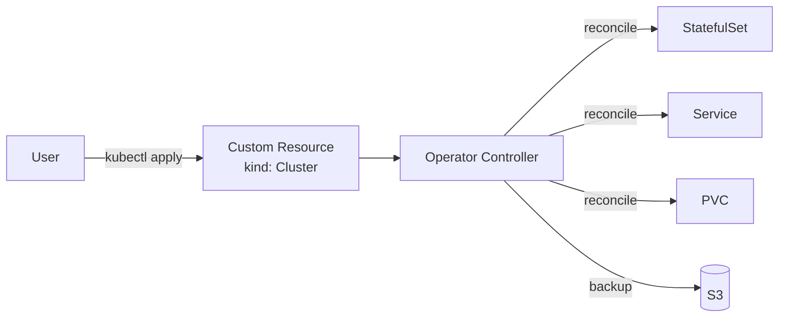

# Operator
{: .no_toc }

## 目次
{: .no_toc .text-delta }

1. TOC
{:toc}

---

**Operator パターン** は、Kubernetes の制御ループを **アプリ固有の運用知識でカスタマイズ** する仕組み。
Custom Resource Definition (CRD) + Controller の組み合わせ。

## なぜ Operator か

DB を K8s で運用するには:

- レプリケーション設定
- フェイルオーバー
- バックアップ
- バージョンアップ

の自動化が必要で、これらを **アプリ固有のロジック** で実装したのが Operator。



## CloudNativePG (PostgreSQL Operator) を試す

サンプルアプリの Postgres を CloudNativePG (CNPG) Operator に置き換えてみます。

```bash
kubectl apply --server-side -f \
  https://raw.githubusercontent.com/cloudnative-pg/cloudnative-pg/release-1.23/releases/cnpg-1.23.1.yaml
```

```yaml
apiVersion: postgresql.cnpg.io/v1
kind: Cluster
metadata:
  name: postgres
  namespace: prod
spec:
  instances: 3
  storage:
    size: 5Gi
    storageClass: nfs
  bootstrap:
    initdb:
      database: todo
      owner: todo
      secret:
        name: postgres-credentials
  backup:
    barmanObjectStore:
      destinationPath: s3://backups/postgres
      s3Credentials:
        accessKeyId: {name: minio-creds, key: ACCESS_KEY_ID}
        secretAccessKey: {name: minio-creds, key: SECRET_ACCESS_KEY}
      endpointURL: http://minio.minio.svc:9000
    retentionPolicy: "30d"
```

これだけで:

- 3レプリカ(プライマリ+2リードレプリカ)
- 自動フェイルオーバー
- WAL を MinIO へ継続バックアップ
- PITR (Point In Time Recovery) 可能

サンプルアプリの DB 接続先を `postgres-rw` (書込) と `postgres-ro` (読込)に分ければ、読み書き分離もすぐ。

## 主要な Operator (CNCF Landscape より)

| 用途 | Operator |
|------|----------|
| PostgreSQL | CloudNativePG, Crunchy Postgres, Zalando Postgres |
| MySQL | Percona, Oracle MySQL Operator |
| Redis | OT-Container-Kit Redis Operator, Spotahome |
| Kafka | Strimzi |
| Elasticsearch | ECK |
| MongoDB | MongoDB Community Operator |
| Cassandra | K8ssandra |
| 監視 | prometheus-operator |

## 自作 Operator

Go + kubebuilder、または Python + kopf、Rust + kube-rs などで自作可能。
**シンプルなアプリの定型運用を Operator にする** と、アプリ知識をコード化できて運用が圧倒的に楽になります。

簡単な kopf 例:

```python
import kopf, kubernetes.client as k

@kopf.on.create('myapp.example.com', 'v1', 'webapps')
def create_fn(spec, name, namespace, **_):
    appsV1 = k.AppsV1Api()
    deployment = {
        "apiVersion": "apps/v1",
        "kind": "Deployment",
        "metadata": {"name": name},
        "spec": {
            "replicas": spec.get('replicas', 1),
            "selector": {"matchLabels": {"app": name}},
            "template": {
                "metadata": {"labels": {"app": name}},
                "spec": {"containers": [{"name": "app", "image": spec['image']}]}
            }
        }
    }
    kopf.adopt(deployment)
    appsV1.create_namespaced_deployment(namespace=namespace, body=deployment)
```

## チェックポイント

- [ ] Operator パターンが解決する課題
- [ ] CloudNativePG でできることを 3 つ
- [ ] 自社特有の運用を Operator 化する判断基準
