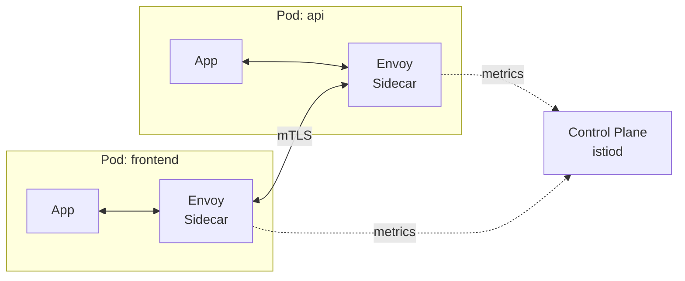

# Service Mesh
{: .no_toc }

## 目次
{: .no_toc .text-delta }

1. TOC
{:toc}

---

**Service Mesh** はサービス間通信を、各 Pod に **Sidecar Proxy** を注入することで透過的に制御・観測する仕組み。
代表は **Istio**、軽量な **Linkerd**、新興の **Cilium Service Mesh**(eBPF)。

## 何ができるか

- mTLS による通信暗号化(全サービスを TLS 化)
- L7 トラフィック制御(リトライ、タイムアウト、サーキットブレーカ)
- 観測性(リクエスト数、エラー率、レイテンシを Sidecar が自動記録)
- カナリアリリース(細かいトラフィック分割)
- 認可ポリシー(L7 レベルのアクセス制御)



## トレードオフ

メリットは大きいですが、

- リソース消費が増える(Sidecarが各Podに付く)
- レイテンシが増える(Proxy通過分)
- 学習・運用コストが高い(Istio はコンポーネントが多い)
- 障害時の切り分けが複雑になる

「**まず本当に必要か?**」を考えるべき。**Network Policy + アプリ側 mTLS で済むなら導入しない** が現実解。

## Linkerd でまず触ってみる

Linkerd はシンプルで学習しやすい。

```bash
curl --proto '=https' --tlsv1.2 -sSfL https://run.linkerd.io/install | sh
linkerd install --crds | kubectl apply -f -
linkerd install | kubectl apply -f -
linkerd check
```

サンプルアプリにメッシュを注入:

```bash
kubectl get -n prod deploy -o yaml | linkerd inject - | kubectl apply -f -
```

```bash
linkerd viz install | kubectl apply -f -
linkerd viz dashboard
```

これだけで、Pod 間の RPS / Success Rate / Latency が UI で見えるようになります。

## Istio Ambient Mesh

Istio の新モード。Sidecar を使わず、**ノード単位の ztunnel** + **L7 Waypoint Proxy** という構成。
リソース効率が良く、メッシュ導入コストが下がる方向に進化中。

## チェックポイント

- [ ] Service Mesh が解決する課題と、そのコスト
- [ ] mTLS のメリット
- [ ] Linkerd と Istio の使い分け
