# Service Mesh
{: .no_toc }

## 目次
{: .no_toc .text-delta }

1. TOC
{:toc}

---

## このページのゴール

このページを読み終えると、以下を **自分の言葉で説明できる** ようになります。

- **Service Mesh** が解決する **5 つの中核問題**(mTLS、L7 トラフィック制御、観測性、認可、トレーシング)を具体的に挙げられる
- Service Mesh が生まれた **歴史的経緯**(Twitter / Lyft / Netflix のマイクロサービス爆発と Polyglot 問題)を語れる
- **Sidecar Proxy 方式** と **Sidecarless 方式**(eBPF / Ambient)の違いとトレードオフ
- **Istio / Linkerd / Cilium Service Mesh / Consul Connect** の特徴と選び分け
- **Envoy / xDS プロトコル** の役割と、なぜ業界標準になったか
- サンプルアプリへの Linkerd 注入と、それにより得られる観測性・mTLS の実体験
- Service Mesh を **入れるべきでない場面** と、Network Policy + アプリ mTLS で済む判断基準
- 本番運用での **コスト**(リソース消費・レイテンシ・デバッグ難易度)

---

## 1. Service Mesh とは何か

### 1.1 ひと言定義

**Service Mesh** は、

> マイクロサービス間の **サービス間通信(East-West Traffic)** を、**アプリのコードに手を入れずに** 制御・観測・暗号化する **インフラ層**

を提供するソフトウェアの総称です。

代表的な実装:

- **Istio** (Google / IBM / Lyft、CNCF Graduated 2024)
- **Linkerd** (Buoyant、CNCF Graduated 2021)
- **Cilium Service Mesh** (Isovalent、eBPF ベース)
- **Consul Connect / Service Mesh** (HashiCorp)
- **Open Service Mesh (OSM)**(Microsoft、2023 にアーカイブ ── 反面教師)
- **Kuma** (Kong)

### 1.2 East-West / North-South という言葉

ネットワーク用語の整理から始めます。

| 方向 | 意味 | 主に担う技術 |
|------|------|------------|
| **North-South** | クラスタ **外部 ↔ 内部** の通信 | Ingress、Gateway API、LoadBalancer |
| **East-West** | クラスタ内、**サービス間** の通信 | Service、kube-proxy、Service Mesh |

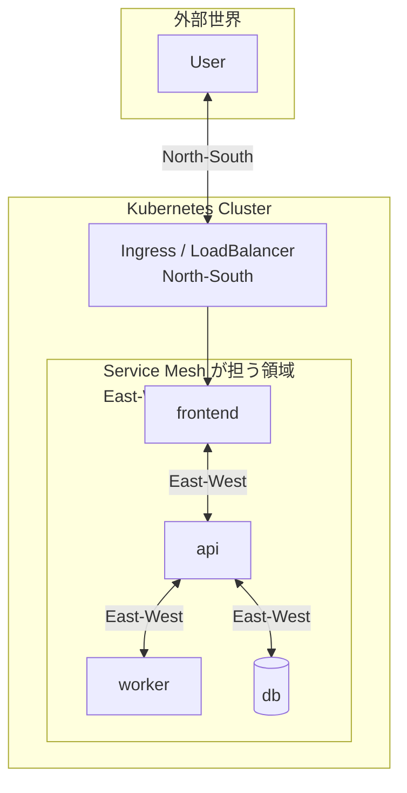
```mermaid
flowchart TB
    subgraph external[外部世界]
        u[User]
    end
    subgraph cluster[Kubernetes Cluster]
        lb[Ingress / LoadBalancer<br>North-South]
        subgraph mesh[Service Mesh が担う領域<br>East-West]
            f[frontend]
            a[api]
            w[worker]
            d[(db)]
        end
    end
    u <-->|North-South| lb
    lb --> f
    f <-->|East-West| a
    a <-->|East-West| w
    a <-->|East-West| d
```

Service Mesh の主戦場は **East-West** です。
ただし最近の Istio / Cilium は **Gateway API** 経由で North-South も担う方向に進化しており、境界はぼやけてきています。

### 1.3 Service Mesh が提供する 5 つの中核機能

| 機能 | 例 |
|------|----|
| **1. mTLS による相互認証・暗号化** | Pod 間通信を自動で TLS 化、証明書ローテーション |
| **2. L7 トラフィック制御** | リトライ・タイムアウト・サーキットブレーカ・カナリア・ミラーリング |
| **3. 観測性 (Observability)** | RPS / エラー率 / レイテンシを自動収集、サービス間グラフ |
| **4. 認可ポリシー** | 「service A は service B の /admin に POST 不可」を Kubernetes API で宣言 |
| **5. 分散トレーシング** | リクエストの起点から終点までを横断追跡 |

これらが **アプリケーションのコードに 1 行も追加せず** 得られる、というのが Service Mesh の核心です。

### 1.4 アーキテクチャの基本形(Sidecar 方式)

代表的な Sidecar 方式の構成:

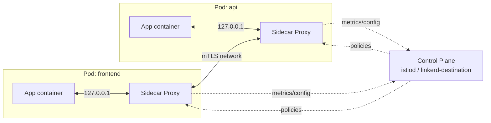
```mermaid
flowchart LR
    subgraph Pod1[Pod: frontend]
        app1[App container]
        sc1[Sidecar Proxy]
        app1 <-->|127.0.0.1| sc1
    end
    subgraph Pod2[Pod: api]
        app2[App container]
        sc2[Sidecar Proxy]
        app2 <-->|127.0.0.1| sc2
    end
    sc1 <-->|mTLS network| sc2
    sc1 -.metrics/config.-> control[Control Plane<br>istiod / linkerd-destination]
    sc2 -.metrics/config.-> control
    control -.policies.-> sc1
    control -.policies.-> sc2
```

各 Pod に **「Sidecar Proxy」(=データプレーン)** をくっつけて、アプリのトラフィックを **すべてその Proxy 経由** にすることで、

- 暗号化(mTLS)
- ルーティング判断
- メトリクス採取
- 認可判断

を **アプリの外側で** 行う、というアイデアです。これにより、

- アプリは Plain HTTP / gRPC を書いていればよい(暗号化等は Sidecar 任せ)
- 言語非依存(Go でも Python でも Java でも同じ)
- ポリシーは Kubernetes API(CR)で一元管理

が実現します。

---

## 2. なぜ Service Mesh が生まれたか ─ 歴史的経緯

### 2.1 前史:マイクロサービス化の代償(2010 年代前半)

2010 年前後、Twitter / Netflix / Amazon / SoundCloud / Lyft などが「**モノリスからマイクロサービスへの分割**」を進めました。
分割すれば疎結合になりスケールしやすくなる ── という期待は半分以上正しかったのですが、想定外の苦痛がついてきました。

サービス間通信に必要なもの:

- ローカル開発時は使わなかった **リトライ**
- ローカルでは存在しなかった **タイムアウト**
- ネットワーク分断に備えた **サーキットブレーカ**
- 障害連鎖を防ぐ **バルクヘッド**(隔壁)
- 攻撃面拡大に伴う **mTLS**
- ボトルネック特定のための **分散トレーシング**
- リリース戦略としての **カナリア・ミラーリング**

これらを **各サービスのコード** に書く必要が出てきました。
Twitter は **Finagle**(Scala)、Netflix は **Hystrix**(Java + RxJava)というライブラリで対応しました。

### 2.2 Polyglot 問題 ─ 同じ機能を言語ごとに作り直す地獄

問題は **マイクロサービス化が進むほど、サービスごとに採用する言語がバラバラになる** ことです。

ある会社の典型例:

- 古い基幹: Java
- 新規 API: Go
- データ処理: Python
- フロント BFF: Node.js
- 機械学習: Python
- インフラツール: Ruby

このとき Java の Hystrix を導入しても、Python サービスでは使えません。
**「同じリトライ実装を 6 言語分作る」「同じ mTLS 設定を 6 言語で揃える」**(Polyglot Persistence ならぬ **Polyglot Resilience の地獄**)が現実になりました。

「**Lyft の社内で 30 以上のマイクロサービスがあり、Hystrix の代わりを各言語で書くのは破綻している**」── これが Envoy 開発のきっかけになる愚痴です(Matt Klein、2016 年)。

### 2.3 Linkerd 1.x の登場(2016 年 1 月)─ 最初の Service Mesh

**Buoyant 社**(William Morgan、Oliver Gould ら、Twitter Finagle チームの OB)が、**Linkerd 1.x** を OSS で公開。
これが「Service Mesh」という名前を業界に広めた最初の存在でした。

特徴:

- Scala で書かれた Sidecar Proxy(Finagle 由来)
- リトライ・タイムアウト・サーキットブレーカ・サービスディスカバリを統合
- 言語非依存(Sidecar として動くため)

ただし Linkerd 1.x は JVM ベースで **メモリ消費が大きい**(Sidecar 1 つで 100MB+)、Kubernetes が前提ではない、などの課題があり、本格普及はしませんでした。

### 2.4 Envoy の登場(2016 年 9 月)

**Lyft の Matt Klein** が、Lyft 社内で開発していた C++ ベースの軽量 Proxy「**Envoy**」を OSS 公開。
Envoy は単独の Proxy としても優秀でしたが、それ以上に重要だったのは:

- **xDS プロトコル**(後述)による「外部からの動的設定」の仕組み
- C++ ベースで **低メモリ**(数十 MB)、**低レイテンシ**(1ms 以下)
- **HTTP/1.1 / HTTP/2 / gRPC / WebSocket / TCP** をフル対応
- 観測性が組み込み(メトリクス・トレーシング・ログ)

Envoy は **「Service Mesh 用のデータプレーン共通基盤」** として、その後数年間で:

- Istio
- AWS App Mesh
- Consul Connect
- Open Service Mesh

など多数のメッシュ実装に採用され、**事実上の業界標準** になりました。
2018 年に CNCF Graduated。

### 2.5 Istio の登場(2017 年 5 月)

**Google + IBM + Lyft** が共同発表。Envoy をデータプレーンに採用し、Control Plane(後の `istiod`)で集中管理する構成。

Istio は登場当初から:

- 機能の多さ(VirtualService、DestinationRule、Gateway、AuthorizationPolicy、PeerAuthentication...)
- Kubernetes ネイティブな CR ベースの設定
- 大手の後ろ盾

で大きな期待を集めましたが、初期は **コンポーネント分散**(Pilot / Citadel / Galley / Mixer 等)で運用負荷が大きく、「重い」「難しい」評判が定着しました。
1.5(2020 年)で `istiod` に統合、1.18+(2023〜)で Ambient Mesh を導入する等、設計刷新を続けています。

### 2.6 Linkerd 2.x のリブート(2018 年 9 月)

Buoyant は 1.x の反省から、**Rust + Go** で完全に書き直した **Linkerd 2.x** をリリース。

- Sidecar Proxy は **Rust 製の linkerd2-proxy**(Tokio + Hyper)
- Control Plane は Go
- **Envoy を使わない**(意図的な選択)
- 機能を最小限に絞り、**圧倒的なシンプルさと低リソース消費**(Sidecar 1 つで数 MB)
- Service Profile / Service Authorization など独自 CR

2021 年に CNCF Graduated。「**Service Mesh を 最小限 で使いたい**」需要の受け皿として安定。

### 2.7 Cilium Service Mesh / eBPF 方式(2021〜)

**Isovalent**(Cilium 開発元、現 Cisco 傘下)が、CNI の Cilium を拡張する形で **Cilium Service Mesh** を発表。

特徴:

- **eBPF をカーネル内で動かして** Sidecar を不要にする(L4 まで)
- L7 機能は必要時のみ **ノード単位の Envoy**(per-node Envoy)で実行
- Sidecar 1 つあたり数十 MB の節約 × Pod 数 × ノード数

→ 大規模クラスタでリソース効率が劇的に改善。

2023〜2024 年に存在感が増し、Sidecar 方式と Sidecarless 方式の **どちらが将来の標準か** の議論が活発化。

### 2.8 Istio Ambient Mesh(2022 年 9 月 alpha、2024 年 GA)

Istio もこの流れを受けて、**Ambient Mesh** という Sidecarless モードを発表。

- L4 は **ノード単位の ztunnel**(Rust 製 Proxy)が担当
- L7 は **Namespace 単位の Waypoint Proxy**(Envoy)
- Sidecar Injection を廃止、Pod の変更が不要

これで Service Mesh は **「全 Pod に Sidecar を刺す」** から **「ノードやサービス境界に Proxy を置く」** への大転換期に入りました。

### 2.9 タイムライン

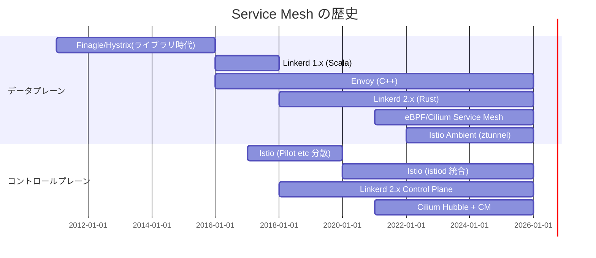
```mermaid
gantt
    title Service Mesh の歴史
    dateFormat YYYY
    section データプレーン
    Finagle/Hystrix(ライブラリ時代) :2011, 2016
    Linkerd 1.x (Scala)             :2016, 2018
    Envoy (C++)                     :2016, 2026
    Linkerd 2.x (Rust)              :2018, 2026
    eBPF/Cilium Service Mesh        :2021, 2026
    Istio Ambient (ztunnel)         :2022, 2026
    section コントロールプレーン
    Istio (Pilot etc 分散)          :2017, 2020
    Istio (istiod 統合)             :2020, 2026
    Linkerd 2.x Control Plane       :2018, 2026
    Cilium Hubble + CM              :2021, 2026
```

### 2.10 まとめ

歴史を踏まえると、Service Mesh が何を解決したかったかは明らかです。

| 課題 | 解決 |
|------|------|
| マイクロサービスで同じ「resilience コード」を各言語に書く重複 | Sidecar / eBPF でアプリ外に集約 |
| サービス間通信の暗号化漏れ | 自動 mTLS |
| 障害連鎖でシステム全体が落ちる | リトライ・タイムアウト・サーキットブレーカ |
| どのサービスが遅いか分からない | サービス間トポロジと自動メトリクス |
| カナリアリリースの実装が面倒 | L7 トラフィック分割 |

そして、これらは **「コードに手を入れずに」** 達成されました。これが Service Mesh の革新性です。

---

## 3. Sidecar 方式 vs Sidecarless 方式

### 3.1 Sidecar 方式 (Istio classic、Linkerd 2.x)

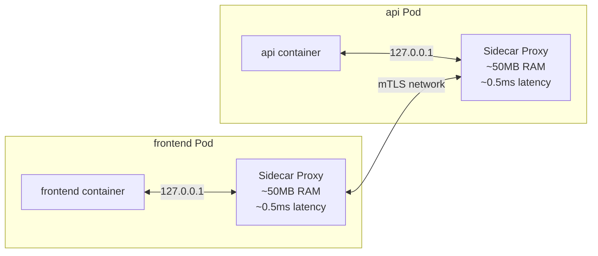
```mermaid
flowchart LR
    subgraph Pod1[frontend Pod]
        a1[frontend container]
        p1[Sidecar Proxy<br>~50MB RAM<br>~0.5ms latency]
        a1 <-->|127.0.0.1| p1
    end
    subgraph Pod2[api Pod]
        a2[api container]
        p2[Sidecar Proxy<br>~50MB RAM<br>~0.5ms latency]
        a2 <-->|127.0.0.1| p2
    end
    p1 <-->|mTLS network| p2
```

長所:

- **Pod 単位での厳密な分離**(別 Namespace の Pod の Proxy 設定に影響されない)
- **L7 機能が常にフル**
- **デバッグしやすい**(Pod 内で完結)

短所:

- 全 Pod に Proxy を **重複** デプロイ → リソース消費大
- Pod 起動順序問題(アプリが Proxy より先に起動するとトラフィック失敗)
- Pod 再起動時の latency
- 1 Pod = 2 Container となり管理が複雑

### 3.2 Sidecarless 方式 (Cilium Service Mesh、Istio Ambient)

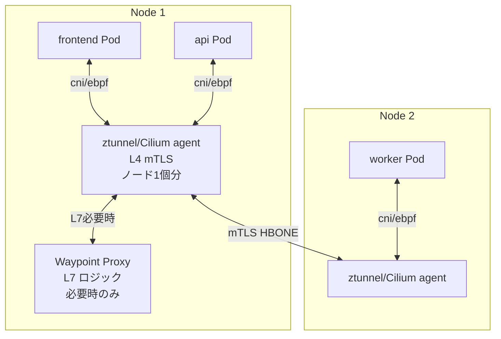
```mermaid
flowchart TB
    subgraph Node1[Node 1]
        Pod1[frontend Pod]
        Pod2[api Pod]
        zt1[ztunnel/Cilium agent<br>L4 mTLS<br>ノード1個分]
        wp1[Waypoint Proxy<br>L7 ロジック<br>必要時のみ]
        Pod1 <-->|cni/ebpf| zt1
        Pod2 <-->|cni/ebpf| zt1
        zt1 <-->|L7必要時| wp1
    end
    subgraph Node2[Node 2]
        Pod3[worker Pod]
        zt2[ztunnel/Cilium agent]
        Pod3 <-->|cni/ebpf| zt2
    end
    zt1 <-->|mTLS HBONE| zt2
```

長所:

- リソース消費が **桁違いに小さい**(Pod 数に依らない)
- アプリ Pod に手を入れない(Sidecar Injection 不要)
- Pod 起動順序問題がない
- アップグレード時に **アプリを再起動しなくていい**

短所:

- ノードレベルの Proxy が落ちると影響範囲が大きい
- マルチテナント時の境界が Pod 単位より緩い
- 新しい技術なので運用ノウハウが少ない(2026 年現在)
- eBPF (Cilium) はカーネルバージョン要件あり(Linux 5.10+ 推奨)

### 3.3 比較表

| 観点 | Sidecar | Sidecarless |
|------|---------|------------|
| メモリ消費(1000 Pod) | 50MB × 1000 = 50 GB | ノード数 × 100MB = 数 GB |
| L7 機能 | 常に有効 | 必要時のみ(Waypoint) |
| Pod 変更 | 必要(Init Container 等) | 不要 |
| Pod 起動順序 | 問題あり(対策必要) | 問題なし |
| カーネル要件 | 一般的 | eBPF なら Linux 5.10+ |
| 成熟度(2026) | 5+ 年の本番実績 | 1〜3 年(急速に成熟中) |

### 3.4 どちらを選ぶか

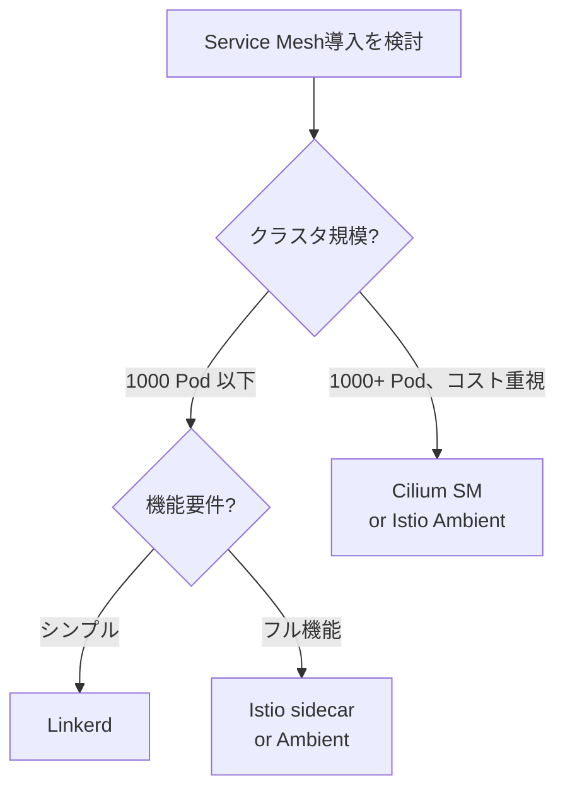
```mermaid
flowchart TB
    s[Service Mesh導入を検討] --> q1{クラスタ規模?}
    q1 -->|1000 Pod 以下| q2{機能要件?}
    q1 -->|1000+ Pod、コスト重視| amb[Cilium SM<br>or Istio Ambient]
    q2 -->|シンプル | linkerd[Linkerd]
    q2 -->|フル機能 | istio[Istio sidecar<br>or Ambient]
```

迷ったら:

- **学習用・小〜中規模・シンプル重視** → **Linkerd**
- **フル機能・大規模・チーム余裕あり** → **Istio**(Ambient ならコストも抑えられる)
- **既に Cilium を CNI で使ってる** → **Cilium Service Mesh** が自然

本書のハンズオンは **Linkerd** で行います(導入と理解が容易なため)。

---

## 4. Envoy と xDS プロトコル

Service Mesh の話で **Envoy** と **xDS** を避けては通れません。

### 4.1 Envoy

- **C++ で書かれた、L7 対応の高性能 Proxy**
- HTTP/1.1、HTTP/2、HTTP/3 (QUIC)、gRPC、WebSocket、Redis、MongoDB、PostgreSQL などのプロトコル理解
- 観測性(統計、ログ、トレース)を組み込み
- **「全機能を Sidecar 1 つで」** 提供

Envoy 単体でも使えますが、**配下に多数の Envoy を持ち、集中管理する** 場面で本領発揮します。

### 4.2 xDS プロトコル

**xDS = X Discovery Service**。x は「Cluster、Endpoint、Listener、Route 等」を指すワイルドカード。

| API | 役割 |
|-----|------|
| **LDS** (Listener Discovery Service) | リッスンするポート・プロトコル |
| **RDS** (Route Discovery Service) | HTTP ルーティング |
| **CDS** (Cluster Discovery Service) | 上流サービス(クラスタ) |
| **EDS** (Endpoint Discovery Service) | クラスタのエンドポイント(Pod IP) |
| **SDS** (Secret Discovery Service) | 証明書 |

Envoy はこれらを **gRPC でリアルタイムに購読** し、Control Plane(`istiod` 等)からの設定変更を **再起動なしで** 受け取って動的に反映します。

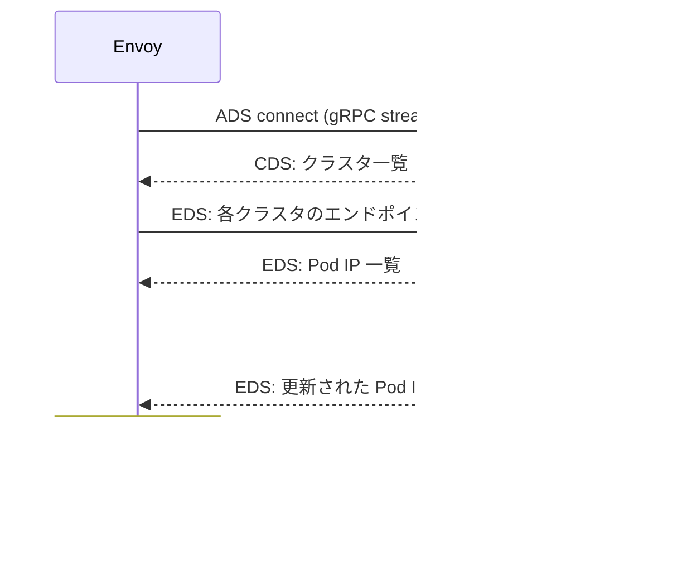
```mermaid
sequenceDiagram
    participant Envoy
    participant Control as Control Plane (istiod)
    Envoy->>Control: ADS connect (gRPC stream)
    Control-->>Envoy: CDS: クラスタ一覧
    Envoy->>Control: EDS: 各クラスタのエンドポイント要求
    Control-->>Envoy: EDS: Pod IP 一覧
    Note over Control: Kubernetes API watch で<br>Pod IP の変化を検知
    Control-->>Envoy: EDS: 更新された Pod IP
    Note over Envoy: 再起動なしで反映
```

これが Envoy の真価で、**「動的な設定反映が大規模に可能」** という性質が、業界標準採用の決め手になりました。

### 4.3 ADS と SOTW vs Incremental

実運用では **ADS (Aggregated Discovery Service)** が標準。LDS / RDS / CDS / EDS を 1 本の gRPC ストリームに集約し、設定の順序依存を解消します。

xDS には 2 つの配信モードがあります:

- **SotW** (State of the World): フルスナップショットを送る。シンプルだが大量データで非効率
- **Incremental xDS / Delta xDS**: 差分のみ送る。大規模で必須

Istio は両方サポート、Linkerd 2.x は **Envoy 不使用** なので xDS とは無関係(独自プロトコル)。

---

## 5. mTLS の中身

Service Mesh の最重要機能の 1 つ、**mTLS** を掘り下げます。

### 5.1 普通の TLS との違い

- **TLS**: サーバ側のみ証明書を提示(Web ブラウザ ↔ Web サーバ)
- **mTLS**(Mutual TLS): クライアントも証明書を提示(両方向認証)

これにより、

- 「**誰が** リクエストしているか」をネットワーク層で検証可能
- 中間者攻撃(MITM)が困難に
- 認可ポリシー(誰が誰に何をしていいか)をネットワーク層で実装可能

### 5.2 Service Mesh での自動 mTLS

通常、mTLS を導入するには:

1. CA(認証局)を立てる
2. 各サービスに証明書を発行
3. 期限切れ前にローテーション
4. アプリのコード / 設定で TLS 化

これを **全部自動でやる** のが Service Mesh の自動 mTLS です。

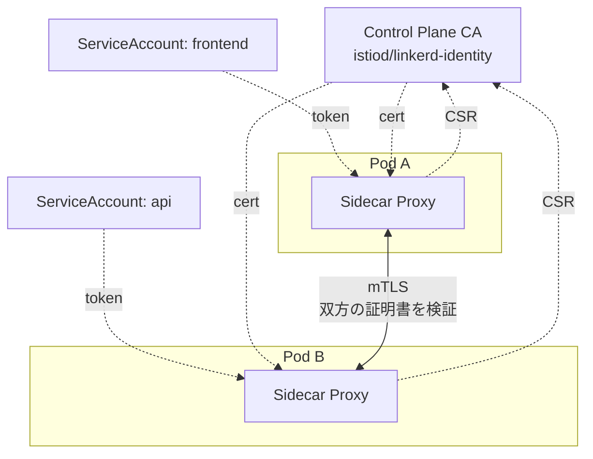
```mermaid
flowchart TB
    ca[Control Plane CA<br>istiod/linkerd-identity]
    subgraph Pod1[Pod A]
        sc1[Sidecar Proxy]
    end
    subgraph Pod2[Pod B]
        sc2[Sidecar Proxy]
    end
    sa1[ServiceAccount: frontend]
    sa2[ServiceAccount: api]
    sa1 -.token.-> sc1
    sa2 -.token.-> sc2
    sc1 -.CSR.-> ca
    ca -.cert.-> sc1
    sc2 -.CSR.-> ca
    ca -.cert.-> sc2
    sc1 <-->|mTLS<br>双方の証明書を検証| sc2
```

仕組み:

1. 各 Pod に紐付く **ServiceAccount** のトークンを使って、Sidecar が Control Plane に **証明書要求 (CSR)** を送る
2. Control Plane は ServiceAccount 名を identity として証明書を発行(例: `spiffe://cluster.local/ns/prod/sa/frontend`)
3. Sidecar 同士の通信は、その証明書で mTLS
4. 証明書の有効期限は短く(24 時間など)、Sidecar が自動で renew

これにより、**「ServiceAccount が identity」** という Kubernetes ネイティブな世界観で mTLS が成立します。

### 5.3 SPIFFE / SPIRE

mTLS の identity 命名規約として、**SPIFFE**(Secure Production Identity Framework For Everyone)が事実上の標準。

SPIFFE ID 例:

```
spiffe://cluster.local/ns/prod/sa/frontend
```

意味: 「cluster.local というトラストドメインの、prod Namespace の frontend ServiceAccount」

Istio も Linkerd も SPIFFE ID を発行します。

### 5.4 mTLS モード(Istio)

Istio では mTLS の厳格さを 3 段階で選べます(PeerAuthentication CR):

| モード | 説明 | 用途 |
|--------|------|------|
| `DISABLE` | mTLS 強制せず(plain も受ける) | 段階的導入の最初 |
| `PERMISSIVE` | mTLS あれば mTLS、なければ plain | 移行期間 |
| `STRICT` | mTLS 必須(plain は拒否) | 最終形 |

```yaml
apiVersion: security.istio.io/v1beta1
kind: PeerAuthentication
metadata:
  name: default
  namespace: prod
spec:
  mtls:
    mode: STRICT
```

---

## 6. L7 トラフィック制御

Service Mesh の もう 1 つの目玉。**コードを変えずに** リトライ・タイムアウト・カナリアができます。

### 6.1 Istio の場合

#### VirtualService(ルーティング)

```yaml
apiVersion: networking.istio.io/v1beta1
kind: VirtualService
metadata:
  name: todo-api
  namespace: prod
spec:
  hosts: [todo-api]
  http:
  - match:
    - headers:
        x-canary: {exact: "true"}
    route:
    - destination:
        host: todo-api
        subset: v2
  - route:
    - destination: {host: todo-api, subset: v1}
      weight: 90
    - destination: {host: todo-api, subset: v2}
      weight: 10
    retries:
      attempts: 3
      perTryTimeout: 2s
      retryOn: 5xx,gateway-error,connect-failure
    timeout: 10s
    fault:
      delay:
        percentage: {value: 0.1}      # 0.1% に遅延注入(カオステスト)
        fixedDelay: 5s
```

意味:

- ヘッダ `x-canary: true` を持つリクエストは **v2 に確実に送る**(社内テスター)
- それ以外は **90:10 で v1:v2 に振り分け**(カナリア)
- 5xx エラー時は **最大 3 回リトライ**、各試行 2 秒タイムアウト
- 全体タイムアウトは 10 秒
- 0.1% に故意に 5 秒遅延(カオステスト)

#### DestinationRule(クラスタの subset 定義とポリシー)

```yaml
apiVersion: networking.istio.io/v1beta1
kind: DestinationRule
metadata:
  name: todo-api
  namespace: prod
spec:
  host: todo-api
  trafficPolicy:
    connectionPool:
      tcp: {maxConnections: 100}
      http: {http1MaxPendingRequests: 50, http2MaxRequests: 1000}
    outlierDetection:                  # サーキットブレーカ
      consecutive5xxErrors: 5
      interval: 30s
      baseEjectionTime: 30s
      maxEjectionPercent: 50
  subsets:
  - name: v1
    labels: {version: v1}
  - name: v2
    labels: {version: v2}
```

意味:

- 接続プール上限を設定(リソース保護)
- 5 回連続 5xx エラーを返した Endpoint を **30 秒間プールから除外**(outlier detection = サーキットブレーカ)
- Pod のラベル `version` で v1/v2 サブセットを定義

### 6.2 Linkerd の場合(HTTPRoute / Service Profile)

Linkerd は **Gateway API の HTTPRoute** を採用しています(2024 年〜)。

```yaml
apiVersion: gateway.networking.k8s.io/v1beta1
kind: HTTPRoute
metadata:
  name: todo-api-canary
  namespace: prod
spec:
  parentRefs:
  - name: todo-api
    kind: Service
    group: ""
  rules:
  - backendRefs:
    - name: todo-api-v1
      port: 8080
      weight: 90
    - name: todo-api-v2
      port: 8080
      weight: 10
```

サーキットブレーカ等は別 CR(`CircuitBreaker`)で書きます。

---

## 7. Linkerd ハンズオン

ここからは実際に Linkerd をサンプルアプリに注入していきます。

### 7.1 前提

- 第 7 章で構築した kubeadm HA クラスタが稼働
- サンプルアプリ(todo-frontend / todo-api / postgres / redis)が `prod` Namespace で動いている
- `kubectl` が使える、`curl` が入っている

### 7.2 Linkerd CLI のインストール

```bash
curl --proto '=https' --tlsv1.2 -sSfL https://run.linkerd.io/install | sh
export PATH=$HOME/.linkerd2/bin:$PATH
linkerd version
```

**期待される出力**:

```
Client version: stable-2.14.10
Server version: unavailable
```

(Server がまだ立ってないので unavailable)

### 7.3 事前チェック

```bash
linkerd check --pre
```

クラスタが Linkerd 導入要件を満たしているか確認。kubeadm v1.30 なら問題ありません。

**期待される出力(抜粋)**:

```
kubernetes-api
--------------
√ can initialize the client
√ can query the Kubernetes API
...
Status check results are √
```

### 7.4 Linkerd のインストール

#### Step 1: CRD インストール

```bash
linkerd install --crds | kubectl apply -f -
```

**何が起きるか**:

- `linkerd-` プレフィックスの CRD が複数登録される
- `linkerd-system` Namespace はまだ作られない

#### Step 2: Control Plane インストール

```bash
linkerd install | kubectl apply -f -
```

**何が起きるか**:

- `linkerd` Namespace が作成される
- Control Plane の Pod が起動: `linkerd-destination`、`linkerd-identity`、`linkerd-proxy-injector` 等
- **mTLS 用の CA 証明書** が自動生成される(production では事前に外部 CA で発行を推奨)

#### Step 3: 確認

```bash
linkerd check
```

**期待される出力(抜粋)**:

```
kubernetes-api
--------------
√ can initialize the client

linkerd-existence
-----------------
√ 'linkerd-config' config map exists
√ heartbeat ServiceAccount exist
√ control plane replica sets are ready
...

linkerd-identity
----------------
√ certificate config is valid
√ trust anchors are using supported crypto algorithm
√ trust anchors are within their validity period
...

Status check results are √
```

すべて √ になれば成功。

### 7.5 サンプルアプリにメッシュを注入

#### 方法 1: Annotation で自動注入

Namespace に annotation を付けると、その Namespace の新規 Pod に自動で Sidecar が注入されます。

```bash
kubectl annotate namespace prod linkerd.io/inject=enabled
```

その後、Pod を再起動して反映:

```bash
kubectl rollout restart deployment -n prod
kubectl rollout restart statefulset -n prod
```

#### 方法 2: CLI で既存マニフェストに注入

```bash
kubectl get -n prod deploy -o yaml | linkerd inject - | kubectl apply -f -
```

**何が起きるか**:

各 Pod の `spec` に次が追加されます:

```yaml
spec:
  initContainers:
  - name: linkerd-init      # iptables 設定で全 traffic を proxy 経由に
    image: cr.l5d.io/linkerd/proxy-init:v2.x.x
  containers:
  - name: linkerd-proxy     # Rust 製の Sidecar Proxy
    image: cr.l5d.io/linkerd/proxy:stable-2.14.x
  - name: <元のアプリ container>
    ...
```

#### 確認

```bash
$ kubectl get pod -n prod
NAME                            READY   STATUS    RESTARTS   AGE
postgres-1                      2/2     Running   0          1m
todo-api-7d8f5c-abcde           2/2     Running   0          1m
todo-frontend-6b9c7d-xxxxx      2/2     Running   0          1m
```

**READY が 2/2** になっていれば Sidecar が注入されています(アプリ 1 + linkerd-proxy 1)。

### 7.6 mTLS の確認

```bash
linkerd -n prod viz tap deploy/todo-api
```

このコマンドは todo-api Pod に到着する HTTP リクエストをリアルタイム表示します。

**期待される出力(抜粋)**:

```
req id=0:0 proxy=in src=10.244.1.5:34567 dst=10.244.2.10:8080 tls=true :method=GET :authority=todo-api :path=/items
rsp id=0:0 proxy=in src=10.244.1.5:34567 dst=10.244.2.10:8080 tls=true :status=200 latency=4ms
```

注目: **`tls=true`** が表示されれば、Pod 間通信が mTLS 化されています。

### 7.7 Linkerd Viz Dashboard

メトリクスを可視化する UI をインストール:

```bash
linkerd viz install | kubectl apply -f -
linkerd viz check
linkerd viz dashboard      # ブラウザが開く
```

ダッシュボードで見られるもの:

- **Top メニュー**: 各 Service の RPS / Success Rate / レイテンシ
- **Trafic Graph**: サービス間トポロジが矢印で可視化
- **Tap**: リアルタイムリクエストストリーム
- **Routes**: HTTPRoute による分岐の状態
- **mTLS の状態**: 各エッジが mTLS で暗号化されているか

(Grafana も自動で組み込まれます)

### 7.8 サーキットブレーカの設定

```yaml
apiVersion: policy.linkerd.io/v1alpha1
kind: HTTPRoute
metadata:
  name: todo-api-route
  namespace: prod
spec:
  parentRefs:
  - name: todo-api
    kind: Service
  rules:
  - backendRefs:
    - name: todo-api
      port: 8080
      weight: 100
    timeouts:
      request: 5s
      backendRequest: 3s
```

---

## 8. Istio のさわり

Linkerd と比較する意味で Istio の概要も触ります。本書ではフルインストールはしませんが、概念は知っておいてください。

### 8.1 コンポーネント(`istiod` 統合後)

| 役割 | コンポーネント |
|------|--------------|
| **Control Plane** | `istiod`(旧 Pilot + Citadel + Galley を統合) |
| **Data Plane** | 各 Pod の Envoy Sidecar(または Ambient の ztunnel) |
| **Ingress Gateway** | クラスタ入り口の Envoy |
| **Egress Gateway** | クラスタ出口の Envoy(任意) |

### 8.2 主要 CR

| CR | 役割 |
|----|------|
| **Gateway** | 入口 Listener の定義 |
| **VirtualService** | L7 ルーティング |
| **DestinationRule** | クラスタ subset、サーキットブレーカ |
| **ServiceEntry** | 外部サービスの定義 |
| **Sidecar** | Sidecar のスコープ制限 |
| **AuthorizationPolicy** | L7 認可 |
| **PeerAuthentication** | mTLS モード |
| **RequestAuthentication** | JWT 認証 |
| **EnvoyFilter** | Envoy 直接設定(逃げ道) |
| **WasmPlugin** | Wasm モジュール |
| **Telemetry** | 観測性設定 |

### 8.3 Istio をどう選ぶか

| 場面 | Istio を選ぶ理由 |
|------|----------------|
| 大企業、複雑な要件 | フル機能 |
| マルチクラスタ網が必要 | Istio multi-cluster が成熟 |
| WASM プラグインで拡張したい | EnvoyFilter / WasmPlugin |
| 既に OpenShift 採用 | Service Mesh Operator が同梱 |

逆に Istio が向かない場面:

- 小規模、シンプルで OK
- 学習・運用コスト最小化したい
- Sidecar のメモリオーバーヘッドを最小化したい

→ Linkerd か Cilium SM が現実的。

### 8.4 Ambient Mesh のアーキテクチャ(参考)

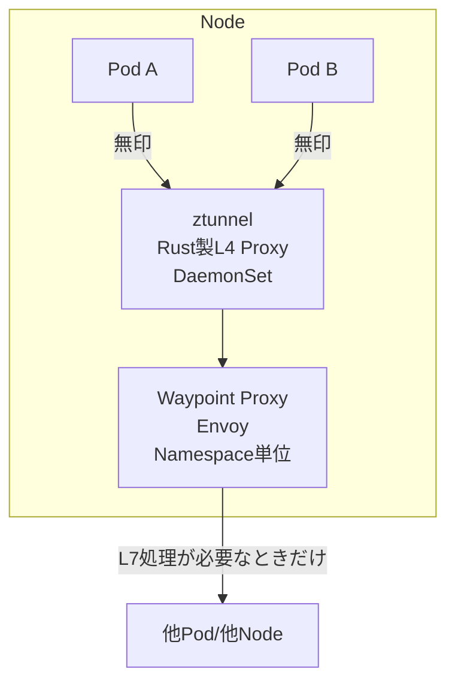
```mermaid
flowchart TB
    subgraph Node[Node]
        Pod1[Pod A] -->|無印| zt[ztunnel<br>Rust製L4 Proxy<br>DaemonSet]
        Pod2[Pod B] -->|無印| zt
        zt --> wp[Waypoint Proxy<br>Envoy<br>Namespace単位]
    end
    wp -->|L7処理が必要なときだけ| other[他Pod/他Node]
```

要点:

- L4(mTLS、基本ルーティング)は **ztunnel** がノード単位で
- L7(リトライ、認可、トレーシング)は **Waypoint Proxy** が Namespace 単位で
- Pod に Sidecar が刺さらないので、アプリ Pod 構成は不変

---

## 9. Cilium Service Mesh(eBPF)

CNI として Cilium を採用しているなら、追加コンポーネントなしで Service Mesh の多くの機能が手に入ります。

### 9.1 構成

- **DaemonSet として動く Cilium agent**(各ノードに 1 つ)
- L4 までは **eBPF プログラム** がカーネル空間で処理
- L7(HTTP リトライ、L7 認可など)が必要な場合のみ **per-node Envoy** を経由

### 9.2 機能

| 機能 | Cilium SM での実現 |
|------|------------------|
| mTLS | Wireguard または mTLS(設定可) |
| L4 観測性 | Hubble(eBPF ベース) |
| L7 観測性 | Hubble + Envoy 経由 |
| L7 ルーティング | CiliumEnvoyConfig CR |
| L7 認可 | CiliumNetworkPolicy(L7 rules) |
| サーキットブレーカ | Envoy 経由(設定可) |

### 9.3 Cilium のメリット

- Sidecar 数: ノード数のみ(Pod 数ではない)→ 大規模ほど効く
- Network Policy と Service Mesh が **一つのコンセプトで統合**
- 既に CNI として Cilium 使用なら追加コスト最小

### 9.4 Cilium のデメリット

- カーネル要件(Linux 5.10+ 推奨)
- L7 機能のために Envoy を経由する場合は通常のメッシュと変わらないオーバーヘッド
- 設定が独自(Hubble、CiliumEnvoyConfig 等)で他メッシュからの移植性低い

---

## 10. 観測性 ─ Service Mesh の最大の価値

導入する人の多くは「mTLS が欲しい」「トラフィック制御が欲しい」と言いますが、**実際に入れて一番嬉しいのは観測性** という声が多いです。

### 10.1 自動で取れるメトリクス

各 Service / 各 Edge について:

- **RPS** (Requests Per Second)
- **Success Rate** (2xx + 3xx の割合)
- **Latency** (p50 / p95 / p99)
- **Active connections**
- **Bytes in / out**

これが Prometheus にエクスポートされ、Grafana の標準ダッシュボードで可視化されます。

### 10.2 サービストポロジ

「**どのサービスがどのサービスを呼んでいるか**」がメッシュから自動的にわかります。
これは **コードを読まずに依存関係マップが手に入る** ということで、レガシーシステムの理解にも極めて有効。

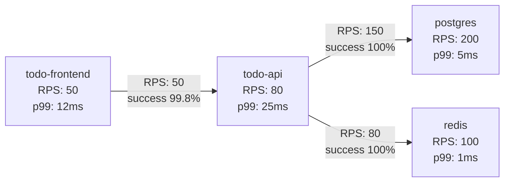
```mermaid
flowchart LR
    fe[todo-frontend<br>RPS: 50<br>p99: 12ms]
    api[todo-api<br>RPS: 80<br>p99: 25ms]
    db[postgres<br>RPS: 200<br>p99: 5ms]
    redis[redis<br>RPS: 100<br>p99: 1ms]
    fe -->|RPS: 50<br>success 99.8%| api
    api -->|RPS: 150<br>success 100%| db
    api -->|RPS: 80<br>success 100%| redis
```

### 10.3 分散トレーシング

ヘッダで `traceparent`(W3C Trace Context)や `b3`(Zipkin)を伝播することで、リクエストが各サービスを通る様子を 1 つのトレースとして見られます。
Service Mesh はヘッダを **転送するだけ** で、トレース ID の生成は通常アプリ側 or Ingress で行います(完全自動ではない)。

OpenTelemetry Collector を間に挟むのが現代的。

---

## 11. 認可ポリシー(L7 認可)

Network Policy は IP / Port レベルですが、Service Mesh は **HTTP メソッド / パス** で認可できます。

### 11.1 Istio AuthorizationPolicy

```yaml
apiVersion: security.istio.io/v1
kind: AuthorizationPolicy
metadata:
  name: todo-api-policy
  namespace: prod
spec:
  selector:
    matchLabels:
      app.kubernetes.io/name: todo-api
  action: ALLOW
  rules:
  - from:
    - source:
        principals: ["cluster.local/ns/prod/sa/todo-frontend"]
    to:
    - operation:
        methods: ["GET", "POST"]
        paths: ["/items", "/items/*"]
  - from:
    - source:
        principals: ["cluster.local/ns/prod/sa/todo-worker"]
    to:
    - operation:
        methods: ["POST"]
        paths: ["/notify"]
```

意味:

- `todo-frontend` の ServiceAccount からは GET/POST `/items*` 可
- `todo-worker` の ServiceAccount からは POST `/notify` 可
- それ以外は **拒否**(implicit deny)

これはネットワーク層よりはるかに細かい制御です。

### 11.2 Linkerd の場合

```yaml
apiVersion: policy.linkerd.io/v1alpha1
kind: ServerAuthorization
metadata:
  name: todo-api-from-frontend
  namespace: prod
spec:
  server:
    name: todo-api-server
  client:
    meshTLS:
      serviceAccounts:
      - namespace: prod
        name: todo-frontend
```

シンプルだが必要十分。

---

## 12. トレードオフと「導入しない」判断

ここまで Service Mesh の便利さを並べましたが、**入れない方がいい場面** も多くあります。

### 12.1 コスト

| 種類 | コスト |
|------|--------|
| **CPU / RAM** | Sidecar 1 つあたり 30-100MB RAM、CPU は無視できる程度〜数 % |
| **レイテンシ** | Sidecar 通過で 0.5〜2ms 増(× 2 = 往復) |
| **学習コスト** | 数週間〜数か月、特に Istio |
| **運用コスト** | 障害切り分けが複雑化(Sidecar が間に挟まる) |
| **アップグレード** | Control Plane と Data Plane の両方を考慮 |

### 12.2 「Service Mesh を入れない方がいい」サイン

- マイクロサービス数が **10 未満**
- 言語が 1 つに統一されている(ライブラリで十分)
- 個別の mTLS / リトライをアプリで実装済み
- 運用チームが **2 名以下**
- クラスタが小さい(20 Pod 以下)

### 12.3 代替手段

| やりたいこと | Service Mesh なしで |
|------------|-----------------|
| Pod 間 mTLS | アプリ側 TLS、cert-manager で証明書発行 |
| L4 認可 | Network Policy |
| L7 認可 | API Gateway(Kong、Tyk、Envoy 単体)|
| メトリクス | Prometheus にアプリから export |
| 分散トレーシング | OpenTelemetry SDK をアプリに組み込み |
| リトライ・タイムアウト | 言語標準ライブラリ(`resilience4j`、`go-resiliency` 等) |
| カナリア | Argo Rollouts、Flagger |

`Argo Rollouts` だけでもかなりのカナリア要件は満たせます。Mesh を入れる前に検討すべき。

### 12.4 段階的導入

入れるなら一気に全部ではなく、

1. まず **観測性のみ** を有効化(Mesh 注入だけ)
2. 数週間運用、安定 → **mTLS PERMISSIVE モード**
3. さらに数週間 → **STRICT モード**
4. 段階的に **L7 認可ポリシー** 追加
5. 必要なところだけ **カナリアやサーキットブレーカ**

を 6 ヶ月単位で進めるのが現実的。

---

## 13. トラブルシューティング

### 13.1 よくある症状と対処

| 症状 | 原因 | 対処 |
|------|------|------|
| Sidecar 注入後にアプリが落ちる | アプリが起動時に外部通信し、Sidecar 未起動 | 起動順序の Init 制御、`holdApplicationUntilProxyStarts: true`(Istio)、Linkerd は自動対処 |
| `READY 1/2` のまま進まない | Sidecar 起動失敗 | `kubectl logs <pod> -c linkerd-proxy` 確認 |
| `503 upstream connect error` | Sidecar が上流を解決できない | DestinationRule / ServiceEntry / Pod ラベル確認 |
| mTLS が有効にならない | Annotation 漏れ、Namespace 設定ミス | `linkerd viz tap` で `tls=true` 確認 |
| L7 認可が効かない | Selector のラベルミス、ポリシー Namespace 違い | `kubectl describe authorizationpolicy` |
| 突然 latency が増えた | Sidecar のリソース不足 | requests/limits 増、Cilium / Ambient 検討 |
| Pod 再起動が増えた | Sidecar の OOMKill | `kubectl describe pod` で OOMKilled を探す |

### 13.2 調査フロー

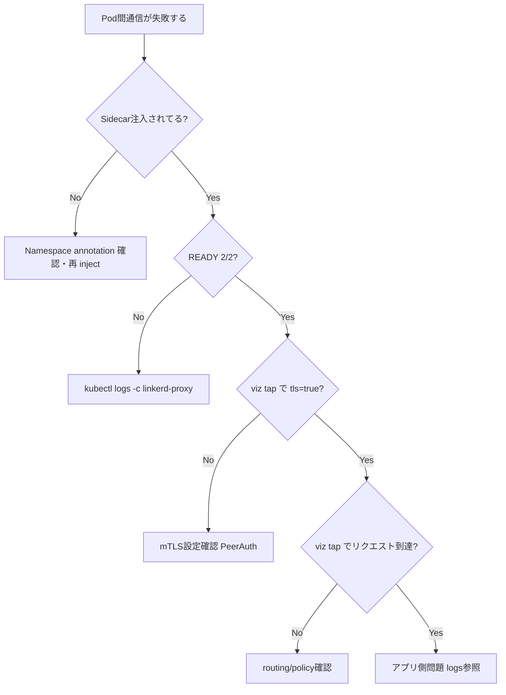
```mermaid
flowchart TB
    s[Pod間通信が失敗する] --> q1{Sidecar注入されてる?}
    q1 -->|No| s1[Namespace annotation 確認・再 inject]
    q1 -->|Yes| q2{READY 2/2?}
    q2 -->|No| s2[kubectl logs -c linkerd-proxy]
    q2 -->|Yes| q3{viz tap で tls=true?}
    q3 -->|No| s3[mTLS設定確認 PeerAuth]
    q3 -->|Yes| q4{viz tap でリクエスト到達?}
    q4 -->|No| s4[routing/policy確認]
    q4 -->|Yes| s5[アプリ側問題 logs参照]
```

### 13.3 デバッグツール

- `linkerd viz tap` ─ リアルタイム HTTP ストリーム
- `linkerd viz top` ─ 各 Service の trafic ランキング
- `istioctl proxy-config <pod>` ─ Sidecar の現在の Envoy 設定をダンプ
- `istioctl analyze` ─ 設定の問題を静的に分析
- `hubble observe` ─ Cilium のフローログ

---

## 14. ハンズオン演習

### 演習 1: カナリアリリースの実装

`todo-api` の v2 を作成し、トラフィックを 90:10 で振り分ける(Linkerd HTTPRoute)。
v2 でわざとエラー率を上げて、`linkerd viz` で v1/v2 の Success Rate 差を観察する。

### 演習 2: mTLS が効いていることの確認

`linkerd viz tap` で `tls=true` を確認。次に Namespace annotation を一時的に外して再起動し、`tls=false` になることを観察(その後元に戻す)。

### 演習 3: 認可ポリシーの実装

`todo-frontend` のみが `todo-api` にアクセスできるようにし、別 Namespace から `curl` で `403` が返ることを確認する。

### 演習 4: サーキットブレーカ動作の観察

`todo-api` を意図的に 5xx を返すよう設定し、サーキットブレーカが発動して `todo-api` Pod が outlier ejection されるのを確認する。

### 演習 5: メッシュなし vs ありでレイテンシ比較

アプリの `/health` エンドポイントに `hey` か `wrk` で負荷を掛けて、Sidecar あり / なしで p99 を比較。
Sidecar 通過分(0.5〜2ms)が見えるはず。

---

## 15. 推奨学習リソース

- **Linkerd 公式**: <https://linkerd.io/2.14/overview/>
- **Istio 公式**: <https://istio.io/latest/docs/>
- **Envoy 公式**: <https://www.envoyproxy.io/docs>
- **Cilium Service Mesh**: <https://cilium.io/use-cases/service-mesh/>
- **SPIFFE**: <https://spiffe.io/>
- **書籍**: "Istio in Action" (Christian Posta 他)、"The Definitive Guide to Cilium" (Liz Rice 他)
- **講演**: Matt Klein "Envoy at Lyft"(YouTube)、William Morgan "Linkerd: Simplifying Service Mesh"(KubeCon)

---

## チェックポイント

ここまでで以下を **自分の言葉で** 説明できるか確認してください。

- [ ] Service Mesh が解決する 5 つの中核機能(mTLS / L7 制御 / 観測性 / 認可 / トレーシング)を挙げられる
- [ ] Service Mesh が生まれた歴史的経緯(Polyglot 問題、Lyft の Envoy、Buoyant の Linkerd)を語れる
- [ ] Sidecar 方式と Sidecarless 方式(eBPF / Ambient)のトレードオフを説明できる
- [ ] Envoy が業界標準データプレーンになった理由(xDS の動的設定能力)を説明できる
- [ ] mTLS と TLS の違い、ServiceAccount を identity に使う仕組みを説明できる
- [ ] SPIFFE ID の構造を理解している
- [ ] サンプルアプリに Linkerd を注入し、`tls=true` を確認する手順を実行できる
- [ ] Istio の主要 CR(VirtualService、DestinationRule、AuthorizationPolicy、PeerAuthentication)の役割を区別できる
- [ ] 「Service Mesh を入れない方が良い」場面の判断基準(規模、言語数、運用人数)を持っている
- [ ] Service Mesh のコスト(リソース、レイテンシ、学習、運用、アップグレード)を説明できる
- [ ] 段階的導入(観測性 → PERMISSIVE → STRICT → 認可)の流れを設計できる

→ 次は [マルチクラスタ]({{ '/12-advanced/multi-cluster/' | relative_url }})
