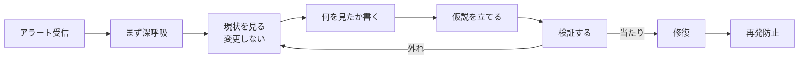
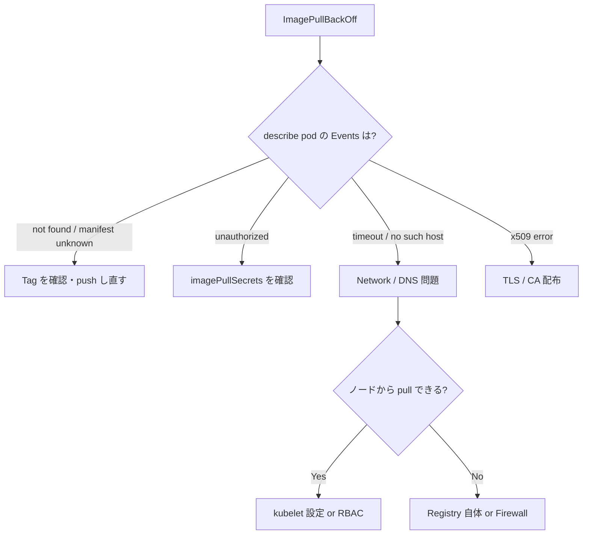
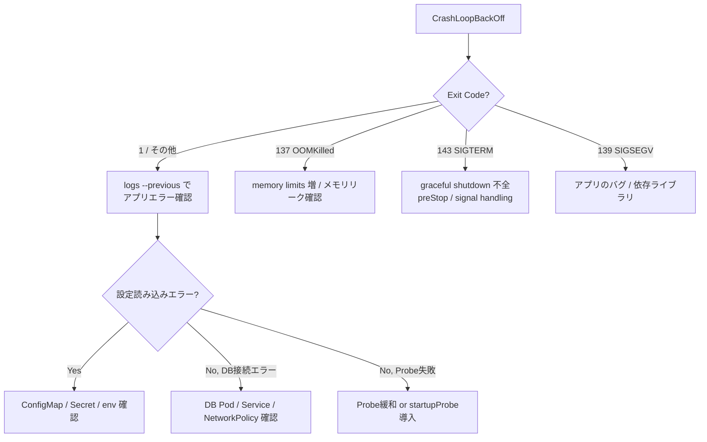
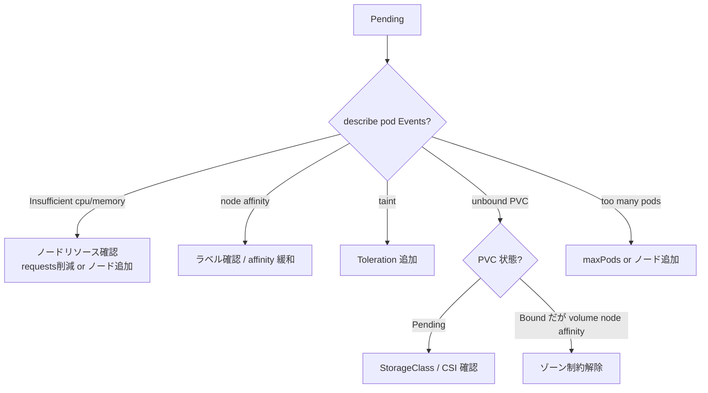
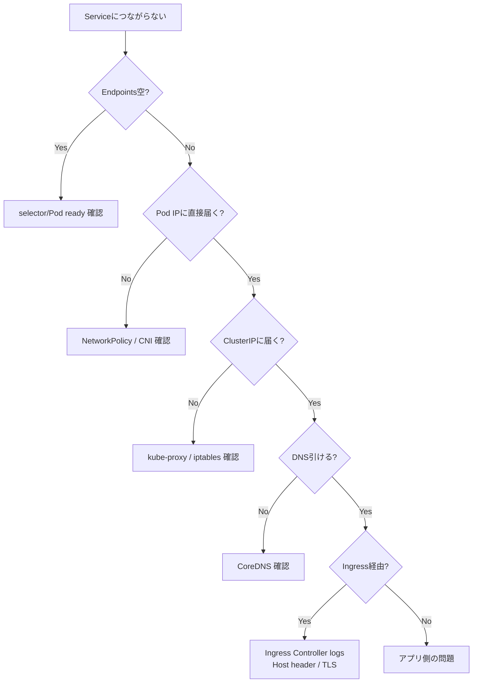
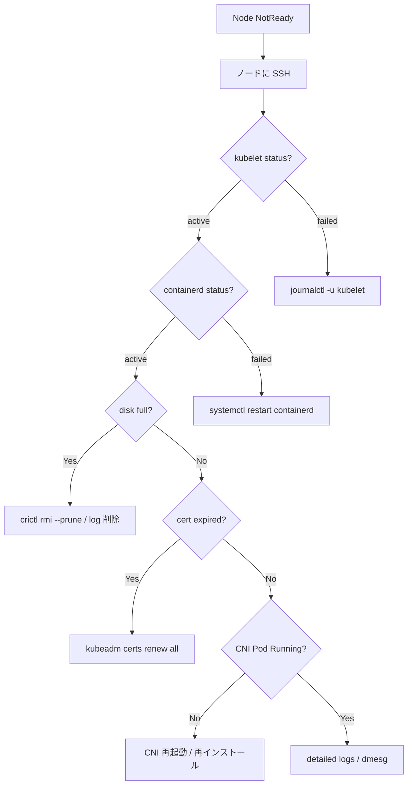

# トラブルシューティング集
{: .no_toc }

## 目次
{: .no_toc .text-delta }

1. TOC
{:toc}

---

## このページのゴール

このページを読み終えると、以下を **自分の言葉で説明できる** ようになります。

- 障害対応の **基本フロー**(観察 → 切り分け → 仮説 → 検証 → 修復 → 再発防止)を実践できる
- 主要な症状(**ImagePullBackOff / CrashLoopBackOff / Pending / Service 到達不能 / NotReady / OOMKill / etcd 遅延 / 証明書期限切れ等**)について、迷わず初動を打てる
- `kubectl describe` / `kubectl logs` / `kubectl get events` / `kubectl debug` / `crictl` / `journalctl` などの **道具を使い分け** できる
- **Pod / Service / Ingress / Node / DNS / Storage / etcd / 証明書** という階層構造で、どこから疑うかが判断できる
- **障害対応 Runbook**(自分専用手順書)の書き方と、それを蓄積する習慣
- 障害対応で「**やってはいけないこと**」(本番で勘でコマンドを打つ、root に sudo で入って手作業する等)

---

## 1. 障害対応の哲学 ─ 心構えと基本フロー

### 1.1 まず深呼吸する

本番で「サービスが落ちました」と言われた直後の **最初の 30 秒** が、その後の収束時間を大きく左右します。
焦って `kubectl delete pod` を打つと、原因がわからないまま再現性も失われ、夜中の運用が地獄になります。



### 1.2 障害対応の基本ステップ

| ステップ | やること | 注意点 |
|---------|--------|--------|
| **1. 観察** | `kubectl get` / `describe` / Events | **まだ変更しない** |
| **2. 切り分け** | どこが壊れてるか領域を絞る | 全体ではなく層で考える |
| **3. 仮説** | 「Probe が厳しすぎる?」「Image 不在?」 | 1 個ずつ |
| **4. 検証** | 別 Pod から curl、`kubectl debug` | **本番に影響しない方法で** |
| **5. 修復** | 仮説が当たれば直す | 1 つずつ |
| **6. 再発防止** | Runbook 更新、監視追加、テスト | 後回しにしがちだが重要 |

### 1.3 「読む」と「動かす」の分離

障害対応中の **最大の失敗パターン** は「同時並行で複数の修正を入れる」こと。
1 つ変えたら効果を確認、ダメなら戻す、を徹底します。

### 1.4 SRE 用語の整理

| 用語 | 意味 |
|------|------|
| **MTTR** (Mean Time To Recovery) | 障害発生から回復までの平均時間 |
| **MTTD** (Mean Time To Detect) | 障害発生から検知までの平均時間 |
| **MTBF** (Mean Time Between Failures) | 障害間隔の平均 |
| **Runbook** | 障害対応手順書 |
| **Postmortem** | 障害後の振り返り文書(blameless が原則) |
| **Blast Radius** | 障害影響範囲 |
| **Toil** | 自動化されていない繰り返し作業 |

「**MTTR を下げるのに最も効くのが Runbook**」。本ページはその Runbook の **業界共通版** です。

---

## 2. 道具箱 ─ コマンドリファレンス

### 2.1 観察系(変更しない)

```bash
# 全 Namespace の落ちてる Pod
kubectl get pods -A --field-selector=status.phase!=Running

# 最近の Events(時系列)
kubectl get events -A --sort-by=.metadata.creationTimestamp | tail -50

# 特定 Pod の詳細
kubectl describe pod <name> -n <ns>

# 特定 Pod のログ(最新)
kubectl logs <pod> -n <ns> --tail=200

# 1つ前の Pod のログ(CrashLoop の調査に必須)
kubectl logs <pod> -n <ns> --previous

# 複数コンテナ Pod の特定 container ログ
kubectl logs <pod> -c <container> -n <ns>

# リアルタイム監視(障害の進行を見たい時)
kubectl get pod -n <ns> -w

# リソース消費
kubectl top pod -n <ns> --sort-by=cpu
kubectl top pod -n <ns> --sort-by=memory
kubectl top node

# ノードの allocatable と requests
kubectl describe node <name> | grep -A 5 "Allocated resources"
```

### 2.2 状態取得系

```bash
# YAML 出力(原型を見たい)
kubectl get pod <name> -n <ns> -o yaml

# JSONPath で値抽出
kubectl get pod <name> -n <ns> -o jsonpath='{.status.containerStatuses[0].state}'

# 全リソースをスナップショット(調査用)
kubectl get all,configmap,secret,pvc,ingress -n <ns> -o yaml > snapshot.yaml
```

### 2.3 動かす系(慎重に)

```bash
# Pod に exec で入る
kubectl exec -it <pod> -n <ns> -- bash
kubectl exec -it <pod> -c <container> -n <ns> -- sh

# debug コンテナで起動(プロダクションイメージを汚さず調査)
kubectl debug -n <ns> <pod> -it --image=nicolaka/netshoot --target=<container>

# port-forward でローカルからアクセス
kubectl port-forward -n <ns> svc/<svc> 8080:80

# 一時的な debug Pod(独立)
kubectl run net --rm -it --image=nicolaka/netshoot -- bash
```

### 2.4 修復系(本当に必要なときだけ)

```bash
# Pod を意図的に再作成(Deployment 配下なら別 Pod が立つ)
kubectl delete pod <name> -n <ns>

# Deployment の rollout 状態
kubectl rollout status deploy/<name> -n <ns>
kubectl rollout history deploy/<name> -n <ns>
kubectl rollout undo deploy/<name> -n <ns>      # 前バージョンに戻す
kubectl rollout undo deploy/<name> -n <ns> --to-revision=3

# Replicas を手動変更
kubectl scale deploy/<name> -n <ns> --replicas=0   # 一旦止める
kubectl scale deploy/<name> -n <ns> --replicas=3

# Node をメンテモードに
kubectl cordon <node>        # 新規 Pod スケジュール禁止
kubectl drain <node> --ignore-daemonsets --delete-emptydir-data
kubectl uncordon <node>      # 戻す
```

### 2.5 ノードレベルの道具

ノードに SSH で入って:

```bash
# kubelet
sudo systemctl status kubelet
sudo journalctl -u kubelet --since "30 min ago" -f

# containerd
sudo systemctl status containerd
sudo crictl ps
sudo crictl logs <container-id>
sudo crictl pull <image>

# ディスク
df -h
du -sh /var/lib/containerd
du -sh /var/log

# CPU/Memory
top
htop
free -h
vmstat 1

# ネットワーク
ip addr
ip route
ss -tnlp
iptables -t nat -L | grep <svc-cluster-ip>
```

### 2.6 便利ツール(別途インストール)

| ツール | 用途 |
|--------|------|
| **k9s** | TUI で kubectl を高速化 |
| **stern** | 複数 Pod のログを stream で集約 |
| **kubectx / kubens** | コンテキスト・Namespace 切替 |
| **kube-ps1** | プロンプトに現在の context 表示 |
| **kubectl-tree** | リソース依存関係を木構造で表示 |
| **kubectl-debug** | 古い K8s でも debug 機能 |
| **netshoot** | Network 調査用 docker image |

---

## 3. 症状 ─ ImagePullBackOff / ErrImagePull

### 3.1 何が起きているか

Pod の status が `ImagePullBackOff`(または `ErrImagePull`)になっている状態。
イメージを Pull できないため、コンテナが起動できない。

```bash
$ kubectl get pod -n prod
NAME                  READY   STATUS             RESTARTS   AGE
todo-api-7d8-abc123   0/1     ImagePullBackOff   0          2m
```

### 3.2 確認すべきこと

```bash
kubectl describe pod todo-api-7d8-abc123 -n prod
```

`Events:` の末尾を読む:

```
Events:
  Type     Reason     Age   From               Message
  ----     ------     ----  ----               -------
  Normal   Scheduled  2m    default-scheduler  Successfully assigned prod/todo-api-7d8-abc123 to k8s-w1
  Normal   Pulling    1m    kubelet            Pulling image "192.168.56.10:5000/todo-api:0.1.0"
  Warning  Failed     1m    kubelet            Failed to pull image "192.168.56.10:5000/todo-api:0.1.0": rpc error: code = NotFound desc = ...
  Warning  Failed     1m    kubelet            Error: ErrImagePull
  Normal   BackOff    50s   kubelet            Back-off pulling image ...
  Warning  Failed     50s   kubelet            Error: ImagePullBackOff
```

### 3.3 原因の典型と対処

| 症状 | 原因 | 対処 |
|------|------|------|
| `manifest unknown` / `not found` | Tag が存在しない、typo | `crictl pull <image>` で確認 |
| `unauthorized` / `denied` | imagePullSecrets 不足、認証情報切れ | Secret 確認 |
| `connection refused` / `timeout` | Registry に到達できない | DNS / firewall / Registry サーバ自体 |
| `x509: certificate signed by unknown authority` | TLS 証明書を kubelet が信頼してない | CA 配布、`insecure-registries` 設定 |
| Image is `latest` and changed | キャッシュにあるが、サーバ側で消えた | `imagePullPolicy: IfNotPresent` か、tag を明示 |
| 本書のローカル Registry に push し忘れ | 単純なミス | `docker push 192.168.56.10:5000/todo-api:0.1.0` |

### 3.4 検証ステップ

#### Step 1: ノードから直接 pull できるか

```bash
ssh k8s-w1
sudo crictl pull 192.168.56.10:5000/todo-api:0.1.0
```

成功するなら、kubelet 設定 or 認証問題。失敗するなら Registry / Network 問題。

#### Step 2: debug Pod から Registry に届くか

```bash
kubectl run net --rm -it --image=nicolaka/netshoot -- bash
curl -k https://192.168.56.10:5000/v2/
# 200 OK が返れば届く
nslookup 192.168.56.10
```

#### Step 3: Registry 上にイメージが存在するか

```bash
curl -k https://192.168.56.10:5000/v2/todo-api/tags/list
# {"name":"todo-api","tags":["0.1.0","0.2.0"]}
```

### 3.5 imagePullSecrets の確認

Private Registry なら:

```yaml
spec:
  imagePullSecrets:
  - name: registry-creds
```

Secret の中身が正しいか:

```bash
kubectl get secret registry-creds -n prod -o jsonpath='{.data.\.dockerconfigjson}' | base64 -d
# {"auths":{"192.168.56.10:5000":{"auth":"...","username":"...","password":"..."}}}
```

### 3.6 調査フロー



---

## 4. 症状 ─ CrashLoopBackOff

### 4.1 何が起きているか

コンテナが起動 → 即座にクラッシュ → 再起動を繰り返している状態。
`RESTARTS` が増えていく:

```bash
$ kubectl get pod -n prod
NAME                  READY   STATUS             RESTARTS   AGE
todo-api-7d8-xyz789   0/1     CrashLoopBackOff   7          5m
```

### 4.2 確認すべきこと

```bash
# 最新のログ
kubectl logs todo-api-7d8-xyz789 -n prod --tail=200

# 1 つ前の Pod 起動時のログ(CrashLoop は前のが重要)
kubectl logs todo-api-7d8-xyz789 -n prod --previous

# describe で状態
kubectl describe pod todo-api-7d8-xyz789 -n prod
```

`describe` の `Last State` を見る:

```
Last State:     Terminated
  Reason:       Error             # ← 重要
  Exit Code:    1                  # ← 重要
  Started:      Wed, 15 May 2026 10:30:15 +0900
  Finished:     Wed, 15 May 2026 10:30:20 +0900
```

### 4.3 Exit Code の意味

| Exit Code | 意味 |
|-----------|------|
| **0** | 正常終了 |
| **1** | 一般的なアプリエラー(Stacktrace を logs で確認) |
| **2** | シェルの構文エラー |
| **126** | コマンド見つかったが実行不可 |
| **127** | コマンド not found |
| **128 + N** | シグナル N で終了(例: 137 = SIGKILL、143 = SIGTERM) |
| **137** | **OOMKilled**(または kubectl delete 後の force) |
| **139** | SIGSEGV(セグフォ) |
| **143** | SIGTERM(graceful shutdown)|

### 4.4 原因の典型と対処

| 原因 | 確認方法 | 対処 |
|------|---------|------|
| アプリ起動エラー(設定不足、DB 接続失敗) | logs --previous | env / configmap / secret 確認 |
| Liveness Probe が厳しすぎ | describe の Events で Killed by Liveness | initialDelaySeconds 増、threshold 緩和 |
| Readiness Probe が通らない | describe で `Readiness probe failed` | アプリの /healthz 実装確認 |
| OOMKilled(137) | describe で OOMKilled | memory limits 増 |
| Init Container 失敗 | initContainer logs | 初期化ロジック確認 |
| Image の entrypoint 違い | 1 行で終わるログ | Dockerfile CMD 確認 |
| 起動時間が長すぎて Liveness で killed | logs と probe 設定 | startupProbe を導入 |
| PreStop / TerminationGrace の不整合 | logs に SIGTERM 受信記録 | preStop / signal handling 確認 |

### 4.5 Probe トラブル深掘り

```yaml
livenessProbe:
  httpGet: {path: /healthz, port: 8080}
  initialDelaySeconds: 30        # 起動猶予(短すぎると殺される)
  periodSeconds: 10              # チェック間隔
  timeoutSeconds: 5              # 応答待ち
  failureThreshold: 3            # 連続失敗回数(殺すまで)
  successThreshold: 1
```

#### 起動が遅いアプリには startupProbe

Java の Spring Boot 等、起動に 60-120 秒かかるアプリは:

```yaml
startupProbe:
  httpGet: {path: /healthz, port: 8080}
  failureThreshold: 30           # 30 × 10s = 300s まで起動を待つ
  periodSeconds: 10
livenessProbe:
  httpGet: {path: /healthz, port: 8080}
  periodSeconds: 10
  failureThreshold: 3            # 起動後は厳しめでOK
```

startupProbe があると、それが成功するまで liveness が走らない。

### 4.6 「ぐるぐる回って logs が読めない」

CrashLoopBackOff の Pod は短時間しか存在しないので、ログを取りそびれることがあります。

#### 対策 1: --previous

```bash
kubectl logs <pod> --previous
```

#### 対策 2: command を上書きして調査モードで起動

```bash
kubectl debug -it <pod> --copy-to=<pod>-debug --container=<container> \
  --image=<original-image> -- sleep 3600
```

Sleep に変えて起動 → exec で中に入って手動デバッグ。

#### 対策 3: Deployment を編集

```yaml
spec:
  template:
    spec:
      containers:
      - name: app
        command: ["sleep", "3600"]    # 一時的に
```

中身を調べて、終わったら戻す。

### 4.7 調査フロー



---

## 5. 症状 ─ Pending のまま動かない

### 5.1 何が起きているか

Pod がスケジュールされず、ノードに乗っていない状態。

```bash
$ kubectl get pod -n prod
NAME                  READY   STATUS    RESTARTS   AGE
todo-api-7d8-abc123   0/1     Pending   0          5m
```

`describe` の Events を見る:

```
Events:
  Type     Reason            Age    From               Message
  ----     ------            ----   ----               -------
  Warning  FailedScheduling  5m     default-scheduler  0/3 nodes are available: 3 Insufficient cpu.
```

### 5.2 原因の典型と対処

| メッセージ | 原因 | 対処 |
|-----------|------|------|
| `Insufficient cpu` / `memory` | リソース不足 | requests 減らす / ノード追加 |
| `didn't match Pod's node affinity` | nodeAffinity がマッチしない | ラベル付け or affinity 緩和 |
| `had taint X that the pod didn't tolerate` | Taint があり Toleration なし | Toleration 追加 |
| `pod has unbound immediate PersistentVolumeClaims` | PVC が Pending | PVC / StorageClass 確認 |
| `volume node affinity conflict` | PV のゾーンと Pod 配置が衝突 | StorageClass の AllowedTopologies |
| `0/N nodes are available: N node(s) had untolerated taint` | 専用ノードに toleration なし | toleration 設定 |
| `0/N nodes are available: N too many pods` | ノードあたり Pod 上限 110 を超過 | ノード追加 or `maxPods` 引き上げ |

### 5.3 リソース不足を深掘り

```bash
# ノードの allocatable と現状
kubectl describe node k8s-w1 | grep -A 5 "Allocated resources"

# 出力例:
# Allocated resources:
#   Resource  Requests    Limits
#   cpu       3500m (87%) 8000m (200%)
#   memory    6Gi (75%)   12Gi (150%)
#   pods      28 (25%)
```

「**CPU 87%** が requests で予約済み」── ここに `requests: 1000m` の Pod は乗らない。

選択肢:

1. **Pod の requests を減らす**(過剰要求の見直し、コスト最適化ページ参照)
2. **ノードを追加**(物理 / Cluster Autoscaler)
3. **既存 Pod を退避**(優先度が低いものを止める)

### 5.4 PVC Pending

```bash
kubectl get pvc -n prod
# NAME           STATUS    VOLUME   ...
# data-postgres  Pending

kubectl describe pvc data-postgres -n prod
# Events:
#   Warning  ProvisioningFailed  ...  storage class "nfs" not found
```

確認順:

```bash
kubectl get sc                    # StorageClass 存在?
kubectl get sc -o yaml            # IsDefaultClass annotation?
kubectl get pv                    # PV はある?
kubectl describe sc nfs           # provisioner が動いてる?
kubectl get pod -n kube-system | grep csi    # CSI Driver Pod が Running?
```

### 5.5 Taint / Toleration の確認

```bash
# ノードの Taint 一覧
kubectl get node -o jsonpath='{range .items[*]}{.metadata.name}{": "}{.spec.taints}{"\n"}{end}'

# 例:
# k8s-cp1: [{"effect":"NoSchedule","key":"node-role.kubernetes.io/control-plane"}]
# k8s-w1: null
```

Control Plane ノードには通常 `NoSchedule` の Taint がついていて、普通の Pod は乗りません。
それを意図的に乗せたい場合(DaemonSet 等):

```yaml
tolerations:
- key: node-role.kubernetes.io/control-plane
  operator: Exists
  effect: NoSchedule
```

### 5.6 調査フロー



---

## 6. 症状 ─ Service につながらない

### 6.1 何が起きているか

「Pod は動いているのに、Service 経由でアクセスできない」状態。
原因が **複数の層** にまたがるので、層ごとに切り分けます。

### 6.2 切り分けの 7 ステップ

#### Step 1: Service の Endpoints が空でないか

```bash
kubectl get endpoints todo-api -n prod
# NAME       ENDPOINTS                           AGE
# todo-api   10.244.1.5:8080,10.244.2.10:8080   2h
```

空 (`<none>`) なら、

- Service の selector と Pod のラベルが不一致
- Pod が Ready でない(Readiness Probe 失敗)

#### Step 2: Pod のラベルを確認

```bash
kubectl get pod -n prod --show-labels | grep todo-api
kubectl get svc todo-api -n prod -o yaml | grep -A 3 selector
```

#### Step 3: Pod 自体に到達できるか

```bash
# 直接 Pod IP に curl(debug Pod から)
kubectl run net --rm -it --image=nicolaka/netshoot -- bash
curl -v 10.244.1.5:8080/healthz
```

#### Step 4: Service ClusterIP に到達できるか

```bash
nc -zv todo-api.prod.svc 8080
curl -v http://todo-api.prod.svc:8080/healthz
```

#### Step 5: DNS が引けるか

```bash
nslookup todo-api.prod.svc.cluster.local
# Address: 10.96.45.20  (ClusterIP)

# 引けない場合
nslookup kubernetes.default
# これも引けないなら CoreDNS 問題
```

CoreDNS の状態:

```bash
kubectl get pod -n kube-system | grep coredns
kubectl logs -n kube-system -l k8s-app=kube-dns --tail=50
```

#### Step 6: NetworkPolicy で遮断されていないか

```bash
kubectl get networkpolicy -A
kubectl describe networkpolicy <name> -n <ns>
```

NetworkPolicy は **デフォルト deny / 暗黙 allow** の区別が大事。`policyTypes` を見て、Ingress/Egress どちらが効いているか確認。

#### Step 7: kube-proxy / iptables / IPVS

```bash
# kube-proxy の状態
kubectl get pod -n kube-system | grep kube-proxy
kubectl logs -n kube-system -l k8s-app=kube-proxy | grep <svc-cluster-ip>

# ノードで iptables 確認
ssh k8s-w1
sudo iptables -t nat -L KUBE-SERVICES | grep todo-api
# 該当のルールがあるか
```

### 6.3 NodePort / LoadBalancer の追加ステップ

```bash
# NodePort なら、ノードの該当ポートに直接
curl http://192.168.56.21:31234

# LoadBalancer なら、EXTERNAL-IP を確認
kubectl get svc -n prod todo-api
# NAME       TYPE           CLUSTER-IP   EXTERNAL-IP        PORT(S)
# todo-api   LoadBalancer   10.96.45.20  192.168.56.201     80:31234/TCP

curl http://192.168.56.201
```

MetalLB なら:

```bash
kubectl logs -n metallb-system -l app=metallb -l component=speaker
```

### 6.4 Ingress 経由の場合

```bash
# Ingress の状態
kubectl describe ingress todo -n prod

# Ingress Controller のログ
kubectl logs -n ingress-nginx deploy/ingress-nginx-controller --tail=100

# 外部から curl(L7)
curl -H "Host: todo.example.com" http://<ingress-lb-ip>/
```

### 6.5 調査フロー



---

## 7. 症状 ─ ノードが NotReady

### 7.1 何が起きているか

```bash
$ kubectl get node
NAME      STATUS      ROLES           AGE   VERSION
k8s-cp1   Ready       control-plane   30d   v1.30.1
k8s-cp2   Ready       control-plane   30d   v1.30.1
k8s-cp3   NotReady    control-plane   30d   v1.30.1
k8s-w1    Ready       <none>          30d   v1.30.1
...
```

```bash
kubectl describe node k8s-cp3
# Conditions:
#   Type             Status  Reason
#   ----             ------  ------
#   MemoryPressure   False
#   DiskPressure     True    DiskFreeKubeletPLG  ← Disk pressure
#   PIDPressure      False
#   Ready            False   KubeletNotReady
```

### 7.2 ノードに SSH で入る

```bash
ssh k8s-cp3

# kubelet が動いているか
sudo systemctl status kubelet
# Active: failed (Result: exit-code) since ...

sudo journalctl -u kubelet --since "30 min ago" --no-pager | tail -100
```

### 7.3 原因の典型と対処

| 症状 | 原因 | 対処 |
|------|------|------|
| kubelet が停止 | crash、設定ミス | `journalctl -u kubelet` でエラー確認 |
| containerd が停止 | crash、ディスク不足 | `systemctl restart containerd` |
| ディスク満杯 | log / image / volume | `df -h`、不要 image 削除 `crictl rmi --prune` |
| メモリ不足 | OOM、リーク | `free -h`、`dmesg | grep -i kill` |
| 時刻ずれ | NTP 未設定 | `timedatectl`、NTP 再同期 |
| 証明書期限切れ | 1 年経過 | `kubeadm certs renew all` |
| Network 問題 | CNI 異常 | `kubectl -n kube-system get pod | grep <cni>` |
| swap が ON | kubelet が拒否 | `swapoff -a` |
| /var/lib/kubelet が壊れた | ファイル破損 | drain → 再加入 |

### 7.4 ディスク満杯対応

```bash
df -h
# 容量を喰っている場所を特定

du -sh /var/lib/containerd /var/log /var/lib/kubelet
```

containerd の不要 image 削除:

```bash
sudo crictl rmi --prune
```

journal log の圧縮 / 削除:

```bash
sudo journalctl --vacuum-size=500M
sudo journalctl --vacuum-time=7d
```

### 7.5 証明書期限切れ

kubeadm でクラスタを建てた場合、各種証明書(API Server、etcd、kubelet 等)に **1 年の有効期限**。

```bash
# 確認
sudo kubeadm certs check-expiration

# CERTIFICATE                                EXPIRES                  RESIDUAL TIME
# admin.conf                                 May 15, 2026 10:00 UTC   89d
# apiserver                                  May 15, 2026 10:00 UTC   89d   no   ca   no
# apiserver-etcd-client                      May 15, 2026 10:00 UTC   89d
# ...
```

期限切れ前に renew:

```bash
sudo kubeadm certs renew all
# 各種コンポーネントは再起動が必要
sudo systemctl restart kubelet
# Static Pod (kube-apiserver, etcd 等) は自動再読み込みするはずだが、念のため
sudo crictl ps | grep -E "kube-apiserver|etcd|kube-controller-manager|kube-scheduler"
```

ベストプラクティス: **kubeadm upgrade を年 1 回は実行** すると、証明書も自動更新されます。

### 7.6 調査フロー



---

## 8. 症状 ─ メモリリーク / OOMKill

### 8.1 何が起きているか

```bash
kubectl describe pod todo-api-7d8-abc -n prod
# Last State:
#   Reason:   OOMKilled
#   Exit Code: 137
```

メモリ使用が limits を超えて、kernel に殺された状態。

### 8.2 原因の切り分け

#### 1. アプリ側のメモリリーク

```bash
# 過去の memory 推移を Prometheus / Grafana で確認
sum by (pod) (container_memory_working_set_bytes{namespace="prod", pod=~"todo-api.*"})
```

時間とともに **単調増加** している場合、アプリのリーク。プロファイラ(pprof、py-spy、JFR 等)で原因特定。

#### 2. limits が低すぎる

実測の peak より limits が小さい場合は、シンプルに増やす:

```yaml
resources:
  requests: {cpu: 100m, memory: 200Mi}
  limits: {cpu: 500m, memory: 500Mi}    # ← 増やす
```

VPA Recommender や Goldilocks の推奨値を参考に。

#### 3. memory.limits の罠

Linux の memory limits は **page cache 込み** で測ります。アプリの heap だけでなく:

- ファイル読み込みの page cache
- mmap'd ファイル
- /dev/shm 上のファイル

これらが limits を圧迫することがある。

### 8.3 メモリ調査

#### Pod 内でリアルタイムに

```bash
kubectl exec -it <pod> -n <ns> -- bash
free -h
top
ps auxf
cat /proc/<pid>/status | grep -E "VmRSS|VmSize"
```

#### dmesg で kernel メッセージ

```bash
ssh <node>
sudo dmesg | grep -i "killed process"
# [12345.678] Out of memory: Killed process 67890 (python) total-vm:1234567kB, anon-rss:898765kB, file-rss:1234kB
```

### 8.4 対処

| 原因 | 対処 |
|------|------|
| アプリのリーク | プロファイリング → コード修正 |
| limits 低すぎ | VPA 推奨値で増やす |
| page cache 圧迫 | アプリのメモリプロファイル設計を見直し |
| ピーク時のスパイク | limits を 1.5x にする、HPA でスケールアウト |

---

## 9. 症状 ─ API Server が遅い

### 9.1 何が起きているか

`kubectl get pods` が 10 秒以上かかる、Argo CD の Sync がやたら遅い、apiserver_request_duration_seconds の p99 が 1s 超え、等。

### 9.2 確認

```bash
# API Server の latency メトリクス
kubectl get --raw /metrics | grep apiserver_request_duration_seconds_bucket | head -20

# etcd の latency
kubectl exec -n kube-system etcd-k8s-cp1 -- etcdctl \
  --endpoints=https://127.0.0.1:2379 \
  --cacert=/etc/kubernetes/pki/etcd/ca.crt \
  --cert=/etc/kubernetes/pki/etcd/server.crt \
  --key=/etc/kubernetes/pki/etcd/server.key \
  endpoint status -w table
```

### 9.3 原因の典型と対処

| 原因 | 確認 | 対処 |
|------|------|------|
| etcd が遅い | etcd の WAL fsync latency | SSD へ移行、etcd separate node |
| 大量の Watch クライアント | Argo CD、Prometheus、Operator 多数 | 統合 / sharding |
| 巨大なリスト要求 | `kubectl get pods -A` で 30 秒 | client-go の pagination 利用 |
| 大量のオブジェクト | `kubectl get crd` で 1000 個 | 不要 CRD 削除 |
| ネットワーク遅延 | API Server <-> etcd 経路 | 同一ノード or 専用 NW |

### 9.4 対策

```yaml
# kube-apiserver の引数
- --max-requests-inflight=400              # デフォ 200
- --max-mutating-requests-inflight=200     # デフォ 100
- --watch-cache-sizes=secrets#500,configmaps#500
```

etcd:

- Disk は SSD 必須(HDD だと WAL fsync が致命的)
- etcd は **Control Plane と同居** ではなく、できれば **専用ノード**(Stacked vs External)
- defragmentation を月 1 で実行

```bash
# defrag
etcdctl defrag --cluster
```

---

## 10. 症状 ─ etcd 関連

### 10.1 「etcdserver: mvcc: database space exceeded」

etcd のディスクスペースが上限(デフォルト 2GB、本書では 8GB に設定推奨)に達した。

```bash
# 確認
kubectl exec -n kube-system etcd-k8s-cp1 -- etcdctl --endpoints=... endpoint status -w table

# DBSize と DBSize In Use を確認
```

### 10.2 対処

```bash
# 1. defrag
etcdctl defrag --cluster

# 2. リテンション短縮
# kube-apiserver の引数で
- --event-ttl=1h

# 3. compaction(古いリビジョン削除)
etcdctl compact <revision>
```

### 10.3 etcd メンバ脱落

```bash
etcdctl member list
# 1個落ちている

# 復旧手順
etcdctl member remove <id>
etcdctl member add <name> --peer-urls=https://<new-ip>:2380
```

(本書の HA 構成では 3 メンバ、1 個落ちても動く)

---

## 11. 症状 ─ Argo CD が sync しない

### 11.1 確認

```bash
argocd app get <app-name>
# Status の Health / Sync を確認

kubectl logs -n argocd deploy/argocd-application-controller --tail=100
kubectl logs -n argocd deploy/argocd-repo-server --tail=100
```

### 11.2 原因の典型

| 症状 | 原因 | 対処 |
|------|------|------|
| `Authentication required` | リポジトリ認証エラー | Secret / SSH key 更新 |
| `Unable to resolve manifests` | kustomize/helm エラー | ローカルで `kustomize build` 検証 |
| `namespace not found` | destination namespace 未作成 | syncOptions に CreateNamespace=true |
| Diff があるが prune が無い | syncPolicy.automated.prune が false | Policy 修正 or 手動 sync |
| Stuck on Progressing | Health Check が通らない | アプリ側の readiness 確認 |
| `target revision not found` | branch / tag 違い | Application の targetRevision 確認 |
| selfHeal が暴れる | 手動変更したリソースが戻される | 仕様。手動変更は Git 経由で |

### 11.3 強制 sync

```bash
argocd app sync <app> --force
argocd app sync <app> --replace
```

---

## 12. 症状 ─ DNS 不調

### 12.1 確認

```bash
kubectl exec -n prod <any-pod> -- nslookup kubernetes.default
# Server: 10.96.0.10
# Address: 10.96.0.10:53
# Name: kubernetes.default.svc.cluster.local
# Address: 10.96.0.1
```

引けないなら CoreDNS 問題。

```bash
kubectl get pod -n kube-system -l k8s-app=kube-dns
kubectl logs -n kube-system -l k8s-app=kube-dns --tail=100
```

### 12.2 原因

| 症状 | 原因 |
|------|------|
| `i/o timeout` | CoreDNS Pod の不調 / 上流 DNS の不調 |
| `server misbehaving` | Corefile の plugin error |
| 外部ドメイン解決失敗 | upstream forward 設定 |
| 一部ノードからのみ失敗 | conntrack 枯渇 |
| 5s タイムアウトが頻発 | conntrack race(古い問題)|

### 12.3 conntrack

```bash
ssh <node>
sudo conntrack -L | wc -l
# 100000 とか出たら多すぎ

sudo sysctl -w net.netfilter.nf_conntrack_max=524288
```

### 12.4 CoreDNS の chaos plugin で診断

```yaml
# CoreDNS の ConfigMap
data:
  Corefile: |
    .:53 {
        errors
        log . { class denial error }      # 詳細ログ
        health
        ready
        kubernetes cluster.local in-addr.arpa ip6.arpa { ... }
        forward . /etc/resolv.conf
        cache 30
    }
```

`log` plugin を一時的に入れてリクエスト・エラーを観察。

---

## 13. 症状 ─ Ingress / TLS 系

### 13.1 「No service available」 / 404

```bash
kubectl describe ingress <name> -n <ns>
# Rules:
#   Host                Path  Backends
#   todo.example.com    /     todo-frontend:80
```

- Backend の Service / Endpoint が空でないか
- Host header が一致するか(curl -H "Host: todo.example.com")
- TLS の証明書設定

### 13.2 TLS 証明書

cert-manager 使用時:

```bash
kubectl get certificate -n prod
kubectl describe certificate <name> -n prod
kubectl describe challenge -n prod        # ACME 認証の進行
kubectl logs -n cert-manager deploy/cert-manager --tail=100
```

よくある原因:

- DNS-01 challenge の DNS 設定不備
- HTTP-01 challenge の port 80 到達不能
- rate limit(Let's Encrypt の制限)
- Cluster Issuer 設定ミス

### 13.3 Ingress Controller のログ

```bash
kubectl logs -n ingress-nginx deploy/ingress-nginx-controller --tail=200 | grep <ip>
```

---

## 14. 症状 ─ ストレージ系

### 14.1 PVC が Pending

第 5 章で扱いましたが、復習:

```bash
kubectl describe pvc <name> -n <ns>
# Events を読む

kubectl get sc                              # StorageClass 存在?
kubectl get pod -n kube-system | grep csi   # CSI Driver 動作?
```

### 14.2 ボリュームマウント失敗

```
Warning  FailedMount  ...  MountVolume.SetUp failed for volume "...": mount failed: exit status 32
```

- NFS サーバ到達不能
- export 設定が違う
- ファイアウォール

### 14.3 PV の orphan(Released だが残ってる)

`reclaimPolicy: Retain` の PV は、PVC 削除後も残ります。

```bash
kubectl get pv | grep Released
# 不要なら手動削除
kubectl delete pv <name>
```

### 14.4 ディスク満杯(PVC 内)

```bash
kubectl exec -n <ns> <pod> -- df -h
# /dev/...   5.0G  4.9G  0.1G  98% /data
```

PVC の `resize` で拡張(StorageClass が allowVolumeExpansion: true 必要):

```bash
kubectl patch pvc <name> -n <ns> -p '{"spec":{"resources":{"requests":{"storage":"10Gi"}}}}'
```

---

## 15. Stuck Terminating

### 15.1 「Pod / Namespace が Terminating のまま消えない」

```bash
kubectl get pod <name> -n <ns>
# STATUS: Terminating (5 minutes)
```

原因の典型:

- **Finalizer が外れない**(Operator が死んでて後始末できない)
- **Volume detach 失敗**(CSI 不調)
- **Network 切断中**

### 15.2 確認

```bash
kubectl get pod <name> -n <ns> -o yaml | grep -A 5 finalizers
```

### 15.3 強制削除(最終手段)

```bash
# Finalizer を消す(後始末されない、注意)
kubectl patch pod <name> -n <ns> -p '{"metadata":{"finalizers":null}}'

# それでも消えなければ強制
kubectl delete pod <name> -n <ns> --grace-period=0 --force
```

Namespace が Terminating で消えない場合:

```bash
# Namespace の finalizers を空に(注意)
kubectl get ns <name> -o json | jq '.spec.finalizers = []' | \
  kubectl replace --raw "/api/v1/namespaces/<name>/finalize" -f -
```

これは最終手段。後始末されない外部リソース(クラウド LB、PVC バックアップ等)が残るので、原因究明が先。

---

## 16. パフォーマンス調査

### 16.1 Pod のリソース消費

```bash
kubectl top pod -n <ns> --sort-by=cpu
kubectl top pod -n <ns> --sort-by=memory

# 履歴を見るなら Prometheus
```

### 16.2 CPU throttling

CPU limits があると、limits を超えた瞬間 throttled(スロットリング)される。

```promql
rate(container_cpu_cfs_throttled_periods_total[5m])
/
rate(container_cpu_cfs_periods_total[5m])
```

10% を超えたら危険サイン。limits 引き上げ or 削除を検討。

### 16.3 アプリのプロファイリング

- Go: pprof エンドポイントを Pod 内で公開、port-forward でプロファイリング
- Python: py-spy、cProfile
- Java: JFR (Java Flight Recorder)、Async Profiler
- Node.js: clinic

---

## 17. 即席チートシート

ここまでの内容のエッセンスを 1 ページで。

```bash
#### 状態確認
kubectl get pods -A --field-selector=status.phase!=Running   # 落ちてる Pod
kubectl get events -A --sort-by=.metadata.creationTimestamp | tail -30
kubectl top pod -A --sort-by=cpu
kubectl top node

#### 個別調査
kubectl describe pod <name> -n <ns>          # Events を必ず読む
kubectl logs <pod> -n <ns> --tail=200
kubectl logs <pod> -n <ns> --previous        # CrashLoop の前回
kubectl logs <pod> -c <container> -n <ns>    # 複数 container

#### 動かす
kubectl exec -it <pod> -n <ns> -- bash
kubectl debug -n <ns> <pod> --image=nicolaka/netshoot --target=<container>
kubectl run net --rm -it --image=nicolaka/netshoot -- bash
kubectl port-forward -n <ns> svc/<svc> 8080:80

#### Rollback
kubectl rollout history deploy/<name> -n <ns>
kubectl rollout undo deploy/<name> -n <ns>
kubectl rollout undo deploy/<name> -n <ns> --to-revision=3

#### ノード
kubectl cordon <node>
kubectl drain <node> --ignore-daemonsets --delete-emptydir-data
kubectl uncordon <node>

#### 全リソーススナップショット(調査用)
kubectl get all,configmap,secret,pvc,ingress -n <ns> -o yaml > snapshot.yaml

#### ノード上で
ssh <node>
sudo systemctl status kubelet
sudo journalctl -u kubelet --since "30 min ago" -f
sudo crictl ps | grep <pod-name-prefix>
sudo crictl logs <container-id>
df -h
free -h
```

---

## 18. やってはいけないこと

最後に **絶対に避けるべき** ことを列挙します。

### 18.1 本番で「とりあえず」 delete pod / restart

- 原因がわからないまま再起動 → 再現性が失われる
- 同じ問題が深夜に再発し、再現できなくて泣く

### 18.2 本番に直接 kubectl edit でリソース改変

- Git にない変更は selfHeal で戻される(Argo CD 環境)
- 残ったら次の deploy で消える
- **必ず Git で管理、PR レビュー経由**

### 18.3 etcd を手で書き換える

- バックアップ無しで操作 → クラスタ全壊
- どうしても必要なら、必ず先にバックアップ

```bash
etcdctl snapshot save /backup/etcd-$(date +%Y%m%d).db
```

### 18.4 finalizer を雑に外す

- 外したらクラウドリソース / 外部 DB が後始末されない
- 後で「あの IAM ロールが消えてない」「Disk が残ってる」が発覚

### 18.5 デバッグ用に root で SSH して /etc/ を編集

- 設定がコード管理外になる
- 次に他の人が変更したら戻る、または完全に壊れる

### 18.6 「とりあえず権限を全部つける」

- ServiceAccount に cluster-admin → 横展開で全部壊せる状態
- **最小権限の原則**(本書 9 章参照)

### 18.7 障害対応中に複数のことを並行で変える

- 効いたのか、何が直したのか分からなくなる
- **1 つずつ、効果を確認してから次へ**

### 18.8 ポストモーテムを書かない

- 同じ障害が半年後に起きる
- チーム内の暗黙知が誰かの退職で消える

---

## 19. 障害対応 Runbook の書き方

### 19.1 テンプレ

各障害シナリオは、こういう形で社内に蓄積します。

```markdown
# Runbook: Postgres プライマリ Pod 喪失

## 症状
- `kubectl get cluster postgres -n prod` で `Failing over to xxx` が継続
- アプリの DB 接続が一時的に失敗(re-connect で復旧)

## 初動(5 分以内)
1. アラート確認 → Slack #ops に投稿
2. `kubectl get cluster -n prod postgres` で現状確認
3. `kubectl get pod -n prod -l cnpg.io/cluster=postgres`

## 切り分け
- Pod の Events、logs 確認
- ノード障害ならノード自体を確認 (`kubectl get node`)
- ストレージ問題なら PVC の状態確認

## 判断基準
- CNPG が自動 failover → 待つ(通常 10 秒)
- ノード障害 → アプリのリトライで復旧待ち、長引くなら escalate
- ストレージ → 緊急 escalate

## 復旧
- 通常: CNPG が自動。手動介入不要
- 緊急時: バックアップから PITR(下記コマンド)

## 再発防止
- PDB を見直し
- ノードの監視を強化
- Chaos Mesh で月 1 でこのシナリオをテスト

## 関連
- CloudNativePG ドキュメント: ...
- 過去の事例: 2026-02-14
```

### 19.2 蓄積場所

- 社内 Wiki(Confluence、Notion、Backlog 等)
- Git リポジトリ(Markdown)
- **本書の 1 部としても、自分のローカルにコピーを** 持っておく

### 19.3 メンテ

- 月 1 で見直し(古い情報の更新)
- 障害が起きたら必ずポストモーテム → Runbook 化
- 入社者の入社オリエンで参照

---

## 20. 推奨学習リソース

- **Kubernetes 公式: Troubleshooting**: <https://kubernetes.io/docs/tasks/debug/>
- **kubectl Cheat Sheet**: <https://kubernetes.io/docs/reference/kubectl/cheatsheet/>
- **書籍**: "Kubernetes Patterns" (Bilgin Ibryam, Roland Huß)、"Kubernetes Best Practices" (Brendan Burns 他)
- **Google SRE Book**: <https://sre.google/books/>
- **netshoot 公式**: <https://github.com/nicolaka/netshoot>
- **K8s Failure Stories(各社の障害事例)**: <https://k8s.af/>
- **Postmortem テンプレ集**: <https://github.com/danluu/post-mortems>

---

## チェックポイント

ここまでで以下を **自分の言葉で** 説明できるか確認してください。

- [ ] 障害対応の基本フロー(観察 → 切り分け → 仮説 → 検証 → 修復 → 再発防止)を実践できる
- [ ] **ImagePullBackOff** の原因切り分けを **4 つ以上** 挙げられる(typo / 認証 / network / TLS / latest 問題)
- [ ] **CrashLoopBackOff** で `--previous` フラグの重要性を説明できる
- [ ] **Exit Code** 137 / 143 / 139 の意味を説明できる
- [ ] **Pending** の原因切り分けを **4 つ以上** 挙げられる(資源 / affinity / taint / PVC)
- [ ] **Service につながらない** 時の確認 7 ステップ(Endpoints → Pod IP → ClusterIP → DNS → NetPol → kube-proxy → Ingress)を述べられる
- [ ] **NotReady ノード** の調査手順(SSH → kubelet → containerd → disk → cert)を実行できる
- [ ] **OOMKill** の原因(リーク / limits / page cache)を区別して対処できる
- [ ] **API Server / etcd** が遅いときの対策を 3 つ挙げられる
- [ ] **証明書期限切れ** を `kubeadm certs check-expiration` で確認し、`kubeadm certs renew all` で更新できる
- [ ] **Stuck Terminating** に対する正しい対処(finalizer 確認 → 原因究明 → 最終手段で強制削除)を実行できる
- [ ] 障害対応で「やってはいけないこと」を **5 つ以上** 挙げられる
- [ ] 自分専用 Runbook のテンプレを持っていて、障害ごとに追記できる

---

## 章のまとめ

ここで、第 12 章「発展トピック」全体を振り返ります。

- **Operator** ─ Kubernetes の制御ループを「アプリ固有の運用知識」で拡張する仕組み。サンプルアプリの Postgres を CNPG で 3 ノード HA + バックアップ + PITR に格上げした
- **Service Mesh** ─ サービス間通信を Sidecar や eBPF で透過的に制御。Linkerd 注入で Pod 間 mTLS と観測性を獲得した
- **マルチクラスタ** ─ 障害分離 / 地理分散 / 環境分離のため複数クラスタを運用。ApplicationSet で 2 クラスタへの同時配信を実現
- **コスト最適化** ─ Goldilocks / OpenCost で可視化、Right-sizing と自動停止で 30-70% の削減
- **トラブルシューティング** ─ 主要症状について体系化された Runbook、これは現場で毎日使う知識

第 1〜11 章で積み上げた基盤の上に、この章で **「Day 2 運用」の山** を越えました。
ここまで来ると、Kubernetes について **「自分の言葉で語れる」** 状態になっているはずです。

本書はここで一旦終わりますが、Kubernetes の世界は変化が早く、学び続ける必要があります。
**KEP、CNCF Landscape、SIG、KubeCon** を定期的にチェックし、コミュニティとつながり続けてください。

良い Kubernetes ライフを!
