# kubectl チートシート
{: .no_toc }

## 目次
{: .no_toc .text-delta }

1. TOC
{:toc}

---

## このページのゴール

このページを読み終えると、以下を **自分の言葉で説明できる** ようになります。

- kubectl の動詞 (verb) とリソース (noun) の組み合わせ構造を理解し、未知のコマンドでも構文を推測できる
- `-A`, `-n`, `-o`, `-l`, `-f`, `-k`, `--dry-run` などの主要フラグの意味と、付け忘れたときに起きる事故を予測できる
- `get / describe / logs / exec / port-forward / debug` の使い分けを「いつどれを開くか」のフローで判断できる
- JSONPath と custom-columns を用いて自分が欲しい列だけを抜き出せる
- 障害対応時に「どの順番でコマンドを叩くか」のチェックリストを頭に持てる
- 本番で叩いてはいけないコマンド・オプションを列挙でき、危険を回避できる
- 自分用のエイリアス・bash 補完・krew プラグインを整備し、入力速度を3倍にできる

---

## kubectl の歴史と設計思想

### kubectl はどこから来たか

Kubernetes は 2014年6月に Google が OSS として公開した、社内システム Borg と Omega の知見を元にしたコンテナオーケストレータです。当初の CLI は `kubecfg` という Bash スクリプトでしたが、機能拡張に耐えきれず、2014年末〜2015年初頭にかけて Go 製の **kubectl** に置き換えられました。

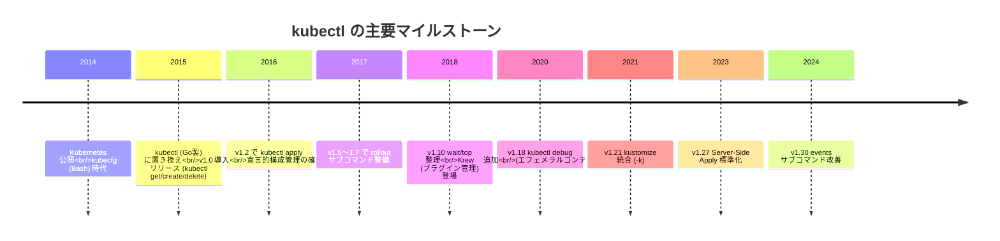

### なぜ kubectl は「動詞 + 名詞」構造なのか

kubectl のコマンド構造は徹底して **動詞 (verb) + 対象リソース (noun) + 名前 (name) + フラグ** の順で構成されています。これは Unix の伝統的な命令型 CLI とは少し違い、REST API の HTTP メソッド (`GET /api/v1/pods/foo`) に近い設計です。

```bash
kubectl    <verb>    <resource>    [name]    [flags]
# 例
kubectl    get       pods          web-abc   -n prod -o yaml
```

この設計の根拠は次の通りです。

1. **学習コストの線形化**: 動詞30個 × リソース50種類 = 1500通りを覚えるのではなく、動詞とリソースを別々に覚えれば組合せで使える
2. **拡張性**: 新しいリソース (CRD: CustomResourceDefinition) を追加しても、既存の動詞がそのまま使える
3. **API との対応**: `kubectl get pods` は内部的に `GET /api/v1/namespaces/<ns>/pods` を呼んでいるだけ。慣れれば curl で代用できる

### kubectl と API Server の関係

kubectl は単に **kube-apiserver に対して HTTPS リクエストを投げて、結果を整形表示している** だけのクライアントです。

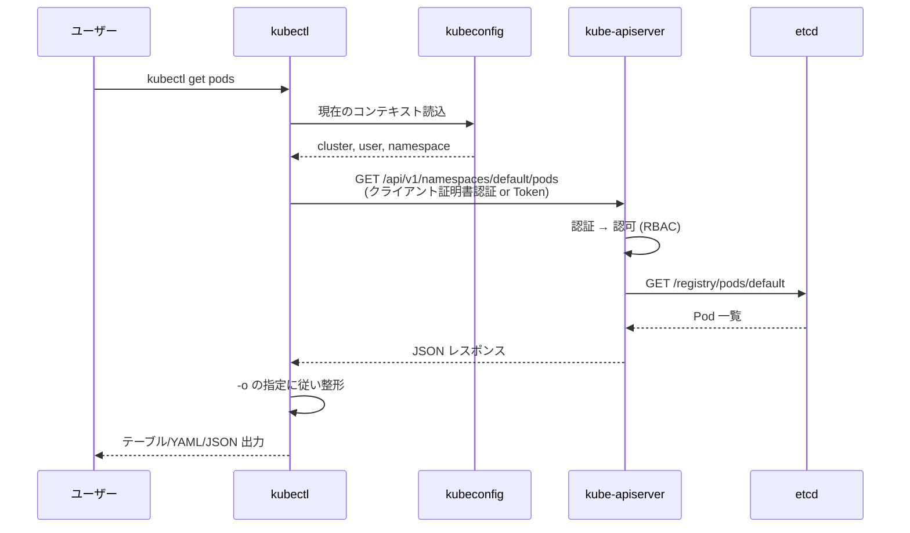

この理解があると、次のような疑問にすぐ答えられます。

- 「なぜ `kubectl get pods` が遅いことがあるのか?」 → API Server 〜 etcd 経路が混雑している可能性
- 「`kubectl` で見えないが `curl` で見える」 → kubectl の `-o` 整形が落としている可能性
- 「権限不足エラーが出る」 → RBAC で対象 verb/resource が拒否されている

---

## kubectl 自身のインストール・更新

### インストール方法の選択肢 (4通り)

| 手段 | 対象 OS | メリット | デメリット |
|---|---|---|---|
| 公式バイナリ直 (curl) | Linux / macOS / Windows | 最新を簡単に追える | バージョン管理が面倒 |
| パッケージマネージャ (apt/yum/brew) | Linux / macOS | OS と統合・更新が楽 | クラスタとバージョンずれが起きやすい |
| `asdf-vm` プラグイン | クロスプラットフォーム | 複数バージョン併用可能 | 初回セットアップが要学習 |
| `krew` (kubectl プラグイン) | クロスプラットフォーム | 拡張プラグインを入れたい場合 | kubectl 本体には別途必要 |

### バージョンスキューポリシー

kubectl のバージョンは API Server とどこまでずれて良いかが厳密に定められています。

| 項目 | 許容範囲 |
|---|---|
| kubectl | API Server の ±1 マイナーバージョンまで |
| kubelet | API Server より新しいバージョンには絶対にできない |
| kube-controller-manager / scheduler | API Server と同一マイナーバージョン推奨 |

```bash
kubectl version
# Client Version: v1.30.5
# Server Version: v1.30.3
```

{: .warning }
> v1.32 の kubectl から v1.29 の API Server を触ると、新しいフィールドが落ちたり挙動が変だったりします。マイナーバージョン2つ以上のずれは事故の元なので、揃えるのが原則です。

---

## kubeconfig とコンテキストの完全理解

kubectl が「どのクラスタに、どのユーザーで、どの Namespace を初期値として」操作するかを決めるのが **kubeconfig** ファイルです。デフォルトでは `~/.kube/config` に置かれます。

### kubeconfig の構造

```yaml
apiVersion: v1
kind: Config
# クラスタ定義 (どこの API Server か)
clusters:
- name: minikube
  cluster:
    server: https://192.168.49.2:8443
    certificate-authority-data: LS0tLS1CRUdJTi...
- name: kubeadm-ha
  cluster:
    server: https://192.168.56.10:6443    # k8s-lb 経由
    certificate-authority-data: LS0tLS1CRUdJTi...

# ユーザー定義 (誰として認証するか)
users:
- name: minikube
  user:
    client-certificate-data: LS0tLS1CRUdJTi...
    client-key-data: LS0tLS1CRUdJTi...
- name: kubeadm-admin
  user:
    client-certificate-data: LS0tLS1CRUdJTi...
    client-key-data: LS0tLS1CRUdJTi...

# コンテキスト定義 (cluster + user + namespace の組み合わせ)
contexts:
- name: minikube
  context:
    cluster: minikube
    user: minikube
    namespace: default
- name: kubeadm-prod
  context:
    cluster: kubeadm-ha
    user: kubeadm-admin
    namespace: prod

current-context: minikube
```

### コンテキスト操作コマンド

```bash
# 現在のコンテキストを表示
kubectl config current-context
```

**get**: 設定情報を表示する動詞 (kubeconfig 操作用のサブコマンド)
**current-context**: 現在 active なコンテキスト名のみ返す

**期待される出力**:

```
minikube
```

```bash
# コンテキスト一覧
kubectl config get-contexts
```

**期待される出力**:

```
CURRENT   NAME           CLUSTER       AUTHINFO         NAMESPACE
*         minikube       minikube      minikube         default
          kubeadm-prod   kubeadm-ha    kubeadm-admin    prod
          kubeadm-dev    kubeadm-ha    kubeadm-admin    dev
```

```bash
# コンテキスト切り替え
kubectl config use-context kubeadm-prod
```

**何が起きるか**: current-context が `kubeadm-prod` に書き換わる。これ以降の kubectl は本番クラスタを向く。

```bash
# 現在のコンテキストの Namespace を変更
kubectl config set-context --current --namespace=prod
```

**フラグ解説**:
- `--current`: 現在の context を対象にする
- `--namespace=prod`: その context のデフォルト Namespace を `prod` に変更
- 似た書き方: `kubectl config set-context kubeadm-prod --namespace=prod` (context 名で指定)

{: .warning }
> 「あれ、prod クラスタに繋いだはずなのに default Namespace のままだ」というのは典型的な事故です。コンテキスト切替時は **context 名と namespace の両方** を確認する癖をつけてください。

### コンテキストを安全に切り替える (kubectx / kubens)

複数のクラスタを行き来する人には `kubectx` (コンテキスト切替) と `kubens` (Namespace 切替) が定番です。

```bash
# インストール (macOS)
brew install kubectx

# 使い方
kubectx                  # コンテキスト一覧 (現在は強調表示)
kubectx kubeadm-prod     # 切替
kubectx -                # 1つ前のコンテキストに戻る (cd - と同じ感覚)

kubens                   # Namespace 一覧
kubens kube-system       # 切替
kubens -                 # 1つ前
```

### 安全のためのプロンプト表示 (kube-ps1)

本番と検証を行き来するなら、シェルプロンプトに現在のコンテキストを表示するのが事故防止の鉄則です。

```bash
# kube-ps1 (bash/zsh)
source /usr/local/opt/kube-ps1/share/kube-ps1.sh
PS1='[\u@\h \W $(kube_ps1)]\$ '
```

**表示例**:

```
[alice@laptop ~ (⎈|kubeadm-prod:prod)]$
```

赤色で本番が表示されるよう設定すれば、`kubectl delete` を本番で誤実行する確率を大幅に下げられます。

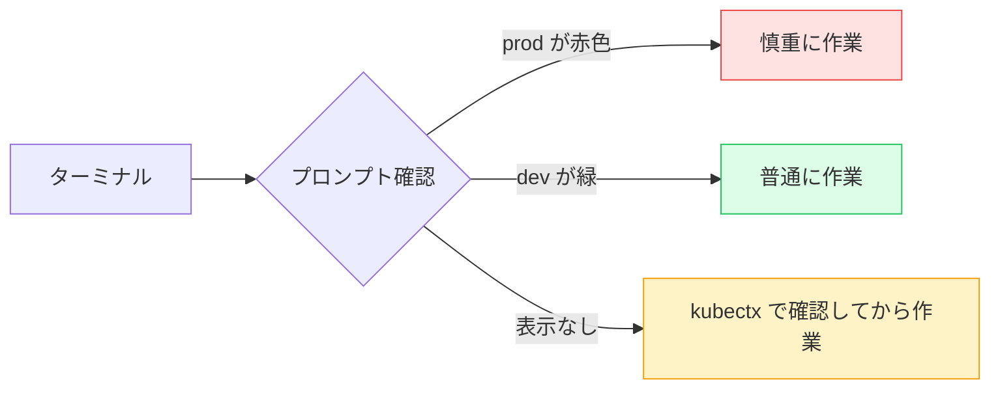

---

## Namespace の指定方法と挙動

kubectl の **ほぼ全てのコマンド** で、対象とする Namespace を指定する必要があります。

| 指定方法 | コマンド例 | 説明 |
|---|---|---|
| 何も指定しない | `kubectl get pods` | 現在のコンテキストの namespace (大抵 default) |
| `-n` で1つ指定 | `kubectl get pods -n prod` | 指定した Namespace のみ |
| `--namespace=` 長形式 | `kubectl get pods --namespace=prod` | `-n` と等価 |
| `-A` で全体 | `kubectl get pods -A` | 全 Namespace を横断 |
| `--all-namespaces` | `kubectl get pods --all-namespaces` | `-A` と等価 |

{: .tip }
> 障害対応中は **必ず `-A` を付ける癖** をつけてください。「default Namespace だけ見ていて kube-system の問題に気づかなかった」は典型的なやらかしです。

### Namespace を意識した操作のフロー

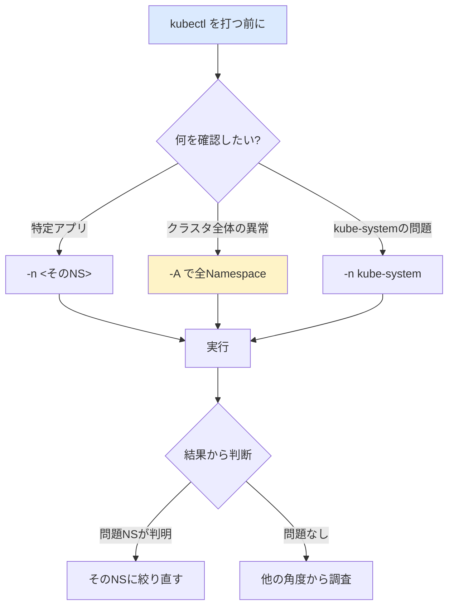

---

## get / list ─ リソース一覧の取得

### 基本構文

```bash
kubectl get <resource> [<name>] [flags]
```

### 主要なリソース略称

| フル名 | 略称 | 説明 |
|---|---|---|
| pods | po | Pod |
| services | svc | Service |
| deployments | deploy | Deployment |
| replicasets | rs | ReplicaSet |
| statefulsets | sts | StatefulSet |
| daemonsets | ds | DaemonSet |
| persistentvolumeclaims | pvc | PVC |
| persistentvolumes | pv | PV |
| configmaps | cm | ConfigMap |
| secrets | (なし) | Secret |
| ingresses | ing | Ingress |
| serviceaccounts | sa | ServiceAccount |
| namespaces | ns | Namespace |
| nodes | no | Node |
| events | ev | Event |
| horizontalpodautoscalers | hpa | HPA |
| poddisruptionbudgets | pdb | PDB |

略称があるのは入力量を減らすためですが、**ドキュメントや教材ではフル名のほうが読み手に親切** です。自分のターミナルでは略称、Issue や README に書くときはフル名、と使い分けるのが推奨されます。

### get の主要フラグ

```bash
kubectl get pods
```
- 引数なし: 現在の namespace の Pod 一覧
- 出力フォーマットは TABLE (デフォルト)

**期待される出力**:

```
NAME                   READY   STATUS    RESTARTS   AGE
todo-api-7d9c-abcde    1/1     Running   0          3h
todo-api-7d9c-fghij    1/1     Running   0          3h
todo-frontend-x-yz     1/1     Running   2          1d
```

```bash
kubectl get pods -A
```
- `-A` = `--all-namespaces`: 全 Namespace 横断

**期待される出力**:

```
NAMESPACE     NAME                                READY   STATUS    RESTARTS   AGE
default       todo-api-7d9c-abcde                 1/1     Running   0          3h
kube-system   coredns-668b8b9d8c-abcde            1/1     Running   0          5d
kube-system   etcd-k8s-cp1                        1/1     Running   0          5d
kube-system   kube-apiserver-k8s-cp1              1/1     Running   0          5d
...
```

```bash
kubectl get pods -o wide
```
- `-o wide`: ノード名・Pod IP・コンテナイメージなど追加列を表示

**期待される出力**:

```
NAME                  READY   STATUS    RESTARTS   AGE   IP             NODE     NOMINATED NODE   READINESS GATES
todo-api-7d9c-abcde   1/1     Running   0          3h    10.244.1.45    k8s-w1   <none>           <none>
todo-api-7d9c-fghij   1/1     Running   0          3h    10.244.2.18    k8s-w2   <none>           <none>
```

```bash
kubectl get pods -o yaml
kubectl get pods -o json
```
- `-o yaml` / `-o json`: 完全な情報を YAML/JSON 形式で出力。`kubectl describe` よりも機械可読

```bash
kubectl get pods -l app=todo-api
kubectl get pods --selector=app=todo-api
```
- `-l` (= `--selector`): ラベルでフィルタ。複数指定は `,` 区切り (AND)

```bash
kubectl get pods -l 'app in (todo-api,todo-frontend),tier!=cache'
```
- 集合ベース: `in (...)`, `notin (...)`, `key`, `!key` も使える

```bash
kubectl get pods --field-selector=status.phase=Running
kubectl get pods --field-selector=status.phase!=Running -A
```
- `--field-selector`: ラベルではなく **フィールドの値** でフィルタ
- ラベルセレクタとは別物。サポートされるフィールドは限られている (主に `metadata.namespace`, `metadata.name`, `status.phase`, `spec.nodeName`)

```bash
kubectl get pods --watch
kubectl get pods -w
```
- `-w`: 変化を逐次出力 (Ctrl+C で終了)
- 起動の様子・障害の伝播を観察するのに便利

```bash
kubectl get pods --sort-by=.status.startTime
kubectl get pods --sort-by=.metadata.creationTimestamp
kubectl get pods --sort-by=.spec.nodeName
```
- `--sort-by`: 指定フィールドでソート (JSONPath で指定)

```bash
kubectl get pods -o jsonpath='{.items[*].metadata.name}'
```
- JSONPath で必要なフィールドだけ抜く (後述)

```bash
kubectl get pods -o custom-columns=NAME:.metadata.name,IP:.status.podIP,NODE:.spec.nodeName
```
- カスタム列定義 (後述)

```bash
kubectl get pods --show-labels
```
- 全ラベルを最終列に表示

```bash
kubectl get all -n todo
```
- `all`: pods, services, deployments, replicasets, statefulsets, daemonsets, jobs, cronjobs を含む擬似リソース。**PVC・Ingress・ConfigMap・Secret は含まない** ので注意

{: .warning }
> `kubectl get all` は名前から想像する「全部」とは違います。本番障害時に `get all` だけ見て安心してしまうのは危険。必須リソースを明示的に列挙するスクリプトを別途用意するか、`-A` で全 Namespace の Events まで見る癖を。

---

## describe / logs / exec ─ 中身を覗く

### describe ─ 詳細情報と Events

```bash
kubectl describe pod <pod-name>
kubectl describe pod <pod-name> -n <namespace>
```

**何が起きるか**: 対象 Pod のフィールド (Image, Resources, Events, Volumes, Tolerations, NodeSelector, …) をすべて整形して出力。特に末尾の **Events** が障害解析で最重要。

**期待される出力 (抜粋)**:

```
Name:             todo-api-7d9c-abcde
Namespace:        default
Priority:         0
Service Account:  todo-api-sa
Node:             k8s-w1/192.168.56.21
Start Time:       Sun, 17 Nov 2024 03:21:08 +0900
Labels:           app=todo-api
                  pod-template-hash=7d9c
Status:           Running
IP:               10.244.1.45
Controlled By:    ReplicaSet/todo-api-7d9c
Containers:
  api:
    Container ID:   containerd://abc123...
    Image:          192.168.56.10:5000/todo-api:0.1.0
    Image ID:       192.168.56.10:5000/todo-api@sha256:def456...
    Port:           8000/TCP
    State:          Running
      Started:      Sun, 17 Nov 2024 03:21:09 +0900
    Ready:          True
    Restart Count:  0
    Limits:
      memory:  256Mi
    Requests:
      cpu:     100m
      memory:  128Mi
Events:
  Type    Reason     Age   From               Message
  ----    ------     ----  ----               -------
  Normal  Scheduled  3h    default-scheduler  Successfully assigned default/todo-api-7d9c-abcde to k8s-w1
  Normal  Pulling    3h    kubelet            Pulling image "192.168.56.10:5000/todo-api:0.1.0"
  Normal  Pulled     3h    kubelet            Successfully pulled image "192.168.56.10:5000/todo-api:0.1.0" in 1.2s
  Normal  Created    3h    kubelet            Created container api
  Normal  Started    3h    kubelet            Started container api
```

### describe で「真っ先に見るべき」場所

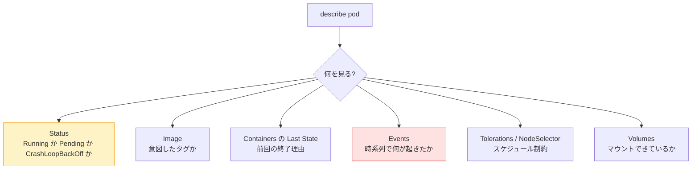

### describe の対象は Pod だけではない

```bash
kubectl describe node k8s-w1
kubectl describe deployment todo-api
kubectl describe service todo-api
kubectl describe pvc postgres-data-postgres-0
kubectl describe ingress todo-ingress
kubectl describe networkpolicy default-deny
kubectl describe pdb todo-api-pdb
kubectl describe hpa todo-api
```

特に `describe node` は **Conditions** (NotReady の原因)・**Capacity / Allocatable** (リソース余裕)・**Allocated resources** (現在の使用量)・**Events** (Pressure や Drain) が確認できる障害解析の宝庫です。

### logs ─ コンテナのログ

```bash
kubectl logs <pod-name>
```

**何が起きるか**: Pod の最初のコンテナの標準出力・標準エラー出力を取得。

```bash
kubectl logs <pod-name> -c <container-name>
```
- `-c`: マルチコンテナ Pod の特定コンテナを指定

```bash
kubectl logs <pod-name> --previous
kubectl logs <pod-name> -p
```
- `--previous` (`-p`): **直前にクラッシュしたコンテナ** のログ。CrashLoopBackOff の原因を探すときに必須

```bash
kubectl logs <pod-name> --since=1h
kubectl logs <pod-name> --since-time=2024-11-17T03:00:00Z
```
- 期間指定。`--since` は相対(`5m`/`1h`/`24h`)、`--since-time` は絶対 (RFC3339)

```bash
kubectl logs <pod-name> --tail=100
kubectl logs <pod-name> --tail=-1            # 全部
```
- 末尾 N 行のみ

```bash
kubectl logs <pod-name> -f
kubectl logs <pod-name> --follow
```
- `-f`: 追尾表示 (`tail -f` 相当)

```bash
kubectl logs -l app=todo-api --tail=100
kubectl logs -l app=todo-api --tail=100 -f
kubectl logs -l app=todo-api --tail=10 --max-log-requests=10
```
- `-l` でラベル選択して **複数 Pod のログを束ねて** 表示
- `--max-log-requests`: 同時にログを取る Pod 数の上限 (デフォルト5、超えるとエラー)

```bash
kubectl logs <pod-name> --all-containers
```
- マルチコンテナ Pod の全コンテナログを混ぜて表示。`-c` の代わり

```bash
kubectl logs <pod-name> --timestamps
```
- 各行にタイムスタンプを付与

{: .warning }
> `kubectl logs` で取得できるのは **kubelet がノード上で保持している分だけ** です。Pod が削除されると消えます。本番ではログを Loki / ELK 等に集約しておくこと。

### 複数 Pod のログを束ねるなら `stern`

```bash
# stern (https://github.com/stern/stern)
stern todo-api
stern -l app=todo-api -n default
stern --since 5m 'todo-.*'
```

`stern` は kubectl の logs を強化した OSS で、複数 Pod を色分けして並べてくれます。本番運用では半ば必須。

### exec ─ コンテナ内でコマンド実行

```bash
kubectl exec -it <pod-name> -- bash
kubectl exec -it <pod-name> -- sh
```
- `-i`: 標準入力を開く (interactive)
- `-t`: TTY を割り当てる
- `--`: ここから先はコンテナ内に渡すコマンド

```bash
kubectl exec -it <pod-name> -c <container> -- sh
kubectl exec <pod-name> -- env
kubectl exec <pod-name> -- ls /etc
kubectl exec <pod-name> -- cat /etc/hostname
```

```bash
# Distroless / Scratch イメージで shell がない場合
kubectl debug -it <pod-name> --image=busybox --target=<container>
```

### exec の安全性に関する注意

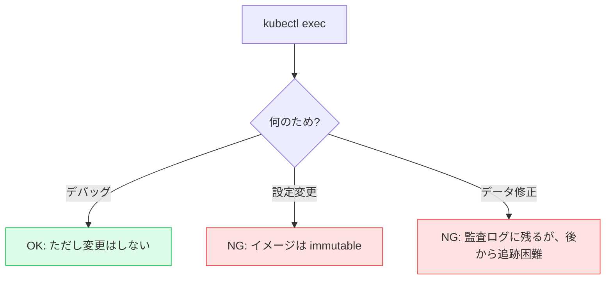

{: .warning }
> exec で本番コンテナを書き換えると、再起動で消えるだけならまだしも、後任者には何が変わったか追えません。本番では「読むだけ」を原則に、変更は YAML の修正 → apply で行ってください。

### cp ─ コンテナとのファイル送受信

```bash
# Pod 内のファイルをローカルに
kubectl cp <pod-name>:/var/log/app.log ./app.log

# ローカルから Pod 内へ
kubectl cp ./config.yaml <pod-name>:/etc/app/config.yaml

# マルチコンテナ Pod では -c
kubectl cp <pod-name>:/etc/conf ./conf -c <container>
```

{: .note }
> `kubectl cp` の内部実装は `tar` をパイプで送り合うため、**コンテナ内に tar コマンドが必要** です。distroless イメージだと使えない場合があります。

---

## apply / edit / delete / rollout ─ 変更系コマンド

### apply ─ 宣言的な状態適用

```bash
kubectl apply -f deploy.yaml
kubectl apply -f .
kubectl apply -f https://example.com/manifest.yaml
kubectl apply -f manifests/ --recursive
kubectl apply -f - <<EOF
apiVersion: v1
kind: ConfigMap
...
EOF
```

**フラグ詳細**:
- `-f`: ファイル / ディレクトリ / URL / `-` (標準入力) を指定
- `--recursive` (`-R`): ディレクトリを再帰的に探索 (デフォルトは1階層)
- `--dry-run=client`: クライアント側で構文チェックのみ、API Server には送らない
- `--dry-run=server`: API Server に送って admission を通すが永続化はしない
- `--server-side`: Server-Side Apply (SSA) を使う (v1.22+ で stable)
- `--force-conflicts`: SSA で他フィールドマネージャと衝突しても上書き
- `--prune`: 旧バージョンで指定された YAML から消えたリソースを自動削除 (危険)

### apply と create の違い

| 観点 | `kubectl apply` | `kubectl create` |
|---|---|---|
| 既存リソースへの動作 | 差分を計算して更新 | エラーになる (already exists) |
| ベストプラクティス | 本番運用の推奨 | 一回切りの作成・dry-run でのYAML生成 |
| 動作モデル | 宣言的 (declarative) | 命令的 (imperative) |

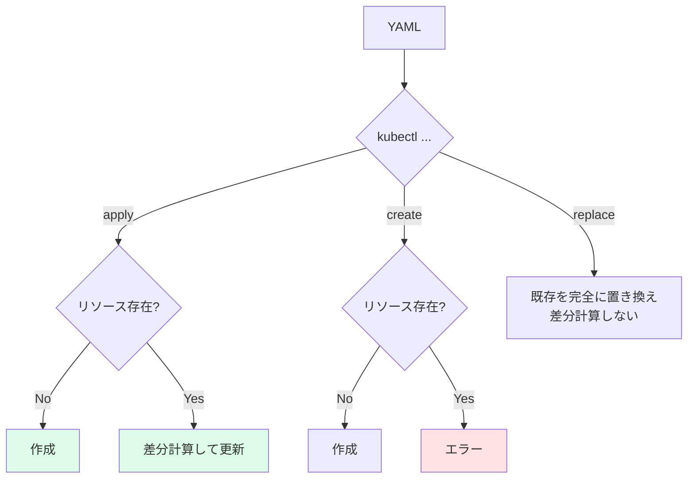

### kustomize 経由の apply

```bash
kubectl apply -k overlays/prod
kubectl apply -k overlays/dev
```
- `-k`: kustomization.yaml を読んで合成された YAML を apply
- `-f` と `-k` は同時には使えない (kustomize は kustomization.yaml 単位)

### diff ─ 差分を事前確認

```bash
kubectl diff -f deploy.yaml
kubectl diff -k overlays/prod
```

**何が起きるか**: 適用すると何がどう変わるかを `diff -u` 形式で出力。本番では apply の前に必ず diff を確認するのが鉄則。

**期待される出力 (抜粋)**:

```diff
diff -u -N /tmp/LIVE-current/v1.Deployment.default.todo-api /tmp/MERGED-applied/v1.Deployment.default.todo-api
--- /tmp/LIVE-current/v1.Deployment.default.todo-api
+++ /tmp/MERGED-applied/v1.Deployment.default.todo-api
@@ -28,7 +28,7 @@
       containers:
       - name: api
-        image: 192.168.56.10:5000/todo-api:0.1.0
+        image: 192.168.56.10:5000/todo-api:0.1.1
         ports:
         - containerPort: 8000
```

### edit ─ オンラインで YAML を直接編集

```bash
kubectl edit deploy/todo-api
kubectl edit svc/todo-api -n prod
KUBE_EDITOR='code -w' kubectl edit deploy/todo-api      # VSCode で編集
```

**何が起きるか**: 現状のリソース YAML を `$EDITOR` で開き、保存すると apply 同等の更新が走る。

{: .warning }
> `edit` で本番を直接書き換えると **Git に履歴が残らない** ため、運用としては GitOps (Argo CD / Flux) のリポジトリ経由を強く推奨します。`edit` は緊急時か検証クラスタのみで。

### delete ─ リソース削除

```bash
kubectl delete pod <pod-name>
kubectl delete deploy/todo-api
kubectl delete -f deploy.yaml
kubectl delete -k overlays/dev
kubectl delete ns dev                          # Namespace ごと削除 (中の全リソースも消える)
kubectl delete pod <pod-name> --grace-period=0 --force
kubectl delete pod -l app=todo-api
kubectl delete pod --field-selector=status.phase=Failed -A
```

**フラグ詳細**:
- `--grace-period`: SIGTERM 後の猶予時間 (秒)。デフォルトは Pod の `terminationGracePeriodSeconds` (通常30秒)
- `--force`: `--grace-period=0` と組合せて使うと API Server からのみ削除 (kubelet を待たない) ─ 本当の緊急用
- `--cascade=background` / `--cascade=foreground` / `--cascade=orphan`: 子リソース削除の挙動
- `--wait=true`: 削除完了を待つ (デフォルト)
- `--all`: その Namespace の対象リソース全部 (`kubectl delete pod --all` は非常に危険)

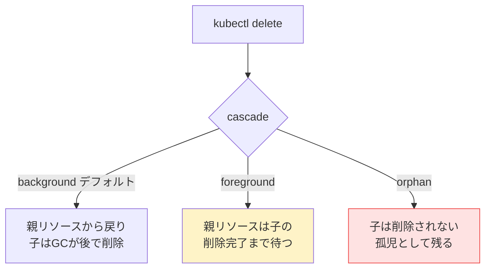

### scale ─ レプリカ数の変更

```bash
kubectl scale deploy/todo-api --replicas=5
kubectl scale deploy/todo-api --replicas=0     # 0 にすれば停止状態
kubectl scale sts/postgres --replicas=3
kubectl scale -f deploy.yaml --replicas=5
kubectl scale deploy/todo-api --current-replicas=3 --replicas=5     # 現在3でない時はエラー
```

### rollout ─ ローリングアップデート制御

```bash
# 状態確認
kubectl rollout status deploy/todo-api
```

**期待される出力**:

```
Waiting for deployment "todo-api" rollout to finish: 1 of 3 updated replicas are available...
deployment "todo-api" successfully rolled out
```

```bash
# 履歴
kubectl rollout history deploy/todo-api
kubectl rollout history deploy/todo-api --revision=3
```

**期待される出力**:

```
deployment.apps/todo-api
REVISION  CHANGE-CAUSE
1         <none>
2         kubectl apply --filename=deploy.yaml
3         kubectl set image deploy/todo-api api=192.168.56.10:5000/todo-api:0.1.1
```

```bash
# ロールバック (1個前)
kubectl rollout undo deploy/todo-api

# 特定のリビジョンに戻す
kubectl rollout undo deploy/todo-api --to-revision=2
```

```bash
# ポッドを全部 restart (イメージは変えず)
kubectl rollout restart deploy/todo-api
kubectl rollout restart sts/postgres
```

**何が起きるか**: `kubectl rollout restart` は Pod template の annotation を更新するだけ。新しい hash が計算されて新 ReplicaSet ができ、ローリングアップデートで Pod が入れ替わる。

```bash
# 一時停止 / 再開
kubectl rollout pause deploy/todo-api
kubectl rollout resume deploy/todo-api
```
- `pause`: ローリングを止める。複数の変更を一括で適用したい場合に使う

### set ─ よくある変更のショートカット

```bash
kubectl set image deploy/todo-api api=192.168.56.10:5000/todo-api:0.1.1
kubectl set image deploy/todo-api api=192.168.56.10:5000/todo-api:0.1.1 --record
kubectl set resources deploy/todo-api -c=api --requests=cpu=200m,memory=256Mi
kubectl set env deploy/todo-api LOG_LEVEL=debug
kubectl set env deploy/todo-api --from=configmap/todo-config
```

`--record` フラグは v1.20 で deprecated → v1.23 で廃止予定 → 現状は使えるが `kubernetes.io/change-cause` annotation を明示するのが推奨。

---

## ラベル・アノテーション操作

```bash
kubectl label pod <pod-name> env=dev
kubectl label pod <pod-name> env=prod --overwrite      # 既存ラベルを上書き
kubectl label pod <pod-name> env-                       # 削除 (末尾ハイフン)
kubectl label pods -l app=todo-api version=v0.1.0       # セレクタで一括
kubectl label nodes k8s-w1 disktype=ssd                 # ノードにラベル
```

```bash
kubectl annotate pod <pod-name> note='handle with care'
kubectl annotate pod <pod-name> kubernetes.io/change-cause='hotfix #1234'
kubectl annotate pod <pod-name> note-                   # 削除
```

### ラベルとアノテーションの違い (ここで再確認)

| 観点 | Label | Annotation |
|---|---|---|
| 用途 | Selector で対象を絞る (Service が Pod を選ぶ等) | メタ情報・補足説明 |
| 値長 | 短い(英数+`-_.`、63文字以内) | 長文OK |
| 検索 | `-l` で検索可能 | フィルタ不可 (`-o jsonpath` で読むのみ) |
| 用例 | `app=todo-api`, `tier=frontend` | `prometheus.io/scrape=true`, `kubectl.kubernetes.io/last-applied-configuration=...` |

---

## port-forward / proxy ─ クラスタ外からのアクセス

### port-forward

```bash
# Service 経由
kubectl port-forward svc/todo-api 8080:80

# Pod 直接
kubectl port-forward pod/todo-api-xxxxx 8080:80

# Deployment 経由 (背後の Pod に転送)
kubectl port-forward deploy/todo-api 8080:80

# 複数ポート
kubectl port-forward svc/todo-api 8080:80 8443:443

# 全インタフェースで Listen (要注意)
kubectl port-forward --address 0.0.0.0 svc/todo-api 8080:80
```

**何が起きるか**: ローカルポート 8080 を、API Server の SPDY ストリームを経由してクラスタ内 Service の 80 番に転送する。

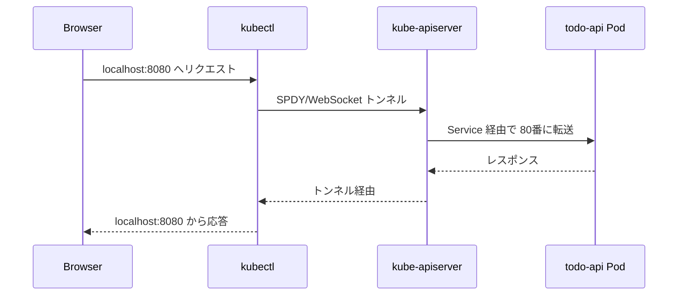

{: .warning }
> port-forward はあくまで **開発・デバッグ用** です。本番アクセスに使うと kubectl プロセスが死んだ瞬間に通信が切れます。ユーザー向けの公開は Ingress / Service Type=LoadBalancer で。

### proxy

```bash
kubectl proxy --port=8001
kubectl proxy --port=8001 --address=0.0.0.0     # 危険: 認証なしで API が外に出る
```

**何が起きるか**: kubectl が認証情報を持ったローカル HTTP プロキシを起動。`http://localhost:8001/api/v1/namespaces/default/pods` 等で API を叩ける。

```bash
# 例: 全 Pod を JSON で取得
curl http://localhost:8001/api/v1/pods

# Dashboard へのアクセス (古典)
# http://localhost:8001/api/v1/namespaces/kubernetes-dashboard/services/https:kubernetes-dashboard:/proxy/
```

---

## デバッグ ─ debug / 一時 Pod

### 一時的なデバッグ Pod (netshoot)

```bash
kubectl run debug --rm -it --image=nicolaka/netshoot --restart=Never -- bash
```

**フラグ詳細**:
- `--rm`: コマンド終了時に Pod 自動削除
- `-it`: interactive + TTY
- `--image=nicolaka/netshoot`: ネットワーク調査ツールが詰まったコンテナ
- `--restart=Never`: Deployment ではなく単発 Pod として作成
- `-- bash`: コンテナ内で実行するコマンド

`netshoot` には `dig`, `nslookup`, `curl`, `wget`, `tcpdump`, `nmap`, `iperf3`, `mtr`, `traceroute` 等がプリインストールされています。

### ノード上でデバッグ Pod

```bash
kubectl run debug --rm -it --image=nicolaka/netshoot \
  --restart=Never --overrides='{"spec":{"nodeName":"k8s-w1"}}' -- bash
```

特定ノードに割り付けたい場合は `--overrides` で JSON パッチを当てる。

### kubectl debug ─ エフェメラルコンテナ

```bash
kubectl debug -it <target-pod> --image=nicolaka/netshoot --target=<container>
```

**何が起きるか**: 既存 Pod に **後付けでコンテナを追加** する (v1.25 で stable)。元の Pod を再起動せずに、distroless イメージのコンテナにシェルを差し込める。

```bash
# Pod のコピーを作って差し替え (元 Pod は触らない)
kubectl debug <target-pod> --copy-to=<new-pod-name> --image=busybox -- sh
```

```bash
# ノード自体をデバッグ (host root にアクセス)
kubectl debug node/<node-name> -it --image=ubuntu
```

`kubectl debug node/` は **ホスト root ファイルシステムが `/host` にマウントされた特権 Pod** を作成します。ノード OS のログ調査・kubelet トラブルシュートに必須。

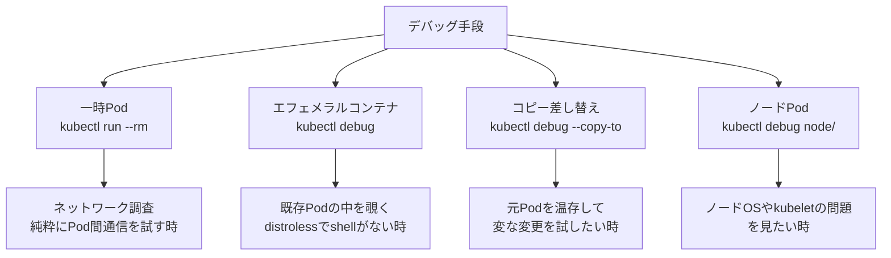

---

## トラブル時の高速確認集

### 「何かおかしい」と感じたら最初に叩く5つ

```bash
# 1. 全 Namespace の異常 Pod
kubectl get pods -A --field-selector=status.phase!=Running

# 2. 直近の Events (新しい順)
kubectl get events -A --sort-by=.metadata.creationTimestamp | tail -30

# 3. ノードの状態
kubectl get nodes -o wide

# 4. リソース消費 (cpu 多い順)
kubectl top pod -A --sort-by=cpu | head -20
kubectl top node

# 5. PVC が Pending になっていないか
kubectl get pvc -A
```

### よくある症状と最初に叩くコマンド

| 症状 | 最初の一手 | 次の一手 |
|---|---|---|
| Pod が Pending のまま | `kubectl describe pod <name>` の Events | `kubectl get nodes` で Node 状態 |
| CrashLoopBackOff | `kubectl logs <pod> -p` (前回ログ) | `kubectl describe pod <name>` |
| ImagePullBackOff | `kubectl describe pod <name>` の Events | レジストリ認証・タグ確認 |
| Service につながらない | `kubectl get endpoints <svc>` | Selector が Pod のラベルと一致しているか |
| Ingress が 404 | `kubectl describe ingress <name>` | Backend Service の状態 |
| PVC が Pending | `kubectl describe pvc <name>` | StorageClass / Provisioner の状態 |
| HPA が動かない | `kubectl describe hpa <name>` | metrics-server の稼働確認 |

### 障害切り分けのフローチャート (Pod が起動しない場合)

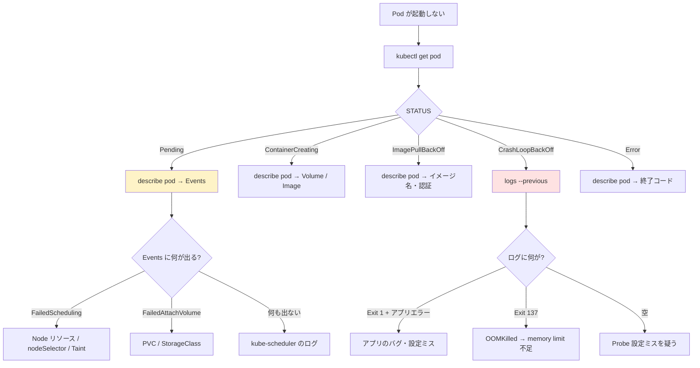

### イベントを継続監視

```bash
# 全 Namespace の events を流す
kubectl get events -A --watch

# Warning 以上だけ
kubectl get events -A --field-selector type=Warning

# 特定 Namespace の events を JSON で
kubectl get events -n default -o json | jq '.items[] | {time:.lastTimestamp, type:.type, reason:.reason, message:.message}'
```

---

## YAML 生成 (dry-run)

`kubectl create ... --dry-run=client -o yaml` を使うと、いきなり YAML を手書きしなくても雛形が得られます。

```bash
# Deployment
kubectl create deploy todo-api \
  --image=192.168.56.10:5000/todo-api:0.1.0 \
  --replicas=3 \
  --dry-run=client -o yaml

# Service (ClusterIP)
kubectl create svc clusterip todo-api --tcp=80:8000 --dry-run=client -o yaml

# Service (NodePort)
kubectl create svc nodeport todo-api --tcp=80:8000 --node-port=30080 --dry-run=client -o yaml

# ConfigMap
kubectl create configmap todo-config \
  --from-literal=LOG_LEVEL=info \
  --from-literal=DB_HOST=postgres \
  --dry-run=client -o yaml

kubectl create configmap todo-config --from-file=app.properties --dry-run=client -o yaml
kubectl create configmap todo-config --from-env-file=.env --dry-run=client -o yaml

# Secret
kubectl create secret generic todo-secret \
  --from-literal=DB_PASSWORD='S3cret!' \
  --dry-run=client -o yaml

kubectl create secret tls todo-tls --cert=server.crt --key=server.key --dry-run=client -o yaml

kubectl create secret docker-registry myregistry \
  --docker-server=192.168.56.10:5000 \
  --docker-username=admin \
  --docker-password=adminpw \
  --dry-run=client -o yaml

# Ingress
kubectl create ingress todo-ingress \
  --rule="todo.example.com/*=todo-api:80" \
  --dry-run=client -o yaml

# Job
kubectl create job migrate-db --image=migrate:1.0 --dry-run=client -o yaml

# CronJob
kubectl create cronjob notify --image=notifier:1.0 --schedule='*/10 * * * *' --dry-run=client -o yaml

# Role / RoleBinding
kubectl create role pod-reader --verb=get,list,watch --resource=pods --dry-run=client -o yaml
kubectl create rolebinding alice-reader --role=pod-reader --user=alice --dry-run=client -o yaml

# ServiceAccount
kubectl create serviceaccount todo-api-sa --dry-run=client -o yaml
```

### dry-run の3段階

| 値 | 意味 |
|---|---|
| `--dry-run=none` (デフォルト) | 実際に作成 |
| `--dry-run=client` | クライアント側で文字列を組み立てるだけ。API には送らない |
| `--dry-run=server` | API Server に送って Admission を通すが etcd に書き込まない |

{: .tip }
> `--dry-run=server` は **CRD の validation や Admission Webhook を経た結果** が見られるので、複雑なクラスタでは `client` よりも信用できます。

---

## 認可確認 (auth can-i)

```bash
# 自分の権限確認
kubectl auth can-i list pods
kubectl auth can-i create deployments -n prod
kubectl auth can-i '*' '*'              # クラスタ管理者か?

# 他人として権限確認 (impersonation)
kubectl auth can-i list pods --as alice@example.com
kubectl auth can-i list pods --as alice@example.com --as-group=developers

# ServiceAccount として
kubectl auth can-i list pods --as system:serviceaccount:prod:todo-api -n prod
kubectl auth can-i '*' '*' --as system:serviceaccount:prod:todo-api
```

**期待される出力**:

```
yes        # 権限がある
no         # 権限がない
Warning: resource 'pods' is not namespace scoped
```

### 全権限のダンプ

```bash
kubectl auth can-i --list -n prod
kubectl auth can-i --list --as alice@example.com -n prod
```

**期待される出力 (抜粋)**:

```
Resources                                       Non-Resource URLs   Resource Names   Verbs
pods                                            []                  []               [get list watch]
configmaps                                      []                  []               [get list]
deployments.apps                                []                  []               [get list watch]
```

---

## JSONPath と custom-columns

### JSONPath の基本

kubectl の `-o jsonpath='<expr>'` は、JSONPath (RFC ドラフト) のサブセットを実装しています。本家の JSONPath とは少し違うので注意。

```bash
# 全 Pod の名前
kubectl get pods -o jsonpath='{.items[*].metadata.name}'

# 改行区切り
kubectl get pods -o jsonpath='{range .items[*]}{.metadata.name}{"\n"}{end}'

# 名前とノードを TAB 区切り
kubectl get pods -o jsonpath='{range .items[*]}{.metadata.name}{"\t"}{.spec.nodeName}{"\n"}{end}'

# 名前と全 image
kubectl get pods -o jsonpath='{range .items[*]}{.metadata.name}{"\t"}{range .spec.containers[*]}{.image}{","}{end}{"\n"}{end}'

# Service の ClusterIP
kubectl get svc todo-api -o jsonpath='{.spec.clusterIP}'

# 全 Node の InternalIP
kubectl get nodes -o jsonpath='{.items[*].status.addresses[?(@.type=="InternalIP")].address}'

# 条件抽出 (フィルタ)
kubectl get pods -o jsonpath='{.items[?(@.status.phase=="Running")].metadata.name}'
```

### custom-columns の基本

```bash
kubectl get pods -o custom-columns=NAME:.metadata.name,IP:.status.podIP
kubectl get pods -o custom-columns=NAME:.metadata.name,STARTED:.status.startTime
kubectl get pods -o custom-columns='NAME:.metadata.name,NODE:.spec.nodeName,STATUS:.status.phase'

# ヘッダなし
kubectl get pods -o custom-columns-file=cols.txt
kubectl get pods --no-headers -o custom-columns=NAME:.metadata.name
```

### 実用パターン集

```bash
# Pod を起動時刻順にソートして名前だけ取り出す
kubectl get pods --sort-by=.metadata.creationTimestamp \
  -o custom-columns=NAME:.metadata.name --no-headers

# 各 Node のリソース割り当て概要
kubectl get nodes -o custom-columns=\
NAME:.metadata.name,\
CPU:.status.capacity.cpu,\
MEM:.status.capacity.memory,\
PODS:.status.capacity.pods

# 各 Pod のコンテナイメージ一覧
kubectl get pods -A -o custom-columns=\
NS:.metadata.namespace,\
POD:.metadata.name,\
IMAGES:.spec.containers[*].image

# Restart 回数が多い Pod だけ
kubectl get pods -A -o json \
  | jq -r '.items[] | select(.status.containerStatuses[]?.restartCount > 5) | "\(.metadata.namespace)\t\(.metadata.name)\t\(.status.containerStatuses[0].restartCount)"'
```

{: .tip }
> JSONPath で複雑なことをするより、`jq` に渡したほうが書きやすいケースが多いです。`-o json | jq ...` の習慣を。

---

## エイリアス・補完・プラグイン

### 推奨エイリアス (bash / zsh)

```bash
# ~/.bashrc または ~/.zshrc に追記
alias k=kubectl
alias kg='kubectl get'
alias kgp='kubectl get pods'
alias kgs='kubectl get svc'
alias kgd='kubectl get deploy'
alias kga='kubectl get all'
alias kd='kubectl describe'
alias kdp='kubectl describe pod'
alias kl='kubectl logs -f'
alias klp='kubectl logs --previous'
alias kex='kubectl exec -it'
alias ka='kubectl apply -f'
alias kdel='kubectl delete'
alias kctx=kubectx
alias kns=kubens
alias kaf='kubectl apply -f'
alias kak='kubectl apply -k'
alias kdf='kubectl diff -f'
alias kdk='kubectl diff -k'

# Namespace 切替
alias kns-prod='kubectl config set-context --current --namespace=prod'
alias kns-dev='kubectl config set-context --current --namespace=dev'
```

### bash / zsh 補完

```bash
# bash
source <(kubectl completion bash)
complete -F __start_kubectl k     # k エイリアスにも補完を効かせる

# zsh
source <(kubectl completion zsh)
```

### krew ─ kubectl プラグインマネージャ

```bash
# インストール
(set -x; cd "$(mktemp -d)" &&
  curl -fsSLO "https://github.com/kubernetes-sigs/krew/releases/latest/download/krew-$(uname | tr '[:upper:]' '[:lower:]')_amd64.tar.gz" &&
  tar zxvf krew-*.tar.gz &&
  KREW=./krew-"$(uname | tr '[:upper:]' '[:lower:]')_amd64" &&
  "$KREW" install krew)
export PATH="${KREW_ROOT:-$HOME/.krew}/bin:$PATH"

# 便利プラグイン
kubectl krew install ctx              # コンテキスト切替
kubectl krew install ns               # Namespace 切替
kubectl krew install neat             # YAML から不要フィールドを除去
kubectl krew install tree             # オーナーリレーションをツリー表示
kubectl krew install whoami           # 現在のユーザー確認
kubectl krew install access-matrix    # RBAC マトリクス可視化
kubectl krew install resource-capacity # ノード/Pod のリソース計
kubectl krew install images           # イメージ一覧
kubectl krew install view-allocations # リクエスト・リミット集計
kubectl krew install stern            # マルチ Pod ログ
kubectl krew install konfig           # kubeconfig 結合
```

### 使用例: kubectl tree

```bash
kubectl tree deployment todo-api
```

**期待される出力**:

```
NAMESPACE  NAME                         READY  REASON  AGE
default    Deployment/todo-api          -                  5d
default    ├─ReplicaSet/todo-api-7d9c   -                  3h
default    │ ├─Pod/todo-api-7d9c-abcde  True               3h
default    │ ├─Pod/todo-api-7d9c-fghij  True               3h
default    │ └─Pod/todo-api-7d9c-klmno  True               3h
default    └─ReplicaSet/todo-api-6c8b   -                  5d
```

---

## 本番で「叩いてはいけない」コマンド

### 危険度 ★★★ (絶対に避ける)

```bash
# Namespace ごと削除 (中の全リソースが消える)
kubectl delete ns prod

# 全 Pod 削除
kubectl delete pod --all -n prod

# 全 Deployment 削除
kubectl delete deploy --all -n prod

# Finalizer 強制削除
kubectl patch pvc <name> -p '{"metadata":{"finalizers":null}}'

# 強制削除 (kubelet を待たない → 二重起動の可能性)
kubectl delete pod <name> --grace-period=0 --force
```

### 危険度 ★★ (本番では使い方を慎重に)

```bash
# 直接編集 (Git に履歴が残らない)
kubectl edit deploy/todo-api

# scale を 0 にする (アプリが停止する)
kubectl scale deploy/todo-api --replicas=0

# rollout undo を本番でいきなり
kubectl rollout undo deploy/todo-api      # 古いバグも復活する可能性

# node drain (ノードから Pod を退避)
kubectl drain k8s-w1 --ignore-daemonsets --delete-emptydir-data
# → 退避先がない・PDB を無視している場合に致命的
```

### 危険度 ★ (用法・用量を守れば OK)

```bash
# port-forward (デバッグ用)
kubectl port-forward svc/todo-api 8080:80

# 一時 Pod でデバッグ (--rm で消える)
kubectl run debug --rm -it --image=busybox -- sh
```

### 「失敗したら戻せるか」チェック

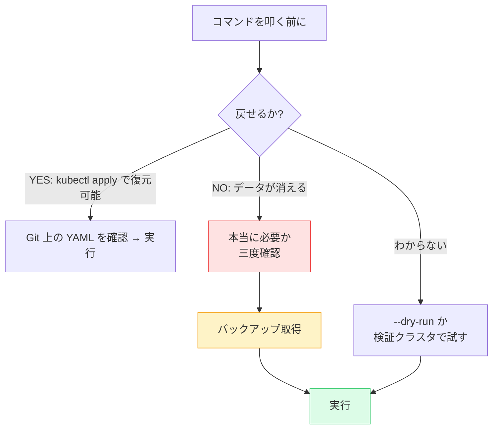

---

## カテゴリ別チートシート

### 1. コンテキスト・Namespace

| やりたいこと | コマンド |
|---|---|
| 現在のコンテキスト | `kubectl config current-context` |
| 一覧 | `kubectl config get-contexts` |
| 切替 | `kubectl config use-context <ctx>` |
| 現在 NS 変更 | `kubectl config set-context --current --namespace=<ns>` |
| 切替 (kubectx) | `kubectx <ctx>` |
| NS 切替 (kubens) | `kubens <ns>` |
| プロンプト表示 | `kube-ps1` セットアップ |
| 新規 kubeconfig 作成 | `kubectl config set-cluster ...` |
| kubeconfig 結合 | `KUBECONFIG=cfg1:cfg2 kubectl config view --flatten > merged` |

### 2. 取得・一覧

| やりたいこと | コマンド |
|---|---|
| 全 NS の Pod | `kubectl get pods -A` |
| 詳細表示 | `kubectl get pods -o wide` |
| YAML 表示 | `kubectl get pods <name> -o yaml` |
| ラベル絞り込み | `kubectl get pods -l app=todo-api` |
| 条件絞り込み | `kubectl get pods --field-selector=status.phase!=Running` |
| 起動順ソート | `kubectl get pods --sort-by=.metadata.creationTimestamp` |
| 監視 | `kubectl get pods -w` |
| ラベル列表示 | `kubectl get pods --show-labels` |
| カスタム列 | `kubectl get pods -o custom-columns=N:.metadata.name,I:.status.podIP` |

### 3. 中身を見る

| やりたいこと | コマンド |
|---|---|
| 詳細 + Events | `kubectl describe pod <name>` |
| ログ | `kubectl logs <pod>` |
| 前回ログ | `kubectl logs <pod> --previous` |
| 全コンテナログ | `kubectl logs <pod> --all-containers` |
| ラベルでログ集約 | `kubectl logs -l app=todo-api --tail=100 -f` |
| マルチ Pod ログ | `stern todo-api` |
| シェル | `kubectl exec -it <pod> -- bash` |
| エフェメラルデバッグ | `kubectl debug -it <pod> --image=busybox --target=app` |
| ファイル取得 | `kubectl cp <pod>:/path/file ./file` |

### 4. 変更系

| やりたいこと | コマンド |
|---|---|
| 適用 | `kubectl apply -f .` |
| Kustomize | `kubectl apply -k overlays/prod` |
| 差分 | `kubectl diff -f .` |
| 編集 | `kubectl edit deploy/todo-api` |
| スケール | `kubectl scale deploy/todo-api --replicas=5` |
| イメージ更新 | `kubectl set image deploy/todo-api api=...:0.1.1` |
| 再起動 | `kubectl rollout restart deploy/todo-api` |
| ロールバック | `kubectl rollout undo deploy/todo-api` |
| 履歴 | `kubectl rollout history deploy/todo-api` |
| 削除 | `kubectl delete -f .` |

### 5. YAML 生成

| やりたいこと | コマンド |
|---|---|
| Deployment 雛形 | `kubectl create deploy nginx --image=nginx --dry-run=client -o yaml` |
| Service 雛形 | `kubectl create svc clusterip web --tcp=80:8080 --dry-run=client -o yaml` |
| ConfigMap 雛形 | `kubectl create cm app --from-literal=K=V --dry-run=client -o yaml` |
| Secret 雛形 | `kubectl create secret generic app --from-literal=PW=x --dry-run=client -o yaml` |
| Ingress 雛形 | `kubectl create ingress app --rule='example.com/*=web:80' --dry-run=client -o yaml` |
| Job 雛形 | `kubectl create job j --image=migrate --dry-run=client -o yaml` |
| CronJob 雛形 | `kubectl create cj c --image=notif --schedule='*/10 * * * *' --dry-run=client -o yaml` |

### 6. ネットワーク・接続

| やりたいこと | コマンド |
|---|---|
| ポート転送 (svc) | `kubectl port-forward svc/web 8080:80` |
| ポート転送 (pod) | `kubectl port-forward pod/web-xxx 8080:80` |
| プロキシ | `kubectl proxy --port=8001` |
| Endpoint 確認 | `kubectl get ep <svc>` |
| DNS テスト | `kubectl run -it --rm dns --image=busybox -- nslookup <svc>` |
| TCP テスト | `kubectl run -it --rm net --image=nicolaka/netshoot -- bash` |

### 7. 認可・RBAC

| やりたいこと | コマンド |
|---|---|
| 自分の権限 | `kubectl auth can-i list pods` |
| 他人の権限 | `kubectl auth can-i list pods --as alice` |
| SA の権限 | `kubectl auth can-i '*' '*' --as system:serviceaccount:prod:todo-api` |
| 権限一覧 | `kubectl auth can-i --list -n prod` |

### 8. デバッグ

| やりたいこと | コマンド |
|---|---|
| 一時 Pod | `kubectl run -it --rm dbg --image=nicolaka/netshoot --restart=Never -- bash` |
| エフェメラル | `kubectl debug -it <pod> --image=nicolaka/netshoot --target=<container>` |
| Pod コピーデバッグ | `kubectl debug <pod> --copy-to=dbg --image=busybox -- sh` |
| ノードデバッグ | `kubectl debug node/<node> -it --image=ubuntu` |

### 9. ノード操作

| やりたいこと | コマンド |
|---|---|
| 一覧 | `kubectl get nodes` |
| 詳細 | `kubectl describe node <name>` |
| ラベル付け | `kubectl label nodes <name> disktype=ssd` |
| Taint 付与 | `kubectl taint nodes <name> dedicated=db:NoSchedule` |
| Taint 削除 | `kubectl taint nodes <name> dedicated:NoSchedule-` |
| Cordon (新規拒否) | `kubectl cordon <name>` |
| Uncordon | `kubectl uncordon <name>` |
| Drain (退避) | `kubectl drain <name> --ignore-daemonsets --delete-emptydir-data` |
| リソース消費 | `kubectl top nodes` |

### 10. リソース確認・top

| やりたいこと | コマンド |
|---|---|
| Pod のCPU/MEM | `kubectl top pod -A` |
| Pod ソート | `kubectl top pod -A --sort-by=cpu` |
| Node の使用量 | `kubectl top node` |
| Container 単位 | `kubectl top pod --containers` |

`kubectl top` は **metrics-server** が動いていないと使えません。EKS や Minikube では別途インストールが必要。

---

## ハンズオン: 「障害対応シミュレーション」

ミニ TODO サービスを使って、トラブル対応の一連のコマンドを練習します。

### 準備

```bash
# サンプルアプリのデプロイ
kubectl create ns todo
kubectl -n todo apply -f https://raw.githubusercontent.com/example/todo/main/manifests/

# 確認
kubectl -n todo get all
```

### シナリオ 1: 「Pod が起動しない」

```bash
# わざと壊れたイメージタグでデプロイ
kubectl -n todo set image deploy/todo-api api=192.168.56.10:5000/todo-api:0.9.9-broken

# 1. 状態確認
kubectl -n todo get pods

# 期待される出力 (例)
# NAME                        READY   STATUS             RESTARTS   AGE
# todo-api-78xxxx             0/1     ImagePullBackOff   0          30s
# todo-api-7d9c-abcde         1/1     Running            0          3h

# 2. 詳細確認
kubectl -n todo describe pod <broken-pod-name>

# 3. Events 確認 ─ "Failed to pull image" が出る
# 4. 修正
kubectl -n todo set image deploy/todo-api api=192.168.56.10:5000/todo-api:0.1.0
```

### シナリオ 2: 「ログが見られない」

```bash
# CrashLoopBackOff を起こす (envを破壊)
kubectl -n todo set env deploy/todo-api DB_HOST=this-does-not-exist

kubectl -n todo get pods
# todo-api-...   0/1   CrashLoopBackOff   3   2m

# 現在のコンテナは生きていないので --previous で前回のログ
kubectl -n todo logs <pod-name> --previous

# 修正
kubectl -n todo set env deploy/todo-api DB_HOST=postgres
```

### シナリオ 3: 「Service に繋がらない」

```bash
# Selector を間違えて変更
kubectl -n todo patch svc todo-api -p '{"spec":{"selector":{"app":"wrong-name"}}}'

# port-forward で確認すると 502 / 待ち続ける
kubectl -n todo port-forward svc/todo-api 8080:80
# → curl localhost:8080 が応答しない

# Endpoints を見ると空
kubectl -n todo get endpoints todo-api
# NAME       ENDPOINTS   AGE
# todo-api   <none>      3h

# Selector を戻す
kubectl -n todo patch svc todo-api -p '{"spec":{"selector":{"app":"todo-api"}}}'
```

### シナリオ 4: 「ロールバック」

```bash
# 履歴確認
kubectl -n todo rollout history deploy/todo-api

# 直前にロールバック
kubectl -n todo rollout undo deploy/todo-api

# 特定リビジョンに
kubectl -n todo rollout undo deploy/todo-api --to-revision=2

# 状態
kubectl -n todo rollout status deploy/todo-api
```

---

## 知らないと時間を浪費するノウハウ

### 1. `kubectl explain` でフィールドを覚える

```bash
kubectl explain pod
kubectl explain pod.spec
kubectl explain pod.spec.containers
kubectl explain pod.spec.containers.resources
kubectl explain deployment.spec.strategy --recursive    # 全フィールド再帰
```

YAML を書きながら「このフィールド何だっけ?」となったら `kubectl explain` が公式リファレンス相当の情報を返します。**Google 検索より速い** のが利点。

### 2. `--watch-only=true` で初回 dump を省略

```bash
kubectl get events -A --watch-only=true
```

通常の `-w` は最初に既存リソース全部を出してから監視ですが、`--watch-only` は新規イベントだけ。長期間動かしているクラスタで便利。

### 3. `kubectl wait` で待ち合わせ

```bash
kubectl wait --for=condition=Available deployment/todo-api --timeout=120s
kubectl wait --for=condition=Ready pod -l app=todo-api --timeout=60s
kubectl wait --for=delete pod -l app=todo-api --timeout=60s
kubectl wait --for=jsonpath='{.status.readyReplicas}'=3 deployment/todo-api --timeout=60s
```

CI/CD で「デプロイが完了したら次のステップへ」というスクリプトに必須。

### 4. `kubectl events` (v1.27+)

```bash
kubectl events
kubectl events -A --watch
kubectl events --for pod/todo-api-7d9c-abcde
```

v1.27 で追加された専用サブコマンド。`kubectl get events` よりも整形が綺麗。

### 5. `kubectl api-resources` でクラスタが扱える型を確認

```bash
kubectl api-resources
kubectl api-resources --namespaced=true
kubectl api-resources --namespaced=false
kubectl api-resources --api-group=apps
kubectl api-resources -o wide
```

CRD が増えると把握しきれないので、たまに眺めると良いです。

### 6. `--context` でその場で別クラスタを叩く

```bash
kubectl --context=kubeadm-dev get pods
kubectl --context=kubeadm-prod --namespace=monitoring get pods
```

current-context を切り替えずに、一回限りで別クラスタを触れます。長期間切替したくない場合に便利。

### 7. 出力をパイプで grep / awk しない (大抵 jsonpath か `-l` で済む)

```bash
# 悪い例: 出力フォーマットが変わると壊れる
kubectl get pods | grep todo-api | awk '{print $1}'

# 良い例: 構造化された方法
kubectl get pods -l app=todo-api -o jsonpath='{.items[*].metadata.name}'
```

---

## チェックポイント

ここまでで以下を **自分の言葉で** 説明できるか確認してください。

- [ ] kubectl が「動詞 + リソース + フラグ」の構造になっている理由と、API Server との通信モデルを図で説明できる
- [ ] `~/.kube/config` の `clusters / users / contexts / current-context` の4要素がそれぞれ何を意味するか言える
- [ ] `-n`, `-A`, `-l`, `-o`, `-f`, `-k`, `--dry-run` の意味と、付け忘れた場合の事故を予測できる
- [ ] `kubectl get / describe / logs / exec / debug` の役割の違いと、どの順番で使うかを話せる
- [ ] CrashLoopBackOff の原因切り分けに使うコマンドを最低3つ挙げられる (`logs -p`, `describe`, `events`)
- [ ] JSONPath と custom-columns の違い、jq に渡したほうが良いケースを判断できる
- [ ] `apply` と `create` の違い、`apply` と `replace` の違いを説明できる
- [ ] 本番で叩いてはいけないコマンドを5つ以上挙げられる
- [ ] `kubectl debug` で「一時Pod」「エフェメラルコンテナ」「Pod コピー」「ノード」の4種類のデバッグモードを選べる
- [ ] 自分用エイリアス・補完・krew プラグインを少なくとも5つ整備できる
- [ ] kubectl のバージョンスキューポリシー(API Server との許容差)を説明できる
- [ ] `--dry-run=client` と `--dry-run=server` の違い、それぞれをいつ使うか答えられる

→ 次は [本番チェックリスト]({{ '/99-appendix/production-checklist/' | relative_url }})
