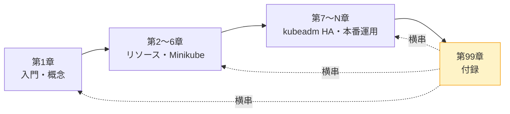
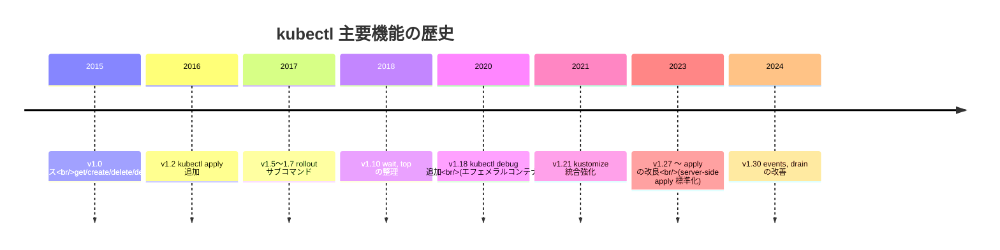
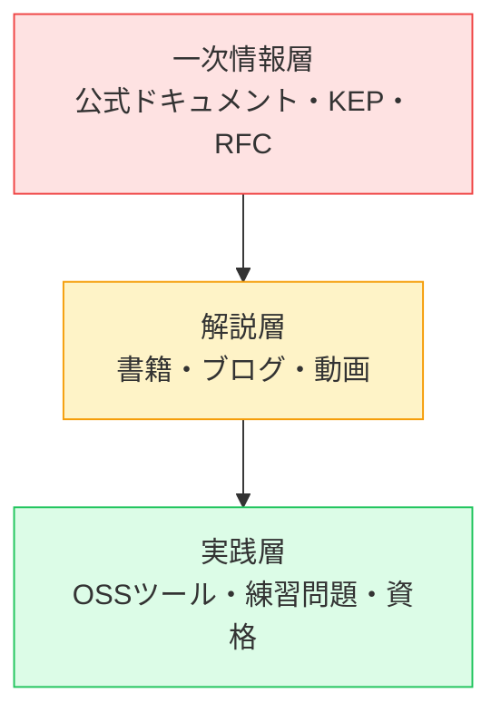
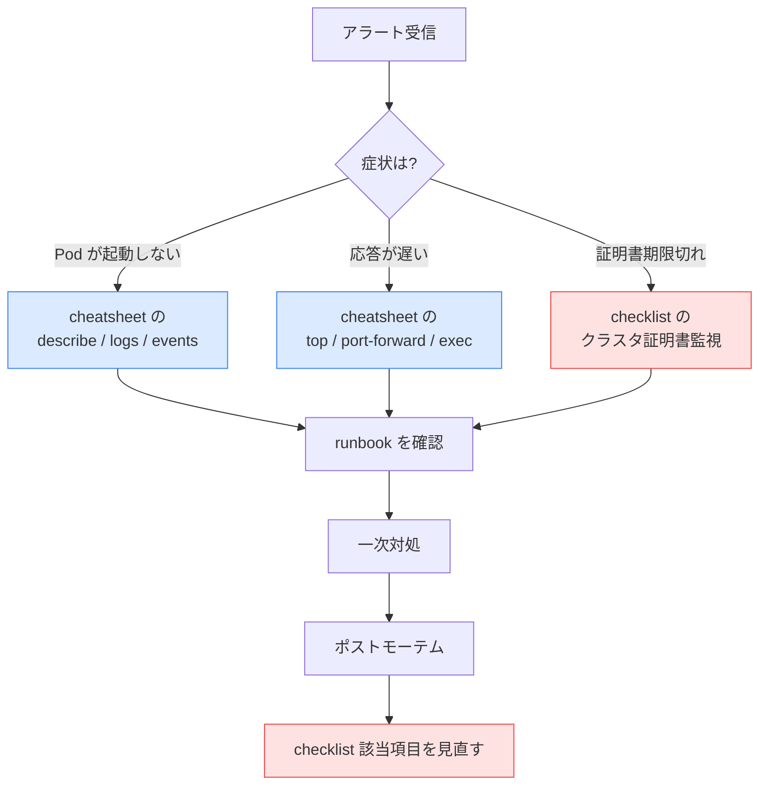
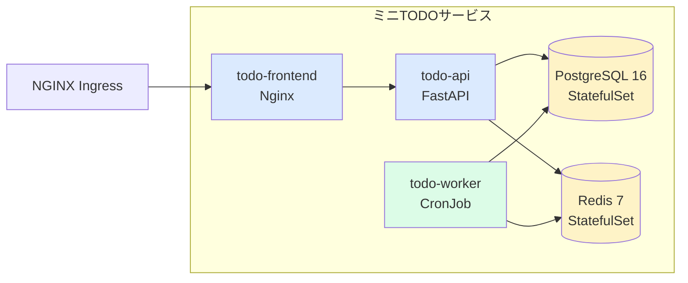
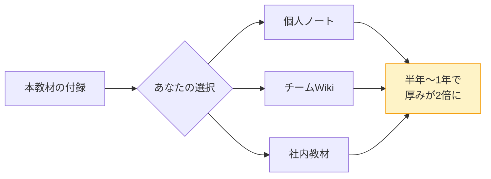
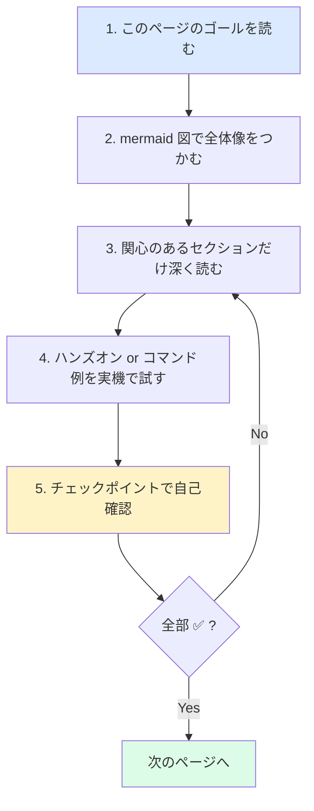

# 99. 付録
{: .no_toc }

## 目次
{: .no_toc .text-delta }

1. TOC
{:toc}

---

## このページのゴール

このページを読み終えると、以下を **自分の言葉で説明できる** ようになります。

- 付録の各ページが「本編のどこと対応していて」「どういう場面で開く資料か」を1分で答えられる
- kubectl チートシートを「読む資料」ではなく「現場で叩くための辞書」として位置づけられる
- 本番チェックリストを「ローンチ前の最後の門番」「定期的な健康診断のテンプレート」として運用イメージできる
- 参考文献・リンク集を「自分のレベルに応じてどこから手をつけるか」で読み解ける
- 付録に載っていない情報を求められたとき、本編・公式ドキュメント・コミュニティのどれを当たるかを切り分けられる
- 付録を読み終えたあとに「次に何を学ぶか」を自分の言葉で計画できる

---

## なぜ付録という章を最後に置くのか

### 教材構成上の意図

入門 Kubernetes は第1章から第N章まで、概ね「読みながら手を動かす」流れで進んでいきます。各章は **物語の順番で並んでいる** ため、たとえば「Service の YAML を後から見返したい」「`kubectl rollout undo` の構文を確認したい」と思ったとき、目次から該当章を逆引きするのは案外面倒です。

付録はその不便を解消するための **横串の参照資料** として位置づけられています。

本編は「概念 → 実装 → 運用」と縦に進む構造ですが、付録は **どの章からでも開ける引き出し** として横方向に走っています。具体的には次の3つです。

| ページ | 役割 | 想定される使い方 |
|---|---|---|
| kubectl チートシート | 「あのコマンドどう書くんだっけ?」の即時解決 | 障害対応中・コードレビュー中・新人説明中 |
| 本番チェックリスト | ローンチ前の漏れ確認・定期点検 | リリース前レビュー会・四半期健康診断 |
| 参考文献・リンク集 | 「次に何を読む?」の道しるべ | 章を読み終えた後・社内勉強会の参考資料探し |

### この章を「最初」に読む必要はない

付録は最後の章ですが、必ずしも順番通りに読む必要はありません。むしろ次のような使い方を想定しています。

- **第2章以降を読み始めた人** が、コマンドの全体像を把握するために `cheatsheet.md` をブックマークしておく
- **第10章付近で本番運用を学んでいる人** が `production-checklist.md` を開いて、自分のクラスタが何をクリアできていないかをセルフ診断する
- **すべての章を読み終えた人** が `references.md` から次のステップ(認定資格・OSSコントリビュート・専門書)を選ぶ

{: .tip }
> 紙の書籍であれば付録は「巻末で索引と一緒に置かれる薄い章」になりがちですが、ウェブ教材では各ページを単独で開くことができます。検索でこのページに辿り着いた読者にも、最低限の文脈が伝わるようにしています。

---

## 付録3ページの全体像

### 各ページの構成と密度

```mermaid
flowchart TB
    APP[99. 付録 index.md] --> CS[kubectl チートシート]
    APP --> PC[本番チェックリスト]
    APP --> REF[参考文献・リンク集]

    CS --> CS1[コンテキスト・Namespace 操作]
    CS --> CS2[get / describe / logs / exec]
    CS --> CS3[apply / rollout / scale]
    CS --> CS4[ラベル・port-forward]
    CS --> CS5[デバッグ Pod / ephemeral]
    CS --> CS6[JSONPath / custom-columns]
    CS --> CS7[エイリアス・補完]

    PC --> PC1[クラスタ基盤]
    PC --> PC2[Namespace / RBAC]
    PC --> PC3[ワークロード]
    PC --> PC4[Service / Ingress]
    PC --> PC5[ストレージ・Secret]
    PC --> PC6[CI/CD・GitOps]
    PC --> PC7[可観測性・SRE]

    REF --> REF1[公式ドキュメント]
    REF --> REF2[書籍]
    REF --> REF3[ブログ・動画]
    REF --> REF4[OSS ツール]
    REF --> REF5[資格・練習問題]

    style APP fill:#fef3c7,stroke:#f59e0b
    style CS fill:#dbeafe,stroke:#3b82f6
    style PC fill:#fee2e2,stroke:#ef4444
    style REF fill:#dcfce7,stroke:#22c55e
```

### それぞれが想定する読者像

| ページ | 「読み手」の典型例 |
|---|---|
| kubectl チートシート | 既に1章以上読んでおり、コマンドの意味は分かるが手が止まる人。または現場でテンポよく叩きたい中級者 |
| 本番チェックリスト | これからローンチを控えているチームリーダー・SRE。またはセキュリティ監査前の運用エンジニア |
| 参考文献・リンク集 | 全章読み終えた人・社内勉強会の主催者・認定資格を目指す人・コントリビュートしたい人 |

---

## 付録の歴史的経緯 ─ なぜ「チートシート」「チェックリスト」「リンク集」の3つなのか

### kubectl チートシートの起源

kubectl 自体は Kubernetes v1.0 (2015年7月) から存在する CLI ですが、初期の v1.0 〜 v1.4 ごろは選べる動詞も限られており、`kubectl get`, `kubectl create`, `kubectl delete`, `kubectl describe` ぐらいで足りていました。

しかし v1.5 以降に追加された機能群 ─ `kubectl apply` (宣言的構成管理の起点)、`kubectl rollout` (Deployment ローリングアップデート制御)、`kubectl port-forward` (ローカル開発支援)、`kubectl debug` (v1.18 〜、エフェメラルコンテナの操作) ─ が積み重なり、現在では **kubectl だけで覚えるべき動詞が30個以上、フラグは数百個** に達しています。

この爆発的増加に対し、公式ドキュメントは「kubectl Cheat Sheet」というページ ([https://kubernetes.io/docs/reference/kubectl/quick-reference/](https://kubernetes.io/docs/reference/kubectl/quick-reference/)) を維持していますが、それでも **「自分の現場で本当によく使う部分だけ凝縮したい」** という需要が消えませんでした。本教材のチートシートはまさにこの需要に応えるもので、初心者がプロのオペレーターに成長する過程で **手元に貼り出しておく1枚** を意識しています。

{: .note }
> 「チートシート(cheat sheet)」という呼び名は、本来は試験で持ち込み禁止のカンニング用紙を指す俗語です。エンジニアリングの世界では「短い参照カード」というポジティブな意味で定着しており、Kubernetes 公式も同じ言葉を使っています。

### 本番チェックリストの起源

「リリース前にチェックリストで確認する」という習慣は Kubernetes 固有のものではなく、もっと古い ─ 航空業界の Pre-flight Checklist が起源と言われています。Atul Gawande の書籍『The Checklist Manifesto』(2009) でその有効性が広く紹介され、IT 業界、特にクラウドネイティブの世界でもデプロイ前チェックリストが一般化しました。

Kubernetes における代表的なチェックリストには次のようなものがあります。

- **The Twelve-Factor App** (2011, Heroku 発祥): クラウドネイティブアプリの12箇条
- **CIS Kubernetes Benchmark** (Center for Internet Security): セキュリティ設定の項目別チェック
- **Production Readiness Review** (Google SRE 由来): サービスがプロダクション環境に値するかをレビューするプロセス
- **AWS Well-Architected Framework**: 5つの柱(信頼性・運用上の優秀性・パフォーマンス・コスト・セキュリティ)で多面評価

本教材の本番チェックリストは、これらを **Kubernetes 文脈で再編・圧縮した日本語版** と位置づけています。「全項目に Yes と答えられるまでローンチ延期」というルールは、上記の伝統を引き継いだものです。

### 参考文献・リンク集の役割

クラウドネイティブの世界は変化が早く、本教材のような体系的な学習教材だけでは情報が古びるリスクがあります。そこで「ここから先は外部の最新情報を追ってください」と橋渡しするのが参考文献ページの役目です。

具体的には以下の3層構造を意識しています。

迷ったら **一次情報層 (公式ドキュメント) を先に当たり**、必要に応じて解説層で噛み砕き、最終的には実践層で手を動かす ─ という流れを想定しています。

---

## 付録の使い方 ─ シーン別ナビゲーション

ここでは「こういう場面ではどのページを開くか」を具体例で示します。

### シーン1: 障害対応の真っ最中

午前3時、PagerDuty で叩き起こされて画面の前にいる、という状況。

- まず開くべきは **kubectl チートシート** の「トラブル時の高速確認」セクション
- 原因が判明したらポストモーテム時に **本番チェックリスト** を再点検し、再発防止策を入れる

### シーン2: 新サービスをローンチする1週間前

- **本番チェックリスト** を上から下まで目を通し、Yes と答えられない項目を Issue 化
- 不安な技術領域は **参考文献** から1冊ピックアップして勉強会を開く
- 最終リハーサルで **kubectl チートシート** の「YAML 生成」「rollout」を使ってデプロイ訓練

### シーン3: 後輩に Kubernetes を教える

- 教える内容に対応する本編の章 + **kubectl チートシート** の該当セクションをセットで渡す
- 半年後、後輩がチームリーダーになるタイミングで **本番チェックリスト** と **参考文献** をフォローアップ教材として渡す

### シーン4: CKA / CKAD / CKS を受験する

- 試験当日まで **kubectl チートシート** を3回は通読
- 出題範囲を **参考文献** の練習問題集 (Killer.sh) と公式ドキュメントで補強
- 受験後に **本番チェックリスト** を見直すと「学んだ内容が現場でどう活きるか」が立体的に分かる

---

## サンプルアプリ「ミニ TODO サービス」と付録の関係

本教材を通じて段階的に作り上げる **ミニ TODO サービス** (Nginx + FastAPI + PostgreSQL + Redis + 通知 Worker) は、付録の3ページすべてで参照されます。

各ページでの登場の仕方は次の通りです。

- **cheatsheet.md**: 「todo-api のログを見る」「todo-frontend を rollout restart する」など具体的なコマンド例で頻出
- **production-checklist.md**: 「PostgreSQL の StatefulSet には Retain 設定されているか?」「todo-api に PodDisruptionBudget はあるか?」と項目に紐づけて登場
- **references.md**: CloudNativePG (PostgreSQL の Operator) を「ミニ TODO サービスを本物の運用にするなら」という文脈で紹介

---

## VMware kubeadm 環境と付録の関係

第7章以降で構築する VMware ベースの HA クラスタは、付録の各ページで継続して参照されます。

| ホスト名 | IP | 役割 | 付録での登場 |
|---|---|---|---|
| k8s-lb   | 192.168.56.10 | HAProxy + keepalived + Docker Registry | cheatsheet の port-forward 例、checklist の HA / 証明書項目 |
| k8s-cp1〜cp3 | 192.168.56.11〜13 | Control Plane HA | checklist の「Control Plane HA 構成」項目で必須 |
| k8s-w1〜w3 | 192.168.56.21〜23 | Worker | cheatsheet の `kubectl drain`/`cordon` 例、checklist の Pod 分散項目 |
| k8s-nfs  | 192.168.56.30 | NFS サーバ | checklist の「PV 定期バックアップ」項目、cheatsheet の PVC 確認例 |

---

## 付録に「載っていないもの」と、その理由

付録は意図的に絞ってあります。次のような内容は **あえて載せていません**。

| 載せていない内容 | 理由 |
|---|---|
| 全ての kubectl サブコマンドの網羅 | 公式の `kubectl --help` と `kubectl reference` で常時最新が引けるため |
| 各 OSS の詳細な使い方 | バージョンで変わりやすく、公式ドキュメントが最新。リンク集に留める |
| クラウドプロバイダ固有(EKS/GKE/AKS)の情報 | 本教材はローカル完結方針 ─ 本編との一貫性を保つため |
| トラブルシュート百科事典 | 各章の該当セクションで詳述しており、付録は「全体俯瞰」に徹する |
| 用語集 | 本編で都度説明している。重複を避ける |

{: .important }
> 付録は「全部入り」ではなく「最頻出だけ」を狙っています。覚えるべき範囲を絞ったほうが、初心者から中級者への移行が早いという経験則によります。

---

## 付録を「育てる」 ─ 自分用カスタマイズの勧め

この教材の付録は出発点であって完成形ではありません。あなたの現場で **追加・削除・順序変更** を加え、自分のチーム用に育てていくことを推奨します。

### 育て方のパターン3つ

1. **個人ノート化**: GitHub の自分のリポジトリにフォークし、自分が叩いたコマンド・遭遇したエラー・解決策を追記
2. **チーム共有 Wiki 化**: Confluence / Notion / GitLab Wiki にコピーし、チームメンバーが編集できる形に
3. **社内教材化**: 本教材を社内で配布し、付録だけは社内固有(オンプレ構成・社内 Helm Chart リポジトリ等)に書き換える

---

## 学習進捗チェック ─ あなたは付録の何ページを使えるか

学習が進むと、付録の使い方も深まっていきます。以下のチェックを試してみてください。

### 入門者(本編1〜3章を読了)

- [ ] cheatsheet を見て `kubectl get pods -A` の `-A` が何を意味するか分かる
- [ ] cheatsheet の `kubectl apply -f .` がディレクトリ配下の YAML を全部 apply することが分かる
- [ ] production-checklist の各項目を「言葉として」読める

### 中級者(本編全章を読了)

- [ ] cheatsheet の JSONPath 例をコピペで使える
- [ ] production-checklist の各項目について「自分のクラスタは Yes か No か」即答できる
- [ ] references から自分のレベル+1段階上の書籍を選べる

### 上級者(本番運用1年以上)

- [ ] cheatsheet にない自分用のエイリアスを5個以上持っている
- [ ] production-checklist に「自社固有の項目」を5個以上追加できる
- [ ] references から CNCF プロジェクトに1つはコントリビュートしている

---

## 付録ページの読み方ガイド

各ページの冒頭は **ゴール**、末尾は **チェックポイント** という構造で統一されています。読むときは次の順で読むと効率的です。

---

## チェックポイント

ここまでで以下を **自分の言葉で** 説明できるか確認してください。

- [ ] なぜ「付録」を最後の章に置いているのか、その意図を説明できる
- [ ] kubectl チートシート、本番チェックリスト、参考文献の3ページがそれぞれ「どういう場面で開く資料か」を答えられる
- [ ] 自分の現状(入門・中級・上級)に応じて付録のどこから読み始めるべきかを決められる
- [ ] 付録に「載っていないもの」は何で、なぜ載せていないかを説明できる
- [ ] 付録を「自分用に育てる」3つのパターンを挙げられる
- [ ] サンプルアプリ「ミニ TODO サービス」と付録の3ページがどう絡むかを概観できる
- [ ] 障害対応中・ローンチ前・教育中・受験前など、シーン別にどのページを開くか即答できる

→ 次は [kubectl チートシート]({{ '/99-appendix/cheatsheet/' | relative_url }})
