# 本番チェックリスト
{: .no_toc }

## 目次
{: .no_toc .text-delta }

1. TOC
{:toc}

---

## このページのゴール

このページを読み終えると、以下を **自分の言葉で説明できる** ようになります。

- 本番チェックリストが「なぜ必要か」を歴史的経緯(航空業界・SRE・CIS Benchmark)から説明できる
- 各カテゴリ(クラスタ・Namespace・ワークロード・Service・ストレージ・設定・CI/CD・可観測性・SRE・セキュリティ・ドキュメント)で守るべき最低基準を列挙できる
- 各チェック項目について「なぜ必要か」「どう確認するか」「失敗するとどうなるか」を答えられる
- 自分のクラスタを上から下まで点検し、Yes/No で診断できる
- ローンチ前だけでなく、四半期ごとの定期点検・インシデント後のポストモーテムにも適用できる
- 自社固有の項目を追加して「自社版チェックリスト」に育てられる

---

## チェックリストの歴史と思想

### 航空業界に始まったチェックリスト文化

近代的なチェックリストの起源は1935年、ボーイング社の B-17 爆撃機の墜落事故に遡ります。当時の最新鋭機だった B-17 は計器・スイッチが多すぎ、テストパイロットでも手順を抜かして墜落する事故が起きました。原因究明の結果、「優秀な人材を投入しても複雑なシステムは安全に運用できない。手順書(checklist)が必要だ」という結論に至ったのです。

これは Atul Gawande の著書『The Checklist Manifesto』(2009) に詳しく、医療・建築・金融など各分野でチェックリストの導入が事故率を劇的に下げてきました。

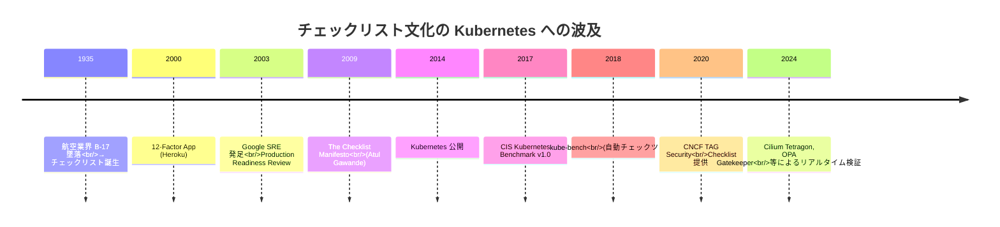

### なぜ Kubernetes でチェックリストが特に重要なのか

Kubernetes は **デフォルト値が「便利だが本番には不適切」** という設計が多数あります。歴史的経緯としては、まず OSS として普及するために導入のハードルを下げる必要があり、初期値は「動かしやすさ」を優先したためです。具体例:

- Pod に Resources Requests/Limits を指定しなくても起動する → ノード逼迫時に予期せぬ Pod が殺される
- ServiceAccount に `default` が使われる → 同じ Namespace の全 Pod が同じ権限を持つ
- ImagePullPolicy がタグなしや `latest` で起動する → イメージ更新で挙動が変わる
- NetworkPolicy がない状態だと **すべての Pod が相互通信可能** → 攻撃面の拡大

これらは「本番では明示的に締めなければならない」項目であり、チェックリストの存在意義そのものです。

### 「全項目 Yes になるまでローンチ延期」の本当の意味

このルールは Google SRE で言うところの **Production Readiness Review (PRR)** に対応します。PRR では、サービスをプロダクション環境に上げる前に SRE チームが横串でレビューを行い、合格しない限りリリースを認めません。

ただし「Yes」の解釈には注意が必要です。

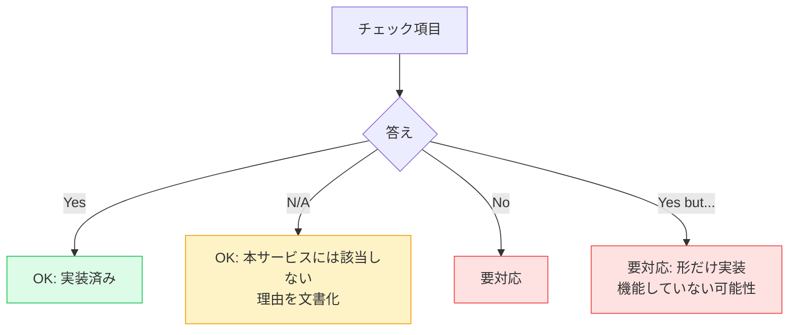

「Yes but...」(例: 「バックアップは動いているがリストアテストはしていない」)は実質的に No と同じです。**形ではなく機能で評価する** のがチェックリスト運用の鉄則です。

---

## チェックリストの全体像

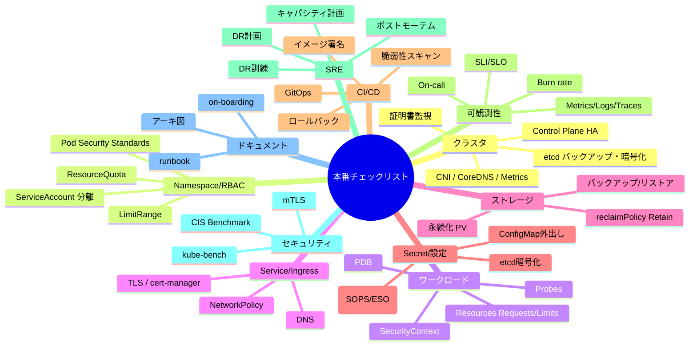

---

## カテゴリ1: クラスタ基盤

クラスタ自体が **「単一障害点 (SPOF) になっていないか」** がこの章のテーマです。Control Plane が落ちると新規 Pod のスケジュール・スケール・自動復旧がすべて止まります。

### Control Plane の HA 構成 (3台以上)

- [ ] Control Plane が HA 構成 (3台以上)

**なぜ必要か**: Control Plane は kube-apiserver / kube-scheduler / kube-controller-manager / etcd を含みます。これらが1台しかなければ、そのノードのハード障害でクラスタが操作不能になります。

**なぜ「3台」か**: etcd は Raft プロトコルでクォーラム合意を取るため、ノード数 N で許容できる障害台数は `(N-1)/2` です。

| etcd ノード数 | 許容障害台数 | 推奨 |
|---|---|---|
| 1 | 0 | 開発のみ |
| 2 | 0 (※2台では多数決不成立) | NG |
| 3 | 1 | 本番最小 |
| 5 | 2 | 大規模本番 |
| 7+ | 3 | 書き込み性能と耐久性のトレードオフ |

**確認コマンド**:

```bash
kubectl get nodes -l node-role.kubernetes.io/control-plane=
```

**期待される出力**:

```
NAME      STATUS   ROLES           AGE   VERSION
k8s-cp1   Ready    control-plane   30d   v1.30.3
k8s-cp2   Ready    control-plane   30d   v1.30.3
k8s-cp3   Ready    control-plane   30d   v1.30.3
```

**さらに**: API Server の前段に **ロードバランサ (HAProxy + keepalived)** が必要です。本教材では `k8s-lb` (192.168.56.10) がこの役割。クライアントは LB の VIP を kubeconfig に書きます。

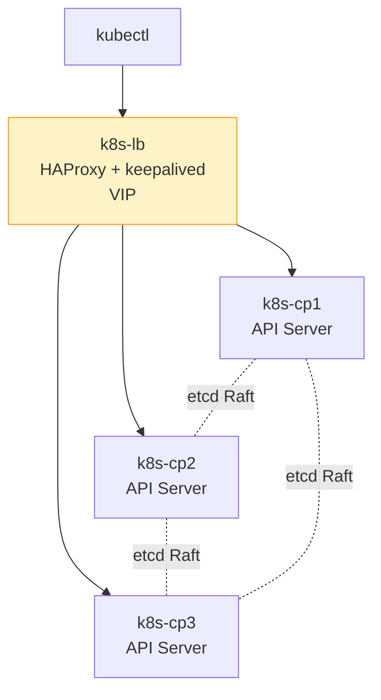

{: .warning }
> Control Plane が3台でも、その全てを **同じ物理ホスト/同じスイッチ/同じ AZ** に置いてしまうと意味がありません。物理的・地理的に分散させること。

### etcd の自動バックアップ

- [ ] etcd の自動バックアップが動いている

**なぜ必要か**: etcd は全 Kubernetes リソースの状態を保持する単一のデータベースです。etcd が壊れたら **クラスタ全体が消失** します。マニフェストファイルだけ手元にあっても、Secret や ConfigMap の値・Service の ClusterIP・PV のバインド情報などは復元できません。

**バックアップコマンド** (kubeadm 環境):

```bash
ETCDCTL_API=3 etcdctl snapshot save /backup/etcd-$(date +%F-%H%M).db \
  --endpoints=https://127.0.0.1:2379 \
  --cacert=/etc/kubernetes/pki/etcd/ca.crt \
  --cert=/etc/kubernetes/pki/etcd/server.crt \
  --key=/etc/kubernetes/pki/etcd/server.key
```

**自動化** (cron + systemd timer の例):

```bash
# /etc/systemd/system/etcd-backup.service
[Unit]
Description=Backup etcd
[Service]
Type=oneshot
ExecStart=/usr/local/bin/etcd-backup.sh

# /etc/systemd/system/etcd-backup.timer
[Unit]
Description=Run etcd backup hourly
[Timer]
OnCalendar=hourly
Persistent=true
[Install]
WantedBy=timers.target
```

**保存先**: ローカルディスクに置くだけでは「ホスト故障時に巻き添え」になります。必ず別ホスト・別ストレージ・できれば別データセンタへ転送します。

**保存ポリシー**: 直近24時間は1時間ごと、過去30日は1日ごと、過去1年は1ヶ月ごと、のような階層保管が定番。

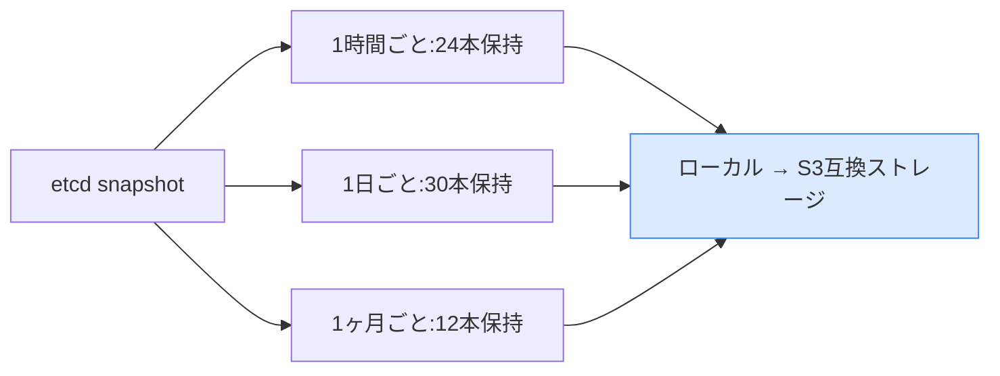

### etcd リストア手順を実機で試したことがある

- [ ] etcd リストア手順を実機で試したことがある

**なぜ必要か**: バックアップは取れているが、いざ復旧しようとしたら手順が分からない・ファイルが破損していた、というのが最悪のシナリオです。半年に1回は検証クラスタでリストア訓練を行うこと。

**リストア手順 (概略)**:

```bash
# 1. 全 Control Plane で etcd と kube-apiserver を停止
sudo systemctl stop kubelet

# 2. snapshot からリストア
ETCDCTL_API=3 etcdctl snapshot restore /backup/etcd-2024-11-17.db \
  --data-dir=/var/lib/etcd-restored \
  --name=k8s-cp1 \
  --initial-cluster=k8s-cp1=https://192.168.56.11:2380,k8s-cp2=https://192.168.56.12:2380,k8s-cp3=https://192.168.56.13:2380 \
  --initial-advertise-peer-urls=https://192.168.56.11:2380

# 3. 旧 data-dir を退避し、新 data-dir に差し替え
sudo mv /var/lib/etcd /var/lib/etcd.broken
sudo mv /var/lib/etcd-restored /var/lib/etcd

# 4. kubelet 再開
sudo systemctl start kubelet
```

### etcd 暗号化 (EncryptionConfiguration) 有効

- [ ] etcd 暗号化(EncryptionConfiguration)有効

**なぜ必要か**: etcd 上のデータはデフォルトでは平文です。Secret も `base64` でエンコードされているだけで、誰でも読めます。etcd のディスクを盗まれた場合、データベース管理者権限と同等の被害が出ます。

**確認方法**:

```bash
# Secret をいったん作成
kubectl create secret generic test-secret --from-literal=password=mysecret

# etcd 内のデータを直接読む (master ノードで)
ETCDCTL_API=3 etcdctl get /registry/secrets/default/test-secret \
  --endpoints=https://127.0.0.1:2379 \
  --cacert=/etc/kubernetes/pki/etcd/ca.crt \
  --cert=/etc/kubernetes/pki/etcd/server.crt \
  --key=/etc/kubernetes/pki/etcd/server.key
```

暗号化されていなければ `password=mysecret` が読めます。暗号化されていれば `k8s:enc:aescbc:v1:...` のような暗号文に。

**設定方法**: `/etc/kubernetes/encryption-config.yaml` を作成し、kube-apiserver に `--encryption-provider-config=...` を渡します。

```yaml
apiVersion: apiserver.config.k8s.io/v1
kind: EncryptionConfiguration
resources:
  - resources:
    - secrets
    providers:
    - aescbc:
        keys:
        - name: key1
          secret: <32バイトのbase64鍵>
    - identity: {}
```

設定後、既存 Secret を再暗号化するには:

```bash
kubectl get secrets --all-namespaces -o json | kubectl replace -f -
```

### kube-apiserver の audit log を収集

- [ ] kube-apiserver の audit log を収集している

**なぜ必要か**: 「誰が」「いつ」「何をしたか」が記録されていないと、インシデント発生時に追跡できません。コンプライアンス (ISO 27001, SOC 2, 個人情報保護) でも必須要件。

**設定方法**: `/etc/kubernetes/audit-policy.yaml` を作成:

```yaml
apiVersion: audit.k8s.io/v1
kind: Policy
rules:
  # Metadata レベル: 何があったかだけ記録
  - level: Metadata
    resources:
    - group: ""
      resources: ["secrets", "configmaps"]
  # RequestResponse レベル: 詳細記録
  - level: RequestResponse
    verbs: ["create", "update", "delete"]
    resources:
    - group: ""
      resources: ["pods", "services"]
  # 認証失敗
  - level: Metadata
    omitStages: ["RequestReceived"]
```

kube-apiserver に `--audit-policy-file=...` と `--audit-log-path=/var/log/audit.log` を渡す。

**ログ収集**: Fluent Bit / Vector などで Loki / ELK / S3 へ転送。

### 証明書期限の監視

- [ ] 証明書期限の監視がある

**なぜ必要か**: kubeadm でクラスタを構築すると、Control Plane 関連の証明書 (apiserver, controller-manager, scheduler, kubelet, etcd) はデフォルト **1年** で期限切れになります。期限切れ後はクラスタ操作が一切できなくなり、復旧に数時間〜数日かかる可能性があります。

**確認コマンド**:

```bash
sudo kubeadm certs check-expiration
```

**期待される出力**:

```
CERTIFICATE                EXPIRES                  RESIDUAL TIME   ...
admin.conf                 Nov 17, 2025 03:21 UTC   358d            ...
apiserver                  Nov 17, 2025 03:21 UTC   358d            ...
apiserver-etcd-client      Nov 17, 2025 03:21 UTC   358d            ...
apiserver-kubelet-client   Nov 17, 2025 03:21 UTC   358d            ...
controller-manager.conf    Nov 17, 2025 03:21 UTC   358d            ...
etcd-healthcheck-client    Nov 17, 2025 03:21 UTC   358d            ...
etcd-peer                  Nov 17, 2025 03:21 UTC   358d            ...
etcd-server                Nov 17, 2025 03:21 UTC   358d            ...
front-proxy-client         Nov 17, 2025 03:21 UTC   358d            ...
scheduler.conf             Nov 17, 2025 03:21 UTC   358d            ...
```

**更新**:

```bash
sudo kubeadm certs renew all
sudo systemctl restart kubelet
```

**自動監視**: Prometheus + blackbox_exporter で証明書期限を監視し、30日前にアラート。

```yaml
# Prometheus rule 例
- alert: KubeAPIServerCertExpiringSoon
  expr: apiserver_client_certificate_expiration_seconds_count{job="apiserver"} > 0
        and on(job) histogram_quantile(0.01, sum by (job, le) (rate(apiserver_client_certificate_expiration_seconds_bucket[5m]))) < 7*24*60*60
  annotations:
    summary: "API Server 証明書が7日以内に期限切れ"
```

### CNI が NetworkPolicy サポート

- [ ] CNI は NetworkPolicy をサポート (Calico/Cilium 等)

**なぜ必要か**: デフォルトのフラット L3 ネットワークでは、すべての Pod が全 Pod と通信できます。NetworkPolicy で必要最小限の通信のみ許可する必要があります。

しかし NetworkPolicy はマニフェストとして書けても、**実際に強制するかは CNI 次第** です。

| CNI | NetworkPolicy 対応 | 備考 |
|---|---|---|
| Calico | ✅ フル対応 | 本教材で採用 |
| Cilium | ✅ フル対応 + L7 (HTTP/gRPC) | eBPF ベース |
| Flannel | ❌ 非対応 | NetworkPolicy CR は作れるが無視される |
| Weave | ✅ 対応 | (現在は開発停止) |
| Canal | ✅ Calico ベース | Flannel + Calico ハイブリッド |

**確認コマンド**:

```bash
# Calico のインストール確認
kubectl get pods -n kube-system -l k8s-app=calico-node
kubectl get pods -n kube-system -l k8s-app=calico-kube-controllers
```

**テスト**: 「全部拒否」のポリシーを入れて、影響範囲が想定通りか確認:

```yaml
apiVersion: networking.k8s.io/v1
kind: NetworkPolicy
metadata:
  name: default-deny-all
  namespace: test
spec:
  podSelector: {}
  policyTypes:
  - Ingress
  - Egress
```

### CoreDNS の冗長化

- [ ] CoreDNS が冗長化されている

**なぜ必要か**: クラスタ内 DNS は Pod 間通信の起点です。CoreDNS が1台しかないと、そのノードが落ちたときに全 Pod が `getaddrinfo: temporary failure` で詰まります。

**確認**:

```bash
kubectl get deploy -n kube-system coredns
```

**期待される出力**:

```
NAME      READY   UP-TO-DATE   AVAILABLE   AGE
coredns   2/2     2            2           30d
```

レプリカ数が **最低2**、できれば3。HPA で動的にスケールするのも可。

**さらに**:

```yaml
spec:
  affinity:
    podAntiAffinity:
      requiredDuringSchedulingIgnoredDuringExecution:
      - labelSelector:
          matchLabels:
            k8s-app: kube-dns
        topologyKey: kubernetes.io/hostname
```

複数の CoreDNS が同じノードに偏らないよう PodAntiAffinity を設定。

### Metrics Server が動いている

- [ ] Metrics Server が動いている

**なぜ必要か**: `kubectl top` の表示、HPA、VPA の動作に必須。デフォルトクラスタには入っていません。

**インストール**:

```bash
kubectl apply -f https://github.com/kubernetes-sigs/metrics-server/releases/latest/download/components.yaml
```

**確認**:

```bash
kubectl top nodes
kubectl top pod -A
```

エラーが返るなら未稼働、またはオプション `--kubelet-insecure-tls` が未付与 (自己署名 kubelet 証明書の場合)。

### 監視・ロギング・トレースが動いている

- [ ] 監視・ロギング・トレースが動いている

これは可観測性カテゴリで詳述しますが、最低限以下の3つが揃っているかを確認:

| 種類 | 代表ツール | 役割 |
|---|---|---|
| Metrics | Prometheus + Grafana | 数値ベースの監視 |
| Logs | Loki / Elasticsearch + Fluent Bit | テキストログの集約 |
| Traces | Tempo / Jaeger + OpenTelemetry | 分散トレース |

---

## カテゴリ2: Namespace / RBAC

### Namespace を環境/チーム別に分割

- [ ] Namespace を環境/チーム別に分割している

**なぜ必要か**: Namespace は Kubernetes の **テナント境界** です。リソース名の衝突回避、RBAC の境界、ResourceQuota の単位として機能します。

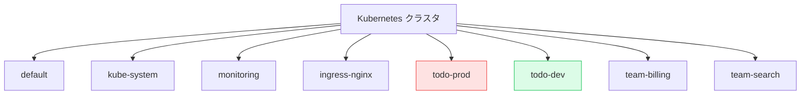

**やってはいけないアンチパターン**:

- 全アプリを `default` Namespace に入れる
- 環境を Namespace で分けず、ラベル `env=prod` だけで区別する
- 1つの Namespace に開発と本番が混在

**推奨命名規則**:

```
<アプリ名>-<環境>
todo-prod, todo-stg, todo-dev

または

<チーム名>
team-billing, team-search

または

<カテゴリ>
monitoring, logging, ingress, cert-manager
```

### ResourceQuota が設定されている

- [ ] ResourceQuota が設定されている

**なぜ必要か**: ResourceQuota がなければ、1つの Namespace が全クラスタリソースを食い潰せます。あるチームの暴走した Deployment が他のサービスを巻き込むのを防ぐ防火壁。

**例**:

```yaml
apiVersion: v1
kind: ResourceQuota
metadata:
  name: todo-prod-quota
  namespace: todo-prod
spec:
  hard:
    requests.cpu: "20"
    requests.memory: 40Gi
    limits.cpu: "40"
    limits.memory: 80Gi
    requests.storage: 500Gi
    pods: "100"
    services: "20"
    secrets: "30"
    persistentvolumeclaims: "20"
    services.nodeports: "0"        # NodePort 禁止
    services.loadbalancers: "2"
    count/deployments.apps: "10"
    count/cronjobs.batch: "5"
```

**確認**:

```bash
kubectl describe resourcequota -n todo-prod
```

**期待される出力**:

```
Name:                   todo-prod-quota
Namespace:              todo-prod
Resource                Used    Hard
--------                ----    ----
limits.cpu              5       40
limits.memory           10Gi    80Gi
pods                    12      100
requests.cpu            2       20
requests.memory         4Gi     40Gi
services.loadbalancers  1       2
```

### LimitRange でデフォルト Resources

- [ ] LimitRange でデフォルト Resources がある

**なぜ必要か**: ResourceQuota を設定すると、Resources Requests を **明示していない Pod は admission で弾かれます**。これだと「ちょっとした検証 Pod」が作れない。LimitRange は「指定がなければこの値を自動で付与」というデフォルトを提供します。

**例**:

```yaml
apiVersion: v1
kind: LimitRange
metadata:
  name: todo-prod-defaults
  namespace: todo-prod
spec:
  limits:
  - default:                  # limits 未指定時の値
      cpu: 500m
      memory: 512Mi
    defaultRequest:           # requests 未指定時の値
      cpu: 100m
      memory: 128Mi
    max:                      # 1 Pod の上限
      cpu: "4"
      memory: 8Gi
    min:                      # 1 Pod の下限
      cpu: 10m
      memory: 16Mi
    type: Container
  - max:
      storage: 100Gi
    type: PersistentVolumeClaim
```

### Pod Security Standards を restricted で適用

- [ ] Pod Security Standards を `restricted` で適用 (または audit/warn から段階適用中)

**歴史的経緯**: 旧来は **PodSecurityPolicy (PSP)** という機能がありましたが、v1.21 で deprecated、v1.25 で削除。代わりに **Pod Security Admission (PSA)** が標準化され、3段階のレベルが定義されました。

| レベル | 想定用途 | 例 |
|---|---|---|
| `privileged` | 制限なし | システムコンポーネント |
| `baseline` | 既知の権限昇格を防ぐ | 一般アプリ |
| `restricted` | 厳格なベストプラクティス | 機密データ扱うアプリ |

**3つのモード**:

| モード | 動作 |
|---|---|
| `enforce` | 違反は拒否 |
| `audit` | 違反を audit log に記録 |
| `warn` | 違反を kubectl の stderr に警告 |

**設定例** (Namespace ラベル):

```yaml
apiVersion: v1
kind: Namespace
metadata:
  name: todo-prod
  labels:
    pod-security.kubernetes.io/enforce: restricted
    pod-security.kubernetes.io/audit: restricted
    pod-security.kubernetes.io/warn: restricted
```

**段階的移行**: いきなり enforce にすると既存 Pod が起動しなくなる可能性があるので、まず audit/warn で適用 → ログから違反を洗い出し → 修正 → enforce、という流れが安全。

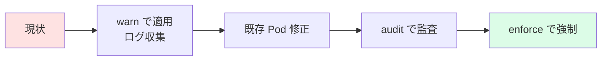

### 各アプリ用に ServiceAccount を分けている

- [ ] 各アプリ用に ServiceAccount を分けている

**なぜ必要か**: ServiceAccount は Pod がクラスタ API を叩くときの認証情報です。アプリ単位に分けることで RBAC を細かく設定でき、漏洩時の影響範囲を絞れます。

**やってはいけない例**:

```yaml
spec:
  # ServiceAccount 指定なし → default SA が使われる
  containers:
  - name: api
    image: ...
```

**良い例**:

```yaml
spec:
  serviceAccountName: todo-api-sa
  containers:
  - name: api
    image: ...
```

**ServiceAccount のトークン取得を抑制** (v1.24+):

```yaml
apiVersion: v1
kind: ServiceAccount
metadata:
  name: todo-api-sa
  namespace: todo-prod
automountServiceAccountToken: false        # API を呼ばないアプリならこれを false に
```

### default SA を使っていない

- [ ] `default` SA は使っていない、または最小権限

**確認**:

```bash
kubectl get pods -A -o jsonpath='{range .items[?(@.spec.serviceAccountName=="default")]}{.metadata.namespace}{"\t"}{.metadata.name}{"\n"}{end}'
```

このコマンドで何も出ない、または出るのは kube-system のシステム Pod のみが理想。

### human admin の権限は最小権限ベース

- [ ] human admin の権限は最小権限ベース、`cluster-admin` は緊急用のみ

**なぜ必要か**: `cluster-admin` を全エンジニアに配ると、誰でも本番を壊せる状態になります。SRE / 運用担当が日常作業で `cluster-admin` を使うのは避け、専用の Role / RoleBinding を作るべき。

**典型的なロール分け**:

| ロール | 権限 | 用途 |
|---|---|---|
| `cluster-admin` | 全権 | 緊急時のみ・監査ログ必須 |
| `admin` (組込) | Namespace 内全権 | チームリーダー |
| `edit` (組込) | Namespace 内編集 | 開発者 |
| `view` (組込) | Namespace 内読込 | レビュアー・新人 |
| カスタム `pod-debugger` | Pod の logs/exec のみ | デバッグ担当 |

---

## カテゴリ3: ワークロード

### 全 Pod に Resources Requests がある

- [ ] すべての Pod に Resources Requests がある

**なぜ必要か**: Requests は **スケジューラが Pod をどのノードに置くかを決める基準** です。Requests がない Pod は「リソース消費0」と見なされ、ノードが過密化してパフォーマンス劣化を起こします。

```yaml
resources:
  requests:
    cpu: 100m
    memory: 128Mi
  limits:
    memory: 256Mi
```

**確認 (LimitRange があれば自動付与されるが、明示推奨)**:

```bash
kubectl get pods -A -o json | jq -r '
  .items[]
  | select(.spec.containers[].resources.requests == null)
  | "\(.metadata.namespace)/\(.metadata.name)"
'
```

このコマンドで何も返らないのが理想。

### Memory Limits がある

- [ ] Memory Limits がある

**なぜ必要か**: Memory はオーバーコミットすると OOM Killer が動作し、ノード全体が不安定になります。**Memory は Requests と Limits を同じ値にする** のが定石。

```yaml
resources:
  requests:
    memory: 256Mi
  limits:
    memory: 256Mi    # 同じ値
```

### CPU Limits は付けない、または余裕を持って設定

- [ ] CPU Limits は付けない、または余裕を持って設定

**なぜ必要か** (議論あり): CPU Limits は cgroups の cfs_quota で **強制 throttling** を起こします。これがレイテンシスパイクの原因として度々問題化しました。

**派閥の比較**:

| 派閥 | 主張 |
|---|---|
| CPU Limits は付けない派 | Throttling による性能劣化を避ける。ノード単位で QoS を管理 |
| CPU Limits を付ける派 | 暴走 Pod がノードを食い潰すのを防ぐ。ResourceQuota が機能する |

**現状の推奨**: CPU Requests は **必ず** 付ける。CPU Limits は **Requests の3-5倍程度の余裕を持って** 付けるか、付けない。

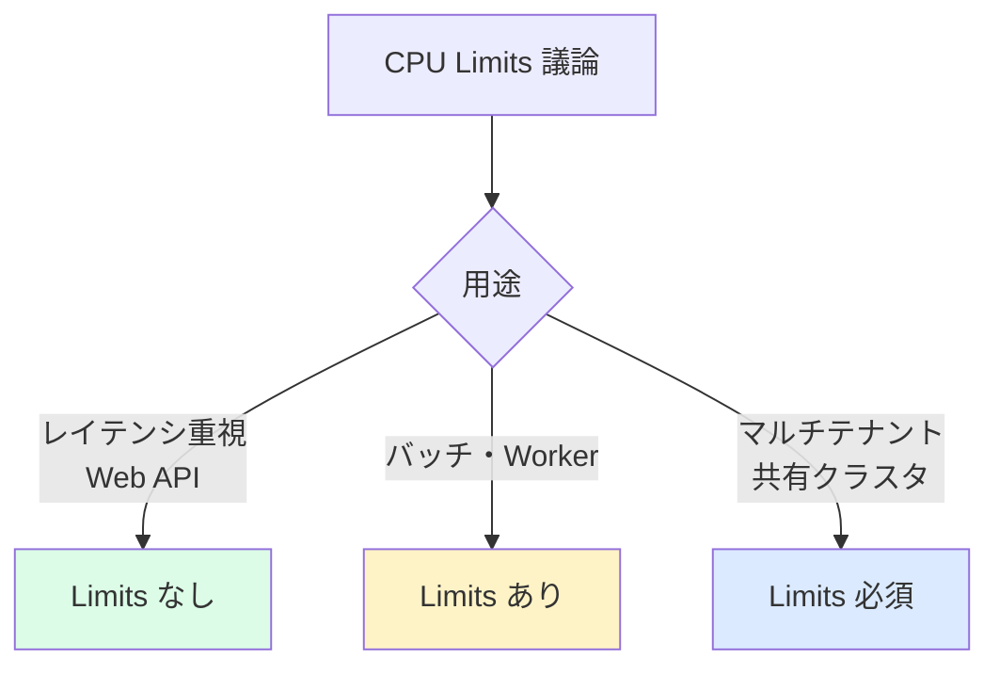

### Liveness Probe を必要なものだけに設定

- [ ] Liveness Probe を必要なものだけに設定

**なぜ「必要なものだけ」か**: Liveness Probe は失敗するとコンテナを **再起動** します。設定ミスや一時的な高負荷で誤判定すると、健全なアプリを永遠に再起動し続けることになります。

**設定すべき条件**:

- アプリが内部状態でデッドロックする可能性がある
- HTTP ハンドラの応答停止を機械的に検知できる
- 再起動で確実に復旧する見込みがある

**設定すべきでない条件**:

- DB 接続が一時的に切れただけで Liveness 失敗にする (Readiness で十分)
- 起動が遅いアプリで、起動中に Liveness が失敗する (Startup Probe を使う)

**例**:

```yaml
livenessProbe:
  httpGet:
    path: /healthz
    port: 8000
  initialDelaySeconds: 30
  periodSeconds: 10
  timeoutSeconds: 5
  failureThreshold: 3       # 3回連続失敗で再起動
```

### Readiness Probe を全 Web/API に設定

- [ ] Readiness Probe を全 Web/API に設定

**なぜ必要か**: Readiness Probe が失敗すると Service の Endpoints から外れます。起動中・一時的に応答できない Pod にトラフィックが流れるのを防ぐ。

```yaml
readinessProbe:
  httpGet:
    path: /readyz
    port: 8000
  initialDelaySeconds: 5
  periodSeconds: 5
  failureThreshold: 3
```

**Readiness と Liveness の使い分け**:

| 観点 | Readiness | Liveness |
|---|---|---|
| 失敗時の挙動 | Service から除外 (再起動なし) | コンテナ再起動 |
| 用途 | 一時的に応答できない時の隔離 | 完全に死んだ時の復活 |
| エンドポイント | DB 接続確認も含める | アプリのプロセス生存のみ |
| 失敗閾値 | 緩め (3-5回) | 厳しめ (3回) でも誤再起動に注意 |

### Startup Probe を起動が遅いアプリに設定

- [ ] Startup Probe を起動が遅いアプリに設定

**歴史**: v1.16 で追加。Java/JVM のように起動に1分以上かかるアプリで「起動中に Liveness が誤発火する」問題を解決するために導入されました。

```yaml
startupProbe:
  httpGet:
    path: /healthz
    port: 8000
  failureThreshold: 30          # 30回 × 10秒 = 5分まで起動を待つ
  periodSeconds: 10
livenessProbe:
  httpGet:
    path: /healthz
    port: 8000
  periodSeconds: 10             # Startup 成功後はこちらが動く
```

### Replicas は 2 以上

- [ ] Replicas は 2 以上(可用性 SLO ある場合)

**なぜ必要か**: レプリカ1台では、その Pod の再起動・ノード退避・ローリングアップデート時にダウンタイムが発生します。

**例外**: 単一インスタンスでないと動かないアプリ (古い Web アプリ、ライセンス制約があるソフトウェア) は1のままで、その代わり Pod Disruption Budget で守る。

### PodDisruptionBudget が設定されている

- [ ] PodDisruptionBudget が設定されている

**なぜ必要か**: Node Drain (`kubectl drain`) やクラスタアップグレード時に、Pod が一気に退避されるとサービスが落ちます。PDB は「同時に X 個まで退避可能」を宣言します。

**例**:

```yaml
apiVersion: policy/v1
kind: PodDisruptionBudget
metadata:
  name: todo-api-pdb
  namespace: todo-prod
spec:
  minAvailable: 2               # 最低2台は稼働
  # または
  # maxUnavailable: 1           # 同時に退避できるのは1台まで
  selector:
    matchLabels:
      app: todo-api
```

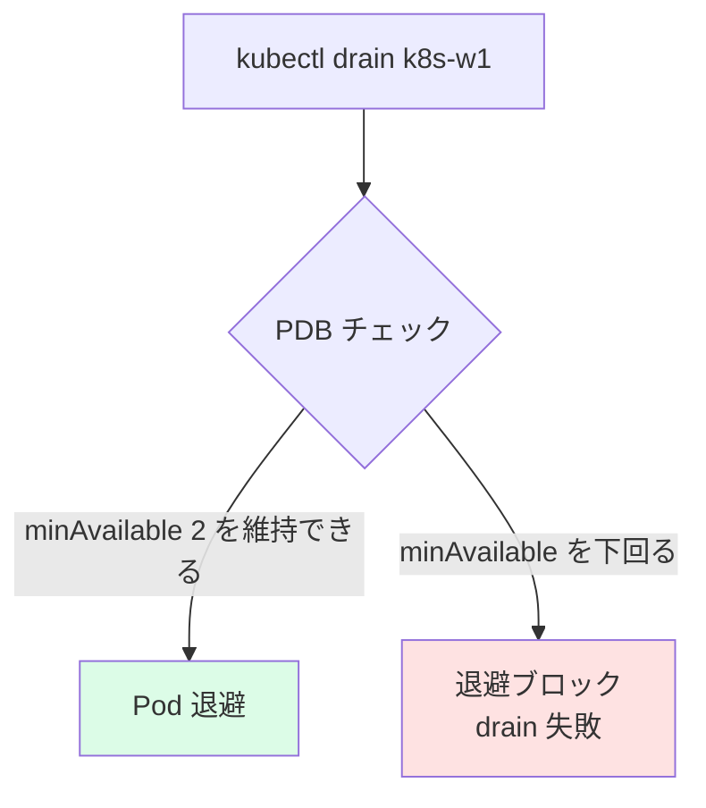

### Pod が異なるノードに分散

- [ ] 同一アプリの Pod が異なるノードに分散 (podAntiAffinity / topologySpreadConstraints)

**なぜ必要か**: 同じ Pod が全部1台のノードに偏ると、そのノード障害でサービス全停止。

**topologySpreadConstraints の例** (v1.19+ で推奨):

```yaml
spec:
  topologySpreadConstraints:
  - maxSkew: 1
    topologyKey: kubernetes.io/hostname
    whenUnsatisfiable: DoNotSchedule
    labelSelector:
      matchLabels:
        app: todo-api
```

**podAntiAffinity の例** (古典的):

```yaml
spec:
  affinity:
    podAntiAffinity:
      preferredDuringSchedulingIgnoredDuringExecution:
      - weight: 100
        podAffinityTerm:
          labelSelector:
            matchLabels:
              app: todo-api
          topologyKey: kubernetes.io/hostname
```

### root で動いていない

- [ ] root で動いていない (`runAsNonRoot: true`)

**なぜ必要か**: コンテナ内 root が取られると、コンテナエスケープ脆弱性 (CVE-2022-0185, CVE-2024-1086 等) を踏んだ際に **ノードホストの root** に昇格できる場合があります。

```yaml
spec:
  securityContext:
    runAsNonRoot: true
    runAsUser: 1000
    runAsGroup: 3000
    fsGroup: 2000
  containers:
  - name: api
    image: ...
    securityContext:
      allowPrivilegeEscalation: false
      capabilities:
        drop: ["ALL"]
      readOnlyRootFilesystem: true
```

### readOnlyRootFilesystem: true

- [ ] readOnlyRootFilesystem: true

**なぜ必要か**: マルウェアが書き込んでくるファイルパスを消し去る。アプリが書く必要のあるパスは `emptyDir` などで明示的にマウント。

```yaml
spec:
  containers:
  - name: api
    securityContext:
      readOnlyRootFilesystem: true
    volumeMounts:
    - name: tmp
      mountPath: /tmp
    - name: cache
      mountPath: /var/cache
  volumes:
  - name: tmp
    emptyDir: {}
  - name: cache
    emptyDir: {}
```

---

## カテゴリ4: Service / Ingress

### Service の selector が正しいラベル

- [ ] Service の selector が正しい labels に当たっている

**確認**:

```bash
# Service の selector
kubectl get svc todo-api -o jsonpath='{.spec.selector}'

# 該当する Pod
kubectl get pods -l app=todo-api

# Endpoints (Service が認識している Pod IP)
kubectl get endpoints todo-api
```

Endpoints が空なら selector が間違っている。

**典型的なやらかし**: Deployment 側で `app.kubernetes.io/name: todo-api` というラベル付与なのに、Service の selector は `app: todo-api` になっていた、というケース。本教材では一貫して `app.kubernetes.io/*` 推奨。

### Ingress に TLS が設定されている

- [ ] Ingress に TLS が設定されている(本番)

```yaml
apiVersion: networking.k8s.io/v1
kind: Ingress
metadata:
  name: todo-ingress
  annotations:
    cert-manager.io/cluster-issuer: letsencrypt-prod
spec:
  tls:
  - hosts:
    - todo.example.com
    secretName: todo-tls
  rules:
  - host: todo.example.com
    http:
      paths:
      - path: /
        pathType: Prefix
        backend:
          service:
            name: todo-api
            port:
              number: 80
```

### cert-manager で証明書自動更新

- [ ] cert-manager 等で証明書自動更新

cert-manager は ACME (Let's Encrypt) や HashiCorp Vault からの証明書発行・自動更新を担う OSS。インストール後、ClusterIssuer を作成しておくと、Ingress に annotation を付けるだけで証明書が発行される。

```yaml
apiVersion: cert-manager.io/v1
kind: ClusterIssuer
metadata:
  name: letsencrypt-prod
spec:
  acme:
    server: https://acme-v02.api.letsencrypt.org/directory
    email: admin@example.com
    privateKeySecretRef:
      name: letsencrypt-prod
    solvers:
    - http01:
        ingress:
          class: nginx
```

### NetworkPolicy で必要最小限の通信のみ許可

- [ ] NetworkPolicy で必要最小限の通信のみ許可

**設計順序**:

1. Namespace 内の全 Pod に「default deny」(Ingress/Egress 全拒否)
2. 必要な通信のみを許可ルールで追加 (allow list アプローチ)

```yaml
# 1. 全部拒否
apiVersion: networking.k8s.io/v1
kind: NetworkPolicy
metadata:
  name: default-deny-all
  namespace: todo-prod
spec:
  podSelector: {}
  policyTypes:
  - Ingress
  - Egress
---
# 2. todo-api → postgres を許可
apiVersion: networking.k8s.io/v1
kind: NetworkPolicy
metadata:
  name: allow-api-to-postgres
  namespace: todo-prod
spec:
  podSelector:
    matchLabels:
      app: postgres
  ingress:
  - from:
    - podSelector:
        matchLabels:
          app: todo-api
    ports:
    - port: 5432
---
# 3. todo-api → kube-dns を許可 (Egress)
apiVersion: networking.k8s.io/v1
kind: NetworkPolicy
metadata:
  name: allow-api-egress-dns
  namespace: todo-prod
spec:
  podSelector:
    matchLabels:
      app: todo-api
  policyTypes:
  - Egress
  egress:
  - to:
    - namespaceSelector:
        matchLabels:
          kubernetes.io/metadata.name: kube-system
      podSelector:
        matchLabels:
          k8s-app: kube-dns
    ports:
    - protocol: UDP
      port: 53
```

### DNS が全 Pod から引ける

- [ ] DNS がすべての Pod から引ける

**確認**:

```bash
kubectl run -it --rm dns-test --image=busybox --restart=Never -n todo-prod \
  -- nslookup todo-api.todo-prod.svc.cluster.local
```

応答がなければ CoreDNS / NetworkPolicy / kube-proxy のどこかが壊れている。

---

## カテゴリ5: ストレージ

### DB に永続 PV

- [ ] DB の StatefulSet には `volumeClaimTemplates` で永続 PV

**やってはいけない例**:

```yaml
# Deployment で DB を動かす ← データが揮発する
apiVersion: apps/v1
kind: Deployment
metadata:
  name: postgres
spec:
  template:
    spec:
      containers:
      - name: postgres
        image: postgres:16
        volumeMounts:
        - name: data
          mountPath: /var/lib/postgresql/data
      volumes:
      - name: data
        emptyDir: {}             # ← Pod 削除で消える!
```

**良い例**:

```yaml
apiVersion: apps/v1
kind: StatefulSet
metadata:
  name: postgres
spec:
  serviceName: postgres
  replicas: 1
  volumeClaimTemplates:
  - metadata:
      name: data
    spec:
      accessModes: ["ReadWriteOnce"]
      storageClassName: nfs
      resources:
        requests:
          storage: 20Gi
  template:
    spec:
      containers:
      - name: postgres
        image: postgres:16
        volumeMounts:
        - name: data
          mountPath: /var/lib/postgresql/data
```

### reclaimPolicy: Retain

- [ ] reclaimPolicy: Retain

**なぜ必要か**: StorageClass のデフォルト reclaimPolicy が `Delete` の場合、**PVC を間違えて削除した瞬間に PV と実データも消えます**。本番では `Retain` で「PVC 削除しても PV だけ残る」設定が安全。

```yaml
apiVersion: storage.k8s.io/v1
kind: StorageClass
metadata:
  name: nfs
provisioner: nfs.csi.k8s.io
reclaimPolicy: Retain          # ← ここが重要
volumeBindingMode: Immediate
parameters:
  server: 192.168.56.30
  share: /export/k8s
```

### PV の定期バックアップ

- [ ] PV の定期バックアップ (Velero / CSI Snapshot)

**Velero**: クラスタ全体のリソース + PV のスナップショットを取って S3 互換ストレージへ。

```bash
# インストール
velero install \
  --provider aws \
  --plugins velero/velero-plugin-for-aws:v1.8.0 \
  --bucket k8s-backups \
  --secret-file ./credentials \
  --backup-location-config region=ap-northeast-1

# バックアップ
velero backup create todo-prod-daily --include-namespaces todo-prod

# スケジュール
velero schedule create todo-prod-daily \
  --schedule="0 2 * * *" \
  --include-namespaces todo-prod \
  --ttl 720h
```

### リストア手順を試したことがある

- [ ] バックアップからのリストア手順を試したことがある

これは etcd と同じく、形だけのバックアップでは意味がありません。半年に1回はリストア訓練を。

---

## カテゴリ6: 設定 / Secret

### 設定値は ConfigMap / Secret に外出し

- [ ] 設定値は ConfigMap / Secret に外出し、イメージに焼き込まない

**12-Factor App の Factor III** (Config) に対応。設定をコードから分離する。

**典型的なアンチパターン**:

```dockerfile
# NG: イメージに設定が焼かれている
ENV DB_HOST=prod-db.internal
ENV DB_PASSWORD=Pass123!
```

**良い例**:

```yaml
envFrom:
- configMapRef:
    name: todo-config
- secretRef:
    name: todo-secret
```

### Secret を Git に置かない

- [ ] Secret は Sealed Secrets / ESO 等で管理、Git に平文を置かない

**選択肢**:

| ツール | 仕組み | 用途 |
|---|---|---|
| Sealed Secrets | 公開鍵で暗号化、クラスタ内で復号 | GitOps の Git リポジトリに暗号文を入れたい |
| External Secrets Operator (ESO) | Vault/AWS Secrets Manager 等を参照 | 既存の Secret 管理基盤がある |
| SOPS + age | ファイル単位で暗号化 | シンプル・Kustomize 統合 |
| HashiCorp Vault Agent Injector | Init Container で取得 | 高セキュリティ要件 |

**Sealed Secrets の例**:

```bash
# 平文 Secret を作成
kubectl create secret generic todo-secret \
  --from-literal=DB_PASSWORD='Pass123!' \
  --dry-run=client -o yaml > secret.yaml

# シール
kubeseal --controller-namespace kube-system < secret.yaml > sealed-secret.yaml

# sealed-secret.yaml は Git にコミット可能 (公開鍵で暗号化済み)
git add sealed-secret.yaml
git commit -m "Add todo-secret"
```

### パスワード・API Key の rotate 手順

- [ ] パスワードや API Key の rotate 手順がある

**最低限の要件**:

- 90日 / 1年などの定期 rotate
- インシデント時の緊急 rotate (24時間以内)
- rotate 中もアプリが落ちない仕組み (Old + New を並行運用)

---

## カテゴリ7: CI/CD

### イメージタグに latest を使っていない

- [ ] イメージタグに `latest` を使っていない

**なぜダメか**: `latest` は **イミュータブルではない**。今日 `nginx:latest` を pull したものと明日 pull したものが違うかもしれません。再現性・ロールバック性が失われます。

**推奨**:

```yaml
# OK
image: 192.168.56.10:5000/todo-api:0.1.0
image: 192.168.56.10:5000/todo-api:v1.2.3
image: 192.168.56.10:5000/todo-api@sha256:abc123...    # 完全なイミュータブル

# NG
image: 192.168.56.10:5000/todo-api:latest
image: 192.168.56.10:5000/todo-api               # latest と同義
```

`imagePullPolicy: IfNotPresent` (デフォルト) と組み合わせれば、ノード上の古い `latest` がそのまま使われ続けるという事故も起きうる。

### CI で Trivy / kube-linter / kubeconform が動いている

- [ ] CI で Trivy / kube-linter / kubeconform が動いている

| ツール | 役割 |
|---|---|
| Trivy | イメージの脆弱性スキャン |
| kube-linter | YAML のベストプラクティス検査 |
| kubeconform | YAML が Kubernetes スキーマに従っているかの構文検査 |
| Polaris | より厳しい運用基準チェック |
| kube-score | スコアリング |

**CI 例 (GitHub Actions)**:

```yaml
- name: Lint manifests
  run: |
    kubeconform -strict manifests/*.yaml
    kube-linter lint manifests/

- name: Scan image
  uses: aquasecurity/trivy-action@master
  with:
    image-ref: '192.168.56.10:5000/todo-api:${{ github.sha }}'
    severity: 'CRITICAL,HIGH'
    exit-code: 1
```

### イメージ署名 (cosign)

- [ ] イメージに署名 (cosign) と検証

**なぜ必要か**: イメージレジストリが侵害された場合、悪意ある同名タグのイメージを掴まされる可能性があります。署名検証でこれを防ぐ。

```bash
# 署名
cosign sign --key cosign.key 192.168.56.10:5000/todo-api:0.1.0

# 検証
cosign verify --key cosign.pub 192.168.56.10:5000/todo-api:0.1.0

# クラスタ内での検証 (Policy Controller)
kubectl apply -f - <<EOF
apiVersion: policy.sigstore.dev/v1beta1
kind: ClusterImagePolicy
metadata:
  name: require-signed
spec:
  images:
  - glob: "192.168.56.10:5000/**"
  authorities:
  - key:
      data: |
        -----BEGIN PUBLIC KEY-----
        ...
        -----END PUBLIC KEY-----
EOF
```

### GitOps でデプロイ

- [ ] GitOps (Argo CD / Flux) でデプロイ

**なぜ必要か**: 「誰が」「いつ」「何を」変更したかを Git の履歴で追跡可能にする。ロールバックは `git revert` で実行できる。

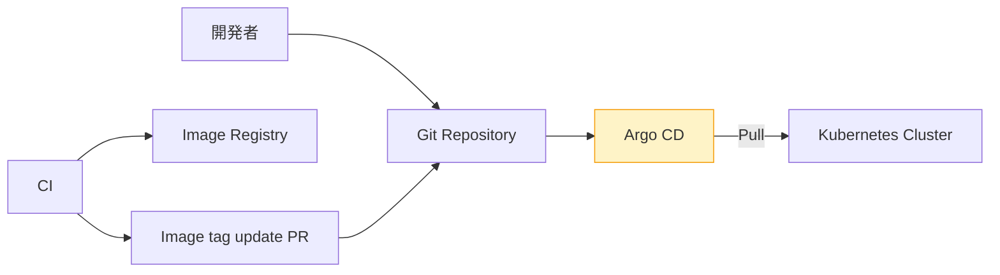

### ロールバック手順がある

- [ ] ロールバック手順がある (`kubectl rollout undo` または `argocd app rollback`)

**訓練必須**: ロールバック手順は文書だけでなく、本番で実機で試したことがあるかが重要。

### カナリア / Blue-Green リリース可能

- [ ] カナリア / Blue-Green リリース可能 (本当に重要なサービスなら)

**手段**:

| 手段 | 説明 |
|---|---|
| Deployment の rolling update | 標準。バージョン2の Pod を徐々に増やす |
| Argo Rollouts | カナリア・Blue-Green を CR で宣言的に |
| Flagger | Service Mesh と連携した自動カナリア |
| Istio / Linkerd の Traffic Split | L7 でのトラフィック制御 |

---

## カテゴリ8: 可観測性

### Prometheus で SLI を見ている

- [ ] メトリクス (Prometheus) で四大指標 (Saturation, Errors, Latency, Traffic) を見ている

**Google SRE の "Four Golden Signals"**:

| 指標 | 意味 | 例 (PromQL) |
|---|---|---|
| Traffic | リクエスト量 | `rate(http_requests_total[5m])` |
| Errors | エラー率 | `rate(http_requests_total{code=~"5.."}[5m])` |
| Latency | 応答時間 | `histogram_quantile(0.99, rate(http_request_duration_seconds_bucket[5m]))` |
| Saturation | 飽和度 | `rate(container_cpu_usage_seconds_total[5m])` |

### ログを集約

- [ ] ログ (Loki/ELK) を集約

**Loki スタック**:

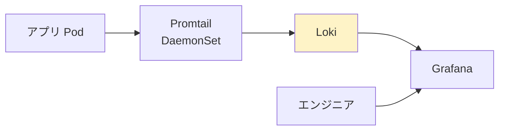

### トレースを取得

- [ ] トレース (Tempo/Jaeger) を取得

OpenTelemetry でアプリを計装し、Tempo/Jaeger に送る。分散システムでは「どこで遅いか」をトレースなしで突き止めるのは困難。

### SLI / SLO を定義

- [ ] SLI / SLO を定義

| 用語 | 意味 |
|---|---|
| SLI (Service Level Indicator) | サービスの品質を測る具体的な指標 (例: HTTP 5xx 率) |
| SLO (Service Level Objective) | SLI に対する目標値 (例: 5xx 率 < 0.1%) |
| SLA (Service Level Agreement) | 顧客との契約 (SLO を守れなかった時の補償等) |
| エラーバジェット | SLO の余り (例: 月の 0.1% = 約43分のダウン許容) |

### Burn rate アラート

- [ ] Burn rate アラートを設定

**Burn rate**: エラーバジェットの消費速度。例えば「1時間で月間バジェットの 50% を消費したら、月末まで持たない」ような状況を早期に検出する。

```promql
# 短期 burn rate
(
  sum(rate(http_requests_total{code=~"5.."}[5m]))
  /
  sum(rate(http_requests_total[5m]))
) > (14.4 * 0.001)    # SLO 99.9%, 1時間でバジェット消費2%相当
```

### アラートに runbook URL

- [ ] アラートに runbook URL を付与

```yaml
groups:
- name: todo-api
  rules:
  - alert: HighErrorRate
    expr: ...
    annotations:
      summary: "todo-api の 5xx 率が高い"
      runbook_url: "https://wiki.example.com/runbooks/todo-api-high-error"
```

### On-call ローテーション

- [ ] On-call ローテーションがある

PagerDuty / Opsgenie 等で1次対応のローテーション。属人化を防ぐ。

### Incident Channel と通知ツール

- [ ] Incident Channel と通知ツール (Slack/PagerDuty) の設定

インシデント発生時に開く専用 Slack チャンネルのテンプレート、対応者の自動アサイン、ステータスページ連携など。

---

## カテゴリ9: SRE

### DR 計画 (RPO/RTO)

- [ ] DR 計画 (RPO/RTO) が文書化

| 用語 | 意味 |
|---|---|
| RPO (Recovery Point Objective) | データ消失許容量(時間で表現)。例: 1時間 = 直近1時間のデータは失っても良い |
| RTO (Recovery Time Objective) | 復旧時間目標。例: 4時間 = 障害発生から4時間以内に復旧 |

### DR 訓練を半年に1回

- [ ] DR 訓練を半年に1回実施

文書だけで終わらない。「実際にクラスタを潰してリストアする」訓練が必須。

### ポストモーテムテンプレート

- [ ] ポストモーテムテンプレートがある

**典型的なポストモーテムの構成**:

```markdown
# インシデント #123 ポストモーテム

## サマリー
- 日時: 2024-11-17 03:21 〜 04:45 JST
- 影響: todo-api のエラー率が 100% に
- 検知方法: PagerDuty アラート
- 対応者: alice, bob

## タイムライン
- 03:21 アラート発生
- 03:25 alice が対応開始
- 03:40 原因特定 (etcd ディスクフル)
- 04:30 復旧
- 04:45 完全復旧確認

## 根本原因
...

## 何がうまくいったか
...

## 何がうまくいかなかったか
...

## アクションアイテム
- [ ] etcd ディスク使用率の監視を追加 (担当: alice, 期限: 2024-11-30)
- [ ] etcd データ retention 設定の見直し (担当: bob, 期限: 2024-12-15)
```

**Blameless** (個人を責めない) ポストモーテム文化が重要。

### アクションアイテムの追跡

- [ ] アクションアイテムの追跡がある

GitHub Issue / Jira などで明確にトラッキング。期限と担当者を必ず設定。

### キャパシティプランニング

- [ ] キャパシティプランニングを月次で実施

CPU/Memory の使用量推移、トラフィックの伸び率、ストレージ消費を見て、次の3-6ヶ月の必要リソースを試算。

---

## カテゴリ10: 通信・セキュリティ

### mTLS で内部通信暗号化

- [ ] mTLS で内部通信暗号化(必要なら Service Mesh)

Service Mesh (Istio / Linkerd) を導入すれば、アプリ側のコード変更なしで Pod 間通信を mTLS で暗号化できる。

### CRITICAL 脆弱性 0

- [ ] Image scan の結果を見て、CRITICAL 脆弱性 0 を維持

**Trivy** でスキャン:

```bash
trivy image --severity CRITICAL,HIGH 192.168.56.10:5000/todo-api:0.1.0
```

### CIS Kubernetes Benchmark をクリア

- [ ] CIS Kubernetes Benchmark をクリア

**CIS Benchmark**: Center for Internet Security が発行する Kubernetes セキュリティ設定の標準。100以上の項目を網羅。

### kube-bench を CI で

- [ ] kube-bench を CI で動かしている

```bash
docker run --pid=host -v /etc:/etc:ro -v /var:/var:ro -v ~/.kube:/.kube:ro \
  -t aquasec/kube-bench:latest run --targets master,node
```

**期待される出力 (抜粋)**:

```
[INFO] 1 Control Plane Security Configuration
[INFO] 1.1 Control Plane Node Configuration Files
[PASS] 1.1.1 Ensure that the API server pod specification file permissions are set to 644
[FAIL] 1.1.2 Ensure that the API server pod specification file ownership is set to root:root
[WARN] 1.2.7 Ensure that the --authorization-mode argument is not set to AlwaysAllow
```

---

## カテゴリ11: ドキュメント

### アーキテクチャ図がある

- [ ] アーキテクチャ図がある

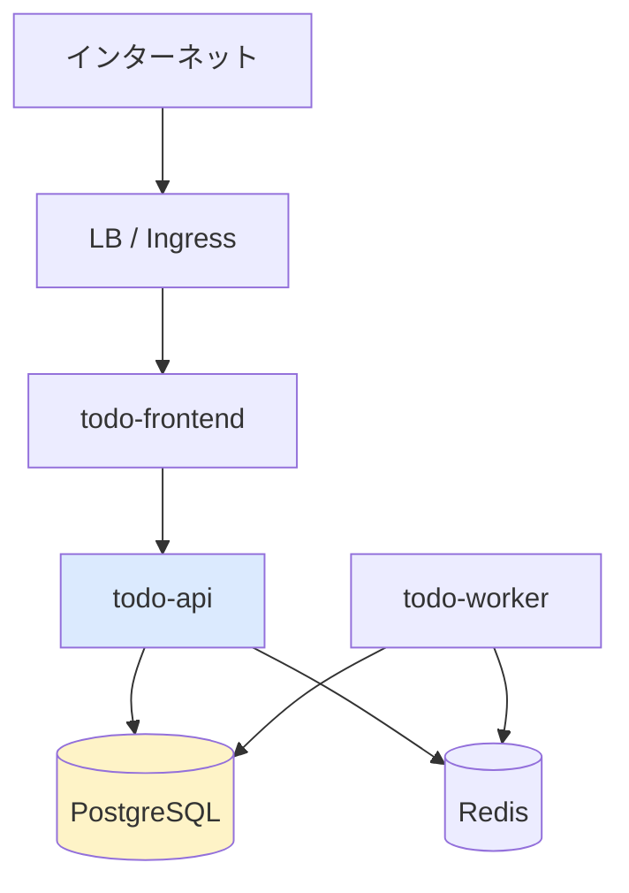

最低限、システムの構成要素・通信経路・データの流れが分かる図。

### runbook (障害対応手順) がある

- [ ] runbook (障害対応手順) がある

各アラートに対応する runbook が **wiki / GitHub Pages 等で参照可能** であること。例:

```markdown
# Runbook: todo-api の 5xx 率上昇

## 確認手順
1. Grafana ダッシュボード `todo-api Overview` を開く
2. エラーログを確認: `kubectl logs -n todo-prod -l app=todo-api --tail=200`
3. DB 接続を確認: `kubectl exec -it -n todo-prod deploy/todo-api -- pg_isready -h postgres`

## 過去のインシデント
- #123 (2024-11-17): etcd ディスクフルが原因
- #145 (2024-12-03): DB コネクションプール枯渇

## 緊急対応
1. レプリカを増やす: `kubectl scale -n todo-prod deploy/todo-api --replicas=5`
2. 直前にロールバック: `kubectl rollout undo -n todo-prod deploy/todo-api`
```

### on-boarding ドキュメント

- [ ] on-boarding ドキュメントがある

新人エンジニアが「kubeconfig をどこからもらうか」「最低限叩くコマンド」「困った時の連絡先」が分かる文書。1日で基本作業ができるようにする。

### アラート → runbook が紐付いている

- [ ] アラート → runbook が紐付いている

すべての Prometheus アラートに `runbook_url` annotation。Slack や PagerDuty 通知にリンクが含まれること。

---

## チェックリストの運用方法

### ローンチ前のレビュー会

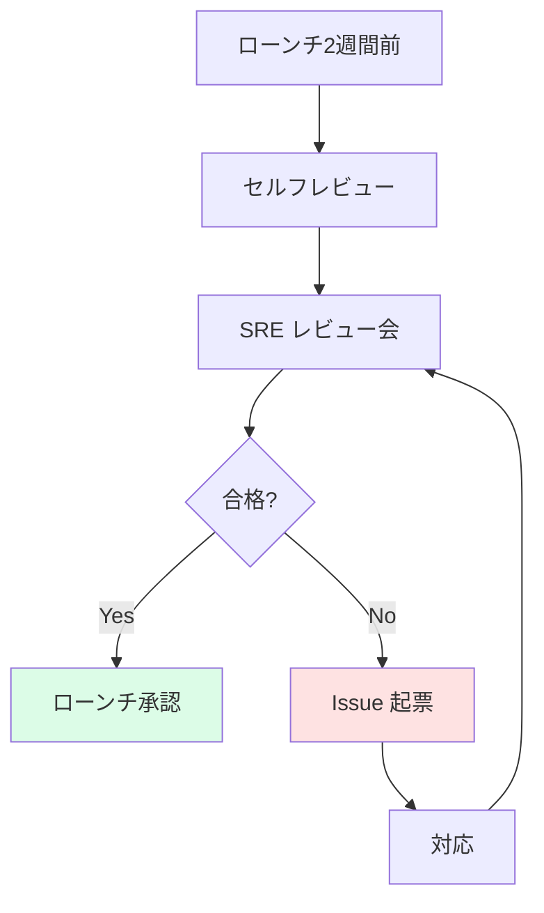

### 定期点検

- 四半期に1回、全項目を見直し
- 半年に1回、DR 訓練 + etcd リストア訓練
- 1年に1回、CIS Benchmark 完全実行

### インシデント後の見直し

ポストモーテムのアクションアイテムから、チェックリストに項目を **追加** していく。これが「自社版チェックリスト」を育てる王道。

---

## 自社版チェックリストへの拡張ヒント

本テンプレートはあくまで一般論。以下の観点で項目を足してください。

| 観点 | 追加項目の例 |
|---|---|
| 業界規制 | PCI-DSS, HIPAA, GDPR などのコンプライアンス確認 |
| 言語/フレームワーク固有 | JVM heap size, Node.js cluster mode, Python GIL |
| インフラ固有 | オンプレ特有のネットワーク制約, 社内 PKI との連携 |
| チーム文化 | コードレビューフロー, 障害訓練の頻度 |
| 顧客契約 | SLA に書かれた可用性要件, RTO の契約上の上限 |

---

## チェックリスト全項目の早見表

便利のために全項目を表で再掲します。

| カテゴリ | 項目 |
|---|---|
| クラスタ | Control Plane HA(3台以上) |
| クラスタ | etcd 自動バックアップ |
| クラスタ | etcd リストア訓練済 |
| クラスタ | etcd 暗号化 |
| クラスタ | API Server audit log |
| クラスタ | 証明書期限監視 |
| クラスタ | NetworkPolicy 対応 CNI |
| クラスタ | CoreDNS 冗長化 |
| クラスタ | Metrics Server 稼働 |
| クラスタ | 監視・ログ・トレース基盤 |
| Namespace/RBAC | Namespace 分割 |
| Namespace/RBAC | ResourceQuota |
| Namespace/RBAC | LimitRange |
| Namespace/RBAC | Pod Security Standards restricted |
| Namespace/RBAC | アプリ別 ServiceAccount |
| Namespace/RBAC | default SA を使わない |
| Namespace/RBAC | cluster-admin は緊急用のみ |
| ワークロード | Resources Requests |
| ワークロード | Memory Limits |
| ワークロード | CPU Limits 適切 |
| ワークロード | Liveness Probe |
| ワークロード | Readiness Probe |
| ワークロード | Startup Probe |
| ワークロード | Replicas 2 以上 |
| ワークロード | PodDisruptionBudget |
| ワークロード | Pod 分散配置 |
| ワークロード | runAsNonRoot |
| ワークロード | readOnlyRootFilesystem |
| Service/Ingress | Service selector 正確 |
| Service/Ingress | Ingress TLS |
| Service/Ingress | cert-manager |
| Service/Ingress | NetworkPolicy |
| Service/Ingress | DNS 疎通 |
| ストレージ | volumeClaimTemplates |
| ストレージ | reclaimPolicy: Retain |
| ストレージ | PV 定期バックアップ |
| ストレージ | リストア訓練 |
| 設定/Secret | ConfigMap/Secret 外出し |
| 設定/Secret | Git に平文を置かない |
| 設定/Secret | etcd 暗号化 |
| 設定/Secret | Secret rotate 手順 |
| CI/CD | latest を使わない |
| CI/CD | Trivy/kube-linter/kubeconform |
| CI/CD | イメージ署名 (cosign) |
| CI/CD | GitOps |
| CI/CD | ロールバック手順 |
| CI/CD | カナリア/Blue-Green |
| 可観測性 | 四大指標監視 |
| 可観測性 | ログ集約 |
| 可観測性 | 分散トレース |
| 可観測性 | SLI/SLO 定義 |
| 可観測性 | Burn rate アラート |
| 可観測性 | runbook URL annotation |
| 可観測性 | On-call ローテ |
| 可観測性 | インシデント通知 |
| SRE | DR 計画 RPO/RTO |
| SRE | DR 訓練 |
| SRE | ポストモーテムテンプレ |
| SRE | アクションアイテム追跡 |
| SRE | キャパシティ計画 |
| セキュリティ | mTLS |
| セキュリティ | CRITICAL 脆弱性 0 |
| セキュリティ | CIS Benchmark |
| セキュリティ | kube-bench |
| ドキュメント | アーキ図 |
| ドキュメント | runbook |
| ドキュメント | on-boarding |
| ドキュメント | アラート→runbook |

---

## チェックポイント

ここまでで以下を **自分の言葉で** 説明できるか確認してください。

- [ ] チェックリスト文化の起源(航空業界・Google SRE・CIS Benchmark)を簡潔に説明できる
- [ ] 「全項目 Yes になるまでローンチ延期」の真意 ─ Yes/No/N/A/Yes but の区別を答えられる
- [ ] クラスタ基盤の最低限(Control Plane HA・etcd バックアップ・証明書監視)を3つ以上挙げられる
- [ ] Namespace/RBAC で「これだけは絶対」の項目を3つ以上挙げられる
- [ ] ワークロードの Resources Requests/Limits ・Probes・PDB をなぜ必要か説明できる
- [ ] NetworkPolicy が CNI に依存する点・Calico/Cilium の必要性を答えられる
- [ ] StatefulSet と volumeClaimTemplates・reclaimPolicy:Retain の組合せの理由を説明できる
- [ ] Secret 管理の3つの選択肢(Sealed Secrets / ESO / SOPS)を用途で使い分けられる
- [ ] イメージタグに latest を使ってはいけない技術的根拠を述べられる
- [ ] Four Golden Signals (Saturation, Errors, Latency, Traffic) を例とともに挙げられる
- [ ] RPO/RTO の違いと、自分のサービスの目標値を答えられる
- [ ] ポストモーテムが Blameless であるべき理由を説明できる
- [ ] 自社版チェックリストを育てる方針を5つ以上のアイデアで語れる

→ 次は [参考文献・リンク集]({{ '/99-appendix/references/' | relative_url }})
