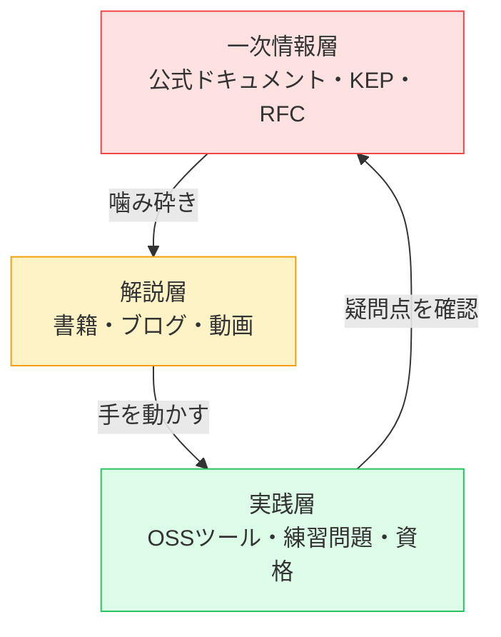
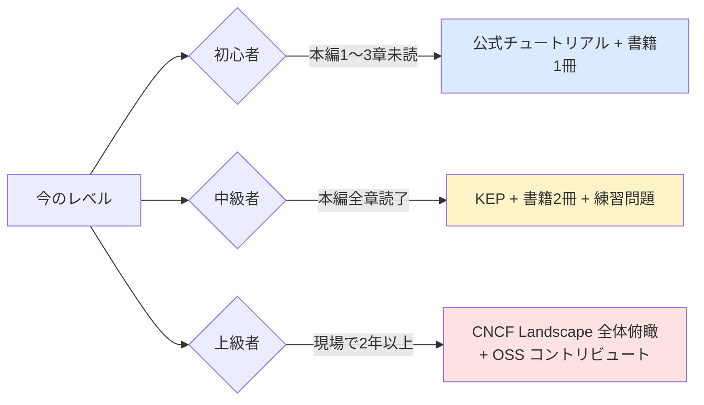
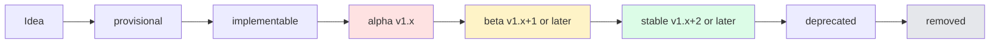
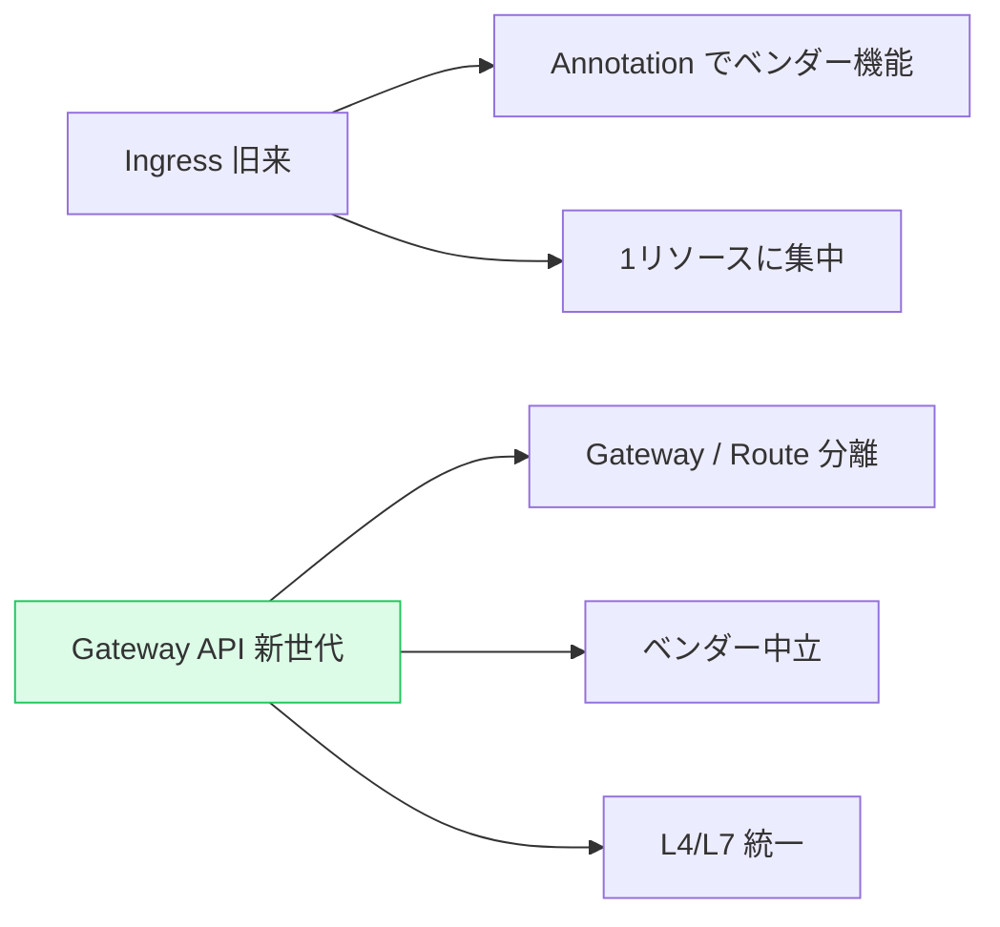
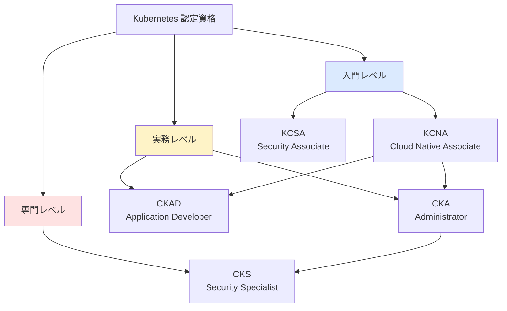
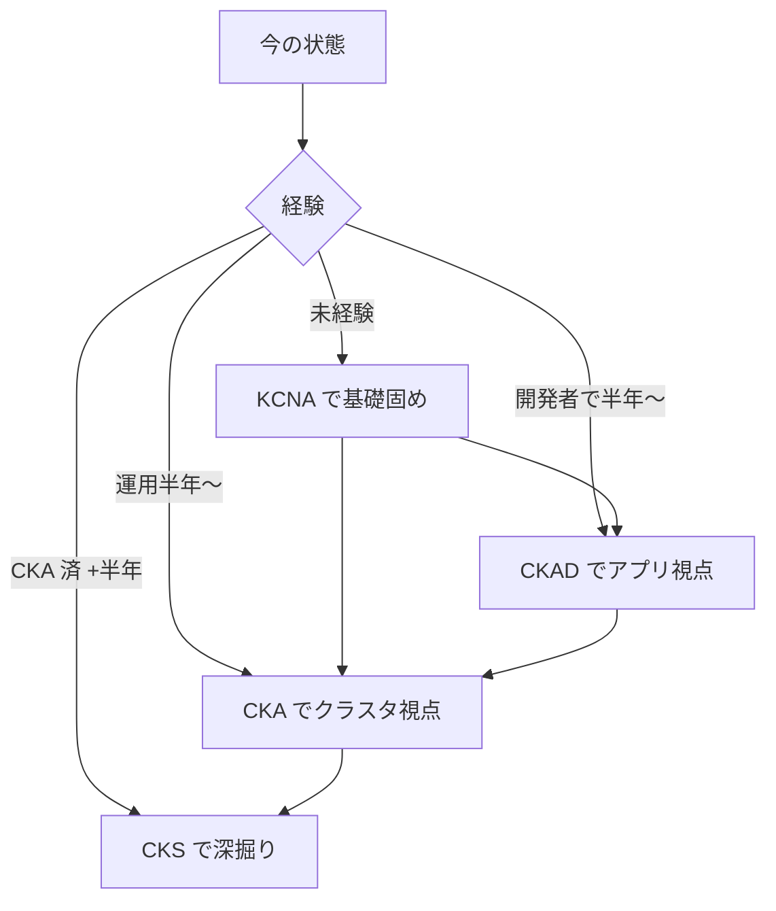
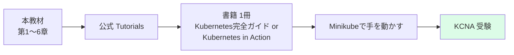
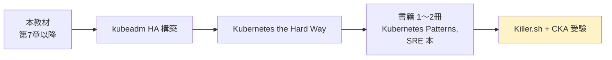
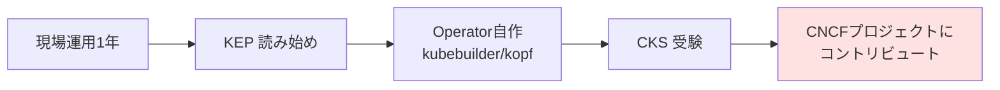
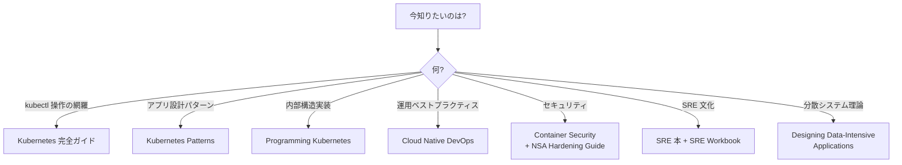

# 参考文献・リンク集
{: .no_toc }

## 目次
{: .no_toc .text-delta }

1. TOC
{:toc}

---

## このページのゴール

このページを読み終えると、以下を **自分の言葉で説明できる** ようになります。

- Kubernetes 学習における「一次情報層・解説層・実践層」の3層構造を理解し、自分のレベルに応じて適切な層から学べる
- 公式ドキュメント・KEP・CNCF Landscape の使い分けを知り、最新動向を継続して追える
- 各書籍の対象読者・難易度・読み所を知り、自分が次に読むべき1冊を選べる
- 主要 OSS ツールをカテゴリ別に俯瞰し、自分の現場に何を入れるかを判断できる
- CKA / CKAD / CKS / KCNA の認定資格の違いと、自分が目指すべきものを選べる
- 練習問題集 (Killer.sh / Kubernetes the Hard Way 等) で「次に手を動かすこと」を計画できる
- 国内外のコミュニティ・カンファレンスから情報を継続収集できる

---

## 学習リソースの3層構造



### なぜこの順番か

**一次情報層** は最も正確だが、初学者には読みにくい。**解説層** は理解しやすいが、書かれた時期によっては情報が古い。**実践層** は身につくが、背景知識がないと意味が分からない。

迷ったら **一次情報層を先に当たり**、必要に応じて解説層で噛み砕き、最後に実践層で手を動かす ─ という流れが王道です。

### 自分のレベル別: どこから手をつけるか



---

## 公式ドキュメント (一次情報層)

### Kubernetes 公式ドキュメント

- [Kubernetes Documentation](https://kubernetes.io/docs/) — 一次情報。日本語版あり

**位置づけ**: あらゆる疑問の最終回答先。バージョン別に管理されており、`v1.30` の挙動を知りたければ `https://v1-30.docs.kubernetes.io/` などで参照できます。

**主要なセクション**:

| セクション | 内容 | 対象 |
|---|---|---|
| Tasks | 手順書形式の how-to | 「これがやりたい」初心者 |
| Concepts | 概念解説 | 「これは何?」中級者 |
| Tutorials | 連続したチュートリアル | 手を動かしながら学びたい人 |
| Reference | API・kubectl・CLI 詳細 | 細かいフィールドを知りたい人 |
| Setup | クラスタ構築 | インフラ担当 |
| Contribute | ドキュメント貢献ガイド | 還元したい人 |

{: .tip }
> 日本語版は基本的に英語版の翻訳ですが、機械翻訳ではなくコミュニティの手作業翻訳のため、最新版から数ヶ月〜1年遅れる場合があります。正確さが重要な場面では **英語版を一次情報** として参照してください。

### kubectl Reference

- [kubectl Reference](https://kubernetes.io/docs/reference/kubectl/)

**位置づけ**: 全 kubectl サブコマンド・全フラグの網羅的リファレンス。`kubectl <cmd> --help` と同等の内容を Web で読める。

**特に有用なページ**:

- [kubectl Cheat Sheet (公式)](https://kubernetes.io/docs/reference/kubectl/quick-reference/) — 公式版チートシート
- [JSONPath Support](https://kubernetes.io/docs/reference/kubectl/jsonpath/) — JSONPath サブセットの仕様
- [kubectl Conventions](https://kubernetes.io/docs/reference/kubectl/conventions/) — 開発者向けの設計指針

### Kubernetes API Reference

- [Kubernetes API Reference](https://kubernetes.io/docs/reference/kubernetes-api/)

**位置づけ**: 全リソース型 (Pod, Deployment, …) の全フィールドを網羅。YAML を書きながら「このフィールド何だっけ?」となったら **`kubectl explain` の Web 版** として使える。

**例**: `pods/v1`, `deployments/v1`, `ingresses/v1`, `customresourcedefinitions/v1` などで階層的に参照可能。

### Kubernetes Enhancement Proposals (KEP)

- [Kubernetes Enhancement Proposals](https://github.com/kubernetes/enhancements/tree/master/keps)

**位置づけ**: Kubernetes に新機能を追加する際の **設計ドキュメント** 集積場。各機能が「なぜ必要か」「どう設計したか」「代替案は何があったか」が論文のように書かれています。

**読むメリット**:

- ある機能の **背景にある問題と、なぜその設計に至ったか** が分かる
- alpha / beta / stable の遷移を追えるため、機能の成熟度を判断できる
- 自分が機能提案する際の参考になる

**例**:

- [KEP-277: Ephemeral Containers](https://github.com/kubernetes/enhancements/tree/master/keps/sig-node/277-ephemeral-containers)
- [KEP-1287: In-place Update of Pod Resources](https://github.com/kubernetes/enhancements/tree/master/keps/sig-node/1287-in-place-update-pod-resources)
- [KEP-2799: Reduction of Secret-based Service Account Tokens](https://github.com/kubernetes/enhancements/tree/master/keps/sig-auth/2799-reduction-of-secret-based-service-account-tokens)



### CNCF Landscape

- [CNCF Landscape](https://landscape.cncf.io/) — 周辺ツール俯瞰

**位置づけ**: Cloud Native Computing Foundation が管理する、クラウドネイティブエコシステムの全体地図。**1700+ プロジェクト・1500+ 企業** がカテゴリ別に並ぶ巨大な俯瞰図。

**主要カテゴリ**:

- App Definition and Development (CI/CD, Database, Streaming)
- Orchestration & Management (Scheduling, Coordination, Service Proxy)
- Runtime (Container Runtime, Storage, Cloud Native Network)
- Provisioning (Automation, Container Registry, Security)
- Observability and Analysis (Monitoring, Logging, Tracing)
- Serverless

**使い方**: 「ログ集約ツール何があるんだっけ?」となったら Landscape で `Observability > Logging` セクションを眺めて選択肢を把握する。GitHub スター数・成熟度 (Graduated / Incubating / Sandbox) も併記されているので比較しやすい。

### Cloud Native Glossary

- [CNCF Cloud Native Glossary](https://glossary.cncf.io/) — クラウドネイティブ用語集

**位置づけ**: 「Service Mesh とは?」「GitOps とは?」のような用語を、各社の独自定義ではなく **CNCF コミュニティ合意の定義** で読める。プレゼン資料を作るときに便利。

### Production-Grade Container Orchestration

- [Production-Grade Container Orchestration (Kubernetes 公式)](https://kubernetes.io/case-studies/) — 各社の事例

**位置づけ**: Google, Spotify, Tinder, OpenAI など、企業の本番事例集。アーキテクチャ図・苦労した点が掲載されている。技術選定の参考や、「自分の規模だと何を選ぶか」の判断材料に。

---

## 書籍 (解説層)

### 入門〜中級者向け

#### 『Kubernetes 完全ガイド 第3版』(青山真也)

- **対象**: 入門〜中級
- **特徴**: 日本語で書かれた最も網羅的な Kubernetes 本。日本国内では事実上の標準教科書
- **読み所**: kubectl 操作・各リソースの YAML 仕様を辞書的に引ける。第3版で v1.26 まで対応
- **使い方**: 通読より、本教材を進めながら詳細を引きに行く辞書として
- **目次抜粋**:
  - Kubernetes の概要
  - Workloads APIs カテゴリ (Pod, ReplicaSet, Deployment, …)
  - Service APIs カテゴリ
  - Config & Storage APIs カテゴリ
  - Cluster APIs カテゴリ
  - Metadata APIs カテゴリ
  - リソース管理
  - ヘルスチェック
  - メンテナンスとノードの停止
  - 高度で安全なスケジューリング
  - セキュリティ
  - マニフェスト管理 (Kustomize/Helm)
  - モニタリング・ロギング・トラブルシューティング

#### 『しくみがわかる Kubernetes Azure 編』(真壁 徹 / 山田 浩貴)

- **対象**: 入門〜中級・Azure 利用者
- **特徴**: Azure Kubernetes Service (AKS) を題材に、内部構造を解説
- **本教材との相性**: 本教材は AKS を使わないが、「クラウドマネージドだとどうなるか」を知るのに有用

#### 『Kubernetes in Action 2nd ed.』(Marko Lukša)

- **対象**: 入門〜上級
- **特徴**: 英語圏のベストセラー。説明が丁寧で、初学者にも読める。1版は v1.x の古い情報。2版で v1.20+ に対応
- **読み所**:
  - Pod の lifecycle の図解が秀逸
  - StatefulSet の必要性が分かりやすい
  - Volume の挙動が深く書かれている

#### 『The Kubernetes Book』(Nigel Poulton)

- **対象**: 入門
- **特徴**: コンパクトで読みやすい。年1回程度更新されており、最新情報をキャッチアップしやすい
- **読み所**: 各章末の Quick Test が学習効果を高める

### 中級〜上級向け

#### 『Programming Kubernetes』(Michael Hausenblas / Stefan Schimanski)

- **対象**: 中級〜上級・Operator や Controller を書きたい人
- **特徴**: Go で Controller / Operator を書く際の必読書。client-go・controller-runtime の使い方を実装レベルで解説
- **読み所**:
  - Custom Resource Definitions (CRD) の設計
  - Reconciliation loop の実装パターン
  - Informer / Lister の仕組み

#### 『Kubernetes Patterns 2nd ed.』(Bilgin Ibryam / Roland Huß)

- **対象**: 中級〜上級
- **特徴**: 「Kubernetes 上でアプリをどう設計するか」のパターン集。設計パターン本の Kubernetes 版
- **主要パターン**:
  - Foundational Patterns (Predictable Demands, Declarative Deployment, Health Probe, …)
  - Behavioral Patterns (Batch Job, Periodic Job, Daemon Service, …)
  - Structural Patterns (Init Container, Sidecar, Adapter, Ambassador, …)
  - Configuration Patterns (EnvVar Configuration, Configuration Resource, Immutable Configuration, …)
  - Security Patterns (Process Containment, Network Segmentation, Secret Management, …)
  - Advanced Patterns (Controller, Operator, Elastic Scale, Image Builder, …)

#### 『Cloud Native DevOps with Kubernetes 2nd ed.』(John Arundel / Justin Domingus)

- **対象**: 中級・運用担当
- **特徴**: 開発者と運用者の橋渡し。DevOps 視点で Kubernetes を捉える
- **読み所**: 監視・ロギング・CI/CD・コスト最適化の章

#### 『Kubernetes Security and Observability』(Brendan Creane / Amit Gupta)

- **対象**: 中級〜上級・セキュリティ重視
- **特徴**: セキュリティと可観測性に絞った深堀り
- **読み所**: NetworkPolicy 設計、攻撃手法と防御、Service Mesh での mTLS

### SRE / 運用観点

#### 『Site Reliability Engineering』(Google) — 通称「SRE 本」

- **対象**: 全レベル・運用に関わる全員
- **特徴**: Google SRE チームが執筆。SRE の概念・実践を体系化した古典
- **読み所**:
  - SLI / SLO / Error Budget の定義
  - On-call 文化
  - Postmortem (Blameless)
  - キャパシティプランニング
- **入手**: [https://sre.google/sre-book/table-of-contents/](https://sre.google/sre-book/table-of-contents/) で **無料で読める**

#### 『The Site Reliability Workbook』(Google)

- **対象**: 中級〜上級
- **特徴**: SRE 本の実践編。SLO 設定の具体例・ポストモーテムテンプレート等
- **入手**: [https://sre.google/workbook/table-of-contents/](https://sre.google/workbook/table-of-contents/) で無料

#### 『Database Reliability Engineering』(Laine Campbell / Charity Majors)

- **対象**: DB 運用担当
- **特徴**: Kubernetes 上で DB を運用する際の参考に。Stateful workload の運用論

### コンテナ・OS 基礎

#### 『Container Security』(Liz Rice)

- **対象**: 中級・セキュリティに関心ある人
- **特徴**: コンテナの仕組み (namespace, cgroups, seccomp) から始まり、Kubernetes 上のセキュリティに繋ぐ
- **読み所**:
  - User namespace と root の関係
  - capabilities の細分化
  - AppArmor / SELinux / seccomp

#### 『Working with Containers (LWN.net)』

- **対象**: 全レベル
- **特徴**: Linux カーネル開発者向けのオンラインマガジン LWN.net のコンテナ関連記事。Linux カーネルレベルの仕組みを知るのに最適

---

## ブログ・記事 (解説層)

### 公式系

#### Kubernetes Blog

- [Kubernetes Blog](https://kubernetes.io/blog/)

**位置づけ**: 各リリースのリリースノート・新機能解説・コミュニティ動向。リリース直前・直後は要チェック。

**特に重要な記事タイプ**:

- "Kubernetes vX.Y: <コードネーム> Released" ─ 新機能の概要
- "Kubernetes vX.Y: <feature> graduates to <stable/beta>" ─ 機能成熟度の遷移
- "Removals, Deprecations, and Major Changes in Kubernetes vX.Y" ─ 破壊的変更

#### CNCF Blog

- [CNCF Blog](https://www.cncf.io/blog/)

**位置づけ**: CNCF プロジェクト全般。Kubernetes 周辺の OSS (Prometheus, Envoy, etcd, Helm, …) の最新情報。

### サードパーティ

#### learnk8s blog

- [learnk8s blog](https://learnk8s.io/blog) — 図解がわかりやすい

**位置づけ**: 視覚的に分かりやすい記事で有名。「Pod の lifecycle」「Ingress の仕組み」のような概念を、長文 + イラストで丁寧に説明。

#### Datadog Container Report

- [Datadog Container Report](https://www.datadoghq.com/container-report/) — 業界トレンド

**位置づけ**: 年次刊行の「コンテナ・Kubernetes 業界調査レポート」。

- 「Kubernetes クラスタの 50% が <X> を使っている」のような **業界全体の統計** が得られる
- 自分の現場が業界平均からどう乖離しているかの参考に
- 経営層への報告に使える数字の出典として有用

#### Sysdig Cloud-Native Security and Usage Report

- [Sysdig Reports](https://sysdig.com/cloud-native-security-and-usage-report/)

**位置づけ**: コンテナセキュリティの年次レポート。脆弱性傾向・設定ミス傾向。

#### A Cloud Guru / Kelsey Hightower's Twitter

- [@kelseyhightower](https://twitter.com/kelseyhightower)

**位置づけ**: Kubernetes 創成期からのエキスパート。短文だが思想的に深いツイートが多い。フォロー必須。

#### SREcon の発表アーカイブ

- [SREcon 発表アーカイブ](https://www.usenix.org/conferences/byname/925)

**位置づけ**: SRE の年次カンファレンス。動画・スライドが公開される。本番運用の生々しい事例集。

### 日本語ブログ

- [Kubernetes 関連の Zenn 記事](https://zenn.dev/topics/kubernetes)
- [Qiita の Kubernetes タグ](https://qiita.com/tags/kubernetes)
- [メルカリエンジニアブログ](https://engineering.mercari.com/blog/tags/Kubernetes/) ─ メルカリの実運用事例
- [DeNA TechBlog](https://engineering.dena.com/blog/) ─ Kubernetes 大規模運用事例
- [Z Lab エンジニアブログ](https://blog.zlab.co.jp/) ─ Kubernetes 専業企業
- [Sansan TechBlog](https://buildersbox.corp-sansan.com/) ─ プロダクト運用事例
- [LINE Engineering Blog](https://engineering.linecorp.com/ja/blog/) ─ 大規模クラスタ運用

---

## 動画・カンファレンス (解説層)

### 動画

#### TGI Kubernetes (Joe Beda)

- [TGI Kubernetes (YouTube)](https://www.youtube.com/playlist?list=PL7bmigfV0EqQzxcNpmcdTJ9eFRPBe-iZa)

**位置づけ**: Kubernetes 共同創設者の一人 Joe Beda による解説動画シリーズ。Kubernetes の **内部実装** をライブコーディング形式で深掘り。中級者以上向け。

#### KubeCon の各回 YouTube プレイリスト

- [CNCF YouTube](https://www.youtube.com/@cncf)

**位置づけ**: 年2回 (北米 + 欧州、別途アジア) 開催される KubeCon の全セッション。膨大すぎるが、Keynote と Maintainer Track だけでも追うと業界動向が把握できる。

**おすすめのトピック分類**:

| トラック | 内容 | 対象 |
|---|---|---|
| Keynote | エコシステム全体の方向性 | 全員 |
| Customizing & Extending Kubernetes | CRD/Operator | 開発者 |
| Networking + Edge | CNI・Service Mesh | ネットワーク担当 |
| Security | 脆弱性・ポリシー | セキュリティ担当 |
| Observability | Prom/Loki/Tempo | SRE |
| Performance & Scalability | 大規模運用 | 大手 |
| Platform Engineering | プラットフォーム化 | プラットフォームチーム |

#### CNCF Tech Talks

- [CNCF Tech Talks (YouTube)](https://www.youtube.com/playlist?list=PLj6h78yzYM2OZ1Tugw5GLh-XOeAg6t_FX)

**位置づけ**: CNCF が定期開催する1時間枠の技術トーク。KubeCon ほど混雑せず、1テーマを深掘り。

### 国内カンファレンス

#### CloudNative Days Tokyo / Kansai / Summer

- [CloudNative Days](https://cloudnativedays.jp/)

**位置づけ**: 日本最大のクラウドネイティブカンファレンス。日本語セッションあり。

#### CloudNative Security Conference Japan

- [CloudNative Security Conference Japan](https://cloudnativedays.jp/csj2024/)

**位置づけ**: セキュリティに特化。

#### Kubernetes Meetup Tokyo

- [Kubernetes Meetup Tokyo (Connpass)](https://k8sjp.connpass.com/)

**位置づけ**: 月1〜2回開催される無料勉強会。LT もあるので登壇しやすい。

---

## 主要 OSS ツール (実践層)

### CI/CD・GitOps

#### Argo CD

- [Argo CD](https://argo-cd.readthedocs.io/)

**位置づけ**: GitOps の事実上の標準。Git リポジトリの YAML/Helm/Kustomize を監視し、クラスタに自動 sync。

**特徴**:
- Web UI が充実
- Sync wave で複雑な順序制御が可能
- Multi-cluster 対応
- ApplicationSet で動的にアプリ生成

#### Argo Rollouts

- [Argo Rollouts](https://argo-rollouts.readthedocs.io/)

**位置づけ**: Argo CD と組み合わせる、より高度なリリース管理。Canary / Blue-Green / Progressive Delivery を CR で宣言的に。

#### Argo Workflows

- [Argo Workflows](https://argoproj.github.io/workflows/)

**位置づけ**: Kubernetes 上の Workflow エンジン。DAG を YAML で定義し、Pod として実行。CI/CD 用途以外にも、データパイプライン・MLOps に使える。

#### Argo Events

- [Argo Events](https://argoproj.github.io/events/)

**位置づけ**: イベント駆動で Workflow をトリガー。Webhook・S3 イベント・Kafka 等。

#### Flux

- [Flux](https://fluxcd.io/)

**位置づけ**: Argo CD と双璧をなす GitOps ツール。Flux v2 では Source/Kustomize/Helm/Notification の Controller が分離されており、コンポーネント単位で導入可能。

**Argo CD vs Flux**:

| 観点 | Argo CD | Flux |
|---|---|---|
| UI | 充実 | 限定的 (Weave GitOps で補完) |
| アーキ | モノリシック | モジュラー |
| 学習曲線 | 緩やか | やや急 |
| Helm 対応 | application 定義内 | HelmRelease CR |
| マルチテナント | プロジェクト機能 | Namespace 分離 |

#### Tekton

- [Tekton](https://tekton.dev/)

**位置づけ**: Kubernetes ネイティブな CI パイプライン。Pipeline・Task・PipelineRun が CR として定義される。

#### Jenkins X / Spinnaker

**位置づけ**: 旧来の Jenkins / Spinnaker の Kubernetes 対応版。レガシー資産を持つ企業向け。

#### Helm

- [Helm](https://helm.sh/)

**位置づけ**: Kubernetes 用パッケージマネージャ。YAML のテンプレート化・パラメータ化を担う。

**Kustomize との使い分け**:

| 観点 | Helm | Kustomize |
|---|---|---|
| 仕組み | テンプレート (Go template) | パッチ (Strategic Merge) |
| 学習曲線 | やや急 (テンプレート構文) | 緩やか (YAML のみ) |
| OSS 配布 | Chart として配布が一般的 | あまり配布されない |
| 環境別設定 | values.yaml | overlays/ |
| 推奨 | 他人が使うものを配布する | 自社内のマニフェスト管理 |

#### Helmfile

- [Helmfile](https://github.com/helmfile/helmfile)

**位置づけ**: 複数の Helm Chart を宣言的に管理する上位ツール。

### 可観測性

#### Prometheus

- [Prometheus](https://prometheus.io/)

**位置づけ**: Kubernetes 監視のデファクトスタンダード。pull 型でメトリクス収集、PromQL で集計・アラート。

**エコシステム**:

- [kube-state-metrics](https://github.com/kubernetes/kube-state-metrics) ─ Kubernetes リソース状態をメトリクス化
- [node_exporter](https://github.com/prometheus/node_exporter) ─ ノード OS のメトリクス
- [Alertmanager](https://prometheus.io/docs/alerting/latest/alertmanager/) ─ アラート通知のルーティング
- [Pushgateway](https://github.com/prometheus/pushgateway) ─ 短命ジョブの push 受け

#### prometheus-operator

- [prometheus-operator](https://prometheus-operator.dev/)

**位置づけ**: Prometheus を CR (Prometheus/ServiceMonitor/PodMonitor) で管理。GitOps と相性が良い。

#### kube-prometheus-stack (Helm Chart)

**位置づけ**: Prometheus + Grafana + Alertmanager + 各種 exporter + ダッシュボードがセットになった Helm Chart。本番運用クラスタの可観測性スタックとして広く使われる。

#### Grafana / Loki / Tempo / Mimir

- [Grafana / Loki / Tempo / Mimir](https://grafana.com/)

**位置づけ**: Grafana Labs が提供する観測性スタック。

- **Grafana**: 可視化 UI
- **Loki**: ログ集約 (Prometheus 風)
- **Tempo**: 分散トレース
- **Mimir**: メトリクスの長期保存・水平スケール

#### OpenTelemetry

- [OpenTelemetry](https://opentelemetry.io/)

**位置づけ**: トレース・メトリクス・ログを統一規格で扱うための CNCF プロジェクト。各言語の SDK + OpenTelemetry Collector で構成。**ベンダーロックインを避ける標準化** が目的。

#### Jaeger

- [Jaeger](https://www.jaegertracing.io/)

**位置づけ**: Uber 発の分散トレース。OpenTelemetry の前身。

#### Pyrra / Sloth (SLO ツール)

- [Pyrra](https://github.com/pyrra-dev/pyrra)
- [Sloth](https://sloth.dev/)

**位置づけ**: SLO 定義から Burn rate アラートを自動生成。SRE 本の数式を手で書かなくて済む。

#### Vector / Fluent Bit / Fluentd

**位置づけ**: ログ収集エージェント。

- **Vector**: Rust 製。性能良好。新興
- **Fluent Bit**: C 製。軽量。CNCF Graduated
- **Fluentd**: Ruby 製。プラグイン豊富。CNCF Graduated

#### kubernetes-event-exporter

- [kubernetes-event-exporter](https://github.com/resmoio/kubernetes-event-exporter)

**位置づけ**: Kubernetes Events を Slack / Elasticsearch / Kafka 等へ転送。クラスタイベントを記録・通知。

### セキュリティ

#### Kyverno

- [Kyverno](https://kyverno.io/)

**位置づけ**: Kubernetes ネイティブなポリシーエンジン。**YAML だけでポリシーを書ける** のが OPA Gatekeeper との差別化点。

**ポリシー例**:

```yaml
apiVersion: kyverno.io/v1
kind: ClusterPolicy
metadata:
  name: require-resources
spec:
  validationFailureAction: Enforce
  rules:
  - name: validate-resources
    match:
      any:
      - resources:
          kinds: [Pod]
    validate:
      message: "Resources Requests/Limits は必須"
      pattern:
        spec:
          containers:
          - resources:
              requests:
                memory: "?*"
                cpu: "?*"
```

#### OPA Gatekeeper

- [OPA Gatekeeper](https://open-policy-agent.github.io/gatekeeper/)

**位置づけ**: Open Policy Agent (OPA) を Kubernetes Admission Controller として使う。**Rego** 言語でポリシーを書く。

**Kyverno vs Gatekeeper**:

| 観点 | Kyverno | Gatekeeper |
|---|---|---|
| 言語 | YAML | Rego (専用言語) |
| 学習曲線 | 緩やか | 急 |
| ポリシー記述力 | YAML の範囲 | より複雑な論理 |
| 普及度 | 急上昇 | 古参 |
| 用途 | 多くの場面で十分 | 複雑な業務ルール |

#### Falco

- [Falco](https://falco.org/)

**位置づけ**: コンテナ・ホストの **ランタイム挙動を監視** する。eBPF or kernel module でシステムコールを観察し、異常を検知。

**検知例**:

- `Shell が起動された`
- `特権コンテナが /etc/passwd を読んだ`
- `予期せぬ outbound 通信`

#### Trivy

- [Trivy](https://trivy.dev/) — Aqua Security

**位置づけ**: イメージ・IaC ファイル・Kubernetes マニフェスト・SBOM の脆弱性スキャナ。**CI に組み込む定番**。

```bash
# イメージスキャン
trivy image nginx:1.27

# Kubernetes クラスタスキャン
trivy k8s --report summary cluster

# IaC スキャン
trivy config ./terraform/
```

#### Grype / Syft (Anchore)

**位置づけ**: Trivy の対抗ツール。SBOM (Software Bill of Materials) 生成 に強み。

#### cosign / Sigstore

- [cosign / Sigstore](https://www.sigstore.dev/)

**位置づけ**: イメージ・成果物の署名と検証。Linux Foundation のプロジェクト。

```bash
# 鍵なしで OIDC 経由で署名 (keyless signing)
cosign sign 192.168.56.10:5000/todo-api:0.1.0

# 検証
cosign verify --certificate-identity=... 192.168.56.10:5000/todo-api:0.1.0
```

#### External Secrets Operator (ESO)

- [External Secrets Operator](https://external-secrets.io/)

**位置づけ**: AWS Secrets Manager / HashiCorp Vault / Azure Key Vault などの外部 Secret ストアを Kubernetes の Secret に同期する Operator。

#### Sealed Secrets

- [Sealed Secrets](https://sealed-secrets.netlify.app/)

**位置づけ**: 公開鍵で暗号化された SealedSecret を Git にコミット → クラスタ内で復号して Secret に。GitOps と相性◎。

#### SOPS

- [SOPS (Mozilla)](https://github.com/getsops/sops)

**位置づけ**: ファイル単位の暗号化。YAML/JSON/ENV ファイルの値だけを暗号化できる。age / PGP / KMS と統合。

#### Vault Agent / CSI Provider

**位置づけ**: HashiCorp Vault を Kubernetes に統合。Pod の Init Container で Secret を取得、または CSI volume として注入。

#### kube-bench

- [kube-bench](https://github.com/aquasecurity/kube-bench)

**位置づけ**: CIS Kubernetes Benchmark の自動チェックツール。CI で定期実行。

#### kubeaudit

- [kubeaudit](https://github.com/Shopify/kubeaudit)

**位置づけ**: Shopify 発のセキュリティ監査ツール。YAML や稼働中クラスタの危険な設定を検出。

### Service Mesh

#### Istio

- [Istio](https://istio.io/)

**位置づけ**: 最も機能豊富な Service Mesh。Envoy を sidecar として注入し、L7 トラフィック管理・mTLS・観測性を提供。

**主要機能**:
- Traffic Management (Virtual Service, Destination Rule, Gateway)
- Security (Authorization Policy, PeerAuthentication)
- Observability (Kiali, Prometheus integration)
- 1.20+ では Ambient mode (sidecar 不要モード) も提供

#### Linkerd

- [Linkerd](https://linkerd.io/)

**位置づけ**: 軽量・高速な Service Mesh。Rust 製のデータプレーンが特徴。

**Istio vs Linkerd**:

| 観点 | Istio | Linkerd |
|---|---|---|
| 機能 | 豊富 (L7 全部入り) | 必要十分に絞っている |
| 性能 | やや重い | 軽量 |
| 学習曲線 | 急 | 緩やか |
| 適合 | エンタープライズ | スタートアップ・中規模 |

#### Cilium Service Mesh

- [Cilium](https://cilium.io/)

**位置づけ**: eBPF ベースの CNI が Service Mesh 機能も持つ。Sidecar なしでも mTLS や L7 ポリシーが可能。性能良好。

#### Consul Connect

**位置づけ**: HashiCorp Consul の Service Mesh 機能。Kubernetes 外のサービス (VM 等) と統合する場合に強み。

### Operator

#### Operator Framework

- [Operator Framework](https://operatorframework.io/)

**位置づけ**: Red Hat 発の Operator 開発スタック。Operator SDK で雛形生成。

#### kubebuilder

- [kubebuilder](https://kubebuilder.io/) — Operator自作の標準

**位置づけ**: Kubernetes 公式の Operator 開発フレームワーク。Go 言語。CRD・Controller の雛形を自動生成。

#### kopf

- [kopf](https://kopf.readthedocs.io/) — Pythonで自作

**位置づけ**: Python で Operator を書ける軽量フレームワーク。Go を書きたくない場合に。

#### Operator Hub

- [OperatorHub.io](https://operatorhub.io/)

**位置づけ**: 既存 Operator のカタログ。インフラ系 OSS のほとんどが Operator として登録されている。

### 代表的な Operator

#### CloudNativePG

- [CloudNativePG](https://cloudnative-pg.io/)

**位置づけ**: PostgreSQL の本格的な Operator。**HA・バックアップ・PITR・モニタリング・rolling update を CR で完全自動化**。

本教材のサンプルアプリで PostgreSQL を本格運用するなら、これを使うのが現時点での推奨。

#### Strimzi (Apache Kafka)

- [Strimzi](https://strimzi.io/)

**位置づけ**: Apache Kafka の Operator。Kafka を Kubernetes 上で本格運用する場合の事実上の標準。

#### prometheus-operator

- [prometheus-operator](https://prometheus-operator.dev/)

**位置づけ**: 前述。Prometheus / Alertmanager / ServiceMonitor を CR で管理。

#### Redis Operator (Spotahome / OT-CONTAINER-KIT)

**位置づけ**: Redis Sentinel/Cluster を Operator で。

#### Elastic Cloud on Kubernetes (ECK)

**位置づけ**: Elasticsearch / Kibana / APM を Operator で。Elastic 公式。

#### Crossplane

- [Crossplane](https://www.crossplane.io/)

**位置づけ**: クラウドリソース (AWS RDS, GCP Cloud Storage 等) を **Kubernetes API で管理**。Terraform の代替候補。

### 開発・運用ツール

#### k9s

- [k9s](https://k9scli.io/) — TUI

**位置づけ**: ターミナルで動く高機能 UI。`kubectl get pods` の見栄えがインタラクティブに。ショートカット豊富。

#### Lens / OpenLens

- [Lens](https://k8slens.dev/) — IDE

**位置づけ**: デスクトップアプリ。複数クラスタを GUI で管理。OpenLens は OSS フォーク版。

#### Headlamp

- [Headlamp](https://headlamp.dev/) — OSS UI

**位置づけ**: CNCF Sandbox プロジェクト。Web UI とデスクトップ版両対応の OSS Dashboard。

#### Stern

- [Stern](https://github.com/stern/stern) — マルチPodログ

**位置づけ**: 複数 Pod のログを色分けして並べる。`kubectl logs -l` よりずっと見やすい。

#### kubectx / kubens

- [kubectx / kubens](https://github.com/ahmetb/kubectx)

**位置づけ**: コンテキスト・Namespace 切替のショートカット。プロのエンジニアなら必ず入れている。

#### krew

- [krew](https://krew.sigs.k8s.io/) — kubectl plugin manager

**位置づけ**: kubectl プラグインのインストーラ。`kubectl krew install <plugin>` で多数の拡張を導入できる。

#### kustomize

- [kustomize](https://kustomize.io/)

**位置づけ**: マニフェストの環境別カスタマイズ。v1.21+ で `kubectl -k` として標準統合。

#### kubefwd

- [kubefwd](https://github.com/txn2/kubefwd)

**位置づけ**: 全 Service をローカルに port-forward + /etc/hosts 書き換え。ローカル開発で「クラスタ内サービス名でアクセス」が可能に。

#### telepresence

- [telepresence](https://www.telepresence.io/)

**位置づけ**: ローカル開発機を「クラスタ内 Pod の代わり」として接続する。デバッグ時に強力。

#### kind

- [kind](https://kind.sigs.k8s.io/)

**位置づけ**: Docker コンテナ内に Kubernetes クラスタを立てる。CI で軽量に Kubernetes を起動するのに最適。

#### k3s / k3d

- [k3s](https://k3s.io/) / [k3d](https://k3d.io/)

**位置づけ**: Rancher 製の軽量 Kubernetes。エッジ・IoT・開発用途。k3d は k3s を Docker 上で動かす。

#### minikube

- [minikube](https://minikube.sigs.k8s.io/)

**位置づけ**: 本教材の第1〜6章で使う、定番のローカル Kubernetes。

#### docker-desktop の Kubernetes

**位置づけ**: macOS/Windows の Docker Desktop 内蔵 Kubernetes。手軽だが Linux ホストとは挙動が異なる場合あり。

### ストレージ・バックアップ

#### Velero

- [Velero](https://velero.io/)

**位置づけ**: クラスタリソース + PV のバックアップ・リストア・移行ツール。本番運用クラスタには必須級。

#### Longhorn

- [Longhorn](https://longhorn.io/)

**位置づけ**: Rancher Labs 製の分散ブロックストレージ。CNCF Incubating。

#### Rook (Ceph)

- [Rook](https://rook.io/)

**位置づけ**: Ceph を Kubernetes 上で運用する Operator。本格的な分散ストレージ。

#### MinIO

- [MinIO](https://min.io/)

**位置づけ**: S3 互換のオブジェクトストレージ。バックアップ先・ログ保管先に。

### ネットワーク・CNI

#### Calico

- [Calico](https://www.tigera.io/project-calico/)

**位置づけ**: 本教材で採用する CNI。BGP ベースの L3 ネットワーキング。NetworkPolicy フル対応。

#### Cilium

- [Cilium](https://cilium.io/)

**位置づけ**: eBPF ベース。性能・観測性・L7 ポリシーで先進的。CNCF Graduated (2023年)。Service Mesh 機能も。

#### Flannel

**位置づけ**: シンプルな CNI。学習用 OK だが NetworkPolicy 非対応のため本番非推奨。

### Ingress Controller

#### NGINX Ingress Controller

- [NGINX Ingress Controller (Kubernetes 公式版)](https://github.com/kubernetes/ingress-nginx)

**位置づけ**: 本教材で採用。最も普及している。

{: .warning }
> 「ingress-nginx」(Kubernetes 公式) と「nginx-ingress」(F5/NGINX 社版) は別物です。混同しないように。

#### Traefik

- [Traefik](https://traefik.io/)

**位置づけ**: 自動構成が強み。ダッシュボード付き。

#### HAProxy Ingress

**位置づけ**: パフォーマンス重視。本教材の k8s-lb でも HAProxy を使用。

#### Contour

- [Contour](https://projectcontour.io/)

**位置づけ**: VMware (Tanzu) 製。Envoy ベース。CNCF Incubating。

#### Gateway API

- [Gateway API](https://gateway-api.sigs.k8s.io/)

**位置づけ**: Ingress の後継として開発中の標準 API。Gateway / HTTPRoute / TCPRoute などの新リソース。v1.0 が 2023年に到達。



---

## ベンチマーク・標準 (実践層)

### CIS Kubernetes Benchmark

- [CIS Kubernetes Benchmark](https://www.cisecurity.org/benchmark/kubernetes)

**位置づけ**: 業界標準のセキュリティ設定チェック。100+ 項目。

**主要セクション**:

1. Control Plane Components (kube-apiserver / scheduler / controller-manager / etcd の設定)
2. etcd (etcd 自体のセキュリティ)
3. Control Plane Configuration (管理用途)
4. Worker Nodes (kubelet 設定・ファイルパーミッション)
5. Policies (RBAC・Pod Security・NetworkPolicy)

### kube-bench

- [kube-bench](https://github.com/aquasecurity/kube-bench)

**位置づけ**: CIS Benchmark を自動チェック。

### NSA / CISA Kubernetes Hardening Guidance

- [NSA Kubernetes Hardening Guide](https://media.defense.gov/2022/Aug/29/2003066362/-1/-1/0/CTR_KUBERNETES_HARDENING_GUIDANCE_1.2_20220829.PDF)

**位置づけ**: 米国家安全保障局が発行する Kubernetes セキュリティガイダンス。

### SLSA

- [SLSA](https://slsa.dev/) — サプライチェーンセキュリティ

**位置づけ**: ソフトウェアサプライチェーンセキュリティのレベル定義 (L1〜L4)。SolarWinds 事件以降に重要視。

### 12-Factor App

- [12-Factor App](https://12factor.net/)

**位置づけ**: クラウドネイティブアプリの12箇条 (Heroku 発祥, 2011)。Kubernetes 設計の前提知識。

**12箇条**:

1. Codebase (1つのコードベース → 多デプロイ)
2. Dependencies (依存関係の明示的宣言と分離)
3. Config (設定を環境変数に外出し)
4. Backing services (バッキングサービスをアタッチドリソースとして扱う)
5. Build, release, run (ビルド・リリース・実行の厳密な分離)
6. Processes (1つ以上のステートレスプロセスでアプリを実行)
7. Port binding (ポートバインディングを通じてサービスを公開)
8. Concurrency (プロセスモデルによるスケールアウト)
9. Disposability (高速な起動と Graceful shutdown)
10. Dev/prod parity (開発・本番の差異を最小化)
11. Logs (ログをイベントストリームとして扱う)
12. Admin processes (管理タスクを一度限りのプロセスとして実行)

### CNCF TAG Security

- [CNCF TAG Security Whitepapers](https://github.com/cncf/tag-security/tree/main/community/resources)

**位置づけ**: CNCF Technical Advisory Group がまとめた、クラウドネイティブセキュリティの各種ホワイトペーパー。

---

## 練習問題集・実機演習 (実践層)

### Killer.sh

- [Killer.sh](https://killer.sh/) — CKAD/CKA/CKS の模擬試験

**位置づけ**: 認定資格の模擬試験プロバイダ。**CKA/CKAD/CKS の試験申し込み特典として2回まで無料** で利用可能。

実試験より難しめなので、Killer.sh で 60% 取れれば本試験は突破できる、というのが定説。

### Kubernetes the Hard Way (Kelsey Hightower)

- [Kubernetes the Hard Way](https://github.com/kelseyhightower/kubernetes-the-hard-way) — 自分でクラスタを組む

**位置づけ**: Kubernetes をマネージドや kubeadm に頼らず、コンポーネントを **1つずつ手動で構築** するチュートリアル。

**なぜ重要か**: 全コンポーネントの動作・関係性を「実装レベル」で理解できる。本教材の kubeadm を一段深く知るための補完教材。

### KodeKloud

- [KodeKloud](https://kodekloud.com/)

**位置づけ**: 認定資格対策の有料コース + 練習問題環境。`kubectl` を実機で叩く問題集。

### Play with Kubernetes

- [Play with Kubernetes (PWK)](https://labs.play-with-k8s.com/)

**位置づけ**: ブラウザで4時間限定で使える無料 Kubernetes 環境。とりあえず触ってみたい場合に。

### Katacoda (現在は Strigo/Instruqt に移行)

**位置づけ**: ブラウザ完結の対話型チュートリアル。提供元が変わったが類似サービスは複数存在。

### Awesome Kubernetes

- [Awesome Kubernetes](https://github.com/ramitsurana/awesome-kubernetes) — リソース集

**位置づけ**: 有名な「awesome-*」シリーズの Kubernetes 版。さらにリソースを探したい場合に。

---

## 認定資格

### 認定資格マップ



### CKA (Certified Kubernetes Administrator)

- **対象**: クラスタ運用担当
- **形式**: 完全実機。`kubectl` を叩いて課題を解く
- **時間**: 2時間 / 17問程度 / 合格点 66%
- **試験範囲**:
  - クラスタアーキテクチャ・インストール・設定 (25%)
  - ワークロード・スケジューリング (15%)
  - サービス・ネットワーキング (20%)
  - ストレージ (10%)
  - トラブルシューティング (30%)
- **本教材との対応**: 第7章以降のクラスタ運用パートと完全に重なる

### CKAD (Certified Kubernetes Application Developer)

- **対象**: アプリ開発者・Pod/Deployment/Service を設計する人
- **形式**: 完全実機
- **時間**: 2時間 / 16問程度 / 合格点 66%
- **試験範囲**:
  - アプリケーション設計とビルド (20%)
  - アプリケーションデプロイ (20%)
  - アプリケーションの観測性・メンテナンス (15%)
  - アプリケーション環境・設定・セキュリティ (25%)
  - サービスとネットワーキング (20%)
- **本教材との対応**: 第2〜6章の Pod/Deployment/Service/ConfigMap/Secret に重なる

### CKS (Certified Kubernetes Security Specialist)

- **対象**: セキュリティ専門家。**CKA 取得が前提**
- **形式**: 完全実機
- **時間**: 2時間 / 15-20問 / 合格点 67%
- **試験範囲**:
  - クラスタセットアップ (10%)
  - クラスタハードニング (15%)
  - システムハードニング (15%)
  - マイクロサービス脆弱性最小化 (20%)
  - サプライチェーンセキュリティ (20%)
  - 監視・ロギング・ランタイムセキュリティ (20%)
- **本教材との対応**: 本教材の終盤(セキュリティ章)に重なる

### KCNA (Kubernetes and Cloud Native Associate)

- **対象**: 入門者・営業職・PM など、技術概念を知りたい人
- **形式**: 多肢選択 (60問 / 90分)
- **合格点**: 75%
- **試験範囲**:
  - Kubernetes 基礎 (46%)
  - コンテナオーケストレーション (22%)
  - クラウドネイティブアーキテクチャ (16%)
  - クラウドネイティブの可観測性 (8%)
  - クラウドネイティブアプリの提供 (8%)
- **本教材との対応**: 第1章の入門部分・概念解説に重なる

### KCSA (Kubernetes and Cloud Native Security Associate)

- **対象**: セキュリティ入門者
- **2023年に新設**

### その他

- **PCA (Prometheus Certified Associate)** ─ Prometheus 専門
- **CCA (Cilium Certified Associate)** ─ Cilium 専門
- **CAPA (Argo Project Associate)** ─ Argo CD/Workflows 専門
- **イスティオ認定** ─ Istio 専門 (新設準備中)

### 受験戦略



**割引情報**:
- CNCF が定期的に「30% OFF」「2試験パック割引」等のキャンペーンを実施
- KubeCon 参加者向け割引あり
- 学生プログラム (CNCF.io/training-students)

---

## コミュニティ

### グローバル

- [Kubernetes Slack](https://kubernetes.slack.com/) — 公式 Slack。100+ チャンネル
- [k8s discuss (Forum)](https://discuss.kubernetes.io/) — フォーラム
- [Kubernetes Special Interest Groups (SIGs)](https://github.com/kubernetes/community/blob/master/sig-list.md) — 機能領域別の作業グループ。コントリビュート入口
- [Kubernetes Contributor Site](https://www.kubernetes.dev/) — コントリビュータ向け情報集約

### 主要 SIG

| SIG | 領域 |
|---|---|
| sig-api-machinery | API Server, etcd |
| sig-apps | Deployment, StatefulSet, Job |
| sig-auth | 認証認可 |
| sig-cli | kubectl |
| sig-cluster-lifecycle | kubeadm, cluster API |
| sig-network | Service, NetworkPolicy, Gateway API |
| sig-node | kubelet, runtime |
| sig-scheduling | スケジューラ |
| sig-storage | CSI, PV/PVC |
| sig-instrumentation | metrics, logging, tracing |
| sig-security | セキュリティ全般 |

### 日本

- [Kubernetes Japan Slack](https://kubernetes.slack.com/) (`#jp-users` チャンネル)
- [Cloud Native Japan Meetup](https://cloudnative.connpass.com/)
- [Kubernetes Meetup Tokyo (Connpass)](https://k8sjp.connpass.com/)
- [Kubernetes Novice Tokyo](https://k8s-novice-jp.connpass.com/) ─ 初心者向け
- [Japan Container Days](https://containerdays.jp/) (現 CloudNative Days)

---

## 雑誌・ニュースレター

- [KubeWeekly (CNCF)](https://www.cncf.io/kubeweekly/) ─ 週刊ニュースレター。無料
- [The New Stack](https://thenewstack.io/) ─ クラウドネイティブ専門メディア
- [InfoQ](https://www.infoq.com/) ─ Kubernetes セクションあり
- [CNCF Newsletters](https://www.cncf.io/newsroom/newsletter/) ─ CNCF 公式

---

## ポッドキャスト

- [Kubernetes Podcast from Google](https://kubernetespodcast.com/) ─ Google 主催。週1更新
- [The New Stack Makers](https://thenewstack.io/podcasts/)
- [PodCTL](https://podctl.com/) ─ Red Hat
- [Cloud Native Compass](https://www.cncf.io/podcasts/) ─ CNCF 公式

---

## Twitter / X で押さえるべきアカウント

| アカウント | 役割 |
|---|---|
| [@kubernetesio](https://twitter.com/kubernetesio) | 公式 |
| [@CloudNativeFdn](https://twitter.com/CloudNativeFdn) | CNCF 公式 |
| [@kelseyhightower](https://twitter.com/kelseyhightower) | Google, Kubernetes エキスパート |
| [@bgrant0607](https://twitter.com/bgrant0607) | Kubernetes 共同設計者 |
| [@thockin](https://twitter.com/thockin) | Networking エキスパート |
| [@lizrice](https://twitter.com/lizrice) | コンテナセキュリティ |
| [@MishraVibhash](https://twitter.com/MishraVibhash) | Argo / GitOps |
| [@aronchick](https://twitter.com/aronchick) | Kubeflow / MLOps |

日本の有名人:
- [@amsy810](https://twitter.com/amsy810) — 青山真也氏 (『Kubernetes 完全ガイド』著者)
- [@superbrothers](https://twitter.com/superbrothers) — Z Lab
- [@chez_shanon](https://twitter.com/chez_shanon)
- [@uesyn](https://twitter.com/uesyn)

---

## 学習ロードマップ提案

### 0〜3ヶ月: 入門



### 3〜9ヶ月: 中級



### 9〜18ヶ月: 上級



### 18ヶ月以上: エキスパート

- SIG ミーティング参加
- KubeCon CFP 採択を狙う
- 社内勉強会主催・登壇
- KEP 発行

---

## 「次に読むべき1冊」フローチャート



最後の "Designing Data-Intensive Applications" (Martin Kleppmann) は Kubernetes 本ではありませんが、**分散システムの理論的背景を学ぶ必読書** として強く推奨します。

---

## 情報の鮮度を保つには

### 月次のルーチン

- [ ] KubeWeekly のニュースレターを読む
- [ ] Kubernetes Blog の新着を確認
- [ ] CNCF Landscape を眺めて新プロジェクトを把握
- [ ] 自分のクラスタの Kubernetes バージョン EOL を確認

### 四半期のルーチン

- [ ] 主要ツール (Helm, Argo CD, Prometheus 等) の changelog
- [ ] CIS Benchmark の最新版を kube-bench で実行
- [ ] 自社版チェックリストの更新

### 年次のルーチン

- [ ] 認定資格の更新 (CKA/CKAD/CKS は3年で失効)
- [ ] KubeCon の主要セッション視聴
- [ ] Datadog Container Report で業界動向把握

---

## 「迷ったらここを見る」短縮版

時間がない人向け。これだけでも押さえる。

| 困ったこと | 開く場所 |
|---|---|
| kubectl の構文 | [公式 Cheat Sheet](https://kubernetes.io/docs/reference/kubectl/quick-reference/) |
| YAML フィールド | `kubectl explain` または [API Reference](https://kubernetes.io/docs/reference/kubernetes-api/) |
| 新機能の動向 | [Kubernetes Blog](https://kubernetes.io/blog/) |
| なぜそうなった | [KEP リポジトリ](https://github.com/kubernetes/enhancements) |
| 周辺ツール選定 | [CNCF Landscape](https://landscape.cncf.io/) |
| 本番事例 | [Kubernetes Case Studies](https://kubernetes.io/case-studies/) |
| セキュリティ標準 | [CIS Benchmark](https://www.cisecurity.org/benchmark/kubernetes) |
| 国内コミュニティ | [Kubernetes Meetup Tokyo](https://k8sjp.connpass.com/) |
| 資格 | [CNCF Training](https://www.cncf.io/training/certification/) |

---

## チェックポイント

ここまでで以下を **自分の言葉で** 説明できるか確認してください。

- [ ] 「一次情報層・解説層・実践層」の3層構造と、各層の代表的なリソースを挙げられる
- [ ] 公式ドキュメント・KEP・CNCF Landscape の使い分けを説明できる
- [ ] 自分のレベル(初心者・中級者・上級者)に応じた書籍を3冊挙げられる
- [ ] CKA・CKAD・CKS・KCNA の違いと、自分が次に取るべき資格を答えられる
- [ ] CNCF Landscape の主要カテゴリと、自分の現場で使っているプロジェクトを位置づけられる
- [ ] Helm と Kustomize の使い分けを説明できる
- [ ] Argo CD と Flux の違いを2つ以上挙げられる
- [ ] Kyverno と OPA Gatekeeper の違いを説明できる
- [ ] Istio・Linkerd・Cilium Service Mesh の使い分けを概観できる
- [ ] 情報の鮮度を保つための月次/四半期/年次ルーチンを設計できる
- [ ] Twitter で押さえるべきアカウントを5つ以上挙げられる
- [ ] 「困ったらここ」の短縮版を頭に入れている

→ ここで本教材は終了です。お疲れさまでした。次は実際の現場で手を動かし、自分の経験を本教材の **付録に追記** していってください。

→ 本編の最初に戻るには [00. はじめに]({{ '/' | relative_url }}) へ
