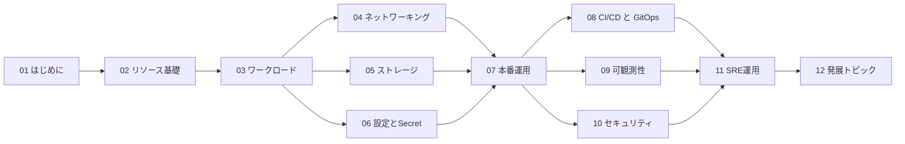

# 入門 Kubernetes
{: .fs-9 }

ローカル完結で、**Kubernetesを実サービスに使えるレベル**まで体系的に学ぶ。
{: .fs-6 .fw-300 }

[学習を始める]({{ '/01-introduction/k8s/' | relative_url }}){: .btn .btn-primary .fs-5 .mb-4 .mb-md-0 .mr-2 }
[GitHubリポジトリ](https://github.com/swallowsaba/introduction-k8s){: .btn .fs-5 .mb-4 .mb-md-0 }

---

## この教材の狙い

世の中のKubernetes入門は「動かしてみた」で終わるものが多く、本番運用で必要な観点が抜け落ちがちです。
本教材は、**Docker入門の延長線上に位置づけ、最終的に自分一人で実サービスをKubernetes上で運用できるようになる** ことをゴールにしています。

3つの方針:

1. **ローカル完結** — クラウドのマネージドK8s(EKS/GKE/AKS)は使いません。Minikubeとkubeadm(VMware Workstation上のVM)だけで全章をやり切ります
2. **一貫したサンプルアプリ** — 「フロント(Nginx) + API(FastAPI) + DB(PostgreSQL)」 + 後半でメッセージキュー(Redis)を足した題材を、章を通じて使い回します。1機能ずつK8sの機能を当てていく形で、**学んだことが繋がる** 構成です
3. **本番相当の運用まで** — Helm/Kustomize、GitOps(Argo CD)、可観測性(Prometheus/Grafana/Loki/OpenTelemetry)、セキュリティ(RBAC/PSS/External Secrets)、SREプラクティス(SLO/障害対応)まで踏み込みます

## 想定読者

- Dockerを触ったことがある
- Kubernetesをこれから業務で使う、または使っているが体系的に学び直したい
- ローカルで完結する形で、しっかり手を動かして学びたい
- インフラ・SRE・バックエンドエンジニア

## 学習環境

ホストPCに 64GB 以上のメモリがあれば全演習を実施できます。128GBあれば余裕です。

| 段階 | 用途 | 必要なリソース |
|------|------|----------------|
| Step1: Minikube | 基礎〜設定 (1〜6章) | RAM 8GB / Disk 20GB |
| Step2: kubeadm on VMware Workstation | 本番運用以降のすべて | VM 4台、合計 RAM 16〜24GB / Disk 200GB |

詳細は [学習環境の準備](01-introduction/setup) で。

## 教材の構成



| 章 | 内容 | ゴール |
|----|------|--------|
| 01. はじめに | K8sの概念、VM/Dockerとの違い、環境構築、サンプルアプリの紹介 | なぜK8sが必要か、何を作るかが分かる |
| 02. リソースの基礎 | クラスタ構造、kubectl、Pod、Deployment、Namespace、Label | 基本リソースを作って壊せる |
| 03. ワークロード | StatefulSet、DaemonSet、Job、Sidecar | 種類を使い分けられる |
| 04. ネットワーキング | Service、Ingress、NetworkPolicy、DNS、Gateway API | 外部公開と内部通信を設計できる |
| 05. ストレージ | Volume、PV/PVC、StorageClass、ステートフル運用 | 永続データを扱える |
| 06. 設定とSecret | ConfigMap、Secret、設計パターン | 環境差を綺麗に扱える |
| 07. 本番運用 | kubeadmで自前クラスタ、Probe、リソース管理、Autoscaling、Helm/Kustomize | 本番運用クラスタを構築・運用できる |
| 08. CI/CDとGitOps | パイプライン、Argo CD、Progressive Delivery | デプロイを自動化できる |
| 09. 可観測性 | Prometheus + Grafana、Loki、OpenTelemetry、SLO | 状態を観測し障害を検知できる |
| 10. セキュリティ | RBAC、Pod Security Standards、イメージ署名、External Secrets | セキュアに運用できる |
| 11. SRE運用 | 障害対応、ポストモーテム、キャパシティ計画、DR、アップグレード | 運用エンジニアとして動ける |
| 12. 発展トピック | Operator、Service Mesh、マルチクラスタ、コスト最適化 | 次のステップに進める |
| 99. 付録 | チートシート、本番チェックリスト、参考文献 | 現場の参照情報 |

## サンプルアプリ

教材を通じて使うサンプルアプリは「**ミニ TODO サービス**」です。
小さいアプリですが、Kubernetes で扱う典型的な要素(ステートレスなWeb/API、永続DB、キャッシュ、非同期ジョブ、外部公開、認証、可観測性)をすべて含めて段階的に拡張していきます。

```
[Browser] -> [Ingress] -> [Nginx (frontend)] -> [FastAPI (api)] -> [PostgreSQL]
                                                       |
                                                       v
                                                  [Redis (cache/queue)]
                                                       ^
                                                       |
                                              [Worker Job (notify)]
```

全コードは [`sample-app/`](https://github.com/swallowsaba/introduction-k8s/tree/main/sample-app) に置いています。

## 進め方

各章は次の構成です。

1. **概念の説明** — なぜそれが必要なのか
2. **手を動かすパート** — Minikube または kubeadm クラスタで実際に動かす
3. **本番での考慮点** — 学習環境では見えにくい運用観点
4. **チェックポイント** — 自分の理解を確認する問い

特に「本番での考慮点」と「チェックポイント」は、**実サービス提供** につなげるために重要です。
読み流さず、自分の言葉で答えられるか確認しながら進めてください。
